# 03 并发编程 · 速记知识图谱（P0-P3）

> 模块定位：高级岗"第一硬通货"，几乎每场都问到见血——**JMM + synchronized + AQS + 线程池 + JUC 容器**五大支柱。考察重点是源码细节、踩坑经验、调参能力。
> 题量：98 题。

```mermaid
flowchart TD
  A[并发编程] --> B[JMM 内存模型]
  A --> C[锁机制]
  A --> D[AQS 与 JUC]
  A --> E[线程池]
  A --> F[线程基础]
  A --> G[并发容器]
  B --> B1[happens-before/8 规则]
  B --> B2[volatile/内存屏障]
  B --> B3[MESI/总线嗅探]
  C --> C1[synchronized 升级]
  C --> C2[ReentrantLock/公平]
  C --> C3[ReadWriteLock/StampedLock]
  D --> D1[AQS state+CLH]
  D --> D2[CountDownLatch/Semaphore/CyclicBarrier]
  D --> D3[CompletableFuture]
  E --> E1[7 参数+4 拒绝]
  E --> E2[execute 流程]
  E --> E3[动态调参 DynamicTp]
  F --> F1[6 种状态流转]
  F --> F2[虚拟线程/Loom]
  F --> F3[ThreadLocal/TTL]
  G --> G1[ConcurrentHashMap]
  G --> G2[CopyOnWrite/阻塞队列]
  G --> G3[Atomic/LongAdder]
```

### P0 必背核心

#### Java 内存模型（JMM）
- **抽象规范，不是物理结构**：JMM 屏蔽各种硬件和操作系统的内存访问差异，给 Java 程序一套统一的并发语义。
- **主内存 + 工作内存**：所有共享变量存在主内存，每个线程有自己的工作内存（CPU 寄存器/L1/L2 cache 的抽象），线程对变量的操作必须先 read/load 到工作内存，修改后再 store/write 回主内存。
- **解决三大问题**：原子性（synchronized/Atomic/CAS）、可见性（volatile/synchronized/final）、有序性（volatile/synchronized/happens-before）。
- **与 MESI 关系**：MESI 是 CPU 缓存一致性协议（硬件层），JMM 是 Java 语言层规范——MESI 解决不了写缓冲区 + 失效队列带来的重排序，JMM 通过内存屏障兜底。
- 关联题：#0553、#0783、#0847

#### happens-before 8 大规则
- **核心**：前一个操作的结果对后一个操作可见，且前一个操作排在后一个之前。
- **8 条规则**：① 程序顺序规则（单线程内按代码顺序）；② 监视器锁规则（unlock happens-before 后续 lock）；③ volatile 规则（写 happens-before 后续读）；④ 传递性；⑤ start 规则（Thread.start happens-before 线程内任意操作）；⑥ join 规则（线程内操作 happens-before 其他线程 join 返回）；⑦ 中断规则（interrupt 调用 happens-before 被中断线程检测到中断）；⑧ 对象终结规则（构造函数 happens-before finalize）。
- **与 as-if-serial 区别**：as-if-serial 只保证**单线程内**结果不变（允许重排序），happens-before 是**多线程间**的可见性和有序性保证。
- 关联题：#0884、#0870

#### volatile 三大语义
- **可见性**：写 volatile 变量时，JMM 强制把工作内存的值刷回主内存，并使其他线程的工作内存中该变量副本失效（基于 CPU 的 lock 前缀指令 + MESI）。
- **有序性**：在 volatile 变量读写前后插入**内存屏障**（StoreStore/StoreLoad/LoadLoad/LoadStore），禁止特定方向的指令重排序。
- **不保证原子性**：`volatile int i; i++` 仍然不是线程安全的——i++ 是 read-modify-write 三步，volatile 只保证每步可见，无法保证整体原子。
- **典型用法**：双重检查锁 DCL 单例的实例字段必须加 volatile，防止 `new Object()` 的"分配内存 / 调构造 / 引用赋值"三步重排序导致拿到半初始化对象。
- 关联题：#0443、#0470、#0822、#0835

#### synchronized 实现原理
- **字节码层**：进入 monitorenter、退出 monitorexit；方法上的 synchronized 由 ACC_SYNCHRONIZED 标志位实现，本质相同。
- **JVM 层**：每个 Java 对象都关联一个 **Monitor**（C++ ObjectMonitor），含 owner、entryList（阻塞队列）、waitSet（wait 集合）、recursions（重入计数）。
- **锁的存储位置**：对象头 **Mark Word**——64 位虚拟机下 Mark Word 64 位，存 hashCode/分代年龄/锁标志位（00 轻量级、10 重量级、01 无锁或偏向）；锁信息根据锁状态变化覆盖 hashCode 等字段。
- **锁的对象**：synchronized 方法锁的是 this（静态方法锁的是 Class 对象），synchronized 块锁的是括号里指定的对象。
- 关联题：#0290、#0512、#0094

#### synchronized 锁升级
- **无锁 → 偏向锁**：第一次 CAS 把当前线程 ID 写入 Mark Word，后续同线程进入只比对 ID 不做 CAS。**JDK 15 默认关闭偏向锁**（JEP 374），JDK 18 废弃，因为收益不足却带来 revoke 暂停。
- **偏向锁 → 轻量级锁**：另一个线程竞争时撤销偏向，升级为轻量级锁——线程在自己栈帧创建 Lock Record，用 CAS 把 Mark Word 指向 Lock Record；失败则自旋。
- **轻量级锁 → 重量级锁**：自旋超过阈值（自适应自旋）或竞争激烈时升级，关联到 ObjectMonitor，未抢到锁的线程被 park 进入 entryList，涉及**用户态到内核态切换**，开销大。
- **锁不可降级**：一旦升级为重量级就不会回到轻量级（CMS 论文中提及可降级但 HotSpot 实现没做）。
- **其他锁优化**：锁消除（JIT 检测到不可能共享的对象去掉同步，如局部 StringBuffer）、锁粗化（连续多个加锁解锁合并为一次）。
- 关联题：#0181、#0319、#0482

#### AQS（AbstractQueuedSynchronizer）
- **核心字段**：volatile int **state**（同步状态，含义由子类定义）+ **CLH 变种双向链表**（同步队列，存等待线程封装的 Node）+ ConditionObject（条件队列）。
- **独占模式 vs 共享模式**：独占（ReentrantLock，state 表示重入次数）一次只有一个线程持有；共享（CountDownLatch/Semaphore/ReadLock）允许多个线程同时持有，state 表示可用许可数。
- **acquire 流程**：tryAcquire 失败 → addWaiter 入队 → acquireQueued 自旋，前驱是 head 就尝试再次 tryAcquire；否则 shouldParkAfterFailedAcquire 检查前驱状态为 SIGNAL 后 park。
- **为什么双向链表**：方便快速判断/移除取消的节点（前驱后继互相维护），head 节点是哨兵，state == 0 时由后继来"接力"唤醒。
- **Condition 条件队列**：每个 Condition 维护单向链表，signal 把节点从条件队列转移到同步队列尾部，重新参与锁竞争。
- 关联题：#0420、#0044、#0782、#0808、#0809

#### ReentrantLock vs synchronized
- **可中断**：ReentrantLock 提供 `lockInterruptibly()`，synchronized 拿不到锁的线程不响应中断。
- **超时获取**：ReentrantLock 提供 `tryLock(timeout)`，避免死锁。
- **公平/非公平**：ReentrantLock 构造器可选公平锁（按 CLH 队列顺序），synchronized 只有非公平（队列里有线程也允许新来的插队抢）。
- **多 Condition**：ReentrantLock 可创建多个 Condition 实现"等待不同条件"，synchronized 只有一个 wait/notify。
- **共同点**：都是可重入、互斥、阻塞锁；synchronized 是 JVM 层关键字，ReentrantLock 是 JUC 类。**性能在 JDK 6 之后差距不大**，优先 synchronized（语法简洁、JVM 自动释放、JIT 优化更成熟）。
- 关联题：#0393、#0381、#0707、#0734

#### ThreadPoolExecutor 7 大参数
- **corePoolSize**：核心线程数，默认不会因为空闲被回收（`allowCoreThreadTimeOut=true` 才回收）。
- **maximumPoolSize**：最大线程数，队列满后才创建到这个数量。
- **keepAliveTime + TimeUnit**：非核心线程空闲超过该时间被回收。
- **workQueue**：阻塞队列，常用 ArrayBlockingQueue（有界）、LinkedBlockingQueue（默认无界，慎用）、SynchronousQueue（不存储）、PriorityBlockingQueue（优先级）。
- **threadFactory**：线程工厂，**生产必须自定义命名**（如 `order-pool-%d`），不然 jstack 全是 pool-1-thread-N 无法定位。
- **handler 拒绝策略**：见下条。
- 关联题：#0108、#0073、#0119

#### 线程池 execute 流程
- ① 工作线程数 < corePoolSize：**直接创建新线程**执行任务（不管现有核心线程是否空闲）；② >= core：尝试入 workQueue；③ 队列满：创建新线程到 maximumPoolSize；④ 还满：执行拒绝策略。
- **关键陷阱**：`LinkedBlockingQueue` 默认无界，永远入队成功 → 永远到不了第 ③ 步 → maximumPoolSize **形同虚设**。这就是 `Executors.newFixedThreadPool` 容易 OOM 的原因。
- **Tomcat 改造**：Tomcat 的 TaskQueue 重写 `offer()`，当线程数 < max 时返回 false 强制扩到 max，先扩容后入队，更适合 IO 密集场景。
- 关联题：#0073、#0767

#### 4 大拒绝策略
- **AbortPolicy**（默认）：直接抛 RejectedExecutionException，调用方需要捕获。
- **CallerRunsPolicy**：让提交任务的线程（如主线程）自己执行，**起到反压作用**——提交线程被占用后无法继续提交，给线程池"喘息"时间。
- **DiscardPolicy**：默默丢弃，不抛异常。
- **DiscardOldestPolicy**：丢弃队列里最老的任务，再次尝试提交。
- **生产建议**：日志类业务用 CallerRunsPolicy 或自定义策略落盘 + 告警；核心链路用 AbortPolicy 让上游感知。
- 关联题：#0753

#### ConcurrentHashMap 实现
- **JDK 1.7**：分段锁 Segment（默认 16 段），每段是一个 ReentrantLock 保护的 HashEntry 数组，并发度 = 段数。
- **JDK 1.8**：**取消 Segment**，结构变为 Node 数组 + 链表 + 红黑树（链长 ≥ 8 且数组长度 ≥ 64 转红黑树，否则只是扩容）。并发控制变为 **CAS + synchronized（锁单个 bucket 的首节点）**——粒度更细，并发度等于桶数。
- **put 流程**：空桶用 CAS 写首节点；有节点用 synchronized 锁首节点后链表/树插入；扩容时多线程协助迁移（ForwardingNode 标记）。
- **为啥用 synchronized 不用 ReentrantLock**：JDK 6 之后 synchronized 已经有锁升级优化，性能不输 ReentrantLock；且 ReentrantLock 每个桶都要建一个对象，内存浪费严重；锁首节点逻辑用 synchronized 表达更简洁。
- **不允许 null key/value**：无法区分"没有这个 key"和"key 存在但 value 是 null"，在并发场景下 get 返回 null 没法用 containsKey 二次验证（containsKey 之间可能被 remove）。
- 关联题：#0115、#0202、#0748、#0779、#0820、#0234

#### CAS 与 ABA
- **CAS**（Compare-And-Swap）：CPU 原语 cmpxchg 指令，原子比较并替换。Java 通过 Unsafe.compareAndSwapXxx 调用，是 Atomic 类、AQS、ConcurrentHashMap 的核心。
- **三大问题**：① ABA（值变回来无法感知）；② 自旋 CPU 开销（高竞争下白转）；③ 只能保证一个变量原子（多变量需要 AtomicReference 包装或加锁）。
- **解决 ABA**：AtomicStampedReference 用版本号；AtomicMarkableReference 用 boolean 标记是否变过。
- **CAS 不一定有自旋**：单次 CAS 调用就是一次比较替换；自旋是"失败后重试"的应用模式，Atomic 类是循环 CAS，但 `Unsafe.getAndSetXxx` 在某些场景下不需要自旋。
- 关联题：#0299、#0413、#0403

#### LongAdder vs AtomicLong
- **AtomicLong**：单个 volatile long + CAS 循环，高并发下大量线程争一个变量，CAS 失败率高。
- **LongAdder**：分段累加思想——内部维护 base + Cell[] 数组，每个线程通过 ThreadLocalRandom 探针 hash 到一个 Cell 上各自累加，最后 `sum()` 时求和。读时不精确（无锁求和会漏更新），但**写性能远超 AtomicLong**。
- **选型**：高并发计数（QPS、统计）选 LongAdder；需要精确实时值或 CAS 流程控制选 AtomicLong。
- 关联题：#0374、#0794

#### ThreadLocal 实现 + 内存泄漏
- **结构**：每个 Thread 对象持有一个 ThreadLocalMap，key 是 ThreadLocal 对象的**弱引用**，value 是强引用。
- **弱引用 key**：避免 ThreadLocal 对象被回收后 map 中的 key 还强引用着它（防止 ThreadLocal 类本身泄漏）。
- **泄漏点**：key 被回收后变 null，**value 还是强引用**——而且 value 通过 Thread → ThreadLocalMap → Entry.value 这条链长期不释放。在线程池中线程长期复用，泄漏更严重。
- **解决方案**：`try-finally` 里调 `remove()` 显式清除；ThreadLocal 内部 get/set/remove 也会顺手清理 key=null 的 Entry，但不彻底。
- **应用场景**：用户上下文（UserContext）、事务管理器、SimpleDateFormat 线程私有副本、链路追踪 traceId、连接管理。
- 关联题：#0579、#0846、#0135、#0364

#### CompletableFuture
- **异步编排**：替代裸 Future（Future.get 阻塞、无回调），支持 thenApply（同步转换）、thenCompose（链式 Future，扁平化）、thenCombine（合并两个 Future）、allOf（等所有）、anyOf（等任一）。
- **底层**：基于**栈式回调链** + ForkJoinPool.commonPool（默认线程池，CPU 核数 - 1，**生产慎用默认池**，应传自定义 Executor）。
- **异常处理**：exceptionally（出错时返回兜底值）、handle（无论成功失败都处理）、whenComplete（消费结果，不改变值）。
- **典型场景**：接口并发调多个下游接口聚合返回——比如商品详情页 RT 从 400ms（串行）降到 150ms（并行）。
- **超时控制**：JDK 9 引入 `orTimeout()`、`completeOnTimeout()`，之前要手动用 ScheduledExecutor 实现。
- 关联题：#0684、#0836、#1099、#0862、#1137

#### CountDownLatch / CyclicBarrier / Semaphore
- **CountDownLatch**：减计数，主线程等多个子任务完成。一次性的，state 减到 0 后无法重置；基于 AQS 共享模式实现。
- **CyclicBarrier**：循环屏障，N 个线程互相等到齐再一起放行；基于 ReentrantLock + Condition 实现，**可重用**（reset），还能传 barrierAction 在放行时执行。
- **Semaphore**：信号量，控制同时访问某资源的线程数（限流、连接池）；基于 AQS 共享模式。
- **辨析**：CDL 是"一等多"、CyclicBarrier 是"多等齐"、Semaphore 是"控访问数"。
- **Phaser**：JDK 7 引入，更灵活的 CyclicBarrier，支持动态注册/注销参与方、分层结构。
- 关联题：#0369、#0216

#### 线程 6 大状态
- **NEW**：new Thread 但还没 start。
- **RUNNABLE**：可运行（包含 OS 层面的 ready 和 running，Java 不细分）。
- **BLOCKED**：等待进入 synchronized 同步块（等待 monitor 锁）。
- **WAITING**：无限期等待（Object.wait()、Thread.join()、LockSupport.park()）。
- **TIMED_WAITING**：限时等待（sleep、wait(ms)、join(ms)、parkNanos、parkUntil）。
- **TERMINATED**：执行完毕或异常退出。
- **流转关键点**：① BLOCKED 专指等 synchronized 锁，等 Lock 是 WAITING；② sleep **不会释放锁**，wait **会释放**；③ wait/notify 必须在 synchronized 块内调用。
- 关联题：#0653、#0623

### P1 加分高频

#### 双重检查锁单例（DCL）
- **代码骨架**：getInstance 先 if(null) 不加锁，再 synchronized(Class) 再 if(null) 再 new。两次判空是为了减少加锁开销。
- **为啥要 volatile**：`instance = new Singleton()` 实际是三步——分配内存、调用构造、把引用赋给 instance。JIT/CPU 可能把"赋值"提前到"调构造"前，另一个线程在第一次 if(null) 拿到的就是**半初始化对象**（字段还是默认值）。volatile 禁止这个重排序。
- **替代方案**：① 静态内部类（推荐，懒加载 + JVM 类加载机制天然线程安全）；② 枚举单例（防反射、防序列化攻击）；③ 饿汉式静态字段。
- 关联题：#0412、#0815

#### 内存屏障
- **4 种屏障**：LoadLoad（读读不重排）、StoreStore（写写不重排）、LoadStore（读写不重排）、StoreLoad（写读不重排，**最贵**，强制把 store buffer 刷到主内存，对应 x86 的 mfence/lock 前缀）。
- **volatile 屏障插入位置**：写之前 StoreStore，写之后 StoreLoad；读之后 LoadLoad + LoadStore。
- **happens-before 落地**：JMM 规范的 happens-before 最终通过编译器在生成机器码时插入合适的内存屏障来兑现。
- 关联题：#0835

#### 创建线程的方式
- **4 种"经典说法"**：① extends Thread；② implements Runnable；③ Callable + FutureTask（带返回值）；④ 线程池。**本质只有一种**——都是 new Thread()，Runnable 和 Callable 都是任务接口而非线程本身。
- **JDK 21+ 第 5 种**：虚拟线程 `Thread.ofVirtual().start(runnable)` 或 `Executors.newVirtualThreadPerTaskExecutor()`。
- **推荐**：实际生产用线程池统一管理；面试讲清楚"接口/继承"的区别（接口可多实现、解耦任务和线程）。
- 关联题：#0624、#0718

#### 怎么停止一个线程
- **不要用 Thread.stop**：已废弃，强制释放所有 monitor 锁导致对象处于不一致状态（写到一半）。
- **正确方式**：协作式中断——`thread.interrupt()` 只是设置中断标志位，线程内部需要在合适的时机（循环条件、阻塞方法抛出 InterruptedException）主动检查 `Thread.currentThread().isInterrupted()` 并退出。
- **InterruptedException 处理**：要么继续抛出，要么重设中断状态（`Thread.currentThread().interrupt()`），**最忌讳吃掉**——上层无法感知中断意图。
- **sleep/wait/park 都响应中断**：会抛出 InterruptedException 并清除标志位。
- 关联题：#0006

#### 死锁
- **4 大条件**：互斥、占有且等待、不可剥夺、循环等待——四者同时满足才形成死锁，破坏任一即可。
- **预防**：固定加锁顺序（资源按全局编号从小到大获取）、用 `tryLock(timeout)` 避免长期占有、减少锁粒度。
- **检测**：`jstack <pid>` 输出 "Found one Java-level deadlock"，会列出循环等待的线程和持有/等待的锁；JConsole/VisualVM 的"检测死锁"按钮。
- **死锁 vs 活锁**：死锁是线程都阻塞不动；活锁是线程都在执行但互相退让导致始终前进不了（如两人走路互相礼让）。
- **死锁会导致 CPU 飙高吗**：通常**不会**——死锁线程都是 BLOCKED/WAITING，不占 CPU；CPU 飙高更多是死循环、频繁 YGC、CAS 自旋。
- 关联题：#0300、#0215、#0768、#0837

#### 阻塞队列家族
- **ArrayBlockingQueue**：数组实现的**有界**队列，一把锁保护读写，公平/非公平可选。
- **LinkedBlockingQueue**：链表实现，**默认 Integer.MAX_VALUE 容量近似无界**，读写双锁（takeLock/putLock）吞吐更高；线程池配它要小心 OOM。
- **SynchronousQueue**：**0 容量直传**，每个 put 必须等一个 take 配对；`Executors.newCachedThreadPool` 用它来无限扩线程。
- **DelayQueue**：延迟队列，元素到期才能 take，基于 PriorityQueue + Delayed 接口，定时任务 ScheduledThreadPoolExecutor 用它。
- **PriorityBlockingQueue**：优先级队列，基于堆，无界，take 时按优先级出。
- **LinkedTransferQueue**：JDK 7 新增，transfer 让生产者必须等消费者拿走才返回，性能优于 SynchronousQueue。
- 关联题：#0073、#0216

#### Future vs FutureTask vs CompletableFuture
- **Future**：接口，定义 get/cancel/isDone/isCancelled。`get()` 阻塞，无法注册回调，无组合能力。
- **FutureTask**：Future 的实现类，**同时实现 Runnable**——可包装 Callable 提交到线程池，也可用作回调载体。
- **CompletableFuture**：JDK 8 引入，实现 Future + CompletionStage，支持 50+ 组合方法、异步回调、异常处理，**Future 的现代替代品**。
- **典型问题**：FutureTask 的 `cancel(true)` 只是设置中断标志，**任务未必真停下来**——任务代码不响应中断就吃不到效果。
- 关联题：#0684、#0836

#### 线程数怎么定
- **CPU 密集型**：线程数 ≈ CPU 核心数 + 1（多一个补偿偶发缺页/缓存失效），多了反而上下文切换浪费。
- **IO 密集型**：线程数 ≈ CPU 核心数 × (1 + IO 等待时间 / 计算时间)，等待越多线程越多，经验值 2N 起步。
- **混合型**：拆成两个池分别处理，避免互相阻塞。
- **真正生产做法**：压测 + 监控，没有公式能完全替代——核心指标是 CPU 利用率、队列堆积、RT 分布。动态线程池实时调参更可靠。
- 关联题：#0074、#0119

#### 动态线程池
- **痛点**：传统 ThreadPoolExecutor 参数硬编码，改一个 core 要重启服务；线上突发流量调参滞后。
- **原理**：ThreadPoolExecutor 提供 `setCorePoolSize/setMaximumPoolSize/setKeepAliveTime` 等 setter，可运行时调整；队列容量需要把 LinkedBlockingQueue 的 capacity 字段反射改为可变。
- **DynamicTp / Hippo4j**：监听 Nacos/Apollo 配置中心变更，热更新线程池参数；上报指标到 Prometheus（活跃线程数、队列大小、拒绝次数、任务平均 RT）；支持告警和报表。
- **业务价值**：故障时 1 分钟内调大线程池缓解，事后调回，无需发版重启。
- 关联题：#0277、#0119

#### InheritableThreadLocal & TransmittableThreadLocal
- **ThreadLocal 不能跨线程传递**：父线程的 ThreadLocal 子线程看不到（不同 Thread 对象）。
- **InheritableThreadLocal**：JDK 自带，**子线程创建时**从父线程拷贝 ThreadLocalMap。**只在 new Thread 那一刻拷贝一次**——线程池场景下线程是复用的，第二次执行任务还是首次创建时的父线程值，**完全用错对象**。
- **TransmittableThreadLocal（TTL，阿里开源）**：解决线程池场景，原理是**装饰任务**——TtlRunnable.get(task) 在提交任务时捕获当前线程的 TTL 副本，在 run 时把副本拷到工作线程，run 完恢复。
- **典型场景**：链路追踪 traceId、用户上下文、压测标志、染色路由。
- 关联题：#0036、#0368、#1139、#0846

#### 虚拟线程（JDK 21 Loom）
- **设计目标**：让一个 OS 线程承载千万级别的并发任务，解决传统线程 1:1 模型的内存（~1MB 栈）和切换开销。
- **结构**：虚拟线程是 JVM 调度的轻量线程，由 ForkJoinPool（默认）作为 Carrier 线程载体。阻塞时虚拟线程 unmount 让出 Carrier，Carrier 继续跑别的虚拟线程，**OS 层面无切换**。
- **适用场景**：IO 密集（HTTP 调用、DB 查询）——大量等待时切换收益最大；**不适合 CPU 密集**，虚拟线程多了反而抢 Carrier。
- **三大坑**：① 不要用 synchronized（pin 住 Carrier 不能 unmount，JDK 24 已修复 → JEP 491）；② 不要和传统线程池一起用（线程池假设线程稀缺所以排队，虚拟线程本应"每任务一线程"）；③ 慎用 ThreadLocal——虚拟线程极多，ThreadLocal 副本暴增内存炸。
- **ScopedValue（JDK 21 预览，JDK 25 转正）**：作用域内不可变的"上下文"，配合虚拟线程是 ThreadLocal 的替代品。
- 关联题：#0638、#0752、#0766、#0751、#0136

### P2 深度延伸

#### COW（CopyOnWriteArrayList/Set）
- **思想**：读不加锁，写时**整体复制**一份新数组，修改完用 volatile 引用替换。
- **优点**：读零锁，并发读极快。
- **缺点**：① 写代价高（复制全量）；② **弱一致性**——读拿到的是旧数组的快照，可能看不到新写；③ 内存翻倍。
- **适用**：读多写少（监听器列表、配置项），不适合大集合频繁写。
- 关联题：#0792、#0805

#### ReadWriteLock & StampedLock
- **ReentrantReadWriteLock**：读读共享、读写互斥、写写互斥。**读锁不能升级为写锁**（会死锁），但写锁可降级为读锁（先获取写、再获取读、再释放写）。
- **StampedLock（JDK 8）**：支持三种模式——写锁、悲观读锁、**乐观读**（先读 stamp 再读数据，最后 `validate(stamp)` 判断期间是否被写，没被写就用，被写就升级悲观读）。
- **乐观读零开销**：不加锁也不影响其他读写，吞吐量数倍于 ReadWriteLock，但代码复杂、不可重入、不支持 Condition。
- 关联题：#0921、#1264

#### ForkJoinPool & 工作窃取
- **设计**：JDK 7 引入，把大任务 fork 拆成小任务，join 等子任务结果，适合分治算法（归并排序、并行流）。
- **工作窃取**：每个 Worker 线程一个 **双端队列**——自己的任务从队头取（LIFO，热数据缓存友好），空闲时从其他线程的队尾偷（FIFO，避免冲突）。
- **vs ThreadPoolExecutor**：FJP 适合**可拆分的递归任务**且任务之间相互无依赖；TPE 适合独立提交的任务。
- **CompletableFuture 默认池**：ForkJoinPool.commonPool，并行度 CPU - 1，**生产强烈建议显式传 Executor**。
- 关联题：#0183

#### 伪共享与缓存行
- **背景**：CPU 缓存以缓存行（Cache Line，通常 64 字节）为单位加载/失效。两个变量在同一 cache line，一个线程改 A，另一个线程的 B 缓存也会失效——明明无关却互相干扰，吞吐骤降。
- **解决**：① 填充（在变量前后加 padding 把它独占一行）；② 注解 `@sun.misc.Contended`（JDK 8+，需 `-XX:-RestrictContended`）。
- **典型场景**：LongAdder 的 Cell 数组、Disruptor 的 RingBuffer Sequence。
- 关联题：#0238

#### Unsafe
- **作用**：JDK 内部类，提供 CAS（compareAndSwap）、直接内存读写（allocateMemory）、对象偏移量（objectFieldOffset）、park/unpark 等"绕过 JVM 安全检查"的操作。
- **使用方式**：通过反射拿 Unsafe 实例（构造方法私有），生产不推荐——JDK 9+ 模块化后限制更严，应改用 VarHandle（JDK 9）。
- **谁在用**：AQS（park/unpark、CAS state）、Atomic 类（CAS）、ConcurrentHashMap（CAS）、Netty（直接内存 + 对象拷贝优化）。
- 关联题：#0403

#### 主线程捕获子线程异常
- **问题**：new Thread 抛异常默认会打印栈但**不会被主线程感知**，Thread.start 之后主线程已经走开。
- **方案**：① `setUncaughtExceptionHandler` 注册处理器；② 用 Callable + FutureTask，`future.get()` 会重新抛出执行中的异常；③ CompletableFuture 的 exceptionally/handle 回调；④ 线程池重写 `afterExecute(r, t)` 统一捕获。
- 关联题：#0706、#0681

#### fail-fast vs fail-safe
- **fail-fast**：检测到结构性修改立即抛 ConcurrentModificationException。ArrayList/HashMap 的迭代器在 next/remove 时检查 modCount 是否变化。多线程并发或单线程迭代中直接调集合的 remove 都会触发。
- **fail-safe**：基于快照或弱一致性遍历，不抛异常但可能读到旧数据。CopyOnWriteArrayList（快照）、ConcurrentHashMap（迭代器读到不一定是最新值）。
- 关联题：#0226、#0820

#### SimpleDateFormat 线程安全
- **不安全**：内部 Calendar 状态共享，多线程 parse/format 会出现日期错乱或数组越界。
- **解决**：① 局部变量（每次新建，性能差）；② ThreadLocal 包装（线程内复用）；③ **JDK 8 DateTimeFormatter**（不可变、线程安全，推荐）。
- 关联题：#0364

#### 线程同步方式
- ① synchronized；② Lock 体系（ReentrantLock 等）；③ volatile（只解决可见性、有序性，单变量场景）；④ CAS/Atomic 类；⑤ ThreadLocal（避免共享）；⑥ final（构造完成后不可变）；⑦ wait/notify + Condition；⑧ JUC 工具类（CountDownLatch 等）；⑨ 阻塞队列（BlockingQueue）。
- **本质三条路**：互斥、不共享（ThreadLocal/不可变）、消息传递（队列）。
- 关联题：#0578、#0784

### P3 冷门刁钻

#### 总线嗅探与总线风暴
- **总线嗅探**：MESI 协议下，CPU 监听总线消息以维护本地缓存状态（其他核改了某 cache line，本核 Invalidate）。
- **总线风暴**：大量 volatile 或 CAS 写引发总线消息洪水，导致总线带宽被吃满、整个系统响应变慢。
- **避免**：减少 volatile 写、用 LongAdder 替代 AtomicLong、缓存行填充隔离写热点。
- 关联题：#0847

#### TLAB（Thread-Local Allocation Buffer）
- **场景**：堆是线程共享的，分配对象时多个线程要同步——但常规对象分配极频繁，加锁太慢。
- **TLAB**：每个线程在 Eden 区"包"一小块（默认 1% Eden）作为私有分配缓冲，无锁分配；TLAB 用完再去主 Eden 取。
- **大对象**：不走 TLAB，走慢路径用 CAS 在 Eden 上 bump pointer。
- 关联题：#1248

#### 线程上下文切换开销
- **触发**：时间片用完、被高优先级抢占、IO/锁阻塞、主动让出（yield/sleep）。
- **代价**：保存/恢复寄存器、TLB 失效、cache 失效、内核态用户态切换——典型几微秒到几十微秒，高频切换吃满 CPU 但实际业务没做啥。
- **观测**：`vmstat 1` 看 cs 列；`pidstat -w` 看进程 voluntary/non-voluntary cs。
- **优化**：减少线程数、用无锁结构、批处理、协程/虚拟线程。
- 关联题：#0682、#0736

#### 三线程顺序执行
- **多种解法**：① t1.join() 然后 t2.start，t2.join() 然后 t3.start——最简单；② CountDownLatch 链；③ ReentrantLock + Condition signal 下一个；④ Semaphore 串联（t1 释放许可给 t2、t2 给 t3）；⑤ CompletableFuture.thenRun 串联。
- 关联题：#0362、#0860、#0861、#1114、#1125

#### Java 线程异常进程不退出
- **原因**：JVM 退出条件是**所有非守护线程结束**。单个线程抛未捕获异常只会终止该线程，不影响其他线程；只要还有非守护线程在跑，JVM 就活着。
- **守护线程**：setDaemon(true) 标记的线程，所有非守护线程结束时它会被强制终止，典型如 GC 线程。
- 关联题：#0681

#### while(true) vs for(;;)
- **字节码完全一致**——javap 看出来都是 `goto` 回起点。无性能差异，纯个人风格，C 语言时代 `for(;;)` 更常用因为没有判断指令。
- 关联题：#0471

### 跨模块联想

- JMM/volatile/synchronized ↔ **02 JVM**：DCL 单例的 volatile、对象头 Mark Word、JIT 锁消除、安全点。
- ThreadLocal ↔ **02 JVM**：弱引用 Entry 与 GC 的关系；ThreadLocalMap 泄漏 → Metaspace/Heap OOM。
- ConcurrentHashMap ↔ **01 Java 基础**：HashMap 1.7 头插死循环 vs 1.8 尾插。
- 线程池 ↔ **15 业务场景**：4C8G 服务调参、Tomcat IO 池、定时任务隔离。
- 线程池 ↔ **20 任务调度**：ScheduledThreadPoolExecutor 实现、Quartz/XXL-Job 内部线程模型。
- AQS ↔ **10 分布式锁**：Redisson 公平锁内部用 Lua 模拟 AQS 队列；ZK 临时顺序节点也是 CLH 思想。
- 虚拟线程 ↔ **08 微服务**：高并发网关从传统 Reactor 转向虚拟线程 + 阻塞 IO 简化心智模型。
- CompletableFuture ↔ **15 业务场景**：商品详情页聚合、订单详情聚合多服务调用。
- 死锁排查 ↔ **16 性能调优**：jstack 联动 top -H 查线程问题。

---
