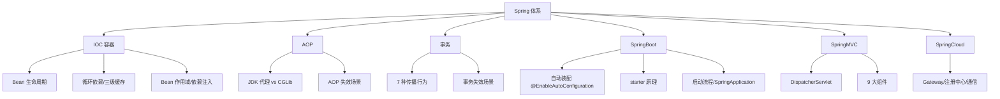

# 04 Spring体系 · 速记知识图谱（P0-P3）

> 模块定位：高级岗"必考主战场"，IOC/AOP/事务/SpringBoot 自动装配是四根支柱，源码级细节问得最深。
> 题量：60 题。

### P0 必背核心

#### IOC 与 DI：BeanFactory vs ApplicationContext
- **IOC（控制反转）** 是思想，**DI（依赖注入）** 是实现手段：把对象的创建权和依赖装配交给容器，业务类只声明依赖。
- **BeanFactory** 是最底层接口（`org.springframework.beans.factory.BeanFactory`），提供最基本的 `getBean()`，**延迟加载**——用到才创建。
- **ApplicationContext** 是 BeanFactory 的子接口，额外提供：① 国际化（MessageSource）；② 事件发布（ApplicationEventPublisher）；③ 资源加载（ResourceLoader）；④ 环境抽象（Environment）。**默认饿汉式预初始化所有单例 Bean**（`refresh()` 中的 `finishBeanFactoryInitialization`）。
- **DI 三种方式**：构造器注入（推荐，依赖不可变 + 强制不为 null + 可解决终态对象 + 利于单测）、Setter 注入、字段注入（`@Autowired` 直接打在字段上，IDEA 警告"Field injection is not recommended"——无法 final、绕过容器难单测、隐藏依赖）。
- 关联题：#0747、#0716、#0879、#0867

#### Bean 生命周期（核心 12 步，必背）
- ① 实例化（`createBeanInstance`，反射调构造器）→ ② 属性填充（`populateBean`，依赖注入发生在这里）→ ③ `Aware` 接口回调（`BeanNameAware` / `BeanFactoryAware` / `ApplicationContextAware` 注入容器自身资源）→ ④ `BeanPostProcessor.postProcessBeforeInitialization`（**@PostConstruct 在这一步通过 `CommonAnnotationBeanPostProcessor` 触发**）→ ⑤ `InitializingBean.afterPropertiesSet()` → ⑥ 自定义 `init-method`（XML 配置或 `@Bean(initMethod=)`）→ ⑦ `BeanPostProcessor.postProcessAfterInitialization`（**AOP 代理在这里生成**）→ Bean 就绪 → ⑧ 使用阶段 → ⑨ 容器关闭：`DisposableBean.destroy()` → ⑩ 自定义 `destroy-method` → `@PreDestroy` 同样走 `CommonAnnotationBeanPostProcessor`。
- **三个 init 钩子执行顺序**：`@PostConstruct` > `InitializingBean.afterPropertiesSet()` > 自定义 `init-method`。
- **AOP 代理时机**：发生在第 7 步 `postProcessAfterInitialization`，由 `AbstractAutoProxyCreator` 处理——这是**为什么类内自调用 AOP 失效**的根因（`this.method()` 调用的是原始对象不是代理对象）。
- 关联题：#0700、#0715、#0689、#0731

#### 循环依赖与三级缓存
- **三级缓存（`DefaultSingletonBeanRegistry`）**：① `singletonObjects`（一级，成品 Bean）；② `earlySingletonObjects`（二级，**半成品 Bean / 早期暴露对象**）；③ `singletonFactories`（三级，**ObjectFactory 工厂**，用于延迟生成代理）。
- **解决流程**（A 依赖 B、B 依赖 A）：A 实例化后属性填充前，把 `ObjectFactory` 放入三级缓存 → 注入 B，B 实例化时发现需要 A，从一级找不到 → 从二级找不到 → 从三级拿 `ObjectFactory.getObject()` 得到早期 A（若需 AOP 则提前生成代理）→ 把 A 提升到二级缓存，同时从三级缓存移除 → B 完成 → 回到 A，A 完成属性填充后提升到一级。
- **为什么需要三级而非二级**：核心是 **AOP 代理**。如果 Bean 不需要被代理，二级足够；但若需要 AOP，必须在"被其他 Bean 引用时"返回**代理对象**而非原对象（否则后续注入到别人手里的就是原对象，与最终成品不一致）。三级缓存存 `ObjectFactory`，**延迟决定**是否需要早期代理（`getEarlyBeanReference`），避免每个 Bean 都强行提前生成代理。
- **解决不了的三种循环依赖**：① **构造器循环依赖**（实例化阶段就需要对方，连半成品都没有，无法暴露）；② **prototype 作用域**（每次创建新实例，没法用缓存解决，直接抛 `BeanCurrentlyInCreationException`）；③ **@Async + 循环依赖**（@Async 通过 BeanPostProcessor 后置生成代理，与早期暴露的对象不是同一个，启动报错"Bean ... is not the same instance as ..."）。
- **`@Lazy` 解决循环依赖**：在注入点加 `@Lazy`，注入的是代理对象，真正调用时才解析目标 Bean，绕开了实例化期循环。
- 关联题：#0818、#1029、#1041、#1055、#1215、#0982、#0932

#### Bean 作用域（6 种）
- **singleton**（默认）：容器内单例，IoC 容器存活期间唯一实例。
- **prototype**：每次 `getBean()` 都返回新实例，**容器只负责创建不负责销毁**（不会调 `@PreDestroy`），用完要自己释放资源。
- **request / session / application**：Web 环境作用域，分别对应一次 HTTP 请求、一个用户会话、ServletContext 生命周期。
- **websocket**：WebSocket 会话级别。
- **singleton 注入 prototype 的坑**：默认只在 singleton 创建时注入一次 prototype，后续都是同一个实例——需要用 `@Lookup` 方法注入、`ObjectFactory<T>` 或 `ApplicationContext.getBean()` 来每次获取新实例。
- 关联题：#0971

#### AOP：JDK 代理 vs CGLib
- **JDK 动态代理**：基于**接口**，`Proxy.newProxyInstance` + `InvocationHandler`，目标类必须实现接口。
- **CGLib**：基于**继承**生成子类，可代理无接口的类；底层用 ASM 操作字节码。**final 类、final 方法、private 方法、static 方法**都无法被 CGLib 代理（子类没法重写）。
- **Spring 默认策略**：① 目标类实现了接口 → JDK 代理；② 没实现接口 → CGLib；③ `spring.aop.proxy-target-class=true` 或 SpringBoot 2.x 起**默认强制 CGLib**（避免接口/实现切换导致 AOP 失效）。
- **性能**：JDK 早期慢于 CGLib，JDK 8 以后 JDK 代理性能已反超 CGLib（CGLib 在 JDK 17 还有兼容问题，需要 `--add-opens`）。
- **@Aspect 5 种通知**：`@Before` / `@After`（finally 语义）/ `@AfterReturning` / `@AfterThrowing` / `@Around`（最强，可控制是否执行 `joinPoint.proceed()`）。
- 关联题：#0196

#### AOP 失效场景（高频）
- **类内自调用**：`this.methodB()` 直接走原始对象的方法表，根本没经过代理。解决：① 注入自身 `@Autowired private XxxService self;` 然后 `self.methodB()`；② `AopContext.currentProxy()`（要 `@EnableAspectJAutoProxy(exposeProxy=true)`）；③ 把方法拆到另一个 Bean。
- **private / static / final 方法**：CGLib 子类无法重写，AOP 切不到（编译期甚至会报错或被静默忽略）。
- **非 Spring 管理的对象**：`new XxxService()` 出来的对象不在容器里，没有代理。
- **多线程 / 异步**：子线程中调用同一个对象的方法走的还是 this，同样问题。
- 关联题：#0714

#### 事务：@Transactional 7 种传播行为
- **REQUIRED**（默认）：当前有事务则加入，没有则新建。
- **REQUIRES_NEW**：**总是新建事务**，挂起当前事务（**两个独立事务**，外层回滚不影响内层已提交）。底层通过 `DataSourceTransactionManager` 拿新连接，**注意连接池耗尽风险**。
- **NESTED**：基于**数据库 Savepoint** 实现的嵌套事务，内层回滚到 Savepoint，外层可决定是否一起回滚（只对 JDBC 有效，JPA 部分支持）。
- **SUPPORTS**：有事务加入，没有就非事务执行。
- **NOT_SUPPORTED**：挂起当前事务，自己以非事务方式运行。
- **NEVER**：当前有事务直接抛异常。
- **MANDATORY**：当前必须有事务，否则抛异常。
- 关联题：#0880

#### Spring 事务失效场景（必考清单）
- **方法非 public**：`@Transactional` 默认只对 public 方法生效（代理增强逻辑限制）。
- **自调用**：同一个类里 A() 调 B()，B 上的 `@Transactional` 失效——根因和 AOP 自调用相同。
- **异常被吃掉**：try-catch 后不重新抛，事务管理器感知不到，照常提交。
- **抛 checked exception**：`@Transactional` **默认只回滚 RuntimeException 和 Error**，checked exception 不回滚；需要 `rollbackFor = Exception.class` 显式声明。
- **数据库引擎不支持事务**：MySQL MyISAM 无事务能力。
- **类没被 Spring 管理**：`new` 出来的对象没有代理。
- **多线程**：事务依赖 `ThreadLocal` 绑定的 Connection，子线程拿不到主线程的事务上下文，子线程异常主线程也不会回滚。这就是为什么 `@Transactional + @Async` 子线程事务不生效但 @Async 本身的事务可以独立开启。
- **传播行为用错**：方法 B 用 `NOT_SUPPORTED` 时，B 内异常不会影响 A 的事务。
- 关联题：#0089、#0101、#0102、#0490、#0936、#1202

#### SpringBoot 自动装配
- **入口**：`@SpringBootApplication` = `@SpringBootConfiguration` + `@EnableAutoConfiguration` + `@ComponentScan`。
- **`@EnableAutoConfiguration`** 通过 `@Import(AutoConfigurationImportSelector.class)` 引入，`selectImports()` 用 `SpringFactoriesLoader` 读取所有 jar 的 `META-INF/spring.factories`（SpringBoot 2.x）或 `META-INF/spring/org.springframework.boot.autoconfigure.AutoConfiguration.imports`（**SpringBoot 2.7+ 推荐，3.0 完全切换**）。
- **为什么从 spring.factories 改成 .imports**：① 一个 key 一个 value，**编译期可识别**（APT 注解处理器），利于 GraalVM Native Image AOT 编译；② 解析更快，运行时开销小；③ 文件结构更清晰。
- **@Conditional 家族**：`@ConditionalOnClass`（classpath 上有某类）、`@ConditionalOnMissingBean`（容器中没有该 Bean 时才装配，这是用户自定义可覆盖默认配置的根本）、`@ConditionalOnProperty`（配置项满足）、`@ConditionalOnWebApplication` 等。
- **starter 原理**：① 写一个 `XxxAutoConfiguration`（`@Configuration` + `@ConditionalOnClass`）；② 在 `META-INF/spring/...AutoConfiguration.imports` 中声明；③ 通常配一个 `XxxProperties`（`@ConfigurationProperties(prefix="xxx")`）做配置绑定；④ 打成 `xxx-spring-boot-starter` 依赖。
- 关联题：#0762、#0297、#0958、#0699

#### SpringBoot 启动流程（SpringApplication.run）
- ① `new SpringApplication(primarySources)`：推断应用类型（SERVLET / REACTIVE / NONE）、加载 `ApplicationContextInitializer` 和 `ApplicationListener`（从 spring.factories 读）。
- ② `run(args)`：发布 `ApplicationStartingEvent` → 准备 Environment → 打印 banner → 创建 ApplicationContext（Servlet 环境是 `AnnotationConfigServletWebServerApplicationContext`）→ `prepareContext()` 注册主类 → **`refreshContext()`**（核心，等同于 Spring 的 `refresh()`：注册 BeanFactoryPostProcessor、扫描 Bean、初始化所有非懒加载单例、**嵌入式 Tomcat 在这里通过 `ServletWebServerApplicationContext.onRefresh()` 启动**）→ `afterRefresh()` → 发布 `ApplicationStartedEvent` → 执行 `ApplicationRunner` / `CommandLineRunner` → 发布 `ApplicationReadyEvent`。
- 关联题：#0200、#0746

#### SpringMVC 9 大组件 + 请求流程
- **DispatcherServlet** 是前端控制器，初始化时加载 9 大组件（`initStrategies()`）：① `MultipartResolver`（文件上传）；② `LocaleResolver`（国际化）；③ `ThemeResolver`；④ **`HandlerMapping`**（URL → Handler 映射，常用 `RequestMappingHandlerMapping`）；⑤ **`HandlerAdapter`**（适配不同类型 Handler，常用 `RequestMappingHandlerAdapter`，内部调用 `HandlerMethodArgumentResolver` 解析参数、`HandlerMethodReturnValueHandler` 处理返回值）；⑥ `HandlerExceptionResolver`（异常解析，`@ControllerAdvice` 走这里）；⑦ `RequestToViewNameTranslator`；⑧ **`ViewResolver`**（视图解析，REST API 中被 `HttpMessageConverter` 替代）；⑨ `FlashMapManager`（重定向参数）。
- **请求流程**：请求 → DispatcherServlet → HandlerMapping 找 Handler 和 Interceptor 链 → HandlerAdapter 调用 → 参数解析（HandlerMethodArgumentResolver，如 `@RequestBody` 走 `RequestResponseBodyMethodProcessor` → `HttpMessageConverter` 反序列化）→ 执行 Controller → 返回 ModelAndView 或对象 → ViewResolver/HttpMessageConverter 处理 → 输出。
- 关联题：#0790、#0326、#1218

#### 拦截器 / 过滤器 / AOP 对比
- **执行顺序（请求进入）**：过滤器 Filter（Servlet 规范，最外层）→ DispatcherServlet → 拦截器 Interceptor（Spring，preHandle）→ AOP 切面（@Around 进入）→ Controller → AOP 切面（@Around 退出）→ Interceptor.postHandle → Interceptor.afterCompletion → Filter（响应链）。
- **能拿到的对象**：Filter 只能拿到 `ServletRequest/Response`（最早），拿不到具体 Controller 方法；Interceptor 可以拿到 `HandlerMethod`（哪个 Controller 哪个方法），但拿不到方法参数；AOP 通过 `JoinPoint` 拿到所有方法参数和返回值。
- **典型职责分工**：跨域 / 字符编码 / 日志请求体（要包装 Request）放 Filter；登录校验 / 权限放 Interceptor；业务级日志 / 事务 / 限流放 AOP。

### P1 加分高频

#### 关键扩展点（启动时机由早到晚）
- **`BeanFactoryPostProcessor`**：在所有 BeanDefinition 加载完之后、Bean 实例化之前，可以**修改 BeanDefinition**（如改 scope、属性、占位符替换 `PropertySourcesPlaceholderConfigurer` 就是它的子类）。
- **`BeanDefinitionRegistryPostProcessor`**（继承前者）：能直接**动态注册新的 BeanDefinition**，`ConfigurationClassPostProcessor`（解析 `@Configuration` `@ComponentScan` `@Import`）就是这个层级。
- **`BeanPostProcessor`**：在 Bean 实例化之后、初始化前后回调，AOP（`AnnotationAwareAspectJAutoProxyCreator`）、`@Autowired`（`AutowiredAnnotationBeanPostProcessor`）、`@PostConstruct`（`CommonAnnotationBeanPostProcessor`）都靠它。
- **`Aware` 系列**：Bean 想拿到容器自身信息（`ApplicationContextAware` / `EnvironmentAware` / `BeanNameAware`）。
- **`InitializingBean` / @PostConstruct / init-method**：初始化业务钩子，顺序前面已述。
- **`ApplicationListener` + `@EventListener`**：监听容器事件 / 业务事件，Spring Event 实现。
- 关联题：#0294、#0998

#### @Resource vs @Autowired vs @Inject
- **@Autowired**（Spring 提供）：**按类型注入**（byType），匹配多个时按名字（属性名 / `@Qualifier`）；`required=false` 控制是否必须。
- **@Resource**（JSR-250，javax/jakarta）：**按名字注入**（byName），找不到再按类型；优先级 name > type。
- **@Inject**（JSR-330）：标准注解，行为类似 `@Autowired` 但没有 `required` 属性，需要额外依赖 `javax.inject`。
- **`@Qualifier`** + `@Autowired` 等价于 `@Resource(name=)`。
- 一个面试常问的小坑：`@Autowired` 注入 `Map<String, XxxService>` 时，**会把所有 XxxService 类型的 Bean 按 beanName 作为 key 装进 Map**——常用来做策略模式分发。同理 `List<XxxService>` 拿到所有实现。
- 关联题：#0922

#### Spring 事务自调用的源码原因
- `@Transactional` 由 `TransactionInterceptor` 实现，本质是 AOP 通过 `BeanPostProcessor` 在初始化后生成代理。
- 自调用走的是 `this`，绕过了代理。修正方式：① 注入 self；② `AopContext.currentProxy()` + `@EnableAspectJAutoProxy(exposeProxy=true)`；③ 提取到另一个 Bean。
- `TransactionSynchronizationManager` 用 ThreadLocal 绑定 Connection 和事务状态——这就是事务在 `@Async` 子线程失效的本质。
- 关联题：#0102、#1202

#### Spring Event 与 MQ 区别
- **Spring Event** 是**进程内**的事件发布/订阅，基于观察者模式。`ApplicationEventPublisher.publishEvent()` **默认同步**调用所有监听器（在发布者线程里执行）。要异步需 `@Async` + `@EnableAsync`。
- **MQ**（Kafka、RocketMQ）是**进程间**消息队列，跨服务、持久化、可重试、削峰填谷。
- **事务事件** `@TransactionalEventListener`：可监听 `BEFORE_COMMIT` / `AFTER_COMMIT` / `AFTER_ROLLBACK` / `AFTER_COMPLETION`——业务上常用"事务提交后再发 MQ"避免本地事务回滚但消息已发的不一致。
- 关联题：#0059、#0688、#1127

#### @Async 的坑
- `@Async` 通过 AOP 异步代理，**也存在自调用失效**问题。
- **默认线程池**是 `SimpleAsyncTaskExecutor`——**不复用线程、不限制并发数**，每次新建线程，高并发下能压垮系统。生产**必须自定义** `ThreadPoolTaskExecutor` 并通过 `@Async("myExecutor")` 指定。
- **不要使用默认线程池**这是面试常问的"反模式"。
- 与 `@Transactional` 组合：异步方法上若加 `@Transactional`，是**新开一个事务**（新线程里 ThreadLocal 没有上下文）；调用方的事务回滚不会传递到异步方法。
- 关联题：#1056、#1202

#### @Scheduled 实现原理
- 容器启动时 `ScheduledAnnotationBeanPostProcessor` 扫描所有 `@Scheduled` 方法，注册到 `ScheduledTaskRegistrar`。
- 底层是 **`ScheduledThreadPoolExecutor`**，**默认线程池只有 1 个线程**——多个 `@Scheduled` 方法**会串行**执行（一个跑慢全部延迟），生产必须自定义 `TaskScheduler` 或 `ThreadPoolTaskScheduler` 设置 pool-size。
- 支持 `fixedRate` / `fixedDelay` / `cron`。分布式场景 `@Scheduled` 会在多节点上重复执行，需要分布式锁或 XXL-Job 等调度框架。
- 关联题：#0907

#### Bean 线程安全
- **singleton（默认）线程不安全**：单例 + 多线程共享。但**绝大多数 Spring Bean 是无状态的**（Service、DAO 只有方法、没有可变成员变量），所以没问题。
- **不安全的典型场景**：在 Service 里加了可变成员变量（比如缓存、计数器）、SimpleDateFormat 字段、Connection 字段等。
- **修正**：① 改用方法局部变量；② 用 ThreadLocal；③ 改 `prototype` 作用域；④ 使用线程安全的工具类（`DateTimeFormatter`、`AtomicInteger`）。
- 关联题：#0983

#### SpringCloud 体系（一句话掌握）
- 一站式微服务工具集，组件：注册中心（Eureka 已被移除推荐 **Nacos / Consul**）、配置中心（Spring Cloud Config / Nacos Config）、负载均衡（Ribbon → **Spring Cloud LoadBalancer**）、服务调用（Feign / OpenFeign）、熔断降级（Hystrix 停更 → **Resilience4j / Sentinel**）、网关（Zuul 1.x → **Spring Cloud Gateway**，基于 WebFlux / Netty / Reactor）、链路追踪（Sleuth → **Micrometer Tracing**）。
- **Gateway 作用**：统一入口、路由、鉴权、限流、协议转换、灰度。
- **Spring Cloud 通信方式**：① 同步 REST（RestTemplate / WebClient / OpenFeign）；② 异步 MQ；③ RPC（Dubbo、gRPC）。
- 关联题：#1083、#1084、#1173、#1213、#1160、#1161

#### Spring 用到的设计模式
- **工厂**：BeanFactory、FactoryBean。
- **单例**：默认 Bean。
- **代理**：AOP。
- **模板方法**：JdbcTemplate、RestTemplate。
- **观察者**：Spring Event。
- **责任链**：Interceptor 链、Filter 链。
- **适配器**：HandlerAdapter（适配不同 Handler 类型）。
- **装饰器**：BeanWrapper。
- **策略**：InstantiationStrategy（CGLib / 反射）。
- 关联题：#0831

#### BeanFactory vs FactoryBean
- 一字之差，完全两个东西。
- **BeanFactory**：容器，管理所有 Bean。
- **FactoryBean<T>**：**特殊 Bean**，实现该接口的 Bean 通过 `getObject()` 返回另一个对象——`getBean("xxx")` 拿到的是 `getObject()` 的产物，`getBean("&xxx")` 才拿到 FactoryBean 本身。MyBatis 的 `SqlSessionFactoryBean` 就是典型。
- 关联题：#0867

### P2 深度延伸

#### bootstrap.yml vs application.yml
- **bootstrap.yml** 加载更早，由 **`BootstrapApplicationContext`**（Spring Cloud 概念）加载，用于配置中心 / 加密配置等"配置如何加载"的元配置。**没有引入 Spring Cloud 时 bootstrap.yml 不会被读取**。
- **application.yml** 在主 ApplicationContext 启动后加载，应用业务配置都在这。
- bootstrap 配置不可被 application 覆盖（优先级高）。
- 关联题：#0075

#### 多环境配置
- `spring.profiles.active=dev` 激活某环境；文件命名 `application-dev.yml`、`application-prod.yml`。
- `@Profile("dev")` 控制某 Bean 只在指定 profile 加载。
- SpringBoot 2.4+ 引入 `spring.config.activate.on-profile` 替代旧的 `spring.profiles`，且**多 yaml 段用 `---` 分隔**写在同一个文件。
- 关联题：#0959

#### 动态注册 Bean
- 方式一：`@Configuration` + `@Bean` 方法（静态，编译期已知）。
- 方式二：实现 `ImportBeanDefinitionRegistrar`，在 `registerBeanDefinitions` 中拿到 `BeanDefinitionRegistry` 调 `registerBeanDefinition()`。
- 方式三：实现 `BeanFactoryPostProcessor` / `BeanDefinitionRegistryPostProcessor`，直接操作 `DefaultListableBeanFactory`。
- 方式四：`SingletonBeanRegistry.registerSingleton()`——**已实例化好的对象**直接注册（绕过生命周期，慎用，没有 AOP 增强）。
- 关联题：#0121、#0896

#### Spring 优雅停机
- SpringBoot 2.3+ 配置：`server.shutdown=graceful` + `spring.lifecycle.timeout-per-shutdown-phase=30s`。
- 流程：收到 SIGTERM → 停止接收新请求（关闭 Web 服务器入口）→ 等待正在处理的请求完成（最多 timeout）→ `ContextClosedEvent` 发布 → 执行 `@PreDestroy` / `DisposableBean.destroy()` → 进程退出。
- 必须用 `kill -15`（SIGTERM）触发；`kill -9` 直接杀，钩子不会跑。
- 关联题：#1011、#0731

#### SpringBoot 和 Spring 双亲委派的差异
- 标准 Java 双亲委派是子加载器先委托父加载器。
- SpringBoot 的 **fat jar / executable jar** 用了 `LaunchedClassLoader`（继承 `URLClassLoader`），加载时优先加载 BOOT-INF/classes 和 BOOT-INF/lib 下的内容；不是破坏双亲委派，而是**扩展了搜索路径**——业务类和依赖打在一个大 jar 里也能正确加载。
- 关联题：#1187

#### jar vs war / fat jar
- **jar**：Java Archive，普通 Java 包。
- **war**：Web Archive，传统部署到 Tomcat 等 Servlet 容器。
- **fat jar / uber jar**：把所有依赖和**嵌入式 Tomcat** 打进一个可执行 jar，`java -jar app.jar` 直接跑，SpringBoot 默认方式。本质是 spring-boot-maven-plugin 重新打包成嵌套 jar 结构（BOOT-INF/lib 里的 jar 不解压）。

### P3 冷门刁钻

#### Spring 6 / SpringBoot 3 关键变化
- **基线升级**：JDK 17、Jakarta EE 9（包名 `javax.*` → `jakarta.*`，需要全部依赖配套）。
- **GraalVM Native Image** 原生镜像编译，启动毫秒级、内存占用低。
- **可观测性**：用 Micrometer Observation API 替代 Sleuth。
- **HTTP Interface**：声明式 HTTP 客户端，类似 Feign 但是 Spring 原生（`@HttpExchange`）。
- **Eureka 在 SpringCloud 2022/2023 中没移除，但社区主推 Nacos**。

#### Spring 7 / SpringBoot 4 新特性
- 进一步推进 AOT / Native 编译。
- 更激进的 Virtual Thread（JDK 21 虚拟线程）支持，配置一行 `spring.threads.virtual.enabled=true` 让 Tomcat 用虚拟线程跑请求。
- 关联题：#0080、#0082

#### Spring 缓存预热
- 实现 `ApplicationRunner` / `CommandLineRunner` 在容器就绪后跑预热逻辑。
- 监听 `ApplicationReadyEvent` 比 `ContextRefreshedEvent` 更稳——后者在 Web 服务器还未启动完成时就触发。
- 加 `@PostConstruct` 在 Bean 初始化时跑，但此时其他 Bean 可能没就绪，慎用。
- 关联题：#0998

### 跨模块联想

- IOC / AOP ↔ **02 JVM**：动态代理生成大量 CGLib 类，Metaspace 容易满；JDK 代理底层是 `Proxy.newProxyInstance` 反射调用。
- 三级缓存 ↔ **05 设计模式**：典型的"工厂模式 + 延迟初始化"。
- 事务自调用 / AOP 自调用 ↔ **02 JVM 字节码**：理解为什么 `this.method()` 不走代理需要看代理类的字节码——子类只重写了被代理方法，`this` 在原始 `super` 方法体里指向自己。
- @Async 默认线程池坑 ↔ **03 并发**：手写 `ThreadPoolExecutor` 的 7 参数。
- Bean 线程安全 ↔ **03 并发**：ThreadLocal / 不可变对象 / 同步策略。
- SpringBoot 自动装配 ↔ **20 通用基础（SPI）**：`SpringFactoriesLoader` 是 Spring 版 SPI；JDK SPI（`ServiceLoader`）vs Dubbo SPI vs Spring SPI 的对比是综合面试常问。
- @Scheduled 单线程坑 ↔ **15 业务场景**：定时任务任务堆积排查。
- 优雅停机 ↔ **02 JVM**：`kill -15` ShutdownHook 链路。
- Gateway / 限流熔断 ↔ **17 微服务 / 高可用**。
- 事务隔离级别 ↔ **08 MySQL**：四种隔离级别 + MVCC + 间隙锁。

---
