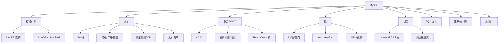

# 05 MySQL · 速记知识图谱（P0-P3）

> 模块定位：高级岗"第二硬通货"，必考。重点是 **InnoDB 引擎 + B+ 树索引 + 事务 MVCC + 锁 + 日志体系 + 主从复制 + SQL 优化**。153 题，体量大。
> 题量：153 题。

### P0 必背核心

#### InnoDB 整体架构
- **内存结构**：Buffer Pool（数据页/索引页缓存，LRU 改良冷热分离，old 区 37%）、Change Buffer（非唯一二级索引写入合并，提升 INSERT/UPDATE）、Adaptive Hash Index（自适应哈希）、Log Buffer（redo log 缓冲区）。
- **磁盘结构**：系统表空间（ibdata1）、独立表空间（每张表一个 .ibd）、undo 表空间、redo log 文件（ib_logfile0/1，循环写）、binlog（mysqld 层）。
- **后台线程**：Master Thread（合并 ChangeBuffer、刷脏页、清理 undo）、IO Thread、Purge Thread（清理 undo）、Page Cleaner（刷脏）。
- **WAL（Write-Ahead Log）**：先写 redo 日志再改数据页，崩溃恢复靠 redo + undo。
- 关联题：#0046、#0246

#### 为什么用 B+ 树（而不是 B 树 / 红黑树 / Hash）
- **B+ 树特点**：① 只有叶节点存数据，非叶节点只存索引键 → 单页能存更多 key → 树更矮；② 叶节点用**双向链表**串联 → 范围查询友好；③ 所有查询都到叶节点 → 性能稳定。
- **vs B 树**：B 树每个节点都存数据，单页 key 数少树高高；范围查询要回溯。
- **vs 红黑树**：树高 O(log₂n)，1000 万数据约 23 层，磁盘 IO 太多；B+ 树扇出 1000+，3-4 层就能管亿级数据。
- **vs Hash**：等值查询 O(1) 但范围查询全表扫；不支持排序、不支持模糊查询前缀；哈希冲突。
- **InnoDB B+ 树阶数**：InnoDB 页大小默认 16KB，每个非叶节点能存约 1000+ 个 key（取决于 key 长度）。3 层 B+ 树 ≈ 千万级数据。
- 关联题：#0037、#0084

#### 聚簇索引 vs 二级索引 vs 覆盖索引
- **聚簇索引**：叶子节点直接存**完整行数据**。InnoDB 主键就是聚簇索引，没主键用唯一索引，再没有用 ROWID 隐藏列。一张表只能有一个聚簇索引。
- **二级索引（非聚簇 / 辅助）**：叶子节点存索引列 + **主键值**，查到主键值再回主键索引取整行 = **回表**。
- **覆盖索引**：select 字段都包含在二级索引中，不需要回表。explain Extra 显示 `Using index`。优化深翻页、count 查询常用。
- **回表**：二级索引查到主键 → 再去聚簇索引找完整行。回表越多越慢。
- **典型陷阱**：`SELECT *` 几乎一定回表；`select name, age from user where age=18`（age 索引）若 name 不在索引中就要回表。
- 关联题：#0046、#0085

#### 最左前缀与索引下推（ICP）
- **联合索引最左前缀**：`INDEX(a, b, c)` 可命中 `where a`、`where a, b`、`where a, b, c`，跳过 a 直接 `where b, c` 不命中；`where a, c` 只能用到 a；`where a=1 order by b` 可用索引排序。
- **范围查询截断**：联合索引中遇到范围查询（>、<、BETWEEN、LIKE）后续列就不能再用索引。`where a=1 and b>10 and c=5`：a、b 走索引，c 走过滤。
- **索引下推 ICP（MySQL 5.6+）**：默认开启。在存储引擎层就用上索引中的额外列做过滤，减少回表次数。Extra 中显示 `Using index condition`。
- **MRR（Multi-Range Read）**：把回表的随机 IO 改为按主键排序的顺序 IO，提升范围查询性能。
- 关联题：#0050、#0083、#0181

#### 索引失效场景
- **函数/计算**：`where YEAR(create_time) = 2024`、`where age + 1 = 20` 失效（除非函数索引 8.0+）。
- **隐式类型转换**：列是 varchar 但 where 用数字 `where phone = 13888888888`（去掉引号）会全表扫。**字符串列必须加引号**。
- **前导模糊查询**：`like '%xx'` 或 `like '%xx%'` 失效，`like 'xx%'` 可用。
- **OR**：OR 两边只有一边有索引时整体失效；都有索引但 MySQL 优化器可能仍选全表扫（取决于成本）。
- **!= / <> / NOT IN / IS NOT NULL**：取决于优化器，常导致全表扫。
- **联合索引不满足最左前缀**。
- **WHERE 与 ORDER BY 列顺序不一致** 导致 Using filesort。
- **统计信息过期**：执行计划走错，可 `ANALYZE TABLE` 重新统计。
- 关联题：#0038、#0181

#### 事务 ACID 实现
- **A 原子性**：靠 **undo log**——执行 update/insert/delete 时把反向操作记入 undo，回滚就反向执行。
- **C 一致性**：业务层 + 数据库约束（PK/FK/CHECK/UNIQUE）+ AID 三者共同保证。
- **I 隔离性**：靠**锁 + MVCC**——写写互斥靠行锁、读写靠 MVCC 不互斥。
- **D 持久性**：靠 **redo log**——事务提交前 redo 必须刷盘（innodb_flush_log_at_trx_commit=1），即使宕机也能恢复。
- 关联题：#0049、#0091

#### 隔离级别与读异常
- **4 个级别**：READ UNCOMMITTED（脏读）、READ COMMITTED（不可重复读）、**REPEATABLE READ**（默认，幻读理论存在但 InnoDB 通过间隙锁解决了大部分）、SERIALIZABLE（串行）。
- **三大异常**：脏读（读到未提交的数据）、不可重复读（同一事务两次读同一行结果不同）、幻读（同一事务两次范围查询行数不同）。
- **MySQL RR 是否能解决幻读**：**当前读靠 Next-Key Lock 解决**（select for update、update、delete），**快照读靠 MVCC**（不会看到新行，但当前读仍会看到——所谓"半解决"）。
- **不同业务选择**：金融常用 RR、互联网常用 RC（性能更好、间隙锁少、易避死锁）。
- 关联题：#0049、#0091

#### MVCC 与 Read View
- **核心**：每行记录有隐藏字段 `trx_id`（最后修改事务 ID）、`roll_pointer`（指向 undo log 的指针）；通过 undo log 链可构造任一历史版本。
- **Read View**：快照读时创建，4 个核心字段：m_ids（活跃事务列表）、min_trx_id（最小活跃事务 ID）、max_trx_id（下一个事务 ID）、creator_trx_id（自己）。
- **可见性算法 4 步**：① 记录 trx_id < min_trx_id → 可见；② trx_id ≥ max_trx_id → 不可见；③ trx_id 在 m_ids 中 → 不可见（活跃事务）；④ trx_id 不在 m_ids 中 → 可见（已提交）；不可见则沿 roll_pointer 找前一版本。
- **RC vs RR 区别**：RC **每次 select 都生成新 ReadView**；RR **事务第一次 select 生成 ReadView 后整个事务复用**。
- **快照读 vs 当前读**：select 是快照读；select ... for update / lock in share mode / insert / update / delete 是当前读，加锁读最新版本。
- 关联题：#0091、#0277

#### 锁体系（行锁/表锁/意向锁/Next-Key）
- **粒度**：表锁（DDL）、页锁（少用）、**行锁**（InnoDB 主力）。
- **共享锁 S vs 排他锁 X**：S 读锁互不冲突，X 写锁互斥。
- **意向锁 IS/IX**：表级，表示表中**某些行**有 S/X 锁，加表锁时快速判断是否冲突，不必逐行检查。意向锁之间不冲突。
- **行锁三种实现**：① **Record Lock**（记录锁，锁单行）；② **Gap Lock**（间隙锁，锁一个区间但不含行本身，只在 RR 级别）；③ **Next-Key Lock**（前两个的组合，左开右闭区间）—— InnoDB **默认加 Next-Key Lock**。
- **插入意向锁**：特殊的间隙锁，多个事务在同一间隙不同位置插入不冲突。
- **自增锁 AUTO-INC**：插入时持有，可调 `innodb_autoinc_lock_mode`（0 传统/1 连续/2 交叉，主从复制相关）。
- **MDL（Metadata Lock）**：DDL（如 ALTER TABLE）与 DML 互斥；DDL 卡在大查询后面是常见线上事故。
- 关联题：#0049、#0277

#### redo / undo / binlog 三大日志
- **redo log（InnoDB 层，物理日志）**：记录"页 X 偏移 Y 改成 Z"。**循环写**（ib_logfile0/1），WAL 机制保证持久性。`innodb_flush_log_at_trx_commit`：0 每秒刷 1 次（性能高、丢 1 秒）、1 每次事务提交都刷盘（默认、不丢数据）、2 写到 OS Cache 每秒刷。
- **undo log（InnoDB 层，逻辑日志）**：记录反向操作。用途两个：事务回滚 + MVCC 多版本快照。
- **binlog（MySQL Server 层，逻辑日志）**：记录所有改表操作，**追加写**不循环。用于主从复制和恢复。三种格式：STATEMENT（语句）、ROW（行变化）、MIXED。`sync_binlog`：1 每次提交刷盘（默认 1 不丢）、0 由 OS 决定、N 累积 N 次刷。
- **两阶段提交（2PC）**：保证 redo 和 binlog 一致。流程：① 写 redo（prepare）；② 写 binlog；③ 写 redo（commit）。崩溃恢复时：redo prepare + binlog 完整 → 提交；redo prepare 但 binlog 不完整 → 回滚。
- 关联题：#0277、#0181

#### 主从复制原理
- **3 个线程**：① 主库 dump thread 把 binlog 推给从库；② 从库 IO thread 接收写入 relay log；③ 从库 SQL thread 重放 relay log。
- **3 种模式**：异步（默认，丢数据风险）、半同步（主等至少一个从 ack，rpl_semi_sync_master_wait_no_slave）、组复制 MGR（基于 Paxos 多主或单主）。
- **延迟原因**：① 主库写并发高从库单线程重放（5.6+ 库级别并行、5.7+ 组提交并行、8.0 基于 WriteSet 并行）；② 大事务；③ 网络；④ 从库硬件差；⑤ 锁等待。
- **GTID**：全局事务 ID，替代传统 binlog 文件名 + 位点，主从切换、复制故障恢复更方便。
- 关联题：#0246

### P1 加分高频

#### explain 字段解读
- **type**（关键）：性能从好到差：system > const > eq_ref（唯一索引连接）> ref（非唯一索引等值）> range（范围）> index（索引全扫）> ALL（全表扫）。生产至少 range，理想 ref 及以上。
- **key**：实际使用的索引。**key_len**：使用索引的字节数（联合索引判断用到第几列）。
- **rows**：估计扫描的行数。
- **Extra**：① Using index（覆盖索引）；② Using where（Server 层再过滤）；③ Using index condition（索引下推）；④ Using filesort（额外排序，警惕）；⑤ Using temporary（临时表，警惕）；⑥ Using join buffer（被驱动表无索引）。
- 关联题：#0091

#### 一条 SELECT 完整流程
- ① 连接器：身份认证、权限校验、建立连接。
- ② 查询缓存：MySQL 8.0 已移除（命中率低、维护成本高）。
- ③ 分析器：词法分析 + 语法分析，生成解析树。
- ④ 优化器：基于成本（CBO）选择执行计划（索引选择、join 顺序、子查询优化）。
- ⑤ 执行器：调用存储引擎接口读取数据。
- ⑥ 存储引擎：InnoDB 用 Buffer Pool 读页面、走 B+ 树检索。
- 关联题：#0046

#### count(*) vs count(1) vs count(列)
- **count(*)** 和 **count(1)**：等价，MySQL 优化器都走最短的索引扫描（一般是二级索引比聚簇索引短），都不会过滤 NULL。
- **count(col)**：统计 col 不为 NULL 的行数，会走 col 索引或全表扫。
- **MyISAM count(\*) O(1)**（专门维护行数），InnoDB 因 MVCC 必须扫描。
- 关联题：#0049

#### 深翻页优化
- **传统 LIMIT offset, n**：`LIMIT 100000, 10` 实际要扫 100010 行回表 100000 次再丢弃。
- **延迟关联（覆盖索引子查询）**：`SELECT * FROM t INNER JOIN (SELECT id FROM t ORDER BY x LIMIT 100000, 10) tmp USING(id)`——子查询走覆盖索引不回表，外层只回表 10 次。
- **游标式**：`WHERE id > 上一页最大 id ORDER BY id LIMIT 10`，性能最好但只能下一页。
- 关联题：#0046

#### 死锁排查
- **必要条件**：互斥、占有且等待、不可剥夺、循环等待。
- **查死锁**：`SHOW ENGINE INNODB STATUS\G` 看 LATEST DETECTED DEADLOCK 段；MySQL 5.6+ 可开 `innodb_print_all_deadlocks` 写错误日志。
- **检测**：`innodb_deadlock_detect=ON`（默认），死锁时回滚代价小的事务，错误码 1213。
- **避免**：① 减少事务大小；② 按固定顺序访问表/行；③ 用唯一索引避免间隙锁过多；④ RC 隔离级别更不易死锁；⑤ 索引覆盖减少锁定范围。
- 关联题：#0049、#0277

#### 字段设计原则
- **类型最小够用**：INT(11) 中括号是显示宽度无意义；用 INT/BIGINT 别用 VARCHAR 存数字；TINYINT 存 0-255 状态够了。
- **NOT NULL**：NULL 占用一个 NULL 位、参与索引让索引变复杂、不利于聚合（COUNT、SUM 跳过 NULL）。除非业务真有"未知"语义，否则全 NOT NULL + 默认值。
- **VARCHAR vs CHAR**：CHAR 定长（适合固定长度如 MD5），VARCHAR 变长省空间但有 1-2 字节长度前缀。VARCHAR 实际占用看内容。
- **TEXT/BLOB**：单独存储，主表不存内容（指针），避免拖慢主表查询；很多场景应改为分库或对象存储 OSS。
- **DATETIME vs TIMESTAMP**：DATETIME 8 字节、范围 1000-9999、不带时区；TIMESTAMP 4 字节、范围 1970-2038、自动转 UTC 存储。
- 关联题：#0049

#### 主键设计
- **必须有主键**：没主键 InnoDB 用唯一索引，再没有用 6 字节 ROWID。
- **自增 vs UUID**：自增连续插入页满后顺序分配新页（顺序 IO）；UUID 无序导致 B+ 树**页分裂**频繁（随机插入位置）、占用空间大（16 字节 vs 8 字节 BIGINT）、影响 Buffer Pool 命中率。
- **雪花 ID**：64 位 BIGINT 时间趋势递增，是分布式场景下好的主键选择。
- **基因法**：业务 ID 末尾嵌入分片键基因（如用户 ID 末位），保证同一用户订单落同一分片。
- 关联题：#0047、#0049

#### 长事务危害
- 占用大量 undo 日志，导致 undo 表空间膨胀。
- 锁占用时间长，影响并发。
- MDL 阻塞 DDL，无法 ALTER TABLE。
- 主从复制延迟加剧。
- Buffer Pool 老 view 无法清理。
- 防范：` information_schema.innodb_trx` 监控运行超 N 秒的事务并告警。
- 关联题：#0049

#### update / delete 流程
- ① 执行器调用 InnoDB 读取行（如果在 Buffer Pool 有就直接读，没有就从磁盘加载页）。
- ② 写 undo log（记录修改前的值）。
- ③ 修改 Buffer Pool 中的数据页 → 标记脏页。
- ④ 写 redo log buffer，事务提交时刷 redo（prepare 阶段）。
- ⑤ 写 binlog buffer，事务提交时刷 binlog。
- ⑥ redo log commit。
- ⑦ 异步刷脏页到磁盘。
- 关联题：#0049

### P2 深度延伸

#### Buffer Pool 工作机制
- **大小**：`innodb_buffer_pool_size`，建议物理内存 60-80%，是 MySQL 最重要的参数。
- **划分**：分多个 instance（`innodb_buffer_pool_instances`）减少竞争锁；每个 instance 分多个 chunk。
- **LRU 改良**：分 new 区（默认 63%）和 old 区（37%），新加载页先放 old 区头部，被再次访问且距上次加载超过 1 秒才晋升到 new 区头部——避免预读 / 全表扫一次性把热数据冲掉。
- **脏页刷新**：达到 `innodb_max_dirty_pages_pct`（默认 75%）触发 Page Cleaner 异步刷盘。
- 关联题：#0246

#### Change Buffer
- 非唯一二级索引的 INSERT/UPDATE/DELETE，如果目标页**不在 Buffer Pool**，先把操作记录到 Change Buffer，等下次该页被读取时合并（merge）回内存页。
- **为什么只优化非唯一**：唯一索引必须读页判断是否存在，没法延迟。
- **场景**：写多读少的业务收益大；读多写少反而增加 merge 开销。
- 参数：`innodb_change_buffer_max_size`（默认 25%）。
- 关联题：#0246

#### 自适应哈希索引 AHI
- InnoDB 监测到某些索引页被高频精确查询时，自动建立内存哈希加速等值查询。
- 不需要人为创建、不持久化、可关闭（`innodb_adaptive_hash_index`）。
- 业务全是范围查询场景关掉反而好（监测开销）。

#### 半同步复制原理
- 主库写 binlog 后等待**至少 N 个从库（默认 1）的 ack**，才提交事务给客户端。
- 参数：`rpl_semi_sync_master_wait_for_slave_count`、`rpl_semi_sync_master_timeout`（默认 10 秒，超时降级为异步）。
- AFTER_SYNC（默认）vs AFTER_COMMIT：AFTER_SYNC 写完 binlog 再等 ack（无幻读），AFTER_COMMIT 先提交再等 ack（有幻读，从库挂主库已提交但从库没收到）。
- 关联题：#0246

#### 慢查询排查全流程
- 开启：`slow_query_log=1`，`long_query_time=1`（秒），`slow_query_log_file=/path/slow.log`。
- 工具：`mysqldumpslow -s t -t 10 slow.log` 按耗时排前 10；`pt-query-digest slow.log` 更详细统计；阿里云 RDS 自带慢日志分析。
- 单条排查：`EXPLAIN` 看执行计划；`SHOW PROFILE` 看每阶段耗时（已废弃用 performance_schema 替代）。
- 优化方向：建索引、改 SQL（去 SELECT *、避免函数、避免子查询）、改表结构、读写分离、分库分表。
- 关联题：#0181

#### 字符集与排序
- **utf8 vs utf8mb4**：MySQL 的 utf8 实际只支持 3 字节（不能存 emoji 和部分汉字），**utf8mb4 才是真正的 UTF-8**（4 字节）。MySQL 8.0+ 默认 utf8mb4。
- **utf8mb4_general_ci vs utf8mb4_unicode_ci vs utf8mb4_0900_ai_ci**：general 速度快、unicode 标准、0900_ai_ci 是 8.0+ 默认（Unicode 9.0、accent-insensitive、case-insensitive）。
- **列字符集与表/库字符集**：可逐级覆盖。注意 join 两表字符集不同会隐式转换导致索引失效。

### P3 冷门刁钻

#### MMM / MHA / Orchestrator
- **MMM（Multi-Master Replication Manager）**：双主复制 + 故障切换，老方案问题多。
- **MHA（Master High Availability）**：主库故障 30 秒内自动切换，从从库中选最新的作为新主，已停止维护。
- **Orchestrator**：GitHub 开源，可视化拓扑管理、故障自动切换，目前主流。
- **MGR（Group Replication）**：基于 Paxos 的内置组复制，多主或单主，MySQL 8.0+ 推荐。

#### 函数索引（8.0+）
- 直接对函数表达式建索引：`CREATE INDEX idx ON t((YEAR(created_at)))`；之后 `WHERE YEAR(created_at)=2024` 也能走索引。
- 8.0 之前要靠**生成列（Generated Column）+ 普通索引**。
- 关联题：#0038

#### 隐藏索引（8.0+）
- `ALTER TABLE t ALTER INDEX idx INVISIBLE`：优化器看不到该索引，但仍会维护——验证索引是否真的有用，再决定是否真删除。

#### CTE 与窗口函数（8.0+）
- **CTE（WITH 子句）**：`WITH cte AS (...) SELECT ...`，提升可读性、支持递归。
- **窗口函数**：ROW_NUMBER / RANK / DENSE_RANK / LAG / LEAD / SUM() OVER(PARTITION BY ...)，做排名、累计、移动平均很强，避免自连接。

#### InnoDB vs MyISAM
- **InnoDB**：支持事务、行锁、外键、MVCC，主流。
- **MyISAM**：不支持事务、表锁、count(*) 快（独立维护行数）、压缩表只读、已被边缘化。
- **MySQL 8.0** 系统表都改 InnoDB 了。

### 跨模块联想

- 索引/B+ 树 ↔ **01 Java 基础**：HashMap 与 B+ 树对比、TreeMap 红黑树 vs B+ 树。
- MVCC/隔离级别 ↔ **09 分布式事务**：分布式事务的核心难点正是单库 MVCC 解决不了的。
- 主从复制 ↔ **08 微服务**：读写分离架构 + 一致性挑战（强一致用主库读、最终一致走从库）。
- 锁与死锁 ↔ **03 并发**：单库 Next-Key Lock 类比 JVM 内 synchronized；死锁排查靠 SHOW ENGINE INNODB STATUS。
- 慢 SQL ↔ **16 性能调优**：接口慢首查慢 SQL；EXPLAIN + 索引优化是必备技能。
- 分库分表 ↔ **11 分库分表**：单表 2000 万是经验阈值；基因法保证同用户落同分片。
- 长事务 ↔ **02 JVM**：MDL 阻塞 DDL、undo 膨胀类比 JVM 老年代积累；长事务也阻塞 binlog purge。
- redo/binlog ↔ **07 消息队列**：Canal 订阅 binlog 同步到 Kafka 做 CDC。
- 索引失效 ↔ **15 业务场景**：线上慢查询 80% 是索引失效（隐式类型转换、函数、模糊查询）。

---
