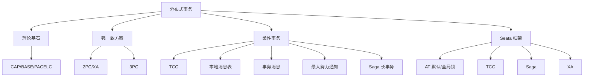

# 09 分布式事务 · 速记知识图谱（P0-P3）

> 模块定位：微服务架构落地的"必经之痛"，**金融/电商必考**。重点是 **CAP/BASE 理论 + 2PC/3PC/TCC/Saga/本地消息表/事务消息六大方案 + Seata 4 模式（AT/TCC/Saga/XA）**。
> 题量：25 题。

### P0 必背核心

#### 为什么分布式事务难（CAP & BASE）
- **CAP 定理**：分布式系统中 **一致性 C（Consistency）+ 可用性 A（Availability）+ 分区容错性 P（Partition Tolerance）三选二**。网络分区一定存在（P 不可舍），所以实际是 **CP（如 ZK、etcd）或 AP（如 Eureka、Cassandra）二选一**。
- **PACELC**：CAP 升级版——分区时（P）在 C 和 A 间选，**没分区时（E）也要在延迟（L）和一致性（C）间选**。例：MySQL 主从是 PC+EC，Cassandra 是 PA+EL。
- **BASE 理论**：**Basically Available（基本可用）+ Soft state（软状态/中间态可见）+ Eventually consistent（最终一致性）**。是对 CAP 中 AP 的工程实现思路——**用最终一致性换可用性**。
- **柔性事务 = BASE 实现** vs 刚性事务 = ACID（强一致、单库本地事务）。分布式系统几乎都走柔性事务。
- 关联题：#0964、#0931

#### 2PC（两阶段提交 / XA）
- **角色**：协调者（TM）+ 多个参与者（RM/资源管理器，通常是 DB）。
- **两阶段**：
  - **Prepare 阶段**：TM 问所有 RM "能不能提交？" RM 执行 SQL（加锁、写 undo/redo log）但**不真正 commit**，返回 yes/no。
  - **Commit 阶段**：所有 RM 都 yes 则 TM 发 commit，否则发 rollback。
- **致命缺陷**：
  - ① **同步阻塞**：Prepare 后到 Commit 期间，RM 持有锁等待，性能差；
  - ② **协调者单点**：TM 在 Commit 阶段宕机，部分 RM 收到 commit 部分没收到，**数据不一致**；
  - ③ **网络问题不可解决**：协调者发了 commit 但 RM 没收到也不会主动回滚。
- **XA 协议**：Oracle/MySQL InnoDB（5.7+ 支持 `XA START/PREPARE/COMMIT`）都实现了 XA 接口。MySQL XA 性能比本地事务差 10 倍以上，**金融以外不推荐**。
- 关联题：#0154、#0273、#0130

#### 3PC（三阶段提交）
- **改进 2PC 的两个问题**：① 协调者和参与者**都加超时**；② Prepare 拆成 **CanCommit + PreCommit**。
- **三阶段**：
  - **CanCommit**：TM 问 RM 是否能提交（不加锁不执行 SQL，只检查），快速失败；
  - **PreCommit**：RM 真正执行事务但不 commit（类似 2PC Prepare）；
  - **DoCommit**：所有都 OK 才 commit。
- **超时机制**：参与者在 PreCommit 后如果超时收不到 DoCommit，**默认 commit**（猜测 TM 应该让 commit）。
- **仍然不一致**：如果 TM 决定 rollback 但消息丢失，参与者超时后自动 commit 反而错。3PC 减少了阻塞但**没根本解决一致性**，实际工业很少用。
- 关联题：#0153

#### TCC（Try-Confirm-Cancel）
- **业务层 2PC**：把每个分支事务拆成三个接口：
  - **Try**：预留资源（如冻结余额、预扣库存）；
  - **Confirm**：真正提交（扣减冻结的余额、扣减预扣库存）。必须幂等；
  - **Cancel**：释放预留（解冻余额、归还库存）。必须幂等。
- **全部 Try 成功 → 全部 Confirm；任一 Try 失败 → 全部 Cancel**。
- **三大坑**：
  - ① **空回滚**：Try 没执行（网络丢包），但 Cancel 被调用。**解决**：事务表记录事务状态，Cancel 时发现没 Try 记录直接成功返回；
  - ② **悬挂**：Cancel 比 Try 先到（Try 因网络延迟卡住后才到），Cancel 完成后 Try 才到，资源被锁住但永远没人 Confirm/Cancel。**解决**：Try 前检查事务表里是否已 Cancel 过，是则直接拒绝；
  - ③ **幂等**：Confirm/Cancel 可能被重试多次。**解决**：事务状态机 + 全局事务 ID 去重。
- **特点**：**业务侵入大**（每个接口写三遍），但**性能好**（无 DB 锁）、**一致性强**（业务层保证）。适合**资金类、对一致性要求极高**的场景。
- 关联题：#0130、#0132、#0225、#1118

#### 本地消息表
- **核心思想**：业务表 + 消息表**同库**，借助本地事务的 ACID 保证"业务执行 + 消息记录"原子性。
- **流程**：
  - ① 业务库开启事务：执行业务 SQL + 插入消息表（status=待发送），一起 commit；
  - ② 后台定时任务扫描消息表 status=待发送，发到 MQ；
  - ③ MQ 投递给下游消费，消费成功后下游回调上游标记消息表 status=已完成（或下游写自己的消息表 + 回 ack）。
- **优点**：实现简单，依赖通用 DB + MQ，无侵入。
- **缺点**：① **消息表给业务库加压力**；② 消息表的扫描有延迟（**最终一致性，秒级延迟**）；③ 下游失败的话上游无法直接回滚——需要业务级补偿。
- 下游失败上游怎么办？通常**让消费方一直重试**（接口幂等），不行就走死信队列人工介入；真要回滚走另一条"反向消息"链路触发上游补偿。
- 关联题：#0239、#0240、#0256

#### 事务消息（RocketMQ 半消息）
- **流程**：见 07 模块。Producer 发**半消息** → 执行本地事务 → 发 commit/rollback → Broker **定时回查**最多 15 次。
- **本质**：把"扣库存 + 发消息"两个操作做成可达的最终一致——回查机制兜底，要么消息最终可见、要么半消息被删除。
- **vs 本地消息表**：
  - 事务消息**不需要消息表**，Broker 帮你扛了；
  - 但需要 MQ 支持（RocketMQ 原生，Kafka 也支持但语义不同，**Kafka 事务是跨分区原子写**，不是业务半消息）；
  - 还需要实现回查接口，对老业务接入有改造成本。
- **Kafka 事务消息**：靠 `transactional.id` + 事务协调器 + 控制消息（commit marker），实现**消费-处理-生产** 跨 Topic 跨 Partition 原子。**不能用于"本地事务 + 发消息"原子**这种业务场景。
- 关联题：#1298、#0673、#0930、#1205、#1302

#### 最大努力通知
- **场景**：跨系统、可容忍最终不一致（如支付完成通知商户）。
- **核心**：发送方按**递增间隔重试 N 次**（如 1m, 5m, 30m, 2h, 6h, 24h），接收方提供幂等接口，达到最大次数仍失败则放弃（或转人工）。
- **vs 本地消息表**：最大努力通知**不保证最终一致**（可能放弃），本地消息表保证。最大努力通知**没有补偿动作**，业务上接受丢失（极少数）。
- **典型实现**：定时任务扫表 + HTTP 回调 + 重试次数 + 状态机。
- 关联题：#0904、#0891

#### Saga（长事务）
- **场景**：耗时长（小时/天）的业务流程，如旅游订单（订机票+酒店+租车）。
- **核心**：把长事务拆成 N 个本地事务 T1, T2, ..., Tn，每个都配一个**补偿操作 C1, C2, ..., Cn**。**正向链全部成功则提交；中间失败则按相反顺序执行已完成步骤的补偿**。
- **两种模式**：
  - **编排式（Orchestration）**：有中央调度器（如 Saga 状态机引擎），明确控制流程；
  - **协同式（Choreography）**：靠事件驱动，每个服务收到事件后执行下一步，无中央调度。
- **vs TCC**：
  - TCC 是 "**预留 + 提交/回滚**"，有 Try 阶段的资源锁定；
  - Saga 是 "**直接做 + 补偿撤销**"，没有锁，**中间状态对外可见**（弱一致）；
- **挑战**：补偿要业务幂等、不能补偿的操作（如发邮件）需要"无影响补偿"或前置校验、并发场景的脏读。
- 关联题：#0131、#0133

#### Seata 整体架构（核心 4 模式）
- **3 大角色**：**TC（Transaction Coordinator，事务协调器，独立部署的 Seata Server）+ TM（事务管理器，开启/提交/回滚全局事务的客户端）+ RM（资源管理器，分支事务客户端）**。
- **4 种模式**：
  - **AT 模式（默认，无侵入）**：业务代码加 `@GlobalTransactional` 即可，无需改 SQL。原理：拦截 SQL，**一阶段：执行业务 SQL + 生成 undo log（前后镜像）保存到 undo_log 表**；**二阶段：全局提交时异步删 undo log，全局回滚时按 undo log 反向 SQL 恢复**。靠**全局锁**防脏写。
  - **TCC 模式**：手写 Try/Confirm/Cancel 三个接口，Seata 负责调度。性能最好但侵入大。
  - **Saga 模式**：基于状态机引擎，适合长事务和异构系统集成。
  - **XA 模式**：基于 XA 协议，依赖 DB 的 XA 支持，强一致但性能差。
- **存储**：TC 用 file/db/redis 存全局事务状态。生产推荐 db。
- 关联题：#1194、#0133

#### Seata AT 模式实现原理
- **一阶段**：
  - ① 拦截业务 SQL，**解析出修改前后的镜像**（before/after image），存 `undo_log` 表（和业务表同库）；
  - ② 注册分支事务到 TC，**申请全局锁**（按行加，key 是 "表名 + 主键"）；
  - ③ 提交本地事务（业务 SQL + undo_log 一起 commit），**释放本地锁**但**保留全局锁**。
- **二阶段（commit）**：TC 通知所有 RM 删除 undo_log + 释放全局锁。**异步执行**，性能好。
- **二阶段（rollback）**：TC 通知所有 RM **按 undo_log 反向 SQL 恢复数据**，同时**校验当前数据与 after image 是否一致**（不一致说明被其他事务改过，**抛异常需要人工介入**），最后删 undo_log 释放全局锁。
- **AT vs XA**：
  - XA 一阶段不 commit（DB 持锁阻塞），AT 一阶段 commit（**只持 Seata 全局锁，不持 DB 锁**），并发好；
  - XA 强一致（永不脏读）、AT 是**读已提交隔离级别**，存在中间状态可见。
- 关联题：#0067、#1061

#### Seata AT 脏读问题
- AT 一阶段已经 commit 本地事务，**其他事务能读到这个"未全局提交"的中间状态** → 脏读？
- **解决**：默认隔离级别是 Read Uncommitted，可能脏读但不脏写（全局锁防脏写）。
- 要防脏读：用 `SELECT FOR UPDATE` 走 AT 代理，会**强制查询去 TC 申请全局锁**，确保读到的是已全局提交的数据。性能下降，**默认不开**。
- 关联题：#0656

### P1 加分高频

#### 柔性事务 4 种典型方案对比

| 方案 | 一致性 | 业务侵入 | 性能 | 复杂度 | 适用场景 |
|---|---|---|---|---|---|
| TCC | 最终一致（强） | 大（写 3 接口） | 高 | 高 | 资金、库存 |
| 本地消息表 | 最终一致 | 中（加消息表） | 中 | 中 | 通用异步通知 |
| 事务消息 | 最终一致 | 中（实现回查） | 高 | 中 | RocketMQ 生态 |
| 最大努力通知 | 最终一致（可能丢） | 小 | 高 | 低 | 跨系统非核心通知 |

- 关联题：#0891、#0931

#### TCC Confirm/Cancel 失败怎么办
- **必须保证 Confirm/Cancel 最终成功**——失败就一直重试。
- **持续重试 N 次仍失败**：① 转告警 + 人工介入；② 死信表（事务表里 status=needs_attention）；③ 业务上要支持"对账"——定时跑对账脚本核对状态。
- 经典惨案：Try 成功了但 Confirm 一直失败（如下游 DB 挂了好几小时），用户资源永久冻结。
- 关联题：#1118

#### 2PC vs TCC 区别
- 层次：2PC 是 **DB/资源层**协议（XA），TCC 是**业务层**自实现协议。
- 锁：2PC 持 DB 锁阻塞，TCC 用业务"预留状态"代替锁。
- 灵活性：2PC 通用但黑盒（DB 实现），TCC 业务侵入但完全可控。
- 性能：TCC 远好于 2PC（无 DB 锁阻塞）。
- 关联题：#0130

#### Seata 4 模式选型
- **AT**：99% 通用场景，业务侵入零，**首选**。要求 DB 支持事务（MySQL InnoDB/Oracle/PostgreSQL）。
- **TCC**：性能极高 / DB 不支持 ACID / 跨服务非 DB 资源（如 Redis 扣减）。
- **Saga**：业务流程长（小时级）、涉及外部系统（无法回滚的）。
- **XA**：DB 强一致要求 + 能接受性能损失（金融对账系统等）。
- 关联题：#0133

### P2 深度延伸

#### 基于 MQ 实现分布式事务（最常见落地）
- **方案 1：本地消息表 + MQ**（前文已述）。
- **方案 2：RocketMQ 事务消息**（前文已述）。
- **方案 3：异步确保型** = "下单库本地事务里发消息，下游消费幂等"，无半消息支撑，但配合**死信 + 人工对账**也能跑。
- 关联题：#0930

#### RocketMQ 事务消息 vs Kafka 事务消息
- **RocketMQ**：业务半消息 + 本地事务 + 回查，**解决业务原子性**（一个本地事务 + 一条 MQ 消息）。
- **Kafka**：Producer 事务跨分区原子写 + Consumer `read_committed`，**解决流处理原子性**（消费 A 处理后写到 B 和 C，原子可见）。
- **场景完全不一样**，面试官最爱挖这个对比。
- 关联题：#1205

#### 本地消息表如何回滚上游
- 设计上**默认下游会成功**，下游失败时：
  - ① 如果是业务异常（参数错误），**调用方发反向消息**通知上游补偿（如：上游扣款了，下游下单失败，上游发一条"反向退款"消息触发自己退款）；
  - ② 如果是技术异常（超时），消费方持续重试（间隔指数退避）；
  - ③ 最终重试失败转死信 + 告警，人工介入。
- 关键：上游业务接口**要预先设计补偿接口**，本地消息表方案不能"自动回滚"。
- 关联题：#0240

#### 柔性事务 vs 刚性事务
- **刚性事务**：ACID，强一致，单库或 XA。**全程加锁、同步阻塞**。适合传统单体应用。
- **柔性事务**：BASE，最终一致，无锁/弱锁。**异步、可补偿**。适合微服务、跨数据中心。
- 关联题：#0931

### P3 冷门刁钻

#### 为什么大厂很少用 XA
- 性能差（持锁等所有节点 prepare）、协调者单点风险、DB 主从复制对 XA 支持差（XA 事务可能在 slave 上看不到一致状态）。互联网大厂偏好 AT/TCC/本地消息表。

#### Seata AT 模式的 SQL 限制
- 只支持单 SQL（不支持存储过程、嵌套查询）、不支持 `INSERT ON DUPLICATE KEY UPDATE` 中间版本（新版已支持）、不支持联合主键的某些场景。复杂 SQL 需要降级到手写 TCC。

#### 2PC 协调者宕机后参与者怎么办
- 在 Prepare 后等 Commit 期间，TM 宕机：参与者**只能等 TM 恢复**（标准 2PC 没有超时机制）。**3PC 才加的超时**。这就是 2PC "同步阻塞 + 协调者单点"的核心痛点。
- 工业实践：TC 高可用（如 Seata Server 集群）。
- 关联题：#0154

### 跨模块联想

- 事务消息 ↔ **07 消息队列**：RocketMQ 半消息流程、Kafka 事务 Producer。
- 本地消息表 ↔ **05 MySQL**：本地事务、ACID、redo/undo log。
- BASE/CAP ↔ **08 分布式 & 14 系统设计**：注册中心选型（CP/AP）、配置中心一致性。
- Seata 全局锁 ↔ **10 分布式锁**：行级锁竞争、死锁检测。
- TCC 幂等 ↔ **07 消息队列**：消息幂等、唯一键设计。
- Saga 状态机 ↔ **20 任务调度**：长流程编排引擎。

---
