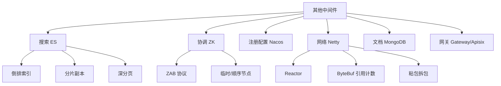

# 12 其他中间件 · 速记知识图谱（P0-P3）

> 模块定位：除 MySQL/Redis/MQ 之外的中间件大杂烩。重点是 **ES + ZooKeeper + Nacos + Netty**。51 题。
> 题量：51 题。

### P0 必背核心

#### ElasticSearch 倒排索引
- **倒排索引（Inverted Index）**：词典（Term）→ 倒排列表（Posting List，文档 ID + 词频 + 位置）。文档分词后建立"词到文档"的映射，与传统"文档到词"相反。
- **写流程**：① 写入内存 Buffer + Translog（顺序写）；② **每 1 秒 refresh** 到 OS Cache 生成新 Segment（此时可搜，**近实时 NRT**）；③ Translog **每 5 秒 fsync** 到磁盘（默认 request）；④ 每 30 分钟或 translog 满 512MB 触发 **flush**（OS Cache 数据写盘 + 清空 translog）。
- **Segment 不可变**：删除标记 .del 文件、更新 = 旧文档标删 + 新文档；后台 Merge 合并小段、清理已删。
- **分词器**：Standard（默认）、IK（中文细粒度/最细）、Pinyin 等。
- 关联题：#0249

#### ES 分片与副本
- **Shard（主分片）**：索引创建时设定数量，**不可修改**；每个分片是独立 Lucene 索引。
- **Replica（副本）**：可动态修改；提供读扩展和高可用，主分片挂了副本提升为主。
- **路由**：默认 `shard = hash(doc_id) % primary_shards`；可指定 routing 字段。
- **数据写入**：先写主分片 → 同步给所有副本 → 都成功返回（`wait_for_active_shards`）。
- **数据读取**：协调节点（任意节点）转发到主或副本（RR 选）。
- 关联题：#0249

#### ES 深度分页
- **传统 from + size**：每个分片各取 from+size，协调节点汇总排序再 size。from=10000、shard=5 时要拉 50050 条，性能差且内存爆。**ES 默认 from+size ≤ 10000**（index.max_result_window）。
- **search_after**：基于上一页最后一条记录的排序值做游标，无 deep page 问题；不支持跳页。**推荐 C 端**。
- **scroll**：建立快照，适合**离线导出全量数据**；占用资源不适合 C 端。
- **PIT（Point In Time）**：7.10+，类似 scroll 但更轻量，配合 search_after 用。
- 关联题：#0249

#### Zookeeper 核心
- **数据模型**：树形 ZNode（类似文件系统），每个节点存 < 1MB 数据 + 子节点。
- **节点类型**：① 持久（PERSISTENT）；② 临时（EPHEMERAL，session 断开自动删，分布式锁用）；③ 顺序（SEQUENTIAL，自动递增编号）；④ 临时顺序（分布式锁的核心）；⑤ Container（无子节点会被定期清理，3.5+）。
- **Watch 机制**：客户端可监听节点的创建/删除/数据变化/子节点变化；**一次性触发**（触发后要重新注册），所以高频变更场景慎用。
- **ZAB 协议**：两阶段——崩溃恢复（Leader 选举 + 数据同步） + 消息广播（Leader 收到写请求 → 广播给 Follower → 多数派 ACK → Leader Commit）。
- **CP 系统**：Leader 选举期间（< 200ms）不可用。
- 关联题：#0249

#### Nacos 核心
- **二合一**：服务注册中心 + 配置中心。
- **服务发现**：临时实例走 **Distro 协议**（AP，类 Eureka 自治集群，性能优先）；永久实例走 **Raft 协议**（CP，强一致）。
- **配置推送**：**长轮询**——客户端发请求 hold 在服务端 29.5s，服务端有变更立即返回，无变更超时返回，客户端再发起。比短轮询省资源比 WebSocket 简单。
- **Spring 集成**：`@NacosValue` 注解 + 自动刷新；`@RefreshScope` 配合 `@Value`。
- **健康检查**：临时实例靠心跳（默认 5s）；永久实例靠主动探测（HTTP/TCP）。
- 关联题：#0249

#### Netty 核心架构
- **主从 Reactor 模式**：① BossGroup（主 Reactor，处理 Accept）；② WorkerGroup（从 Reactor，处理 Read/Write/Decode/Encode/业务）。
- **核心组件**：Channel（连接的抽象）、EventLoop（绑定线程，处理所有事件）、ChannelHandler（业务逻辑）、ChannelPipeline（Handler 链）。
- **ByteBuf**：替代 NIO ByteBuffer。优势：① 读写指针分开（不用 flip）；② 自动扩容；③ 池化（PooledByteBufAllocator）；④ 引用计数（手动 release 否则堆外内存泄漏）。
- **零拷贝**：① CompositeByteBuf 逻辑合并多个 ByteBuf 不复制；② Unpooled.wrappedBuffer 包装数组不复制；③ FileRegion 用 transferTo sendfile。
- **TCP 粘包拆包**：内置解码器 `LengthFieldBasedFrameDecoder`（长度前缀）、`DelimiterBasedFrameDecoder`（分隔符）、`FixedLengthFrameDecoder`（定长）、`LineBasedFrameDecoder`（行尾）。
- **空闲检测**：IdleStateHandler 检测读/写/读写空闲，配合心跳。
- 关联题：#0249

### P1 加分高频

#### ES Mapping 与字段类型
- **Mapping**：相当于 DB 的 schema；可动态生成（dynamic mapping）也可显式定义。
- **常用类型**：text（分词，做全文检索）、keyword（精确匹配，不分词）、long/integer/double、date（多种格式）、boolean、object、nested（嵌套对象数组）。
- **text + keyword 双字段**：`"name": {"type":"text", "fields":{"keyword":{"type":"keyword"}}}`，既能做模糊搜索又能精确匹配/聚合。
- **典型陷阱**：动态生成 mapping 不可改类型（重建索引才行）；一旦设错类型后患无穷。
- 关联题：#0249

#### ES 聚合 Aggregation
- **三大类**：① Metric（avg/sum/min/max/cardinality 基数）；② Bucket（terms 按字段分组、date_histogram 时间桶、range 范围）；③ Pipeline（基于其他聚合结果再聚合）。
- **terms 聚合精度问题**：每个 shard 取 top N 再汇总，N 太小会丢失（如总共 top 10 但每片 top 5 汇总后不准），可调 shard_size。
- **常用组合**：terms（按类目）+ avg（每类平均价格） + cardinality（每类用户数）。

#### 注册中心三选一对比
- **Eureka**：AP，Netflix 已停更，自我保护机制（< 85% 心跳率保留过期节点）。
- **Zookeeper**：CP，Leader 选举期间不可用，性能不如 Eureka/Nacos。
- **Nacos**：AP/CP 可切换，配置 + 注册二合一，国内主流。
- **Consul**：CP，健康检查能力强，K8s 体系不常用。
- 关联题：#0249

#### MongoDB 核心特性
- **文档型 NoSQL**：BSON（类 JSON）存储，schemaless，适合**多变结构数据**（如商品 SKU 属性各异、用户行为日志）。
- **副本集**：3 节点（1 Primary + 2 Secondary），自动故障转移；写默认到 Primary，读可配置（primary/secondary/nearest）。
- **分片**：内置分片支持，按 shard key 哈希/范围分片，Config Server 管路由。
- **聚合管道**：`$match/$group/$project/$lookup/$unwind` 等阶段串联，类似 SQL 但更灵活。
- **WiredTiger 存储引擎**：B+ 树 + 文档级锁（替代旧 MMAP 的库级锁）；快照隔离。
- 关联题：#0249

#### API 网关选型
- **Spring Cloud Gateway**：Spring Boot 生态，基于 Netty + Reactor 非阻塞；Java 团队首选。
- **Zuul 1**：基于 Servlet 阻塞 IO，吞吐低，已不推荐。
- **Apisix**：基于 Nginx + Lua + etcd，性能高、热更新、插件丰富，云原生主流。
- **Kong**：同 Apisix 思路，社区版功能受限，企业版收费。
- **OpenResty / 自研 Nginx + Lua**：自研成本高但极致灵活。

### P2 深度延伸

#### ES 写入性能优化
- 关闭 refresh_interval（如导入时设 -1，导完恢复 1s）。
- 关闭 replica（导入完再开启）。
- 增大 bulk 批次（5-15 MB / 批，不是越大越好）。
- 增大 indexing buffer（indices.memory.index_buffer_size）。
- 用 SSD、调高 thread_pool.write.queue_size。

#### ZK 羊群效应与 Watch 优化
- **羊群效应**：多个客户端 Watch 同一个节点，节点变化时全部被唤醒去抢锁。
- **解决**：分布式锁场景每个客户端只 Watch 前一个节点（顺序节点），形成"链式监听"，谁释放只唤醒后面那个。

#### ES Query DSL 精要
- **bool**：must（AND，参与打分）、must_not（NOT）、should（OR）、filter（AND 不参与打分，可缓存）。
- **filter vs must**：filter 不算分且可缓存，等值/范围条件优先用 filter。
- **match vs term**：match 走分词器；term 精确匹配不分词。
- **range**：gte / lte / gt / lt。
- **bool + filter + range + term** 是 80% 业务查询的组合。

#### Netty 内存泄漏
- **原因**：ByteBuf 未调 release()，堆外内存累积。
- **检测**：`-Dio.netty.leakDetection.level=PARANOID`（全量检测，性能差，仅测试用）；默认 SIMPLE 抽样检测。
- **最佳实践**：用 `try { ... } finally { byteBuf.release(); }`；ChannelInboundHandlerAdapter 默认 fireChannelRead 后会自动 release。

#### MongoDB vs MySQL 选型
- **MongoDB 优势**：schemaless、嵌套数据自然存储、水平扩展容易、地理位置查询。
- **MySQL 优势**：强事务、生态成熟、SQL 标准、运维工具多。
- **业务选型**：核心业务（订单、支付、用户）用 MySQL；日志/行为/IoT 数据/CMS 灵活字段用 MongoDB。

### P3 冷门刁钻

#### ES 协调节点 vs 数据节点 vs 主节点
- **协调节点（Coordinating）**：接收请求、分发、汇总结果；任意节点默认都有此角色。
- **数据节点（Data）**：存数据、执行查询。
- **主节点（Master）**：管理集群元数据、分片分配、节点加入退出；用 master-eligible 选举。
- 生产建议：专用 master（3 个，small instance）、专用 coordinating（应对突发查询）、专用 data。

#### Zookeeper 与 etcd 对比
- **ZK**：ZAB 协议、Java、Watch 一次性、API 简单。
- **etcd**：Raft 协议、Go、Watch 持续推送、HTTP/2 + gRPC API、CNCF 标准、K8s 用。

#### Lucene 与 ES 的关系
- **Lucene** 是 Java 全文检索库（Doug Cutting 写的），核心是倒排索引、Segment、Query。
- **ES** 是 Lucene 的分布式封装，加了集群、分片、副本、HTTP API、聚合、监控。
- **Solr** 是另一个 Lucene 封装，老牌但近年被 ES 反超。

### 跨模块联想

- ES 倒排索引 ↔ **05 MySQL**：MySQL 的 B+ 树正排 vs ES 倒排，互补使用（MySQL 抗事务 + ES 抗复杂查询）。
- ZK ↔ **10 分布式锁与ID**：临时顺序节点做锁、Watch 做 ID 协调。
- Nacos ↔ **08 微服务**：服务注册 + 配置二合一是国内主流。
- Netty ↔ **01 Java 基础**：NIO + Reactor 的实战封装；ByteBuf 替代 ByteBuffer。
- Netty ↔ **13 网络**：粘包拆包、心跳、零拷贝的工程实现。
- ES ↔ **11 分库分表**：分库分表后用 ES 做异构存储扛 C 端复杂查询。
- MongoDB ↔ **15 业务场景**：日志、IoT、用户行为这类灵活字段场景。
- API 网关 ↔ **15 业务场景**：限流、鉴权、灰度、协议转换的统一入口。

---
