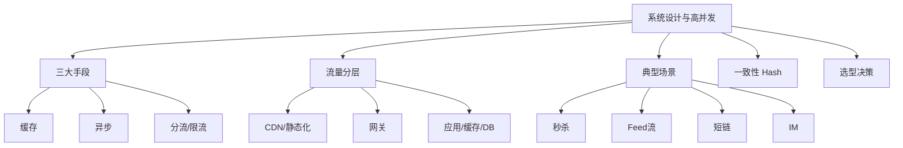

# 14 系统设计与高并发 · 速记知识图谱（P0-P3）

> 模块定位：架构岗"开放题"。三招通吃：**缓存 + 异步 + 分流**。重点是"为什么这么做"而非"做了什么"。26 题。
> 题量：26 题。

### P0 必背核心

#### 高并发三大核心手段
- **缓存**：把热点数据放在更快的存储（本地内存 Caffeine → 分布式 Redis → DB），减少对慢介质的请求。
- **异步**：把同步阻塞改成异步非阻塞（MQ 削峰填谷、CompletableFuture 并行调用、回调通知 vs 轮询）。
- **分流**：把请求按维度分散（限流、负载均衡、分库分表、读写分离、CDN）。
- **三者顺序**：先缓存（最易见效）→ 再分流（容易加机器/分片）→ 最后异步（改业务模型，代价大）。
- 关联题：#0034

#### 流量分层架构
- **L1 接入层 CDN**：静态资源（图片、JS、CSS）缓存到边缘节点，减少回源。
- **L2 静态化**：动态页面预渲染成静态 HTML（如商品详情页定时刷新）。
- **L3 网关**：限流、鉴权、灰度、协议转换。
- **L4 应用集群**：水平扩展，无状态便于扩容。
- **L5 缓存（Redis）**：扛住大部分读请求。
- **L6 DB（MySQL）**：最后兜底，写为主。
- **L7 下游服务**：调外部 API/MQ/搜索。
- **每一层都尽量挡住请求**：CDN 挡 80%、静态化挡 5%、缓存挡 14%，到 DB 只剩 1%。
- 关联题：#0034

#### 秒杀系统设计
- **核心难点**：① 瞬时大流量（百万 QPS）；② 库存不能超卖；③ 防黄牛刷子。
- **应对**：
  - **前端**：CDN 缓存活动页、按钮置灰防重复点击、答题/验证码、URL 动态化（活动开始前 URL 隐藏防提前抓包）。
  - **接入层**：网关限流（每用户每接口 QPS）、IP 限流、风控（同设备 / 同手机号）。
  - **应用层**：Redis 预扣库存（Lua 脚本原子性 `if stock > 0 then decr else fail`）、扣减成功后发 MQ 异步落库（生成订单 / 扣库存）。
  - **库存**：库存预热到 Redis（活动开始前同步 DB → Redis）；分桶库存（100 库存分成 10 桶 × 10，分散热点）。
  - **订单**：MQ 异步生成订单 → 用户拿到"排队中"状态 → 轮询订单结果。
  - **超时未支付**：延迟队列 30 分钟回滚库存。
- **防超卖**：Redis Lua 原子扣减 + DB 行锁兜底 + MQ 异步对账。
- 关联题：#0034

#### Feed 流推 / 拉 / 推拉结合
- **推模式（写扩散）**：A 发动态时，写到所有粉丝的"收件箱"（Redis ZSet 按时间排序）。读快、写贵。
  - 适合：好友数少（朋友圈，5000 上限）、读频繁。
- **拉模式（读扩散）**：A 发动态写到"自己的发件箱"；B 刷动态时，拉取自己关注的所有人的发件箱合并。写快、读贵。
  - 适合：粉丝数多（微博大 V 千万粉，推不动）、读频次低。
- **推拉结合**：普通用户用推（少粉丝读取多）；大 V 用拉（粉丝多，避免写放大）；客户端拉时合并自己收件箱 + 关注大 V 的发件箱。
- **微博方案**：用户分级 + 推拉结合 + Redis 排行 + 兜底降级。
- 关联题：#0034

#### 库存扣减方案对比
- **DB 行锁**：`UPDATE stock SET count = count - 1 WHERE id = X AND count >= 1`。优点：强一致，简单。缺点：单热点性能 < 1000 TPS。
- **DB 乐观锁**：`UPDATE stock SET count = count - 1, version = version + 1 WHERE id = X AND version = ?`。乐观重试，性能比悲观稍好但热点仍是瓶颈。
- **Redis 预扣 + MQ 异步落库**：Lua 脚本原子扣 Redis 库存 + 发 MQ → 消费者落库。性能最高（百万 QPS），但**最终一致**（中间挂了要对账）。
- **分桶库存**：100 库存分 10 桶 × 10，每桶独立扣减，分散热点（用户路由到某桶）；某桶卖完可向其他桶借。
- 关联题：#0034

### P1 加分高频

#### 短链系统
- **核心**：长 URL → 短 URL（如 t.cn/abc123）→ 重定向到长 URL。
- **生成方式**：
  - 发号器（雪花/数据库自增）+ 转 Base62（[0-9a-zA-Z] 62 字符），6 位 = 568 亿组合够用。
  - Hash + 冲突处理（碰撞率不低，不推荐）。
- **存储**：Redis 主存（短码→长 URL），MySQL 持久化。
- **重定向**：301（永久，浏览器缓存，省服务端流量但统计不准）vs 302（临时，每次都到服务端，统计准确，大厂主流）。
- **防刷**：短码不可枚举（不连续）、限流、风控。

#### 评论 / 点赞 / 排行榜
- **评论**：树状结构，常用"楼中楼"（父评论 + 子评论分页）；冷热分离（热数据 Redis，冷数据 MySQL 分库分表）。
- **点赞**：高频写，用 Redis 计数（Hash 或 String INCR） + 定时落库；防作弊（同用户同对象一次）。
- **排行榜**：Redis ZSet 实时排（ZADD score）；分时段排（日榜/周榜，过期 TTL）；千万级用户用分桶。
- 关联题：#0034

#### 用户签到 / Bitmap
- **场景**：千万用户日签到，DB 表会爆。
- **Bitmap 方案**：每用户一个 Bitmap，offset = 日期偏移；签到 `SETBIT user:123:202405 24 1`；查连续 N 天 `BITCOUNT` + `BITPOS`。
- **空间**：30 天 = 30 bit = 4 字节/用户，千万用户 40 MB。
- 关联题：#0034

#### 限时活动 / 优惠券
- **领取**：Redis SETNX 用户领取记录 + LIST 库存；活动前预热到 Redis。
- **使用**：状态机（未领→已领→已用→已过期），状态变更只能单向。
- **过期**：① Redis EXPIRE；② DB 定时任务扫；③ 延迟队列（领取时入队，到期自动失效）。

#### IM 系统设计
- **长连接**：Netty 维护用户长连接（百万长连接单机可达，调内核参数 + 减少 Heap）。
- **路由**：用户 → 接入网关 → 路由到具体的接入网关（用户 ID 取模）。
- **消息**：消息分发服务 + 离线消息（Redis 或专用 KV 存储离线消息）+ 已读回执。
- **可靠投递**：客户端 ACK + 服务端重试 + 去重 ID。
- **群聊扩散**：写扩散到每个成员的离线队列；大群（万人群）用拉模式。

#### 12306 抢票
- **核心难点**：库存复杂（车次 × 区间 × 座位）、瞬时高并发、绝对公平（不能少卖也不能多卖）。
- **应对**：① 静动分离（静态页 CDN）；② 排队令牌（拿到令牌才能进下单流程，限制后端并发）；③ 候补订单（无票时进队列）；④ 异步下单（前端轮询订单状态）；⑤ 风控（防刷）。

### P2 深度延伸

#### 一致性 Hash 与虚拟节点
- 见 #11 分库分表。
- **应用场景**：① Redis 分片路由（客户端分片 / Twemproxy）；② 负载均衡（同用户落同后端）；③ CDN 节点分配。

#### CDN 工作原理
- **DNS 调度**：用户访问 → 本地 DNS 询问 → 智能 DNS 返回离用户最近的 CDN 节点 IP → 用户访问该节点。
- **回源**：CDN 节点无缓存 → 回源到源站 → 缓存到本节点 → 返回用户。
- **缓存策略**：HTTP Cache-Control / Expires 控制；304 协商缓存。
- **预热与刷新**：大活动前预热静态资源；版本更新后刷新缓存。

#### 缓存设计分层
- **L1 本地缓存 Caffeine**：进程内，访问 < 1μs，容量小（GB 级）；适合超热点数据，注意一致性（多机不一致）。
- **L2 分布式缓存 Redis**：访问 < 1ms，容量中（百 GB），共享一致；扛住主要读流量。
- **L3 DB**：MySQL 兜底，QPS 千级。
- **多级缓存策略**：先查 L1，miss 查 L2，miss 查 DB；写时穿透或失效。

#### 数据库选型
- **OLTP（事务型）**：MySQL / PostgreSQL / TiDB / OceanBase；ACID + 高并发短事务。
- **OLAP（分析型）**：ClickHouse / Hive / Druid / Doris；批量扫描 + 聚合，列式存储。
- **KV**：Redis（内存）、RocksDB（嵌入式）、HBase（海量分布式）。
- **文档**：MongoDB；schemaless、嵌套结构。
- **搜索**：ES / Solr；全文检索 + 聚合。
- **图**：Neo4j / Nebula；关系密集查询（社交、风控）。
- **时序**：InfluxDB / TDengine / Prometheus；监控数据。

#### 异地多活
- **三种级别**：① 同城双活（机房距离 < 50km，专线，强一致）；② 异地多活（跨城，最终一致，单元化）；③ 异地灾备（冷备，业务无感切换难）。
- **单元化**：业务按用户 ID 路由到固定机房（单元），单元内自治，跨单元用 MQ 异步同步。
- **难点**：① 数据双向同步（避免循环）；② 路由策略（用户切单元怎么办）；③ 强一致业务（如全局唯一）的特殊处理。

### P3 冷门刁钻

#### 微信红包拆分算法
- **二倍均值法**：每人能抢的金额 = (剩余金额 / 剩余人数) × 2 之内随机；保证后面人也有得抢。
- **公式**：random(0.01, remainingMoney / remainingCount × 2)。
- **预生成 vs 实时算**：① 预先把 N 个红包金额算好存 Redis List，用户来时 LPOP 拿（性能高、绝对一致）；② 实时算（公平但要并发控制）。微信用预生成。

#### Feed 流时间线一致性
- 用户既能看到自己发的（强一致），又能看到关注者发的（最终一致）。
- 客户端发布后立即把自己的动态插入本地时间线；服务端异步处理推送给粉丝。

#### Twitter Snowflake 系统设计
- 用户量 5 亿，10 亿条 Tweet/天，要点赞计数、关注关系、Feed 流：
  - 用户表 + 关注表分库分表（按 user_id）。
  - Tweet 用雪花 ID + 分库分表（按时间 + user_id）。
  - Feed 流用推拉结合 + Redis ZSet。
  - 点赞用 Redis 计数 + 定时落库。

### 跨模块联想

- 缓存设计 ↔ **06 Redis**：旁路缓存、延迟双删、雪崩穿透击穿。
- 异步 ↔ **07 消息队列**：削峰填谷的核心，秒杀必用。
- 分流 ↔ **08 微服务**：负载均衡、限流、分片路由。
- 一致性 Hash ↔ **11 分库分表**：相同思想不同场景。
- 库存扣减 ↔ **05 MySQL** + **06 Redis**：DB 行锁 vs Redis Lua。
- 限流 ↔ **08 微服务**：网关限流、Sentinel、Guava RateLimiter。
- Feed 流 ↔ **15 业务场景**：写扩散/读扩散是高频题。
- 异地多活 ↔ **11 分库分表**：单元化路由是基础。
- 短链/秒杀 ↔ **15 业务场景**：开放设计题"百题答案"。

---
