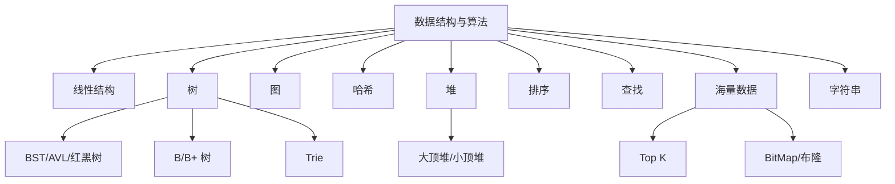

# 17 数据结构与算法 · 速记知识图谱（P0-P3）

> 模块定位：高级岗会问"为什么用 X 数据结构"而不是手撕题。重点是**应用场景 + 复杂度权衡**。27 题。
> 题量：27 题。

### P0 必背核心

#### 数组 vs 链表
- **数组**：连续内存，随机访问 O(1)、中间插入删除 O(n)；CPU 缓存友好；扩容代价大。
- **链表**：节点分散，随机访问 O(n)、头尾增删 O(1)；缓存不友好；额外指针开销。
- **跳表 SkipList**：链表 + 多级索引，查询 O(log n)，实现简单（vs 红黑树）；Redis ZSet、LevelDB MemTable 用。
- 关联题：#0040

#### 哈希表（HashMap 视角）
- **结构**：数组 + 冲突解决（开放寻址 / 链地址法）。Java HashMap 用链地址法 + 1.8 后链表过长转红黑树。
- **复杂度**：平均 O(1)，最坏 O(n)（全冲突，攻击场景）。
- **冲突解决对比**：
  - **开放寻址**：探测下一个空位（线性 / 二次 / 双重哈希）。ThreadLocalMap 用。
  - **链地址**：每槽位挂链表。HashMap 用。
- **负载因子**：HashMap 0.75 经验值，平衡空间和冲突率。
- 关联题：#0040

#### 二叉树家族（BST/AVL/红黑树）
- **BST 二叉搜索树**：左 < 根 < 右，平均 O(log n) 但最坏退化成链表 O(n)。
- **AVL 树**：严格平衡（左右子树高度差 ≤ 1），查询稳定 O(log n)；插入删除旋转多，写性能不如红黑树。
- **红黑树**：5 条性质（根黑、叶 NIL 黑、红节点子必黑、任一路径黑节点数同、新插入红色）。**牺牲部分查询性能换更少旋转**，工程上更常用。
- **应用**：HashMap 链表过长转树、TreeMap、ConcurrentHashMap 1.8、Linux 内核 CFS 调度。
- 关联题：#0040

#### B 树 / B+ 树（数据库索引）
- **B+ 树**：① 只有叶子节点存数据；② 叶子节点用双向链表串联；③ 非叶节点存索引键和指针。
- **MySQL InnoDB 用 B+ 树**：扇出大（每页存千+ key）、树高低（3-4 层管亿级数据）、范围查询快（沿叶子链表）。
- **vs B 树**：B 树每节点都存数据 → 单页 key 数少 → 树高高 → 磁盘 IO 多；范围查询要回溯。
- **InnoDB 一页 16 KB**：根据指针大小 + 键长度算出每节点能存的 key 数。
- 关联题：#0037

#### 堆与 PriorityQueue
- **堆是一种特殊的完全二叉树**：父 ≥ 子（大顶堆）或父 ≤ 子（小顶堆）；用数组实现，父子下标关系 `parent = (i-1)/2, left = 2i+1, right = 2i+2`。
- **操作**：插入 O(log n)（上浮）、删除堆顶 O(log n)（下沉）、查堆顶 O(1)。
- **应用**：① **Top K 问题**（小顶堆，O(n log k)）；② **优先队列**（任务调度、Dijkstra 最短路径）；③ **堆排序**（O(n log n) 不稳定排序）；④ **DelayQueue**（按时间排序的优先队列）；⑤ **定时器**（时间轮也是变形）。
- **Java**：`PriorityQueue` 默认小顶堆，可传 Comparator 改大顶堆 `new PriorityQueue<>(Comparator.reverseOrder())`。
- 关联题：#0040

#### Top K 问题
- **场景**：海量数据找最大 / 最小的 K 个，K << N。
- **小顶堆法**：维护大小为 K 的小顶堆，遍历元素 > 堆顶就替换并下沉。时间 O(n log k)，空间 O(k)。
- **快速选择 BFPRT**：基于快排 partition 选择第 K 大，平均 O(n)、最坏 O(n²)（BFPRT 改进到最坏 O(n)）。
- **分布式 Top K**：① 各机算 top K；② 汇总各机的 top K 再算全局 top K；不一定准（边界情况），可调 N 提高准度。
- 关联题：#0039、#0040

### P1 加分高频

#### 排序算法对比
- **快速排序**：平均 O(n log n)，最坏 O(n²)；不稳定；原地排序（空间 O(log n) 栈）。**Java Arrays.sort 基本类型用双轴快排**。
- **归并排序**：稳定 O(n log n)；额外空间 O(n)；**外部排序用归并**（大数据分块）。
- **堆排序**：O(n log n)，原地，不稳定；适合 Top K。
- **TimSort**：归并 + 插入混合，对部分有序数据极快。**Java Arrays.sort 对象数组用 TimSort**（保证稳定）。
- **计数 / 桶 / 基数排序**：线性 O(n+k)，适合数据范围有限。
- 关联题：#0040

#### 二分查找及变体
- **基础**：有序数组找目标，O(log n)；要点是 `mid = left + (right - left) / 2`（防溢出）。
- **变体**：
  - 找第一个 ≥ target（lower_bound）：`left <= mid` 时 right = mid - 1 移动方式不同。
  - 找最后一个 ≤ target（upper_bound）。
  - 旋转数组中查找。
  - 在两个有序数组中找第 K 小（Median of Two Sorted Arrays）。
- **Java**：`Arrays.binarySearch(arr, target)` 返回索引或负数（插入点的 -(insertion point) - 1）。

#### 跳表 SkipList
- **结构**：每个节点有多层指针，上层是下层的"索引"。第 i 层节点以 1/2 概率出现在第 i+1 层。
- **复杂度**：平均查询 O(log n)，期望空间 O(n)（额外常数倍空间存上层）。
- **优势**：实现简单（vs 红黑树）、范围查询友好（底层是链表）、易并发改造。
- **应用**：Redis ZSet（跳表 + Hash 表）、LevelDB / RocksDB MemTable、Lucene 倒排链。
- **Redis 为啥用跳表而不用红黑树**：① 范围查询天然支持；② 实现简单；③ ZRANGE 顺序访问性能好。
- 关联题：#0040

#### LRU / LFU 实现
- **LRU**：HashMap + 双向链表。HashMap 存 key→Node，访问 / 插入时把 Node 移到链表头，超容量淘汰链表尾。Java `LinkedHashMap` 内置（accessOrder=true）。
- **LFU**：HashMap + 频次表 + 双向链表（每频次一个链表）。复杂度也是 O(1) 但实现更复杂。
- **应用**：Redis maxmemory-policy allkeys-lru/lfu、操作系统页面置换、CDN 缓存。

#### 字符串 KMP / Trie
- **KMP**：模式串匹配。预处理 next 数组（最长公共前后缀），失配时不回退主串。复杂度 O(m + n)。
- **Trie 前缀树**：字符串集合的树形结构，每个节点代表一个字符；插入 / 查询 O(L)（L 是串长）。**应用**：自动补全、字典、IP 路由表、敏感词过滤。
- **AC 自动机**：Trie + KMP，多模式串匹配；敏感词检测、HTTP 头匹配。

#### 动态规划基本思想
- **三要素**：① 状态定义；② 状态转移方程；③ 边界条件。
- **优化**：滚动数组减空间；记忆化搜索 = 自顶向下 DP。
- **经典题型**：背包（0-1 / 完全 / 多重）、最长上升子序列（LIS）、最长公共子序列（LCS）、编辑距离、股票买卖、打家劫舍。
- **判断 DP**：① 求最值 / 计数 / 可行性；② 有重叠子问题；③ 子问题独立。

#### 回溯 / 分治
- **回溯**：暴力穷举所有可能路径，剪枝。经典：N 皇后、全排列、子集、组合总和、数独。
- **分治**：把问题分成多个子问题独立解决再合并。经典：归并排序、快速排序、Karatsuba 大数乘法、最近点对。

### P2 深度延伸

#### 海量数据处理套路
- **存在性 / 去重**：
  - 数据少（GB 级）：HashSet。
  - 数据中（TB 级）：BitMap（每数 1 bit）；范围 0-10 亿 占 125 MB。
  - 数据极大且允许误判：**布隆过滤器 BloomFilter**——多个 hash 函数 + bit 数组，"不存在一定不存在，存在可能误判"。
- **排序**：内存装不下用 **外部排序**（分块内存排序 + 多路归并）。
- **Top K**：小顶堆 / 分布式归并。
- **频次统计**：HashMap 直接统计 / Count-Min Sketch（近似）。
- **基数估计**：HyperLogLog（Redis 内置，12 KB 估亿级基数，误差 0.81%）。

#### 布隆过滤器
- **原理**：bit 数组 + k 个独立 hash 函数；插入时 k 个位都置 1；查询时 k 个位都为 1 才说"可能存在"，否则一定不存在。
- **误判率公式**：`(1 - e^(-kn/m))^k`，n 是元素数、m 是 bit 数。Guava BloomFilter 默认 fpp = 3%。
- **应用**：
  - 缓存穿透（先布隆过滤拦截不存在的 key）。
  - 黑名单（如垃圾邮件地址）。
  - HBase / LevelDB 内部判断 key 是否在某个 SSTable。
- **变种**：Counting BloomFilter（支持删除）、Cuckoo Filter（误判率更低 + 支持删除）。

#### HyperLogLog
- **目的**：估算大集合的基数（不重复元素数）。
- **原理**：哈希后看二进制末尾连续 0 的最大长度；多分桶取调和平均；12 KB 估亿级，误差 0.81%。
- **Redis**：PFADD / PFCOUNT / PFMERGE。**典型场景**：UV 统计（千万用户精确 1 KB×千万 = 10 GB，HLL 12 KB 全搞定）。

#### Trie 树压缩 / Patricia Tree
- 长链 / 单分支压缩成一条边带字符串；用于 IP 路由表、文件系统路径索引（Linux dentry）、Ethereum MPT。

#### 图基础
- **存储**：邻接矩阵（V²，稠密）vs 邻接表（V+E，稀疏）。
- **遍历**：DFS（递归 / 栈，找路径）、BFS（队列，最短路径）。
- **最短路径**：① Dijkstra（无负权，优先队列）；② Bellman-Ford（含负权）；③ Floyd（多源最短，O(V³)）；④ A*（启发式）。
- **最小生成树**：Prim（优先队列）、Kruskal（按边排序 + 并查集）。
- **拓扑排序**：BFS Kahn 算法 / DFS 后序逆序；找环。

### P3 冷门刁钻

#### 一致性 Hash 实现
- TreeMap（红黑树）维护 hash → 节点映射；查询时 ceilingEntry 找顺时针下一个节点。虚拟节点解决倾斜。

#### 蓄水池抽样
- 数据流中均匀抽 K 个样本（不知道总数 N）：① 前 K 个直接放入；② 第 i 个（i > K）以 K/i 概率替换池中一个随机位置。
- 应用：海量日志均匀抽样、流式数据 Top K 近似。

#### 时间轮算法
- 大量定时任务调度（百万级）。环形数组 + 链表，时针推进；多层时间轮处理长延迟。
- 应用：Kafka 延迟生产、Netty HashedWheelTimer、Linux 内核 timer。

#### LSM 树 vs B+ 树
- **LSM**：写放大但顺序写极快（HBase、LevelDB、RocksDB、Cassandra）；多层 SSTable + 后台 Compaction。
- **B+ 树**：随机写、读快。
- **选型**：写多读少（日志、监控）用 LSM；读写均衡（OLTP）用 B+ 树。

### 跨模块联想

- B+ 树 ↔ **05 MySQL**：InnoDB 索引的核心；为啥不用 B 树 / 红黑树 / Hash。
- 红黑树 ↔ **01 Java 基础**：HashMap 链表过长转红黑树、TreeMap。
- 跳表 ↔ **06 Redis**：ZSet 用跳表 + Hash 表。
- 堆 ↔ **15 业务场景**：Top K 排行榜、延迟队列。
- LRU ↔ **06 Redis**：maxmemory-policy 淘汰策略。
- 布隆过滤器 ↔ **06 Redis**：缓存穿透防护。
- HyperLogLog ↔ **06 Redis**：UV 统计。
- 一致性 Hash ↔ **11 分库分表**：分片路由。
- 时间轮 ↔ **20 任务调度**：海量定时任务。
- 字典树 ↔ **15 业务场景**：敏感词过滤、自动补全。

---
