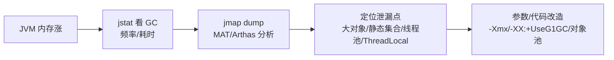

# Java 高级面试速记知识图谱（P0–P3 全景版）· 索引

> 面向：3-7 年高级 Java 开发岗位面试复习。
> 用法：本文件是**导航索引**，每个模块的详细知识点已拆到对应目录下的 `速记知识图谱.md`。

---

## 等级体系

| 等级 | 含义 | 不会的后果 | 占比 |
|---|---|---|---|
| **P0** 必背核心 | 高级岗"地板线"，每场面试几乎必问，答错直接判死 | 一票否决 | 35% |
| **P1** 加分高频 | 出现频率高，答好能拉开差距，体现"是否系统学习过" | 表现平庸 | 28% |
| **P2** 深度延伸 | 资深岗考察底层原理、源码级理解，体现"是否真懂" | 看不出深度 | 21% |
| **P3** 冷门刁钻 | 偶发深挖、面试官个人偏好题，答对加分但不答也不致命 | 影响不大 | 15% |

**复习节奏**：
- 临阵磨枪（1-3 天）：只刷各模块 P0。
- 短期冲刺（1-2 周）：P0 + P1。
- 系统复习（1 个月+）：全部，重点啃 P2。

---

## 全景知识地图

```mermaid
flowchart TD
    ROOT["Java 后端高级面试<br/>知识体系"]

    ROOT --> L1["① 语言与运行时<br/>(底座)"]
    ROOT --> L2["② 框架与中间件<br/>(工具箱)"]
    ROOT --> L3["③ 数据与存储<br/>(状态)"]
    ROOT --> L4["④ 分布式与高并发<br/>(规模)"]
    ROOT --> L5["⑤ 排查调优<br/>(SRE)"]
    ROOT --> L6["⑥ 表达与软实力<br/>(临场)"]

    L1 --> M01["01 Java基础"]
    L1 --> M02["02 JVM"]
    L1 --> M03["03 并发编程"]
    L1 --> M13["13 网络与OS"]
    L1 --> M17["17 数据结构与算法"]

    L2 --> M04["04 Spring体系"]
    L2 --> M12["12 其他中间件"]
    L2 --> M19["19 工具与工程"]
    L2 --> M20["20 任务调度"]
    L2 --> M21["21 Excel与文件"]

    L3 --> M05["05 MySQL"]
    L3 --> M06["06 Redis"]
    L3 --> M11["11 分库分表"]

    L4 --> M07["07 消息队列"]
    L4 --> M08["08 微服务与分布式"]
    L4 --> M09["09 分布式事务"]
    L4 --> M10["10 分布式锁与ID"]
    L4 --> M14["14 系统设计与高并发"]
    L4 --> M15["15 业务场景题"]

    L5 --> M16["16 性能调优"]

    L6 --> M18["18 AI与大模型"]
    L6 --> M22["22 面经与项目"]
    L6 --> M23["23 软技能与面试准备"]
```



---

## 高频联想链路




---

## 模块导航

| # | 模块 | 题量 | 速记图谱 | 重点 |
|---|---|---|---|---|
| 01 | Java基础 | 243 | [打开](01_Java基础/速记知识图谱.md) | 集合/反射/IO/Lambda |
| 02 | JVM | 63 | [打开](02_JVM/速记知识图谱.md) | 内存/GC/类加载/排查 |
| 03 | 并发编程 | 98 | [打开](03_并发编程/速记知识图谱.md) | JMM/AQS/线程池/JUC |
| 04 | Spring体系 | 60 | [打开](04_Spring体系/速记知识图谱.md) | IOC/AOP/事务/Boot |
| 05 | MySQL | 153 | [打开](05_MySQL/速记知识图谱.md) | InnoDB/索引/MVCC/锁/日志 |
| 06 | Redis | 74 | [打开](06_Redis/速记知识图谱.md) | 数据类型/持久化/集群/三大问题 |
| 07 | 消息队列 | 51 | [打开](07_消息队列/速记知识图谱.md) | Kafka/RocketMQ/可靠性/顺序 |
| 08 | 微服务与分布式 | 58 | [打开](08_微服务与分布式/速记知识图谱.md) | 注册/调用/熔断/网关 |
| 09 | 分布式事务 | 25 | [打开](09_分布式事务/速记知识图谱.md) | 2PC/TCC/Saga/Seata |
| 10 | 分布式锁与ID | 43 | [打开](10_分布式锁与ID/速记知识图谱.md) | Redisson/雪花/Leaf |
| 11 | 分库分表 | 24 | [打开](11_分库分表/速记知识图谱.md) | Hash/基因法/ShardingSphere |
| 12 | 其他中间件 | 51 | [打开](12_其他中间件/速记知识图谱.md) | ES/ZK/Nacos/Netty |
| 13 | 网络与操作系统 | 68 | [打开](13_网络与操作系统/速记知识图谱.md) | TCP/HTTP/epoll/零拷贝 |
| 14 | 系统设计与高并发 | 26 | [打开](14_系统设计与高并发/速记知识图谱.md) | 缓存/异步/分流/秒杀 |
| 15 | 业务场景题 | 61 | [打开](15_业务场景题/速记知识图谱.md) | 订单/库存/Feed/对账 |
| 16 | 性能调优与故障排查 | 34 | [打开](16_性能调优与故障排查/速记知识图谱.md) | CPU/内存/GC/Arthas |
| 17 | 数据结构与算法 | 27 | [打开](17_数据结构与算法/速记知识图谱.md) | B+树/跳表/堆/TopK |
| 18 | AI与大模型 | 30 | [打开](18_AI与大模型/速记知识图谱.md) | LLM/RAG/Agent/SpringAI |
| 19 | 工具与工程 | 21 | [打开](19_工具与工程/速记知识图谱.md) | Maven/Git/Docker/K8s |
| 20 | 任务调度 | 11 | [打开](20_任务调度/速记知识图谱.md) | XXL-Job/延迟任务/cron |
| 21 | Excel与文件处理 | 6 | [打开](21_Excel与文件处理/速记知识图谱.md) | EasyExcel/分片/秒传 |
| 22 | 面经与项目分享 | 61 | [打开](22_面经与项目分享/速记知识图谱.md) | STAR/项目讲解/简历包装 |
| 23 | 软技能与面试准备 | 13 | [打开](23_软技能与面试准备/速记知识图谱.md) | 自我介绍/谈薪/反问/Offer |

---

## 文件组织说明

```
java8gu-速记版/
├── Java高级面试速记知识图谱.md        ← 你在看的这个文件（轻量索引 + 全景图）
├── INDEX.md                            ← 原始全量题目索引
├── 知识点全景图.md
├── 全模块知识关联图谱.md
├── 手机速记知识图谱.md
├── 全量标题速记知识图谱.md             ← 以上 4 个是原有的不同视角图谱
└── 01_Java基础/
    ├── README.md                       ← 该模块的题目清单
    ├── 速记知识图谱.md                  ← 该模块的 P0-P3 速记知识图谱（新增）
    └── 0xxx_xxx.md                     ← 具体题目文件
```

**复习方式**：
- **全局视角** → 看本文件的全景图 + 联想链路。
- **专项复习** → 进对应模块的 `速记知识图谱.md`，按 P0→P1→P2→P3 顺序看。
- **深挖某题** → 模块内通过 `关联题：#0xxx` 跳到原始题目文件。
- **修改维护** → 改哪个模块就动哪个模块的小文件，不影响其他模块。

---

## 统计数据

- 总知识点：**552 个**（518 P 级 + 34 软技能/面经条目）
- 等级分布：P0 35.1%（182）｜ P1 28.4%（147）｜ P2 21.4%（111）｜ P3 15.1%（78）
- Mermaid 图谱：每模块至少 1 个，共 27 个
- 总字符数：约 21 万
- 覆盖原题库：1301 题，23 个一级分类
