# Java 高级面试速记知识图谱（P0–P3 全景版）

> 面向：3-7 年高级 Java 开发岗位面试复习。
> 目标：一份大文档过完所有面试重点，不需要翻原题库。
> 风格：每个知识点 3-8 句话，列出定义/原理/关键数字/典型陷阱，并标注等级。

---

## 等级体系（重要）

| 等级 | 含义 | 不会的后果 | 占比目标 |
|---|---|---|---|
| **P0** 必背核心 | 高级岗"地板线"，每场面试几乎必问，答错直接判死 | 一票否决 | 约 30% |
| **P1** 加分高频 | 出现频率高，答好能拉开差距，体现"是否系统学习过" | 表现平庸 | 约 35% |
| **P2** 深度延伸 | 资深岗考察底层原理、源码级理解，体现"是否真懂" | 看不出深度 | 约 25% |
| **P3** 冷门刁钻 | 偶发深挖、面试官个人偏好题，答对加分但不答也不致命 | 影响不大 | 约 10% |

**复习节奏建议**：
- 临阵磨枪（1-3 天）：只刷 **P0**。
- 短期冲刺（1-2 周）：**P0 + P1**。
- 系统复习（1 个月+）：全部，重点啃 **P2**。
- 拿到 offer 后留底：**P3** 作为知识储备。

---

## 全景知识地图

```mermaid
flowchart TD
    ROOT["Java 后端高级面试<br/>知识体系"]

    ROOT --> L1["① 语言与运行时<br/>(底座)"]
    ROOT --> L2["② 框架与中间件<br/>(工具箱)"]
    ROOT --> L3["③ 数据与存储<br/>(状态)"]
    ROOT --> L4["④ 分布式与高并发<br/>(规模)"]
    ROOT --> L5["⑤ 排查调优<br/>(SRE)"]
    ROOT --> L6["⑥ 表达与软实力<br/>(临场)"]

    L1 --> M01["01 Java基础"]
    L1 --> M02["02 JVM"]
    L1 --> M03["03 并发编程"]
    L1 --> M13["13 网络与OS"]
    L1 --> M17["17 数据结构与算法"]

    L2 --> M04["04 Spring体系"]
    L2 --> M12["12 其他中间件"]
    L2 --> M19["19 工具与工程"]
    L2 --> M20["20 任务调度"]
    L2 --> M21["21 Excel与文件"]

    L3 --> M05["05 MySQL"]
    L3 --> M06["06 Redis"]
    L3 --> M11["11 分库分表"]

    L4 --> M07["07 消息队列"]
    L4 --> M08["08 微服务与分布式"]
    L4 --> M09["09 分布式事务"]
    L4 --> M10["10 分布式锁与ID"]
    L4 --> M14["14 系统设计与高并发"]
    L4 --> M15["15 业务场景题"]

    L5 --> M16["16 性能调优"]

    L6 --> M18["18 AI与大模型"]
    L6 --> M22["22 面经与项目"]
    L6 --> M23["23 软技能与面试准备"]
```

---

## 高频联想链路（面试官最爱顺着追问的链）

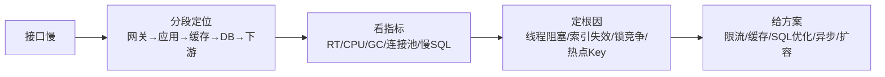


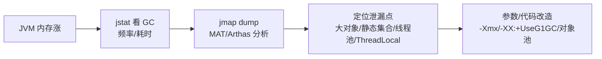

---

## 目录

- [01 Java基础](#01-java基础)
- [02 JVM](#02-jvm)
- [03 并发编程](#03-并发编程)
- [04 Spring体系](#04-spring体系)
- [05 MySQL](#05-mysql)
- [06 Redis](#06-redis)
- [07 消息队列](#07-消息队列)
- [08 微服务与分布式](#08-微服务与分布式)
- [09 分布式事务](#09-分布式事务)
- [10 分布式锁与ID](#10-分布式锁与id)
- [11 分库分表](#11-分库分表)
- [12 其他中间件](#12-其他中间件)
- [13 网络与操作系统](#13-网络与操作系统)
- [14 系统设计与高并发](#14-系统设计与高并发)
- [15 业务场景题](#15-业务场景题)
- [16 性能调优与故障排查](#16-性能调优与故障排查)
- [17 数据结构与算法](#17-数据结构与算法)
- [18 AI与大模型](#18-ai与大模型)
- [19 工具与工程](#19-工具与工程)
- [20 任务调度](#20-任务调度)
- [21 Excel与文件处理](#21-excel与文件处理)
- [22 面经与项目分享](#22-面经与项目分享)
- [23 软技能与面试准备](#23-软技能与面试准备)

---

## 01 Java基础

> 模块定位：高级岗"地基"，覆盖**集合 + 反射 + IO + 异常 + OOP + Lambda/Stream + 序列化**七大块。243 题，体量最大，但很多是同主题反复问。重点抓集合源码、动态代理、NIO、函数式。
> 题量：243 题。

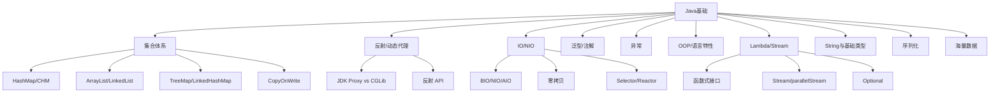

### P0 必背核心

#### HashMap 源码与扩容
- **底层结构**：JDK 1.8 起 数组 + 链表 + 红黑树。初始容量 16，负载因子 0.75，扩容阈值 = capacity × loadFactor，容量永远是 2 的幂（便于 `(n-1) & hash` 取代取模）。
- **链表 → 红黑树**：链表长度 ≥ 8 且数组长度 ≥ 64 时转红黑树；红黑树节点数 ≤ 6 时退化为链表。两个阈值不一样是为了避免频繁来回转换。
- **扰动函数**：`hash = key.hashCode() ^ (key.hashCode() >>> 16)`，让高 16 位参与低位运算，减少冲突。
- **put 流程**：① 表为空先 resize；② `(n-1) & hash` 算下标；③ 桶为空直接插入；④ 桶非空：key 相等覆盖、是树节点走树插入、否则遍历链表（尾插）；⑤ 链表长度达 8 触发树化；⑥ size > threshold 触发扩容。
- **扩容**：容量翻倍，元素要么留原位、要么移到 `原位 + 旧容量`（由 `hash & 旧容量` 是 0 还是 1 决定），不需要重新计算 hash。
- **典型陷阱**：JDK 1.7 多线程扩容头插法导致循环链表（CPU 100%），1.8 改尾插仍然非线程安全（put 数据丢失、size 不准）。
- 关联题：#0099、#0250、#0274、#0301

#### ConcurrentHashMap 1.7 vs 1.8
- **JDK 1.7**：Segment 分段锁数组（默认 16 段），每个 Segment 是一个小 HashMap，继承 ReentrantLock，并发度 = Segment 数。get 不加锁靠 volatile，put 锁 Segment。
- **JDK 1.8**：放弃 Segment，结构与 HashMap 一致（数组 + 链表 + 红黑树），用 **CAS + synchronized 锁桶头节点** 实现并发，锁粒度从段降到单个桶，并发度大幅提升。
- **size() 实现**：用 CounterCell 数组（类似 LongAdder）分散竞争，避免单计数器热点。
- **不允许 null**：key 和 value 都不允许 null（HashMap 允许），因为并发场景下无法区分"key 不存在"和"value 为 null"。
- **弱一致迭代器**：iterator 不会抛 ConcurrentModificationException，但看到的可能是创建迭代器时的快照。
- 关联题：#0303、#0464、#0476

#### ArrayList vs LinkedList
- **ArrayList**：动态数组，默认初始容量 10（延迟到第一次 add 时分配），扩容 1.5 倍（`oldCap + (oldCap >> 1)`）。随机访问 O(1)，中间插入/删除 O(n)。Fail-Fast：modCount 不一致抛 CME。
- **LinkedList**：双向链表，没有初始容量。头尾增删 O(1)，中间需先定位 O(n)，随机访问 O(n)。同时实现 Deque，可作队列/栈使用。
- **选型**：99% 场景用 ArrayList——即使是频繁中间插入，由于 CPU 缓存友好和数组连续内存，实测仍快于 LinkedList。
- **CopyOnWriteArrayList**：写时复制，写操作加 ReentrantLock 复制整个底层数组，读不加锁，适合读多写少（监听器、配置）。
- 关联题：#0237、#0382

#### JDK 动态代理 vs CGLib
- **JDK Proxy**：基于**接口**，`Proxy.newProxyInstance(classLoader, interfaces, InvocationHandler)`。生成的代理类继承 Proxy 实现目标接口。要求目标类必须实现接口。
- **CGLib**：基于**继承**，运行时通过 ASM 字节码框架生成目标类的子类，重写所有非 final 方法并织入 MethodInterceptor。不能代理 final 类/方法/private 方法。
- **性能**：CGLib 创建慢但调用快（FastClass 用索引代替反射），JDK Proxy 创建快但每次调用走反射。JDK 8 之后差距缩小。
- **Spring AOP 选择**：默认情况下，目标类实现接口用 JDK Proxy，没接口用 CGLib；可通过 `@EnableAspectJAutoProxy(proxyTargetClass=true)` 强制 CGLib。Spring Boot 2.x 起默认 CGLib。
- **AOP 自调用失效**：同类中方法 A 调方法 B（带 @Transactional），走的是 this 引用而非代理对象，注解失效。
- 关联题：#0140、#0394

#### NIO 三大组件（Channel/Buffer/Selector）
- **Channel**：双向数据通道（FileChannel/SocketChannel/ServerSocketChannel/DatagramChannel），可以读也可以写。
- **Buffer**：数据容器，本质是数组 + 三指针（capacity 容量、limit 上限、position 当前位置）。常用 ByteBuffer，有 HeapByteBuffer（堆内）和 DirectByteBuffer（堆外，零拷贝时用）。
- **Selector**：多路复用器，一个线程通过 select() 监听多个 Channel 事件（OP_ACCEPT/CONNECT/READ/WRITE），底层在 Linux 用 epoll。
- **Buffer 操作流程**：write → flip()（limit=position, position=0）→ read → clear()/compact()（重置为可写）。
- **关键 API**：`ByteBuffer.allocate(int)` 堆内、`allocateDirect(int)` 堆外、`flip/clear/rewind/mark/reset`。
- **Reactor 模式**：单 Reactor 单线程（Redis 6 之前）、单 Reactor 多线程、主从 Reactor 多线程（Netty 默认）。
- 关联题：#0078、#0094、#0177

#### 零拷贝（Zero-Copy）
- **传统 IO**：read + write 经历 4 次拷贝（磁盘→内核缓冲→用户缓冲→Socket 缓冲→网卡）+ 4 次上下文切换。
- **mmap**：把文件内核缓冲区直接映射到用户空间，减少 1 次拷贝（用户↔内核），仍有 3 次拷贝、4 次上下文切换。Kafka 索引文件用 mmap。
- **sendfile**：内核态直接把数据从文件描述符拷贝到 Socket，0 次用户态拷贝，2 次上下文切换。Java 中 `FileChannel.transferTo()` 底层调用 sendfile。Kafka 消息消费用 sendfile。
- **splice**：Linux 2.6.17+，纯内核管道传输。
- 关联题：#0078、#0094

#### String 不可变与字符串池
- **不可变实现**：String 类 final（不可继承），内部 `private final byte[] value`（JDK 9+ 从 char[] 改 byte[] 节省内存）。所有"修改"方法都返回新对象。
- **为什么不可变**：① 安全（用作类加载器参数、网络连接 URL）；② 缓存 hashCode；③ 字符串池可复用；④ 线程安全。
- **字符串池（StringTable）**：JDK 1.7 起从方法区移到堆中。`String s = "abc"` 走常量池；`new String("abc")` 在堆中再建一个对象（最多创建 2 个：池中 + 堆中）。
- **intern()**：JDK 1.6 复制到池中，1.7+ 只在池中存放堆中字符串的引用。
- **拼接演化**：JDK 8 编译为 StringBuilder.append，JDK 9+ 编译为 invokedynamic + StringConcatFactory（更优，可由 JVM 自由选择策略）。
- 关联题：#0083、#0421、#0375

#### equals 与 hashCode 契约
- **三条契约**：① equals 相等的两个对象 hashCode 必须相等；② hashCode 相等的两个对象 equals 不一定相等（哈希冲突）；③ 重写 equals 必须重写 hashCode（否则 HashMap/HashSet 找不到）。
- **equals 五大性质**：自反性、对称性、传递性、一致性、非 null 性。
- **hashCode 默认**：Object.hashCode 是 native，**不是内存地址**（虚拟机实现相关，可能是随机数、Mark Word 中的 hash），但同一个对象多次调用值不变。
- 关联题：#1099、#0501

#### 异常体系（Error vs Exception，Checked vs Unchecked）
- **Throwable** 是顶层，分 **Error**（不应捕获，VirtualMachineError/OutOfMemoryError/StackOverflowError）和 **Exception**。
- **Checked Exception**：编译期强制处理（throws 或 try-catch），如 IOException、SQLException、ClassNotFoundException。
- **Unchecked Exception（RuntimeException 及子类）**：编译期不检查，如 NPE、IllegalArgumentException、ClassCastException。
- **try-with-resources**：JDK 7+，实现 AutoCloseable 的资源自动 close，编译后变成 try-finally 调用 close + addSuppressed 处理"抑制异常"。
- **finally 行为**：finally 中 return 会覆盖 try/catch 的返回值；finally 中改基本类型不影响已经被压栈的 return 值，但改对象字段会影响。
- 关联题：#0204、#0421

#### final / static / volatile / transient 关键字
- **final**：① 修饰类不可继承；② 修饰方法不可重写（private 方法默认 final）；③ 修饰变量基本类型值不变、引用类型引用不变（指向对象可变）；④ final 修饰的字段在构造结束后保证可见性（happens-before）。
- **static**：① 修饰字段属于类不属于实例，全局共享；② 修饰方法不能访问非静态成员；③ 静态代码块在类加载初始化阶段执行；④ 静态内部类不持有外部类引用（推荐用法）。
- **volatile**：可见性 + 禁止指令重排序，**不保证原子性**（如 i++ 仍需 Atomic）。
- **transient**：序列化时忽略该字段。
- 关联题：#0258、#0299

### P1 加分高频

#### LinkedHashMap 与 LRU
- **结构**：HashMap + 双向链表，链表维护**插入顺序**或**访问顺序**（accessOrder=true）。
- **LRU 实现**：构造 `new LinkedHashMap<>(cap, 0.75f, true)`，重写 `removeEldestEntry()` 返回 size > capacity——访问元素会被移到尾部，超容量时 head 被淘汰。
- **应用**：Spring 缓存、Mybatis 一级缓存、Tomcat 资源缓存等都基于它简单实现 LRU。
- 关联题：#0316

#### TreeMap 与红黑树
- **底层**：红黑树（自平衡 BST，5 条性质：根黑、叶 NIL 黑、红节点子必黑、任一节点到叶简单路径黑节点数相同、新插入红色）。
- **性能**：put/get/remove 都是 O(log n)，迭代按 key 自然顺序或 Comparator 顺序。
- **NavigableMap 接口**：firstKey/lastKey/floorKey/ceilingKey/headMap/tailMap/subMap，做范围查询很强。
- 关联题：#0265

#### Stream API 核心
- **三段式**：源（集合/数组/IO）→ 中间操作（filter/map/flatMap/distinct/sorted/peek/limit/skip）→ 终结操作（forEach/collect/reduce/count/min/max/anyMatch/findFirst）。
- **惰性求值**：中间操作不立即执行，遇到终结操作才触发。
- **短路**：findFirst/findAny/anyMatch/allMatch/noneMatch 遇到结果立即返回。
- **parallelStream 坑**：默认共用 ForkJoinPool.commonPool（CPU 核数 - 1 线程），一处阻塞影响全应用。可包在自己的 ForkJoinPool 中 `pool.submit(() -> list.parallelStream()...).get()`。
- **Collectors**：toList/toMap/toSet/groupingBy/partitioningBy/joining/counting。toMap key 冲突要传 merge 函数否则抛异常。
- 关联题：#0091、#0345

#### Optional 正确用法
- **创建**：`Optional.of(x)`（x 非空，否则 NPE）、`ofNullable(x)`、`empty()`。
- **orElse vs orElseGet**：orElse(x) 不管有没有值都会构造 x；orElseGet(supplier) 只在空时才调用，性能更好。
- **不要**：① 当字段；② 当方法参数；③ 直接 get() 不判断（等于 NPE）；④ 给集合包装（用空集合代替）。
- 关联题：#0117

#### IO 流分类
- **按方向**：InputStream / OutputStream（字节流）vs Reader / Writer（字符流）。
- **按功能**：节点流（直接对接数据源 FileInputStream）vs 处理流（套在节点流外 BufferedInputStream、DataInputStream、ObjectInputStream）。
- **装饰器模式**：BufferedInputStream(InputStream is) 包一层加缓冲；ObjectInputStream 包字节流读对象。
- **NIO 与 IO 区别**：阻塞 vs 非阻塞、流 vs 块、单向 Stream vs 双向 Channel、有无 Selector。
- 关联题：#0083、#0094

#### 序列化与 Serializable
- **机制**：实现 Serializable 标记接口（无方法），对象图被递归序列化为字节流。
- **serialVersionUID**：版本号，类结构变化但 UID 不变可保持兼容。不显式声明，编译器自动算（结构变化值变），容易踩坑——**必须显式声明 `private static final long serialVersionUID = 1L;`**。
- **transient**：标记字段不参与序列化。
- **Externalizable**：手动实现 writeExternal/readExternal，完全控制流程，性能更好。
- **常见替代**：Jackson/Fastjson2 序列化为 JSON、Protobuf 序列化为高效二进制（IDL 描述、向后兼容）。
- 关联题：#0260、#0292

#### Comparable vs Comparator
- **Comparable**：内部排序，类实现 `compareTo(T)`，定义自身的"自然顺序"（String、Integer 都实现了）。
- **Comparator**：外部排序，可对没实现 Comparable 的类或临时改变排序规则，常用 `Comparator.comparing(...).thenComparing(...).reversed()`。
- **TreeMap/PriorityQueue/sort** 都依赖比较器。
- 关联题：#0260

#### 自动装箱拆箱与 Integer 缓存
- **装箱**：`Integer.valueOf(int)`，对 -128~127 走 IntegerCache（静态数组），范围外 new 新对象。
- **拆箱**：`Integer.intValue()`。
- **典型坑**：`Integer a = 127; Integer b = 127; a == b // true` 但 `Integer a = 128; b = 128; a == b // false`（同一缓存 vs 新对象）。比较包装类**永远用 equals**。
- **缓存调整**：`-XX:AutoBoxCacheMax=N` 可扩大 Integer 缓存上限（仅 Integer 可调，Long 固定 -128~127）。
- 关联题：#0258、#0299

#### Lambda 与函数式接口
- **函数式接口**：只有一个抽象方法的接口（可以有 default 和 static 方法），@FunctionalInterface 强制检查。
- **JDK 8 内置 4 大类**：Function<T,R>（apply）、Predicate<T>（test）、Consumer<T>（accept）、Supplier<T>（get），衍生 BiFunction/BinaryOperator/UnaryOperator/ToIntFunction 等。
- **方法引用 4 种**：类::静态方法、实例::实例方法、类::实例方法、类::new。
- **Lambda 本质**：编译为 **invokedynamic** 指令 + 内部生成的 LambdaMetafactory，不是匿名内部类（不会生成额外 class 文件）。
- 关联题：#0091、#0345

### P2 深度延伸

#### 泛型与类型擦除
- **擦除机制**：编译期把 `List<String>` 擦为 `List`，运行时拿不到泛型类型。受限于此：不能 `new T()`、`new T[]`、不能 `instanceof T`、不能用泛型类做 catch 类型。
- **桥方法（Bridge Method）**：编译器为了保证多态正确生成的合成方法，比如重写带泛型参数的方法时。
- **PECS 原则**：Producer Extends Consumer Super——你**只读**用 `? extends T`（生产者），你**只写**用 `? super T`（消费者）。比如 `Collections.copy(dest, src)`：dest 是 `? super T`，src 是 `? extends T`。
- **类型 token**：通过匿名子类保留泛型信息 `new TypeReference<List<String>>(){}`，Jackson/Gson 等反序列化用。
- 关联题：#0218

#### 注解原理
- **元注解**：@Target（作用位置）、@Retention（保留策略 SOURCE/CLASS/RUNTIME）、@Documented（生成 javadoc）、@Inherited（子类继承）、@Repeatable（可重复）。
- **运行时读取**：必须 RUNTIME 保留策略；通过反射 `method.isAnnotationPresent(...)`、`getAnnotation(...)` 读取注解值。
- **编译期处理**：CLASS 或 SOURCE 保留，通过 APT（Annotation Processor Tool）/ JSR 269 处理，Lombok @Data、@Builder 就是这么实现的——在编译期生成 getter/setter 字节码。
- **Spring 的 @Component/@Autowired/@Transactional 等都是 RUNTIME** 注解，由 BeanPostProcessor 在 Bean 初始化时反射处理。
- 关联题：#0205、#0306

#### Object 通用方法深挖
- **wait/notify**：必须在 synchronized 块内调用，否则抛 IllegalMonitorStateException；wait 释放锁，notify 不释放（要等同步块结束）；wait 是 Object 的方法而非 Thread 的，因为锁是对象级别的。
- **finalize() 已废弃**：JDK 9 @Deprecated，性能差、不确定执行时机、可能复活对象。替代品：Cleaner（基于幻象引用）、try-with-resources。
- **clone() 浅拷贝**：默认按字段拷贝，引用类型只拷贝引用。深拷贝需手动 clone 内部引用对象 / 用序列化反序列化 / 用 Jackson 转 JSON 再回来。
- **toString()**：默认返回 `getClass().getName() + "@" + Integer.toHexString(hashCode())`，IDE 通常自动生成或用 Lombok @ToString。
- 关联题：#0083、#1099

#### CopyOnWriteArrayList 原理
- **写时复制**：写操作（add/set/remove）先用 ReentrantLock 锁，再复制原数组到新数组上操作，最后 volatile 引用切换。读操作不加锁，直接读 volatile 引用。
- **保证读读不互斥、读写不互斥、写写互斥**，但牺牲实时性（读到的可能是旧快照）。
- **适用场景**：读多写少（监听器列表、白名单），不适合大列表频繁写（每次都全量复制内存翻倍）。
- 关联题：#0382

#### 时间 API（JDK 8+）
- **java.time 包**：Instant（时间戳）、LocalDate/LocalTime/LocalDateTime（无时区）、ZonedDateTime/OffsetDateTime（带时区）、Duration（两个时间差）、Period（两个日期差）、ZoneId、DateTimeFormatter（**线程安全**，可替代 SimpleDateFormat）。
- **不可变 + 线程安全**：所有时间类都是 final 且不可变，运算返回新对象。
- **SimpleDateFormat 线程不安全**：内部用 Calendar 共享状态，多线程同时 parse/format 会数据错乱。早期项目要么 ThreadLocal 包装，要么换 DateTimeFormatter。
- 关联题：#0203

#### NIO 中的 mmap 与 DirectByteBuffer
- **DirectByteBuffer**：堆外内存，由 Unsafe.allocateMemory 直接向 OS 申请。优点：减少一次堆内堆外拷贝，GC 时不被移动；缺点：分配/回收慢、回收依赖 Cleaner（幻象引用 + ReferenceHandler 线程）。
- **释放**：DirectByteBuffer 被 GC 回收时触发 Cleaner，调用 Deallocator 真正 free 内存；不当使用（堆内引用一直在）会导致堆外内存泄漏。
- **MaxDirectMemorySize**：默认等于 -Xmx，可通过 `-XX:MaxDirectMemorySize=N` 限制，超出抛 OutOfMemoryError: Direct buffer memory。
- **Netty 用 PooledByteBufAllocator 池化堆外内存**避免频繁分配释放。
- 关联题：#0094、#0177

### P3 冷门刁钻

#### WeakHashMap
- **Key 是弱引用**：Entry 的 key 包装为 WeakReference，下次 GC 时 key 没有强引用就被回收，对应 Entry 在下次访问时被移除（通过 ReferenceQueue）。
- **典型应用**：Tomcat 类加载器引用、Spring beanFactory 缓存。
- 关联题：#0316

#### Cleaner（替代 finalize）
- **JDK 9 引入**：基于 PhantomReference（幻象引用），注册一个清理动作，当对象被 GC 时由 Cleaner 线程异步执行清理。
- **比 finalize 更安全**：清理动作不能复活对象、可单独线程执行不阻塞 GC、可显式调用 clean()。
- 关联题：#0999

#### 海量数据 Top K
- **小顶堆（PriorityQueue 默认）**：维护大小为 K 的小顶堆，遍历元素 > 堆顶就替换并下沉。时间 O(n log k)，空间 O(k)。
- **快速选择**：基于快排的 partition，平均 O(n)，最坏 O(n²)。
- **BitMap**：海量整数去重/查找存在性，1 bit 一个数。
- **布隆过滤器**：不存在一定不存在，存在可能误判。Guava BloomFilter 默认 3% 误判率。
- **外部排序**：内存装不下时分块排序后多路归并（Top K 也可分块用堆）。
- 关联题：#0039、#0040

#### 注解处理器 APT 与 Lombok
- Lombok 在 javac 编译期通过 **JSR 269 注解处理器** 修改 AST，加入 getter/setter/constructor 等字节码。
- IDE 需要装 Lombok 插件才能正确识别（不然 IDE 编译期看不到生成的方法）。
- 替代：MapStruct（编译期生成 mapper）、AutoValue（不可变对象）。

#### 字符串拼接的字节码
- `"a" + "b"`：编译期常量折叠 = `"ab"`。
- JDK 8：`a + b`（变量）= `new StringBuilder().append(a).append(b).toString()`。
- JDK 9+：`a + b` = `invokedynamic` 调用 `StringConcatFactory.makeConcatWithConstants`，JVM 运行时选最优策略。所以同一段代码 JDK 8 vs JDK 11 字节码不同、性能不同。
- 关联题：#0375

### 跨模块联想

- HashMap/CHM ↔ **03 并发**：1.7 头插死循环、1.8 CAS+synchronized 锁桶头节点。
- 动态代理 ↔ **04 Spring**：Spring AOP 默认 JDK Proxy + CGLib 兜底，事务/缓存/异步注解都靠它。
- NIO/零拷贝 ↔ **07 消息队列**：Kafka 顺序写 + sendfile 零拷贝是高吞吐核心。
- IO 模型 ↔ **13 网络与 OS**：BIO/NIO/AIO 与 select/poll/epoll 直接对应。
- Lambda/Stream ↔ **15 业务场景**：业务聚合、ETL 数据处理常用 Stream + Collectors。
- 弱引用 ↔ **02 JVM**：ThreadLocalMap Entry 弱引用 key、ReferenceQueue 配合 Cleaner。
- 序列化 ↔ **07 消息队列**：MQ 消息体序列化框架选型（JSON vs Protobuf vs Avro vs Hessian）。
- 海量数据 ↔ **17 算法**：Top K 小顶堆、海量去重布隆过滤器。
- intern/字符串池 ↔ **02 JVM**：堆中 StringTable、Class 常量池→运行时常量池的迁移。

---

## 02 JVM

> 模块定位：高级岗"硬通货"，几乎每场必考。重点是**内存模型 + 垃圾回收 + 类加载 + 故障排查工具链**。
> 题量：63 题。

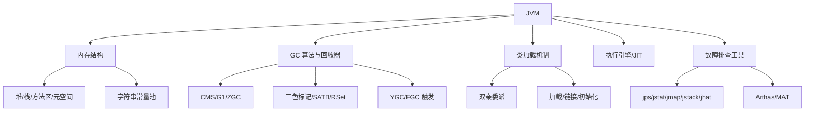

### P0 必背核心

#### JVM 运行时内存结构
- **5 大区域**：堆（Heap，对象实例）、虚拟机栈（线程私有，栈帧/局部变量表）、本地方法栈（Native）、方法区/元空间（类元信息）、程序计数器（PC，唯一不会 OOM 的区域）。
- **线程共享**：堆、方法区。**线程私有**：栈、本地方法栈、PC。
- 堆分代：新生代（Eden:S0:S1 = 8:1:1）+ 老年代。新生代用复制算法，老年代用标记-整理/清除。
- JDK 1.8 起方法区实现改为**元空间（Metaspace），位于本地内存**，不再受 `-Xmx` 限制，但可被 `-XX:MaxMetaspaceSize` 限制。
- 典型陷阱：String 常量池 JDK 1.7 起从方法区移到堆中；`intern()` 行为 1.6/1.7 不同。
- 关联题：#0259、#0261、#0057、#1071、#1148

#### 类加载过程（加载-链接-初始化）
- **三阶段**：加载（Loading，把 .class 读入 JVM 生成 Class 对象）→ 链接（验证 Verify、准备 Prepare 给静态变量分配默认值、解析 Resolve 符号引用转直接引用）→ 初始化（Initialization，执行 `<clinit>`，给静态变量赋真实值并执行静态代码块）。
- **懒加载**：只有遇到 new、getstatic、putstatic、invokestatic、反射、main 类、子类初始化先初始化父类这几种情况才触发初始化。
- 准备阶段静态变量为**默认值**（int=0），初始化阶段才是程序员赋的值。`final static` 直接在准备阶段就是真值。
- 符号引用 vs 直接引用：前者用名字描述目标（如 "java/lang/String"），后者是真实内存地址/偏移。
- 关联题：#0041、#1085

#### 双亲委派机制
- **流程**：类加载请求向上委托（AppClassLoader → ExtClassLoader → BootstrapClassLoader），父加载器加载不到才由子加载器尝试。
- **目的**：① 避免类重复加载；② 安全（防止用户写 `java.lang.String` 覆盖核心类）。
- **类的唯一性**：JVM 中类的唯一性由 **"全限定名 + 类加载器"** 共同决定，不同 ClassLoader 加载的同名类不相等。
- **如何破坏**：① 自定义 ClassLoader 重写 `loadClass()` 不调 super；② 线程上下文 ClassLoader（JDBC SPI、Tomcat）；③ OSGi 模块化。
- 典型陷阱：破坏双亲委派**重写不了 String**——Bootstrap 已经加载过 `java.lang.String`，且包名 `java.*` 受保护，自定义类加载器加载 `java.lang.String` 会抛 `SecurityException`。
- 关联题：#0302、#1097、#0897

#### G1 垃圾回收器（JDK 9+ 默认）
- **核心思想**：把堆划分为多个 **Region**（默认 2048 个，每个 1-32MB，必须 2 的幂），不再物理分代，每个 Region 可动态扮演 Eden/Survivor/Old/Humongous。
- **可预测停顿**：通过 `-XX:MaxGCPauseMillis`（默认 200ms）指定目标停顿时间，G1 选择"回收价值最高"的 Region 优先回收（Garbage First 名字由来）。
- **RSet（记忆集）+ Card Table**：解决跨代/跨 Region 引用问题，每个 Region 维护"谁引用了我"，避免全堆扫描。
- **三色标记 + SATB**：并发标记阶段用三色标记（黑/灰/白），SATB（Snapshot-At-The-Beginning）保证标记一致性，弥补漏标。
- **Humongous 对象**：超过 Region 一半大小的对象直接进入 Humongous Region，可能跨多个 Region。
- 关联题：#0012、#0109、#0110、#0149、#0155

#### CMS vs G1 vs ZGC 核心对比
- **CMS**（Concurrent Mark Sweep）：标记-清除，并发收集，**JDK 9 标记废弃，JDK 14 移除**。缺点：碎片化、Concurrent Mode Failure 退化为 Serial Old（长 STW）、Foreground/Background 收集。
- **G1**：分 Region、可预测停顿、整堆收集。适合 6GB-100GB 堆。
- **ZGC**（JDK 11+，JDK 15 转正）：**亚毫秒级停顿（<10ms）**，支持 TB 级堆。基于**着色指针（Colored Pointer）+ 读屏障**实现并发整理。JDK 16 支持并发线程栈扫描，停顿降到 1ms 以下。
- 选型：4G 以下 Parallel Scavenge + Parallel Old；4-32G G1；超大堆/低延迟敏感 ZGC/Shenandoah。
- 关联题：#0147、#0148、#0149、#0763

#### GC Roots & 可达性分析
- **判活方式**：可达性分析（不是引用计数，因为解决不了循环引用）。
- **GC Roots 来源**：① 虚拟机栈中引用的对象；② 方法区中类静态属性引用的对象；③ 方法区中常量引用的对象；④ 本地方法栈中 JNI 引用的对象；⑤ 同步锁 `synchronized` 持有的对象；⑥ JMXBean、JVMTI 中注册的回调等。
- **四种引用**：强（默认，OOM 也不回收）> 软（SoftReference，内存不足时回收，做缓存）> 弱（WeakReference，下次 GC 就回收，ThreadLocal）> 虚（PhantomReference，唯一作用是 GC 时收到通知，配合 ReferenceQueue 做资源清理，Netty 直接内存释放）。
- 关联题：#0252、#0999

#### YGC / FullGC 触发条件
- **YGC**：Eden 区满时触发 Minor GC，存活对象拷贝到 Survivor 或晋升老年代。
- **晋升老年代**：① 年龄 ≥ `-XX:MaxTenuringThreshold`（默认 15）；② Survivor 同年龄对象总和 > Survivor 一半（动态年龄判断）；③ 大对象直接进老年代（`-XX:PretenureSizeThreshold`）；④ YGC 后 Survivor 放不下。
- **FullGC 触发**：① 老年代空间不足；② 方法区/元空间满；③ 显式调用 `System.gc()`（可被 `-XX:+DisableExplicitGC` 屏蔽）；④ CMS Concurrent Mode Failure；⑤ G1 Mixed GC 失败退化；⑥ 担保失败（YGC 时老年代连续空间 < 历次晋升平均值且不允许担保）。
- 频率：FullGC 正常应该**几小时甚至几天一次**，分钟级就是大问题。
- 关联题：#1042、#0314

#### Stop The World (STW)
- 任何 GC 都有 STW，区别在长短。所有用户线程暂停，确保 GC 标记/移动时引用关系不变。
- STW 在**安全点（Safe Point）** 才能进入。Safe Point 通常在方法调用、循环回边、异常抛出等位置。
- **可数循环（counted loop，int 类型计数器）** 编译期 JIT 可能去掉安全点，导致单线程长循环阻塞其他线程到达 Safe Point——典型"JVM 假死"故障。
- 关联题：#1043、#0868

### P1 加分高频

#### 三色标记算法 & 漏标
- 标记过程对象分三色：**白**（未访问）、**灰**（自己被访问，子引用未扫完）、**黑**（自己和子引用都扫完）。
- **漏标条件（必须同时满足）**：① 黑色对象新增了到白色对象的引用；② 灰色对象删除了到白色对象的所有引用。
- **CMS 解决**：增量更新（Incremental Update）——记录黑→白新增引用，重新扫描黑色对象。
- **G1 解决**：SATB（开始时快照）——记录灰→白被删除的引用，把那些"消失的引用"对象当作存活。
- 关联题：#0155

#### CMS 完整流程（已废弃但仍考）
- 4 阶段：① **初始标记**（STW，只标 GC Roots 直接关联）；② **并发标记**（与用户线程并发，标记所有可达对象）；③ **重新标记**（STW，处理并发标记期间引用变化，CMS 用增量更新）；④ **并发清除**（与用户线程并发清除垃圾）。
- 缺点：① 标记清除产生碎片；② CPU 敏感（并发占用线程）；③ 浮动垃圾；④ Concurrent Mode Failure（老年代回收速度跟不上对象晋升速度）退化为 Serial Old，导致超长 STW。
- 关联题：#0802

#### JIT 即时编译
- **解释执行 + 编译执行混合**。HotSpot 中热点代码（方法/循环）会被 **C1（Client，快速编译）和 C2（Server，深度优化）** 编译成本地机器码。
- **热点探测**：方法调用计数器 + 回边计数器（OSR On-Stack Replacement，循环热点替换）。
- **典型优化**：内联（方法内联）、逃逸分析（对象只在方法内用就栈上分配）、锁消除、锁粗化、标量替换、循环展开。
- **AOT（Ahead-Of-Time）**：JDK 9 引入 jaotc，启动前编译；GraalVM Native Image 是更激进的 AOT，启动毫秒级但运行峰值性能不如 JIT。
- 关联题：#0691、#0088、#0843、#0717

#### Class 常量池 vs 运行时常量池 vs 字符串常量池
- **Class 常量池**：编译期产生，存在每个 .class 文件中，存字面量和符号引用。
- **运行时常量池**：类加载后，Class 常量池内容放入方法区/元空间的运行时常量池，符号引用会被解析为直接引用，且**可动态添加**（如 `String.intern()`）。
- **字符串常量池（StringTable）**：JDK 1.7 起从方法区移到堆中，是一个 HashTable。`intern()` 在 1.6 是复制到常量池，1.7+ 是只放引用（如果堆里已有）。
- 关联题：#1085、#1148、#0421

#### 常用排查工具命令
- `jps`：列出 JVM 进程 PID。
- `jstat -gcutil <pid> 1000`：每秒打印 GC 统计（Eden/Old/Metaspace 使用率、YGC/FGC 次数与耗时）。
- `jmap -dump:live,format=b,file=heap.hprof <pid>`：导出堆快照，用 MAT/JVisualVM/JProfiler 分析内存泄漏。
- `jstack <pid>`：导出线程栈，分析死锁、CPU 飙高（结合 `top -H` 找高 CPU 线程，转 16 进制对应栈）。
- `jinfo`：查看/修改 JVM 参数。
- `javap -v`：反编译看字节码，常用于看 lambda、内部类、`String + String` 编译后实现。
- `Arthas`：阿里开源，热门命令 `dashboard`、`thread`、`watch`、`trace`、`tt`、`jad` 反编译已加载类，统计耗时基于字节码增强。
- 关联题：#0145、#0390、#0411、#0417、#0418、#0401、#0497

#### OOM 类型与原因
- **Java heap space**：堆满。典型：大对象、集合泄漏、缓存无上限、ThreadLocal 不 remove。
- **GC overhead limit exceeded**：98% 时间在 GC 但只回收 < 2% 内存。
- **Metaspace**：类太多（动态代理、CGLib、JSP 编译）、ClassLoader 泄漏。
- **Direct buffer memory**：堆外内存（Netty、NIO ByteBuffer.allocateDirect）超 `-XX:MaxDirectMemorySize`。
- **unable to create new native thread**：线程数超 OS 限制（ulimit/线程占用栈空间太多）。
- **StackOverflowError**：单线程栈深太深（不是 OOM，是 Error）。
- 关联题：#0348、#1150、#1070

### P2 深度延伸

#### G1 STW 时间如何"精确控制"
- 不是真的精确，是**基于停顿预测模型**：每个 Region 维护回收成本（标记 + 复制时间），用历史数据预测。
- 在 Mixed GC 时按 `-XX:MaxGCPauseMillis` 选回收价值最高且总耗时不超目标的 Region 集合（CSet, Collection Set）。
- 目标停顿设置过小会导致每次 GC 回收的 Region 太少，老年代积累快，最终触发 Full GC，反而更慢。
- 关联题：#0110

#### 跨代引用与 RSet
- **跨代引用问题**：YGC 时需要找出"老年代引用的新生代对象"，否则会误回收存活对象。如果扫整个老年代代价巨大。
- **Card Table**：把老年代分成若干 512 字节 Card，每个 Card 一个字节标记 dirty。老年代对象引用了新生代时该 Card 标 dirty，YGC 时只扫 dirty card。
- **RSet（Remembered Set）**：G1 每个 Region 维护 RSet 记录"谁引用了我"，配合 Write Barrier 在引用变更时更新。RSet 占内存可达 20%。
- 关联题：#1124

#### 安全点 vs 安全区域
- **Safe Point**：线程暂停的位置（方法调用、循环回边等）。GC 启动前所有线程"主动式中断"——JVM 设置一个标志位，线程在 Safe Point 检查标志，主动挂起。
- **Safe Region**：线程长时间不执行（Sleep/Blocked）无法进入 Safe Point，引入 Safe Region——一段引用关系不变的代码区域。线程进入 Safe Region 时标记自己 Safe，离开前要检查 JVM 是否完成 GC。
- 关联题：#0868

#### 字符串拼接的字节码差异
- `"a" + "b"`：编译期常量折叠，直接是 `"ab"`。
- `String s = a + b`（变量）：JDK 8 编译为 `StringBuilder.append`，JDK 9+ 编译为 `invokedynamic` 调用 `StringConcatFactory.makeConcatWithConstants`（更高效，可由 JVM 决定最优策略）。
- 这就是为什么"同一段拼接代码在 JDK 不同版本性能不同"。
- 关联题：#0375

#### kill -9 对 JVM 的影响
- `kill -9`（SIGKILL）：强制杀进程，**不会执行 ShutdownHook、不会 flush 缓冲、不会关闭文件描述符**——可能丢日志、丢未刷盘数据。
- `kill -15`（SIGTERM，默认）：JVM 会执行 ShutdownHook，可以做优雅停机。
- Spring Boot `server.shutdown=graceful` 配合 `spring.lifecycle.timeout-per-shutdown-phase`。
- 关联题：#0690

### P3 冷门刁钻

#### 逃逸分析与栈上分配
- 编译期分析对象作用域是否"逃逸"出方法：未逃逸的小对象可能**栈上分配**或**标量替换**（拆成基本类型字段），避免堆分配压力。
- `-XX:+DoEscapeAnalysis`（默认开）、`-XX:+EliminateAllocations` 标量替换。
- 关联题：#0843、#0257

#### JDK 8 vs 9 类加载器
- JDK 8：Bootstrap（C++）、Ext（rt.jar 之外的 lib/ext）、App（classpath）。
- JDK 9+：模块化，ExtClassLoader 改名为 **PlatformClassLoader**，加载 java.* javax.* 之外的平台模块。
- 关联题：#0856

#### ClassNotFoundException vs NoClassDefFoundError
- **ClassNotFoundException**：检查异常，运行时通过 `Class.forName`、`ClassLoader.loadClass`、`ClassLoader.findSystemClass` 找不到类。
- **NoClassDefFoundError**：错误，**编译时存在，运行时找不到**——典型场景是依赖 jar 缺失，或类初始化 `<clinit>` 抛异常导致类标记为 Erroneous，后续访问报这个错。
- 关联题：#0456、#0737

### 跨模块联想

- 类加载 ↔ **03 并发**：双重检查锁单例为啥要 volatile（防止 `new` 指令重排序，对应 JMM 的 happens-before）。
- 元空间 ↔ **04 Spring**：CGLib 动态代理生成大量类，Metaspace 易满。
- ThreadLocal ↔ **03 并发**：弱引用 + Entry 内存泄漏（Key 弱、Value 强）。
- JVM 内存 ↔ **16 性能调优**：OOM 类型决定排查路径。
- GC 调优 ↔ **15 业务场景**：高并发服务 4C8G 调优（堆设 4-6G、G1、目标停顿 100ms）。

---

## 03 并发编程

> 模块定位：高级岗"第一硬通货"，几乎每场都问到见血——**JMM + synchronized + AQS + 线程池 + JUC 容器**五大支柱。考察重点是源码细节、踩坑经验、调参能力。
> 题量：98 题。

```mermaid
flowchart TD
  A[并发编程] --> B[JMM 内存模型]
  A --> C[锁机制]
  A --> D[AQS 与 JUC]
  A --> E[线程池]
  A --> F[线程基础]
  A --> G[并发容器]
  B --> B1[happens-before/8 规则]
  B --> B2[volatile/内存屏障]
  B --> B3[MESI/总线嗅探]
  C --> C1[synchronized 升级]
  C --> C2[ReentrantLock/公平]
  C --> C3[ReadWriteLock/StampedLock]
  D --> D1[AQS state+CLH]
  D --> D2[CountDownLatch/Semaphore/CyclicBarrier]
  D --> D3[CompletableFuture]
  E --> E1[7 参数+4 拒绝]
  E --> E2[execute 流程]
  E --> E3[动态调参 DynamicTp]
  F --> F1[6 种状态流转]
  F --> F2[虚拟线程/Loom]
  F --> F3[ThreadLocal/TTL]
  G --> G1[ConcurrentHashMap]
  G --> G2[CopyOnWrite/阻塞队列]
  G --> G3[Atomic/LongAdder]
```

### P0 必背核心

#### Java 内存模型（JMM）
- **抽象规范，不是物理结构**：JMM 屏蔽各种硬件和操作系统的内存访问差异，给 Java 程序一套统一的并发语义。
- **主内存 + 工作内存**：所有共享变量存在主内存，每个线程有自己的工作内存（CPU 寄存器/L1/L2 cache 的抽象），线程对变量的操作必须先 read/load 到工作内存，修改后再 store/write 回主内存。
- **解决三大问题**：原子性（synchronized/Atomic/CAS）、可见性（volatile/synchronized/final）、有序性（volatile/synchronized/happens-before）。
- **与 MESI 关系**：MESI 是 CPU 缓存一致性协议（硬件层），JMM 是 Java 语言层规范——MESI 解决不了写缓冲区 + 失效队列带来的重排序，JMM 通过内存屏障兜底。
- 关联题：#0553、#0783、#0847

#### happens-before 8 大规则
- **核心**：前一个操作的结果对后一个操作可见，且前一个操作排在后一个之前。
- **8 条规则**：① 程序顺序规则（单线程内按代码顺序）；② 监视器锁规则（unlock happens-before 后续 lock）；③ volatile 规则（写 happens-before 后续读）；④ 传递性；⑤ start 规则（Thread.start happens-before 线程内任意操作）；⑥ join 规则（线程内操作 happens-before 其他线程 join 返回）；⑦ 中断规则（interrupt 调用 happens-before 被中断线程检测到中断）；⑧ 对象终结规则（构造函数 happens-before finalize）。
- **与 as-if-serial 区别**：as-if-serial 只保证**单线程内**结果不变（允许重排序），happens-before 是**多线程间**的可见性和有序性保证。
- 关联题：#0884、#0870

#### volatile 三大语义
- **可见性**：写 volatile 变量时，JMM 强制把工作内存的值刷回主内存，并使其他线程的工作内存中该变量副本失效（基于 CPU 的 lock 前缀指令 + MESI）。
- **有序性**：在 volatile 变量读写前后插入**内存屏障**（StoreStore/StoreLoad/LoadLoad/LoadStore），禁止特定方向的指令重排序。
- **不保证原子性**：`volatile int i; i++` 仍然不是线程安全的——i++ 是 read-modify-write 三步，volatile 只保证每步可见，无法保证整体原子。
- **典型用法**：双重检查锁 DCL 单例的实例字段必须加 volatile，防止 `new Object()` 的"分配内存 / 调构造 / 引用赋值"三步重排序导致拿到半初始化对象。
- 关联题：#0443、#0470、#0822、#0835

#### synchronized 实现原理
- **字节码层**：进入 monitorenter、退出 monitorexit；方法上的 synchronized 由 ACC_SYNCHRONIZED 标志位实现，本质相同。
- **JVM 层**：每个 Java 对象都关联一个 **Monitor**（C++ ObjectMonitor），含 owner、entryList（阻塞队列）、waitSet（wait 集合）、recursions（重入计数）。
- **锁的存储位置**：对象头 **Mark Word**——64 位虚拟机下 Mark Word 64 位，存 hashCode/分代年龄/锁标志位（00 轻量级、10 重量级、01 无锁或偏向）；锁信息根据锁状态变化覆盖 hashCode 等字段。
- **锁的对象**：synchronized 方法锁的是 this（静态方法锁的是 Class 对象），synchronized 块锁的是括号里指定的对象。
- 关联题：#0290、#0512、#0094

#### synchronized 锁升级
- **无锁 → 偏向锁**：第一次 CAS 把当前线程 ID 写入 Mark Word，后续同线程进入只比对 ID 不做 CAS。**JDK 15 默认关闭偏向锁**（JEP 374），JDK 18 废弃，因为收益不足却带来 revoke 暂停。
- **偏向锁 → 轻量级锁**：另一个线程竞争时撤销偏向，升级为轻量级锁——线程在自己栈帧创建 Lock Record，用 CAS 把 Mark Word 指向 Lock Record；失败则自旋。
- **轻量级锁 → 重量级锁**：自旋超过阈值（自适应自旋）或竞争激烈时升级，关联到 ObjectMonitor，未抢到锁的线程被 park 进入 entryList，涉及**用户态到内核态切换**，开销大。
- **锁不可降级**：一旦升级为重量级就不会回到轻量级（CMS 论文中提及可降级但 HotSpot 实现没做）。
- **其他锁优化**：锁消除（JIT 检测到不可能共享的对象去掉同步，如局部 StringBuffer）、锁粗化（连续多个加锁解锁合并为一次）。
- 关联题：#0181、#0319、#0482

#### AQS（AbstractQueuedSynchronizer）
- **核心字段**：volatile int **state**（同步状态，含义由子类定义）+ **CLH 变种双向链表**（同步队列，存等待线程封装的 Node）+ ConditionObject（条件队列）。
- **独占模式 vs 共享模式**：独占（ReentrantLock，state 表示重入次数）一次只有一个线程持有；共享（CountDownLatch/Semaphore/ReadLock）允许多个线程同时持有，state 表示可用许可数。
- **acquire 流程**：tryAcquire 失败 → addWaiter 入队 → acquireQueued 自旋，前驱是 head 就尝试再次 tryAcquire；否则 shouldParkAfterFailedAcquire 检查前驱状态为 SIGNAL 后 park。
- **为什么双向链表**：方便快速判断/移除取消的节点（前驱后继互相维护），head 节点是哨兵，state == 0 时由后继来"接力"唤醒。
- **Condition 条件队列**：每个 Condition 维护单向链表，signal 把节点从条件队列转移到同步队列尾部，重新参与锁竞争。
- 关联题：#0420、#0044、#0782、#0808、#0809

#### ReentrantLock vs synchronized
- **可中断**：ReentrantLock 提供 `lockInterruptibly()`，synchronized 拿不到锁的线程不响应中断。
- **超时获取**：ReentrantLock 提供 `tryLock(timeout)`，避免死锁。
- **公平/非公平**：ReentrantLock 构造器可选公平锁（按 CLH 队列顺序），synchronized 只有非公平（队列里有线程也允许新来的插队抢）。
- **多 Condition**：ReentrantLock 可创建多个 Condition 实现"等待不同条件"，synchronized 只有一个 wait/notify。
- **共同点**：都是可重入、互斥、阻塞锁；synchronized 是 JVM 层关键字，ReentrantLock 是 JUC 类。**性能在 JDK 6 之后差距不大**，优先 synchronized（语法简洁、JVM 自动释放、JIT 优化更成熟）。
- 关联题：#0393、#0381、#0707、#0734

#### ThreadPoolExecutor 7 大参数
- **corePoolSize**：核心线程数，默认不会因为空闲被回收（`allowCoreThreadTimeOut=true` 才回收）。
- **maximumPoolSize**：最大线程数，队列满后才创建到这个数量。
- **keepAliveTime + TimeUnit**：非核心线程空闲超过该时间被回收。
- **workQueue**：阻塞队列，常用 ArrayBlockingQueue（有界）、LinkedBlockingQueue（默认无界，慎用）、SynchronousQueue（不存储）、PriorityBlockingQueue（优先级）。
- **threadFactory**：线程工厂，**生产必须自定义命名**（如 `order-pool-%d`），不然 jstack 全是 pool-1-thread-N 无法定位。
- **handler 拒绝策略**：见下条。
- 关联题：#0108、#0073、#0119

#### 线程池 execute 流程
- ① 工作线程数 < corePoolSize：**直接创建新线程**执行任务（不管现有核心线程是否空闲）；② >= core：尝试入 workQueue；③ 队列满：创建新线程到 maximumPoolSize；④ 还满：执行拒绝策略。
- **关键陷阱**：`LinkedBlockingQueue` 默认无界，永远入队成功 → 永远到不了第 ③ 步 → maximumPoolSize **形同虚设**。这就是 `Executors.newFixedThreadPool` 容易 OOM 的原因。
- **Tomcat 改造**：Tomcat 的 TaskQueue 重写 `offer()`，当线程数 < max 时返回 false 强制扩到 max，先扩容后入队，更适合 IO 密集场景。
- 关联题：#0073、#0767

#### 4 大拒绝策略
- **AbortPolicy**（默认）：直接抛 RejectedExecutionException，调用方需要捕获。
- **CallerRunsPolicy**：让提交任务的线程（如主线程）自己执行，**起到反压作用**——提交线程被占用后无法继续提交，给线程池"喘息"时间。
- **DiscardPolicy**：默默丢弃，不抛异常。
- **DiscardOldestPolicy**：丢弃队列里最老的任务，再次尝试提交。
- **生产建议**：日志类业务用 CallerRunsPolicy 或自定义策略落盘 + 告警；核心链路用 AbortPolicy 让上游感知。
- 关联题：#0753

#### ConcurrentHashMap 实现
- **JDK 1.7**：分段锁 Segment（默认 16 段），每段是一个 ReentrantLock 保护的 HashEntry 数组，并发度 = 段数。
- **JDK 1.8**：**取消 Segment**，结构变为 Node 数组 + 链表 + 红黑树（链长 ≥ 8 且数组长度 ≥ 64 转红黑树，否则只是扩容）。并发控制变为 **CAS + synchronized（锁单个 bucket 的首节点）**——粒度更细，并发度等于桶数。
- **put 流程**：空桶用 CAS 写首节点；有节点用 synchronized 锁首节点后链表/树插入；扩容时多线程协助迁移（ForwardingNode 标记）。
- **为啥用 synchronized 不用 ReentrantLock**：JDK 6 之后 synchronized 已经有锁升级优化，性能不输 ReentrantLock；且 ReentrantLock 每个桶都要建一个对象，内存浪费严重；锁首节点逻辑用 synchronized 表达更简洁。
- **不允许 null key/value**：无法区分"没有这个 key"和"key 存在但 value 是 null"，在并发场景下 get 返回 null 没法用 containsKey 二次验证（containsKey 之间可能被 remove）。
- 关联题：#0115、#0202、#0748、#0779、#0820、#0234

#### CAS 与 ABA
- **CAS**（Compare-And-Swap）：CPU 原语 cmpxchg 指令，原子比较并替换。Java 通过 Unsafe.compareAndSwapXxx 调用，是 Atomic 类、AQS、ConcurrentHashMap 的核心。
- **三大问题**：① ABA（值变回来无法感知）；② 自旋 CPU 开销（高竞争下白转）；③ 只能保证一个变量原子（多变量需要 AtomicReference 包装或加锁）。
- **解决 ABA**：AtomicStampedReference 用版本号；AtomicMarkableReference 用 boolean 标记是否变过。
- **CAS 不一定有自旋**：单次 CAS 调用就是一次比较替换；自旋是"失败后重试"的应用模式，Atomic 类是循环 CAS，但 `Unsafe.getAndSetXxx` 在某些场景下不需要自旋。
- 关联题：#0299、#0413、#0403

#### LongAdder vs AtomicLong
- **AtomicLong**：单个 volatile long + CAS 循环，高并发下大量线程争一个变量，CAS 失败率高。
- **LongAdder**：分段累加思想——内部维护 base + Cell[] 数组，每个线程通过 ThreadLocalRandom 探针 hash 到一个 Cell 上各自累加，最后 `sum()` 时求和。读时不精确（无锁求和会漏更新），但**写性能远超 AtomicLong**。
- **选型**：高并发计数（QPS、统计）选 LongAdder；需要精确实时值或 CAS 流程控制选 AtomicLong。
- 关联题：#0374、#0794

#### ThreadLocal 实现 + 内存泄漏
- **结构**：每个 Thread 对象持有一个 ThreadLocalMap，key 是 ThreadLocal 对象的**弱引用**，value 是强引用。
- **弱引用 key**：避免 ThreadLocal 对象被回收后 map 中的 key 还强引用着它（防止 ThreadLocal 类本身泄漏）。
- **泄漏点**：key 被回收后变 null，**value 还是强引用**——而且 value 通过 Thread → ThreadLocalMap → Entry.value 这条链长期不释放。在线程池中线程长期复用，泄漏更严重。
- **解决方案**：`try-finally` 里调 `remove()` 显式清除；ThreadLocal 内部 get/set/remove 也会顺手清理 key=null 的 Entry，但不彻底。
- **应用场景**：用户上下文（UserContext）、事务管理器、SimpleDateFormat 线程私有副本、链路追踪 traceId、连接管理。
- 关联题：#0579、#0846、#0135、#0364

#### CompletableFuture
- **异步编排**：替代裸 Future（Future.get 阻塞、无回调），支持 thenApply（同步转换）、thenCompose（链式 Future，扁平化）、thenCombine（合并两个 Future）、allOf（等所有）、anyOf（等任一）。
- **底层**：基于**栈式回调链** + ForkJoinPool.commonPool（默认线程池，CPU 核数 - 1，**生产慎用默认池**，应传自定义 Executor）。
- **异常处理**：exceptionally（出错时返回兜底值）、handle（无论成功失败都处理）、whenComplete（消费结果，不改变值）。
- **典型场景**：接口并发调多个下游接口聚合返回——比如商品详情页 RT 从 400ms（串行）降到 150ms（并行）。
- **超时控制**：JDK 9 引入 `orTimeout()`、`completeOnTimeout()`，之前要手动用 ScheduledExecutor 实现。
- 关联题：#0684、#0836、#1099、#0862、#1137

#### CountDownLatch / CyclicBarrier / Semaphore
- **CountDownLatch**：减计数，主线程等多个子任务完成。一次性的，state 减到 0 后无法重置；基于 AQS 共享模式实现。
- **CyclicBarrier**：循环屏障，N 个线程互相等到齐再一起放行；基于 ReentrantLock + Condition 实现，**可重用**（reset），还能传 barrierAction 在放行时执行。
- **Semaphore**：信号量，控制同时访问某资源的线程数（限流、连接池）；基于 AQS 共享模式。
- **辨析**：CDL 是"一等多"、CyclicBarrier 是"多等齐"、Semaphore 是"控访问数"。
- **Phaser**：JDK 7 引入，更灵活的 CyclicBarrier，支持动态注册/注销参与方、分层结构。
- 关联题：#0369、#0216

#### 线程 6 大状态
- **NEW**：new Thread 但还没 start。
- **RUNNABLE**：可运行（包含 OS 层面的 ready 和 running，Java 不细分）。
- **BLOCKED**：等待进入 synchronized 同步块（等待 monitor 锁）。
- **WAITING**：无限期等待（Object.wait()、Thread.join()、LockSupport.park()）。
- **TIMED_WAITING**：限时等待（sleep、wait(ms)、join(ms)、parkNanos、parkUntil）。
- **TERMINATED**：执行完毕或异常退出。
- **流转关键点**：① BLOCKED 专指等 synchronized 锁，等 Lock 是 WAITING；② sleep **不会释放锁**，wait **会释放**；③ wait/notify 必须在 synchronized 块内调用。
- 关联题：#0653、#0623

### P1 加分高频

#### 双重检查锁单例（DCL）
- **代码骨架**：getInstance 先 if(null) 不加锁，再 synchronized(Class) 再 if(null) 再 new。两次判空是为了减少加锁开销。
- **为啥要 volatile**：`instance = new Singleton()` 实际是三步——分配内存、调用构造、把引用赋给 instance。JIT/CPU 可能把"赋值"提前到"调构造"前，另一个线程在第一次 if(null) 拿到的就是**半初始化对象**（字段还是默认值）。volatile 禁止这个重排序。
- **替代方案**：① 静态内部类（推荐，懒加载 + JVM 类加载机制天然线程安全）；② 枚举单例（防反射、防序列化攻击）；③ 饿汉式静态字段。
- 关联题：#0412、#0815

#### 内存屏障
- **4 种屏障**：LoadLoad（读读不重排）、StoreStore（写写不重排）、LoadStore（读写不重排）、StoreLoad（写读不重排，**最贵**，强制把 store buffer 刷到主内存，对应 x86 的 mfence/lock 前缀）。
- **volatile 屏障插入位置**：写之前 StoreStore，写之后 StoreLoad；读之后 LoadLoad + LoadStore。
- **happens-before 落地**：JMM 规范的 happens-before 最终通过编译器在生成机器码时插入合适的内存屏障来兑现。
- 关联题：#0835

#### 创建线程的方式
- **4 种"经典说法"**：① extends Thread；② implements Runnable；③ Callable + FutureTask（带返回值）；④ 线程池。**本质只有一种**——都是 new Thread()，Runnable 和 Callable 都是任务接口而非线程本身。
- **JDK 21+ 第 5 种**：虚拟线程 `Thread.ofVirtual().start(runnable)` 或 `Executors.newVirtualThreadPerTaskExecutor()`。
- **推荐**：实际生产用线程池统一管理；面试讲清楚"接口/继承"的区别（接口可多实现、解耦任务和线程）。
- 关联题：#0624、#0718

#### 怎么停止一个线程
- **不要用 Thread.stop**：已废弃，强制释放所有 monitor 锁导致对象处于不一致状态（写到一半）。
- **正确方式**：协作式中断——`thread.interrupt()` 只是设置中断标志位，线程内部需要在合适的时机（循环条件、阻塞方法抛出 InterruptedException）主动检查 `Thread.currentThread().isInterrupted()` 并退出。
- **InterruptedException 处理**：要么继续抛出，要么重设中断状态（`Thread.currentThread().interrupt()`），**最忌讳吃掉**——上层无法感知中断意图。
- **sleep/wait/park 都响应中断**：会抛出 InterruptedException 并清除标志位。
- 关联题：#0006

#### 死锁
- **4 大条件**：互斥、占有且等待、不可剥夺、循环等待——四者同时满足才形成死锁，破坏任一即可。
- **预防**：固定加锁顺序（资源按全局编号从小到大获取）、用 `tryLock(timeout)` 避免长期占有、减少锁粒度。
- **检测**：`jstack <pid>` 输出 "Found one Java-level deadlock"，会列出循环等待的线程和持有/等待的锁；JConsole/VisualVM 的"检测死锁"按钮。
- **死锁 vs 活锁**：死锁是线程都阻塞不动；活锁是线程都在执行但互相退让导致始终前进不了（如两人走路互相礼让）。
- **死锁会导致 CPU 飙高吗**：通常**不会**——死锁线程都是 BLOCKED/WAITING，不占 CPU；CPU 飙高更多是死循环、频繁 YGC、CAS 自旋。
- 关联题：#0300、#0215、#0768、#0837

#### 阻塞队列家族
- **ArrayBlockingQueue**：数组实现的**有界**队列，一把锁保护读写，公平/非公平可选。
- **LinkedBlockingQueue**：链表实现，**默认 Integer.MAX_VALUE 容量近似无界**，读写双锁（takeLock/putLock）吞吐更高；线程池配它要小心 OOM。
- **SynchronousQueue**：**0 容量直传**，每个 put 必须等一个 take 配对；`Executors.newCachedThreadPool` 用它来无限扩线程。
- **DelayQueue**：延迟队列，元素到期才能 take，基于 PriorityQueue + Delayed 接口，定时任务 ScheduledThreadPoolExecutor 用它。
- **PriorityBlockingQueue**：优先级队列，基于堆，无界，take 时按优先级出。
- **LinkedTransferQueue**：JDK 7 新增，transfer 让生产者必须等消费者拿走才返回，性能优于 SynchronousQueue。
- 关联题：#0073、#0216

#### Future vs FutureTask vs CompletableFuture
- **Future**：接口，定义 get/cancel/isDone/isCancelled。`get()` 阻塞，无法注册回调，无组合能力。
- **FutureTask**：Future 的实现类，**同时实现 Runnable**——可包装 Callable 提交到线程池，也可用作回调载体。
- **CompletableFuture**：JDK 8 引入，实现 Future + CompletionStage，支持 50+ 组合方法、异步回调、异常处理，**Future 的现代替代品**。
- **典型问题**：FutureTask 的 `cancel(true)` 只是设置中断标志，**任务未必真停下来**——任务代码不响应中断就吃不到效果。
- 关联题：#0684、#0836

#### 线程数怎么定
- **CPU 密集型**：线程数 ≈ CPU 核心数 + 1（多一个补偿偶发缺页/缓存失效），多了反而上下文切换浪费。
- **IO 密集型**：线程数 ≈ CPU 核心数 × (1 + IO 等待时间 / 计算时间)，等待越多线程越多，经验值 2N 起步。
- **混合型**：拆成两个池分别处理，避免互相阻塞。
- **真正生产做法**：压测 + 监控，没有公式能完全替代——核心指标是 CPU 利用率、队列堆积、RT 分布。动态线程池实时调参更可靠。
- 关联题：#0074、#0119

#### 动态线程池
- **痛点**：传统 ThreadPoolExecutor 参数硬编码，改一个 core 要重启服务；线上突发流量调参滞后。
- **原理**：ThreadPoolExecutor 提供 `setCorePoolSize/setMaximumPoolSize/setKeepAliveTime` 等 setter，可运行时调整；队列容量需要把 LinkedBlockingQueue 的 capacity 字段反射改为可变。
- **DynamicTp / Hippo4j**：监听 Nacos/Apollo 配置中心变更，热更新线程池参数；上报指标到 Prometheus（活跃线程数、队列大小、拒绝次数、任务平均 RT）；支持告警和报表。
- **业务价值**：故障时 1 分钟内调大线程池缓解，事后调回，无需发版重启。
- 关联题：#0277、#0119

#### InheritableThreadLocal & TransmittableThreadLocal
- **ThreadLocal 不能跨线程传递**：父线程的 ThreadLocal 子线程看不到（不同 Thread 对象）。
- **InheritableThreadLocal**：JDK 自带，**子线程创建时**从父线程拷贝 ThreadLocalMap。**只在 new Thread 那一刻拷贝一次**——线程池场景下线程是复用的，第二次执行任务还是首次创建时的父线程值，**完全用错对象**。
- **TransmittableThreadLocal（TTL，阿里开源）**：解决线程池场景，原理是**装饰任务**——TtlRunnable.get(task) 在提交任务时捕获当前线程的 TTL 副本，在 run 时把副本拷到工作线程，run 完恢复。
- **典型场景**：链路追踪 traceId、用户上下文、压测标志、染色路由。
- 关联题：#0036、#0368、#1139、#0846

#### 虚拟线程（JDK 21 Loom）
- **设计目标**：让一个 OS 线程承载千万级别的并发任务，解决传统线程 1:1 模型的内存（~1MB 栈）和切换开销。
- **结构**：虚拟线程是 JVM 调度的轻量线程，由 ForkJoinPool（默认）作为 Carrier 线程载体。阻塞时虚拟线程 unmount 让出 Carrier，Carrier 继续跑别的虚拟线程，**OS 层面无切换**。
- **适用场景**：IO 密集（HTTP 调用、DB 查询）——大量等待时切换收益最大；**不适合 CPU 密集**，虚拟线程多了反而抢 Carrier。
- **三大坑**：① 不要用 synchronized（pin 住 Carrier 不能 unmount，JDK 24 已修复 → JEP 491）；② 不要和传统线程池一起用（线程池假设线程稀缺所以排队，虚拟线程本应"每任务一线程"）；③ 慎用 ThreadLocal——虚拟线程极多，ThreadLocal 副本暴增内存炸。
- **ScopedValue（JDK 21 预览，JDK 25 转正）**：作用域内不可变的"上下文"，配合虚拟线程是 ThreadLocal 的替代品。
- 关联题：#0638、#0752、#0766、#0751、#0136

### P2 深度延伸

#### COW（CopyOnWriteArrayList/Set）
- **思想**：读不加锁，写时**整体复制**一份新数组，修改完用 volatile 引用替换。
- **优点**：读零锁，并发读极快。
- **缺点**：① 写代价高（复制全量）；② **弱一致性**——读拿到的是旧数组的快照，可能看不到新写；③ 内存翻倍。
- **适用**：读多写少（监听器列表、配置项），不适合大集合频繁写。
- 关联题：#0792、#0805

#### ReadWriteLock & StampedLock
- **ReentrantReadWriteLock**：读读共享、读写互斥、写写互斥。**读锁不能升级为写锁**（会死锁），但写锁可降级为读锁（先获取写、再获取读、再释放写）。
- **StampedLock（JDK 8）**：支持三种模式——写锁、悲观读锁、**乐观读**（先读 stamp 再读数据，最后 `validate(stamp)` 判断期间是否被写，没被写就用，被写就升级悲观读）。
- **乐观读零开销**：不加锁也不影响其他读写，吞吐量数倍于 ReadWriteLock，但代码复杂、不可重入、不支持 Condition。
- 关联题：#0921、#1264

#### ForkJoinPool & 工作窃取
- **设计**：JDK 7 引入，把大任务 fork 拆成小任务，join 等子任务结果，适合分治算法（归并排序、并行流）。
- **工作窃取**：每个 Worker 线程一个 **双端队列**——自己的任务从队头取（LIFO，热数据缓存友好），空闲时从其他线程的队尾偷（FIFO，避免冲突）。
- **vs ThreadPoolExecutor**：FJP 适合**可拆分的递归任务**且任务之间相互无依赖；TPE 适合独立提交的任务。
- **CompletableFuture 默认池**：ForkJoinPool.commonPool，并行度 CPU - 1，**生产强烈建议显式传 Executor**。
- 关联题：#0183

#### 伪共享与缓存行
- **背景**：CPU 缓存以缓存行（Cache Line，通常 64 字节）为单位加载/失效。两个变量在同一 cache line，一个线程改 A，另一个线程的 B 缓存也会失效——明明无关却互相干扰，吞吐骤降。
- **解决**：① 填充（在变量前后加 padding 把它独占一行）；② 注解 `@sun.misc.Contended`（JDK 8+，需 `-XX:-RestrictContended`）。
- **典型场景**：LongAdder 的 Cell 数组、Disruptor 的 RingBuffer Sequence。
- 关联题：#0238

#### Unsafe
- **作用**：JDK 内部类，提供 CAS（compareAndSwap）、直接内存读写（allocateMemory）、对象偏移量（objectFieldOffset）、park/unpark 等"绕过 JVM 安全检查"的操作。
- **使用方式**：通过反射拿 Unsafe 实例（构造方法私有），生产不推荐——JDK 9+ 模块化后限制更严，应改用 VarHandle（JDK 9）。
- **谁在用**：AQS（park/unpark、CAS state）、Atomic 类（CAS）、ConcurrentHashMap（CAS）、Netty（直接内存 + 对象拷贝优化）。
- 关联题：#0403

#### 主线程捕获子线程异常
- **问题**：new Thread 抛异常默认会打印栈但**不会被主线程感知**，Thread.start 之后主线程已经走开。
- **方案**：① `setUncaughtExceptionHandler` 注册处理器；② 用 Callable + FutureTask，`future.get()` 会重新抛出执行中的异常；③ CompletableFuture 的 exceptionally/handle 回调；④ 线程池重写 `afterExecute(r, t)` 统一捕获。
- 关联题：#0706、#0681

#### fail-fast vs fail-safe
- **fail-fast**：检测到结构性修改立即抛 ConcurrentModificationException。ArrayList/HashMap 的迭代器在 next/remove 时检查 modCount 是否变化。多线程并发或单线程迭代中直接调集合的 remove 都会触发。
- **fail-safe**：基于快照或弱一致性遍历，不抛异常但可能读到旧数据。CopyOnWriteArrayList（快照）、ConcurrentHashMap（迭代器读到不一定是最新值）。
- 关联题：#0226、#0820

#### SimpleDateFormat 线程安全
- **不安全**：内部 Calendar 状态共享，多线程 parse/format 会出现日期错乱或数组越界。
- **解决**：① 局部变量（每次新建，性能差）；② ThreadLocal 包装（线程内复用）；③ **JDK 8 DateTimeFormatter**（不可变、线程安全，推荐）。
- 关联题：#0364

#### 线程同步方式
- ① synchronized；② Lock 体系（ReentrantLock 等）；③ volatile（只解决可见性、有序性，单变量场景）；④ CAS/Atomic 类；⑤ ThreadLocal（避免共享）；⑥ final（构造完成后不可变）；⑦ wait/notify + Condition；⑧ JUC 工具类（CountDownLatch 等）；⑨ 阻塞队列（BlockingQueue）。
- **本质三条路**：互斥、不共享（ThreadLocal/不可变）、消息传递（队列）。
- 关联题：#0578、#0784

### P3 冷门刁钻

#### 总线嗅探与总线风暴
- **总线嗅探**：MESI 协议下，CPU 监听总线消息以维护本地缓存状态（其他核改了某 cache line，本核 Invalidate）。
- **总线风暴**：大量 volatile 或 CAS 写引发总线消息洪水，导致总线带宽被吃满、整个系统响应变慢。
- **避免**：减少 volatile 写、用 LongAdder 替代 AtomicLong、缓存行填充隔离写热点。
- 关联题：#0847

#### TLAB（Thread-Local Allocation Buffer）
- **场景**：堆是线程共享的，分配对象时多个线程要同步——但常规对象分配极频繁，加锁太慢。
- **TLAB**：每个线程在 Eden 区"包"一小块（默认 1% Eden）作为私有分配缓冲，无锁分配；TLAB 用完再去主 Eden 取。
- **大对象**：不走 TLAB，走慢路径用 CAS 在 Eden 上 bump pointer。
- 关联题：#1248

#### 线程上下文切换开销
- **触发**：时间片用完、被高优先级抢占、IO/锁阻塞、主动让出（yield/sleep）。
- **代价**：保存/恢复寄存器、TLB 失效、cache 失效、内核态用户态切换——典型几微秒到几十微秒，高频切换吃满 CPU 但实际业务没做啥。
- **观测**：`vmstat 1` 看 cs 列；`pidstat -w` 看进程 voluntary/non-voluntary cs。
- **优化**：减少线程数、用无锁结构、批处理、协程/虚拟线程。
- 关联题：#0682、#0736

#### 三线程顺序执行
- **多种解法**：① t1.join() 然后 t2.start，t2.join() 然后 t3.start——最简单；② CountDownLatch 链；③ ReentrantLock + Condition signal 下一个；④ Semaphore 串联（t1 释放许可给 t2、t2 给 t3）；⑤ CompletableFuture.thenRun 串联。
- 关联题：#0362、#0860、#0861、#1114、#1125

#### Java 线程异常进程不退出
- **原因**：JVM 退出条件是**所有非守护线程结束**。单个线程抛未捕获异常只会终止该线程，不影响其他线程；只要还有非守护线程在跑，JVM 就活着。
- **守护线程**：setDaemon(true) 标记的线程，所有非守护线程结束时它会被强制终止，典型如 GC 线程。
- 关联题：#0681

#### while(true) vs for(;;)
- **字节码完全一致**——javap 看出来都是 `goto` 回起点。无性能差异，纯个人风格，C 语言时代 `for(;;)` 更常用因为没有判断指令。
- 关联题：#0471

### 跨模块联想

- JMM/volatile/synchronized ↔ **02 JVM**：DCL 单例的 volatile、对象头 Mark Word、JIT 锁消除、安全点。
- ThreadLocal ↔ **02 JVM**：弱引用 Entry 与 GC 的关系；ThreadLocalMap 泄漏 → Metaspace/Heap OOM。
- ConcurrentHashMap ↔ **01 Java 基础**：HashMap 1.7 头插死循环 vs 1.8 尾插。
- 线程池 ↔ **15 业务场景**：4C8G 服务调参、Tomcat IO 池、定时任务隔离。
- 线程池 ↔ **20 任务调度**：ScheduledThreadPoolExecutor 实现、Quartz/XXL-Job 内部线程模型。
- AQS ↔ **10 分布式锁**：Redisson 公平锁内部用 Lua 模拟 AQS 队列；ZK 临时顺序节点也是 CLH 思想。
- 虚拟线程 ↔ **08 微服务**：高并发网关从传统 Reactor 转向虚拟线程 + 阻塞 IO 简化心智模型。
- CompletableFuture ↔ **15 业务场景**：商品详情页聚合、订单详情聚合多服务调用。
- 死锁排查 ↔ **16 性能调优**：jstack 联动 top -H 查线程问题。

---

## 04 Spring体系

> 模块定位：高级岗"必考主战场"，IOC/AOP/事务/SpringBoot 自动装配是四根支柱，源码级细节问得最深。
> 题量：60 题。

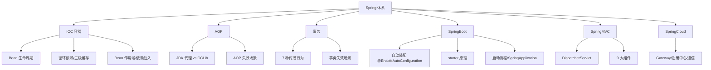

### P0 必背核心

#### IOC 与 DI：BeanFactory vs ApplicationContext
- **IOC（控制反转）** 是思想，**DI（依赖注入）** 是实现手段：把对象的创建权和依赖装配交给容器，业务类只声明依赖。
- **BeanFactory** 是最底层接口（`org.springframework.beans.factory.BeanFactory`），提供最基本的 `getBean()`，**延迟加载**——用到才创建。
- **ApplicationContext** 是 BeanFactory 的子接口，额外提供：① 国际化（MessageSource）；② 事件发布（ApplicationEventPublisher）；③ 资源加载（ResourceLoader）；④ 环境抽象（Environment）。**默认饿汉式预初始化所有单例 Bean**（`refresh()` 中的 `finishBeanFactoryInitialization`）。
- **DI 三种方式**：构造器注入（推荐，依赖不可变 + 强制不为 null + 可解决终态对象 + 利于单测）、Setter 注入、字段注入（`@Autowired` 直接打在字段上，IDEA 警告"Field injection is not recommended"——无法 final、绕过容器难单测、隐藏依赖）。
- 关联题：#0747、#0716、#0879、#0867

#### Bean 生命周期（核心 12 步，必背）
- ① 实例化（`createBeanInstance`，反射调构造器）→ ② 属性填充（`populateBean`，依赖注入发生在这里）→ ③ `Aware` 接口回调（`BeanNameAware` / `BeanFactoryAware` / `ApplicationContextAware` 注入容器自身资源）→ ④ `BeanPostProcessor.postProcessBeforeInitialization`（**@PostConstruct 在这一步通过 `CommonAnnotationBeanPostProcessor` 触发**）→ ⑤ `InitializingBean.afterPropertiesSet()` → ⑥ 自定义 `init-method`（XML 配置或 `@Bean(initMethod=)`）→ ⑦ `BeanPostProcessor.postProcessAfterInitialization`（**AOP 代理在这里生成**）→ Bean 就绪 → ⑧ 使用阶段 → ⑨ 容器关闭：`DisposableBean.destroy()` → ⑩ 自定义 `destroy-method` → `@PreDestroy` 同样走 `CommonAnnotationBeanPostProcessor`。
- **三个 init 钩子执行顺序**：`@PostConstruct` > `InitializingBean.afterPropertiesSet()` > 自定义 `init-method`。
- **AOP 代理时机**：发生在第 7 步 `postProcessAfterInitialization`，由 `AbstractAutoProxyCreator` 处理——这是**为什么类内自调用 AOP 失效**的根因（`this.method()` 调用的是原始对象不是代理对象）。
- 关联题：#0700、#0715、#0689、#0731

#### 循环依赖与三级缓存
- **三级缓存（`DefaultSingletonBeanRegistry`）**：① `singletonObjects`（一级，成品 Bean）；② `earlySingletonObjects`（二级，**半成品 Bean / 早期暴露对象**）；③ `singletonFactories`（三级，**ObjectFactory 工厂**，用于延迟生成代理）。
- **解决流程**（A 依赖 B、B 依赖 A）：A 实例化后属性填充前，把 `ObjectFactory` 放入三级缓存 → 注入 B，B 实例化时发现需要 A，从一级找不到 → 从二级找不到 → 从三级拿 `ObjectFactory.getObject()` 得到早期 A（若需 AOP 则提前生成代理）→ 把 A 提升到二级缓存，同时从三级缓存移除 → B 完成 → 回到 A，A 完成属性填充后提升到一级。
- **为什么需要三级而非二级**：核心是 **AOP 代理**。如果 Bean 不需要被代理，二级足够；但若需要 AOP，必须在"被其他 Bean 引用时"返回**代理对象**而非原对象（否则后续注入到别人手里的就是原对象，与最终成品不一致）。三级缓存存 `ObjectFactory`，**延迟决定**是否需要早期代理（`getEarlyBeanReference`），避免每个 Bean 都强行提前生成代理。
- **解决不了的三种循环依赖**：① **构造器循环依赖**（实例化阶段就需要对方，连半成品都没有，无法暴露）；② **prototype 作用域**（每次创建新实例，没法用缓存解决，直接抛 `BeanCurrentlyInCreationException`）；③ **@Async + 循环依赖**（@Async 通过 BeanPostProcessor 后置生成代理，与早期暴露的对象不是同一个，启动报错"Bean ... is not the same instance as ..."）。
- **`@Lazy` 解决循环依赖**：在注入点加 `@Lazy`，注入的是代理对象，真正调用时才解析目标 Bean，绕开了实例化期循环。
- 关联题：#0818、#1029、#1041、#1055、#1215、#0982、#0932

#### Bean 作用域（6 种）
- **singleton**（默认）：容器内单例，IoC 容器存活期间唯一实例。
- **prototype**：每次 `getBean()` 都返回新实例，**容器只负责创建不负责销毁**（不会调 `@PreDestroy`），用完要自己释放资源。
- **request / session / application**：Web 环境作用域，分别对应一次 HTTP 请求、一个用户会话、ServletContext 生命周期。
- **websocket**：WebSocket 会话级别。
- **singleton 注入 prototype 的坑**：默认只在 singleton 创建时注入一次 prototype，后续都是同一个实例——需要用 `@Lookup` 方法注入、`ObjectFactory<T>` 或 `ApplicationContext.getBean()` 来每次获取新实例。
- 关联题：#0971

#### AOP：JDK 代理 vs CGLib
- **JDK 动态代理**：基于**接口**，`Proxy.newProxyInstance` + `InvocationHandler`，目标类必须实现接口。
- **CGLib**：基于**继承**生成子类，可代理无接口的类；底层用 ASM 操作字节码。**final 类、final 方法、private 方法、static 方法**都无法被 CGLib 代理（子类没法重写）。
- **Spring 默认策略**：① 目标类实现了接口 → JDK 代理；② 没实现接口 → CGLib；③ `spring.aop.proxy-target-class=true` 或 SpringBoot 2.x 起**默认强制 CGLib**（避免接口/实现切换导致 AOP 失效）。
- **性能**：JDK 早期慢于 CGLib，JDK 8 以后 JDK 代理性能已反超 CGLib（CGLib 在 JDK 17 还有兼容问题，需要 `--add-opens`）。
- **@Aspect 5 种通知**：`@Before` / `@After`（finally 语义）/ `@AfterReturning` / `@AfterThrowing` / `@Around`（最强，可控制是否执行 `joinPoint.proceed()`）。
- 关联题：#0196

#### AOP 失效场景（高频）
- **类内自调用**：`this.methodB()` 直接走原始对象的方法表，根本没经过代理。解决：① 注入自身 `@Autowired private XxxService self;` 然后 `self.methodB()`；② `AopContext.currentProxy()`（要 `@EnableAspectJAutoProxy(exposeProxy=true)`）；③ 把方法拆到另一个 Bean。
- **private / static / final 方法**：CGLib 子类无法重写，AOP 切不到（编译期甚至会报错或被静默忽略）。
- **非 Spring 管理的对象**：`new XxxService()` 出来的对象不在容器里，没有代理。
- **多线程 / 异步**：子线程中调用同一个对象的方法走的还是 this，同样问题。
- 关联题：#0714

#### 事务：@Transactional 7 种传播行为
- **REQUIRED**（默认）：当前有事务则加入，没有则新建。
- **REQUIRES_NEW**：**总是新建事务**，挂起当前事务（**两个独立事务**，外层回滚不影响内层已提交）。底层通过 `DataSourceTransactionManager` 拿新连接，**注意连接池耗尽风险**。
- **NESTED**：基于**数据库 Savepoint** 实现的嵌套事务，内层回滚到 Savepoint，外层可决定是否一起回滚（只对 JDBC 有效，JPA 部分支持）。
- **SUPPORTS**：有事务加入，没有就非事务执行。
- **NOT_SUPPORTED**：挂起当前事务，自己以非事务方式运行。
- **NEVER**：当前有事务直接抛异常。
- **MANDATORY**：当前必须有事务，否则抛异常。
- 关联题：#0880

#### Spring 事务失效场景（必考清单）
- **方法非 public**：`@Transactional` 默认只对 public 方法生效（代理增强逻辑限制）。
- **自调用**：同一个类里 A() 调 B()，B 上的 `@Transactional` 失效——根因和 AOP 自调用相同。
- **异常被吃掉**：try-catch 后不重新抛，事务管理器感知不到，照常提交。
- **抛 checked exception**：`@Transactional` **默认只回滚 RuntimeException 和 Error**，checked exception 不回滚；需要 `rollbackFor = Exception.class` 显式声明。
- **数据库引擎不支持事务**：MySQL MyISAM 无事务能力。
- **类没被 Spring 管理**：`new` 出来的对象没有代理。
- **多线程**：事务依赖 `ThreadLocal` 绑定的 Connection，子线程拿不到主线程的事务上下文，子线程异常主线程也不会回滚。这就是为什么 `@Transactional + @Async` 子线程事务不生效但 @Async 本身的事务可以独立开启。
- **传播行为用错**：方法 B 用 `NOT_SUPPORTED` 时，B 内异常不会影响 A 的事务。
- 关联题：#0089、#0101、#0102、#0490、#0936、#1202

#### SpringBoot 自动装配
- **入口**：`@SpringBootApplication` = `@SpringBootConfiguration` + `@EnableAutoConfiguration` + `@ComponentScan`。
- **`@EnableAutoConfiguration`** 通过 `@Import(AutoConfigurationImportSelector.class)` 引入，`selectImports()` 用 `SpringFactoriesLoader` 读取所有 jar 的 `META-INF/spring.factories`（SpringBoot 2.x）或 `META-INF/spring/org.springframework.boot.autoconfigure.AutoConfiguration.imports`（**SpringBoot 2.7+ 推荐，3.0 完全切换**）。
- **为什么从 spring.factories 改成 .imports**：① 一个 key 一个 value，**编译期可识别**（APT 注解处理器），利于 GraalVM Native Image AOT 编译；② 解析更快，运行时开销小；③ 文件结构更清晰。
- **@Conditional 家族**：`@ConditionalOnClass`（classpath 上有某类）、`@ConditionalOnMissingBean`（容器中没有该 Bean 时才装配，这是用户自定义可覆盖默认配置的根本）、`@ConditionalOnProperty`（配置项满足）、`@ConditionalOnWebApplication` 等。
- **starter 原理**：① 写一个 `XxxAutoConfiguration`（`@Configuration` + `@ConditionalOnClass`）；② 在 `META-INF/spring/...AutoConfiguration.imports` 中声明；③ 通常配一个 `XxxProperties`（`@ConfigurationProperties(prefix="xxx")`）做配置绑定；④ 打成 `xxx-spring-boot-starter` 依赖。
- 关联题：#0762、#0297、#0958、#0699

#### SpringBoot 启动流程（SpringApplication.run）
- ① `new SpringApplication(primarySources)`：推断应用类型（SERVLET / REACTIVE / NONE）、加载 `ApplicationContextInitializer` 和 `ApplicationListener`（从 spring.factories 读）。
- ② `run(args)`：发布 `ApplicationStartingEvent` → 准备 Environment → 打印 banner → 创建 ApplicationContext（Servlet 环境是 `AnnotationConfigServletWebServerApplicationContext`）→ `prepareContext()` 注册主类 → **`refreshContext()`**（核心，等同于 Spring 的 `refresh()`：注册 BeanFactoryPostProcessor、扫描 Bean、初始化所有非懒加载单例、**嵌入式 Tomcat 在这里通过 `ServletWebServerApplicationContext.onRefresh()` 启动**）→ `afterRefresh()` → 发布 `ApplicationStartedEvent` → 执行 `ApplicationRunner` / `CommandLineRunner` → 发布 `ApplicationReadyEvent`。
- 关联题：#0200、#0746

#### SpringMVC 9 大组件 + 请求流程
- **DispatcherServlet** 是前端控制器，初始化时加载 9 大组件（`initStrategies()`）：① `MultipartResolver`（文件上传）；② `LocaleResolver`（国际化）；③ `ThemeResolver`；④ **`HandlerMapping`**（URL → Handler 映射，常用 `RequestMappingHandlerMapping`）；⑤ **`HandlerAdapter`**（适配不同类型 Handler，常用 `RequestMappingHandlerAdapter`，内部调用 `HandlerMethodArgumentResolver` 解析参数、`HandlerMethodReturnValueHandler` 处理返回值）；⑥ `HandlerExceptionResolver`（异常解析，`@ControllerAdvice` 走这里）；⑦ `RequestToViewNameTranslator`；⑧ **`ViewResolver`**（视图解析，REST API 中被 `HttpMessageConverter` 替代）；⑨ `FlashMapManager`（重定向参数）。
- **请求流程**：请求 → DispatcherServlet → HandlerMapping 找 Handler 和 Interceptor 链 → HandlerAdapter 调用 → 参数解析（HandlerMethodArgumentResolver，如 `@RequestBody` 走 `RequestResponseBodyMethodProcessor` → `HttpMessageConverter` 反序列化）→ 执行 Controller → 返回 ModelAndView 或对象 → ViewResolver/HttpMessageConverter 处理 → 输出。
- 关联题：#0790、#0326、#1218

#### 拦截器 / 过滤器 / AOP 对比
- **执行顺序（请求进入）**：过滤器 Filter（Servlet 规范，最外层）→ DispatcherServlet → 拦截器 Interceptor（Spring，preHandle）→ AOP 切面（@Around 进入）→ Controller → AOP 切面（@Around 退出）→ Interceptor.postHandle → Interceptor.afterCompletion → Filter（响应链）。
- **能拿到的对象**：Filter 只能拿到 `ServletRequest/Response`（最早），拿不到具体 Controller 方法；Interceptor 可以拿到 `HandlerMethod`（哪个 Controller 哪个方法），但拿不到方法参数；AOP 通过 `JoinPoint` 拿到所有方法参数和返回值。
- **典型职责分工**：跨域 / 字符编码 / 日志请求体（要包装 Request）放 Filter；登录校验 / 权限放 Interceptor；业务级日志 / 事务 / 限流放 AOP。

### P1 加分高频

#### 关键扩展点（启动时机由早到晚）
- **`BeanFactoryPostProcessor`**：在所有 BeanDefinition 加载完之后、Bean 实例化之前，可以**修改 BeanDefinition**（如改 scope、属性、占位符替换 `PropertySourcesPlaceholderConfigurer` 就是它的子类）。
- **`BeanDefinitionRegistryPostProcessor`**（继承前者）：能直接**动态注册新的 BeanDefinition**，`ConfigurationClassPostProcessor`（解析 `@Configuration` `@ComponentScan` `@Import`）就是这个层级。
- **`BeanPostProcessor`**：在 Bean 实例化之后、初始化前后回调，AOP（`AnnotationAwareAspectJAutoProxyCreator`）、`@Autowired`（`AutowiredAnnotationBeanPostProcessor`）、`@PostConstruct`（`CommonAnnotationBeanPostProcessor`）都靠它。
- **`Aware` 系列**：Bean 想拿到容器自身信息（`ApplicationContextAware` / `EnvironmentAware` / `BeanNameAware`）。
- **`InitializingBean` / @PostConstruct / init-method**：初始化业务钩子，顺序前面已述。
- **`ApplicationListener` + `@EventListener`**：监听容器事件 / 业务事件，Spring Event 实现。
- 关联题：#0294、#0998

#### @Resource vs @Autowired vs @Inject
- **@Autowired**（Spring 提供）：**按类型注入**（byType），匹配多个时按名字（属性名 / `@Qualifier`）；`required=false` 控制是否必须。
- **@Resource**（JSR-250，javax/jakarta）：**按名字注入**（byName），找不到再按类型；优先级 name > type。
- **@Inject**（JSR-330）：标准注解，行为类似 `@Autowired` 但没有 `required` 属性，需要额外依赖 `javax.inject`。
- **`@Qualifier`** + `@Autowired` 等价于 `@Resource(name=)`。
- 一个面试常问的小坑：`@Autowired` 注入 `Map<String, XxxService>` 时，**会把所有 XxxService 类型的 Bean 按 beanName 作为 key 装进 Map**——常用来做策略模式分发。同理 `List<XxxService>` 拿到所有实现。
- 关联题：#0922

#### Spring 事务自调用的源码原因
- `@Transactional` 由 `TransactionInterceptor` 实现，本质是 AOP 通过 `BeanPostProcessor` 在初始化后生成代理。
- 自调用走的是 `this`，绕过了代理。修正方式：① 注入 self；② `AopContext.currentProxy()` + `@EnableAspectJAutoProxy(exposeProxy=true)`；③ 提取到另一个 Bean。
- `TransactionSynchronizationManager` 用 ThreadLocal 绑定 Connection 和事务状态——这就是事务在 `@Async` 子线程失效的本质。
- 关联题：#0102、#1202

#### Spring Event 与 MQ 区别
- **Spring Event** 是**进程内**的事件发布/订阅，基于观察者模式。`ApplicationEventPublisher.publishEvent()` **默认同步**调用所有监听器（在发布者线程里执行）。要异步需 `@Async` + `@EnableAsync`。
- **MQ**（Kafka、RocketMQ）是**进程间**消息队列，跨服务、持久化、可重试、削峰填谷。
- **事务事件** `@TransactionalEventListener`：可监听 `BEFORE_COMMIT` / `AFTER_COMMIT` / `AFTER_ROLLBACK` / `AFTER_COMPLETION`——业务上常用"事务提交后再发 MQ"避免本地事务回滚但消息已发的不一致。
- 关联题：#0059、#0688、#1127

#### @Async 的坑
- `@Async` 通过 AOP 异步代理，**也存在自调用失效**问题。
- **默认线程池**是 `SimpleAsyncTaskExecutor`——**不复用线程、不限制并发数**，每次新建线程，高并发下能压垮系统。生产**必须自定义** `ThreadPoolTaskExecutor` 并通过 `@Async("myExecutor")` 指定。
- **不要使用默认线程池**这是面试常问的"反模式"。
- 与 `@Transactional` 组合：异步方法上若加 `@Transactional`，是**新开一个事务**（新线程里 ThreadLocal 没有上下文）；调用方的事务回滚不会传递到异步方法。
- 关联题：#1056、#1202

#### @Scheduled 实现原理
- 容器启动时 `ScheduledAnnotationBeanPostProcessor` 扫描所有 `@Scheduled` 方法，注册到 `ScheduledTaskRegistrar`。
- 底层是 **`ScheduledThreadPoolExecutor`**，**默认线程池只有 1 个线程**——多个 `@Scheduled` 方法**会串行**执行（一个跑慢全部延迟），生产必须自定义 `TaskScheduler` 或 `ThreadPoolTaskScheduler` 设置 pool-size。
- 支持 `fixedRate` / `fixedDelay` / `cron`。分布式场景 `@Scheduled` 会在多节点上重复执行，需要分布式锁或 XXL-Job 等调度框架。
- 关联题：#0907

#### Bean 线程安全
- **singleton（默认）线程不安全**：单例 + 多线程共享。但**绝大多数 Spring Bean 是无状态的**（Service、DAO 只有方法、没有可变成员变量），所以没问题。
- **不安全的典型场景**：在 Service 里加了可变成员变量（比如缓存、计数器）、SimpleDateFormat 字段、Connection 字段等。
- **修正**：① 改用方法局部变量；② 用 ThreadLocal；③ 改 `prototype` 作用域；④ 使用线程安全的工具类（`DateTimeFormatter`、`AtomicInteger`）。
- 关联题：#0983

#### SpringCloud 体系（一句话掌握）
- 一站式微服务工具集，组件：注册中心（Eureka 已被移除推荐 **Nacos / Consul**）、配置中心（Spring Cloud Config / Nacos Config）、负载均衡（Ribbon → **Spring Cloud LoadBalancer**）、服务调用（Feign / OpenFeign）、熔断降级（Hystrix 停更 → **Resilience4j / Sentinel**）、网关（Zuul 1.x → **Spring Cloud Gateway**，基于 WebFlux / Netty / Reactor）、链路追踪（Sleuth → **Micrometer Tracing**）。
- **Gateway 作用**：统一入口、路由、鉴权、限流、协议转换、灰度。
- **Spring Cloud 通信方式**：① 同步 REST（RestTemplate / WebClient / OpenFeign）；② 异步 MQ；③ RPC（Dubbo、gRPC）。
- 关联题：#1083、#1084、#1173、#1213、#1160、#1161

#### Spring 用到的设计模式
- **工厂**：BeanFactory、FactoryBean。
- **单例**：默认 Bean。
- **代理**：AOP。
- **模板方法**：JdbcTemplate、RestTemplate。
- **观察者**：Spring Event。
- **责任链**：Interceptor 链、Filter 链。
- **适配器**：HandlerAdapter（适配不同 Handler 类型）。
- **装饰器**：BeanWrapper。
- **策略**：InstantiationStrategy（CGLib / 反射）。
- 关联题：#0831

#### BeanFactory vs FactoryBean
- 一字之差，完全两个东西。
- **BeanFactory**：容器，管理所有 Bean。
- **FactoryBean<T>**：**特殊 Bean**，实现该接口的 Bean 通过 `getObject()` 返回另一个对象——`getBean("xxx")` 拿到的是 `getObject()` 的产物，`getBean("&xxx")` 才拿到 FactoryBean 本身。MyBatis 的 `SqlSessionFactoryBean` 就是典型。
- 关联题：#0867

### P2 深度延伸

#### bootstrap.yml vs application.yml
- **bootstrap.yml** 加载更早，由 **`BootstrapApplicationContext`**（Spring Cloud 概念）加载，用于配置中心 / 加密配置等"配置如何加载"的元配置。**没有引入 Spring Cloud 时 bootstrap.yml 不会被读取**。
- **application.yml** 在主 ApplicationContext 启动后加载，应用业务配置都在这。
- bootstrap 配置不可被 application 覆盖（优先级高）。
- 关联题：#0075

#### 多环境配置
- `spring.profiles.active=dev` 激活某环境；文件命名 `application-dev.yml`、`application-prod.yml`。
- `@Profile("dev")` 控制某 Bean 只在指定 profile 加载。
- SpringBoot 2.4+ 引入 `spring.config.activate.on-profile` 替代旧的 `spring.profiles`，且**多 yaml 段用 `---` 分隔**写在同一个文件。
- 关联题：#0959

#### 动态注册 Bean
- 方式一：`@Configuration` + `@Bean` 方法（静态，编译期已知）。
- 方式二：实现 `ImportBeanDefinitionRegistrar`，在 `registerBeanDefinitions` 中拿到 `BeanDefinitionRegistry` 调 `registerBeanDefinition()`。
- 方式三：实现 `BeanFactoryPostProcessor` / `BeanDefinitionRegistryPostProcessor`，直接操作 `DefaultListableBeanFactory`。
- 方式四：`SingletonBeanRegistry.registerSingleton()`——**已实例化好的对象**直接注册（绕过生命周期，慎用，没有 AOP 增强）。
- 关联题：#0121、#0896

#### Spring 优雅停机
- SpringBoot 2.3+ 配置：`server.shutdown=graceful` + `spring.lifecycle.timeout-per-shutdown-phase=30s`。
- 流程：收到 SIGTERM → 停止接收新请求（关闭 Web 服务器入口）→ 等待正在处理的请求完成（最多 timeout）→ `ContextClosedEvent` 发布 → 执行 `@PreDestroy` / `DisposableBean.destroy()` → 进程退出。
- 必须用 `kill -15`（SIGTERM）触发；`kill -9` 直接杀，钩子不会跑。
- 关联题：#1011、#0731

#### SpringBoot 和 Spring 双亲委派的差异
- 标准 Java 双亲委派是子加载器先委托父加载器。
- SpringBoot 的 **fat jar / executable jar** 用了 `LaunchedClassLoader`（继承 `URLClassLoader`），加载时优先加载 BOOT-INF/classes 和 BOOT-INF/lib 下的内容；不是破坏双亲委派，而是**扩展了搜索路径**——业务类和依赖打在一个大 jar 里也能正确加载。
- 关联题：#1187

#### jar vs war / fat jar
- **jar**：Java Archive，普通 Java 包。
- **war**：Web Archive，传统部署到 Tomcat 等 Servlet 容器。
- **fat jar / uber jar**：把所有依赖和**嵌入式 Tomcat** 打进一个可执行 jar，`java -jar app.jar` 直接跑，SpringBoot 默认方式。本质是 spring-boot-maven-plugin 重新打包成嵌套 jar 结构（BOOT-INF/lib 里的 jar 不解压）。

### P3 冷门刁钻

#### Spring 6 / SpringBoot 3 关键变化
- **基线升级**：JDK 17、Jakarta EE 9（包名 `javax.*` → `jakarta.*`，需要全部依赖配套）。
- **GraalVM Native Image** 原生镜像编译，启动毫秒级、内存占用低。
- **可观测性**：用 Micrometer Observation API 替代 Sleuth。
- **HTTP Interface**：声明式 HTTP 客户端，类似 Feign 但是 Spring 原生（`@HttpExchange`）。
- **Eureka 在 SpringCloud 2022/2023 中没移除，但社区主推 Nacos**。

#### Spring 7 / SpringBoot 4 新特性
- 进一步推进 AOT / Native 编译。
- 更激进的 Virtual Thread（JDK 21 虚拟线程）支持，配置一行 `spring.threads.virtual.enabled=true` 让 Tomcat 用虚拟线程跑请求。
- 关联题：#0080、#0082

#### Spring 缓存预热
- 实现 `ApplicationRunner` / `CommandLineRunner` 在容器就绪后跑预热逻辑。
- 监听 `ApplicationReadyEvent` 比 `ContextRefreshedEvent` 更稳——后者在 Web 服务器还未启动完成时就触发。
- 加 `@PostConstruct` 在 Bean 初始化时跑，但此时其他 Bean 可能没就绪，慎用。
- 关联题：#0998

### 跨模块联想

- IOC / AOP ↔ **02 JVM**：动态代理生成大量 CGLib 类，Metaspace 容易满；JDK 代理底层是 `Proxy.newProxyInstance` 反射调用。
- 三级缓存 ↔ **05 设计模式**：典型的"工厂模式 + 延迟初始化"。
- 事务自调用 / AOP 自调用 ↔ **02 JVM 字节码**：理解为什么 `this.method()` 不走代理需要看代理类的字节码——子类只重写了被代理方法，`this` 在原始 `super` 方法体里指向自己。
- @Async 默认线程池坑 ↔ **03 并发**：手写 `ThreadPoolExecutor` 的 7 参数。
- Bean 线程安全 ↔ **03 并发**：ThreadLocal / 不可变对象 / 同步策略。
- SpringBoot 自动装配 ↔ **20 通用基础（SPI）**：`SpringFactoriesLoader` 是 Spring 版 SPI；JDK SPI（`ServiceLoader`）vs Dubbo SPI vs Spring SPI 的对比是综合面试常问。
- @Scheduled 单线程坑 ↔ **15 业务场景**：定时任务任务堆积排查。
- 优雅停机 ↔ **02 JVM**：`kill -15` ShutdownHook 链路。
- Gateway / 限流熔断 ↔ **17 微服务 / 高可用**。
- 事务隔离级别 ↔ **08 MySQL**：四种隔离级别 + MVCC + 间隙锁。

---

## 05 MySQL

> 模块定位：高级岗"第二硬通货"，必考。重点是 **InnoDB 引擎 + B+ 树索引 + 事务 MVCC + 锁 + 日志体系 + 主从复制 + SQL 优化**。153 题，体量大。
> 题量：153 题。

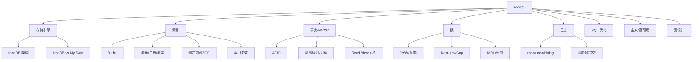

### P0 必背核心

#### InnoDB 整体架构
- **内存结构**：Buffer Pool（数据页/索引页缓存，LRU 改良冷热分离，old 区 37%）、Change Buffer（非唯一二级索引写入合并，提升 INSERT/UPDATE）、Adaptive Hash Index（自适应哈希）、Log Buffer（redo log 缓冲区）。
- **磁盘结构**：系统表空间（ibdata1）、独立表空间（每张表一个 .ibd）、undo 表空间、redo log 文件（ib_logfile0/1，循环写）、binlog（mysqld 层）。
- **后台线程**：Master Thread（合并 ChangeBuffer、刷脏页、清理 undo）、IO Thread、Purge Thread（清理 undo）、Page Cleaner（刷脏）。
- **WAL（Write-Ahead Log）**：先写 redo 日志再改数据页，崩溃恢复靠 redo + undo。
- 关联题：#0046、#0246

#### 为什么用 B+ 树（而不是 B 树 / 红黑树 / Hash）
- **B+ 树特点**：① 只有叶节点存数据，非叶节点只存索引键 → 单页能存更多 key → 树更矮；② 叶节点用**双向链表**串联 → 范围查询友好；③ 所有查询都到叶节点 → 性能稳定。
- **vs B 树**：B 树每个节点都存数据，单页 key 数少树高高；范围查询要回溯。
- **vs 红黑树**：树高 O(log₂n)，1000 万数据约 23 层，磁盘 IO 太多；B+ 树扇出 1000+，3-4 层就能管亿级数据。
- **vs Hash**：等值查询 O(1) 但范围查询全表扫；不支持排序、不支持模糊查询前缀；哈希冲突。
- **InnoDB B+ 树阶数**：InnoDB 页大小默认 16KB，每个非叶节点能存约 1000+ 个 key（取决于 key 长度）。3 层 B+ 树 ≈ 千万级数据。
- 关联题：#0037、#0084

#### 聚簇索引 vs 二级索引 vs 覆盖索引
- **聚簇索引**：叶子节点直接存**完整行数据**。InnoDB 主键就是聚簇索引，没主键用唯一索引，再没有用 ROWID 隐藏列。一张表只能有一个聚簇索引。
- **二级索引（非聚簇 / 辅助）**：叶子节点存索引列 + **主键值**，查到主键值再回主键索引取整行 = **回表**。
- **覆盖索引**：select 字段都包含在二级索引中，不需要回表。explain Extra 显示 `Using index`。优化深翻页、count 查询常用。
- **回表**：二级索引查到主键 → 再去聚簇索引找完整行。回表越多越慢。
- **典型陷阱**：`SELECT *` 几乎一定回表；`select name, age from user where age=18`（age 索引）若 name 不在索引中就要回表。
- 关联题：#0046、#0085

#### 最左前缀与索引下推（ICP）
- **联合索引最左前缀**：`INDEX(a, b, c)` 可命中 `where a`、`where a, b`、`where a, b, c`，跳过 a 直接 `where b, c` 不命中；`where a, c` 只能用到 a；`where a=1 order by b` 可用索引排序。
- **范围查询截断**：联合索引中遇到范围查询（>、<、BETWEEN、LIKE）后续列就不能再用索引。`where a=1 and b>10 and c=5`：a、b 走索引，c 走过滤。
- **索引下推 ICP（MySQL 5.6+）**：默认开启。在存储引擎层就用上索引中的额外列做过滤，减少回表次数。Extra 中显示 `Using index condition`。
- **MRR（Multi-Range Read）**：把回表的随机 IO 改为按主键排序的顺序 IO，提升范围查询性能。
- 关联题：#0050、#0083、#0181

#### 索引失效场景
- **函数/计算**：`where YEAR(create_time) = 2024`、`where age + 1 = 20` 失效（除非函数索引 8.0+）。
- **隐式类型转换**：列是 varchar 但 where 用数字 `where phone = 13888888888`（去掉引号）会全表扫。**字符串列必须加引号**。
- **前导模糊查询**：`like '%xx'` 或 `like '%xx%'` 失效，`like 'xx%'` 可用。
- **OR**：OR 两边只有一边有索引时整体失效；都有索引但 MySQL 优化器可能仍选全表扫（取决于成本）。
- **!= / <> / NOT IN / IS NOT NULL**：取决于优化器，常导致全表扫。
- **联合索引不满足最左前缀**。
- **WHERE 与 ORDER BY 列顺序不一致** 导致 Using filesort。
- **统计信息过期**：执行计划走错，可 `ANALYZE TABLE` 重新统计。
- 关联题：#0038、#0181

#### 事务 ACID 实现
- **A 原子性**：靠 **undo log**——执行 update/insert/delete 时把反向操作记入 undo，回滚就反向执行。
- **C 一致性**：业务层 + 数据库约束（PK/FK/CHECK/UNIQUE）+ AID 三者共同保证。
- **I 隔离性**：靠**锁 + MVCC**——写写互斥靠行锁、读写靠 MVCC 不互斥。
- **D 持久性**：靠 **redo log**——事务提交前 redo 必须刷盘（innodb_flush_log_at_trx_commit=1），即使宕机也能恢复。
- 关联题：#0049、#0091

#### 隔离级别与读异常
- **4 个级别**：READ UNCOMMITTED（脏读）、READ COMMITTED（不可重复读）、**REPEATABLE READ**（默认，幻读理论存在但 InnoDB 通过间隙锁解决了大部分）、SERIALIZABLE（串行）。
- **三大异常**：脏读（读到未提交的数据）、不可重复读（同一事务两次读同一行结果不同）、幻读（同一事务两次范围查询行数不同）。
- **MySQL RR 是否能解决幻读**：**当前读靠 Next-Key Lock 解决**（select for update、update、delete），**快照读靠 MVCC**（不会看到新行，但当前读仍会看到——所谓"半解决"）。
- **不同业务选择**：金融常用 RR、互联网常用 RC（性能更好、间隙锁少、易避死锁）。
- 关联题：#0049、#0091

#### MVCC 与 Read View
- **核心**：每行记录有隐藏字段 `trx_id`（最后修改事务 ID）、`roll_pointer`（指向 undo log 的指针）；通过 undo log 链可构造任一历史版本。
- **Read View**：快照读时创建，4 个核心字段：m_ids（活跃事务列表）、min_trx_id（最小活跃事务 ID）、max_trx_id（下一个事务 ID）、creator_trx_id（自己）。
- **可见性算法 4 步**：① 记录 trx_id < min_trx_id → 可见；② trx_id ≥ max_trx_id → 不可见；③ trx_id 在 m_ids 中 → 不可见（活跃事务）；④ trx_id 不在 m_ids 中 → 可见（已提交）；不可见则沿 roll_pointer 找前一版本。
- **RC vs RR 区别**：RC **每次 select 都生成新 ReadView**；RR **事务第一次 select 生成 ReadView 后整个事务复用**。
- **快照读 vs 当前读**：select 是快照读；select ... for update / lock in share mode / insert / update / delete 是当前读，加锁读最新版本。
- 关联题：#0091、#0277

#### 锁体系（行锁/表锁/意向锁/Next-Key）
- **粒度**：表锁（DDL）、页锁（少用）、**行锁**（InnoDB 主力）。
- **共享锁 S vs 排他锁 X**：S 读锁互不冲突，X 写锁互斥。
- **意向锁 IS/IX**：表级，表示表中**某些行**有 S/X 锁，加表锁时快速判断是否冲突，不必逐行检查。意向锁之间不冲突。
- **行锁三种实现**：① **Record Lock**（记录锁，锁单行）；② **Gap Lock**（间隙锁，锁一个区间但不含行本身，只在 RR 级别）；③ **Next-Key Lock**（前两个的组合，左开右闭区间）—— InnoDB **默认加 Next-Key Lock**。
- **插入意向锁**：特殊的间隙锁，多个事务在同一间隙不同位置插入不冲突。
- **自增锁 AUTO-INC**：插入时持有，可调 `innodb_autoinc_lock_mode`（0 传统/1 连续/2 交叉，主从复制相关）。
- **MDL（Metadata Lock）**：DDL（如 ALTER TABLE）与 DML 互斥；DDL 卡在大查询后面是常见线上事故。
- 关联题：#0049、#0277

#### redo / undo / binlog 三大日志
- **redo log（InnoDB 层，物理日志）**：记录"页 X 偏移 Y 改成 Z"。**循环写**（ib_logfile0/1），WAL 机制保证持久性。`innodb_flush_log_at_trx_commit`：0 每秒刷 1 次（性能高、丢 1 秒）、1 每次事务提交都刷盘（默认、不丢数据）、2 写到 OS Cache 每秒刷。
- **undo log（InnoDB 层，逻辑日志）**：记录反向操作。用途两个：事务回滚 + MVCC 多版本快照。
- **binlog（MySQL Server 层，逻辑日志）**：记录所有改表操作，**追加写**不循环。用于主从复制和恢复。三种格式：STATEMENT（语句）、ROW（行变化）、MIXED。`sync_binlog`：1 每次提交刷盘（默认 1 不丢）、0 由 OS 决定、N 累积 N 次刷。
- **两阶段提交（2PC）**：保证 redo 和 binlog 一致。流程：① 写 redo（prepare）；② 写 binlog；③ 写 redo（commit）。崩溃恢复时：redo prepare + binlog 完整 → 提交；redo prepare 但 binlog 不完整 → 回滚。
- 关联题：#0277、#0181

#### 主从复制原理
- **3 个线程**：① 主库 dump thread 把 binlog 推给从库；② 从库 IO thread 接收写入 relay log；③ 从库 SQL thread 重放 relay log。
- **3 种模式**：异步（默认，丢数据风险）、半同步（主等至少一个从 ack，rpl_semi_sync_master_wait_no_slave）、组复制 MGR（基于 Paxos 多主或单主）。
- **延迟原因**：① 主库写并发高从库单线程重放（5.6+ 库级别并行、5.7+ 组提交并行、8.0 基于 WriteSet 并行）；② 大事务；③ 网络；④ 从库硬件差；⑤ 锁等待。
- **GTID**：全局事务 ID，替代传统 binlog 文件名 + 位点，主从切换、复制故障恢复更方便。
- 关联题：#0246

### P1 加分高频

#### explain 字段解读
- **type**（关键）：性能从好到差：system > const > eq_ref（唯一索引连接）> ref（非唯一索引等值）> range（范围）> index（索引全扫）> ALL（全表扫）。生产至少 range，理想 ref 及以上。
- **key**：实际使用的索引。**key_len**：使用索引的字节数（联合索引判断用到第几列）。
- **rows**：估计扫描的行数。
- **Extra**：① Using index（覆盖索引）；② Using where（Server 层再过滤）；③ Using index condition（索引下推）；④ Using filesort（额外排序，警惕）；⑤ Using temporary（临时表，警惕）；⑥ Using join buffer（被驱动表无索引）。
- 关联题：#0091

#### 一条 SELECT 完整流程
- ① 连接器：身份认证、权限校验、建立连接。
- ② 查询缓存：MySQL 8.0 已移除（命中率低、维护成本高）。
- ③ 分析器：词法分析 + 语法分析，生成解析树。
- ④ 优化器：基于成本（CBO）选择执行计划（索引选择、join 顺序、子查询优化）。
- ⑤ 执行器：调用存储引擎接口读取数据。
- ⑥ 存储引擎：InnoDB 用 Buffer Pool 读页面、走 B+ 树检索。
- 关联题：#0046

#### count(*) vs count(1) vs count(列)
- **count(*)** 和 **count(1)**：等价，MySQL 优化器都走最短的索引扫描（一般是二级索引比聚簇索引短），都不会过滤 NULL。
- **count(col)**：统计 col 不为 NULL 的行数，会走 col 索引或全表扫。
- **MyISAM count(\*) O(1)**（专门维护行数），InnoDB 因 MVCC 必须扫描。
- 关联题：#0049

#### 深翻页优化
- **传统 LIMIT offset, n**：`LIMIT 100000, 10` 实际要扫 100010 行回表 100000 次再丢弃。
- **延迟关联（覆盖索引子查询）**：`SELECT * FROM t INNER JOIN (SELECT id FROM t ORDER BY x LIMIT 100000, 10) tmp USING(id)`——子查询走覆盖索引不回表，外层只回表 10 次。
- **游标式**：`WHERE id > 上一页最大 id ORDER BY id LIMIT 10`，性能最好但只能下一页。
- 关联题：#0046

#### 死锁排查
- **必要条件**：互斥、占有且等待、不可剥夺、循环等待。
- **查死锁**：`SHOW ENGINE INNODB STATUS\G` 看 LATEST DETECTED DEADLOCK 段；MySQL 5.6+ 可开 `innodb_print_all_deadlocks` 写错误日志。
- **检测**：`innodb_deadlock_detect=ON`（默认），死锁时回滚代价小的事务，错误码 1213。
- **避免**：① 减少事务大小；② 按固定顺序访问表/行；③ 用唯一索引避免间隙锁过多；④ RC 隔离级别更不易死锁；⑤ 索引覆盖减少锁定范围。
- 关联题：#0049、#0277

#### 字段设计原则
- **类型最小够用**：INT(11) 中括号是显示宽度无意义；用 INT/BIGINT 别用 VARCHAR 存数字；TINYINT 存 0-255 状态够了。
- **NOT NULL**：NULL 占用一个 NULL 位、参与索引让索引变复杂、不利于聚合（COUNT、SUM 跳过 NULL）。除非业务真有"未知"语义，否则全 NOT NULL + 默认值。
- **VARCHAR vs CHAR**：CHAR 定长（适合固定长度如 MD5），VARCHAR 变长省空间但有 1-2 字节长度前缀。VARCHAR 实际占用看内容。
- **TEXT/BLOB**：单独存储，主表不存内容（指针），避免拖慢主表查询；很多场景应改为分库或对象存储 OSS。
- **DATETIME vs TIMESTAMP**：DATETIME 8 字节、范围 1000-9999、不带时区；TIMESTAMP 4 字节、范围 1970-2038、自动转 UTC 存储。
- 关联题：#0049

#### 主键设计
- **必须有主键**：没主键 InnoDB 用唯一索引，再没有用 6 字节 ROWID。
- **自增 vs UUID**：自增连续插入页满后顺序分配新页（顺序 IO）；UUID 无序导致 B+ 树**页分裂**频繁（随机插入位置）、占用空间大（16 字节 vs 8 字节 BIGINT）、影响 Buffer Pool 命中率。
- **雪花 ID**：64 位 BIGINT 时间趋势递增，是分布式场景下好的主键选择。
- **基因法**：业务 ID 末尾嵌入分片键基因（如用户 ID 末位），保证同一用户订单落同一分片。
- 关联题：#0047、#0049

#### 长事务危害
- 占用大量 undo 日志，导致 undo 表空间膨胀。
- 锁占用时间长，影响并发。
- MDL 阻塞 DDL，无法 ALTER TABLE。
- 主从复制延迟加剧。
- Buffer Pool 老 view 无法清理。
- 防范：` information_schema.innodb_trx` 监控运行超 N 秒的事务并告警。
- 关联题：#0049

#### update / delete 流程
- ① 执行器调用 InnoDB 读取行（如果在 Buffer Pool 有就直接读，没有就从磁盘加载页）。
- ② 写 undo log（记录修改前的值）。
- ③ 修改 Buffer Pool 中的数据页 → 标记脏页。
- ④ 写 redo log buffer，事务提交时刷 redo（prepare 阶段）。
- ⑤ 写 binlog buffer，事务提交时刷 binlog。
- ⑥ redo log commit。
- ⑦ 异步刷脏页到磁盘。
- 关联题：#0049

### P2 深度延伸

#### Buffer Pool 工作机制
- **大小**：`innodb_buffer_pool_size`，建议物理内存 60-80%，是 MySQL 最重要的参数。
- **划分**：分多个 instance（`innodb_buffer_pool_instances`）减少竞争锁；每个 instance 分多个 chunk。
- **LRU 改良**：分 new 区（默认 63%）和 old 区（37%），新加载页先放 old 区头部，被再次访问且距上次加载超过 1 秒才晋升到 new 区头部——避免预读 / 全表扫一次性把热数据冲掉。
- **脏页刷新**：达到 `innodb_max_dirty_pages_pct`（默认 75%）触发 Page Cleaner 异步刷盘。
- 关联题：#0246

#### Change Buffer
- 非唯一二级索引的 INSERT/UPDATE/DELETE，如果目标页**不在 Buffer Pool**，先把操作记录到 Change Buffer，等下次该页被读取时合并（merge）回内存页。
- **为什么只优化非唯一**：唯一索引必须读页判断是否存在，没法延迟。
- **场景**：写多读少的业务收益大；读多写少反而增加 merge 开销。
- 参数：`innodb_change_buffer_max_size`（默认 25%）。
- 关联题：#0246

#### 自适应哈希索引 AHI
- InnoDB 监测到某些索引页被高频精确查询时，自动建立内存哈希加速等值查询。
- 不需要人为创建、不持久化、可关闭（`innodb_adaptive_hash_index`）。
- 业务全是范围查询场景关掉反而好（监测开销）。

#### 半同步复制原理
- 主库写 binlog 后等待**至少 N 个从库（默认 1）的 ack**，才提交事务给客户端。
- 参数：`rpl_semi_sync_master_wait_for_slave_count`、`rpl_semi_sync_master_timeout`（默认 10 秒，超时降级为异步）。
- AFTER_SYNC（默认）vs AFTER_COMMIT：AFTER_SYNC 写完 binlog 再等 ack（无幻读），AFTER_COMMIT 先提交再等 ack（有幻读，从库挂主库已提交但从库没收到）。
- 关联题：#0246

#### 慢查询排查全流程
- 开启：`slow_query_log=1`，`long_query_time=1`（秒），`slow_query_log_file=/path/slow.log`。
- 工具：`mysqldumpslow -s t -t 10 slow.log` 按耗时排前 10；`pt-query-digest slow.log` 更详细统计；阿里云 RDS 自带慢日志分析。
- 单条排查：`EXPLAIN` 看执行计划；`SHOW PROFILE` 看每阶段耗时（已废弃用 performance_schema 替代）。
- 优化方向：建索引、改 SQL（去 SELECT *、避免函数、避免子查询）、改表结构、读写分离、分库分表。
- 关联题：#0181

#### 字符集与排序
- **utf8 vs utf8mb4**：MySQL 的 utf8 实际只支持 3 字节（不能存 emoji 和部分汉字），**utf8mb4 才是真正的 UTF-8**（4 字节）。MySQL 8.0+ 默认 utf8mb4。
- **utf8mb4_general_ci vs utf8mb4_unicode_ci vs utf8mb4_0900_ai_ci**：general 速度快、unicode 标准、0900_ai_ci 是 8.0+ 默认（Unicode 9.0、accent-insensitive、case-insensitive）。
- **列字符集与表/库字符集**：可逐级覆盖。注意 join 两表字符集不同会隐式转换导致索引失效。

### P3 冷门刁钻

#### MMM / MHA / Orchestrator
- **MMM（Multi-Master Replication Manager）**：双主复制 + 故障切换，老方案问题多。
- **MHA（Master High Availability）**：主库故障 30 秒内自动切换，从从库中选最新的作为新主，已停止维护。
- **Orchestrator**：GitHub 开源，可视化拓扑管理、故障自动切换，目前主流。
- **MGR（Group Replication）**：基于 Paxos 的内置组复制，多主或单主，MySQL 8.0+ 推荐。

#### 函数索引（8.0+）
- 直接对函数表达式建索引：`CREATE INDEX idx ON t((YEAR(created_at)))`；之后 `WHERE YEAR(created_at)=2024` 也能走索引。
- 8.0 之前要靠**生成列（Generated Column）+ 普通索引**。
- 关联题：#0038

#### 隐藏索引（8.0+）
- `ALTER TABLE t ALTER INDEX idx INVISIBLE`：优化器看不到该索引，但仍会维护——验证索引是否真的有用，再决定是否真删除。

#### CTE 与窗口函数（8.0+）
- **CTE（WITH 子句）**：`WITH cte AS (...) SELECT ...`，提升可读性、支持递归。
- **窗口函数**：ROW_NUMBER / RANK / DENSE_RANK / LAG / LEAD / SUM() OVER(PARTITION BY ...)，做排名、累计、移动平均很强，避免自连接。

#### InnoDB vs MyISAM
- **InnoDB**：支持事务、行锁、外键、MVCC，主流。
- **MyISAM**：不支持事务、表锁、count(*) 快（独立维护行数）、压缩表只读、已被边缘化。
- **MySQL 8.0** 系统表都改 InnoDB 了。

### 跨模块联想

- 索引/B+ 树 ↔ **01 Java 基础**：HashMap 与 B+ 树对比、TreeMap 红黑树 vs B+ 树。
- MVCC/隔离级别 ↔ **09 分布式事务**：分布式事务的核心难点正是单库 MVCC 解决不了的。
- 主从复制 ↔ **08 微服务**：读写分离架构 + 一致性挑战（强一致用主库读、最终一致走从库）。
- 锁与死锁 ↔ **03 并发**：单库 Next-Key Lock 类比 JVM 内 synchronized；死锁排查靠 SHOW ENGINE INNODB STATUS。
- 慢 SQL ↔ **16 性能调优**：接口慢首查慢 SQL；EXPLAIN + 索引优化是必备技能。
- 分库分表 ↔ **11 分库分表**：单表 2000 万是经验阈值；基因法保证同用户落同分片。
- 长事务 ↔ **02 JVM**：MDL 阻塞 DDL、undo 膨胀类比 JVM 老年代积累；长事务也阻塞 binlog purge。
- redo/binlog ↔ **07 消息队列**：Canal 订阅 binlog 同步到 Kafka 做 CDC。
- 索引失效 ↔ **15 业务场景**：线上慢查询 80% 是索引失效（隐式类型转换、函数、模糊查询）。

---

## 06 Redis

> 模块定位：高级岗"几乎必考"，考点密度仅次于 JVM 与并发。重点是**数据结构与编码 + 持久化 + 高可用（主从/哨兵/Cluster） + 缓存三大问题 + 分布式锁**。
> 题量：74 题。

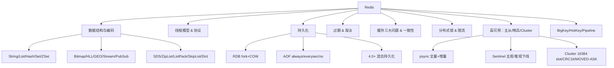

### P0 必背核心

#### 5 大基础数据类型与底层编码
- **String**：底层是 SDS（Simple Dynamic String），编码有 **int**（能转 long 的纯数字）、**embstr**（≤44 字节，SDS 和 redisObject 连续分配一次 malloc）、**raw**（>44 字节，两次分配）。SDS 比 C 字符串多了 `len/alloc/flags`，O(1) 求长度、二进制安全、避免缓冲区溢出、预分配减少 realloc。
- **List**：3.2 起统一用 **quicklist**（双向链表 + 每个节点是 ZipList/ListPack），7.0 后节点用 ListPack，兼顾内存与遍历。
- **Hash**：元素少且小用 **listpack**（7.0 前是 ziplist，阈值 `hash-max-listpack-entries=128`、`hash-max-listpack-value=64`），超阈值转 **hashtable**（dict + 渐进式 rehash）。
- **Set**：纯整数且元素 ≤512 个用 **intset**（有序数组 + 二分），否则 7.0 用 listpack，再超用 **hashtable**。
- **ZSet**：元素 ≤128 且每个 ≤64 字节用 **listpack**（7.0 前 ziplist），超阈值转 **skiplist + dict** 双结构——skiplist 支持范围 O(logN)，dict 给 ZSCORE O(1)。
- 关联题：#0583、#0237、#0255、#0286、#0288、#0582、#0287、#0278、#1323、#1355

#### ZSet 为何选跳表而不是红黑树
- **范围查询**：跳表本身是有序链表，`ZRANGEBYSCORE` 只需找到起点后向后遍历，红黑树范围查找要中序遍历更复杂。
- **实现简单**：跳表代码量远小于红黑树，作者 antirez 明确说"红黑树平衡操作复杂、跳表更易调试"。
- **内存灵活**：通过调整 `p`（默认 1/4）平衡空间与时间，红黑树固定开销大。
- **并发友好**：跳表插入只改局部指针，理论上对并发友好（虽然 Redis 单线程不需要）。
- 与 ZipList/ListPack 的切换：小数据量用紧凑结构省内存（128/64 阈值），大数据量转跳表保性能。
- 关联题：#0288、#0286、#0743、#1355

#### 高级数据类型（位图/HLL/GEO/Stream/Pub-Sub）
- **Bitmap**：基于 String 的位操作，`SETBIT/GETBIT/BITCOUNT/BITOP`。典型场景：签到（一个用户一个 key、365 bit = 46 字节）、活跃用户、布隆过滤器底层。
- **HyperLogLog**：基数统计，**固定 12KB** 内存可统计 2^64 个元素，标准误差 0.81%。`PFADD/PFCOUNT/PFMERGE`。适合 UV 统计。
- **GEO**：底层是 ZSet，把经纬度通过 **GeoHash** 编码成 52 位整数当 score。`GEOADD/GEORADIUS/GEOSEARCH`。
- **Stream**（5.0+）：消息队列结构，支持消费者组、ACK、PEL（pending entries list），可解决 List+BLPOP 无消费组、Pub/Sub 无持久化的痛点。
- **Pub/Sub**：发布订阅，**消息不持久化**、订阅者不在线就丢，不能做可靠消息。
- 关联题：#0556、#0888、#0759、#0744

#### 单线程模型 & IO 多路复用
- **"单线程"指命令执行**：网络 I/O 和命令解析在一个主线程上，串行处理命令，因此命令本身天然原子。
- **为什么快**：① 纯内存；② 单线程避免锁竞争和上下文切换；③ I/O 多路复用 epoll（Linux）/kqueue（BSD）一个线程管多个 socket；④ 高效数据结构；⑤ 自实现事件循环 AE。
- **Redis 6.0 多线程**：**只多线程化网络读写和协议解析**，命令执行仍然单线程。配置 `io-threads 4`、`io-threads-do-reads yes`，4C 机器一般 2-3 个 IO 线程最优。
- **为什么不用多线程命令**：① CPU 不是瓶颈（瓶颈是网络和内存）；② 多线程引入锁会复杂化数据结构；③ 单线程语义简单。
- 关联题：#0055、#0527、#0526、#0599、#0610

#### 持久化：RDB + AOF + 混合
- **RDB**：二进制快照，`SAVE`（阻塞）或 `BGSAVE`（fork 子进程）。fork 后利用 **COW（Copy-On-Write）** 让子进程边写盘父进程边服务请求；fork 本身要复制页表，**大实例 fork 可能阻塞几百 ms**，是隐形雷区。
- **AOF**：追加每条写命令到日志文件，3 种刷盘策略：① `always`（每命令 fsync，最安全但最慢）；② `everysec`（默认，每秒 fsync，最多丢 1 秒）；③ `no`（交给 OS，性能最好但丢得多）。
- **AOF 重写**：`BGREWRITEAOF` fork 子进程根据当前内存状态生成最小命令集，父进程把重写期间新写入暂存到 `aof_rewrite_buf`，重写完合并。
- **4.0+ 混合持久化**：`aof-use-rdb-preamble yes`，AOF 文件头是 RDB 二进制（快速加载），尾巴是增量 AOF 命令（少丢数据）——重启加载速度从 AOF 的"几分钟"降到"几秒"。
- **结论**：Redis 不能 100% 不丢数据，最严格 `always` 也只是"系统调用返回前 fsync"，掉电仍可能丢；要强持久化用 MySQL。
- 关联题：#0230、#0229、#1325

#### 过期策略 + 内存淘汰策略
- **过期策略只有两种**：① **惰性删除**——读到 key 才判过期；② **定期删除**——`hz=10` 即每秒 10 次，每次从 `expires` 字典随机抽 20 个判，过期 >25% 继续抽，单次 ≤25ms。**没有定时删除**（每个 key 起定时器开销太大）。
- **被一批 key 同时过期会卡顿**：定期删除的循环会一直清理直到 <25%，命令处理延迟飙高——所以 TTL 要打散加随机扰动。
- **8 种内存淘汰策略**（`maxmemory-policy`）：
  - `noeviction`（默认，写报错）
  - `allkeys-lru / allkeys-lfu / allkeys-random`（全 key 范围内 LRU/LFU/随机）
  - `volatile-lru / volatile-lfu / volatile-random / volatile-ttl`（只在设了 TTL 的 key 中选，volatile-ttl 优先淘汰最快过期的）
- **近似 LRU**：Redis 不维护全局 LRU 链表，而是每个对象记 24bit 时钟，淘汰时**随机采样 5 个**（`maxmemory-samples=5`）选最久未用。
- **LFU**（4.0+）：用 8bit 计数器配合衰减，比 LRU 更适合长尾热点场景。
- 关联题：#0126、#0241、#0842、#1060、#1351、#0710

#### 缓存三大问题：穿透 / 击穿 / 雪崩
- **穿透**：查询**不存在**的数据，每次都打 DB。解决：① **布隆过滤器**前置（接受少量误判但不漏判）；② **空值缓存**（短 TTL 5 分钟）；③ 接口层参数校验、IP 限流。
- **击穿**：**热点单 key 过期瞬间**大量并发打 DB。解决：① **互斥锁**（`SETNX` + 双重检查，只让一个线程查 DB 回填）；② **逻辑过期**（永不过期，value 内嵌过期时间，发现过期就异步刷新）；③ 热点 key 永不过期 + 定时刷新。
- **雪崩**：**大批 key 同时过期** 或 **Redis 整体宕机**导致流量全打 DB。解决：① TTL 加随机扰动（如基础 60min + rand(0,10min)）；② 多级缓存（本地 Caffeine + Redis）；③ 熔断降级（Sentinel/Hystrix）；④ Redis 高可用（哨兵/Cluster）。
- 关联题：#0816、#0176、#0177、#0178、#1282、#0352、#1033

#### 缓存与数据库一致性
- **Cache Aside（旁路缓存，最常用）**：读，先查缓存没有再查 DB 回填；写，**先更新 DB 再删缓存**（不是更新缓存）。
- **为什么删而不更新**：① 更新需算最新值，浪费（很多冷数据）；② 并发下"A 更新 1→B 更新 2→B 写缓存 2→A 写缓存 1"出现脏数据。
- **为什么先 DB 后删缓存**：先删后写时若 DB 写慢，并发读会把旧值塞回缓存；先 DB 后删只在"读把旧值刚塞回 + 删未到达"窄窗口出问题。
- **延迟双删**：写时"删缓存 → 写 DB → 睡 500ms → 再删一次缓存"，覆盖读旧值的窗口；缺点是同步等待。
- **Canal 订阅 binlog**：DB 改 → binlog → Canal → MQ → 异步删缓存，**解耦且最终一致**，是大厂主流方案。
- **强一致**：得用分布式事务（2PC / Seata），但是会牺牲性能，Redis 场景一般接受最终一致。
- 关联题：#0218、#0219、#0144、#0622、#0636、#0773、#1263

#### 分布式锁实现要点
- **基础命令**：`SET key uuid NX PX 30000`——NX 互斥、PX 给超时防死锁、value 用 UUID 区分锁主。
- **释放锁必须用 Lua**：`if redis.call('get',KEYS[1])==ARGV[1] then return redis.call('del',KEYS[1]) end`——保证"判主 + 删除"原子，否则可能误删别人的锁（业务超过 TTL，别人拿到了锁，原持有者再 DEL）。
- **续约（WatchDog）**：Redisson 拿锁默认 30s TTL，每 10s（TTL/3）后台续到 30s，业务执行多久都不会过期，**业务结束 unlock 才停**；如果显式 `lock(10, SECONDS)` 传了超时则不续约。
- **可重入**：Redisson 用 **Hash** 而非 String，field = clientId+threadId、value = 重入计数，加锁 +1、解锁 -1，归零才删。
- **RedLock**：作者 antirez 设计的多主独立部署算法（向 N/2+1 个 Redis 同时申请），但 Martin Kleppmann 在博客抨击它依赖时钟同步且复杂——业内一般"普通 Redisson 锁就够，对正确性极致要求改用 ZK/etcd"。
- 关联题：#0139

#### 主从复制 + 哨兵 + Cluster
- **主从同步**：从库 `SLAVEOF`/`REPLICAOF` 主，主库 `BGSAVE` 生成 RDB + 期间命令缓冲（`repl_backlog`）发给从库，从库加载完 + 重放积压 = 数据一致；之后主库每条写命令通过**异步**复制流推给从。
- **psync**（2.8+）：增量同步基础。从库带 `runId + offset` 来，主库的 `repl_backlog`（环形缓冲）还在就增量同步，丢了就走全量。
- **PSYNC2**（4.0+）：主从切换或重启后仍能部分重同步——记录两个 replid，让新主继承旧主的复制流。
- **Sentinel 哨兵**：4 大功能——监控、通知、自动故障转移、配置中心。**主观下线**（单个哨兵 ping 不通超 `down-after-milliseconds`，默认 30s） vs **客观下线**（quorum 个哨兵都判主观下线）。哨兵之间也走 Raft 选 leader 来执行故障转移。
- **Cluster**：去中心化，**16384 个 slot**，key 通过 `CRC16(key) mod 16384` 定位。客户端连任一节点，命中本节点直接执行，否则返回 **MOVED**（永久迁移）或 **ASK**（迁移中临时跳）让客户端重定向。节点间用 **Gossip** 协议传播状态。
- **为什么是 16384 不是 65536**：① 心跳包带 slot bitmap，16384 bit = 2KB，65536 是 8KB 太大；② Redis 集群推荐节点 ≤1000，16384 足够分；③ 压缩率：节点少时 bitmap 压缩后更小。
- 关联题：#0203、#0640、#1352、#1073

### P1 加分高频

#### Redis 6.0 为什么引入多线程
- 网络 IO 在大 value、高并发下成为瓶颈：Read/Write `recvfrom/sendto` 系统调用本身耗时（用户态-内核态拷贝），单线程吃满。
- 6.0 把 read、parse、write 卸载到 IO 线程组（默认关闭，需 `io-threads-do-reads yes` 才并行 read），**命令执行仍单线程**——这样无需改数据结构、不引入锁，又能提升吞吐。
- 适用场景：大 value（KB 级以上）、高并发短连接——8C 机器实测 QPS 提升 1-2 倍。小 value、低并发不开反而上下文切换更亏。
- 关联题：#0526、#0599

#### ZipList 级联更新 & ListPack 解决方案
- **ZipList**：连续内存的紧凑数组，每个 entry 头部有 `prevlen`（前一个 entry 的长度）。`prevlen` 字段长度根据前节点大小**变长**——前 <254 字节占 1 字节，否则 5 字节。
- **级联更新**：插入/删除让某个 entry 长度从 <254 变到 ≥254，下一个 entry 的 `prevlen` 从 1 字节扩 5 字节，**该 entry 自己长度也变了**，再级联触发下下个 entry 扩——最坏 O(N)。
- **ListPack**（5.0+，替代 ZipList）：每个 entry 头部不再记"前节点长度"，而是记"**本节点长度**"放在尾部，从任一端遍历都行，**彻底消除级联更新**。7.0 在 Hash/ZSet/List quicklist 中全面替换 ZipList。
- 关联题：#0278、#0287、#0255

#### 渐进式 rehash
- Redis dict 内部维护两张表 `ht[0]、ht[1]`，扩容时给 `ht[1]` 分配 2 倍空间，**不一次性迁移**。
- 每次增删改查都顺手迁移一个桶（`rehashidx` 递增），同时 `serverCron` 定期辅助 rehash。
- **rehash 期间**：写直接进 `ht[1]`、查先查 `ht[0]` 再查 `ht[1]`，删两边都查。
- 目的：避免大 hash（百万级 key）一次性 rehash 阻塞主线程几秒。
- 关联题：#1354

#### 事务 MULTI/EXEC vs Lua
- **MULTI/EXEC**：把多个命令打包，EXEC 时**顺序执行**，期间不被其他命令打断；命令入队语法错（编译错）整个事务不执行，**运行时错（如对 String 用 LPUSH）只让那条命令失败，其他命令继续——不支持回滚**。
- **为啥不支持回滚**：作者 antirez 认为运行时错都是程序员 bug、不该靠 DB 兜底；回滚需要 undo log，简化设计。
- **WATCH 乐观锁**：`WATCH key` 后被改了，EXEC 返回 nil，需业务重试（CAS）。
- **Lua 原子**：脚本作为一个命令在主线程串行执行，期间不会被打断，比事务更强；可用 `KEYS[]/ARGV[]` 传参、可有逻辑分支。
- **Cluster 中限制**：Lua/事务里所有 key 必须在同一 slot，否则报 CROSSSLOT，用 **hash tag** `{tag}key1 {tag}key2` 强制落同一 slot。
- 关联题：#0030、#0063、#0853、#1324、#1345、#1338、#1341

#### Pipeline 与批量命令对比
- **Pipeline**：客户端攒一批命令一次性发、再一次性收响应，**减少 RTT**（N 次 RTT → 1 次 RTT）；服务端**不保证原子**（中间可能插入别人的命令）。
- **MGET/MSET**：原生批量，原子（单命令）但只对 String 类型。
- **Lua**：原子 + 任意逻辑，但要写脚本、Cluster 限制 slot。
- 选型：纯批量读写用 MGET/MSET；不同类型命令组合用 Pipeline；要原子用 Lua。
- 关联题：#1348

#### 集群脑裂与 min-slaves 配置
- **脑裂**：网络分区让 Master 与哨兵+Slave 分隔，哨兵选出新 Master，老 Master 还在接客户端写——网络恢复后老 Master 变 Slave，期间写入被全量同步覆盖丢失。
- **缓解**：① `min-slaves-to-write 1`（至少 1 个从库连着才允许写）；② `min-slaves-max-lag 10`（从库延迟 ≤10s）——两个都不满足主库拒写，限制脑裂期间损失。
- **不能彻底解决**：网络抖动时仍有"窗口"，最终一致的代价。强一致请用 ZK/etcd。
- 关联题：#1352

#### BigKey / HotKey
- **BigKey 影响**：① 阻塞主线程（DEL 大 List 几秒）；② 网络打满（一次 GET 几 MB）；③ 持久化和迁移卡顿；④ 集群 slot 倾斜。
- **定位**：`redis-cli --bigkeys` 抽样扫描（不阻塞）、`MEMORY USAGE key`、RDB 离线分析（rdr/rdb-tools）。
- **删大 key**：4.0+ 用 `UNLINK`（异步释放，主线程只删 dict 引用，后台线程真正 free）。
- **HotKey 影响**：单节点 CPU 打满、集群不均衡。
- **定位**：`redis-cli --hotkeys`（要求 LFU 策略）、`MONITOR` 抽样、proxy 层统计。
- **解决**：① 本地缓存兜一层；② key 分片（`hotkey_1...hotkey_N` 客户端随机读）；③ 读写分离从库分担读。
- 关联题：#0827、#0828

#### 限流：令牌桶 + 滑动窗口
- **固定窗口**：`INCR counter`+`EXPIRE`——简单但临界点双倍流量问题。
- **滑动窗口**：用 ZSet，score 为时间戳，每次 `ZADD now now` + `ZREMRANGEBYSCORE 0 (now-window)` + `ZCARD` 判限制——Lua 包一下保原子。
- **令牌桶**：Lua 维护 `tokens + lastRefillTime`，每次请求按时间差补 token、扣 1。
- **漏桶**：Redis-Cell 模块（GCRA 算法）开箱即用。
- 关联题：#1350、#1344

#### Redis 是 AP 还是 CP
- **Cluster 是 AP**：异步复制 + 分区可用，可能丢已 ack 的写（主挂前未同步到从）。
- 想要 CP 得用 ZK/etcd。Redis 设计取舍：业务大多容忍少量丢失换性能。
- 关联题：#0640

### P2 深度延伸

#### 通信协议 RESP
- Redis 自己设计的二进制安全文本协议：`*3\r\n$3\r\nSET\r\n$3\r\nfoo\r\n$3\r\nbar\r\n`。
- **5 类**：简单字符串（`+OK`）、错误（`-ERR`）、整数（`:1`）、批量字符串（`$3\r\nfoo`）、数组（`*2\r\n...`）。
- RESP3（6.0+）：增加 Map、Set、Boolean、Double、Big number 等类型，支持推送（用于客户端缓存）。
- 关联题：#0610

#### 客户端缓存（Client-side caching, 6.0+）
- `CLIENT TRACKING ON`：Redis 维护"哪个 key 被哪个客户端读过"，key 变了主动推送失效通知，客户端可以放心本地缓存。
- 模式：**默认模式**（服务端记每个 key 跟踪表）、**广播模式**（按前缀订阅）。
- 关联题：#1263、#0651

#### Memcached 对比
- **数据类型**：Memcached 只有 String，Redis 5 大类 + Stream/HLL。
- **持久化**：Memcached 无（重启全丢），Redis 有 RDB/AOF。
- **线程**：Memcached 多线程，Redis 单线程命令（6.0 多线程 IO）。
- **集群**：Memcached 客户端一致性 hash，Redis 服务端 slot 路由。
- **内存管理**：Memcached slab 分配避免碎片，Redis jemalloc。
- 关联题：#0598

#### 内存碎片
- 申请 16 字节实际给 32 字节槽位 → 碎片。Redis `info memory` 的 `mem_fragmentation_ratio = used_memory_rss / used_memory`，>1.5 严重。
- 4.0+ 主动碎片整理 `activedefrag yes` + `active-defrag-threshold-lower 10`，jemalloc 配合做整理（暂停部分操作 move 对象）。
- 关联题：#0272

#### 集群代理对比
- **Twemproxy**（Twitter，已停更）：代理层 hash 路由，不支持在线扩容、不支持 MULTI 跨 slot。
- **Codis**（豌豆荚）：proxy + zk + dashboard，1024 slot，**支持在线迁移和扩容**——Cluster 出来前的事实标准。
- **Redis Cluster**：官方原生、去中心化、16384 slot——现在主流。
- 关联题：#0203

#### 跨 slot Lua 与 hash tag
- Cluster 中 Lua 脚本所有 key 必须同 slot。用 hash tag：`user:{1001}:profile` 和 `user:{1001}:orders` 因 `{1001}` 相同必落同 slot。
- 关联题：#1338、#1341

#### SCAN 安全遍历
- `KEYS *` 阻塞主线程（百万 key 卡几秒），生产禁用。
- `SCAN cursor MATCH pattern COUNT 100`：游标式遍历，**不保证不重复但保证不漏**（rehash 中也安全，用了高位反转游标）；COUNT 是 hint 不是精确返回数。
- 类似 `HSCAN/SSCAN/ZSCAN`。
- 关联题：#1340

#### 跳表实现细节
- 每个节点随机层数（geometric distribution，`p=1/4`），最高 32 层；查找从顶层向右、不行向下。
- ZSet 跳表节点同时含 `score` 和 `obj`，按 score 升序，score 相同按 obj 字典序。
- 反向指针：Redis 跳表第 1 层是双向链表，支持 `ZREVRANGE` 反向遍历。
- 关联题：#1355、#0286

#### Bloom Filter / Cuckoo Filter
- **Bloom**：bitmap + k 个 hash 函数，有假阳性无假阴性，**不能删除**（删一个会影响共用 bit 的其他元素）。
- **5 亿数据估算**：误判 1%，每元素约 9.6 bit ≈ 5 亿 × 9.6 / 8 ≈ 600MB；要 0.1% 约 900MB。
- **Counting Bloom**：bit 改成 4bit counter，能删但占 4 倍空间。
- **Cuckoo Filter**：两个候选桶 + 指纹存储，**支持删除**、查询比 Bloom 快、空间相近。
- 关联题：#0176、#0177、#0178、#0352、#1282

#### 多级缓存
- 浏览器缓存 → CDN → Nginx 本地（Lua + shared dict）→ 应用本地（Caffeine） → Redis → DB。
- 一致性：Redis 删除时通过 MQ 广播让所有应用节点失效本地缓存；或本地缓存 TTL 短（1 分钟内最终一致）。
- 关联题：#0144、#0622、#0636、#0773、#0493、#0732

### P3 冷门刁钻

#### 为什么 InnoDB 用 B+ 不用跳表 / Redis 反过来
- InnoDB 数据在磁盘，**B+ 树扇形高、层数低（3-4 层覆盖亿级数据），减少磁盘 IO**；跳表层数 logN，亿级要 27 层，每层一次 IO 太亏。
- Redis 数据在内存，没有磁盘 IO 顾虑，**跳表实现简单**就够了。
- 关联题：#0743

#### 延迟队列实现
- ① **ZSet**：score = 触发时间戳，`ZRANGEBYSCORE 0 now LIMIT 0 1` 轮询；
- ② **Stream + Consumer Group + XCLAIM**：自然消息队列 + 延迟可控；
- ③ **Keyspace Notification**：开启 `notify-keyspace-events Ex` 监听过期事件——但过期事件丢失率高且性能差，生产不推荐。
- 关联题：#0760

#### Redis 8.0 新特性（2025）
- 协议改回 **AGPLv3**，回归开源；
- 新增 8 个数据类型：Vector Set（向量检索，AI 场景）、原生 JSON、TimeSeries、Bloom/Cuckoo/Count-Min Sketch/TopK/t-digest（概率数据结构原生集成，不再要 RedisBloom 模块）；
- IO 多线程优化吞吐 +112%、90 个常用命令延迟降 5-87%；
- Redis Flex（DRAM + SSD 混合存储，省 80% 成本）。
- 关联题：#0334

#### 虚拟内存（VM，已废弃）
- 2.4 前有过 VM 把冷数据 swap 到磁盘，但实测严重影响性能，**2.6 之后废弃**，作者建议用 maxmemory + LRU 替代。
- 关联题：#0874

#### MESI 缓存一致性
- 不是 Redis 概念，是 CPU 多核 cache 一致性协议：Modified/Exclusive/Shared/Invalid 四态，通过总线嗅探维护各核 L1/L2 一致。Java volatile、CAS 底层依赖。
- 关联题：#0732

#### Best Practice 速记
- key 命名 `业务:实体:id`、长度控制，value 避免大对象；
- 区分热冷数据，热数据走 Redis、冷数据回 DB；
- 写命令避免 `KEYS *`、避免大 List `LRANGE 0 -1`；
- TTL 必须设、随机扰动避免雪崩；
- 监控 `info` + `slowlog get 10`，慢日志阈值 `slowlog-log-slower-than 10000` 微秒；
- 关联题：#0729、#1349

### 跨模块联想

- **Redis 单线程模型** ↔ **03 并发**：epoll + Reactor 与 Java NIO 的 Selector 同源，Netty 即此模式。
- **AOF fsync** ↔ **05 MySQL**：等价于 InnoDB redo log 的 `innodb_flush_log_at_trx_commit` 三档（0/1/2），思想完全一致。
- **跳表 vs B+ 树** ↔ **05 MySQL**：InnoDB 索引选 B+ 的根本原因是"磁盘 IO 成本"，Redis 选跳表因"全内存"。
- **分布式锁** ↔ **09 分布式**：Redisson WatchDog 续约思路与 ZK 临时节点 session 续约本质都是"租约"；强一致场景应用 ZK/etcd 而非 Redis。
- **缓存一致性 Canal** ↔ **08 消息队列**：binlog → MQ → 异步删缓存，是大厂典型异步解耦方案。
- **HotKey/BigKey** ↔ **16 性能调优**：从压测、监控、Arthas trace 切入定位。
- **布隆过滤器** ↔ **08 消息队列**：消息去重、爬虫 URL 去重也是它的典型用途。
- **Redis 持久化** ↔ **02 JVM**：fork + COW 期间页表复制和 dirty page 重写，与 G1 RSet/Write Barrier 概念类似——都是用"屏障 + 副本"换并发。

---

## 07 消息队列

> 模块定位：高并发系统的"血管"，几乎所有中大型项目的标配。重点是 **Kafka 架构与高吞吐原理 + 三大可靠性（不丢/不重/有序）+ RocketMQ 事务消息与延时消息 + 消费组 Rebalance**。
> 题量：51 题。

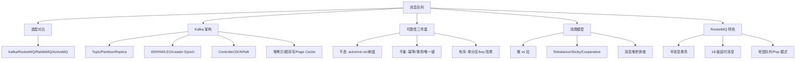

### P0 必背核心

#### 三大 MQ 选型对比（Kafka / RocketMQ / RabbitMQ）
- **Kafka**：吞吐冠军（百万 TPS/单机），延迟数十毫秒，**partition 内顺序**，无原生延时消息（只有定时消息要 KIP-746/外置时间轮），社区最活跃。适合**日志、埋点、流计算、大数据管道**。
- **RocketMQ**：吞吐 10 万级，延迟毫秒级，**支持事务消息（半消息 + 回查）+ 18 级延时消息 + 顺序消息 + 消息过滤**，阿里电商场景孵化。适合**金融、订单、交易**。
- **RabbitMQ**：吞吐万级，延迟微秒级（最低），**Erlang 实现**，路由灵活（4 种 Exchange：direct/topic/fanout/headers），插件丰富（延时 plugin、shovel、federation）。适合**复杂路由、中小型业务、企业内部系统**。
- **ActiveMQ**：JMS 老牌，社区凉了，新项目不选。
- 协议层面：Kafka 用自研二进制协议，RocketMQ 用自研 Remoting，RabbitMQ 用 AMQP 0-9-1，ActiveMQ 兼容 JMS/AMQP/STOMP/MQTT。
- 一句话选型：**埋点流量选 Kafka，订单交易选 RocketMQ，企业总线选 RabbitMQ**。
- 关联题：#1316、#1321、#0064

#### Kafka 整体架构（Broker / Topic / Partition / Replica / ISR）
- **逻辑层**：Topic 是逻辑概念，划分为 N 个 **Partition**（分区）实现水平扩展和并行消费。每个 Partition 是一个**有序、不可变、追加写**的日志（segment 文件）。
- **物理层**：每个 Partition 有 1 个 Leader + N 个 Follower（**Replica 副本**），生产/消费只走 Leader，Follower 异步/同步拉取数据。
- **ISR（In-Sync Replica）**：和 Leader 保持同步的副本集合。Follower 落后 Leader 超过 `replica.lag.time.max.ms`（默认 30s）会被踢出 ISR 进入 OSR。Leader 挂了从 ISR 选新 Leader。
- **HW（High Watermark）**：消费者最多能看到的 offset，等于 **ISR 中所有副本最小的 LEO**。LEO（Log End Offset）是分区下一条待写消息的 offset。
- **Controller**：Broker 中选一个作为 Controller，负责 Leader 选举、分区状态机、Topic 增删。Controller 选举原来靠 ZK 抢临时节点，**KRaft 模式**（Kafka 2.8 引入，3.3 GA，3.5 默认）用 Raft 协议替代 ZK，运维更简单、元数据更快、单集群 partition 数从 20 万扩到百万级。
- 关联题：#0258、#1303、#1304、#1305、#1308

#### Kafka 为什么这么快（5 大杀手锏）
- ① **顺序写磁盘**：Partition 文件追加写，机械盘顺序写可达 600MB/s，比随机写快 6000 倍。
- ② **零拷贝（sendfile）**：传统读文件→用户态→Socket 需 4 次拷贝 + 4 次上下文切换。`sendfile` 直接 DMA 把 PageCache 数据扔到网卡，**2 次拷贝、2 次切换**。Kafka 用 `FileChannel.transferTo`。注意：开启 SSL/消息转换会破坏零拷贝。
- ③ **Page Cache**：消息先写 Page Cache，由 OS 异步刷盘，读多写少时读直接命中 Page Cache 不走磁盘。JVM 堆只存元数据，GC 压力小。
- ④ **批量 + 压缩**：Producer 端用 `batch.size`（默认 16KB） + `linger.ms` 攒批；支持 gzip/snappy/lz4/zstd 压缩，**压缩在 Producer 端做，Broker 不解压直接存，Consumer 端解压**，端到端节省 CPU。
- ⑤ **分区并行**：N 个 partition 同时读写，消费组内 N 个 consumer 并行消费。
- 关联题：#1313、#1306、#0195

#### Kafka 消息可靠性（三个环节都要保证）
- **生产端**：
  - `acks=0`：发了就算成功，最快但可能丢；`acks=1`：Leader 写入就算成功，Leader 宕机切换可能丢；`acks=all`（或 -1）：等 ISR 全部确认。
  - `min.insync.replicas=2`：配合 `acks=all`，ISR 副本数 < 2 时写入抛 `NotEnoughReplicasException`。否则 ISR 只剩 Leader 一个时，`acks=all` 等同于 `acks=1`。
  - `retries=Integer.MAX_VALUE` + `enable.idempotence=true`：开启**幂等 Producer**，Broker 用 (PID, partition, seqNum) 去重，**单分区 Exactly-Once**。
  - 事务 Producer：`transactional.id` + `initTransactions/beginTransaction/commitTransaction`，跨分区原子写。
- **Broker**：`replication.factor=3`、`min.insync.replicas=2`、`unclean.leader.election.enable=false`（禁止非 ISR 副本当 Leader，避免数据丢失）、`log.flush.interval.messages/ms`（默认靠 OS 刷盘，可调）。
- **消费端**：关闭自动提交 `enable.auto.commit=false`，**业务处理成功后手动 `commitSync`**。坑点：自动提交是定时（默认 5s）提交，处理失败也会提交导致丢消息。
- **Kafka 没办法 100% 不丢**：极端场景下 `acks=all + min.isr=2 + 禁止 unclean election` 仍可能丢——比如 ISR 内所有副本同时宕机且 Page Cache 未刷盘。**真要 100% 得同步刷盘**，但性能腰斩。
- 关联题：#1312、#1307、#0092、#0322

#### RocketMQ 消息可靠性
- **生产端**：3 种发送模式——同步（默认，等 SendResult）、异步（回调）、单向（fire-and-forget，不推荐）。失败默认重试 2 次。
- **Broker 端**：`flushDiskType=SYNC_FLUSH` 同步刷盘 vs `ASYNC_FLUSH` 异步刷盘；主从同步用 `brokerRole=SYNC_MASTER`（同步复制）vs `ASYNC_MASTER`。金融级双同步=同步刷盘 + 同步复制。
- **消费端**：消费成功才返回 `CONSUME_SUCCESS`，失败返回 `RECONSUME_LATER`，RocketMQ 把消息发到 **%RETRY%ConsumerGroup** 队列按 18 级延时重试，**16 次失败后进死信队列 %DLQ%ConsumerGroup**。
- 关联题：#0315、#0093

#### 消息重复消费 & 幂等设计
- **MQ 都是 At least once，重复是常态**：网络抖动、消费 ack 丢失、Rebalance 都会重发。
- **幂等四件套**：
  - ① **唯一键去重**：业务表加唯一索引（订单号、流水号），重复插入抛唯一约束异常，业务层 catch 后返回成功。
  - ② **状态机**：订单只能 待支付→已支付→已发货，逆向流转直接拒绝。`UPDATE order SET status='paid' WHERE id=? AND status='unpaid'`，影响行数 0 说明已处理。
  - ③ **Token 机制**：业务前端先申请 token（Redis SETNX），消费时校验 token 存在并删除，类似防重复提交。
  - ④ **分布式锁**：消息 ID 当锁 key 加锁后处理，处理完释放，锁 TTL > 消息处理时长。
- **去重表**：消息消费前查 `msg_consume_log(msg_id)` 表，已存在跳过，处理完插入。和业务表放同库做本地事务防"处理完未记日志"。
- 关联题：#0318、#0303、#1126、#1311

#### 消息顺序性
- **全局顺序**：整个 Topic 只能 **1 个 Partition**，吞吐严重受限，慎用。
- **分区顺序（业务顺序）**：按业务键（如订单号、用户 ID）哈希到同一 partition，**生产者指定 key**，Kafka `DefaultPartitioner` 用 murmur2 哈希。RocketMQ 用 `MessageQueueSelector`，常用 `SelectMessageQueueByHash`。
- **消费端坑**：即使消息按顺序到 Broker，消费者多线程消费仍会乱序。解决：① 单线程消费；② 内存 hash 池——按 key 路由到固定线程（disruptor 思路），同 key 串行、不同 key 并行。
- **场景**：订单状态流转（创建→支付→发货→签收）、binlog 同步、IM 消息。
- 关联题：#1296、#1309、#0140、#0824

#### 消息堆积排查与治理
- **三步定位**：
  - ① **看分区/消费者比例**：Kafka consumer 数 > partition 数没用（多出的 consumer 空闲）；consumer 数 < partition 数则单 consumer 扛多分区。
  - ② **看消费 lag**：`kafka-consumer-groups.sh --describe`，RocketMQ 看控制台堆积量。
  - ③ **看消费耗时**：单条处理 > 100ms 就要怀疑下游慢 SQL/RPC 超时。
- **治理手段**：
  - **临时扩容消费者**（前提：partition 够）；
  - **partition 不够**：临时启个 consumer 把堆积消息转发到新 Topic（partition 翻倍），再起 N 个 consumer 消费新 Topic；
  - **降级**：非核心消息直接丢弃或落库异步处理；
  - **限流**：上游生产端令牌桶限流。
- **预防**：生产端流量预估留 3 倍 buffer，消费端核心业务异步化、批量处理（Kafka 用 `max.poll.records`，一次拉 500 条批量入库 100x 提升）。
- 关联题：#0045、#1231、#0321、#0852

#### RocketMQ 事务消息（半消息 + 本地事务 + 回查）
- **5 步流程**：
  - ① Producer 发**半消息（half message）**到 Broker，写入特殊 Topic `RMQ_SYS_TRANS_HALF_TOPIC`，**对 Consumer 不可见**。
  - ② Broker 返回半消息发送成功。
  - ③ Producer 执行**本地事务**（如扣库存、写订单表）。
  - ④ Producer 根据本地事务结果，向 Broker 发 **commit/rollback** 给半消息盖个章。commit 后消息转到原 Topic，Consumer 可见；rollback 则删除半消息。
  - ⑤ 如果 Producer 宕机、commit/rollback 丢失，Broker 定时（默认 60s）**回查（check）** Producer：实现 `checkLocalTransaction` 接口告诉 Broker 本地事务最终状态。最多回查 15 次。
- **本质**：把"发 MQ + 本地事务"原子化，避免"扣了库存但消息没发"。
- 对比 Kafka 事务消息：Kafka 事务是**跨分区原子写**（用于"消费-处理-生产"原子链路），不是 RocketMQ 这种业务半消息。
- 关联题：#1298、#0673、#1205、#1302

#### Kafka 消费组 Rebalance
- **触发条件**：① 消费者数量变化（加入/退出/崩溃）；② Topic 分区数变化；③ Consumer 心跳超时 `session.timeout.ms`（默认 45s）；④ `max.poll.interval.ms`（默认 5min）内没调 poll。
- **三阶段**：JoinGroup → SyncGroup → 心跳维持，由 **GroupCoordinator**（某个 Broker 角色，按 `__consumer_offsets` 的分区 leader 选出）协调。
- **分配策略**：
  - `RangeAssignor`（默认，按 Topic 范围分，可能不均）；
  - `RoundRobinAssignor`（轮询，相对均匀）；
  - `StickyAssignor`（**黏性分配**：尽可能保持原分配不变，减少抖动）；
  - `CooperativeStickyAssignor`（**渐进式/协作式 Rebalance**，Kafka 2.4+）：把 Stop-The-World 改成增量——只回收要变动的 partition，其他 consumer 不停消费，**避免长时间全组暂停**。
- **Rebalance 的痛**：① STW 期间所有 consumer 停止消费；② 重复消费（partition 易主，offset 未及时提交）；③ 频繁 rebalance 把消费组卡死。**生产强烈推荐 CooperativeStickyAssignor + 合理调大 session.timeout.ms**。
- 关联题：#1310、#1300、#1301、#0281

### P1 加分高频

#### Kafka 高水位 HW 与 Leader Epoch
- **HW = min(ISR.LEO)**：HW 之前的消息所有 ISR 副本都有，可被消费。LEO 是单副本下一条要写的 offset。
- **HW 截断的数据丢失/不一致 Bug**：旧版本 Follower 重启后会先把日志截断到 HW，再向 Leader 拉数据。如果 Leader 也宕机，新 Leader 是旧 Follower，HW 比旧 Leader 小，已提交数据可能丢；或者两副本"分裂"后选出的 Leader 数据更老，造成数据不一致。
- **Leader Epoch（Kafka 0.11+ 引入）**：每次 Leader 变更 epoch +1，Follower 重启时不再无脑按 HW 截断，而是带着自己最后的 epoch 向 Leader 询问 "这个 epoch 的最大 offset 是多少"，按真实数据边界截断。**彻底修复 HW 截断引起的数据丢失/不一致**。
- 关联题：#1305

#### Kafka 数据存储结构
- 每个 Partition 由多个 **Segment 文件**组成，文件名是该 segment 第一条消息的 offset（如 `00000000000000000000.log`）。默认每个 segment 1GB（`log.segment.bytes`）。
- 配套 3 个文件：`.log`（数据） + `.index`（offset 索引，稀疏） + `.timeindex`（时间戳索引）。索引稀疏（默认每 4KB 一条索引），用二分查找定位。
- **过期清理**：① 按时间（`log.retention.hours`，默认 168h）；② 按大小（`log.retention.bytes`）；③ **日志压缩**（`cleanup.policy=compact`）——同 key 只保留最新一条，用于 `__consumer_offsets`、CDC 状态表。
- 关联题：#0195、#0236

#### Kafka 几种选举
- ① **Controller 选举**：Broker 启动时抢 ZK 的 `/controller` 临时节点，谁抢到谁是 Controller（KRaft 模式用 Raft）。
- ② **Partition Leader 选举**：由 Controller 从 ISR 中选第一个（按 AR 顺序），如果 ISR 空：`unclean.leader.election.enable=true` 从 OSR 选（可能丢数据），`false` 则等 ISR 恢复。
- ③ **Consumer GroupCoordinator** 不是选举，而是按 `groupId.hashCode() % 50` 路由到 `__consumer_offsets` 某个 partition 的 leader broker。
- ④ **Consumer Leader**：GroupCoordinator 在 JoinGroup 时把第一个加入的 consumer 选为 leader，由它执行分配算法。
- 关联题：#1308

#### RocketMQ 架构
- **4 大组件**：NameServer（无状态注册中心，Broker 路由表）+ Broker（消息存储，主从）+ Producer + Consumer。NameServer 间**互不通信**，Broker 每 30s 向所有 NameServer 上报心跳。
- **存储模型**：所有 Topic 的消息混合写入 **CommitLog**（顺序写、单文件 1GB）。每个 Topic 的每个 Queue 维护 **ConsumeQueue 索引**（指向 CommitLog 中的 offset），实现"一份数据多份索引"。**IndexFile** 提供按 key 或时间范围查询。
- **集群模式**：① 单 Master（测试）；② 多 Master 无 Slave（可用性 OK 但故障期间消息不可读）；③ 多 Master 多 Slave 异步复制（性能好，有丢消息风险）；④ 多 Master 多 Slave 同步双写（强一致，性能略低）；⑤ DLedger（基于 Raft 自动主从切换，4.5+）。
- 关联题：#1294、#1299、#1295

#### RocketMQ 延时消息
- **18 个延时级别**（默认）：`1s 5s 10s 30s 1m 2m 3m 4m 5m 6m 7m 8m 9m 10m 20m 30m 1h 2h`。
- **实现**：发送时 `msg.setDelayTimeLevel(N)`，Broker 把消息存到 **SCHEDULE_TOPIC_XXXX** 内部 Topic，按延时级别分 18 个队列。后台 `ScheduleMessageService` 定时扫描，到点把消息转回原 Topic。
- **缺点**：只支持固定级别，不支持任意延时。
- **RocketMQ 5.0 任意时长延时**：基于时间轮（TimerWheel），最长 40 天，精度秒级。
- **Kafka 没原生延时消息**：方案——① 死信队列 + TTL；② 自建时间轮（如美团 push 服务）；③ 落库 + 定时扫描。
- 关联题：#1297

#### 死信队列 DLQ
- **定义**：消费失败到达上限后无法被正常消费的消息隔离队列，避免毒消息阻塞消费组。
- **RabbitMQ**：通过 `x-dead-letter-exchange` 和 `x-dead-letter-routing-key` 绑定死信交换机。死信触发条件：消息被 `nack`/`reject` 且 `requeue=false`、消息 TTL 到期、队列长度超限。**常用于实现延时队列**（消息 TTL + DLQ）。
- **RocketMQ**：%DLQ%ConsumerGroup 队列，重试 16 次后自动进入。需要人工干预（修复代码后重发或丢弃）。
- 关联题：#1151

#### 推 vs 拉模式
- **推（Push）**：Broker 主动推给 Consumer。优点：实时性好。缺点：Broker 不知道 Consumer 处理能力，**可能压垮 Consumer**。
- **拉（Pull）**：Consumer 主动拉。优点：Consumer 按自己节奏拉，可控；批量拉吞吐高。缺点：实时性差（轮询间隔）、Consumer 要自己维护 offset。
- **Kafka**：纯拉模式（Consumer poll），用**长轮询（Long Polling）** 弥补实时性——Broker 收到 fetch 请求时如果没消息，会 hold 住直到有数据或超时（`fetch.max.wait.ms` 默认 500ms）。
- **RocketMQ**：本质拉，但 PushConsumer **底层是 Broker 长轮询 + Consumer 内部拉取后回调**，对用户看起来像推。
- **RocketMQ 5.0 Pop 模式**：相对传统的 Push（基于 Queue 绑定 Consumer）模式，**Pop 模式让多个 Consumer 共享 Queue**——Consumer 调 Pop 接口"取消息"，Broker 用消息维度的不可见窗口（invisible time）。优势：① 单 Queue 多 Consumer 并行，**消费能力不再受限于 Queue 数**；② Consumer 宕机不引发 Rebalance。类似 SQS 的可见性超时。
- 关联题：#0873、#1246、#1220

#### RabbitMQ 路由模型
- **AMQP 模型**：Producer → Exchange → (binding) → Queue → Consumer。**Producer 不直接发到 Queue**。
- **4 种 Exchange**：
  - `direct`：精确匹配 routing key（点对点）；
  - `topic`：模糊匹配（`*` 单段、`#` 多段，如 `order.*.created`）；
  - `fanout`：广播到所有绑定 Queue（最快，不解析 key）；
  - `headers`：按消息头匹配（少用）。
- **高可用**：经典镜像队列（已弃用）→ **Quorum Queue**（基于 Raft，3.8+ 推荐）→ Stream（3.9+，类 Kafka）。集群只复制元数据不复制消息，所以镜像队列才有意义。
- 关联题：#1138、#1177、#1115

#### Kafka 为什么需要 Partition
- **Topic 只解决分类**，Partition 解决：① **水平扩展**（多 Broker 分担存储）；② **并行消费**（消费组内每个 partition 由一个 consumer 独占）；③ **顺序保证粒度**（partition 内顺序）。
- 单 Topic 单 Partition 就是 RabbitMQ Queue 的语义，没有并行能力。
- 关联题：#1304

### P2 深度延伸

#### 单分区单 Consumer 如何提吞吐
- ① **批量消费**：`max.poll.records=500` 一次 poll 多条，业务端批量入库/批量调下游。
- ② **异步化**：poll 到的消息扔线程池处理（小心顺序丢失，需要按 key hash 路由线程，且 offset 提交要等所有任务完成）。
- ③ **压缩**：snappy/lz4 减少 IO。
- ④ **批量提交 offset**：减少 commit 开销。
- ⑤ 最终瓶颈在单 partition 的话只能扩 partition。
- 关联题：#0852

#### Kafka 批量消费保不丢
- 默认 poll 到一批后**整批处理完才 commit offset**。坑：批中部分失败，整批回退会重复处理已成功的。
- **解决**：① 业务幂等；② 失败的消息发死信 Topic，成功的整批 commit；③ 用 `commitSync(Map<TopicPartition, OffsetAndMetadata>)` 精细化提交每个 partition 的 offset。
- 关联题：#0321、#0322

#### Kafka 依赖 ZK 做什么 & KRaft 去 ZK
- **ZK 原职责**：① 存元数据（topic、partition、broker、ISR、ACL）；② Controller 选举；③ Broker 注册发现；④ 消费 offset（早期 0.9 之前，后改为 `__consumer_offsets` 内部 Topic）。
- **ZK 痛点**：① 元数据规模大时同步慢，单集群 partition 上限约 20 万；② 部署运维两套系统；③ Controller 启动加载元数据慢（重启分钟级）。
- **KRaft**：Broker 自身组成 Raft 集群（Controller 节点），用 Kafka 的 log 存元数据，**Controller 故障切换 < 1s**，partition 上限百万级，运维一套系统。
- 关联题：#0247

#### MQ 选型陷阱
- ① RocketMQ 削峰**不是万能**：消费端处理能力跟不上，消息堆积一样会拖垮下游。削峰本质是把"瞬时高峰"变成"长尾平稳"，下游平均处理能力得 ≥ 平均流量。
- ② BlockingQueue 为什么不能当 MQ：进程内、不持久化、宕机数据全丢、不能跨服务、不支持订阅广播。
- ③ Kafka 不能 100% 不丢的极端场景：参考 P0 章节，本质是 PageCache 异步刷盘 + ISR 副本可能同时宕机。要 100% 得同步刷盘 + 跨可用区副本。
- 关联题：#1231、#1128、#1307

#### TCP 长连接与心跳
- Kafka/RocketMQ 都用 TCP 长连接 + 心跳保活。心跳超时（Kafka `session.timeout.ms` 默认 45s）触发 Rebalance；`max.poll.interval.ms` 是处理消息的最长间隔（默认 5min），如果业务太慢超过这个时间，consumer 会被踢出消费组（**真正的 Rebalance 大杀器**）。
- 处理慢的优化：① 业务异步化；② 调大 `max.poll.interval.ms`；③ 降低 `max.poll.records`（每批少点）。

### P3 冷门刁钻

#### Kafka 的 Exactly Once Semantics（EOS）
- **要凑齐三件套**：① Producer `enable.idempotence=true`（去重）；② Producer 用事务 `transactional.id`；③ Consumer `isolation.level=read_committed`（只读已提交事务消息）+ 手动提交 offset 在事务内。
- 经典链路：**消费-处理-生产** 闭环（如流计算 Kafka Streams），消费 offset 提交和下游写入在一个事务里。
- 关联题：#1311

#### RocketMQ 重平衡和 Kafka 的区别
- RocketMQ Rebalance **每个 Consumer 客户端独立计算分配**（拿到所有 Consumer 列表 + Queue 列表后本地算），不依赖中心 Coordinator。
- 隐患：网络不一致导致每个 Consumer 算出的分配不一样，可能短暂多消费或漏消费。
- Kafka 由 GroupCoordinator 统一分配，强一致。
- 关联题：#0281

#### RabbitMQ 消费端限流
- `channel.basicQos(prefetchCount=N)`：Consumer 未 ack 的消息数 ≤ N 才会推下一条，**反压**机制。
- prefetchCount 设太大失去限流意义，设太小 IO 频繁。生产经验 50-100。
- 关联题：#0295

#### RabbitMQ 防重复消费
- 业务幂等是根本（同 Kafka 章节）。RabbitMQ 自身不提供 message id 唯一性保证，需要业务自带唯一键。
- `manual ack` + 处理完再 ack；ack 之前宕机消息会被 redeliver。
- 关联题：#1126

#### RabbitMQ 事务 vs Confirm
- AMQP 原生事务（txSelect/txCommit）**性能极差**（同步阻塞，吞吐降 10 倍）。
- 推荐 **Publisher Confirm 模式**：异步 ack/nack 回调，吞吐高。
- 关联题：#1100

### 跨模块联想

- 消息可靠性 ↔ **09 分布式事务**：本地消息表 + 定时扫描发 MQ、RocketMQ 事务消息是两套"最终一致性"主流方案。
- 幂等设计 ↔ **10 分布式锁**：消息幂等的"分布式锁兜底"方案、唯一 ID 生成。
- 顺序消费 ↔ **03 并发**：disruptor、按 key 哈希到固定线程的思路。
- Kafka Page Cache + 零拷贝 ↔ **13 网络与操作系统**：sendfile、mmap、用户态/内核态切换。
- ISR/HW ↔ **08 分布式**：Raft、PacificA 副本一致性协议。
- 消息堆积 ↔ **16 性能调优**：消费端 CPU/IO 分析、批量优化思路。
- RocketMQ 选型 ↔ **14 系统设计**：秒杀削峰、订单异步化、最终一致性。

---

## 08 微服务与分布式

> 模块定位：架构岗必考。核心是**注册发现 + RPC + 熔断限流降级 + 链路追踪 + 配置中心 + 服务治理**七件套。58 题。
> 题量：58 题。

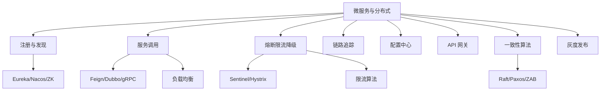

### P0 必背核心

#### 服务注册与发现
- **角色**：服务提供方启动时向注册中心注册（IP+端口+元数据），消费方从注册中心订阅并缓存服务列表，提供方下线/心跳超时则注销。
- **Eureka（AP）**：客户端拉取注册表（默认 30s），服务端 self-preservation 模式（< 85% 心跳率触发，宁可保留过期实例也不大批量摘除），Netflix 已停止迭代。
- **Nacos**：AP/CP 可切换，临时实例（默认）走 Distro 协议 AP，永久实例走 Raft CP；配置 + 注册二合一。
- **Zookeeper（CP）**：临时节点 + Watch，ZAB 协议保证一致性；Leader 选举期间不可用，互联网场景多数选 AP。
- **Consul**：基于 Raft（CP），健康检查比 Eureka 更强（支持 HTTP/TCP/脚本）。
- 关联题：#0249

#### 服务调用（Feign / Dubbo / gRPC）
- **OpenFeign**：声明式 HTTP 客户端，原理 = 动态代理 + RestTemplate（已替换为 Spring Cloud LoadBalancer + WebClient）。注解 `@FeignClient(name="user-service")`，方法签名同 Controller。
- **Feign 调用流程**：① 启动扫 `@FeignClient` 注解生成代理 Bean；② 调用时根据 contract 解析方法签名构造 HTTP 请求；③ Ribbon/LoadBalancer 拿服务列表选实例；④ 编码 → 发起 HTTP；⑤ 解码返回。
- **Dubbo**：基于 TCP 二进制协议（Dubbo 协议）的高性能 RPC，性能优于 HTTP；Dubbo 3 支持 Triple 协议（基于 gRPC，HTTP/2）。
- **gRPC**：Google 出品，基于 HTTP/2 + Protobuf，跨语言、强类型 IDL、流式调用（单向/服务端流/客户端流/双向流）。
- **同步 vs 异步**：Feign 默认同步阻塞；CompletableFuture/Reactive 风格异步可减少线程占用。
- 关联题：#0249

#### 负载均衡算法
- **客户端 vs 服务端**：Ribbon/LoadBalancer 客户端；Nginx/HAProxy 服务端。
- **轮询 RR**：均匀分发，简单但忽略机器性能差异。
- **加权轮询 WRR**：按机器配置加权（Nginx 默认）。
- **最少连接 LeastConn**：连接数最少的实例（适合长请求差异大场景）。
- **一致性 Hash**：同 key 总落同实例（适合有状态服务、缓存路由）；虚拟节点解决倾斜。
- **随机 / 加权随机**：实现简单，足够大量请求趋近均匀。
- **响应时间加权（Dubbo LeastActive）**：活跃调用数最少的，自动避开慢节点。
- 关联题：#0249

#### 熔断（Sentinel / Hystrix / Resilience4j）
- **三态状态机**：CLOSED（正常）→ OPEN（熔断，请求直接 fast-fail）→ HALF_OPEN（试探放行，成功转 CLOSED 失败回 OPEN）。
- **触发条件**：错误率超阈值（如 50%）或慢请求比例超阈值（响应时间 > T 的占比）。
- **Sentinel（阿里）**：流控 + 熔断 + 系统自适应保护；支持热点参数限流（同方法不同参数限流），基于滑动窗口 LeapArray。
- **Hystrix（Netflix）**：已停更，线程池隔离 + 信号量隔离，熔断 + Fallback；Resilience4j 是其精神继任者。
- **降级**：熔断后走 Fallback 返回兜底（缓存数据、空集合、托底页）。
- 关联题：#0004、#0249

#### 限流算法
- **计数器**：单位时间窗口内的请求数；缺点：窗口切换时可能瞬时双倍。
- **滑动窗口**：把窗口切成多个小段，记录每段请求数；平滑了边界。Sentinel 默认。
- **令牌桶**：以恒定速率往桶里放令牌，请求要拿令牌；允许突发（桶里积压的令牌一次放出）。Guava RateLimiter。
- **漏桶**：请求恒定速率出桶，超出溢出丢弃；不允许突发，平滑流量。Nginx limit_req。
- **分布式限流**：Redis + Lua 实现令牌桶/计数器；Sentinel 集群模式。
- 关联题：#0249

#### 服务雪崩与隔离
- **雪崩原理**：服务 A 调 B，B 慢/挂导致 A 线程被打满，A 也不可用，连锁失败。
- **隔离方式**：① **线程池隔离**（Hystrix 每个依赖一个池，独立 + 队列）开销大但隔离彻底；② **信号量隔离**（计数器限并发数）轻量但同线程；③ **服务隔离**（核心非核心拆服务、拆机房）。
- **链路保护组合拳**：限流（入口拦） + 熔断（下游挂时 fast-fail） + 降级（兜底响应） + 隔离（资源隔离） + 超时（必加 timeout）。
- 关联题：#0004

#### 链路追踪（SkyWalking / Zipkin / OpenTelemetry）
- **三元组**：TraceId（一条完整链路 ID）、SpanId（一个调用单元）、ParentSpanId（父调用）。
- **跨进程透传**：通过 HTTP Header / Dubbo Attachment 把 TraceId 透传下去；线程间用 MDC + TransmittableThreadLocal。
- **SkyWalking**：apache 顶级项目，**字节码增强**自动埋点，无侵入；告警、拓扑图、性能分析强。
- **Zipkin**：Twitter 出品，简单轻量，需要手动埋点或 Spring Sleuth 集成。
- **OpenTelemetry**：CNCF 标准，统一指标 + 日志 + 追踪三件套，正在替代 OpenTracing。
- 关联题：#0249

#### 配置中心
- **Apollo（携程）**：推拉结合（长连接推 + 客户端定时拉），多环境、多集群、灰度、权限审计强；最重但功能最全。
- **Nacos**：配置 + 注册二合一，**长轮询**（hold 住 29.5s，有变化立即返回），轻量易用，国内主流。
- **SpringCloud Config**：基于 Git/SVN 拉取，配合 Bus + RabbitMQ/Kafka 广播刷新；功能弱，Spring 官方已转向 Config Tree。
- **Zookeeper / etcd**：Watch 机制天然适合配置变更推送，K8s 用 etcd。
- 关联题：#0249

#### API 网关
- **职责**：统一入口、路由转发、鉴权、限流、熔断、日志、灰度、协议转换。
- **Spring Cloud Gateway**：基于 Netty + Reactor 非阻塞，Predicate + Filter 模型；替代了 Zuul 1（阻塞 IO）。
- **Zuul 1 vs Zuul 2**：1 是 Servlet 阻塞，2 是 Netty 非阻塞但社区不活跃。
- **Apisix / Kong**：基于 Nginx + Lua + etcd，性能极强，插件丰富，云原生主流。
- **Nginx + OpenResty**：用 Lua 写逻辑，灵活但运维成本高。
- 关联题：#0249

### P1 加分高频

#### 一致性算法（Raft / Paxos / ZAB）
- **Paxos**：分布式共识算法的鼻祖，理论强、实现难。
- **Raft**：工程版 Paxos，强调可理解性；分 3 角色 Leader/Follower/Candidate；分 Leader 选举 + 日志复制 + 安全性。etcd、Consul、Nacos CP 模式都用 Raft。
- **ZAB（ZK Atomic Broadcast）**：ZooKeeper 用，与 Raft 类似但加了 Epoch 概念；分崩溃恢复 + 消息广播两阶段。
- **共同点**：Leader 单写 + 多数派提交（quorum） + 日志复制 + 故障切换。
- **不同**：Paxos 抽象、Raft 工程化、ZAB 是 ZK 专属变体。
- 关联题：#0249

#### CAP / BASE / PACELC
- **CAP**：分布式系统三选二（**一致性 C、可用性 A、分区容忍性 P**）。**P 是必须**（网络分区一定会发生），实际是 CP 或 AP 二选一。
- **CP**：宁可不可用也要一致（ZK、etcd、HBase）。
- **AP**：宁可不一致也要可用（Eureka、Cassandra、DynamoDB）。
- **BASE**：基本可用（Basically Available）、软状态（Soft state）、最终一致性（Eventually consistent）——AP 系统的理论基础。
- **PACELC**：CAP 扩展。在 P 分区时是 A 还是 C；E 没分区时是延迟 L 还是 C。
- 关联题：#0249

#### 幂等设计
- **场景**：网络抖动重试、消息重投、用户重复点击。
- **方案**：① **唯一索引**（最简单，DB 兜底）；② **Token 令牌**（请求前申请 Token，提交时校验删除）；③ **状态机**（订单 待支付→已支付，只能单向转）；④ **乐观锁 version**；⑤ **分布式锁**（耗资源，慎用）；⑥ **去重表**（用业务流水号建表，唯一索引兜底）。
- **本质**：找一个**业务唯一键**（订单号、流水号、用户 ID + 业务类型），第一次写入产生记录，第二次相同键查到记录直接返回结果。
- 关联题：#0249

#### 灰度发布 / 金丝雀
- **按比例**：流量按权重打到新版本（10% → 30% → 100%），新版本异常立即回滚。
- **按用户**：用户 ID 哈希 / 内部员工 / 白名单 / 地域 → 走新版本。
- **按 Header**：调试灰度，特定 Header 走新版本，APP 端开关。
- **蓝绿部署**：两套环境瞬时切换（DNS / LB），回滚快但要双倍资源。
- **滚动更新**：K8s Deployment 默认，逐 Pod 替换。
- 关联题：#0249

#### 微服务拆分原则
- **业务边界**：康威定律——系统结构反映组织结构。按业务子域（DDD 限界上下文）拆。
- **单一职责**：一个服务负责一个业务能力（订单、支付、用户、商品）。
- **数据自治**：每个服务管自己的数据库，不允许跨服务直连别人的库（必须 API 调）。
- **粒度**：不要过细（性能 + 运维复杂度爆炸），也不要过粗（成了"分布式单体"）。
- **拆分时机**：单体已经成为瓶颈（团队协作、部署频率、技术栈多样化）才拆，不要一开始就微服务。
- 关联题：#0249

#### 服务监控指标
- **业务指标**：QPS、TPS、错误率、成功率、各接口 RT。
- **资源指标**：CPU、内存、磁盘 IO、网络带宽。
- **JVM 指标**：堆 / 老年代占用、YGC FGC 频率耗时、线程数。
- **中间件**：DB 连接池占用、Redis 命中率、MQ 堆积。
- **黄金 4 指标（Google SRE）**：延迟、流量、错误率、饱和度。
- 关联题：#0249

#### Service Mesh / Istio
- **概念**：把服务通信能力（负载均衡、熔断、追踪、加密）下沉到 Sidecar 代理（如 Envoy），业务代码无感。
- **架构**：Sidecar 数据面（每 Pod 旁挂 Envoy） + 控制面（Istio 配置下发）。
- **优势**：跨语言（业务可任意语言）、运维统一、平滑升级。
- **劣势**：增加一跳网络开销、复杂度高、运维门槛。
- **国内现状**：大厂自研（蚂蚁 Mosn、字节 ByteMesh），中小厂多观望或仍用 Spring Cloud。
- 关联题：#0249

### P2 深度延伸

#### Sentinel 与 Hystrix 详细对比
- **隔离**：Hystrix 主推线程池隔离开销大；Sentinel 信号量 + 系统自适应保护更轻。
- **限流**：Hystrix 无内置限流；Sentinel 全套（QPS、并发数、热点参数、关联流控、链路流控）。
- **熔断**：都基于错误率 / RT；Sentinel 还支持基于异常数。
- **规则配置**：Hystrix 注解硬编码；Sentinel 控制台动态推送规则到客户端。
- **集成**：Sentinel 与 Dubbo/Feign/SpringWebFlux/SQL/gRPC 都有适配。

#### 熔断算法细节
- **错误率窗口**：滑动窗口（如 1 分钟），统计总请求数和错误数。
- **半开试探**：熔断 N 秒后，下一个请求放过去做试探，成功才转 CLOSED。
- **慢调用比例**：RT > T 的请求占比超阈值（如 50%）也触发熔断。
- **Sentinel 三种熔断策略**：慢调用比例、异常比例、异常数。

#### Raft 详细流程
- **Leader 选举**：① 启动 Follower 状态，等心跳超时（150-300ms 随机）；② 超时变 Candidate，自增 term 投自己并广播 RequestVote；③ 收到多数派同意成 Leader；④ Leader 定期发心跳 AppendEntries。
- **日志复制**：① Client 发请求到 Leader；② Leader 加日志到本地 + 并行 AppendEntries 到 Follower；③ 多数派回复成功后 commit 并 apply 到状态机；④ Leader 通知 Client。
- **脑裂防护**：term 单调递增，旧 Leader 收到更大 term 自动降级为 Follower。

#### 服务发现的最终一致性挑战
- 服务下线 → 注册中心摘除 → 消费者拉取 / 推送 → 本地缓存更新，这是一个有延迟的过程。
- **优雅下线**：① 通知注册中心 → ② 等待消费者感知（如 10-30 秒）→ ③ 拒绝新请求但继续处理在飞请求 → ④ 等所有请求完成 → ⑤ 真正关闭。Spring Boot Actuator `/actuator/shutdown`、K8s `preStop` Hook。
- **客户端容错**：调用失败时重试 / 切换实例，配合健康检查。

#### Sidecar 模式
- 把横切关注点（日志、配置、监控、加密）下沉到独立进程（与业务进程共享 Pod / 同主机）。
- Istio 的 Envoy 是典型 Sidecar；K8s Init Container 也是 Sidecar 思想。

### P3 冷门刁钻

#### BFF（Backend For Frontend）
- 为不同前端（Web / iOS / Android）定制一层后端聚合层，简化前端调用、聚合多个微服务、做协议转换。
- 缺点：维护成本高、容易演变成"业务后端的胶水层"。

#### 服务网格的下一代：Ambient Mesh
- Istio 2023 新方案，**去 Sidecar**，用 ztunnel + waypoint 代理，资源占用更低。

#### 微服务反模式
- **分布式单体**：服务拆了但部署/发布仍要一起上，没解耦。
- **共享数据库**：多个服务读同一个表，耦合死，拆分名存实亡。
- **过度拆分**：服务太细，调用链 10+，性能 + 复杂度爆炸。
- **网状调用**：A→B→C→A 循环调，靠链路追踪发现。

#### Saga vs TCC vs 本地消息表
- 见 09_分布式事务，本节略。

### 跨模块联想

- 注册发现 ↔ **12 其他中间件**：Nacos/ZK 既是注册中心又是配置中心。
- 熔断限流 ↔ **15 业务场景**：秒杀、大促必备组合拳。
- 链路追踪 ↔ **16 性能调优**：定位慢接口首选 SkyWalking 看链路。
- 一致性算法 ↔ **05 MySQL**：MGR 用 Paxos 变体；从库回放也类似复制状态机。
- 限流 ↔ **06 Redis**：Redis + Lua 实现分布式令牌桶。
- 服务调用 ↔ **03 并发**：Feign 异步用 CompletableFuture、虚拟线程做高并发网关。
- 灰度 ↔ **19 工具与工程**：K8s Deployment 滚动更新、Argo Rollouts 精细化灰度。
- 微服务拆分 ↔ **22 面经**：面试讲项目必聊为啥这么拆、踩过什么坑。

---

## 09 分布式事务

> 模块定位：微服务架构落地的"必经之痛"，**金融/电商必考**。重点是 **CAP/BASE 理论 + 2PC/3PC/TCC/Saga/本地消息表/事务消息六大方案 + Seata 4 模式（AT/TCC/Saga/XA）**。
> 题量：25 题。

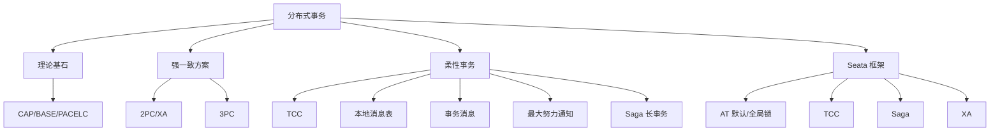

### P0 必背核心

#### 为什么分布式事务难（CAP & BASE）
- **CAP 定理**：分布式系统中 **一致性 C（Consistency）+ 可用性 A（Availability）+ 分区容错性 P（Partition Tolerance）三选二**。网络分区一定存在（P 不可舍），所以实际是 **CP（如 ZK、etcd）或 AP（如 Eureka、Cassandra）二选一**。
- **PACELC**：CAP 升级版——分区时（P）在 C 和 A 间选，**没分区时（E）也要在延迟（L）和一致性（C）间选**。例：MySQL 主从是 PC+EC，Cassandra 是 PA+EL。
- **BASE 理论**：**Basically Available（基本可用）+ Soft state（软状态/中间态可见）+ Eventually consistent（最终一致性）**。是对 CAP 中 AP 的工程实现思路——**用最终一致性换可用性**。
- **柔性事务 = BASE 实现** vs 刚性事务 = ACID（强一致、单库本地事务）。分布式系统几乎都走柔性事务。
- 关联题：#0964、#0931

#### 2PC（两阶段提交 / XA）
- **角色**：协调者（TM）+ 多个参与者（RM/资源管理器，通常是 DB）。
- **两阶段**：
  - **Prepare 阶段**：TM 问所有 RM "能不能提交？" RM 执行 SQL（加锁、写 undo/redo log）但**不真正 commit**，返回 yes/no。
  - **Commit 阶段**：所有 RM 都 yes 则 TM 发 commit，否则发 rollback。
- **致命缺陷**：
  - ① **同步阻塞**：Prepare 后到 Commit 期间，RM 持有锁等待，性能差；
  - ② **协调者单点**：TM 在 Commit 阶段宕机，部分 RM 收到 commit 部分没收到，**数据不一致**；
  - ③ **网络问题不可解决**：协调者发了 commit 但 RM 没收到也不会主动回滚。
- **XA 协议**：Oracle/MySQL InnoDB（5.7+ 支持 `XA START/PREPARE/COMMIT`）都实现了 XA 接口。MySQL XA 性能比本地事务差 10 倍以上，**金融以外不推荐**。
- 关联题：#0154、#0273、#0130

#### 3PC（三阶段提交）
- **改进 2PC 的两个问题**：① 协调者和参与者**都加超时**；② Prepare 拆成 **CanCommit + PreCommit**。
- **三阶段**：
  - **CanCommit**：TM 问 RM 是否能提交（不加锁不执行 SQL，只检查），快速失败；
  - **PreCommit**：RM 真正执行事务但不 commit（类似 2PC Prepare）；
  - **DoCommit**：所有都 OK 才 commit。
- **超时机制**：参与者在 PreCommit 后如果超时收不到 DoCommit，**默认 commit**（猜测 TM 应该让 commit）。
- **仍然不一致**：如果 TM 决定 rollback 但消息丢失，参与者超时后自动 commit 反而错。3PC 减少了阻塞但**没根本解决一致性**，实际工业很少用。
- 关联题：#0153

#### TCC（Try-Confirm-Cancel）
- **业务层 2PC**：把每个分支事务拆成三个接口：
  - **Try**：预留资源（如冻结余额、预扣库存）；
  - **Confirm**：真正提交（扣减冻结的余额、扣减预扣库存）。必须幂等；
  - **Cancel**：释放预留（解冻余额、归还库存）。必须幂等。
- **全部 Try 成功 → 全部 Confirm；任一 Try 失败 → 全部 Cancel**。
- **三大坑**：
  - ① **空回滚**：Try 没执行（网络丢包），但 Cancel 被调用。**解决**：事务表记录事务状态，Cancel 时发现没 Try 记录直接成功返回；
  - ② **悬挂**：Cancel 比 Try 先到（Try 因网络延迟卡住后才到），Cancel 完成后 Try 才到，资源被锁住但永远没人 Confirm/Cancel。**解决**：Try 前检查事务表里是否已 Cancel 过，是则直接拒绝；
  - ③ **幂等**：Confirm/Cancel 可能被重试多次。**解决**：事务状态机 + 全局事务 ID 去重。
- **特点**：**业务侵入大**（每个接口写三遍），但**性能好**（无 DB 锁）、**一致性强**（业务层保证）。适合**资金类、对一致性要求极高**的场景。
- 关联题：#0130、#0132、#0225、#1118

#### 本地消息表
- **核心思想**：业务表 + 消息表**同库**，借助本地事务的 ACID 保证"业务执行 + 消息记录"原子性。
- **流程**：
  - ① 业务库开启事务：执行业务 SQL + 插入消息表（status=待发送），一起 commit；
  - ② 后台定时任务扫描消息表 status=待发送，发到 MQ；
  - ③ MQ 投递给下游消费，消费成功后下游回调上游标记消息表 status=已完成（或下游写自己的消息表 + 回 ack）。
- **优点**：实现简单，依赖通用 DB + MQ，无侵入。
- **缺点**：① **消息表给业务库加压力**；② 消息表的扫描有延迟（**最终一致性，秒级延迟**）；③ 下游失败的话上游无法直接回滚——需要业务级补偿。
- 下游失败上游怎么办？通常**让消费方一直重试**（接口幂等），不行就走死信队列人工介入；真要回滚走另一条"反向消息"链路触发上游补偿。
- 关联题：#0239、#0240、#0256

#### 事务消息（RocketMQ 半消息）
- **流程**：见 07 模块。Producer 发**半消息** → 执行本地事务 → 发 commit/rollback → Broker **定时回查**最多 15 次。
- **本质**：把"扣库存 + 发消息"两个操作做成可达的最终一致——回查机制兜底，要么消息最终可见、要么半消息被删除。
- **vs 本地消息表**：
  - 事务消息**不需要消息表**，Broker 帮你扛了；
  - 但需要 MQ 支持（RocketMQ 原生，Kafka 也支持但语义不同，**Kafka 事务是跨分区原子写**，不是业务半消息）；
  - 还需要实现回查接口，对老业务接入有改造成本。
- **Kafka 事务消息**：靠 `transactional.id` + 事务协调器 + 控制消息（commit marker），实现**消费-处理-生产** 跨 Topic 跨 Partition 原子。**不能用于"本地事务 + 发消息"原子**这种业务场景。
- 关联题：#1298、#0673、#0930、#1205、#1302

#### 最大努力通知
- **场景**：跨系统、可容忍最终不一致（如支付完成通知商户）。
- **核心**：发送方按**递增间隔重试 N 次**（如 1m, 5m, 30m, 2h, 6h, 24h），接收方提供幂等接口，达到最大次数仍失败则放弃（或转人工）。
- **vs 本地消息表**：最大努力通知**不保证最终一致**（可能放弃），本地消息表保证。最大努力通知**没有补偿动作**，业务上接受丢失（极少数）。
- **典型实现**：定时任务扫表 + HTTP 回调 + 重试次数 + 状态机。
- 关联题：#0904、#0891

#### Saga（长事务）
- **场景**：耗时长（小时/天）的业务流程，如旅游订单（订机票+酒店+租车）。
- **核心**：把长事务拆成 N 个本地事务 T1, T2, ..., Tn，每个都配一个**补偿操作 C1, C2, ..., Cn**。**正向链全部成功则提交；中间失败则按相反顺序执行已完成步骤的补偿**。
- **两种模式**：
  - **编排式（Orchestration）**：有中央调度器（如 Saga 状态机引擎），明确控制流程；
  - **协同式（Choreography）**：靠事件驱动，每个服务收到事件后执行下一步，无中央调度。
- **vs TCC**：
  - TCC 是 "**预留 + 提交/回滚**"，有 Try 阶段的资源锁定；
  - Saga 是 "**直接做 + 补偿撤销**"，没有锁，**中间状态对外可见**（弱一致）；
- **挑战**：补偿要业务幂等、不能补偿的操作（如发邮件）需要"无影响补偿"或前置校验、并发场景的脏读。
- 关联题：#0131、#0133

#### Seata 整体架构（核心 4 模式）
- **3 大角色**：**TC（Transaction Coordinator，事务协调器，独立部署的 Seata Server）+ TM（事务管理器，开启/提交/回滚全局事务的客户端）+ RM（资源管理器，分支事务客户端）**。
- **4 种模式**：
  - **AT 模式（默认，无侵入）**：业务代码加 `@GlobalTransactional` 即可，无需改 SQL。原理：拦截 SQL，**一阶段：执行业务 SQL + 生成 undo log（前后镜像）保存到 undo_log 表**；**二阶段：全局提交时异步删 undo log，全局回滚时按 undo log 反向 SQL 恢复**。靠**全局锁**防脏写。
  - **TCC 模式**：手写 Try/Confirm/Cancel 三个接口，Seata 负责调度。性能最好但侵入大。
  - **Saga 模式**：基于状态机引擎，适合长事务和异构系统集成。
  - **XA 模式**：基于 XA 协议，依赖 DB 的 XA 支持，强一致但性能差。
- **存储**：TC 用 file/db/redis 存全局事务状态。生产推荐 db。
- 关联题：#1194、#0133

#### Seata AT 模式实现原理
- **一阶段**：
  - ① 拦截业务 SQL，**解析出修改前后的镜像**（before/after image），存 `undo_log` 表（和业务表同库）；
  - ② 注册分支事务到 TC，**申请全局锁**（按行加，key 是 "表名 + 主键"）；
  - ③ 提交本地事务（业务 SQL + undo_log 一起 commit），**释放本地锁**但**保留全局锁**。
- **二阶段（commit）**：TC 通知所有 RM 删除 undo_log + 释放全局锁。**异步执行**，性能好。
- **二阶段（rollback）**：TC 通知所有 RM **按 undo_log 反向 SQL 恢复数据**，同时**校验当前数据与 after image 是否一致**（不一致说明被其他事务改过，**抛异常需要人工介入**），最后删 undo_log 释放全局锁。
- **AT vs XA**：
  - XA 一阶段不 commit（DB 持锁阻塞），AT 一阶段 commit（**只持 Seata 全局锁，不持 DB 锁**），并发好；
  - XA 强一致（永不脏读）、AT 是**读已提交隔离级别**，存在中间状态可见。
- 关联题：#0067、#1061

#### Seata AT 脏读问题
- AT 一阶段已经 commit 本地事务，**其他事务能读到这个"未全局提交"的中间状态** → 脏读？
- **解决**：默认隔离级别是 Read Uncommitted，可能脏读但不脏写（全局锁防脏写）。
- 要防脏读：用 `SELECT FOR UPDATE` 走 AT 代理，会**强制查询去 TC 申请全局锁**，确保读到的是已全局提交的数据。性能下降，**默认不开**。
- 关联题：#0656

### P1 加分高频

#### 柔性事务 4 种典型方案对比

| 方案 | 一致性 | 业务侵入 | 性能 | 复杂度 | 适用场景 |
|---|---|---|---|---|---|
| TCC | 最终一致（强） | 大（写 3 接口） | 高 | 高 | 资金、库存 |
| 本地消息表 | 最终一致 | 中（加消息表） | 中 | 中 | 通用异步通知 |
| 事务消息 | 最终一致 | 中（实现回查） | 高 | 中 | RocketMQ 生态 |
| 最大努力通知 | 最终一致（可能丢） | 小 | 高 | 低 | 跨系统非核心通知 |

- 关联题：#0891、#0931

#### TCC Confirm/Cancel 失败怎么办
- **必须保证 Confirm/Cancel 最终成功**——失败就一直重试。
- **持续重试 N 次仍失败**：① 转告警 + 人工介入；② 死信表（事务表里 status=needs_attention）；③ 业务上要支持"对账"——定时跑对账脚本核对状态。
- 经典惨案：Try 成功了但 Confirm 一直失败（如下游 DB 挂了好几小时），用户资源永久冻结。
- 关联题：#1118

#### 2PC vs TCC 区别
- 层次：2PC 是 **DB/资源层**协议（XA），TCC 是**业务层**自实现协议。
- 锁：2PC 持 DB 锁阻塞，TCC 用业务"预留状态"代替锁。
- 灵活性：2PC 通用但黑盒（DB 实现），TCC 业务侵入但完全可控。
- 性能：TCC 远好于 2PC（无 DB 锁阻塞）。
- 关联题：#0130

#### Seata 4 模式选型
- **AT**：99% 通用场景，业务侵入零，**首选**。要求 DB 支持事务（MySQL InnoDB/Oracle/PostgreSQL）。
- **TCC**：性能极高 / DB 不支持 ACID / 跨服务非 DB 资源（如 Redis 扣减）。
- **Saga**：业务流程长（小时级）、涉及外部系统（无法回滚的）。
- **XA**：DB 强一致要求 + 能接受性能损失（金融对账系统等）。
- 关联题：#0133

### P2 深度延伸

#### 基于 MQ 实现分布式事务（最常见落地）
- **方案 1：本地消息表 + MQ**（前文已述）。
- **方案 2：RocketMQ 事务消息**（前文已述）。
- **方案 3：异步确保型** = "下单库本地事务里发消息，下游消费幂等"，无半消息支撑，但配合**死信 + 人工对账**也能跑。
- 关联题：#0930

#### RocketMQ 事务消息 vs Kafka 事务消息
- **RocketMQ**：业务半消息 + 本地事务 + 回查，**解决业务原子性**（一个本地事务 + 一条 MQ 消息）。
- **Kafka**：Producer 事务跨分区原子写 + Consumer `read_committed`，**解决流处理原子性**（消费 A 处理后写到 B 和 C，原子可见）。
- **场景完全不一样**，面试官最爱挖这个对比。
- 关联题：#1205

#### 本地消息表如何回滚上游
- 设计上**默认下游会成功**，下游失败时：
  - ① 如果是业务异常（参数错误），**调用方发反向消息**通知上游补偿（如：上游扣款了，下游下单失败，上游发一条"反向退款"消息触发自己退款）；
  - ② 如果是技术异常（超时），消费方持续重试（间隔指数退避）；
  - ③ 最终重试失败转死信 + 告警，人工介入。
- 关键：上游业务接口**要预先设计补偿接口**，本地消息表方案不能"自动回滚"。
- 关联题：#0240

#### 柔性事务 vs 刚性事务
- **刚性事务**：ACID，强一致，单库或 XA。**全程加锁、同步阻塞**。适合传统单体应用。
- **柔性事务**：BASE，最终一致，无锁/弱锁。**异步、可补偿**。适合微服务、跨数据中心。
- 关联题：#0931

### P3 冷门刁钻

#### 为什么大厂很少用 XA
- 性能差（持锁等所有节点 prepare）、协调者单点风险、DB 主从复制对 XA 支持差（XA 事务可能在 slave 上看不到一致状态）。互联网大厂偏好 AT/TCC/本地消息表。

#### Seata AT 模式的 SQL 限制
- 只支持单 SQL（不支持存储过程、嵌套查询）、不支持 `INSERT ON DUPLICATE KEY UPDATE` 中间版本（新版已支持）、不支持联合主键的某些场景。复杂 SQL 需要降级到手写 TCC。

#### 2PC 协调者宕机后参与者怎么办
- 在 Prepare 后等 Commit 期间，TM 宕机：参与者**只能等 TM 恢复**（标准 2PC 没有超时机制）。**3PC 才加的超时**。这就是 2PC "同步阻塞 + 协调者单点"的核心痛点。
- 工业实践：TC 高可用（如 Seata Server 集群）。
- 关联题：#0154

### 跨模块联想

- 事务消息 ↔ **07 消息队列**：RocketMQ 半消息流程、Kafka 事务 Producer。
- 本地消息表 ↔ **05 MySQL**：本地事务、ACID、redo/undo log。
- BASE/CAP ↔ **08 分布式 & 14 系统设计**：注册中心选型（CP/AP）、配置中心一致性。
- Seata 全局锁 ↔ **10 分布式锁**：行级锁竞争、死锁检测。
- TCC 幂等 ↔ **07 消息队列**：消息幂等、唯一键设计。
- Saga 状态机 ↔ **20 任务调度**：长流程编排引擎。

---

## 10 分布式锁与ID

> 模块定位：分布式必考。锁解决"多节点并发竞争"，ID 解决"全局唯一标识"。43 题。
> 题量：43 题。

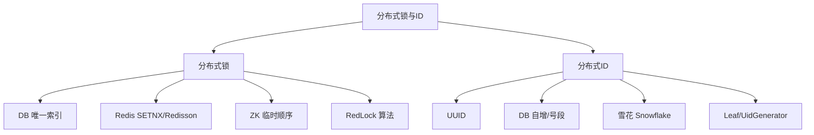

### P0 必背核心

#### 分布式锁的本质需求
- **互斥性**：同一时刻只有一个客户端持有锁。
- **避免死锁**：客户端异常退出不能导致锁永久无法释放（必须有超时）。
- **容错性**：锁服务挂了不能让整个系统挂；多副本部署。
- **可重入**：同一线程多次获取同一把锁不会死锁（递归调用、嵌套事务）。
- **公平/非公平**：是否按申请顺序拿锁，业务通常不需要严格公平。
- **释放正确性**：只能释放自己加的锁（防误删）。
- 关联题：#0043

#### Redis 分布式锁基础实现
- **加锁**：`SET key value NX EX 30`——NX 不存在才设置（保证互斥），EX 30 过期时间（避免死锁）。value 必须是**唯一标识**（如 UUID 或 threadId）用来防误删。
- **释放**：必须用 **Lua 脚本**保证"判断 + 删除"原子性：`if redis.call('GET', KEYS[1]) == ARGV[1] then return redis.call('DEL', KEYS[1]) else return 0 end`。
- **典型陷阱**：① 直接 `DEL` 不判 value → 误删别人的锁（A 持锁后业务超时，锁过期被 B 拿走，A 完成后直接 DEL 删了 B 的锁）；② 加锁用 `SETNX` + `EXPIRE` 两条命令非原子，进程在两条之间挂掉就是死锁。
- 关联题：#0043

#### Redisson 看门狗（WatchDog）续约
- **问题**：固定过期时间 30 秒，业务执行 40 秒怎么办？
- **解决**：Redisson 默认开启 WatchDog。`tryLock()` 不传 leaseTime（或传 -1）就启动看门狗，**每 lockWatchdogTimeout/3（默认 30s/3=10s）检查并续期到 30s**。
- **关闭看门狗**：传具体 leaseTime 就不启动看门狗（适合明确知道业务最长耗时的场景）。
- **客户端挂掉**：看门狗在客户端进程，进程挂后续约停止，30 秒后锁自动释放。
- **可重入实现**：Redis Hash 结构，key = 锁名，field = clientId+threadId，value = 重入次数；解锁时计数减 1，到 0 才真正 DEL。
- 关联题：#0043

#### ZooKeeper 分布式锁
- **临时顺序节点**：客户端在 /lock 下创建临时顺序节点（如 /lock/seq-0001），返回节点序号。
- **判断是否拿到锁**：序号最小的节点拿到锁；否则**只 Watch 前一个节点**（不是 Watch 整个父节点，避免羊群效应——一个释放导致所有节点都被唤醒）。
- **优点**：① 强一致（CP）、② 客户端断连临时节点自动删除不会死锁、③ 公平锁（按顺序）。
- **缺点**：① 性能不如 Redis（写入全要走 Leader 多数派）、② 客户端 session 超时配置不当可能误释放（默认 30s）。
- **Curator 框架封装好的 `InterProcessMutex`** 是工业标准。
- 关联题：#0043

#### RedLock 算法（争议）
- **目的**：解决单点 Redis 锁的可靠性问题（主挂了 Slave 还没同步就被选为主，导致两个客户端拿到同一把锁）。
- **流程**：客户端依次向 **N（一般 5）个独立的 Redis 主节点**请求加锁，**多数派（N/2+1）成功且总耗时 < 锁有效期**才算加锁成功；解锁向所有节点发 DEL。
- **争议**：Martin Kleppmann（《DDIA》作者）质疑 RedLock 在时钟漂移、GC 暂停场景下不安全；Antirez（Redis 作者）反驳并修订。
- **结论**：业务上需要"强正确"用 ZK / etcd（基于 Raft，理论 OK）；业务上"99% 够用"用 Redis 单点 + Redisson WatchDog。
- 关联题：#0043

#### 雪花算法 Snowflake
- **64 位结构**：1 位符号位（0）+ **41 位时间戳**（毫秒，约 69 年） + **10 位机器位**（5 位数据中心 + 5 位机器，共 1024 台） + **12 位序列号**（同一毫秒内 4096 个）。
- **吞吐**：理论单机 4096 × 1000 = 409 万 / 秒；实际几十万够用。
- **优点**：① 趋势递增（B+ 树主键友好）；② 不依赖第三方；③ 全局唯一；④ 64 位 BIGINT 存储省空间。
- **缺点**：① **时钟回拨**导致 ID 重复（NTP 同步、闰秒）；② 机器位上限 1024。
- **时钟回拨解决**：① 检测到回拨直接抛异常；② 回拨时间小则等待；③ 美团 Leaf-snowflake 用 ZK 持久化 workerId + 上次时间戳，启动校验。
- 关联题：#0249

#### UUID 优缺点
- **UUID 36 字符**（含 4 个 `-`）= 32 个十六进制字符 = 128 位。
- **优点**：① 全局唯一无需中心化；② 简单。
- **缺点**：① **无序**导致 B+ 树**页分裂**严重（随机插入）；② 16 字节占空间（vs BIGINT 8 字节）；③ 不可读不便于业务追踪；④ 索引性能差。
- **改进**：① **UUID v7**（基于时间戳前缀有序）；② NanoID（更短 21 字符）；③ ULID（26 字符，时间排序）。
- 关联题：#0047

#### DB 自增 ID 的局限
- **优点**：简单、单调递增、可作主键。
- **缺点**：① 高并发写性能瓶颈（自增锁 AUTO-INC）；② 暴露业务量（用户量、订单量可被竞品估算）；③ **分库分表后无法用**（多个库各自自增会冲突）；④ 迁移难。
- 关联题：#0047

### P1 加分高频

#### 美团 Leaf
- **Leaf-segment（号段模式）**：DB 维护一张表，每个业务一个号段（如订单业务每次取 1000 个 ID），用完再取下一段；通过 **双 buffer** 预加载下一号段，平滑过渡。
- **Leaf-snowflake**：基于 Snowflake，用 ZK 管理 workerId（自动分配 + 持久化），解决时钟回拨。
- **优点**：稳定、TP999 < 1ms、容灾设计完善。

#### 百度 UidGenerator
- **基于 Snowflake**：但把时间戳从"当前毫秒"改为"相对于初始时间的差值"，并把 workerId 改 22 位、序列号 13 位，扩大机器数。
- **环形 Buffer**：异步生产 ID 放入 RingBuffer，消费者直接取，应对突发流量。
- **CachedUidGenerator vs DefaultUidGenerator**：前者预生成，后者按需生成。

#### TiDB / 雪花 ID 的实践
- **TiDB AUTO_RANDOM**：替代 AUTO_INCREMENT，生成的 ID 高位是随机数，避免热点 Region。
- **分库分表中的 ID 选型**：必须用全局 ID（雪花、Leaf），不能用各库自增。

#### 分布式锁的选型决策
- **业务侵入要低 + 性能要高** → Redis + Redisson（90% 业务场景）。
- **强一致性、低并发** → ZooKeeper / etcd。
- **简单兜底场景** → DB 唯一索引 / `SELECT FOR UPDATE`。
- **超高并发热点 Key** → 分段锁（key 后缀加 hash）、本地锁 + 分布式锁组合。
- 关联题：#0043

#### DB 唯一索引做锁
- **原理**：业务需要互斥的操作前先 INSERT 唯一键，成功就拿到锁，失败说明有人在做。
- **优点**：依赖现有 DB、无额外组件、强一致。
- **缺点**：性能差、需要手动清理过期记录、没法做自动续期。
- **变种**：`SELECT FOR UPDATE` 行锁（事务结束自动释放，简单），但占用 DB 连接。
- 关联题：#0043

#### 主键不一定自增的场景
- 分库分表用雪花、订单号嵌入用户 ID 基因、业务字段拼接（如商品 SKU = 类目码+品牌码+流水号）。
- **核心约束**：① 必须唯一；② 趋势递增对 B+ 树友好；③ 不能太长（占索引空间）。
- 关联题：#0047

### P2 深度延伸

#### Redis 锁的"主从切换不安全"问题
- 客户端 A 在 Master 上加锁成功，Master 还没把这条命令同步给 Slave 就挂了。
- Sentinel 把 Slave 提升为 Master，客户端 B 在新 Master 上也能加锁成功——**同一把锁被 A、B 同时持有**。
- 解决：① RedLock（多副本独立投票）；② 业务能容忍则不解决（多数业务能容忍）；③ 改用 etcd / ZK。

#### Redisson 公平锁实现
- 使用 Redis List 维护**等待队列**（FIFO），同时用 ZSet 维护节点的失效时间。
- 客户端 tryLock 时检查 List 头节点是否是自己，是才能拿锁；否则进队列等待。
- 性能比非公平差，业务真需要时才用。

#### 时钟回拨的工程解决方案
- **检测**：每次生成 ID 前对比当前时间戳与上次时间戳，回拨就报警/抛异常。
- **等待**：回拨幅度小（如 < 5ms）就 sleep 等到追上。
- **借位**：序列号位让出一段做"备用时间池"，回拨时使用。
- **降级**：回拨大量时启用备用方案（如 Leaf-segment 兜底）。

#### 段树 / 跳表在分布式 ID 中的隐喻
- Leaf-segment 的双 buffer 切换很像缓存预读，应对 DB 抖动。
- 美团另一个号段优化版本 LeafKV 用 KV 存储替代 DB，QPS 更高。

### P3 冷门刁钻

#### 数据库 NEXTVAL（PostgreSQL / Oracle）
- 序列对象 `CREATE SEQUENCE`，`SELECT nextval('seq')` 取下一个值，可批量预取 cache 100。
- MySQL 没有，所以才需要号段方案。

#### 雪花算法的位数变体
- 不是固定 1/41/10/12；可按业务调整：
  - 美团 Leaf：1/41/12/10（机器 4096 台、序列 1024）。
  - 百度 UidGenerator：1/28/22/13（时间秒级、机器位多）。
- 设计时按"每秒峰值 QPS + 部署机器数 + ID 寿命要求" 选位数。

#### Tinyid（滴滴）
- 也是号段模式，号段从 DB 取出后客户端缓存，单机 TPS 高。
- 简单但功能弱，适合中小项目。

### 跨模块联想

- 分布式锁 ↔ **06 Redis**：SETNX EX、Lua 脚本、Redisson WatchDog。
- 分布式锁 ↔ **12 其他中间件**：ZK 临时顺序节点。
- 分布式 ID ↔ **05 MySQL**：主键趋势递增对 B+ 树友好；UUID 引发页分裂。
- 分布式 ID ↔ **11 分库分表**：分库分表必须全局唯一 ID，雪花/Leaf 是首选。
- 锁的可重入 ↔ **03 并发**：ReentrantLock 的本地可重入 vs Redisson 的分布式可重入。
- 时钟同步 ↔ **13 网络**：NTP、闰秒、跨机器时钟漂移。
- 锁性能 ↔ **15 业务场景**：秒杀、库存扣减、防重复下单。
- ID 基因法 ↔ **11 分库分表**：订单号嵌入用户 ID 末位保证同用户落同分片。

---

## 11 分库分表

> 模块定位：数据规模大了后的"标准动作"。重点是**何时分、怎么分、分完怎么查、怎么迁**。24 题。
> 题量：24 题。

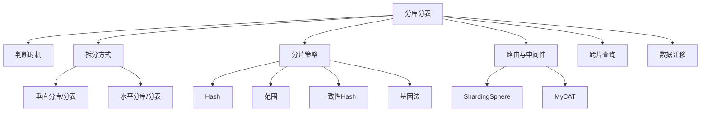

### P0 必背核心

#### 何时需要分库分表
- **单表 1000-2000 万**：经验值，B+ 树 3-4 层后查询性能下降明显。
- **单表数据 > 几十 GB**：DDL 慢、备份慢、内存命中率低。
- **单库 QPS > 4000-5000**：单机 MySQL 写入瓶颈。
- **单库连接数瓶颈**：MySQL 默认 max_connections 151，调大也有上限（连接数 × 内存）。
- **不要过早分**：业务规模未到时分库分表只增加复杂度。先优化索引、慢 SQL、读写分离、缓存。
- 关联题：#0016

#### 垂直拆分 vs 水平拆分
- **垂直分库**：按业务划分库（订单库、用户库、商品库）；解决业务耦合、单库压力分散。
- **垂直分表**：把宽表的字段按访问频率/重要性拆（user_base + user_detail），减少 IO；缺点是 join。
- **水平分库**：同一张表数据按规则分散到多个库；解决单库写入和存储瓶颈。
- **水平分表**：同一张表数据按规则分散到多个表；不分库只分表只解决单表过大问题（性能提升有限因为还是一个库的 IO）。
- **组合**：实际生产几乎都是"垂直分库 + 水平分库 + 水平分表"组合（如订单库 8 个，每库 8 张表）。
- 关联题：#0016

#### 分片策略
- **Hash 取模**：`shard_id = userId % N`，分布均匀但**扩容需要数据迁移**（迁移量 ≈ 全表 (N-1)/N）。
- **范围分片**：按时间/ID 范围分（如 user_id 0-1000万 → shard0、1000万-2000万 → shard1）；扩容容易（加 shard）但**热点问题严重**（最新数据集中在一个分片）。
- **一致性 Hash**：节点形成哈希环，数据按 key 哈希落到顺时针下一个节点；扩容只影响相邻节点（迁移量 1/N）；**虚拟节点**解决数据倾斜。
- **基因法（Genetics）**：把分片键的"基因"嵌入到其他字段。如订单号 = 时间戳 + 用户 ID 末 4 位（用户 ID 基因），保证用户查自己订单时能直接路由到对应分片。
- **按业务/地理位置**：B 端按公司 ID、C 端按地域路由到就近机房。
- 关联题：#0016

#### 分片键选择原则
- **均匀分布**：分布要均匀，否则某些分片成热点。
- **高频查询字段**：90% 查询能命中分片键，避免广播查询。
- **不可变**：一旦确定不能改（改了要迁移数据）。
- **单调递增的不要**：会导致最新数据集中一个分片。
- **典型 C 端**：用户 ID 做分片键（用户查自己的数据是最高频场景）。
- **B 端订单**：用 user_id 做分片键 + 订单号嵌入 user_id 基因，C 端用户查、商家查、客服查都能路由。
- 关联题：#0016

#### ShardingSphere 架构
- **Sharding-JDBC**：客户端模式，Jar 形式集成在应用，作为增强的 JDBC Driver；性能好（无额外网络跳），但和应用耦合，多语言不友好。
- **Sharding-Proxy**：代理模式，独立部署，对应用透明（兼容 MySQL 协议），多语言通用，但多一跳网络开销。
- **Sharding-Sidecar**：Service Mesh 形态（DBMesh），实验性。
- **核心能力**：分库分表、读写分离、分布式事务、影子库（压测）、数据加密、SPI 扩展。
- 关联题：#0016

### P1 加分高频

#### 跨片查询的痛
- **跨片 join**：失效。解决：① 全局表（数据量小、变化少，每个分片冗余一份，如字典表）；② 应用层做 join（先查 A 拿 ID 列表，再 in 查 B）；③ ER 表（关联表按相同 key 分片到同一节点，如订单和订单明细）；④ 异构存储（同步到 ES 做 join）。
- **跨片 ORDER BY + LIMIT**：必须先各分片各查 limit+offset，再归并。深翻页性能急剧下降。
- **跨片 COUNT / SUM**：各分片各算再聚合。
- **跨片分页**：用游标式（last id）代替 offset。
- 关联题：#0016

#### 数据迁移与扩容方案
- **停机迁移**：最简单，业务停服→数据全量同步→切流量→恢复。适合非核心业务，可接受停机时间。
- **不停机双写**：① 双写：业务代码同时写老库 + 新库；② 历史数据通过 Canal/DataX 同步；③ 校验双库一致；④ 流量切到新库；⑤ 下线老库。耗时长但平滑。
- **基于 Binlog（Canal）**：订阅老库 binlog 同步到新库，校验后切流。
- **Online DDL（如 gh-ost / pt-osc）**：用于单表结构变更，迁移用不上。
- **二倍法扩容**：分片数翻倍（N → 2N），原 shard_id 数据按 `id % 2N` 拆到 shard_id 和 shard_id+N 两份，其他分片不动。
- 关联题：#0016

#### 基因法实战
- **场景**：订单按用户 ID 分库，但订单后台/客服按订单号查询，没有用户 ID。
- **方案**：订单号生成时把用户 ID 末 N 位作为"基因"嵌入订单号末 N 位。`order_no = 雪花前缀 + (user_id & mask)`。
- **效果**：拿到订单号直接 `order_no & mask` 取末位 → 算出分片号，不需要回查 user_id。
- **二次分表难题**：分片数翻倍时，原有基因位不够（如 mask 是 4 位只能算出 16 个分片，扩到 32 个分片需要 5 位）。解决：① 提前预留基因位（设计时就用 8-10 位）；② 历史数据查询走全表广播，新数据用新基因位。
- 关联题：#0016

#### 分布式事务在分库分表中的应用
- 同一笔操作涉及多个分片 → 跨片事务。
- **本地事务**：每个分片各自事务 + 业务层补偿。
- **Seata AT 模式**：拦截 SQL 生成反向 SQL（undo log），全局协调；性能 OK 但侵入业务。
- **柔性事务（最终一致）**：消息驱动 + 对账 + 补偿任务。绝大多数业务能容忍。

### P2 深度延伸

#### 一致性 Hash 详解
- 把 0 ~ 2^32-1 视为一个环，节点和数据 key 都 hash 到环上，数据落到顺时针下一个节点。
- 加节点：只影响该节点逆时针到上一个节点之间的数据，迁移量 1/N。
- 删节点：该节点上的数据全部迁到顺时针下一个节点。
- **虚拟节点**：每个物理节点对应多个（如 150 个）虚拟节点分散到环上，缓解数据倾斜。Redis Cluster 的 slot 设计也类似（16384 个 slot）。
- 关联题：#0016

#### ShardingSphere 内核原理
- **SQL 解析**：ANTLR 把 SQL 解析成 AST。
- **SQL 路由**：根据分片规则定位到目标库表。
- **SQL 改写**：把 `t_order` 改写为 `t_order_0`/`t_order_1`，深翻页 LIMIT 改写。
- **SQL 执行**：并行执行到各分片。
- **结果归并**：流式归并（避免内存爆）/ 内存归并（小数据集排序聚合）。

#### 分库分表后的 ID 全局唯一
- 雪花 / Leaf / UidGenerator（参考 #10）。
- 自增 ID 在 ShardingSphere 中可用，但需要每个分片设置不同的 auto_increment_offset 和 auto_increment_increment（如 increment=10，offset=1/2/.../10），扩容不便。

#### 影子库 / 影子表（压测）
- 生产环境压测时，请求带特殊标识 → 走影子库/影子表（不污染生产数据）。
- ShardingSphere 通过 hint 路由实现；阿里 PTS 全链路压测的核心机制。

### P3 冷门刁钻

#### MyCAT vs ShardingSphere
- **MyCAT**：基于 Cobar，老牌国产 Proxy 中间件；社区活跃度下降，不推荐新项目。
- **ShardingSphere**：apache 顶级项目，**强烈推荐**，文档完整、社区活跃、能力全。

#### 单元化部署
- 蚂蚁/淘宝级别的"单元化"：每个机房自治、用户按规则路由到固定机房（异地多活的基础）。
- 每个单元包含完整业务能力，单元间通过 MQ 同步，单元故障可整体切流。

#### NewSQL（TiDB / OceanBase）
- 既能像 MySQL 一样写 SQL，又自动分布式分片、水平扩展、支持事务。
- **TiDB**：MySQL 兼容、计算存储分离、Raft 一致性。
- **OceanBase**：阿里出品，金融级强一致 + 高可用，蚂蚁全链路使用。
- 适用：业务规模到 PB 级、不想自己折腾分库分表。

### 跨模块联想

- 分片键选择 ↔ **15 业务场景**：订单基因法、用户查询路径设计。
- ID 生成 ↔ **10 分布式锁与ID**：雪花、Leaf 是分库分表的标配。
- 跨片事务 ↔ **09 分布式事务**：Seata AT/TCC、最终一致性方案。
- 一致性 Hash ↔ **06 Redis**：Redis Cluster 16384 slot、客户端分片。
- 跨片查询 ↔ **12 中间件**：ES 做异构存储扛 C 端复杂查询，MySQL 走分片做主存。
- 数据迁移 ↔ **05 MySQL**：Canal 订阅 binlog、双写、灰度切流。
- 扩容 ↔ **08 微服务**：与微服务拆分一样，越早设计越好。
- 单元化 ↔ **14 系统设计**：异地多活、容灾、单元路由。

---

## 12 其他中间件

> 模块定位：除 MySQL/Redis/MQ 之外的中间件大杂烩。重点是 **ES + ZooKeeper + Nacos + Netty**。51 题。
> 题量：51 题。

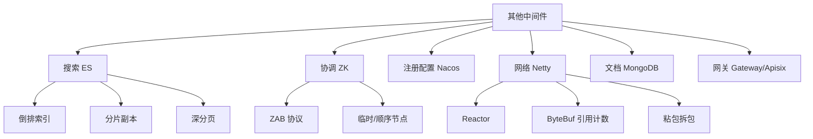

### P0 必背核心

#### ElasticSearch 倒排索引
- **倒排索引（Inverted Index）**：词典（Term）→ 倒排列表（Posting List，文档 ID + 词频 + 位置）。文档分词后建立"词到文档"的映射，与传统"文档到词"相反。
- **写流程**：① 写入内存 Buffer + Translog（顺序写）；② **每 1 秒 refresh** 到 OS Cache 生成新 Segment（此时可搜，**近实时 NRT**）；③ Translog **每 5 秒 fsync** 到磁盘（默认 request）；④ 每 30 分钟或 translog 满 512MB 触发 **flush**（OS Cache 数据写盘 + 清空 translog）。
- **Segment 不可变**：删除标记 .del 文件、更新 = 旧文档标删 + 新文档；后台 Merge 合并小段、清理已删。
- **分词器**：Standard（默认）、IK（中文细粒度/最细）、Pinyin 等。
- 关联题：#0249

#### ES 分片与副本
- **Shard（主分片）**：索引创建时设定数量，**不可修改**；每个分片是独立 Lucene 索引。
- **Replica（副本）**：可动态修改；提供读扩展和高可用，主分片挂了副本提升为主。
- **路由**：默认 `shard = hash(doc_id) % primary_shards`；可指定 routing 字段。
- **数据写入**：先写主分片 → 同步给所有副本 → 都成功返回（`wait_for_active_shards`）。
- **数据读取**：协调节点（任意节点）转发到主或副本（RR 选）。
- 关联题：#0249

#### ES 深度分页
- **传统 from + size**：每个分片各取 from+size，协调节点汇总排序再 size。from=10000、shard=5 时要拉 50050 条，性能差且内存爆。**ES 默认 from+size ≤ 10000**（index.max_result_window）。
- **search_after**：基于上一页最后一条记录的排序值做游标，无 deep page 问题；不支持跳页。**推荐 C 端**。
- **scroll**：建立快照，适合**离线导出全量数据**；占用资源不适合 C 端。
- **PIT（Point In Time）**：7.10+，类似 scroll 但更轻量，配合 search_after 用。
- 关联题：#0249

#### Zookeeper 核心
- **数据模型**：树形 ZNode（类似文件系统），每个节点存 < 1MB 数据 + 子节点。
- **节点类型**：① 持久（PERSISTENT）；② 临时（EPHEMERAL，session 断开自动删，分布式锁用）；③ 顺序（SEQUENTIAL，自动递增编号）；④ 临时顺序（分布式锁的核心）；⑤ Container（无子节点会被定期清理，3.5+）。
- **Watch 机制**：客户端可监听节点的创建/删除/数据变化/子节点变化；**一次性触发**（触发后要重新注册），所以高频变更场景慎用。
- **ZAB 协议**：两阶段——崩溃恢复（Leader 选举 + 数据同步） + 消息广播（Leader 收到写请求 → 广播给 Follower → 多数派 ACK → Leader Commit）。
- **CP 系统**：Leader 选举期间（< 200ms）不可用。
- 关联题：#0249

#### Nacos 核心
- **二合一**：服务注册中心 + 配置中心。
- **服务发现**：临时实例走 **Distro 协议**（AP，类 Eureka 自治集群，性能优先）；永久实例走 **Raft 协议**（CP，强一致）。
- **配置推送**：**长轮询**——客户端发请求 hold 在服务端 29.5s，服务端有变更立即返回，无变更超时返回，客户端再发起。比短轮询省资源比 WebSocket 简单。
- **Spring 集成**：`@NacosValue` 注解 + 自动刷新；`@RefreshScope` 配合 `@Value`。
- **健康检查**：临时实例靠心跳（默认 5s）；永久实例靠主动探测（HTTP/TCP）。
- 关联题：#0249

#### Netty 核心架构
- **主从 Reactor 模式**：① BossGroup（主 Reactor，处理 Accept）；② WorkerGroup（从 Reactor，处理 Read/Write/Decode/Encode/业务）。
- **核心组件**：Channel（连接的抽象）、EventLoop（绑定线程，处理所有事件）、ChannelHandler（业务逻辑）、ChannelPipeline（Handler 链）。
- **ByteBuf**：替代 NIO ByteBuffer。优势：① 读写指针分开（不用 flip）；② 自动扩容；③ 池化（PooledByteBufAllocator）；④ 引用计数（手动 release 否则堆外内存泄漏）。
- **零拷贝**：① CompositeByteBuf 逻辑合并多个 ByteBuf 不复制；② Unpooled.wrappedBuffer 包装数组不复制；③ FileRegion 用 transferTo sendfile。
- **TCP 粘包拆包**：内置解码器 `LengthFieldBasedFrameDecoder`（长度前缀）、`DelimiterBasedFrameDecoder`（分隔符）、`FixedLengthFrameDecoder`（定长）、`LineBasedFrameDecoder`（行尾）。
- **空闲检测**：IdleStateHandler 检测读/写/读写空闲，配合心跳。
- 关联题：#0249

### P1 加分高频

#### ES Mapping 与字段类型
- **Mapping**：相当于 DB 的 schema；可动态生成（dynamic mapping）也可显式定义。
- **常用类型**：text（分词，做全文检索）、keyword（精确匹配，不分词）、long/integer/double、date（多种格式）、boolean、object、nested（嵌套对象数组）。
- **text + keyword 双字段**：`"name": {"type":"text", "fields":{"keyword":{"type":"keyword"}}}`，既能做模糊搜索又能精确匹配/聚合。
- **典型陷阱**：动态生成 mapping 不可改类型（重建索引才行）；一旦设错类型后患无穷。
- 关联题：#0249

#### ES 聚合 Aggregation
- **三大类**：① Metric（avg/sum/min/max/cardinality 基数）；② Bucket（terms 按字段分组、date_histogram 时间桶、range 范围）；③ Pipeline（基于其他聚合结果再聚合）。
- **terms 聚合精度问题**：每个 shard 取 top N 再汇总，N 太小会丢失（如总共 top 10 但每片 top 5 汇总后不准），可调 shard_size。
- **常用组合**：terms（按类目）+ avg（每类平均价格） + cardinality（每类用户数）。

#### 注册中心三选一对比
- **Eureka**：AP，Netflix 已停更，自我保护机制（< 85% 心跳率保留过期节点）。
- **Zookeeper**：CP，Leader 选举期间不可用，性能不如 Eureka/Nacos。
- **Nacos**：AP/CP 可切换，配置 + 注册二合一，国内主流。
- **Consul**：CP，健康检查能力强，K8s 体系不常用。
- 关联题：#0249

#### MongoDB 核心特性
- **文档型 NoSQL**：BSON（类 JSON）存储，schemaless，适合**多变结构数据**（如商品 SKU 属性各异、用户行为日志）。
- **副本集**：3 节点（1 Primary + 2 Secondary），自动故障转移；写默认到 Primary，读可配置（primary/secondary/nearest）。
- **分片**：内置分片支持，按 shard key 哈希/范围分片，Config Server 管路由。
- **聚合管道**：`$match/$group/$project/$lookup/$unwind` 等阶段串联，类似 SQL 但更灵活。
- **WiredTiger 存储引擎**：B+ 树 + 文档级锁（替代旧 MMAP 的库级锁）；快照隔离。
- 关联题：#0249

#### API 网关选型
- **Spring Cloud Gateway**：Spring Boot 生态，基于 Netty + Reactor 非阻塞；Java 团队首选。
- **Zuul 1**：基于 Servlet 阻塞 IO，吞吐低，已不推荐。
- **Apisix**：基于 Nginx + Lua + etcd，性能高、热更新、插件丰富，云原生主流。
- **Kong**：同 Apisix 思路，社区版功能受限，企业版收费。
- **OpenResty / 自研 Nginx + Lua**：自研成本高但极致灵活。

### P2 深度延伸

#### ES 写入性能优化
- 关闭 refresh_interval（如导入时设 -1，导完恢复 1s）。
- 关闭 replica（导入完再开启）。
- 增大 bulk 批次（5-15 MB / 批，不是越大越好）。
- 增大 indexing buffer（indices.memory.index_buffer_size）。
- 用 SSD、调高 thread_pool.write.queue_size。

#### ZK 羊群效应与 Watch 优化
- **羊群效应**：多个客户端 Watch 同一个节点，节点变化时全部被唤醒去抢锁。
- **解决**：分布式锁场景每个客户端只 Watch 前一个节点（顺序节点），形成"链式监听"，谁释放只唤醒后面那个。

#### ES Query DSL 精要
- **bool**：must（AND，参与打分）、must_not（NOT）、should（OR）、filter（AND 不参与打分，可缓存）。
- **filter vs must**：filter 不算分且可缓存，等值/范围条件优先用 filter。
- **match vs term**：match 走分词器；term 精确匹配不分词。
- **range**：gte / lte / gt / lt。
- **bool + filter + range + term** 是 80% 业务查询的组合。

#### Netty 内存泄漏
- **原因**：ByteBuf 未调 release()，堆外内存累积。
- **检测**：`-Dio.netty.leakDetection.level=PARANOID`（全量检测，性能差，仅测试用）；默认 SIMPLE 抽样检测。
- **最佳实践**：用 `try { ... } finally { byteBuf.release(); }`；ChannelInboundHandlerAdapter 默认 fireChannelRead 后会自动 release。

#### MongoDB vs MySQL 选型
- **MongoDB 优势**：schemaless、嵌套数据自然存储、水平扩展容易、地理位置查询。
- **MySQL 优势**：强事务、生态成熟、SQL 标准、运维工具多。
- **业务选型**：核心业务（订单、支付、用户）用 MySQL；日志/行为/IoT 数据/CMS 灵活字段用 MongoDB。

### P3 冷门刁钻

#### ES 协调节点 vs 数据节点 vs 主节点
- **协调节点（Coordinating）**：接收请求、分发、汇总结果；任意节点默认都有此角色。
- **数据节点（Data）**：存数据、执行查询。
- **主节点（Master）**：管理集群元数据、分片分配、节点加入退出；用 master-eligible 选举。
- 生产建议：专用 master（3 个，small instance）、专用 coordinating（应对突发查询）、专用 data。

#### Zookeeper 与 etcd 对比
- **ZK**：ZAB 协议、Java、Watch 一次性、API 简单。
- **etcd**：Raft 协议、Go、Watch 持续推送、HTTP/2 + gRPC API、CNCF 标准、K8s 用。

#### Lucene 与 ES 的关系
- **Lucene** 是 Java 全文检索库（Doug Cutting 写的），核心是倒排索引、Segment、Query。
- **ES** 是 Lucene 的分布式封装，加了集群、分片、副本、HTTP API、聚合、监控。
- **Solr** 是另一个 Lucene 封装，老牌但近年被 ES 反超。

### 跨模块联想

- ES 倒排索引 ↔ **05 MySQL**：MySQL 的 B+ 树正排 vs ES 倒排，互补使用（MySQL 抗事务 + ES 抗复杂查询）。
- ZK ↔ **10 分布式锁与ID**：临时顺序节点做锁、Watch 做 ID 协调。
- Nacos ↔ **08 微服务**：服务注册 + 配置二合一是国内主流。
- Netty ↔ **01 Java 基础**：NIO + Reactor 的实战封装；ByteBuf 替代 ByteBuffer。
- Netty ↔ **13 网络**：粘包拆包、心跳、零拷贝的工程实现。
- ES ↔ **11 分库分表**：分库分表后用 ES 做异构存储扛 C 端复杂查询。
- MongoDB ↔ **15 业务场景**：日志、IoT、用户行为这类灵活字段场景。
- API 网关 ↔ **15 业务场景**：限流、鉴权、灰度、协议转换的统一入口。

---

## 13 网络与操作系统

> 模块定位：高级岗"硬基础"。**TCP/HTTP/HTTPS、IO 多路复用、Linux 命令、零拷贝**是常考主线。68 题。
> 题量：68 题。

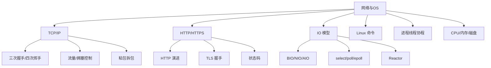

### P0 必背核心

#### TCP 三次握手
- **流程**：① 客户端 SYN（seq=x），进入 SYN_SENT；② 服务端 SYN+ACK（seq=y, ack=x+1），进入 SYN_RCVD；③ 客户端 ACK（ack=y+1），双方进入 ESTABLISHED。
- **为什么三次而不是两次**：防止已失效的连接请求报文（网络延迟到达）再次建立连接。两次的话服务端无法确认客户端发送能力 + 客户端无法确认服务端接收能力。
- **为什么不是四次**：第二次中服务端的 ACK 和 SYN 可以合并发送，没必要分开。
- **SYN Flood 攻击**：大量伪造 SYN 不响应 ACK，占满服务端半连接队列。防御：syncookies、tcp_max_syn_backlog 调大、超时重传次数调小。
- 关联题：#0085、#0093

#### TCP 四次挥手与 TIME_WAIT
- **流程**：① 主动方 FIN，进入 FIN_WAIT_1；② 被动方 ACK，进入 CLOSE_WAIT，主动方进入 FIN_WAIT_2；③ 被动方处理完业务发 FIN，进入 LAST_ACK；④ 主动方 ACK，进入 **TIME_WAIT**（等 2MSL），最终关闭。
- **为什么四次**：FIN 和 ACK 不能合并（服务端可能还有数据要发），所以拆开两次。
- **TIME_WAIT 2MSL（一般 60s）**：① 保证最后一个 ACK 能到对方（否则对方重传 FIN，要能响应）；② 让本次连接的报文在网络中消亡，避免影响下个相同四元组连接。
- **TIME_WAIT 堆积**：主动关闭方常见，大量短连接场景（如 Nginx 上游回源）；解决：复用四元组（`tcp_tw_reuse`、`tcp_tw_recycle` 已被废弃）、用长连接、调大端口范围。
- **CLOSE_WAIT 堆积**：**应用代码 bug**，对方关了连接但本端没调 close()。检查 IO 处理逻辑、数据库连接池泄漏。
- 关联题：#0085、#0093

#### TCP 可靠传输机制
- **序号 + 确认**：每个字节有序号，接收方 ACK 下一个期望序号；缺失的中间段触发重传。
- **超时重传**：RTO 自适应（基于 RTT）。
- **快重传**：连续收到 3 个重复 ACK 立即重传，不等超时。
- **流量控制**：滑动窗口，接收方告知发送方剩余缓冲区大小，发送方不超过该窗口。
- **拥塞控制**：① 慢启动（cwnd 指数增长）；② 拥塞避免（达到 ssthresh 后线性增长）；③ 快重传 + 快恢复（cwnd 减半 + 立即重传）；④ Cubic（Linux 默认）、BBR（Google 提出，更适合长肥网络）。
- **Nagle 算法**：小包合并发送降低带宽，但增加延迟；交互式应用（IM、SSH）建议 `TCP_NODELAY` 关闭。
- **SACK**：选择性确认，告知发送方哪些段已收到，减少不必要的重传。
- 关联题：#0085

#### TCP vs UDP
- **TCP**：面向连接、可靠（重传、有序、不重复）、流控/拥塞控制、字节流、点对点；适合文件传输、HTTP、邮件、数据库。
- **UDP**：无连接、不可靠、首部小（8 字节 vs TCP 20+ 字节）、支持广播/组播、报文边界保留；适合 DNS、视频/音频实时传输、QUIC、游戏。
- **QUIC**：Google 提出基于 UDP 的可靠传输（HTTP/3 用）；解决 TCP 队头阻塞、连接迁移、0-RTT 握手。
- 关联题：#0093

#### HTTP 演进（1.0/1.1/2/3）
- **HTTP/1.0**：短连接，每次请求建立 TCP 连接。
- **HTTP/1.1**：**长连接**（Keep-Alive 默认）、Pipeline（请求可流水但响应必须顺序，**队头阻塞**）、Host 头支持虚拟主机、Range 部分请求、Cache-Control。
- **HTTP/2**：① **多路复用**（一个 TCP 连接并行多个请求，Stream 概念）；② **头压缩 HPACK**；③ **服务端推送**；④ 二进制分帧；⑤ 仍有 TCP 层队头阻塞。
- **HTTP/3（QUIC）**：基于 UDP，解决 HTTP/2 的 TCP 队头阻塞、0-RTT 握手（连接复用）、连接迁移（IP 切换不断）、强制加密。
- 关联题：#0049

#### HTTPS 与 TLS 握手
- **HTTPS = HTTP + TLS**：解决 HTTP 明文传输（窃听）、篡改、冒充三大问题。
- **TLS 1.2 握手 4 步**：① ClientHello（支持的密码套件、随机数）；② ServerHello + 证书 + 公钥 + 随机数；③ 客户端验证证书链 → 用公钥加密 pre-master 发给服务端，双方算出 master secret；④ 切换加密通信 Change Cipher Spec。
- **TLS 1.3**：① 1-RTT 握手（vs 1.2 的 2-RTT）；② 0-RTT 复用 session；③ 去掉不安全密码套件（如 RSA 密钥交换、SHA1）；④ 强制 ECDHE。
- **混合加密**：非对称（RSA/ECDHE）交换对称密钥 + 对称（AES）加密数据。
- **证书链**：终端证书 → 中间 CA → 根 CA（操作系统/浏览器内置）。
- **会话复用**：Session ID（服务端存）/ Session Ticket（客户端存）避免完整握手。
- 关联题：#0093

#### HTTP 状态码
- **1xx 信息**：100 Continue（继续上传）。
- **2xx 成功**：200 OK、201 Created（POST 成功）、204 No Content（PUT/DELETE）、206 Partial Content（Range 请求）。
- **3xx 重定向**：**301 永久重定向**（SEO 友好）、**302 临时重定向**、303 See Other、**304 Not Modified**（缓存命中，配合 If-Modified-Since/ETag）、307/308（保留方法的重定向）。
- **4xx 客户端错误**：400 Bad Request、**401 未认证**、**403 已认证但没权限**、404 Not Found、405 Method Not Allowed、409 Conflict、429 Too Many Requests（限流）。
- **5xx 服务端错误**：500 Internal、**502 Bad Gateway**（网关收到上游错误响应）、503 Service Unavailable、**504 Gateway Timeout**（网关上游超时）。
- **502 vs 504 区别**：502 上游返回错误，504 上游超时未返回。
- 关联题：#0093

#### Linux IO 多路复用（select/poll/epoll）
- **select**：fd 集合传入内核拷贝（bitmap），每次返回都要轮询所有 fd 找就绪的；fd 数量限制 1024；O(n)；跨平台。
- **poll**：链表实现取消 1024 限制，仍是 O(n) 轮询；fd 数组每次都要传内核。
- **epoll（Linux 2.6+）**：① **红黑树**存所有注册 fd；② **就绪链表**存活跃 fd；③ epoll_wait O(1) 直接拿就绪链表，不用轮询；④ 内存 mmap 共享，无拷贝。
- **epoll 工作模式**：LT 水平触发（默认，只要 fd 有数据就一直通知，Nginx 默认）；ET 边缘触发（fd 状态变化时只通知一次，需配合非阻塞 IO + while 循环读完，Redis、Netty 用）。
- **典型支持量级**：select/poll 千级，epoll 十万级以上。
- 关联题：#0048、#0094

#### Linux IO 模型（BIO/NIO/AIO/信号驱动）
- **BIO**：用户线程阻塞等数据准备 + 拷贝，一连接一线程。Java 中传统 ServerSocket.accept()。
- **NIO（多路复用）**：内核数据准备阶段不阻塞，用户线程通过 select/epoll 监听多 fd，**数据拷贝阶段仍阻塞**。Java NIO 是这种。
- **信号驱动**：注册信号 SIGIO，数据准备好回调通知用户线程；用户线程发起 recvfrom 仍阻塞拷贝阶段。
- **AIO（真异步）**：数据准备 + 拷贝都由内核完成，完成后通知用户线程（信号或回调）。Linux 用 io_uring（5.1+），Windows IOCP。Java AIO 性能不突出，工业界主流仍是 NIO。
- **Reactor 模式**：基于 NIO 的高性能 IO 架构，单 Reactor 单线程 → 单 Reactor 多线程 → 主从 Reactor 多线程（Netty 默认）。
- 关联题：#0094、#0048

### P1 加分高频

#### 进程 / 线程 / 协程
- **进程**：资源分配最小单位，独立地址空间、文件描述符。切换开销最大（TLB 失效、地址空间切换）。
- **线程**：CPU 调度最小单位，共享进程的堆/方法区/文件描述符，独立栈/寄存器/PC。Linux 中通过 clone 系统调用创建（轻量级进程 LWP）。
- **协程**：用户态线程，由用户调度（无内核态切换），共享线程上下文。Go 的 goroutine、Java 21 的 Virtual Thread、Python asyncio。
- **Java 协程**：JDK 21 LTS 的 **虚拟线程（Project Loom）**，可以创建百万级；运行在少量 Carrier Thread（平台线程）上；阻塞 IO 时让出 Carrier Thread。
- **上下文切换开销**：进程 µs 级、线程几百 ns、协程几十 ns。
- 关联题：#0048

#### Linux 常用命令
- **进程**：`ps -ef`、`top`（CPU/内存 TOP）、`top -H -p <pid>`（线程级）、`pidstat`、`htop`。
- **CPU**：`top` 看 us/sy/wa/id；`mpstat -P ALL`；`vmstat 1`。
- **内存**：`free -h`、`vmstat`、`pmap`。
- **磁盘**：`df -h` 看分区、`du -sh *` 看目录大小、`iostat -x 1`、`iotop`。
- **网络**：`netstat -anp`（旧）/ `ss -lntp`（推荐，更快）、`tcpdump`、`iftop`、`nmap`、`telnet host port`、`curl -v`。
- **文件 / 日志**：`tail -f`、`grep -rn`、`sed`、`awk`、`find / -name ...`、`lsof -p <pid>`（看打开的 fd）。
- **打包**：`tar -zcvf` 压缩、`tar -zxvf` 解压。
- 关联题：#0048

#### TCP 粘包 / 拆包
- **原因**：TCP 是字节流不是报文边界，发送方多次 write 可能合并为一次 read（粘包），一次大 write 也可能被拆为多次 read（拆包）。
- **解决（应用层协议设计）**：① **定长**（如固定 100 字节）；② **分隔符**（如 `\r\n\r\n`，HTTP 头用的）；③ **长度前缀**（Header 中带 length，Netty `LengthFieldBasedFrameDecoder`，最常用）；④ **TLV**（Type-Length-Value）。
- 关联题：#0083

#### 零拷贝
- **传统**：read+write 经 4 次拷贝（磁盘→内核→用户→内核 socket→网卡）+ 4 次上下文切换。
- **mmap**：文件映射到用户空间共享，3 次拷贝 + 4 次切换。Kafka 索引文件用。
- **sendfile（Linux 2.1+）**：在内核态直接拷 socket，2 次拷贝（DMA 磁盘→内核→网卡 DMA）+ 2 次切换。Kafka 消费、Nginx 静态文件。
- **sendfile + SG-DMA**（2.4+）：1 次 CPU 拷贝，DMA 直接发到网卡。
- **Java**：FileChannel.transferTo()/transferFrom() 底层 sendfile；MappedByteBuffer 是 mmap。
- 关联题：#0078

#### DNS 解析过程
- ① 浏览器缓存 → 系统 hosts → 系统 DNS 缓存 → 本地 DNS 服务器（运营商）。
- ② 本地 DNS 没缓存 → **递归**问根域名服务器（13 组 a-m.root-servers.net）。
- ③ 根返回顶级域（如 .com）NS → 本地 DNS 问 .com NS 拿到二级域 NS → 一直到权威 DNS。
- ④ 拿到 A 记录后逐级缓存返回，TTL 过期前都用缓存。
- **DNS 劫持**：HTTPS 防中间人但不防 DNS 劫持（DNS 是 UDP 明文）；DoH（DNS over HTTPS）、DoT（DNS over TLS）防这个。
- **CNAME / A / AAAA / MX / TXT**：A → IPv4、AAAA → IPv6、CNAME 别名、MX 邮件、TXT 验证。

#### Cookie / Session / Token / JWT
- **Cookie**：浏览器存储的小数据，每次请求自动带上。可 HttpOnly（防 JS 读）、Secure（仅 HTTPS）、SameSite（防 CSRF）。
- **Session**：服务端存的会话状态，通过 Cookie 带的 sessionId 关联；缺点：扩展性差（多机要共享）、跨域难。
- **Token（如 OAuth Access Token）**：服务端签发，客户端存（Cookie/localStorage）；要存 Token 到 Redis 才能撤销。
- **JWT（JSON Web Token）**：自包含 Header + Payload + Signature，**无状态**不查 DB；签名防篡改但 Payload 是 Base64 编码可读；缺点是无法主动失效（除非加黑名单 Redis，那就违背初衷了）。
- 关联题：#0083

#### CORS / 跨域
- **同源策略**：协议 + 域名 + 端口任一不同就跨域。
- **简单请求**：直接发，服务端响应 `Access-Control-Allow-Origin`。
- **预检请求**：复杂请求（非简单方法、自定义 header）先 OPTIONS 询问，服务端响应 Allow-Methods/Headers/MaxAge 通过才发真实请求。
- **解决**：① 后端配 CORS 响应头；② Nginx 代理同源；③ JSONP（只支持 GET，已少用）；④ postMessage（跨窗口）。

### P2 深度延伸

#### epoll 红黑树 vs 就绪链表
- **红黑树**：epoll_ctl 注册的 fd 都放红黑树，CRUD 都是 O(log n)。
- **就绪链表**：通过回调机制（fd 上有事件触发就把 fd 放就绪链表），epoll_wait 直接 O(1) 取出就绪 fd。
- **ET 触发原理**：fd 状态从无→有变化时往就绪链表加一次，之后即便有数据也不再加；要求用户必须一次读完（while 循环 + 非阻塞 IO）。
- 关联题：#0094

#### CPU 缓存行 / 伪共享 / MESI
- **缓存行 Cache Line**：CPU 缓存按行加载（通常 64 字节）。
- **伪共享（False Sharing）**：多线程读写同一缓存行的不同变量时，缓存一致性协议（MESI）频繁失效，性能反而下降。Disruptor、LongAdder 都用 `@Contended` 填充避免。
- **MESI**：CPU 缓存一致性协议，4 状态（Modified/Exclusive/Shared/Invalid）；写操作要发 Invalidate 消息给其他核。
- **内存屏障**：LoadLoad/LoadStore/StoreLoad/StoreStore，volatile 的可见性靠插入 StoreLoad 屏障实现。
- 关联题：#0094

#### top / iostat 关键指标
- **top us/sy/wa/id**：us 用户态高 → 业务计算或 GC；sy 内核态高 → 系统调用频繁、锁竞争；**wa 高 → 磁盘 IO 瓶颈**；id 是空闲。
- **iostat -x 1 关键列**：%util 磁盘使用率（> 80% 警惕）；await IO 总耗时 ms（机械盘 > 20ms、SSD > 1ms 警惕）；svctm 服务时间（已废弃）；r/s w/s 读写 IOPS。
- **vmstat r/b/swpd/si/so**：r 运行队列 > CPU 核数 → CPU 紧张；b 阻塞队列高 → 资源等待；swpd > 0 → 用 swap 性能差；si/so 频繁 → 内存不够。

#### 进程间通信（IPC）
- **管道 Pipe / FIFO**：单向、字节流、父子进程或同主机进程。
- **消息队列**：内核维护链表，按 type 取消息。
- **共享内存 + 信号量**：最快但要自己同步。
- **Socket**：跨主机也行，最通用。
- **信号 Signal**：异步通知（SIGTERM/SIGKILL/SIGINT）。

#### 用户态 vs 内核态
- 用户程序运行在用户态（ring 3），系统调用陷入内核态（ring 0）；切换有开销（保存寄存器、切换栈）。
- 减少切换：批处理系统调用、用户态实现网络协议栈（DPDK、io_uring）、JNI/Native 慎用。

#### 长连接 / 短连接 / 心跳
- **HTTP Keep-Alive**：HTTP 层长连接，复用 TCP（不复用响应顺序）。
- **TCP Keep-Alive**：协议栈层心跳（默认 7200s 探测 1 次太长），生产用应用层心跳。
- **应用层心跳**：约定间隔（一般 30-60 秒）发心跳包，N 次失败判断断线。Netty 用 IdleStateHandler。
- **WebSocket**：HTTP Upgrade 升级为长连接，全双工。

### P3 冷门刁钻

#### Linux 句柄数 / ulimit
- 单进程默认 1024，高并发服务必调；`ulimit -n 65535`、`/etc/security/limits.conf`；查实时占用 `lsof -p <pid> | wc -l`。
- 太多 TIME_WAIT 也会耗光端口（默认 32768-60999）。

#### tcpdump 抓包基础
- `tcpdump -i eth0 port 80 -nn -w out.pcap`：抓 eth0 上 80 端口流量；-nn 不解析 IP/端口；-w 写文件用 Wireshark 看。
- `tcpdump -i any host 10.0.0.1 and port 3306`：抓某 IP 某端口。

#### 网络字节序
- **大端（Big Endian）**：高位字节在低地址，TCP/IP 协议规定的网络字节序。
- **小端（Little Endian）**：x86/ARM CPU 默认。
- Java 默认大端，与网络字节序一致；C/C++ 跨平台要注意 htons/ntohs。

#### URI / URL / URN
- **URI = URL ∪ URN**：URI 是统一资源标识符的泛称；URL 是定位（`https://...`）；URN 是命名（`urn:isbn:...`）。

### 跨模块联想

- TCP/IO 多路复用 ↔ **01 Java 基础**：NIO Selector、Reactor 模式实现；Netty 主从 Reactor。
- epoll / 协程 ↔ **03 并发**：虚拟线程 Loom 解决"每连接一线程"OOM。
- 零拷贝 ↔ **07 消息队列**：Kafka 顺序写 + sendfile 是高吞吐核心。
- TLS / 状态码 ↔ **08 微服务**：网关层证书管理、跨服务调用 SSL 终结。
- TCP 拥塞控制 ↔ **15 业务场景**：高并发场景 BBR vs Cubic 调优。
- Linux 命令 ↔ **16 性能调优**：top -H + jstack 定位 CPU、iostat 看磁盘。
- HTTP 缓存 ↔ **06 Redis**：浏览器/CDN 缓存 vs Redis 缓存的层次。
- DNS ↔ **08 微服务**：服务发现 vs DNS，Kubernetes 的 CoreDNS。

---

## 14 系统设计与高并发

> 模块定位：架构岗"开放题"。三招通吃：**缓存 + 异步 + 分流**。重点是"为什么这么做"而非"做了什么"。26 题。
> 题量：26 题。

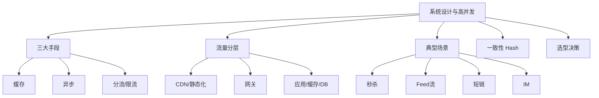

### P0 必背核心

#### 高并发三大核心手段
- **缓存**：把热点数据放在更快的存储（本地内存 Caffeine → 分布式 Redis → DB），减少对慢介质的请求。
- **异步**：把同步阻塞改成异步非阻塞（MQ 削峰填谷、CompletableFuture 并行调用、回调通知 vs 轮询）。
- **分流**：把请求按维度分散（限流、负载均衡、分库分表、读写分离、CDN）。
- **三者顺序**：先缓存（最易见效）→ 再分流（容易加机器/分片）→ 最后异步（改业务模型，代价大）。
- 关联题：#0034

#### 流量分层架构
- **L1 接入层 CDN**：静态资源（图片、JS、CSS）缓存到边缘节点，减少回源。
- **L2 静态化**：动态页面预渲染成静态 HTML（如商品详情页定时刷新）。
- **L3 网关**：限流、鉴权、灰度、协议转换。
- **L4 应用集群**：水平扩展，无状态便于扩容。
- **L5 缓存（Redis）**：扛住大部分读请求。
- **L6 DB（MySQL）**：最后兜底，写为主。
- **L7 下游服务**：调外部 API/MQ/搜索。
- **每一层都尽量挡住请求**：CDN 挡 80%、静态化挡 5%、缓存挡 14%，到 DB 只剩 1%。
- 关联题：#0034

#### 秒杀系统设计
- **核心难点**：① 瞬时大流量（百万 QPS）；② 库存不能超卖；③ 防黄牛刷子。
- **应对**：
  - **前端**：CDN 缓存活动页、按钮置灰防重复点击、答题/验证码、URL 动态化（活动开始前 URL 隐藏防提前抓包）。
  - **接入层**：网关限流（每用户每接口 QPS）、IP 限流、风控（同设备 / 同手机号）。
  - **应用层**：Redis 预扣库存（Lua 脚本原子性 `if stock > 0 then decr else fail`）、扣减成功后发 MQ 异步落库（生成订单 / 扣库存）。
  - **库存**：库存预热到 Redis（活动开始前同步 DB → Redis）；分桶库存（100 库存分成 10 桶 × 10，分散热点）。
  - **订单**：MQ 异步生成订单 → 用户拿到"排队中"状态 → 轮询订单结果。
  - **超时未支付**：延迟队列 30 分钟回滚库存。
- **防超卖**：Redis Lua 原子扣减 + DB 行锁兜底 + MQ 异步对账。
- 关联题：#0034

#### Feed 流推 / 拉 / 推拉结合
- **推模式（写扩散）**：A 发动态时，写到所有粉丝的"收件箱"（Redis ZSet 按时间排序）。读快、写贵。
  - 适合：好友数少（朋友圈，5000 上限）、读频繁。
- **拉模式（读扩散）**：A 发动态写到"自己的发件箱"；B 刷动态时，拉取自己关注的所有人的发件箱合并。写快、读贵。
  - 适合：粉丝数多（微博大 V 千万粉，推不动）、读频次低。
- **推拉结合**：普通用户用推（少粉丝读取多）；大 V 用拉（粉丝多，避免写放大）；客户端拉时合并自己收件箱 + 关注大 V 的发件箱。
- **微博方案**：用户分级 + 推拉结合 + Redis 排行 + 兜底降级。
- 关联题：#0034

#### 库存扣减方案对比
- **DB 行锁**：`UPDATE stock SET count = count - 1 WHERE id = X AND count >= 1`。优点：强一致，简单。缺点：单热点性能 < 1000 TPS。
- **DB 乐观锁**：`UPDATE stock SET count = count - 1, version = version + 1 WHERE id = X AND version = ?`。乐观重试，性能比悲观稍好但热点仍是瓶颈。
- **Redis 预扣 + MQ 异步落库**：Lua 脚本原子扣 Redis 库存 + 发 MQ → 消费者落库。性能最高（百万 QPS），但**最终一致**（中间挂了要对账）。
- **分桶库存**：100 库存分 10 桶 × 10，每桶独立扣减，分散热点（用户路由到某桶）；某桶卖完可向其他桶借。
- 关联题：#0034

### P1 加分高频

#### 短链系统
- **核心**：长 URL → 短 URL（如 t.cn/abc123）→ 重定向到长 URL。
- **生成方式**：
  - 发号器（雪花/数据库自增）+ 转 Base62（[0-9a-zA-Z] 62 字符），6 位 = 568 亿组合够用。
  - Hash + 冲突处理（碰撞率不低，不推荐）。
- **存储**：Redis 主存（短码→长 URL），MySQL 持久化。
- **重定向**：301（永久，浏览器缓存，省服务端流量但统计不准）vs 302（临时，每次都到服务端，统计准确，大厂主流）。
- **防刷**：短码不可枚举（不连续）、限流、风控。

#### 评论 / 点赞 / 排行榜
- **评论**：树状结构，常用"楼中楼"（父评论 + 子评论分页）；冷热分离（热数据 Redis，冷数据 MySQL 分库分表）。
- **点赞**：高频写，用 Redis 计数（Hash 或 String INCR） + 定时落库；防作弊（同用户同对象一次）。
- **排行榜**：Redis ZSet 实时排（ZADD score）；分时段排（日榜/周榜，过期 TTL）；千万级用户用分桶。
- 关联题：#0034

#### 用户签到 / Bitmap
- **场景**：千万用户日签到，DB 表会爆。
- **Bitmap 方案**：每用户一个 Bitmap，offset = 日期偏移；签到 `SETBIT user:123:202405 24 1`；查连续 N 天 `BITCOUNT` + `BITPOS`。
- **空间**：30 天 = 30 bit = 4 字节/用户，千万用户 40 MB。
- 关联题：#0034

#### 限时活动 / 优惠券
- **领取**：Redis SETNX 用户领取记录 + LIST 库存；活动前预热到 Redis。
- **使用**：状态机（未领→已领→已用→已过期），状态变更只能单向。
- **过期**：① Redis EXPIRE；② DB 定时任务扫；③ 延迟队列（领取时入队，到期自动失效）。

#### IM 系统设计
- **长连接**：Netty 维护用户长连接（百万长连接单机可达，调内核参数 + 减少 Heap）。
- **路由**：用户 → 接入网关 → 路由到具体的接入网关（用户 ID 取模）。
- **消息**：消息分发服务 + 离线消息（Redis 或专用 KV 存储离线消息）+ 已读回执。
- **可靠投递**：客户端 ACK + 服务端重试 + 去重 ID。
- **群聊扩散**：写扩散到每个成员的离线队列；大群（万人群）用拉模式。

#### 12306 抢票
- **核心难点**：库存复杂（车次 × 区间 × 座位）、瞬时高并发、绝对公平（不能少卖也不能多卖）。
- **应对**：① 静动分离（静态页 CDN）；② 排队令牌（拿到令牌才能进下单流程，限制后端并发）；③ 候补订单（无票时进队列）；④ 异步下单（前端轮询订单状态）；⑤ 风控（防刷）。

### P2 深度延伸

#### 一致性 Hash 与虚拟节点
- 见 #11 分库分表。
- **应用场景**：① Redis 分片路由（客户端分片 / Twemproxy）；② 负载均衡（同用户落同后端）；③ CDN 节点分配。

#### CDN 工作原理
- **DNS 调度**：用户访问 → 本地 DNS 询问 → 智能 DNS 返回离用户最近的 CDN 节点 IP → 用户访问该节点。
- **回源**：CDN 节点无缓存 → 回源到源站 → 缓存到本节点 → 返回用户。
- **缓存策略**：HTTP Cache-Control / Expires 控制；304 协商缓存。
- **预热与刷新**：大活动前预热静态资源；版本更新后刷新缓存。

#### 缓存设计分层
- **L1 本地缓存 Caffeine**：进程内，访问 < 1μs，容量小（GB 级）；适合超热点数据，注意一致性（多机不一致）。
- **L2 分布式缓存 Redis**：访问 < 1ms，容量中（百 GB），共享一致；扛住主要读流量。
- **L3 DB**：MySQL 兜底，QPS 千级。
- **多级缓存策略**：先查 L1，miss 查 L2，miss 查 DB；写时穿透或失效。

#### 数据库选型
- **OLTP（事务型）**：MySQL / PostgreSQL / TiDB / OceanBase；ACID + 高并发短事务。
- **OLAP（分析型）**：ClickHouse / Hive / Druid / Doris；批量扫描 + 聚合，列式存储。
- **KV**：Redis（内存）、RocksDB（嵌入式）、HBase（海量分布式）。
- **文档**：MongoDB；schemaless、嵌套结构。
- **搜索**：ES / Solr；全文检索 + 聚合。
- **图**：Neo4j / Nebula；关系密集查询（社交、风控）。
- **时序**：InfluxDB / TDengine / Prometheus；监控数据。

#### 异地多活
- **三种级别**：① 同城双活（机房距离 < 50km，专线，强一致）；② 异地多活（跨城，最终一致，单元化）；③ 异地灾备（冷备，业务无感切换难）。
- **单元化**：业务按用户 ID 路由到固定机房（单元），单元内自治，跨单元用 MQ 异步同步。
- **难点**：① 数据双向同步（避免循环）；② 路由策略（用户切单元怎么办）；③ 强一致业务（如全局唯一）的特殊处理。

### P3 冷门刁钻

#### 微信红包拆分算法
- **二倍均值法**：每人能抢的金额 = (剩余金额 / 剩余人数) × 2 之内随机；保证后面人也有得抢。
- **公式**：random(0.01, remainingMoney / remainingCount × 2)。
- **预生成 vs 实时算**：① 预先把 N 个红包金额算好存 Redis List，用户来时 LPOP 拿（性能高、绝对一致）；② 实时算（公平但要并发控制）。微信用预生成。

#### Feed 流时间线一致性
- 用户既能看到自己发的（强一致），又能看到关注者发的（最终一致）。
- 客户端发布后立即把自己的动态插入本地时间线；服务端异步处理推送给粉丝。

#### Twitter Snowflake 系统设计
- 用户量 5 亿，10 亿条 Tweet/天，要点赞计数、关注关系、Feed 流：
  - 用户表 + 关注表分库分表（按 user_id）。
  - Tweet 用雪花 ID + 分库分表（按时间 + user_id）。
  - Feed 流用推拉结合 + Redis ZSet。
  - 点赞用 Redis 计数 + 定时落库。

### 跨模块联想

- 缓存设计 ↔ **06 Redis**：旁路缓存、延迟双删、雪崩穿透击穿。
- 异步 ↔ **07 消息队列**：削峰填谷的核心，秒杀必用。
- 分流 ↔ **08 微服务**：负载均衡、限流、分片路由。
- 一致性 Hash ↔ **11 分库分表**：相同思想不同场景。
- 库存扣减 ↔ **05 MySQL** + **06 Redis**：DB 行锁 vs Redis Lua。
- 限流 ↔ **08 微服务**：网关限流、Sentinel、Guava RateLimiter。
- Feed 流 ↔ **15 业务场景**：写扩散/读扩散是高频题。
- 异地多活 ↔ **11 分库分表**：单元化路由是基础。
- 短链/秒杀 ↔ **15 业务场景**：开放设计题"百题答案"。

---

## 15 业务场景题

> 模块定位：开放题集中营。每个场景背后都有一组"标准解法"，高级岗考察的是**你能不能识别问题→匹配方案→说出权衡**。61 题。
> 题量：61 题。

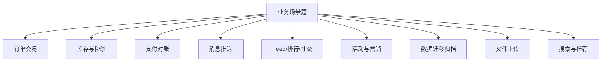

### P0 必背核心

#### 订单状态机与超时关闭
- **典型状态**：待支付 → 已支付 → 已发货 → 已收货 → 已完成；分支：已取消 / 已退款。
- **状态机原则**：① 状态变更只能单向（防回退）；② 每次变更带版本号防并发；③ DB 唯一索引 + 乐观锁兜底；④ 重要状态发 MQ 通知下游。
- **超时未支付**：方案一 **延迟队列**（RocketMQ 18 个延迟级别 / Redis ZSet 分钟级扫描 / 时间轮）；方案二 **定时任务扫描**（每分钟扫"创建时间 > 30 分钟且状态 = 待支付"），简单但有延迟。
- **大厂主流**：延迟队列做实时关闭 + 定时任务兜底（防消息丢失）。
- 关联题：#0024

#### 防重复下单 / 幂等
- **场景**：用户点击两次、网络抖动重试、消息重投。
- **三层防护**：
  - **前端**：按钮置灰、Token（提交前申请 Token，提交时校验删除）。
  - **接入层**：网关限流（每用户接口 QPS）、Redis SETNX 短时间防重复。
  - **业务层**：**业务唯一键 + DB 唯一索引**（如 user_id + 商品 ID + 时间窗口，或前端传 requestId）兜底。
- **设计原则**：找到业务唯一键，第一次创建产生记录，第二次查到记录直接返回（不抛错）。
- 关联题：#0024

#### 库存超卖三种方案
- **方案 A：DB 行锁**：`UPDATE stock SET count = count - 1 WHERE id = X AND count >= 1`，受影响行数判断成功。性能 < 1000 TPS，简单可靠，适合中低并发。
- **方案 B：Redis 预扣 + MQ 落库**：Lua 原子扣 Redis 库存 → 成功后发 MQ → 消费者落 DB。百万 TPS，最终一致，需对账兜底。
- **方案 C：分桶库存**：100 库存分 10 桶 × 10，用户路由到某桶；某桶卖完可向其他桶借。突破单热点瓶颈。
- **超卖防护**：扣减时检查 `count >= 需扣量`，并用乐观锁/原子操作；定期对账 DB 与 Redis。
- 关联题：#0024、#0034

#### 小红书 MySQL 抗秒杀方案（典型案例）
- 不一定上 Redis。MySQL 单库写极限约 5000 TPS，配合 InnoDB 优化可达万级 TPS：
  - **库存合并**：把同一商品的多条扣减请求在应用层合并（队列收 100 ms 内的请求，一次 UPDATE 减总数），降低 DB 写次数。
  - **乐观锁 / Token 队列**：内存中按商品做 FIFO 队列，串行执行扣减。
  - **预热 + 内存校验**：库存预热到内存，前置判断不足直接拒绝。
  - **核心思想**：把热点串行化（消除竞争）+ 批量合并（减少 IO）。
- 适用：库存总量小、瞬时并发不极端、对一致性要求高（金融场景）。
- 关联题：#0034

#### 支付对账 / 财务对账
- **三方对账**：自己平台 + 第三方支付（微信/支付宝） + 银行流水，三方数据互相核对。
- **流程**：① 每日 T+1 拉取第三方对账文件；② 与本地交易表比对（金额、状态、订单号）；③ 标记 差异（我有他没/他有我没/金额不同）；④ 人工或自动处理。
- **关键技术**：① 大文件流式处理（一行行处理避免 OOM）；② 双方排序后归并比对；③ 任务幂等可重跑；④ 告警异常差异。

#### 文件上传：断点续传 / 秒传 / 分片
- **分片上传**：大文件切成多个 chunk（如 5MB / 个），并行上传；服务端按 chunk 顺序合并。
- **断点续传**：上传前查询服务端已上传的 chunk 列表，跳过已上传的；网络断开重连后继续。
- **秒传**：先算整个文件的 MD5/SHA1 → 询问服务端是否已存在 → 存在则直接返回（其他用户已传过相同文件，省流量省存储）。
- **存储**：阿里云 OSS / 腾讯云 COS 都原生支持分片上传 API。
- **前端**：可用 `webuploader` / `simple-uploader` 等成熟库。

### P1 加分高频

#### 朋友圈 / Feed 流（写扩散）
- **数据模型**：用户表、关注表、动态表（动态 ID + 作者 ID + 内容 + 时间）。
- **写扩散**：用户 A 发动态 → 写到所有粉丝（朋友 5000 上限）的"收件箱"（Redis ZSet）。
- **读取**：用户 B 刷动态 → 直接读自己收件箱（ZSet ZREVRANGE 按时间倒序）。
- **冷热分离**：热数据 Redis（最近 30 天），冷数据 MySQL 分库分表 + 对象存储归档。
- **图片 / 视频**：上传到 OSS，动态表只存 URL。
- **点赞 / 评论**：独立服务，按动态 ID 聚合。

#### 微博 / 大 V Feed 流（推拉结合）
- **大 V（粉丝 > 1 万）拉模式**：发动态只写自己时间线。
- **普通用户推模式**：发动态推送给粉丝。
- **客户端合并**：自己关注的大 V 列表 + 自己收件箱，合并排序展示。

#### 排行榜
- **实时排行**：Redis ZSet，ZADD 加分，ZREVRANGE 取 top N。性能强，百万级用户 OK。
- **分时段**：日榜 / 周榜 / 月榜各用独立 ZSet，设 TTL。
- **大数据量**：先 Redis 实时 + 离线计算（Hive / Flink）定时刷新。
- **分桶**：千万级用户分 100 桶，每桶各自排，最后合并取 top N（蓄水池抽样思想）。
- **防作弊**：限频（每用户每天最多加分 X 次）、风控（IP/设备/行为模式）。

#### 评论 / 点赞高频写
- **点赞**：Redis HINCRBY post:like { user_id : 1 } 同时记录用户列表 SADD post:liker:123 user_id；定时（如每分钟）批量同步到 DB。
- **评论**：先写 Redis 队列 / MQ 异步落 DB（避免 DB 写压力），客户端立即显示。
- **树状评论**：每条评论存 parent_id，"楼中楼"分页（外层评论按时间，子评论分页加载）。

#### 站内信 / 消息推送
- **场景**：系统通知、活动消息、订阅消息。
- **数据模型**：消息表（消息 ID + 内容） + 用户消息关联表（user_id + 消息 ID + 是否已读）。
- **全员消息**：用户量大时不能给每个用户写一条记录（写爆表）；改用"全员消息池 + 读取时合并 + 已读记录"。
- **推送**：长连接（IM 服务）+ 离线消息（Redis / MQ）；端外推送（APNs / FCM / 厂商通道）。

#### 短链系统
- **生成**：发号器（雪花） + Base62 转换 = 6-8 位短码。
- **存储**：Redis 主存（短→长）、MySQL 持久化、可选布隆过滤器拦截无效短码。
- **重定向**：301 永久 vs 302 临时；大厂用 302（每次到服务端可统计点击）。
- **统计**：每次 302 时异步记录访问日志（用户、IP、UA、来源），后台分析。

#### 限时活动 / 优惠券系统
- **领取**：限制每用户领取数（Redis SETNX user:coupon:123）；活动库存预扣（Redis LIST RPOP）。
- **核销**：用 Lua 原子扣减 + 状态机变更（未领 → 已领 → 已用 → 已过期）。
- **过期处理**：① Redis TTL；② 定时任务扫；③ 延迟队列。
- **风控**：同 IP/设备/手机号限制、异常行为识别。

#### 接单调度 / 派单（外卖、网约车）
- **派单算法**：综合距离、骑手负载、订单价值、预计完成时间打分排序。
- **实时定位**：骑手定位实时上报到 Redis GEO / 时序数据库；订单按地理位置匹配最近骑手。
- **抢单 vs 派单**：抢单（多骑手看到，谁快谁拿）简单但骑手体验差；派单（系统指定）复杂但用户体验好。

#### 数据迁移与归档
- **历史数据归档**：DB 表太大 → 把 1 年前的数据迁到归档库（冷库）/ 对象存储 / 数据仓库；线上业务只查近 1 年。
- **迁移方式**：① 业务低峰期分批 INSERT...SELECT；② Canal 订阅 binlog 同步；③ DataX 全量 + 增量。
- **删除**：归档完后清理源表（DELETE LIMIT 1000 分批 + sleep，避免大事务和主从延迟）。
- **校验**：迁移前后行数校验、关键字段抽样比对。
- 关联题：#0024

### P2 深度延伸

#### 二次分表（基因法已用过）
- **难题**：订单号已用基因法嵌入用户 ID 4 位（16 个分片），现在要扩到 32 个分片需要 5 位基因。
- **方案 A**：保留原 4 位基因 + 新增 1 位"扩展基因"，新数据按 5 位路由，老数据按 4 位 → 路由到新旧分片中的两个之一（要做对应表）。
- **方案 B**：双写过渡——新旧分片同时写，逐步把流量切到新分片，老分片只读直到所有老数据查询走完。
- **方案 C**：直接停机迁移（业务可接受时最简单）。
- 关联题：#0016

#### 流水号 / 业务编号设计
- **要求**：① 唯一；② 趋势递增（B+ 树友好）；③ 可读（方便客服查询）；④ 可路由（嵌入分片基因）；⑤ 不可枚举（防爬）。
- **典型设计**：业务前缀（2 位，如 OR=订单、PA=支付） + 日期（6 位 yyMMdd） + 雪花序列（10 位） + 用户基因（4 位）。

#### 大促预案
- **容量评估**：基于历史峰值 × 增长系数 + 安全冗余（一般 2-3 倍）。
- **压测**：① 单接口压测；② 全链路压测（影子库/影子表）；③ 故障演练（混沌工程，主动 kill 节点 / 网络抖动）。
- **限流降级预案**：每个核心接口都要有"开关"——一键限流到 50%、一键降级到兜底页。
- **监控告警**：核心指标实时大屏；预案责任人值守。
- **灰度发布**：大促前一周禁止重大变更；变更必走灰度。

#### 防刷与风控
- **设备指纹**：综合设备型号、UA、屏幕、硬件信息 hash 出唯一 ID。
- **行为分析**：操作间隔过短（机器人）、操作路径异常、IP 高频访问。
- **滑块 / 答题 / 图形验证码**：人机校验，秒杀活动开始前必加。
- **黑名单**：识别出的恶意用户/IP/设备拉黑。
- **限流**：用户级 / IP 级 / 接口级多维度限流。

#### 站内搜索
- **架构**：MySQL 做主存（订单事务）→ Canal 订阅 binlog → MQ → ES 索引；C 端复杂查询走 ES。
- **同步延迟**：通常秒级；强一致场景（如刚下单要立即查到）需特殊处理（双读、消息回查）。
- **ES Mapping 设计**：双字段（text + keyword）、合适的分词器（IK 中文）、控制 field 数量。

#### 推荐系统简介
- **三大要素**：用户画像（标签）、物品画像（标签 + 内容）、行为日志（点击/收藏/购买）。
- **召回**：协同过滤（User-Based / Item-Based）、向量召回（Embedding + Faiss / Milvus）、规则召回（热门/新品）。
- **排序**：CTR 预估模型（LR / GBDT / DeepFM）。
- **重排**：业务规则（多样性、商业化、新颖度）。

### P3 冷门刁钻

#### IM 已读回执
- **客户端收到 → 发 ACK 给服务端 → 服务端更新消息表的已读状态 → 推送已读状态给发送方**。
- 群聊已读：发送方点击查看时拉取"已读用户列表"。

#### 抽奖系统设计
- **概率配置**：DB 表存奖项 + 概率 + 库存。
- **抽奖算法**：① 区间法（[0, 0.1] 奖 A、[0.1, 0.2] 奖 B...）；② 别名法（O(1) 抽奖）。
- **库存控制**：Redis 预扣 + 兜底奖品。
- **防作弊**：每用户每天次数限制、风控接入。

#### 商品详情页聚合
- **多服务调用**：商品基本信息（商品服务）、价格（价格服务）、库存（库存服务）、评论数（评论服务）、店铺（店铺服务）；需聚合 5+ 个接口。
- **优化**：① CompletableFuture 并行调用；② 服务端聚合接口（BFF）；③ 缓存整页（页面级缓存）+ 局部失效。

### 跨模块联想

- 订单状态机 ↔ **08 微服务**：服务拆分、状态变更通过 MQ 触达下游。
- 库存扣减 ↔ **06 Redis** + **05 MySQL**：Redis Lua 预扣 + DB 行锁兜底。
- 秒杀架构 ↔ **14 系统设计**：缓存 + 异步 + 分流的最佳实践。
- Feed 流 ↔ **14 系统设计**：推/拉/推拉结合，写扩散的标准答案。
- 分布式 ID ↔ **10 锁与ID**：雪花、Leaf；订单号嵌入基因。
- 二次分表 ↔ **11 分库分表**：基因法的扩容难题。
- 站内搜索 ↔ **12 中间件**：MySQL + Canal + ES 组合。
- 文件上传 ↔ **21 Excel与文件**：分片 + 断点续传 + 秒传。
- 推荐系统 ↔ **18 AI**：向量召回 + Embedding 与 LLM 时代的演进。
- 风控 ↔ **08 微服务**：限流、熔断、灰度与风控一体化。

---

## 16 性能调优与故障排查

> 模块定位：SRE / 高级开发分水岭。考察**方法论 + 工具链 + 实战经验**。34 题。
> 题量：34 题。

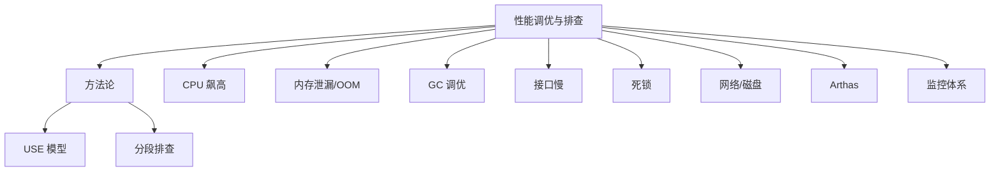

### P0 必背核心

#### 排查方法论（USE / 分段）
- **USE 模型**：每种资源看三项——**Utilization 利用率、Saturation 饱和度（队列堆积）、Errors 错误**。资源包括 CPU、内存、磁盘、网络、文件描述符。
- **分段排查**：用户请求 → 浏览器/客户端 → DNS → CDN → 网关 → 应用 → 缓存 → DB → 下游服务。**逐段定位**问题在哪一层。
- **三段六问法**：是哪个接口慢？发生频率？是全量慢还是部分慢？最近上线了什么？外部依赖是否正常？资源是否充足？
- **黄金 4 指标**：延迟、流量、错误率、饱和度——Google SRE 标准。
- 关联题：#0096

#### 接口慢排查全流程
- ① **看监控**：在哪一层慢（链路追踪 SkyWalking/Zipkin）。
- ② **看指标**：CPU/内存/GC/连接池/慢 SQL。
- ③ **定段**：找到具体慢的下游（DB？缓存？外部 API？）。
- ④ **定根因**：
  - DB 慢 → 看慢查询日志、EXPLAIN 看索引是否失效。
  - 缓存慢 → BigKey / HotKey、网络抖动。
  - 应用慢 → jstack 看线程阻塞、jstat 看 GC、Arthas trace 看方法耗时。
  - 下游慢 → 该下游服务自己排查。
- ⑤ **方案**：加索引 / 加缓存 / 优化代码 / 扩容 / 异步化 / 限流。
- 关联题：#0096

#### CPU 飙高排查
- ① **`top` 看进程 CPU**：找到高 CPU 的 Java 进程 PID。
- ② **`top -H -p <pid>` 看线程级 CPU**：找到具体高 CPU 的线程 TID。
- ③ **`printf "%x\n" <TID>` 转 16 进制**：得到 nid。
- ④ **`jstack <pid> | grep -A 30 <nid>`**：找到对应栈，看在做什么。
- **常见原因**：
  - **死循环 / 算法热点**：栈里反复出现同一方法 → 代码 bug。
  - **频繁 GC**：jstat -gcutil 看 FGC 频率，GC 线程占 CPU 高 → 内存问题。
  - **锁竞争**：栈里大量 BLOCKED → 锁优化。
  - **正则灾难**：复杂正则匹配某些输入指数级爆炸。
- 关联题：#0096

#### 内存泄漏排查
- ① **`jstat -gc <pid> 1000`**：看老年代是否持续增长且 FGC 后不下降。
- ② **`jmap -dump:live,format=b,file=heap.hprof <pid>`**：导出堆快照（live 触发 FGC 只看存活对象，减小文件）。
- ③ **MAT 分析**：
  - **Histogram**：按类统计实例数和占用。
  - **Dominator Tree**：哪些对象持有大量引用。
  - **Leak Suspects 报告**：自动找出可疑泄漏点。
- ④ **常见原因**：
  - 静态集合无限增长（如 static Map 不清理）。
  - **ThreadLocal 不 remove**（Thread 是池里复用的，Entry key 弱引用被 GC 但 value 强引用未清理）。
  - **ClassLoader 泄漏**：Tomcat 热部署、动态生成类（CGLib）。
  - 监听器/回调注册了但没注销。
  - 连接池/线程池资源未关闭。
  - 缓存无上限（Map 当缓存而非用 LinkedHashMap LRU 或 Caffeine）。
- 关联题：#0096

#### OOM 分类与对策
- **Java heap space**：堆满。检查大对象、集合泄漏、缓存无上限、ThreadLocal、`-Xmx` 是否过小。
- **GC overhead limit exceeded**：98% 时间 GC 但回收 < 2% 内存——本质是堆要满了。
- **Metaspace**：类元数据满。检查动态生成类（CGLib、JSP）、ClassLoader 泄漏；`-XX:MetaspaceSize` / `-XX:MaxMetaspaceSize`。
- **Direct buffer memory**：堆外满。Netty / NIO ByteBuffer.allocateDirect 失控；`-XX:MaxDirectMemorySize`（默认等于 -Xmx）。
- **unable to create new native thread**：线程太多超 OS 限制。`ulimit -u` 调大；检查是否有线程池配置不当（Executors.newCachedThreadPool 无上限）。
- **StackOverflowError**：单线程栈深太深（不是 OOM，是 Error）。递归太深 / 栈太小（`-Xss`，默认 1MB）。
- 关联题：#0096

#### JVM 调优入门
- **4C8G 机器示例**（每天 100 万次登录请求）：
  - `-Xms4g -Xmx4g`（避免动态调整，堆大小固定）。
  - `-XX:+UseG1GC`（JDK 9+ 默认）。
  - `-XX:MaxGCPauseMillis=200`（目标停顿，按业务可调）。
  - `-Xss512k`（栈大小，节省并发线程数）。
  - `-XX:MetaspaceSize=256m -XX:MaxMetaspaceSize=512m`。
  - GC 日志：`-Xlog:gc*:file=/var/log/gc.log:time,uptime:filecount=10,filesize=100M`（JDK 9+）。
  - OOM Dump：`-XX:+HeapDumpOnOutOfMemoryError -XX:HeapDumpPath=/var/log/heap`。
- **调优原则**：① 先压测看现状；② 按瓶颈调参；③ 调完再压测验证；不要凭感觉调。
- 关联题：#0096

#### Arthas 实战命令
- **`dashboard`**：实时大盘（线程、内存、GC、Runtime）。
- **`thread`**：`thread -n 5` 看最忙 5 个线程；`thread -b` 看死锁；`thread <id>` 看具体栈。
- **`watch`**：观察方法的入参、返回值、异常。`watch com.x.y.UserService getUser '{params, returnObj, throwExp}' -x 3`。
- **`trace`**：方法耗时分布，跨调用链路。`trace com.x.y.OrderService createOrder`。
- **`tt`**（TimeTunnel）：记录方法每次调用的详情，可重放。
- **`jad`**：反编译已加载的类，看运行时实际字节码。
- **`redefine`** / **`mc`**：热更新 class 文件，**线上修 bug 神器**（注意：仅方法体可改，不能加/删方法/字段）。
- **`monitor`**：方法调用统计（次数、平均 RT、错误数）。
- 关联题：#0096

### P1 加分高频

#### GC 频繁排查
- **YGC 频繁**（每秒多次）：
  - 新生代过小（`-Xmn` 或 G1 自适应）。
  - 对象创建率高（业务 bug，循环 new、字符串拼接）。
  - 大量短命对象（Stream / Lambda 临时对象）。
- **FGC 频繁**（分钟级 / 秒级）：
  - 老年代满 → 看是大对象直接进老年代 / 还是晋升过快 / 还是泄漏。
  - 显式 `System.gc()`（用 `-XX:+DisableExplicitGC` 禁用）。
  - Metaspace 满（连带 FGC）。
- **正常频率**：FGC **几小时甚至几天一次**，几分钟一次就要排查。
- 关联题：#0096

#### 死锁排查
- **`jstack <pid>`**：输出末尾有 "Found one Java-level deadlock"，直接列出循环等待的线程和锁。
- **DB 死锁**：`SHOW ENGINE INNODB STATUS\G` 看 LATEST DETECTED DEADLOCK 段。
- **死锁四大条件**：互斥、占有且等待、不可剥夺、循环等待。
- **避免**：① 固定加锁顺序；② tryLock + 超时；③ 减少锁粒度；④ 用无锁数据结构（CAS / ConcurrentHashMap）。
- 关联题：#0096

#### 数据库慢排查
- ① **慢查询日志**：`slow_query_log=1, long_query_time=1` 记录 > 1s 的 SQL。
- ② **`pt-query-digest slow.log`**：聚合分析慢 SQL TOP N。
- ③ **`EXPLAIN`** 看执行计划，关注 type（至少 range，理想 ref）、key（实际索引）、Extra（Using filesort / Using temporary 警惕）。
- ④ **`SHOW PROCESSLIST`** 看当前活跃连接和 SQL；`State` 看在做什么。
- ⑤ **`SHOW ENGINE INNODB STATUS`** 看锁等待。
- ⑥ **优化方向**：建索引、改 SQL（去 `SELECT *`、避免函数、用 join 替代子查询）、拆表、读写分离、缓存。
- 关联题：#0096

#### Redis 性能问题
- **BigKey**：单个 key value 太大（如 List/Hash 百万元素）。影响：阻塞主线程、网络拥塞、迁移慢。
  - 定位：`redis-cli --bigkeys` 扫描；线上风险高用 `MEMORY USAGE` 抽样。
  - 拆分：把大 Hash 拆成多个小 Hash（按 hash slot 路由）。
- **HotKey**：单个 key 访问频次极高（明星动态、热门商品）。影响：单分片打挂。
  - 定位：`redis-cli --hotkeys`（需开 LFU 策略）；监控埋点。
  - 解决：① 本地缓存（Caffeine）顶住；② key 拆多副本（key_1、key_2... 客户端随机选）。
- **慢命令**：KEYS（O(N) 阻塞）、HGETALL 大 Hash、SORT、SUNION 大集合。
- 监控：`SLOWLOG GET 10` 查最近慢命令。

#### 网络问题排查
- **`ss -lntp`**：看监听端口。
- **`ss -ant | awk '{print $1}' | sort | uniq -c`**：统计各连接状态数量（ESTABLISHED / TIME_WAIT / CLOSE_WAIT / SYN_RECV）。
- **`netstat -s`**：统计协议层异常（重传、丢包、SYN cookies 触发）。
- **`tcpdump -i eth0 host X port Y -w out.pcap`**：抓包，用 Wireshark 分析。
- **常见问题**：
  - CLOSE_WAIT 堆积 → 应用没 close 连接，代码 bug。
  - TIME_WAIT 堆积 → 大量短连接，改长连接或调 `tcp_tw_reuse`。
  - 端口耗尽 → 调 `net.ipv4.ip_local_port_range`。

#### 磁盘 IO 排查
- **`iostat -x 1`**：
  - `%util > 80%` → 磁盘繁忙。
  - `await > 20ms`（机械盘）/ `> 5ms`（SSD）→ IO 延迟高。
  - `r/s w/s` → IOPS。
  - `rkB/s wkB/s` → 吞吐。
- **`iotop`**：找哪个进程 IO 高。
- **`pidstat -d 1`**：进程级 IO 统计。
- **常见原因**：① 大日志频繁写；② 大查询扫盘；③ 备份/对账；④ 频繁刷脏页。

#### 应用监控指标
- **业务**：QPS / TPS / 响应时间 P95/P99/P999 / 错误率 / 成功率。
- **资源**：CPU / 内存 / 磁盘 / 网络。
- **JVM**：堆占用 / 老年代占用 / YGC FGC 频率耗时 / 线程数 / Metaspace。
- **中间件**：DB 连接池占用 / Redis 命中率 / MQ 堆积。
- **慢调用 TOP N**：识别系统瓶颈。

### P2 深度延伸

#### CMS Concurrent Mode Failure
- CMS 并发回收老年代时，对象晋升老年代速度超过 CMS 回收速度，老年代被占满。
- CMS 退化为 **Serial Old**（单线程标记-整理），STW 超长（秒级甚至分钟级）。
- 触发条件：老年代占用超过 `-XX:CMSInitiatingOccupancyFraction`（默认 92%）后才启动 CMS 收集太晚。
- 解决：降低触发阈值、增大老年代、检查是否有大对象直接晋升。

#### G1 Mixed GC 失败 → Full GC
- G1 Mixed GC（年轻代 + 部分老年代回收）失败 → 退化为 Serial GC Full GC。
- 触发：Region 选不出来 / 转移失败（to-space exhausted）。
- 解决：提前 GC（-XX:InitiatingHeapOccupancyPercent，默认 45%）、增大堆、调整 Region 大小。

#### Full GC 全流程分析
- **是大对象直接进老年代吗**：看 `-XX:PretenureSizeThreshold`。
- **是晋升过快吗**：看 jstat 中 OU 增长速率，结合 MaxTenuringThreshold（默认 15）。
- **是 Survivor 不够吗**：YGC 时 Survivor 放不下直接晋升。
- **是显式 System.gc() 吗**：开 `-XX:+DisableExplicitGC` 或 RMI 间隔 `-Dsun.rmi.dgc.client/server.gcInterval`。
- **是 Metaspace 满吗**：连带触发 Full GC。

#### 火焰图分析
- **async-profiler**：低开销，采样 CPU / 内存分配 / Lock / Wall-clock；生成 SVG 火焰图。
- **使用**：`./profiler.sh -d 60 -f flame.svg <pid>`，60 秒采样输出火焰图。
- **解读**：横轴宽度 = 占用 CPU 比例；纵轴 = 调用栈深度。最宽的栈帧就是 CPU 热点。

#### 监控体系
- **采集**：Prometheus 拉模式 / Exporter（JMX Exporter、Node Exporter、MySQL Exporter）。
- **存储**：Prometheus TSDB（短期）+ Thanos / VictoriaMetrics（长期）。
- **可视化**：Grafana 仪表盘。
- **告警**：AlertManager 路由 → 钉钉 / 企业微信 / 电话。
- **日志**：ELK（Elasticsearch + Logstash + Kibana）或 EFK（Fluentd）；日志收集 → 集中存储 → 检索分析。
- **链路追踪**：SkyWalking / Zipkin / Jaeger。
- **APM 一体化**：SkyWalking 8.x 起整合指标 + 日志 + 追踪 + 拓扑。

#### 压测方法
- **单接口压测**：JMeter / wrk / ab，找单接口瓶颈。
- **全链路压测**：阿里 PTS、字节火山 / 京东东方雪、自研。生产环境构造真实流量，影子库 / 影子表隔离。
- **混沌工程**：ChaosBlade（阿里）/ Chaos Mesh（PingCAP），主动注入故障（杀进程、网络抖动、CPU 满载）。
- **目标**：① 找拐点；② 验证容量预案；③ 暴露隐藏问题。

### P3 冷门刁钻

#### 安全点（Safe Point）卡顿
- **可数循环 counted loop**（int i = 0; i < N; i++）JIT 优化时可能去掉循环回边的 Safe Point Poll，导致单线程长循环阻塞其他线程进入 GC。
- 表现：jstack 显示大部分线程在 Waiting for safepoint。
- 解决：JDK 10+ `-XX:+UseCountedLoopSafepoints` 默认开启；早期 JDK 改 long 替代 int 或人为打断循环。

#### CPU 假高（GC 线程占用）
- jstack 看 nid 对应的栈不是业务代码，是 `GC Thread #N` / `G1 Conc#0` 这种，说明 CPU 是 GC 占的——本质是内存问题不是 CPU 问题，去查 GC。

#### 内核参数调优
- `net.ipv4.tcp_tw_reuse=1`：复用 TIME_WAIT。
- `net.core.somaxconn`：监听队列长度（默认 128，高并发要调到 65535）。
- `net.ipv4.tcp_max_syn_backlog`：半连接队列。
- `vm.swappiness=10`：尽量不用 swap。
- `fs.file-max` / `ulimit -n`：fd 上限。

#### Java 21 虚拟线程对调优的影响
- 大量阻塞 IO 场景下 Carrier Thread 数 = CPU 核数即可，不用调大线程池。
- 监控指标新增"挂起的虚拟线程数"——传统线程池监控失效。
- pinned（被钉住）：synchronized 块内做 IO 会钉住 Carrier Thread，改用 ReentrantLock。

### 跨模块联想

- JVM 排查 ↔ **02 JVM**：jstat/jmap/jstack/Arthas 是 JVM 知识的工具化。
- 接口慢 ↔ **05 MySQL**：慢 SQL + EXPLAIN 是必修。
- 接口慢 ↔ **06 Redis**：BigKey/HotKey、慢命令排查。
- 死锁排查 ↔ **03 并发**：jstack 自动检测 Java 死锁；DB 死锁靠 SHOW ENGINE INNODB STATUS。
- 网络问题 ↔ **13 网络**：TIME_WAIT/CLOSE_WAIT 背后的 TCP 协议。
- 链路追踪 ↔ **08 微服务**：SkyWalking traceId 透传定位慢段。
- 监控体系 ↔ **08 微服务**：Prometheus + Grafana + 告警是服务治理标配。
- 火焰图 ↔ **02 JVM**：async-profiler 看 CPU 热点比 jstack 更精准。
- 内核调优 ↔ **13 网络**：高并发服务必调内核参数。

---

## 17 数据结构与算法

> 模块定位：高级岗会问"为什么用 X 数据结构"而不是手撕题。重点是**应用场景 + 复杂度权衡**。27 题。
> 题量：27 题。

```mermaid
flowchart TD
  A[数据结构与算法] --> B[线性结构]
  A --> C[树]
  A --> D[图]
  A --> E[哈希]
  A --> F[堆]
  A --> G[排序]
  A --> H[查找]
  A --> I[海量数据]
  A --> J[字符串]
  C --> C1[BST/AVL/红黑树]
  C --> C2[B/B+ 树]
  C --> C3[Trie]
  F --> F1[大顶堆/小顶堆]
  I --> I1[Top K]
  I --> I2[BitMap/布隆]
```

### P0 必背核心

#### 数组 vs 链表
- **数组**：连续内存，随机访问 O(1)、中间插入删除 O(n)；CPU 缓存友好；扩容代价大。
- **链表**：节点分散，随机访问 O(n)、头尾增删 O(1)；缓存不友好；额外指针开销。
- **跳表 SkipList**：链表 + 多级索引，查询 O(log n)，实现简单（vs 红黑树）；Redis ZSet、LevelDB MemTable 用。
- 关联题：#0040

#### 哈希表（HashMap 视角）
- **结构**：数组 + 冲突解决（开放寻址 / 链地址法）。Java HashMap 用链地址法 + 1.8 后链表过长转红黑树。
- **复杂度**：平均 O(1)，最坏 O(n)（全冲突，攻击场景）。
- **冲突解决对比**：
  - **开放寻址**：探测下一个空位（线性 / 二次 / 双重哈希）。ThreadLocalMap 用。
  - **链地址**：每槽位挂链表。HashMap 用。
- **负载因子**：HashMap 0.75 经验值，平衡空间和冲突率。
- 关联题：#0040

#### 二叉树家族（BST/AVL/红黑树）
- **BST 二叉搜索树**：左 < 根 < 右，平均 O(log n) 但最坏退化成链表 O(n)。
- **AVL 树**：严格平衡（左右子树高度差 ≤ 1），查询稳定 O(log n)；插入删除旋转多，写性能不如红黑树。
- **红黑树**：5 条性质（根黑、叶 NIL 黑、红节点子必黑、任一路径黑节点数同、新插入红色）。**牺牲部分查询性能换更少旋转**，工程上更常用。
- **应用**：HashMap 链表过长转树、TreeMap、ConcurrentHashMap 1.8、Linux 内核 CFS 调度。
- 关联题：#0040

#### B 树 / B+ 树（数据库索引）
- **B+ 树**：① 只有叶子节点存数据；② 叶子节点用双向链表串联；③ 非叶节点存索引键和指针。
- **MySQL InnoDB 用 B+ 树**：扇出大（每页存千+ key）、树高低（3-4 层管亿级数据）、范围查询快（沿叶子链表）。
- **vs B 树**：B 树每节点都存数据 → 单页 key 数少 → 树高高 → 磁盘 IO 多；范围查询要回溯。
- **InnoDB 一页 16 KB**：根据指针大小 + 键长度算出每节点能存的 key 数。
- 关联题：#0037

#### 堆与 PriorityQueue
- **堆是一种特殊的完全二叉树**：父 ≥ 子（大顶堆）或父 ≤ 子（小顶堆）；用数组实现，父子下标关系 `parent = (i-1)/2, left = 2i+1, right = 2i+2`。
- **操作**：插入 O(log n)（上浮）、删除堆顶 O(log n)（下沉）、查堆顶 O(1)。
- **应用**：① **Top K 问题**（小顶堆，O(n log k)）；② **优先队列**（任务调度、Dijkstra 最短路径）；③ **堆排序**（O(n log n) 不稳定排序）；④ **DelayQueue**（按时间排序的优先队列）；⑤ **定时器**（时间轮也是变形）。
- **Java**：`PriorityQueue` 默认小顶堆，可传 Comparator 改大顶堆 `new PriorityQueue<>(Comparator.reverseOrder())`。
- 关联题：#0040

#### Top K 问题
- **场景**：海量数据找最大 / 最小的 K 个，K << N。
- **小顶堆法**：维护大小为 K 的小顶堆，遍历元素 > 堆顶就替换并下沉。时间 O(n log k)，空间 O(k)。
- **快速选择 BFPRT**：基于快排 partition 选择第 K 大，平均 O(n)、最坏 O(n²)（BFPRT 改进到最坏 O(n)）。
- **分布式 Top K**：① 各机算 top K；② 汇总各机的 top K 再算全局 top K；不一定准（边界情况），可调 N 提高准度。
- 关联题：#0039、#0040

### P1 加分高频

#### 排序算法对比
- **快速排序**：平均 O(n log n)，最坏 O(n²)；不稳定；原地排序（空间 O(log n) 栈）。**Java Arrays.sort 基本类型用双轴快排**。
- **归并排序**：稳定 O(n log n)；额外空间 O(n)；**外部排序用归并**（大数据分块）。
- **堆排序**：O(n log n)，原地，不稳定；适合 Top K。
- **TimSort**：归并 + 插入混合，对部分有序数据极快。**Java Arrays.sort 对象数组用 TimSort**（保证稳定）。
- **计数 / 桶 / 基数排序**：线性 O(n+k)，适合数据范围有限。
- 关联题：#0040

#### 二分查找及变体
- **基础**：有序数组找目标，O(log n)；要点是 `mid = left + (right - left) / 2`（防溢出）。
- **变体**：
  - 找第一个 ≥ target（lower_bound）：`left <= mid` 时 right = mid - 1 移动方式不同。
  - 找最后一个 ≤ target（upper_bound）。
  - 旋转数组中查找。
  - 在两个有序数组中找第 K 小（Median of Two Sorted Arrays）。
- **Java**：`Arrays.binarySearch(arr, target)` 返回索引或负数（插入点的 -(insertion point) - 1）。

#### 跳表 SkipList
- **结构**：每个节点有多层指针，上层是下层的"索引"。第 i 层节点以 1/2 概率出现在第 i+1 层。
- **复杂度**：平均查询 O(log n)，期望空间 O(n)（额外常数倍空间存上层）。
- **优势**：实现简单（vs 红黑树）、范围查询友好（底层是链表）、易并发改造。
- **应用**：Redis ZSet（跳表 + Hash 表）、LevelDB / RocksDB MemTable、Lucene 倒排链。
- **Redis 为啥用跳表而不用红黑树**：① 范围查询天然支持；② 实现简单；③ ZRANGE 顺序访问性能好。
- 关联题：#0040

#### LRU / LFU 实现
- **LRU**：HashMap + 双向链表。HashMap 存 key→Node，访问 / 插入时把 Node 移到链表头，超容量淘汰链表尾。Java `LinkedHashMap` 内置（accessOrder=true）。
- **LFU**：HashMap + 频次表 + 双向链表（每频次一个链表）。复杂度也是 O(1) 但实现更复杂。
- **应用**：Redis maxmemory-policy allkeys-lru/lfu、操作系统页面置换、CDN 缓存。

#### 字符串 KMP / Trie
- **KMP**：模式串匹配。预处理 next 数组（最长公共前后缀），失配时不回退主串。复杂度 O(m + n)。
- **Trie 前缀树**：字符串集合的树形结构，每个节点代表一个字符；插入 / 查询 O(L)（L 是串长）。**应用**：自动补全、字典、IP 路由表、敏感词过滤。
- **AC 自动机**：Trie + KMP，多模式串匹配；敏感词检测、HTTP 头匹配。

#### 动态规划基本思想
- **三要素**：① 状态定义；② 状态转移方程；③ 边界条件。
- **优化**：滚动数组减空间；记忆化搜索 = 自顶向下 DP。
- **经典题型**：背包（0-1 / 完全 / 多重）、最长上升子序列（LIS）、最长公共子序列（LCS）、编辑距离、股票买卖、打家劫舍。
- **判断 DP**：① 求最值 / 计数 / 可行性；② 有重叠子问题；③ 子问题独立。

#### 回溯 / 分治
- **回溯**：暴力穷举所有可能路径，剪枝。经典：N 皇后、全排列、子集、组合总和、数独。
- **分治**：把问题分成多个子问题独立解决再合并。经典：归并排序、快速排序、Karatsuba 大数乘法、最近点对。

### P2 深度延伸

#### 海量数据处理套路
- **存在性 / 去重**：
  - 数据少（GB 级）：HashSet。
  - 数据中（TB 级）：BitMap（每数 1 bit）；范围 0-10 亿 占 125 MB。
  - 数据极大且允许误判：**布隆过滤器 BloomFilter**——多个 hash 函数 + bit 数组，"不存在一定不存在，存在可能误判"。
- **排序**：内存装不下用 **外部排序**（分块内存排序 + 多路归并）。
- **Top K**：小顶堆 / 分布式归并。
- **频次统计**：HashMap 直接统计 / Count-Min Sketch（近似）。
- **基数估计**：HyperLogLog（Redis 内置，12 KB 估亿级基数，误差 0.81%）。

#### 布隆过滤器
- **原理**：bit 数组 + k 个独立 hash 函数；插入时 k 个位都置 1；查询时 k 个位都为 1 才说"可能存在"，否则一定不存在。
- **误判率公式**：`(1 - e^(-kn/m))^k`，n 是元素数、m 是 bit 数。Guava BloomFilter 默认 fpp = 3%。
- **应用**：
  - 缓存穿透（先布隆过滤拦截不存在的 key）。
  - 黑名单（如垃圾邮件地址）。
  - HBase / LevelDB 内部判断 key 是否在某个 SSTable。
- **变种**：Counting BloomFilter（支持删除）、Cuckoo Filter（误判率更低 + 支持删除）。

#### HyperLogLog
- **目的**：估算大集合的基数（不重复元素数）。
- **原理**：哈希后看二进制末尾连续 0 的最大长度；多分桶取调和平均；12 KB 估亿级，误差 0.81%。
- **Redis**：PFADD / PFCOUNT / PFMERGE。**典型场景**：UV 统计（千万用户精确 1 KB×千万 = 10 GB，HLL 12 KB 全搞定）。

#### Trie 树压缩 / Patricia Tree
- 长链 / 单分支压缩成一条边带字符串；用于 IP 路由表、文件系统路径索引（Linux dentry）、Ethereum MPT。

#### 图基础
- **存储**：邻接矩阵（V²，稠密）vs 邻接表（V+E，稀疏）。
- **遍历**：DFS（递归 / 栈，找路径）、BFS（队列，最短路径）。
- **最短路径**：① Dijkstra（无负权，优先队列）；② Bellman-Ford（含负权）；③ Floyd（多源最短，O(V³)）；④ A*（启发式）。
- **最小生成树**：Prim（优先队列）、Kruskal（按边排序 + 并查集）。
- **拓扑排序**：BFS Kahn 算法 / DFS 后序逆序；找环。

### P3 冷门刁钻

#### 一致性 Hash 实现
- TreeMap（红黑树）维护 hash → 节点映射；查询时 ceilingEntry 找顺时针下一个节点。虚拟节点解决倾斜。

#### 蓄水池抽样
- 数据流中均匀抽 K 个样本（不知道总数 N）：① 前 K 个直接放入；② 第 i 个（i > K）以 K/i 概率替换池中一个随机位置。
- 应用：海量日志均匀抽样、流式数据 Top K 近似。

#### 时间轮算法
- 大量定时任务调度（百万级）。环形数组 + 链表，时针推进；多层时间轮处理长延迟。
- 应用：Kafka 延迟生产、Netty HashedWheelTimer、Linux 内核 timer。

#### LSM 树 vs B+ 树
- **LSM**：写放大但顺序写极快（HBase、LevelDB、RocksDB、Cassandra）；多层 SSTable + 后台 Compaction。
- **B+ 树**：随机写、读快。
- **选型**：写多读少（日志、监控）用 LSM；读写均衡（OLTP）用 B+ 树。

### 跨模块联想

- B+ 树 ↔ **05 MySQL**：InnoDB 索引的核心；为啥不用 B 树 / 红黑树 / Hash。
- 红黑树 ↔ **01 Java 基础**：HashMap 链表过长转红黑树、TreeMap。
- 跳表 ↔ **06 Redis**：ZSet 用跳表 + Hash 表。
- 堆 ↔ **15 业务场景**：Top K 排行榜、延迟队列。
- LRU ↔ **06 Redis**：maxmemory-policy 淘汰策略。
- 布隆过滤器 ↔ **06 Redis**：缓存穿透防护。
- HyperLogLog ↔ **06 Redis**：UV 统计。
- 一致性 Hash ↔ **11 分库分表**：分片路由。
- 时间轮 ↔ **20 任务调度**：海量定时任务。
- 字典树 ↔ **15 业务场景**：敏感词过滤、自动补全。

---

## 18 AI 与大模型

> 模块定位：2024-2025 面试新增"必问区"，高级 Java 岗已经成为标配考点。重点是**大模型基础认知 + Function Calling/MCP/A2A 协议族 + RAG/Agent 架构 + Spring AI/LangChain4j 集成**。
> 题量：30 题（数量不算多，但内容全是 2024-2025 业界最新认知，考察"是否真的在用 AI"）。

```mermaid
flowchart TD
  A[AI 与大模型] --> B[基础认知]
  A --> C[让模型用工具]
  A --> D[Agent 架构]
  A --> E[Java 集成]
  A --> F[AI Coding 工具链]
  A --> G[幻觉与选型]
  B --> B1[Transformer/参数/GPU]
  B --> B2[API 参数/temperature]
  C --> C1[Function Calling]
  C --> C2[MCP 协议]
  C --> C3[A2A 协议]
  C --> C4[Skill 机制]
  D --> D1[单 Agent vs 多 Agent]
  D --> D2[ReAct 循环]
  D --> D3[Memory/Plan/Tool]
  E --> E1[Spring AI]
  E --> E2[LangChain4j]
  E --> E3[Spring AI Alibaba]
  F --> F1[Vibe Coding]
  F --> F2[Cursor/Claude Code]
  F --> F3[Prompt/Context/Harness 工程]
  G --> G1[幻觉成因/RAG/微调]
```

### P0 必背核心

#### 怎么理解大模型 / Transformer
- "大"主要体现在**参数规模**：7B 即 70 亿参数、70B 即 700 亿。参数越多通常能力越强，但推理成本也越高。
- 底层架构是 **Transformer**，核心是**自注意力机制（Self-Attention）+ 多头注意力**，相比 RNN/CNN 具有更强的**并行计算能力**和**更长的上下文理解能力**——这也是为什么训练必须用 GPU。
- 工作原理本质是**"概率填空"**：根据上文预测下一个 token 的概率分布，再按策略采样。它不"思考"，只是在算下一个词。
- **应用范围**远不止 NLP：CV（Stable Diffusion/DALL·E）、语音（Whisper/VALL-E）、自动驾驶（Tesla FSD）、科学计算（AlphaFold）、视频生成（Sora）等。
- 当前关键问题：数据隐私、**幻觉（Hallucination）**、能耗高（一次训练 ~ 数千吨 CO₂ 当量）、可控性与安全性。
- 关联题：#0407、#0397、#0733

#### 大模型擅长 vs 不擅长
- **擅长**：文本生成/总结/翻译/信息抽取、代码生成与解释、广泛知识问答、多模态生成（文本→图/视频/语音）、从非结构化文本提取 JSON/表格。
- **不擅长**：① 精确数值计算（经典翻车题"3.9 和 3.11 哪个大"）；② 长推理链的严密逻辑；③ 实时信息（训练截止后不知道）；④ 长尾/冷门专业知识；⑤ 主动学习新知识；⑥ 给出医学、法律等不可错的专业建议。
- 工程含义：**精确计算交给工具（Function Calling/Code Interpreter）**，实时信息交给 **RAG/联网**，专业领域交给**微调 + RAG**。
- 关联题：#0397

#### GPU vs CPU & 为什么大模型必须用 GPU
- **CPU**：核心数少但单核强，适合通用复杂任务、串行逻辑、操作系统调度。
- **GPU**：核心数多（数千 SP/CUDA Core）但单核弱，专为**并行重复计算**设计。
- 大模型训练/推理本质是**大量矩阵运算**（自注意力的 Q·Kᵀ、前馈层），可被拆解成大量同构小任务并行执行——天然契合 GPU 架构。
- 推论：挖矿（重复哈希计算）、深度学习训练、视频渲染都用 GPU 是同一个底层原因。
- 关联题：#0733

#### 大模型 API 核心参数
- **api_key**：身份验证，在 HTTP Header `Authorization: Bearer <key>` 中。
- **base_url**：服务地址。各家不同：OpenAI `https://api.openai.com/v1`、DeepSeek `https://api.deepseek.com/v1`、通义 `https://dashscope.aliyuncs.com/compatible-mode/v1`、Ollama 本地 `http://localhost:11434/v1`。注意 Spring AI 默认拼 `/v1/chat/completions`，LangChain 默认拼 `/chat/completions`，配置时要看框架习惯。
- **model**：指定模型，如 `gpt-4o`、`qwen-plus`、`deepseek-chat`。
- **messages**：消息数组，`role` 取 `system`/`user`/`assistant`，多轮对话靠它累计历史。
- **temperature**：温度系数，0.0-2.0（部分 0-1）。**低值更稳定/确定**（事实问答、代码、法律用 0.1），**高值更发散/有创意**（写作头脑风暴用 0.9），默认 0.7。
- **top_p**：核采样（Nucleus Sampling），从概率累计 top_p 的候选词中采样。**和 temperature 二选一**调，同时调容易不可控。
- **max_tokens**：单次输出最大 token 数，防止失控长输出 / 控成本。
- **stream**：是否流式返回。`true` 时逐 token 推送（SSE），用户体验好，长回答必开。
- **stop**：停止符（字符串或数组），生成到匹配立即结束，常用于结构化输出截断。
- **seed**：相同 seed + 相同输入尽量复现同样输出，**不保证 100%**。
- 关联题：#0023

#### Function Calling（函数调用 / 工具使用）
- **本质**：让大模型"会用工具"的方案——大模型无法直接执行代码或联网，但可以**告诉应用层"调哪个函数 + 传什么参数"**。
- **核心流程（5 步）**：① 应用把可用工具的 JSON Schema 描述 + 用户问题一起发给 LLM；② LLM 决定调哪个工具、给出参数；③ **应用层（你的 Java/Python 代码）真正执行工具**；④ 把执行结果回填给 LLM；⑤ LLM 根据结果生成最终自然语言回答。
- **工具描述格式**：JSON Schema，包含 `name`、`description`、`parameters`（含 `type`、`required`、`enum` 等）。`description` 写得好不好直接决定 LLM 选不选你的工具。
- **关键认知**：LLM 永远不执行工具，只生成调用意图。所有"安全/权限/数据库写入"控制点都在应用侧。
- **并行调用（Parallel Tool Use）**：现代模型（GPT-4o、Claude 3.5+）可在一轮里返回多个工具调用，应用并发执行后一起回填，可显著降低延迟。
- 关联题：#0014

#### MCP（Model Context Protocol）
- **定位**：Anthropic 2024 年提出的**开源标准协议**，统一大模型与外部工具/数据源的接入方式。**类比"AI 界的 USB-C"**——只要遵守协议，工具和模型即插即用。
- **三大核心组件**：① **MCP Host**（Claude Desktop、Cursor、IDE 等 AI 入口）；② **MCP Server**（轻量服务，封装 GitHub API / 数据库 / 本地文件系统等具体工具，通常**别人写好的现成 Server 可以直接用**）；③ **MCP Client**（协议客户端，维护与 Server 的连接）。
- **和 Function Calling 的区别**：Function Calling 是 OpenAI 提出的模型内部能力，每接一个工具都要重新写代码；MCP 是**生态级协议**，工具一次封装到处复用。可以理解为 Function Calling 是 USB 设备的"插槽"，MCP 是统一了"插头形状"的标准。
- **典型流转**：用户提问 → Host 把问题 + 已挂载 Server 列表给 LLM → LLM 选工具 → MCP Client 调对应 Server 执行 → 结果回给 LLM → 生成最终回答。
- 关联题：#0328、#0026

#### A2A（Agent-to-Agent Protocol）
- **定位**：Google 推出的协议，解决**多个独立部署的 Agent 之间互相调用与协作**的问题，类似 RPC 之于微服务。
- **和 MCP 的本质区别**：**MCP 是 Agent ↔ 工具**之间的协议，**A2A 是 Agent ↔ Agent**之间的协议。
- **核心概念**：① **Agent Card**——每个 Agent 对外声明自己能做什么的"名片"（类似 Swagger）；② **Task**——客户端 Agent 基于 Card 构造任务；③ **Message**——任务封装在 request/response Message 中传输；④ **Artifact**——任务产出物（文件、图片、报告等）。
- **使用场景**：跨团队、跨公司、跨语言（Java Agent 调 Python Agent）的 Agent 协作。自己一个项目内的多 Agent **不需要 A2A**，直接代码编排即可。
- 关联题：#0033

#### Skill 机制 & 和 MCP 的关系
- **Skill** 是 **Anthropic** 提出的新范式，解决的是**上下文太长**的问题——是上下文工程（Context Engineering）的典型实现。
- **类比**：Agent 是厨师，MCP/Function Calling 是锅碗瓢盆和食材，**Skill 就是菜谱**——告诉厨师"这道菜该怎么做"。
- **结构**：本质是一个**标准化目录**，最少包含 `SKILL.md`（必选，技能说明 + 指令约束），可选 `scripts/`（确定性脚本）、`references/`（参考资料）、`assets/`（图片等）。
- **渐进式披露机制**（核心设计）：分阶段加载，避免一次性吃光上下文。① **发现阶段**：只读取 SKILL.md 的 frontmatter 元数据；② **决策阶段**：决定用这个 Skill 时才加载完整 Instruction；③ **细节阶段**：Reference 只在明确需要时才进上下文；④ **确定性执行阶段**：流程中不适合 LLM 自由生成的部分调 Script 走确定性逻辑。
- **总结口诀**："**Agent = 干活的人，MCP = 能用的工具，Skill = 这活该怎么干**"。
- **Skill 自进化**（Hermes Agent 引入）：任务完成后自动复盘、抽象成新 Skill 文件，下次同类任务直接调用——Skill 从"静态调用"变成"动态生成"。
- 关联题：#0026、#0027、#0013

#### AI Agent（智能体）
- **核心公式**：**Agent = LLM + Memory + Tools（使用 + 规划）**。这张图来源是 Lilian Weng 的 LLM-powered Autonomous Agents。
- **三大能力**：① **感知（Perception）**——接收用户输入 + 历史记忆；② **决策（Planning + Decision）**——基于感知信息选工具、定计划；③ **行动（Action）**——执行工具调用。
- **Memory**：短期记忆（当前对话窗口/上下文）+ 长期记忆（跨会话的事实、偏好，通常用向量库存）。
- **Planning**：规划能力，决定何时用哪些工具。简单的就是 ReAct 一步步走；复杂的有 Plan-and-Execute（先出完整计划再执行）、Reflection（执行后反思）。
- 关联题：#0112

#### ReAct Agent（最经典的 Agent 模式）
- **核心思想**：让 LLM 像人一样**思考 + 行动 + 观察**循环：**Thought → Action → Observation → Thought → ...**
- **三步循环**：① **Thought**——分析当前状态、决定下一步；② **Action**——调用工具或返回 Finish；③ **Observation**——记录工具执行结果，反馈给 LLM 继续下一轮。
- **实现两要点**：① **Prompt 必须约束模型按 Thought/Action/Observation 格式输出**（很多 ReAct 失败都是 Prompt 没写好）；② **应用层代码负责循环编排**——LLM 不会自己执行工具，开发者要写 while 循环，直到 LLM 输出 Finish 才退出。
- **伪代码**：
  ```
  while (true) {
    思考 = LLM(prompt + history);
    if (思考.是Finish) break;
    工具结果 = 执行工具(思考.action);
    history += 工具结果;
  }
  ```
- 关联题：#0032

#### 单 Agent vs 多 Agent 架构（高频拷问）
- **结论**：**优先单 Agent**！"奥卡姆剃刀"——不要为简单问题增加复杂度。面试时如果回答"上来就用多 Agent"，基本可以判定缺乏工程经验。
- **单 Agent 适用**：① 线性流式任务（PDF → 提取 → 翻译 → 发邮件）；② 单一领域（NL2SQL、私有文档 RAG）；③ 低延迟/低成本场景。
- **多 Agent 拆分判断标准**（满足至少 2 个才考虑拆）：① **角色分离**（代码生成 vs 代码审查，避免"自己审自己"）；② **工具集差异大**（一组要联网，一组要操作沙箱，混在一起选错工具概率飙升）；③ **并行收益明显**（多个子任务可同时跑）；④ **超长流程/复杂状态**（自动修 Bug，单 Agent 几十步后容易在上下文里"钻牛角尖"）；⑤ **异步超长期并发**（百 NPC AI 沙盒，每个独立记忆）。
- 关联题：#0005

#### RAG（Retrieval-Augmented Generation 检索增强生成）
- **为什么需要**：① LLM 训练有截止日期，**不知道新事件**；② **私域知识**没学过；③ **降低幻觉**——让模型"基于检索到的资料"回答而不是凭空生成。
- **构建三步**：① **前置准备**——把私有知识用 Embedding 模型转向量，存进向量库；② **检索查询**——用户问题用**同一个** Embedding 模型转向量，去向量库做相似度检索，取 top-k；③ **生成回答**——把"用户问题 + 检索到的资料"拼成 Prompt 喂给 LLM。
- **关键工程点**：① **分块（Chunking）策略**——按段落/语义/固定 token 切分，太大噪声多、太小语义碎；② **Embedding 模型选型**（中文常用 BGE、M3E、通义 text-embedding）；③ **混合检索**——向量检索 + 关键词（BM25）一起做，重排后再喂模型，召回率更高；④ **重排（Rerank）**——用专门的 Cross-Encoder 模型对 top-k 重新打分，比纯向量更精准。
- **典型适用**：知识库问答、客服、文档助手、企业内问答。
- 关联题：#0351

#### 向量数据库
- **定义**：专门存储/索引/查询**高维向量**的数据库，核心是支持**相似度搜索（ANN, Approximate Nearest Neighbor）**。
- **为什么传统库不行**：MySQL/MongoDB 没有针对向量的索引结构，高维空间精确搜索是 O(N·D) 级别，亿级数据下根本扛不住。
- **三种相似度度量**：① **余弦相似度（Cosine）**——最常用，看夹角，方向相同则相似；② **欧氏距离（L2）**——绝对距离；③ **内积（Dot Product）**——配合归一化向量等价于余弦。
- **常见向量库**：
  - **pgvector**：PostgreSQL 扩展，**已有 PG 直接装最香**，SQL + 向量混合查询，运维省心；中小规模（百万级）。
  - **Milvus**：云原生分布式，亿级以上首选，多索引类型（HNSW/IVF），但部署复杂。
  - **Qdrant**：Rust 写的高性能向量库，HNSW + 复杂元数据过滤，中等规模性能优。
  - **Chroma**：轻量级，内存可跑，原型/小项目首选。
  - **Elasticsearch**：已经在用 ES 的可以直接复用，全文 + 向量混合检索方便。
- 关联题：#0076

#### 大模型幻觉（Hallucination）成因与解决
- **本质**：大模型是**概率填空预测器**，根据训练数据的统计规律选下一个 token，**不会主动验证事实**——所以会"一本正经地胡说八道"。
- **四大成因**：① 训练数据本身有错误/偏见/过时；② Transformer 本质机制就是概率预测；③ 缺乏事实验证能力（没有人类的"我不确定"机制）；④ 长上下文中容易遗忘前文（上下文窗口有限）。
- **8 大解决方案**：① **RAG**（最主流，先检索再回答）；② **Fine-tuning 微调**（让模型学专业领域知识）；③ **Prompt 约束**（"不知道就直接说不知道"、"必须给出引用"）；④ **RLHF 反馈调优**；⑤ **多次生成投票**（self-consistency）；⑥ **自我检查**（让模型回答后再审一遍自己的答案）；⑦ **联网检索**（实时获取最新数据）；⑧ **CoT 思维链**（先写推理过程再下结论）。
- 关联题：#0386

### P1 加分高频

#### Prompt 工程 vs Context 工程 vs Harness 工程
- 三者是**层层嵌套的包含关系**，不是替代。**Prompt ⊂ Context ⊂ Harness**。
- **Prompt 工程**——给新员工"布置任务"。核心是怎么写一句话让模型更听话，关注角色设定、Few-shot 示例、结构化指令。
- **Context 工程**——除了布置任务还**给他准备资料**。核心是在有限上下文窗口内塞最有用的信息，包括 RAG、长上下文裁剪/排序、Memory 注入、Tool 结果回填、多源信息融合。
- **Harness 工程**——为新员工**搭建一整套工作体系**。重点不在"说什么"，而在"怎么跑"——包含执行闭环（Plan-Execute-Observe-Reflect）、分层记忆（工作/会话/长期）、安全护栏（输入输出校验、危险操作拦截）、环境隔离（沙箱）、自愈能力（错误反馈给模型纠正）、可观测性（每一步可追踪可回放）。
- **法律问答系统例子**：Prompt 工程只是写"你是律师，回答时引用法条"；Context 工程会做"检索条文 → 压缩 → 拼接"；Harness 工程则把整个 pipeline 串成"查询重写 → 检索 → LLM 回答 → 事实校验 → 低置信度 fallback → JSON Schema 输出 → 自动评测"。
- 关联题：#0009

#### Vibe Coding（氛围编程）
- **概念**：2025 年初 **Andrej Karpathy**（前 OpenAI 联创、特斯拉 AI 总监）提出，描述一种**完全由 LLM 驱动**的编程新范式——"程序员不写代码，只提需求，错了再丢给 AI 改"。
- **核心特征**：① 自然语言即代码（编程语言变中间件）；② "黑盒"开发（不必理解每一行）；③ 极快迭代（提想法 → AI 生成 → 跑 → 报错丢回 AI）。
- **和 Copilot 模式区别**：Copilot 是"手写主干，AI 补片段"；Vibe Coding 是"自然语言描述，AI 生成整体"。
- **典型工具**：Cursor、Claude Code、Qoder、TRAE。
- **风险**：① 不理解底层代码导致难维护；② 盲信 AI 引入安全漏洞（SQL 注入、权限问题）；③ 涉及并发/内存/复杂算法时 AI 一次解不掉；④ 幻觉依赖——AI 胡说八道时新手识别不出来。
- 关联题：#0017、#0010

#### Vibe Coding 面试题的考察点
- 2025 年校招/社招开始流行 Vibe Coding 环节：给一个 AI IDE + 一个题目，限时完成。
- **不是考你写代码**，是考**思考与指挥能力**。考察 5 个特质：① 问题分解与架构思维；② 与 AI 高效协作（Prompt 能力 + 上下文给到位）；③ 代码审查与批判性评估（识别 AI 代码里的 Bug/性能/安全问题）；④ 决策与权衡能力（说清楚为什么选这个方案）；⑤ 系统性调试能力（不是盲目甩给 AI，而是有假设有验证）。
- **正确流程**：① 先和面试官确认需求边界；② 让 AI 先帮你出设计文档/拆解任务；③ 分步给 AI 下指令，每段代码都 Review；④ 主动解释决策给面试官听；⑤ 调试时先讲思路再让 AI 验证；⑥ 完成后让 AI 当审查者再开窗口分析优化点。
- **致命错误**："我大部分代码都是 AI 写的，我只负责复制粘贴"——直接挂。
- 关联题：#0010、#0019

#### Cursor 为什么体验好
- **原生 IDE**：基于 VS Code 二开，**不是插件**——AI 能力深度融入编辑器底层（光标位置、文件树、调试器都对 AI 可见）。
- **上下文感知**：打开项目后异步把代码块（函数/类/变量）转为 Embedding 存本地向量库，提问时自动检索相关上下文，所以**项目级理解**远好于 Copilot。
- **内置工具丰富**：Shell、文件读写、浏览器、Python 执行等工具内嵌，Agent 模式可自主决策调哪个。
- **`.cursor/rules/` 项目宪法**：放规则文件，扮演项目首席架构师。可以约束代码风格、命名（camelCase/UPPER_SNAKE_CASE）、技术栈版本（"必须 Next.js 14 App Router，禁用 pages 目录"）、业务红线（"金额必须用 Decimal，禁用 float/double"）、领域术语（"Tmall 指天猫"），避免每次对话重复强调。
- 关联题：#0018

#### Claude Code 国内使用方案
- **背景**：Anthropic 官方 API 在中国大陆**直连不稳定/被阻断**。
- **常见方案**：① **Open Code**——Claude Code 的开源平替，效果接近；② **Claude Code 客户端 + 替换底层模型**——指向智谱 GLM-4.6、Kimi K2、通义 Qwen 等国产兼容模型；③ **境外子公司 + 跨境专线**（电信合规跨境）；④ **第三方中转站**——账号池，但要警惕"注水"（请求被悄悄换成其他模型）。
- 关联题：#0015

#### AI Coding 工具盘点（2025 年）
- **付费**：Claude Code、Cursor、GitHub Copilot、Qoder、TRAE。
- **开源/免费**：Open Code（开源版 Claude Code）、通义灵码（国内免费）、Continue。
- **推荐回答方式**：主用 Cursor 日常辅助 + 写单元测试 + 简单 CRUD；遇到复杂任务用 Claude Code（Agent 能力更强）；强调**审查 AI 代码**和**理解局限性**——展示工程素养。
- 关联题：#0011、#0019

#### Spring AI（Spring 官方 AI 框架）
- 2025 年 5 月发布 **1.0 GA**，Spring 官方出品，目标是**降低 Java 开发 AI 应用的门槛**。
- **核心能力**：① 集成主流 LLM（OpenAI、Azure、Ollama、HuggingFace、Gemini）；② **ChatModel/ChatClient** 双层抽象；③ **Prompt 模板**（变量化 Prompt）；④ **RAG 支持**（VectorStore 抽象 + Redis/PGVector/Milvus/Pinecone 接入）；⑤ **Function Calling**（Java 方法一键绑定为工具）；⑥ **Memory**（多轮对话记忆）；⑦ **Advisor** 拦截器机制；⑧ **Micrometer Tracing** 可观测。
- 关联题：#0292

#### ChatModel vs ChatClient（Spring AI 核心对比）
- **ChatModel = 引擎**——直接对接具体厂商 API（如 `OpenAiChatModel`、`AzureAiChatModel`），负责把 Spring AI 统一的 `ChatRequest` 翻译成各家厂商格式。类比 JDBC 的 `Connection`/`Statement`，是底层执行器。
- **ChatClient = 驾驶舱**——构建在 ChatModel 之上的**高级 Fluent API**，提供：① 内置 ChatMemory；② 一键 Function Calling（`.tools(weatherService::getWeather)`）；③ 结构化输出（`.entity(WeatherInfo.class)` 自动 JSON 转对象）；④ Advisor 扩展机制；⑤ Micrometer 可观测。
- **关系**：`ChatClient` 内部持有一个 `ChatModel`，通过 `ChatClient.builder(chatModel).defaultAdvisors(...).build()` 构造。
- **选用**：业务代码**强烈优先 ChatClient**，简单、流畅、可扩展；只有需要极度定制底层请求时才直接用 ChatModel。
- 关联题：#0022

#### Spring AI Advisor 机制
- **本质**：拦截器/插件机制，**像 AOP 一样**对 ChatClient 调用做切面增强——记忆、日志、安全、Function Calling 各种能力都通过 Advisor 注入。
- **核心接口**：`Advisor` 继承 `Ordered`；分 `CallAdvisor`（同步）、`StreamAdvisor`（流式）两条线，加 `BaseAdvisor`（带 before/after 模板）。
- **4 类典型 Advisor**：① **ChatModelCallAdvisor**——最后一环，真正调 ChatModel，`getOrder()` 设为 `LOWEST_PRECEDENCE`；② **SimpleLoggerAdvisor**——日志打印；③ **SafeGuardAdvisor**——敏感词拦截；④ **BaseAdvisor**——业务自定义，`before/after` 钩子，典型如 `MessageChatMemoryAdvisor` 在 before 注入历史，after 落库新对话。
- **执行模型**：所有注册到 ChatClient 的 Advisor 组成 `advisorChain`，按 Order 顺序调用，**和 Spring AOP 链式拦截一样**。
- 关联题：#0021

#### Java 项目集成大模型框架选型
- **5 个选择**：① 自己手撕直接调 API；② Spring AI；③ LangChain4j；④ Spring AI Alibaba；⑤ agentscope-java。
- **LangChain4j**：对标 Python LangChain，**RAG 能力最强**，不依赖 Spring，可独立用。
- **Spring AI**：Spring 官方，与 Spring Boot 深度集成，标准化抽象，适合**已有 Spring 项目快速接入 LLM**。
- **Spring AI Alibaba**：阿里基于 Spring AI 做的扩展，**Agent/Graph 编排能力强**（基于 Graph 实现 ReAct、多 Agent 协作），深度集成百炼/Nacos/OSS。
- **agentscope-java**：阿里 agentscope 的 Java 版，专注智能体搭建。
- **选型口诀**：纯 Java/低版本 Spring → LangChain4j；已用 Spring Boot 3.x + 简单调用 → Spring AI；企业级 RAG → LangChain4j；企业级多 Agent → Spring AI Alibaba。
- 关联题：#0028

### P2 深度延伸

#### 微调（Fine-tuning） vs 预训练 vs Prompt 工程
- **预训练**：用海量通用数据（TB 级）训练基础模型，让它掌握语法、常识、基础语义。**只有大厂玩得起**，成本 GPT-4 级别动辄千万美元。
- **微调**：在预训练模型基础上，用**特定领域数据**（MB-GB 级）继续训练**调整参数**，得到专用模型。算力低很多，中等公司可做。
- **Prompt 工程**：不动参数，只在调用时通过提示词引导模型行为，**最轻量但能力上限受基础模型限制**。
- **轻量级微调方法**（控制成本）：① **LoRA**（Low-Rank Adaptation，只训练低秩矩阵）；② **PEFT**（参数高效微调家族）；③ **Adapter / Prefix Tuning**（只插入小模块）；④ **Instruction Tuning**（指令微调）；⑤ **RLHF**（人类反馈强化学习）。
- **三选一决策**：通用任务 → Prompt 够用；专业领域知识缺 → RAG 优先（成本低、可更新）；模型行为风格要改、需要深度领域能力 → 微调；前沿基础能力 → 只能等预训练大厂。
- 关联题：#0325

#### 微调 vs RAG vs Prompt 选型
- **Prompt**：成本最低、最灵活，适合通用任务和**快速验证**。
- **RAG**：知识可频繁更新、**幻觉显著降低**、可解释（能给引用）。适合：知识库问答、客服、文档助手、企业内问答。
- **微调**：模型行为风格定制（如写公司特定话术）、领域知识深度内化、不需要每次给参考资料就能答对。适合：垂直行业小模型、固定任务批量处理。
- **可组合**：很多生产系统是**微调 + RAG + Prompt** 三者一起上——微调让模型懂行业话术，RAG 给最新事实，Prompt 控制结构化输出。
- 关联题：#0325、#0351、#0386

#### DeepSeek 低成本与爆火原因
- **爆火两个视角**：
  - **普通用户**：把"思考过程"展示出来（其他模型也有 CoT 但都藏起来），中文能力强，免费。
  - **行业视角**：① **成本低**（V3 训练 557.6 万美元，约 GPT-4 的 1/20）；② **开源**（DS-R1 完全开源）；③ **技术创新**（MoE 混合专家、MLA 多头潜在注意力）。
- **低成本 4 个技术点**：① **MoE + 动态路由**——推理时仅激活 10-37% 参数，370B 中只活跃 37B，显著降算力；② **GRPO 算法**（替代 PPO 强化学习）——省掉价值模型，降 50% 训练内存；③ **FP8 混合精度训练**——全球首个全面 FP8 训练的大模型，降 40% 内存，消费级显卡也能跑；④ **PTX 直接编程**——绕过 CUDA 抽象层，直接操作 GPU 底层指令，压榨 A100 性能去做 H100 任务。
- 关联题：#0370、#0385

#### Spring AI 的 RAG 实现思路
- **核心接口**：`EmbeddingClient`（文本转向量）+ `VectorStore`（向量库抽象，支持 Redis/Milvus/PGVector/Pinecone）+ `RagAdvisor`（在 ChatClient 调用前注入检索结果）。
- **典型代码**：
  ```java
  vectorStore.add(List.of(new Document("Spring 是什么", metadata)));
  ChatResponse resp = chatClient.prompt(question)
                                .advisors(new QuestionAnswerAdvisor(vectorStore))
                                .call().chatResponse();
  ```
- **优势**：和 Spring 生态无缝衔接，**抽象统一**——切换向量库只改配置不改代码。
- **不足**：RAG 高级特性（多路召回、Rerank、查询改写）不如 LangChain4j 完整，复杂场景用 Spring AI Alibaba 或 LangChain4j。
- 关联题：#0292、#0021

### P3 冷门刁钻

#### Spring AI 的可观测性
- 内置 **Micrometer Tracing**，每次 ChatClient 调用自动产生 trace，包含模型名、token 消耗（prompt/completion）、耗时、是否触发工具。
- 接入 SkyWalking/Jaeger/Zipkin 后，可在调用链中看到 LLM 调用环节，便于排查"哪个 prompt 慢、哪次工具调用错"。
- 生产环境强烈推荐打开——LLM 是黑盒，没观测性出问题难定位。
- 关联题：#0292

#### Agent Skill 的渐进式披露 vs 一次性 Prompt
- 传统 Agent 把所有工具/知识都灌进 system prompt，**上下文爆炸**（token 浪费、模型抓不住重点）。
- Skill 通过元数据 → Instruction → Reference → Script 分层加载，**只在需要的阶段加载需要的部分**。
- 工程价值：① 节省 token 成本；② 提升 Agent 决策准确性（信息少而精）；③ 让 Script 走确定性逻辑而不是 LLM 自由发挥（关键步骤稳定性提升）。
- 关联题：#0027

#### Skill 自进化（Hermes Agent / EvoMap）
- 任务完成后，Agent 自动**复盘**对话历史，抽象出可复用的经验，**生成新的 Skill 文件**。
- 两种触发：① **自动触发**——靠 LLM 自主决策（system prompt 中植入"何时该创建 Skill"的指引）；② **后台审查触发**——系统跟踪工具调用次数，达阈值触发后台审查，无需 LLM 主动判断。
- 价值：让 Agent 从"静态工具集"演化为"经验越来越丰富的助手"——每次任务都让自己变强一点。
- 关联题：#0013

### 跨模块联想

- Agent Memory ↔ **05 Redis**：长期记忆通常用向量库 + Redis 做缓存层。
- RAG 分块 ↔ **21 文件处理**：PDF/Word/Excel 内容提取要走 POI/PDFBox 等工具。
- 大模型推理超时 ↔ **15 高并发**：必须用流式输出 + 异步 + 线程池隔离，否则同步等响应直接打爆 Tomcat 线程。
- Function Calling ↔ **04 Spring**：Spring AI 的 `@Tool` 注解类似 `@RequestMapping`，方法 + 参数描述自动注册成工具。
- Advisor ↔ **04 Spring AOP**：Spring AI Advisor 链与 Spring AOP 拦截器链是同一套思想。
- Token 控制 ↔ **16 性能调优**：max_tokens、上下文截断都直接影响成本和延迟。
- 微调 vs RAG ↔ **15 业务场景**：金融/医疗私域知识落地的核心选型问题。
- MCP Server ↔ **17 微服务**：本质是一个无状态服务，可以用 Spring Boot 起，配合服务注册发现。

---

## 19 工具与工程

> 模块定位：考"工程素养"——日常 trade-off、问题排查、协作规范。重点 **Maven / Git / Docker/K8s / 单测 / 日志**。
> 题量：21 题。

```mermaid
flowchart TD
  A[工具与工程] --> B[Maven/Gradle]
  A --> C[Git]
  A --> D[Docker/K8s]
  A --> E[CI/CD 发布]
  A --> F[单测/日志]
  B --> B1[依赖调解/scope]
  C --> C1[merge/rebase/reset]
  D --> D1[镜像分层/Dockerfile]
  D --> D2[Pod/Deploy/Svc]
  E --> E1[蓝绿/灰度/金丝雀]
  F --> F1[JUnit5+Mockito]
  F --> F2[SLF4J+Logback/MDC]
```

### P0 必背核心

#### Maven 依赖管理
- **依赖调解两原则**：① **最短路径优先**；② **路径相同时声明优先**（pom 先写的赢）。
- **冲突排查**：`mvn dependency:tree -Dverbose` + IDEA Maven Helper；**解决**：`<exclusions>` 排除、`<dependencyManagement>` 锁版本、显式覆盖。
- **scope 五种**：`compile`（默认，全程参与+传递）、`provided`（编译/测试，运行不参与，如 Servlet API、Lombok）、`runtime`（运行参与不编译，如 JDBC 驱动）、`test`（仅测试不传递）、`system`（本地 jar，不推荐）。
- **optional**：`<optional>true</optional>` 让依赖**不传递**——"我用，但用我的人不用"。
- 关联题：#0605、#0619

#### Maven 生命周期与插件
- **三生命周期**：`clean`、`default`（核心：validate→compile→test→package→verify→install→deploy）、`site`。**install** 装本地 `~/.m2`，**deploy** 推远程私服。
- **常用插件**：`maven-compiler-plugin`、`maven-surefire-plugin`（单测）、`maven-failsafe-plugin`（集成测试）、`spring-boot-maven-plugin`（`repackage` 打 fat jar）、`maven-shade-plugin`（uber jar + 重定位）。
- **profile**：`mvn -P prod package` 切换环境配置。
- 关联题：#0574、#0575

#### Git：merge vs rebase
- **merge**：保留分支拓扑，产生合并 commit（多父节点）；**rebase**：把当前 commits 重放到目标分支顶端，历史**线性**但**改写 commit hash**。
- **黄金法则**：rebase 只对本地未推送的 commit 用；已 push 的共享分支用 merge。
- 实战：feature 本地 rebase 整理，合主干用 merge 或 squash merge 压成一个 commit。
- 冲突：merge 一次性解决；rebase 逐 commit 重放，可能解决多次。
- 关联题：#0563

#### Git：reset / revert / cherry-pick / stash
- **reset --hard**：HEAD 移 + 工作区/暂存区全清，**未提交修改丢失**。
- **reset --mixed**（默认）：HEAD 移 + 暂存区清空，工作区保留。
- **reset --soft**：只移 HEAD，暂存和工作区都留——重新调整 commit 粒度用。
- **revert**：**生成反向 commit**，不改历史，**已 push 远端唯一安全的回滚**。
- **cherry-pick**：摘指定 commit 到当前分支——hotfix 同时合 master 和 release 的标配。
- **stash**：临时保存修改 `push` / `pop` / `list`，切分支不想 commit 半成品时用。
- 关联题：#0592、#0593

#### Docker：镜像分层 + Dockerfile 优化
- **分层**：每条指令一层只读层，UnionFS 叠加；运行时多一层**可写层**（CoW）。
- **缓存**：构建按层缓存，**变化少的放前面**——Java 项目套路：先 COPY pom.xml 跑依赖下载，再 COPY src，避免改一行触发全量重下。
- **优化**：① **multi-stage build**（builder 编译，runtime 只拷 jar，瘦身）；② alpine / distroless 基础镜像；③ 合并 RUN 减层数；④ `.dockerignore` 排除无关；⑤ 删除包管理器缓存。
- **ENTRYPOINT vs CMD**：ENTRYPOINT 是主命令，CMD 是默认参数。`docker run image arg` 时 arg 替换 CMD 不替换 ENTRYPOINT。最佳实践：`ENTRYPOINT ["java","-jar"]` + `CMD ["app.jar"]`。
- **VOLUME**：数据卷挂载点，不进镜像层，容器删除不丢数据。
- **网络模式**：bridge（默认 NAT）、host（共享宿主机网络）、none、container（共享另一容器网络）、自定义网络（容器名互访，生产推荐）。
- 关联题：#0859、#0821

#### K8s 核心对象
- **为什么需要 K8s**：Docker 单机解决打包问题，K8s 解决**集群调度 + 自动扩缩 + 滚动更新 + 故障自愈 + 服务发现 + 负载均衡**。
- **Pod**：最小调度单位，可含多个共享网络/存储的容器（sidecar）。
- **Deployment**：声明式管理 Pod 副本，滚动更新/回滚，`RollingUpdate` + `maxSurge` / `maxUnavailable`。
- **Service**：稳定虚拟 IP + 负载均衡，类型 ClusterIP / NodePort / LoadBalancer。**Ingress**：七层入口路由，类似 Nginx。
- **ConfigMap / Secret**：明文 / 敏感配置（base64）。**HPA**：根据 CPU / 内存 / 自定义指标自动扩缩容。
- 关联题：#0845

#### 蓝绿 / 灰度 / 金丝雀
- **蓝绿**：维护两套相同环境（蓝当前生产 + 绿新版本），验证 OK 一次性切流量；回滚秒级；**资源翻倍**。
- **金丝雀**：先部署 1-2 节点引 1% 流量验证，逐步放量到 100%；**问题影响面小**。
- **灰度**：广义概念，按用户/地域/版本维度逐步放量，金丝雀是它的一种实现。
- K8s 实现：多 Deployment + Service selector 切 label；复杂场景用 Istio 按权重切流。
- 关联题：#0942

### P1 加分高频

#### Lombok 原理与争议
- **原理**：JSR 269 **编译期注解处理器**，在 javac 阶段修改 **AST**（抽象语法树）生成 getter/setter 等，字节码和手写一致，**不是反射，无性能损失**。IDEA 需装插件才能在编辑器识别。
- **常用**：`@Data`（= `@Getter` + `@Setter` + `@ToString` + `@EqualsAndHashCode` + `@RequiredArgsConstructor`）、`@Builder`、`@Slf4j`、`@SneakyThrows`（吃 checked exception，慎用）。
- **不建议**：① 强绑 IDE 插件；② `@Data` 全字段 `equals/hashCode`，**JPA 双向关联会 StackOverflow**；③ 升级 JDK 偶尔有兼容问题。
- 关联题：#0466

#### 单元测试与集成测试
- **单测**：测单一方法/类，依赖全部 mock，快、可重复。**集成测试**：测多组件协作，可能起 SpringContext、连嵌入式 DB（H2/Testcontainers），更真实。
- **JUnit 5**：`@Test` / `@BeforeEach` / `@ParameterizedTest` / `@Nested` / `assertThrows()`，模块化 `jupiter-api` + `jupiter-engine`。
- **Mockito**：`@Mock` / `@InjectMocks` / `when().thenReturn()` / `verify()`。**默认不能 mock static/private**；Mockito 3.4+ 用 `mockito-inline` 支持 static mock。
- **PowerMock**：可 mock static / private / final / 构造器，但**侵入性强、版本冲突频繁、运行慢**——现代项目尽量避开，宁可重构成可注入设计。
- **JDBC 单测**：① H2 内存库 + `@DataJpaTest`；② **Testcontainers** 拉真实 MySQL 容器（慢但真实）；③ mock JdbcTemplate（快但漏 SQL 错）。
- 关联题：#0547、#0573、#0591

#### 日志体系
- **SLF4J 门面 + 实现分离**：业务依赖 SLF4J，实现可换 Logback（SpringBoot 默认）/ Log4j2。
- **Log4j2 高性能**：**异步 Logger 用 LMAX Disruptor 无锁队列**，吞吐量碾压 Logback 异步 AsyncAppender，高吞吐场景常选。
- **桥接器**：`jcl-over-slf4j`、`log4j-over-slf4j`、`jul-to-slf4j`，避免多种实现冲突。
- **MDC**（Mapped Diagnostic Context）：基于 ThreadLocal，存当前线程 traceId/requestId，pattern 中 `%X{traceId}` 输出，一次请求贯穿。
- **MDC 异步坑**：ThreadLocal 不跨线程，需 `MDC.getCopyOfContextMap()` 在子线程 `setContextMap()`。SpringCloud Sleuth / Micrometer Tracing 自动处理。
- 关联题：#0491

#### CI/CD 与项目规范
- **CI**：每次提交触发构建 + 单测 + 静态扫描，保证主干可发布。**CD**：自动部署测试→预生产→生产。
- **工具**：Jenkins（Groovy Pipeline / `Jenkinsfile`）、GitLab CI（`.gitlab-ci.yml`）、GitHub Actions。
- **DevOps**：开发 + 运维一体化的**文化和方法论**，CI/CD 是落地手段。
- **静态扫描**：**SonarQube**（综合 + 质量门禁）、**Checkstyle**（风格）、**PMD**（缺陷）、**SpotBugs**（字节码 bug）。
- **commit 规范**：Conventional Commits（`feat:` / `fix:` / `refactor:`），便于自动生成 CHANGELOG。
- 关联题：#0113、#0965

### P2 深度延伸

#### IDEA 高频技巧
- **快捷键**：`Ctrl+Shift+F` 全局搜文本、`Ctrl+Shift+N` 搜文件、`Ctrl+Alt+B` 看实现、`Ctrl+Alt+H` 调用链、`Alt+Enter` 万能修复。
- **远程 Debug**：JVM 加 `-agentlib:jdwp=transport=dt_socket,server=y,suspend=n,address=*:5005`，IDEA 配 Remote JVM Debug。**suspend=y** 让 JVM 等 Debug 连上才执行 main，排查启动期问题用。
- **插件**：Lombok、Maven Helper、GitToolBox、SonarLint、Alibaba Java Coding Guidelines、Key Promoter X、Translation。
- 关联题：#0533、#0548

#### jar / war / fat jar
- **jar** 普通 Java 包；**war** 传统部署 Servlet 容器。
- **fat jar / uber jar**：把依赖和**嵌入式 Tomcat** 打进一个可执行 jar，`java -jar app.jar` 直接跑，SpringBoot 默认。本质 `spring-boot-maven-plugin` 重打包成嵌套 jar（BOOT-INF/lib 里的 jar 不解压）。
- 关联题：#0574、#0575

### P3 冷门刁钻

#### Gradle vs Maven
- Gradle 用 Groovy/Kotlin DSL，灵活可编程；Maven 用 XML，约束强、规范统一。
- Gradle 增量构建 + 缓存 + 守护进程，**大型项目快 2-10 倍**；Maven 生态更成熟。Android 默认 Gradle，Java 服务端多数 Maven。

#### Linux 排查命令
- 进程 `ps -ef | grep` / `top -H -p <pid>`（线程级 CPU）；网络 `ss -tnlp` / `lsof -i:8080`；文件 `tail -f` / `grep -A 5 -B 5` / `du -sh *`；资源 `free -h` / `vmstat 1` / `iostat` / `sar`；性能 `pidstat` / `strace -p <pid>` / `perf top`。
- 关联题：#0492

### 跨模块联想

- Maven 依赖冲突 ↔ **02 JVM 类加载**：同名类不同版本被加载到不同 ClassLoader 引发 `NoSuchMethodError`，本质就是依赖冲突的运行时表现。
- Docker 镜像层 ↔ **18 Linux**：UnionFS、namespace、cgroup 是 Docker 底层支撑。
- 灰度 / 蓝绿 ↔ **17 微服务 / 高可用**：发布策略 + 注册中心权重 / Service Mesh 切流。
- 单测 Mock ↔ **04 Spring**：`@MockBean` / `@SpyBean` 替换容器 Bean。
- Lombok APT ↔ **04 Spring**：SpringBoot 3 的 `.imports` 也走 APT，技术同源。
- MDC ↔ **03 并发**：ThreadLocal 跨线程传递，InheritableThreadLocal / TransmittableThreadLocal。
- 日志异步 ↔ **03 并发**：Log4j2 Disruptor 无锁环形队列，与 Netty / Kafka 内部同源。
- 优雅停机 + K8s 滚动更新 ↔ **04 Spring** `server.shutdown=graceful`：K8s 发 SIGTERM，Pod 在 `terminationGracePeriodSeconds`（默认 30s）内退出，才能不丢请求。

---

## 20 任务调度

> 模块定位：分布式调度的常考点。重点是 **XXL-Job 原理 + 延迟任务方案 + cron**。11 题。
> 题量：11 题。

```mermaid
flowchart TD
  A[任务调度] --> B[单机调度]
  A --> C[分布式调度]
  A --> D[延迟任务]
  A --> E[cron]
  B --> B1[@Scheduled]
  B --> B2[ScheduledThreadPoolExecutor]
  C --> C1[XXL-Job]
  C --> C2[ElasticJob]
  C --> C3[Quartz 集群]
  D --> D1[Redis ZSet]
  D --> D2[MQ 延迟消息]
  D --> D3[时间轮]
```

### P0 必背核心

#### 单机调度方案对比
- **Timer / TimerTask**：单线程，一个任务异常影响后续；已不推荐。
- **ScheduledThreadPoolExecutor**：线程池，多线程并发；任务异常被 catch 不影响其他任务。**推荐替代 Timer**。
- **Spring @Scheduled**：开箱即用，注解 + cron / fixedDelay / fixedRate；底层用 ScheduledThreadPoolExecutor。
- **fixedRate vs fixedDelay**：fixedRate 按上次开始时间 + 周期触发（任务执行慢会堆积/连续触发）；fixedDelay 按上次结束时间 + 间隔触发（保证间隔但总耗时变长）。
- 关联题：#0029

#### @Scheduled 多实例重复执行问题
- 应用部署多实例时 @Scheduled 在每台都会触发，导致重复执行。
- **解决**：
  - ① **分布式锁**：执行前 Redis SETNX 抢锁，谁拿到谁执行。
  - ② **选主**：用 ZK/Nacos 选 leader，仅 leader 执行。
  - ③ **数据库分布式锁**：插入唯一记录抢执行权。
  - ④ **直接换分布式调度**：XXL-Job / ElasticJob 原生支持。
- **典型 bug**：定时任务发送营销短信，没做防重导致用户收到 N 条。
- 关联题：#0029

#### XXL-Job 架构
- **三大组件**：调度中心（管理调度、Web 控制台）、执行器（实际跑任务的 Worker）、任务（具体业务方法）。
- **调度流程**：① 调度中心按 cron 触发；② 根据路由策略选执行器实例；③ 通过 HTTP 通知执行器；④ 执行器跑任务并回调结果。
- **路由策略**：FIRST 第一个、LAST 最后一个、ROUND 轮询、RANDOM 随机、CONSISTENT_HASH 一致性 hash、LEAST_FREQUENTLY_USED 最少使用、LEAST_RECENTLY_USED 最近最少使用、FAILOVER 故障转移、BUSYOVER 忙碌转移、SHARDING_BROADCAST 分片广播。
- **分片广播**：所有执行器都被调度，每个执行器拿到自己的分片号 / 总分片数，自行处理对应数据片（适合处理海量数据分片任务）。
- **失败重试**：可配置重试次数 + 告警。
- 关联题：#0029

#### XXL-Job vs @Scheduled 对比
- **可视化**：XXL-Job 有 Web 控制台管理任务、看执行历史、手动触发；@Scheduled 嵌在代码里。
- **动态**：XXL-Job 任务配置可在控制台改 cron / 启停；@Scheduled 改代码重发版。
- **分布式**：XXL-Job 天然支持多实例不重复 + 分片；@Scheduled 需自己处理。
- **任务路由**：XXL-Job 9 种策略；@Scheduled 没有概念。
- **失败重试**：XXL-Job 支持；@Scheduled 需自己 try-catch + 重试。
- **报警**：XXL-Job 支持邮件 / 钉钉报警；@Scheduled 无。
- 关联题：#0029

#### cron 表达式
- **6 位（Quartz / Spring）**：秒 分 时 日 月 周。常考：
  - `0 0 0 * * ?` 每天 0 点。
  - `0 */5 * * * ?` 每 5 分钟。
  - `0 0 2 ? * MON-FRI` 工作日凌晨 2 点。
  - `0 0 0 1 * ?` 每月 1 号 0 点。
- **特殊字符**：
  - `*` 所有值。
  - `?` 仅用于日 / 周（互斥，避免冲突）。
  - `,` 多值（如 `0,15,30`）。
  - `-` 范围（如 `1-5`）。
  - `/` 步长（如 `*/5` 每 5）。
  - `L` 最后一天（仅日 / 周）。
  - `W` 工作日（仅日）。
  - `#` 第几个周几（如周字段 `6#3` 第三个周五）。
- **Linux crontab 5 位**：分 时 日 月 周，没秒位。

#### 延迟任务方案对比
- **方案 A：Redis ZSet**：score = 触发时间戳；定时任务 / 长轮询查 `ZRANGEBYSCORE 0 now`，处理后 ZREM。分钟级精度，简单可靠。
- **方案 B：RocketMQ 延迟消息**：消息发送时指定延迟级别（18 个：1s/5s/.../2h），消费者按时收到。分布式自动，但级别固定不能任意延迟。
- **方案 C：Kafka 时间轮**：原生不支持，需自建 KafkaScheduler（时间轮维护延迟队列 + topic 转发）。
- **方案 D：RabbitMQ TTL + 死信队列**：消息设 TTL，过期进死信队列，消费者监听死信队列。TTL 必须按顺序过期（队头堵塞坑）。
- **方案 E：DelayQueue（单机）**：Java JUC，BlockingQueue + 优先队列；只能单机。
- **方案 F：时间轮**：Netty HashedWheelTimer、Kafka 内部时间轮；适合大量短延迟任务。
- 关联题：#0029

### P1 加分高频

#### Quartz 与集群模式
- **JobDetail + Trigger**：JobDetail 是任务定义，Trigger 触发规则（CronTrigger / SimpleTrigger）。
- **集群模式**：基于 DB 行锁（`QRTZ_LOCKS` 表），所有节点共享 11 张元数据表，触发时抢行锁；拿到的节点执行。
- **misfire 策略**：任务过期未执行的处理策略——doNothing / fireOnce / fireAll。
- **缺点**：① 重度依赖 DB（高并发瓶颈）；② 调度精度差（DB 抢锁有开销）；③ 无 Web 控制台（除非集成 Quartz Manager）；④ 任务进程一体（执行慢拖垮调度）。

#### ElasticJob
- **基于 ZK**：用 ZK 节点协调任务分片和执行权。
- **分片**：把任务分成 N 片，N 台执行器各跑一片；执行器扩缩容自动重新分片（Rebalance）。
- **作业类型**：① Simple 简单作业；② DataFlow 流式作业（持续处理直到无数据）；③ Script 脚本作业。
- **vs XXL-Job**：ElasticJob 重在分片，去中心化（执行器之间通过 ZK 协调）；XXL-Job 重在管控，中心化（调度中心集中调度）。

#### 时间轮算法详解
- **结构**：环形数组（每个槽位对应一个时间单位），槽位下挂任务链表；指针 tick 推进。
- **多层时间轮**：低层精度高（毫秒），高层精度低（分钟、小时），任务从高层"下沉"到低层。
- **优势**：插入 O(1)、删除 O(1)、tick O(1)；适合大量定时器（百万级）。
- **应用**：Kafka producer 延迟、消费者超时；Netty HashedWheelTimer；Linux 内核 timer wheel。

#### 任务幂等与重试
- 任务可能因网络 / 异常被重复触发 / 重试。
- **幂等设计**：① 业务唯一键 + DB 唯一索引；② Redis SETNX 抢执行权；③ 状态机（任务执行前状态变 RUNNING，结束变 SUCCESS / FAILED，重复触发会拒绝）。

#### 任务编排（DAG / 工作流）
- 多个任务有依赖关系（A 完成才能 B、B 完成才能 C）。
- 工具：Apache Airflow（Python）、Azkaban、DolphinScheduler（国产，中文友好）。
- 大数据 ETL 场景常用。

### P2 深度延伸

#### XXL-Job 调度中心高可用
- 部署多个调度中心，共享同一份 DB；通过 DB 抢锁保证调度幂等。
- 数据库用主从 + Keepalived 或云 RDS 高可用。

#### 故障转移 vs 忙碌转移
- **FAILOVER**：先按其他策略选执行器，失败再选下一个。
- **BUSYOVER**：调用执行器的"是否空闲"接口，忙就跳过选下一个。
- 大任务防止堆积场景用 BUSYOVER。

#### 任务日志归档
- XXL-Job 任务日志默认 30 天，可配置 `xxl.job.accessToken` + 日志策略；大量历史任务日志要清理或归档到对象存储。

#### Spring TaskScheduler 与 ThreadPoolTaskScheduler
- @Scheduled 默认用 ConcurrentTaskScheduler（单线程，串行执行）；任务多了需要换 ThreadPoolTaskScheduler，调 poolSize。
- **典型坑**：所有定时任务串行执行，A 任务卡 10 分钟，B 任务全不执行。

### P3 冷门刁钻

#### crontab 时区问题
- 容器跑定时任务时区可能是 UTC 而非 CST，导致时间偏移 8 小时。
- 解决：① Dockerfile 设时区 `ENV TZ=Asia/Shanghai`；② JVM 参数 `-Duser.timezone=GMT+8`；③ cron 表达式按 UTC 写。

#### SchedulerLock（轻量替代）
- spring 社区开源 `shedlock` 库：通过 @SchedulerLock 注解给 @Scheduled 方法加锁，底层用 Redis / JDBC / ZK。
- 比上 XXL-Job 轻量，适合小项目。

#### 海量任务调度优化
- 时间轮 + 异步执行：任务到点后扔到执行池，调度线程只负责"唤醒"。
- 任务分片预读：调度中心提前 N 分钟查询即将执行的任务到内存。

### 跨模块联想

- 调度 ↔ **03 并发**：ScheduledThreadPoolExecutor 是基础。
- 延迟队列 ↔ **06 Redis**：Redis ZSet 实现延迟任务。
- 延迟队列 ↔ **07 消息队列**：RocketMQ 延迟消息 18 级、Kafka 自建延迟。
- 分布式锁 ↔ **10 锁与ID**：@Scheduled 多实例去重就是用分布式锁。
- 分片 ↔ **11 分库分表**：分片广播任务对应数据分片处理。
- ZK 选主 ↔ **12 中间件**：ElasticJob 用 ZK 选主分片。
- 时间轮 ↔ **17 算法**：经典数据结构在工程中的落地。
- 监控告警 ↔ **16 性能调优**：任务失败要接监控告警。

---

## 21 Excel与文件处理

> 模块定位：业务系统常见的"非功能性需求"。重点是 **EasyExcel 用法 + 大文件处理思路**。6 题。
> 题量：6 题。

```mermaid
flowchart TD
  A[Excel与文件处理] --> B[Excel 读写]
  A --> C[大文件处理]
  A --> D[文件上传]
  A --> E[存储]
  B --> B1[POI]
  B --> B2[EasyExcel]
  C --> C1[流式读]
  C --> C2[分批写]
  D --> D1[分片]
  D --> D2[断点续传]
  D --> D3[秒传]
```

### P0 必背核心

#### POI vs EasyExcel 对比
- **Apache POI**：老牌 Excel 操作库；XSSF（DOM 全内存）/ HSSF（老 .xls）/ SXSSF（滑动窗口，仅写）。
- **XSSFWorkbook**：把整个工作簿加载到内存，10 万行数据可能 OOM；功能最全（公式、样式、图片）。
- **SXSSFWorkbook**：滑动窗口（默认 100 行），超过窗口的行落到临时文件；**仅支持写**不支持读；大文件导出推荐。
- **EasyExcel（阿里）**：基于 POI 二次封装，**SAX 模式流式读写**，几乎不占内存（一行一行处理）；API 简洁（注解 + 监听器）；**推荐**。
- 关联题：#0249

#### EasyExcel 写入
- **基本写法**：`EasyExcel.write(file, DataModel.class).sheet("Sheet1").doWrite(dataList)`。
- **字段映射**：实体类用 `@ExcelProperty(value="姓名", index=0)` 标注列。
- **大数据写入**：用 `excelWriter.write(part, writeSheet)` 分批写多个 list，避免一次性加载所有数据到内存。
- **多 Sheet / 复杂表头**：`@ExcelProperty(value={"基本信息", "姓名"})` 二级表头；多个 sheet 用 writeSheet 切换。
- **样式**：自定义 CellStyleStrategy（背景色、字体、宽高）。
- 关联题：#0249

#### EasyExcel 读取
- **核心思想**：SAX 流式解析，配合 **ReadListener 监听器**——每读一行回调一次，监听器收集到一定数量批量入库后清空。
- **写法**：`EasyExcel.read(file, DataModel.class, new MyListener()).sheet().doRead()`。
- **监听器**：实现 `AnalysisEventListener<T>`，重写 `invoke(T data, AnalysisContext ctx)` 处理每行 + `doAfterAllAnalysed` 收尾。
- **典型坑**：监听器**不能是 Spring Bean**（每次 new 一个新 Listener），要靠构造器把依赖（如 Service）传进去。
- **大文件**：100 万行也只占几百 KB 内存（按行处理）。

#### 大文件读写策略
- **大文件读**：① **流式 / SAX**（EasyExcel、StAX）；② 分块映射 mmap（MappedByteBuffer 大文件随机读）；③ 逐行 BufferedReader（普通文本）。
- **大文件写**：① 流式追加（FileOutputStream + flush）；② 分批 SXSSF；③ 异步导出（生成完发邮件 / 站内信通知下载）。
- **避免**：把整个文件加载到内存（`Files.readAllBytes` 大文件直接 OOM）。

#### 文件上传（断点续传 / 秒传 / 分片）
- **分片上传**：前端切片（如 5MB / 块）并发上传；服务端按编号合并。
- **断点续传**：前端先调"查询已上传分片"接口，跳过已上传的；网络断开重连后继续。
- **秒传**：上传前算文件 MD5 / SHA1，询问服务端是否已存在该 hash → 存在直接返回（不用真上传）。
- **存储**：OSS / COS 都原生支持分片上传 SDK（initiateMultipartUpload → uploadPart → completeMultipartUpload）。

### P1 加分高频

#### 导出大量数据 Excel 实战
- **场景**：导出 100 万行订单数据。
- **方案 A：异步导出**：① 用户点击导出 → 立即返回任务 ID；② 后台异步生成 Excel 文件到 OSS；③ 完成后站内信 / 邮件通知下载链接。
- **方案 B：分页 + EasyExcel 多 sheet**：单 sheet 最多 104 万行（Excel 2007+ 限制），超过分多 sheet。
- **关键参数**：① DB 分页查（每页 1 万）+ EasyExcel 流式写；② 内存控制（每批写完释放）；③ 进度反馈。

#### 文件格式校验与防护
- **MIME / 扩展名校验**：双重校验，防止改后缀绕过。
- **大小限制**：网关 / 应用层都要限（Spring Boot `spring.servlet.multipart.max-file-size`）。
- **病毒扫描**：上传后扫毒（ClamAV）再入库。
- **图片防护**：限制类型 / 大小 / 维度；去 EXIF（含 GPS 信息泄露）；解析时防 ImageBomb（小文件解压成几 GB）。
- **文件名安全**：路径穿越攻击（`../../`），用 UUID 重命名；防中文 / 特殊字符。

#### 文件存储选型
- **本地磁盘**：简单但不易扩展、不易高可用、跨机器不共享；仅个人项目 / 测试。
- **NFS / 共享存储**：多机共享，但性能瓶颈。
- **对象存储（OSS / COS / S3）**：大规模通用方案，分布式、高可用、便宜、CDN 加速。
- **数据库 BLOB**：小文件偶尔可用，大量大文件不推荐。
- **CDN**：放静态资源 / 大文件下载加速。

### P2 深度延伸

#### POI / EasyExcel 性能对比数据
- 10 万行：POI XSSF 6s 1.5GB 内存、EasyExcel 4s 100MB；
- 100 万行：POI XSSF OOM、SXSSF 100s 200MB、EasyExcel 30s 100MB。

#### Excel 公式 / 图表 / 样式
- EasyExcel 简单功能足够；复杂公式 / 图表 / 透视表需要 POI XSSF 直接操作（牺牲内存）。
- 替代方案：阿里 LarkExcel / 业内开源 fastexcel（EasyExcel 社区分支）。

#### 文件 hash 选择
- **MD5**：128 bit，速度快但理论碰撞；秒传场景够用（业务无安全敏感）。
- **SHA-256**：256 bit，速度慢但安全；防篡改场景。
- **CRC32**：32 bit，弱校验，仅做完整性校验。
- 大文件算 hash 要流式 read + update，避免 OOM。

#### 分片上传的最佳实践
- 分片大小：5 MB - 10 MB 经验值（太小请求多，太大单片重传代价高）。
- 并发数：3-5 并发（太高占带宽 / 服务端连接）。
- 合并校验：合并后再校验整体 hash 与上传前一致。
- 清理：未完成的分片定时清理（OSS 自动支持 lifecycle 规则）。

### P3 冷门刁钻

#### Excel 文件结构
- .xlsx 实际是 zip 压缩包：解压后是一堆 XML（sheet1.xml、sharedStrings.xml、styles.xml 等）。
- SAX 解析就是按 XML 流式读这些文件，避免 DOM 全量加载。

#### CSV vs Excel
- CSV：纯文本，开放性强，无格式 / 公式 / 多 sheet；超大量数据用 CSV 更高效。
- Excel：可视化好，但格式复杂、解析慢、最大行数限制。
- 工业级数据导出，CSV 优先考虑。

#### TUS 协议（断点续传标准）
- HTTP 协议扩展，标准化分片上传 / 断点续传；OSS / 知名云厂商支持。
- 客户端库：tus-js-client、tus-android-client 等。

### 跨模块联想

- 大文件读 ↔ **01 Java 基础**：BufferedReader、NIO、mmap、零拷贝。
- 流式处理 ↔ **17 算法**：SAX 思想类似流式算法、外部排序。
- 异步导出 ↔ **07 消息队列**：任务投 MQ 异步处理 + 完成通知。
- 文件存储 ↔ **15 业务场景**：图片 / 视频 / 文档上传业务的基石。
- 分片上传 ↔ **13 网络**：HTTP 协议层；TUS 标准。
- 秒传 ↔ **17 算法**：MD5 / SHA hash 算法。
- 防病毒 / 防穿越 ↔ **23 软技能**：安全意识在面试中体现严谨。

---

## 22 面经与项目分享

> 模块定位：61 场真实面经的"提炼层"，不是题库，是**模式识别**。同样的 Java 八股谁都会背，**项目讲不清楚就是死局**。重点是：项目讲解套路、简历包装边界、不同年限/方向/公司的考察侧重、反问与谈薪节奏。
> 题量：61 题（覆盖应届到 9 年、大厂中厂创业、业务后端到 AI 应用、HR 面到三面追问）。

```mermaid
flowchart TD
  A[面经与项目] --> B[项目讲解套路]
  A --> C[简历包装]
  A --> D[年限分层]
  A --> E[方向分层]
  A --> F[公司风格]
  A --> G[面试轮次]
  B --> B1[STAR 模型]
  B --> B2[难点亮点提炼]
  B --> B3[深挖路径 业务→架构→技术→数据→反思]
  C --> C1[职责描述]
  C --> C2[技术栈写法]
  C --> C3[包装 vs 说谎边界]
  D --> D1[应届/1-3年/3-5年/5+年]
  E --> E1[业务后端/中间件/基础架构/AI 应用]
  F --> F1[大厂/中厂/创业公司]
  G --> G1[一面/二面/三面/HR]
  G --> G2[反问环节]
```

### 核心套路（必掌握）

#### 项目讲解 STAR 模型
- 这是开门题的标准答法。**S**ituation 背景 → **T**ask 目标 → **A**ction 行动 → **R**esult 结果。
- **S（背景）**：业务是什么、当时遇到什么问题、为什么需要做这个项目。**一句话讲清楚**——不要堆 PPT 上的 BU 名词，面试官不关心。
- **T（任务）**：你被分配的具体目标，最好量化。例如"把订单创建接口从 1.5s 降到 200ms"，而不是"做了性能优化"。
- **A（行动）**：你做了什么，**主语必须是"我"**，不是"我们组"。讲技术选型、关键设计、踩过什么坑、为什么选 A 不选 B。这一段是面试官重点听的，深度全在这里。
- **R（结果）**：量化数据 + 业务价值。"QPS 从 500 提到 3000、P99 从 800ms 降到 80ms、机器从 16 台减到 6 台、年省成本 X 万"。即使没有数据也要给个**对比**，"接口稳定性显著改善、上线后 3 个月零故障"。
- 高级岗特别看重 **R 之后还有"反思"**：现在再做一次你会怎么做、这个方案有什么局限。这一步把你和同年限的人拉开。
- 关联题：#0327、#0485、#0972、#0473

#### 简历项目怎么写（4 段式）
- **业务背景**：一句话讲清"什么业务、什么规模、解决什么问题"。例："服务于 XX 业务的订单中心，日订单 50W+，支持下单/支付/退款全链路"。
- **你的角色**：核心开发 / 模块 Owner / 技术负责人 / 架构师。**title 可以适度拔高，但要能 hold 住对应深度**。7 年还写"Java 工程师"是减分项，title 要随时间靠后越来越重。
- **技术栈**：列得清楚但不堆砌。Java 8、Spring Boot、MyBatis、Redis、RocketMQ、ShardingSphere、Nacos——**不要写 Maven/Git/IDEA 这种基本功**，工作 5 年还写这个相当于自爆。
- **量化成果**：每条职责描述都要有"问题 + 方案 + 数据"三件套。反例："负责 Java 部分编码"——废话；正例："通过热点数据预热 + 多级缓存解决大促接口耗时长的问题，整体性能提升 30%"。
- 注意：**学历/工作经历/离职原因是背调三件套，不能编**。学历做假到背调环节直接挂；工作经历时间段、公司名要对齐社保和流水。
- 关联题：#0459、#0473

#### 高级岗项目深挖路径
- 大厂三面以上、5+ 年候选人，面试官一定会把项目往**架构层面**挖。标准路径：
- ① **业务理解**：你这个业务的核心痛点是什么、用户是谁、上下游是谁、SLA 要求多高。答不上来等于自爆"只会写代码不懂业务"。
- ② **架构设计**：整体架构图、微服务拆分、为什么这么拆、上下游交互方式（RPC/MQ/HTTP）、数据流向。
- ③ **关键技术**：分库分表怎么分的（分表键、表数量、为什么是 2 的幂、迁移方案）、缓存怎么用的（穿透/击穿/雪崩、一致性、热 key）、分布式事务（TCC/事务消息/Seata、空回滚/悬挂）、限流降级熔断。
- ④ **性能数据**：QPS、RT、TP99/TP999、容量、机器配置、压测结论。**没数据等于没做过**。
- ⑤ **踩坑反思**：上线后出过什么故障、怎么排查的、最终怎么解决的、复盘后做了什么改进。
- 这五步顺下来，基本就是阿里 P6/P7 面试官的标准追问路径。可参考 #0371（7 年导购优化）、#0540（7 年技术专家）、#0516（架构师）的完整对话。
- 关联题：#0371、#0540、#0516、#0438、#0500

#### 不同年限的面试侧重
- **应届/1 年（如 #0378、#0539、#0361）**：八股 + 算法 + 项目浅问。重点是基础扎实——JVM/集合/并发/MySQL/网络。项目能讲清楚结构、用了什么技术、解决什么问题就够了，不会深挖架构。算法题占比大（剑指 Offer 难度起步）。
- **1-3 年（如 #0024、#0341、#0357、#0436）**：八股 + 项目 + 简单架构题。开始问"你这块为什么这么设计"、"分库分表怎么做的"、"分布式锁/事务"。算法仍要刷，但项目占比上升到 50%+。
- **3-5 年（如 #0193、#0310、#0400、#0435）**：项目深挖 + 中间件原理 + 线上问题。八股占比下降但仍要会，要能讲**完整的链路**——一次请求从网关到 DB 经过哪些组件。开始问"线上排查过什么问题"、"压测怎么做"、"全链路梳理"。
- **5+ 年（如 #0371、#0410、#0500、#0515、#0540）**：架构设计 + 业务理解 + 技术广度。算法基本不问或问个简单的。重点是**你能不能独立 Owner 一个系统**——架构原则、技术选型、降本、稳定性建设、团队协作、跨部门推动。HR 还会重点考察你的"软技能"（影响力、目标导向）。
- **7+ 年技术专家/架构师**：项目讲 1 小时不停。考察"在没有现成方案时你怎么决策"——例如 #0540 的资损防控平台、#0515 的自研流程引擎，面试官会反问"为什么不用开源"、"边界在哪里"。
- 关联题：#0367、#0190、#0539、#0540

#### 不同方向的项目侧重
- **业务后端（电商/订单/支付/财务）**：必问分库分表、分布式事务、库存、幂等、对账。例如 #0024、#0098 数藏秒杀、#0193 银企直联、#0500 计费、#0540 清结算。重点是**业务建模 + 一致性 + 资损防控**。
- **中间件/基础架构（流程引擎/配置中心/RPC/网关）**：必问"为什么自研不用开源"、"和开源的区别"、"通用性怎么做的"。例如 #0360 流计算引擎、#0515 流程引擎、#0463 RPC 框架。重点是**抽象能力 + 性能 + 可扩展性**。
- **大数据/实时计算**：Flink/Kafka/Spark 必考、数据倾斜、Exactly Once。例如 #0357 IoT 实时分析、#0340 大数据开发平台。重点是**数据流动 + 吞吐 + 准确性**。
- **AI 应用/大模型（24 届以后新热门）**：RAG 流程、向量检索、prompt 工程、function call、Agent 编排、模型选型与切换。例如 #0020 AI 网关、#0085 RAG 客服。**这个方向八股弱化、应用层和工程化更重**。
- **游戏/直播/实时业务**：必问 Redis 各种用法、性能压测、协议设计、热更新。例如 #0410 游戏中厂、#0341 直播。
- 关联题：#0020、#0085、#0360、#0515

### 加分技巧（拉开档次）

#### 项目难点亮点怎么挖
- 大部分人卡在"我的项目就是 CRUD 没什么难点"。问题不是项目没难点，是**你不会提炼**。从这几个方向挖：
- **性能优化**：缓存策略、SQL 优化、异步化、并行化、批处理→流处理。例 #0357 把 10W 数据批处理改流处理。
- **数据一致性**：分布式事务（TCC/事务消息/Seata）、本地消息表、对账机制。例 #0540 事前事中事后三层防控。
- **高并发**：秒杀、热 key、热点商户、削峰填谷。例 #0098 数藏秒杀、#0410 热 key 拆分。
- **稳定性**：限流降级熔断、压测、降级预案、SLA、异地多活。例 #0371 全链路压测 + 大促预案。
- **资源/成本**：JVM 调优、机器减半、ES 替代 MySQL 扫表、归档冷热分离。
- **复杂业务建模**：状态机、流程编排、规则引擎、插件化。例 #0438 SaaS 流程编排、#0515 自研流程引擎。
- **技术选型挑战**：为什么用 RocketMQ 不用 Kafka、为什么自研不用开源——这一类问题答好就是亮点。
- 关联题：#0327

#### 用数据让项目"有重量"
- **每个关键动作都配数据**。没数据的项目描述等于没说。
- 性能类："接口 RT 从 1500ms → 70ms"、"QPS 从 500 → 3000"、"内存占用从 8G → 2G"。
- 业务类："日订单 50W"、"DAU 100W"、"GMV 月 5000W"、"用户转化率提升 15%"。
- 规模类："表 70 亿数据分 128 表 16 库"、"7×24 在线"、"99.99% 可用性"、"7 个微服务、20 人团队"。
- **数据不要瞎编，要能自圆其说**。"日订单 50W 但只用 1 台 4C8G"——会被反问"那 QPS 多少 P99 多少"，编不下去就翻车。
- 关联题：#0339、#0310、#0438

#### 反问环节是隐形评分项
- 90% 候选人这里走过场。其实反问质量是面试官给"加分还是减分"的重要参考。
- **该问什么**：① 团队负责的业务和我可能负责的模块；② 团队的技术栈、技术深度、有没有自研中间件；③ 团队规模、汇报关系、新人导师机制；④ 业务现状和未来规划；⑤ 面试官个人在这里的工作体验（高级岗专属，能拉近距离）。
- **不要问什么**：① 上来就问待遇福利加班（留到 HR 面再问）；② 问"我表现怎么样"（强迫面试官点评，尴尬）；③ "贵公司福利怎么样"（HR 题）；④ 问百度能查到的（公司业务、年报）。
- 一个高级感的反问例子："咱们这块业务目前最大的技术挑战是什么、过去半年最难解决的一个线上问题大概是什么样的场景"——既了解了真实情况，又显得你在意工程实践。
- 关联题：#1000

#### 一面 / 二面 / 三面 / HR 面侧重
- **一面（技术面，往往是潜在直属上级或同级）**：八股 + 项目浅问 + 算法。基础筛子，刷掉八股不扎实的。时长 60 分钟。
- **二面（技术面，往往是 leader 或资深）**：项目深挖 + 系统设计 + 难度更高的场景题。重点是**你能不能 Hold 住你简历上写的项目**。时长 60-90 分钟。
- **三面（交叉面或部门 leader）**：项目纵深 + 软素质 + 文化匹配。问"你过去最大的挑战"、"为什么离职"、"职业规划"、"管理过几个人"。技术问题相对少但更宽。
- **HR 面**：薪资 + 入职意愿 + 团队适配。看 #0489 字节的 HR 面问题列表，基本就是为什么离职、期望薪资、你最强/最弱的地方、能不能加班、有没有其他 offer。
- 不同公司流程：阿里 1 笔试 + 3 技术 + 1 HR（#1004），字节 1 笔试 + 3 技术 + 1 HR（#1005），腾讯类似（#0989）；中厂常常 2 技术 + 1 HR；创业公司可能 1 面 + 老板面就发 offer。
- 关联题：#0989、#1004、#1005、#0489、#0464

### 大厂中厂创业公司风格区分

#### 大厂（阿里/字节/腾讯/百度/美团/拼多多）
- 八股扎实是底线，**项目深度是分水岭**。每轮 60-90 分钟，面试官有耐心问到底。
- 阿里：业务 + 架构 + 算法。喜欢问"你怎么 Hold 住这个域"。
- 字节：算法 + 项目 + 系统设计。算法占比明显高，但难度可控（剑指 Offer 难度）。
- 拼多多：场景题 + 算法 + 应变。问题往往很发散，看你怎么拆问题。#0388、#0387、#0436、#0448 都体现了这种风格。
- 百度：基础 + 项目 + 工程素养。比较看重计算机基础。
- 美团：项目深挖 + 业务理解。一面到三面层层加压。
- 关联题：#0146、#0189、#0366、#0387、#0388、#0425、#0436、#0448

#### 中厂（顺丰/平安/猿辅导/滴滴/菜鸟/SaaS 公司）
- 八股要求略低于大厂，但**项目要能落地**。喜欢问"线上遇到过什么问题"、"如果你来负责会怎么做"。
- 算法题相对少或难度低（#0449 顺丰、#0450 平安、#0488 猿辅导）。
- 给薪上 80%-90% 大厂水准、加班更轻，是不少高级开发的"性价比选择"。

#### 创业公司 / 小厂
- 流程短、面试官个人风格强、可能 1-2 面直接发 offer。
- 重点考察"能不能马上上手干活"。技术栈比较窄，但要 hold 全栈。
- 风险点：title 通胀（"架构师"实际是单兵开发）、薪资结构（base 低期权占比大）、稳定性差。

### 避坑要点（少走弯路）

#### 简历包装的边界
- **可以美化**：title（开发→高级开发→技术专家有合理性）、职责描述（用 STAR 提炼）、技术亮点（强调你做的部分）、数据（在合理范围内取整数）、项目时长（合并同公司同类项目）。
- **绝对不能编**：学历、工作经历的公司和时间段、离职原因、是否担任过 leader、项目是否真的上线了、量级（10W 别写 100W，背调一问就穿）、专利和论文（背调会查）。
- 一个判断标准：**面试官追问到底你能不能自圆其说**。能自圆其说就是合理包装，圆不下去就是说谎。
- 关联题：#0459、#0473

#### 项目时间太短、太多、太碎
- 简历上 3-4 个月的小项目是减分项。**同公司类似项目要合并**，比如 #0459 提到的"8 年 4 家公司全是 Java 工程师"是大忌。
- 简历建议控制在 **2-3 页**，6 页以上的简历 HR 根本看不完，面试官也只看前两页。
- 当前正在做的项目不到 1 个月就**不要写**，写了反而是减分项（面试官会问，但你讲不出深度）。
- 关联题：#0459

#### 不要踩这些坑
- **写"精通"**：除非你写过这个组件源码并提过 PR，否则别写。会被针对性深挖到死。
- **写不熟的技术**：比如 #0459 提到的 "Paxos 算法"、"DDD"。简历上的每一个词都可能被深挖。**写在简历上的就是面试合同**。
- **答不上来硬编**：高级岗最忌讳。坦诚说"这块没深入研究、不过我理解是 XX 方向、可以从 XX 角度切入"——比硬编要好得多。面试官一眼能看出你在编。
- **贬低前公司或前同事**：HR 面问"为什么离职"时如果开喷，基本就挂了。
- **过度自夸但拿不出案例**：所有"擅长"都要有具体例子，没例子就别写。
- 关联题：#0459、#0473

### 临场应对（话术与节奏）

#### 项目讲解的节奏感
- 项目自我介绍 **3-5 分钟为佳**。太短显得没东西，太长面试官会打断。
- 讲项目要有"**埋点**"：故意提到一些可以被追问的关键词（分库分表、TCC、压测、热 key），引导面试官往你准备好的方向问。**好的项目讲解是把面试官的提问路径设计好的**。
- 不熟的地方不要主动展开。不要给自己挖坑。
- 关联题：#0485

#### 答不上来时的应对
- **三段式**：① 坦诚承认"这块我没深入研究过"；② 给出你能想到的思考方向"不过我理解大概是从 XX 角度"；③ 反问"是用在 XX 场景吗"，把球踢回去。
- 千万**不要硬编**。高级岗面试官一眼能看出。承认不会反而比硬编诚信。
- 算法卡住就**讲思路**：先暴力解、再说优化方向、再讲复杂度。**说出你的思考过程比写出代码更重要**。

#### 跳槽节奏与时机
- **节奏**：应届到 3 年是技术快速积累期，跳槽频次不超过 1 次/2 年。3-5 年要思考"技术 + 业务"双线，跳槽节奏可以适度加快但要避免"1 年跳一次"。5+ 年要稳，跳槽以"涨幅 + 平台升级"为目标，不要为了 20% 涨幅频繁动。
- **涨幅参考**：3 年以内 30%-50%、3-5 年 20%-30%、5+ 年 15%-25% 比较合理。低于 15% 不太值得动，超过 50% 警惕是不是有坑（创业公司、新业务、过桥岗位）。
- **行业周期**：现在（2024-2025）大厂普遍卡人头，国央企/SaaS/AI 应用是相对增长方向，传统电商和金融科技偏卷。
- **空窗期**：超过 3 个月就要准备好理由，6 个月以上会被反复追问。最稳妥是"在职找工作"。
- 关联题：#0489

### 跨模块联想

- 项目讲解 ↔ **23 软技能**：项目讲解话术、自我介绍模板的细化在 23 模块。
- 技术深挖 ↔ **02-21 各技术模块**：面经里追问到底的所有技术点（JVM/并发/Redis/MQ/分布式事务）都对应前面 20 个技术模块。面经看的是"问什么"，技术模块准备的是"怎么答"。
- 简历项目 ↔ **15 业务场景**：分库分表、TCC、秒杀、对账、限流降级这些"项目亮点"的具体实现在 15 模块。
- 高级岗架构题 ↔ **16 性能调优 / 17 架构设计**：5+ 年面试的系统设计题，依赖架构和调优模块。
- 反问环节 ↔ **23 软技能**：反问的具体话术在 23 模块。
- 大厂能力模型（#0367）↔ **整个体系**：软件开发、架构设计、项目管理、线上运维、业务理解、学习能力、影响力、目标导向——这八项是所有模块的底层评分维度。

---

## 23 软技能与面试准备

> 模块定位：技术过硬不够，**表达 / 谈薪 / 反问 / 心态**也得专业。高级岗的"无形门槛"。13 题。
> 题量：13 题。

```mermaid
flowchart TD
  A[软技能与面试准备] --> B[自我介绍]
  A --> C[项目讲解话术]
  A --> D[经典问题]
  A --> E[谈薪策略]
  A --> F[反问技巧]
  A --> G[答不出的应对]
  A --> H[Offer 决策]
  A --> I[背调与离职]
```

### 必备核心

#### 自我介绍三档模板
- **30 秒电梯版**：姓名 + N 年 Java 经验 + 当前公司业务方向 + 最近做的核心项目一句话 + 自己的核心技术栈定位。
  - 例："您好，我是 X，5 年后端经验，目前在 A 公司做电商订单系统，最近主导了订单中心从单体到微服务的拆分，技术栈以 Java + Spring Cloud + MySQL + Redis 为主，对高并发和性能调优比较熟悉。"
- **2 分钟标准版**：30 秒版 + 2-3 个项目亮点（业务背景 + 你的角色 + 关键产出）+ 简短的职业规划。
- **5 分钟深度版**：完整职业经历 + 项目 + 技术成长曲线 + 跳槽动机 + 未来规划。一面才用。
- **关键**：自我介绍是面试官**给你引导话题的钩子**，主动放亮点（你想聊什么就在介绍里露什么）。
- 关联题：#0249

#### 项目讲解 STAR 模型
- **S（Situation 背景）**：业务背景 + 项目目标 + 团队规模。"我们做的是 X 电商平台，DAU 500 万，订单峰值 5 万 QPS。"
- **T（Task 任务）**：你的角色 + 具体职责。"我负责订单中心的重构，目标是把单库 QPS 瓶颈解决掉。"
- **A（Action 行动）**：技术方案 + 关键决策 + 踩过的坑。"我们做了分库分表（按 user_id 16 库 16 表 + 基因法），用 ShardingSphere，期间遇到二次扩容问题，最后用..."
- **R（Result 结果）**：量化产出 + 业务价值。"上线后单库 QPS 提升 10 倍，订单峰值能扛到 8 万 QPS，大促未发生超卖事故。"
- **顺口溜**：聊项目=讲场景 + 报角色 + 述方案 + 出数据。
- 关联题：#0249

#### 经典问题应对（"为什么离职"等）
- **"为什么离职"**：避免抱怨前公司 / 同事 / 领导（红线）。
  - 推荐方向：① 业务到瓶颈、想换更大平台；② 技术栈想升级（如想做高并发 / 大数据 / AI）；③ 个人发展需要更系统的成长；④ 公司业务调整（被动但中立）。
  - **千万别说**：薪资低、加班多、和领导不合、被裁员（除非确实如此且能诚实简述）。
- **"你的缺点"**：选一个"是缺点但能转化为优点"的——如"我有时候过于追求技术细节，会在某些不重要的地方花太多时间，但近一两年我刻意训练抓重点的能力，定期反思 ROI"。
  - 避免说"工作太拼" / "太追求完美"（被识破套路）。
  - 也别真说大缺点（如"我有点拖延""我不太擅长沟通"）。
- **"职业规划"**：3 年内成为 X 领域专家 + 5 年做技术负责人 / 架构师。要展现野心 + 务实。
- **"为啥选我们"**：业务方向感兴趣 + 技术栈匹配 + 公司发展前景 + 团队氛围（可在面试官身上多挖一些信息）。
- **"加班怎么看"**：理性看待——大促 / 紧急上线必要时可以，长期 996 不可持续；好的工程师应该能在合理时间内解决问题。
- 关联题：#0249

#### 谈薪策略
- **谈薪三大原则**：① 把数字往高了说但要有依据；② 别先报数；③ 谈期望薪资时要 base + 绩效 + 13/14 薪 + 期权打包谈。
- **先了解市场行情**：脉脉 / OfferShow / 看准 / 找熟人打听同公司同级别薪资。
- **报期望**：报"涨幅 30%+ 的目标包"，留谈判空间。如现在 30K × 16，期望 40K × 16 或 35K × 16 + 期权。
- **被反压**：HR 说"我们薪资范围只能 32K"——可以争取签字费 / 多发月数 / 期权 / 高 base 低绩效结构 / 调级补偿。
- **避免**：① 暴露当前真实薪资底牌（说"可议"或对接前主动算总包）；② 太早松口（一上来就接受）；③ 多家面试不互相披露。
- **背调风险**：会查税前流水 / 公积金缴纳基数，撒谎容易翻车——可以包装年终奖 / 期权但月薪要真实。

#### 技术问题答不上时的应对
- **千万别硬编**：面试官能听出来在瞎说。
- **诚实 + 有思考方向**：
  - "这块我不太熟悉，但我感觉应该和 X 类似，可能涉及 Y 机制——您能稍微提示一下吗？"
  - "这个我没实际用过，但我知道 X 框架有类似能力，原理是 Y..."
- **不会就说不会**：直接答"这个我确实不熟悉，但回头会去研究一下，请问您能简单说说吗？"——保持学习态度。
- **绕到擅长领域**："我们项目里没用过这个，但有个类似场景我用 X 方案解决了，您看是相通的吗？"——巧妙引导。

#### 反问环节标配问题
- **业务**：你们团队目前业务方向是什么？接下来 1 年的目标？哪些挑战？
- **技术**：技术栈用什么？有什么自研 / 开源贡献？技术评审 / Code Review 流程？
- **团队**：团队规模、构成、汇报关系？有几个高级 / 资深？
- **个人**：如果我入职，前 3 个月主要做什么？怎么衡量我的表现？
- **公司**：业务增长情况？最近有什么大动作？
- **避免**：薪资（HR 阶段问）、福利（显得太计较）、太具体细节（如几点下班、能不能 WFH，给人功利印象）。
- 关联题：#0249

#### Offer 决策（多 offer 怎么选）
- **优先级排序**：业务方向 > 团队 > 平台 > 薪资 > 通勤。
  - **业务方向**：是不是你想长期做的？业务规模和增长？
  - **团队**：直属领导 + 同事水平（一面二面感受 + 内推打听）。
  - **平台**：公司在行业的位置？是否有学习/晋升机会？
  - **薪资**：base + 期权 + 绩效 + 13/14 薪 + 通勤补 / 餐补，算成"年总包"对比。
  - **通勤**：1 小时 vs 30 分钟，长期影响生活质量。
- **避免**：仅看薪资 → 进了不适合的环境，1 年后又跳槽。
- **慎重考虑**：① 拿到口头 offer 没正式签字时，对方可能反悔；② 已交辞职信再被新东家放鸽子风险大。

### 加分技巧

#### 简历包装的边界
- **可以包装**：① 技术深度（用了 redis → 改成"主导 Redis 集群方案"）；② 业务表述（CRUD → 改成"商品中台核心模块"）；③ 量化数据（"性能提升" → "QPS 提升 X 倍，RT 从 100ms 降到 30ms"）。
- **不能撒谎**：① 没做过的项目说做过（深挖必翻车）；② 不会的技术说精通（追问基础概念就露馅）；③ 离职时间断档不能撒谎（背调能查）；④ 学历 / 工作单位 / 职级不能造假。
- **原则**：把真实做过的事写得有价值、有思考；不要凭空捏造。

#### 不同年限 / 方向面试侧重
- **应届 / 1-3 年**：八股 + 算法 + 简单项目；表现学习能力 + 基础扎实。
- **3-5 年**：项目深度 + 系统设计 + 八股；要能讲清楚自己做过的项目背景 + 难点 + 方案。
- **5-8 年**：架构 + 业务理解 + 软技能（带过人？跨团队推动过事？）；八股变浅，重点考察"判断力"。
- **8 年+**：技术战略 + 团队 + 业务价值；几乎不问八股，聊"为什么这么决策" / "你怎么思考问题"。
- **方向差异**：
  - 业务后端：业务理解 + Spring + DB + 高并发。
  - 中间件 / 基础架构：源码（Spring / Netty / RocketMQ）+ 性能调优 + 分布式。
  - AI 应用：LLM 工程化 + Prompt + RAG + Agent。

#### 大厂 vs 中厂 vs 创业公司风格
- **大厂（BAT / 字节 / 美团）**：流程长（4-6 轮）、八股深、系统设计重要、HR 严谨；待遇规范、晋升体系完整、但螺丝钉感强。
- **中厂（独角兽 / 二线）**：3-4 轮、业务为主、技术深度中等；待遇可观、有成长空间。
- **创业公司**：1-2 轮、看重综合能力 + 创业意愿；待遇看融资轮次 + 期权预期；风险高但成长快。

### 避坑要点

#### 面试焦虑 / 心态调整
- **接受不完美**：一场面试答不出几个问题正常，关键是整体表现 + 关键题答对。
- **提前模拟**：找朋友 / 内推渠道 mock；录自己的回答听一遍。
- **多面**：同时面 5+ 家，分散预期 + 横向对比 + 谈薪有筹码。
- **放平心态**：双向选择，你不是求职位，是看公司值不值得你去。

#### HR 套话识别
- "你期望薪资是多少？" → 别先报数，反问"贵司这个 level 的薪资范围大概是？"。
- "你还在面其他公司吗？" → 实话说有但别透露细节；表明会综合考虑。
- "你最快什么时候能入职？" → 给一个合理范围（30 天 / 45 天），不要承诺太快（影响交接和谈判筹码）。
- "我们这边竞争挺激烈的" → 这是话术，别被吓到；如果他们真不要你不会浪费时间面你。
- "薪资 base 我们最多给 X" → 试探，可争取期权 / 签字费 / 绩效。

#### 背调要点
- **常查项**：① 工作单位 + 时间（社保 / 公积金 + 离职证明）；② 职级 / 头衔（前同事 / HR 确认）；③ 薪资（部分公司只看流水）；④ 离职原因；⑤ 工作表现（前同事 360 度）。
- **避免**：① 工作单位造假（社保一查就翻车）；② 在职时间撒谎（差 1 个月也不行）；③ 不留好前同事关系（背调时差评）。
- **背调时机**：通常 offer 签字前 / 入职前；高级岗背调更深入。

#### 离职手续与竞业
- **离职流程**：① 提前 30 天书面提交（试用期 3 天）；② 工作交接（写交接文档）；③ 拿离职证明（必须，新公司要）；④ 社保 / 公积金转移 / 封存。
- **竞业协议**：① 入职时签的；② 离职后 N 个月（一般 6-12 个月）不能去竞品；③ 公司付**月薪 30%-50%** 的竞业补偿；④ 违反竞业罚款（一般违约金 = 离职前年薪 × N 倍）。
- **判断**：① 看是否签了 + 范围（哪些公司算竞品）+ 期限；② 是否真的拿到补偿（不发补偿你也不用守约）；③ 大厂竞业范围越来越广，规避难度大；④ 实在要去竞品，咨询律师。

### 临场应对

#### 面试中的"信号"识别
- **正向信号**：面试官聊技术细节越来越深、聊到团队 / 待遇 / 入职时间、主动 sell 公司、问"还面了哪些公司"。
- **负向信号**：面试 15 分钟结束、聊得很表面、面试官心不在焉、说"我们再考虑下"无下文。
- **没消息**：超过 1 周没回复通常是挂了；可以主动问一次 HR，再没回应就转向下家。

#### 加分细节
- 准时（提前 5 分钟到 / 视频面提前 5 分钟进会议室）。
- 着装得体（互联网公司休闲商务即可，金融 / 政府正式装）。
- 视频面 / 电话面**戴耳机**（音质好 + 显得专业）。
- 带简历纸质版（线下）。
- 面完发感谢邮件（小细节，加分）。

### 跨模块联想

- 项目讲解 ↔ **22 面经**：STAR 模型套到具体面经。
- 自我介绍 ↔ **22 面经**：30 秒 / 2 分钟 / 5 分钟三版按场合选。
- 简历包装 ↔ **22 面经**：高频面经项目（订单 / 秒杀 / 中台 / Agent）的描述方式。
- 谈薪 ↔ **22 面经**：知道行业行情才能砍价。
- 反问 ↔ **08 微服务**：问技术栈、问 Code Review、问技术评审，体现思考维度。
- 答不上 ↔ **整个知识体系**：知识网络越完整，绕话题的能力越强。
- 心态 ↔ **23 软技能**：长期面试要节奏，别一两次失败就崩。

---
