# Java 八股速记版全模块知识关联图谱

> 重新基于当前 23 个速记版类目整理。本文是一份独立总览，不依赖既有全景图文档，也不修改任何题目正文。

## 总览入口

这份图谱按“面试知识的真实依赖关系”组织，而不是简单按目录堆叠：

- 基础层：Java 语言、数据结构、JVM、并发、网络与操作系统。
- 框架层：Spring、工具工程、任务调度、文件处理。
- 数据层：MySQL、Redis、分库分表、搜索与中间件。
- 分布式层：微服务、消息队列、分布式事务、分布式锁与 ID。
- 场景层：系统设计、高并发、业务场景、性能排查。
- 表达层：AI 与大模型、面经项目、软技能准备。

```mermaid
graph TD
    A["Java 后端面试知识体系"] --> B["基础层"]
    A --> C["框架层"]
    A --> D["数据层"]
    A --> E["分布式层"]
    A --> F["场景层"]
    A --> G["表达层"]

    B --> B1["01 Java基础"]
    B --> B2["02 JVM"]
    B --> B3["03 并发编程"]
    B --> B4["13 网络与操作系统"]
    B --> B5["17 数据结构与算法"]

    C --> C1["04 Spring体系"]
    C --> C2["19 工具与工程"]
    C --> C3["20 任务调度"]
    C --> C4["21 Excel与文件处理"]

    D --> D1["05 MySQL"]
    D --> D2["06 Redis"]
    D --> D3["11 分库分表"]
    D --> D4["12 其他中间件"]

    E --> E1["07 消息队列"]
    E --> E2["08 微服务与分布式"]
    E --> E3["09 分布式事务"]
    E --> E4["10 分布式锁与ID"]

    F --> F1["14 系统设计与高并发"]
    F --> F2["15 业务场景题"]
    F --> F3["16 性能调优与故障排查"]

    G --> G1["18 AI与大模型"]
    G --> G2["22 面经与项目分享"]
    G --> G3["23 软技能与面试准备"]

    classDef root fill:#111827,stroke:#111827,color:#ffffff
    classDef layer fill:#dbeafe,stroke:#2563eb,color:#111827
    classDef module fill:#fff7ed,stroke:#ea580c,color:#111827
    class A root
    class B,C,D,E,F,G layer
    class B1,B2,B3,B4,B5,C1,C2,C3,C4,D1,D2,D3,D4,E1,E2,E3,E4,F1,F2,F3,G1,G2,G3 module
```

## 核心关联主线

### 一条请求的全链路

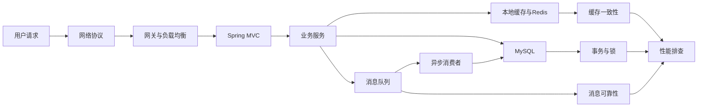

### 高并发系统的治理关系

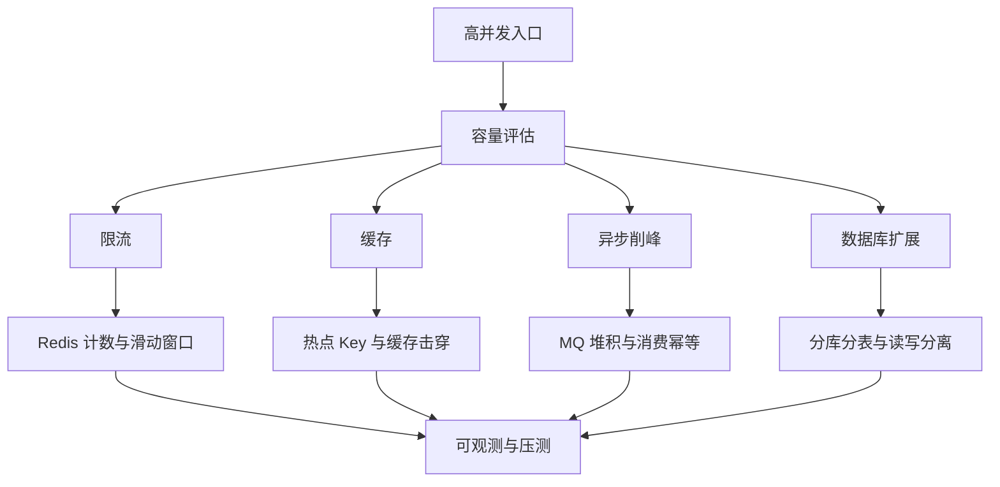

### 数据一致性的知识闭环

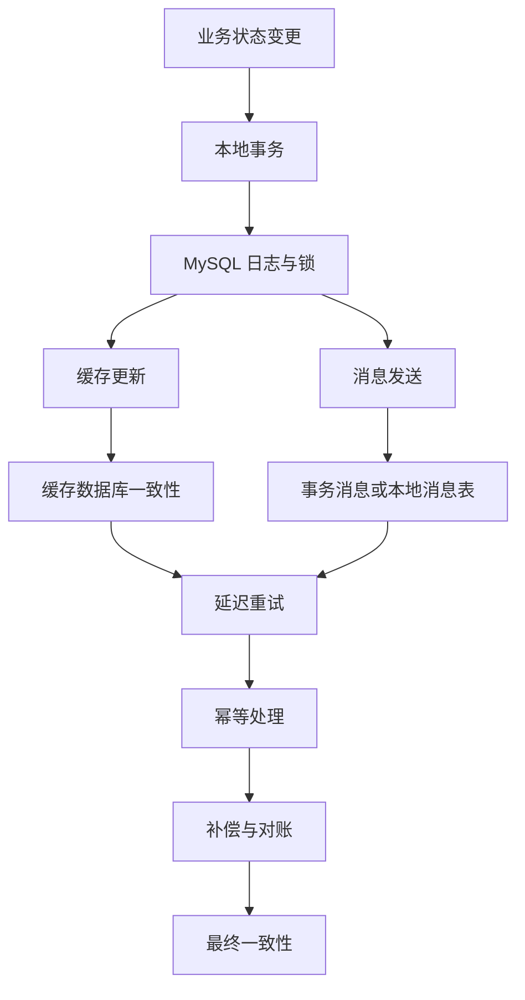

## 各类目知识全景

### 01 Java基础

入口：[01_Java基础/README.md](01_Java基础/README.md)

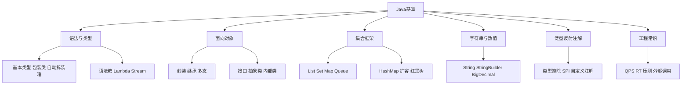

关联记忆：Java 基础是所有模块的“语言底座”，集合连到并发容器，BigDecimal 连到业务金额，Stream 连到性能和可读性取舍。

### 02 JVM

入口：[02_JVM/README.md](02_JVM/README.md)

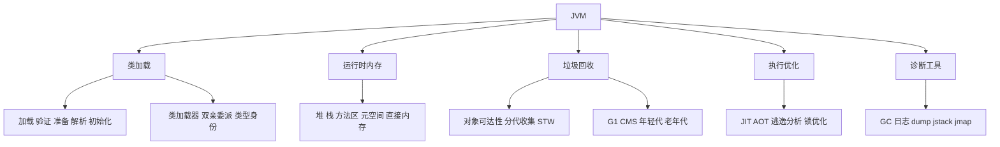

关联记忆：JVM 与并发、性能排查强相关。线程问题看栈，内存问题看堆，停顿问题看 GC，类冲突看类加载器。

### 03 并发编程

入口：[03_并发编程/README.md](03_并发编程/README.md)

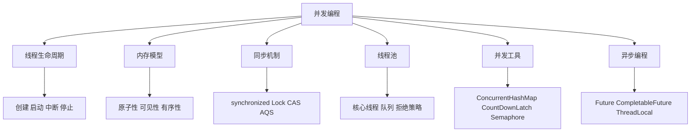

关联记忆：并发题先找共享资源，再讲同步方案；线程池连到接口 RT，ThreadLocal 连到内存泄漏，CAS 连到锁和 Atomic 类。

### 04 Spring体系

入口：[04_Spring体系/README.md](04_Spring体系/README.md)

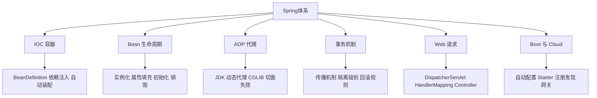

关联记忆：Spring 的核心是容器和代理。事务失效、AOP 失效、循环依赖，本质都能回到 Bean 生命周期和代理边界。

### 05 MySQL

入口：[05_MySQL/README.md](05_MySQL/README.md)

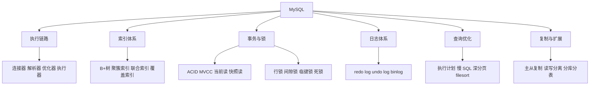

关联记忆：MySQL 是数据层中心。索引影响查询，锁影响并发，日志影响恢复和复制，事务影响一致性。

### 06 Redis

入口：[06_Redis/README.md](06_Redis/README.md)

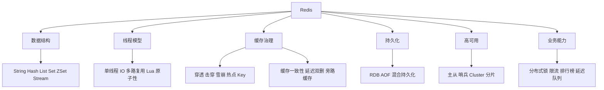

关联记忆：Redis 连接高并发和业务场景。缓存问题连到 MySQL，一致性连到 MQ，分布式锁连到 Redisson。

### 07 消息队列

入口：[07_消息队列/README.md](07_消息队列/README.md)

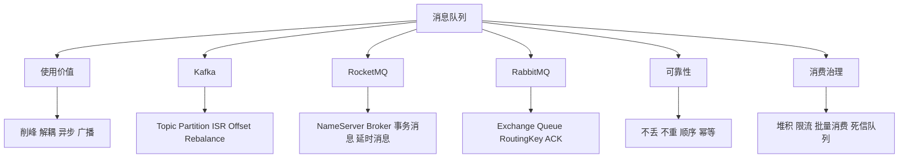

关联记忆：MQ 是系统解耦和最终一致性的桥。可靠性问题必须同时看生产者、Broker、消费者三端。

### 08 微服务与分布式

入口：[08_微服务与分布式/README.md](08_微服务与分布式/README.md)

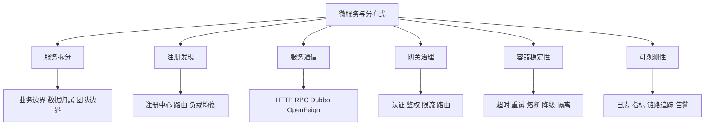

关联记忆：微服务题不要只说组件，要说“拆分之后新增的问题”：调用、事务、治理、观测、发布。

### 09 分布式事务

入口：[09_分布式事务/README.md](09_分布式事务/README.md)

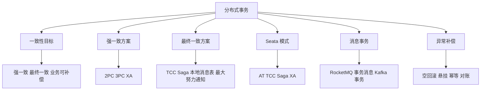

关联记忆：分布式事务的选择取决于业务是否允许补偿。能最终一致就优先柔性事务，强一致成本更高。

### 10 分布式锁与ID

入口：[10_分布式锁与ID/README.md](10_分布式锁与ID/README.md)

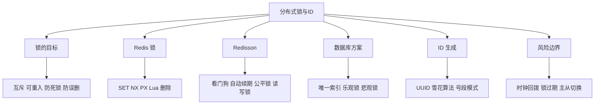

关联记忆：锁解决互斥，ID 解决唯一。锁题必须讲释放安全，ID 题必须讲趋势递增、容量和时钟问题。

### 11 分库分表

入口：[11_分库分表/README.md](11_分库分表/README.md)

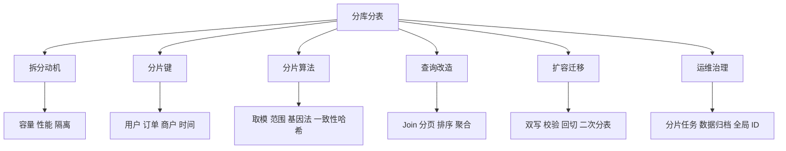

关联记忆：分库分表不是单纯提升性能，它会牺牲查询便利性，带来事务、分页、扩容和运维复杂度。

### 12 其他中间件

入口：[12_其他中间件/README.md](12_其他中间件/README.md)

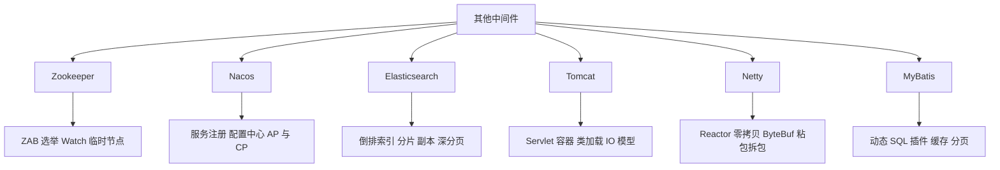

关联记忆：中间件题按“定位、核心模型、典型坑、调优手段”回答最稳。

### 13 网络与操作系统

入口：[13_网络与操作系统/README.md](13_网络与操作系统/README.md)

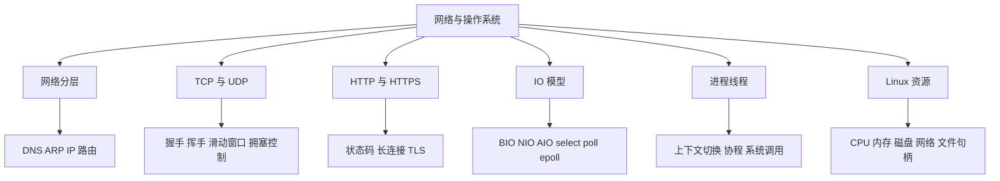

关联记忆：网络题走协议链路，操作系统题走资源视角，排查题走命令和指标。

### 14 系统设计与高并发

入口：[14_系统设计与高并发/README.md](14_系统设计与高并发/README.md)

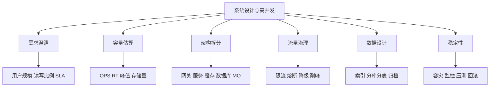

关联记忆：系统设计回答要先定目标和约束，再画链路，最后说明瓶颈、风险和演进路线。

### 15 业务场景题

入口：[15_业务场景题/README.md](15_业务场景题/README.md)

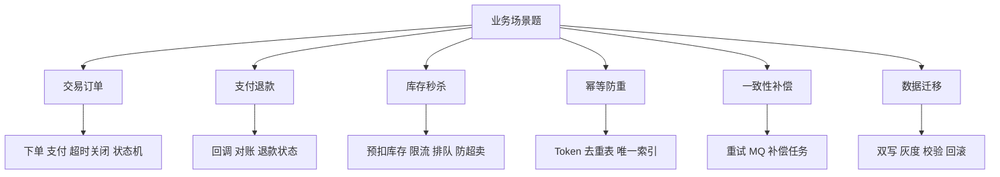

关联记忆：业务场景题不要只说技术方案，要把状态流、异常分支、补偿机制和数据一致性说完整。

### 16 性能调优与故障排查

入口：[16_性能调优与故障排查/README.md](16_性能调优与故障排查/README.md)

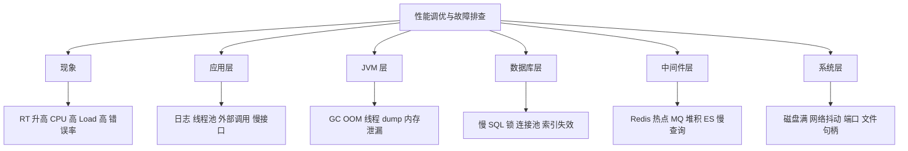

关联记忆：排查题按“现象、范围、证据、根因、修复、预防”回答，避免一上来猜原因。

### 17 数据结构与算法

入口：[17_数据结构与算法/README.md](17_数据结构与算法/README.md)

```mermaid
graph TD
    A["数据结构与算法"] --> B["线性结构"]
    A --> C["树与堆"]
    A --> D["哈希结构"]
    A --> E["排序查找"]
    A --> F["海量数据"]
    A --> G["工程应用"]
    B --> B1["数组 链表 栈 队列"]
    C --> C1["二叉树 B+树 红黑树 堆"]
    D --> D1["HashMap BitMap BloomFilter"]
    E --> E1["快排 归并 二分 TopK"]
    F --> F1["外部排序 分治 MapReduce"]
    G --> G1["LRU 限流 去重 排行榜"]
```

关联记忆：算法题先看数据规模和内存限制，再选结构，最后说时间复杂度和工程边界。

### 18 AI与大模型

入口：[18_AI与大模型/README.md](18_AI与大模型/README.md)

```mermaid
graph TD
    A["AI与大模型"] --> B["模型 API"]
    A --> C["Prompt 与上下文"]
    A --> D["RAG"]
    A --> E["Agent"]
    A --> F["工具协议"]
    A --> G["工程治理"]
    B --> B1["模型选择 参数 流式输出"]
    C --> C1["Prompt Context Harness"]
    D --> D1["切分 向量化 检索 重排"]
    E --> E1["ReAct 单 Agent 多 Agent Skill"]
    F --> F1["Function Calling MCP A2A"]
    G --> G1["评测 成本 延迟 安全"]
```

关联记忆：AI 工程不是只会调模型，要讲清上下文、工具调用、检索增强、评测和成本。

### 19 工具与工程

入口：[19_工具与工程/README.md](19_工具与工程/README.md)

```mermaid
graph TD
    A["工具与工程"] --> B["构建"]
    A --> C["版本控制"]
    A --> D["测试"]
    A --> E["容器化"]
    A --> F["发布"]
    A --> G["团队规范"]
    B --> B1["Maven 依赖冲突 jar war fat jar"]
    C --> C1["Git merge rebase reset revert"]
    D --> D1["单元测试 集成测试 Mock"]
    E --> E1["Docker Compose Kubernetes"]
    F --> F1["灰度 蓝绿 金丝雀 DevOps"]
    G --> G1["Code Review 日志规范 IDE 插件"]
```

关联记忆：工程化题重点是提高协作效率和交付确定性，关键词是可重复、可回滚、可观测。

### 20 任务调度

入口：[20_任务调度/README.md](20_任务调度/README.md)

```mermaid
graph TD
    A["任务调度"] --> B["单机定时"]
    A --> C["分布式调度"]
    A --> D["扫表任务"]
    A --> E["分片任务"]
    A --> F["可靠性"]
    B --> B1["Spring Task Scheduled"]
    C --> C1["XXL-JOB PowerJob"]
    D --> D1["分页游标 跳页 死循环"]
    E --> E1["广播 分片 动态分片"]
    F --> F1["幂等 重试 超时 告警"]
```

关联记忆：任务调度真正难点在集群并发、扫表安全、失败重试和幂等。

### 21 Excel与文件处理

入口：[21_Excel与文件处理/README.md](21_Excel与文件处理/README.md)

```mermaid
graph TD
    A["Excel与文件处理"] --> B["大文件读取"]
    A --> C["大文件写入"]
    A --> D["内存治理"]
    A --> E["并发处理"]
    A --> F["工具选型"]
    B --> B1["分批读取 事件模型"]
    C --> C1["流式写入 临时文件"]
    D --> D1["POI OOM SXSSFWorkbook"]
    E --> E1["线程池 分片导出 限流"]
    F --> F1["POI EasyExcel"]
```

关联记忆：文件处理题本质是内存和 IO 的平衡，重点讲流式、分批、临时文件和失败恢复。

### 22 面经与项目分享

入口：[22_面经与项目分享/README.md](22_面经与项目分享/README.md)

```mermaid
graph TD
    A["面经与项目分享"] --> B["面试流程"]
    A --> C["项目叙事"]
    A --> D["技术深挖"]
    A --> E["业务难点"]
    A --> F["简历优化"]
    A --> G["能力模型"]
    B --> B1["一面 二面 HR 面"]
    C --> C1["背景 目标 方案 结果"]
    D --> D1["MySQL Redis MQ JVM 并发"]
    E --> E1["交易 结算 风控 流程引擎"]
    F --> F1["亮点 难点 指标 收益"]
    G --> G1["初级 中级 高级 专家"]
```

关联记忆：面经的价值是反推表达方式，把技术点包装成项目问题、方案选择和业务结果。

### 23 软技能与面试准备

入口：[23_软技能与面试准备/README.md](23_软技能与面试准备/README.md)

```mermaid
graph TD
    A["软技能与面试准备"] --> B["自我介绍"]
    A --> C["项目介绍"]
    A --> D["行为问题"]
    A --> E["团队协作"]
    A --> F["反问环节"]
    A --> G["职业规划"]
    B --> B1["经历主线 技术标签"]
    C --> C1["STAR 结构 量化收益"]
    D --> D1["优缺点 冲突 压力 加班"]
    E --> E1["Code Review 规范 共识推进"]
    F --> F1["业务 团队 技术 成长"]
    G --> G1["短期胜任 长期发展"]
```

关联记忆：软技能回答要具体、真诚、有证据，最好用项目事实支撑判断。

## 复习路径图

```mermaid
flowchart TD
    A["第 1 轮 建底座"] --> B["Java基础 JVM 并发 MySQL Redis Spring"]
    B --> C["第 2 轮 串链路"]
    C --> D["请求链路 缓存一致性 消息可靠性 事务一致性"]
    D --> E["第 3 轮 做系统题"]
    E --> F["秒杀 订单 支付 分库分表 微服务治理"]
    F --> G["第 4 轮 练排查"]
    G --> H["慢 SQL FullGC CPU 高 MQ 堆积 Redis 热点"]
    H --> I["第 5 轮 练表达"]
    I --> J["项目亮点 面经复盘 软技能反问"]
```

## 高频组合题速查

| 组合题 | 主要关联模块 | 速记回答骨架 |
|---|---|---|
| 秒杀系统怎么设计 | 系统设计 / Redis / MQ / MySQL / 分布式锁 | 限流、缓存库存、异步下单、防超卖、补偿对账 |
| 缓存和数据库如何一致 | Redis / MySQL / MQ / 分布式事务 | 旁路缓存、更新顺序、延迟重试、消息补偿、幂等 |
| 接口突然变慢怎么排查 | Spring / JVM / MySQL / Redis / 操作系统 | 链路分段、指标定位、日志证据、根因修复 |
| MQ 如何保证不丢不重 | MQ / 分布式事务 / 业务场景 | 生产确认、持久化、副本、手动提交、消费幂等 |
| Spring 事务为什么失效 | Spring / MySQL / 并发编程 | 代理边界、异常类型、传播机制、线程切换 |
| 分库分表后怎么查 | MySQL / 分库分表 / 任务调度 | 分片键、路由、分页、聚合、扩容迁移 |
| FullGC 怎么定位 | JVM / 并发编程 / 性能排查 | GC 日志、dump、对象增长、线程和代码路径 |
| 微服务雪崩怎么防 | 微服务 / 系统设计 / Redis / MQ | 超时、限流、隔离、熔断、降级、削峰 |

