# 全量标题速记知识图谱

> 基于当前目录中的 1301 个题目 Markdown 标题自动归类整理。  
> 设计目标：即使单篇 Markdown 内容较少，也能通过标题把知识点补全成可回忆的手机图谱。

## 阅读方式

- 每个类目先看一张纵向图，图中节点包含知识簇、覆盖题数和速记句。
- 图下表格展示该簇代表题目，点击可回到原 Markdown。
- 每个类目末尾的折叠清单挂载该类目全量标题，确保 1301 道题都被纳入整理。

## 全局覆盖

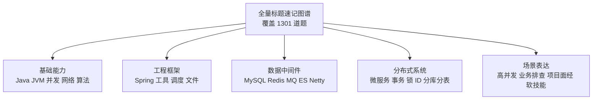

| 类目 | 题数 | 自动归纳出的主要知识簇 |
|---|---:|---|
| 01_Java基础 | 243 | 其他高频标题 115 / 集合算法与结构 26 / 工程场景与架构 24 / 字符串数值与对象 21 / 语言对象与版本 19 |
| 02_JVM | 63 | 其他高频标题 17 / 垃圾回收 15 / 内存区域 12 / 类加载 8 / 调优排查 7 |
| 03_并发编程 | 98 | 线程基础 44 / 锁与同步 30 / 其他高频标题 13 / 并发容器 5 / 线程池 3 |
| 04_Spring体系 | 60 | 容器与Bean 20 / Boot启动配置 12 / AOP与事务 11 / Cloud微服务 6 / Web与MVC 4 |
| 05_MySQL | 153 | SQL执行优化 45 / 索引体系 43 / 事务锁MVCC 23 / 其他高频标题 14 / 表设计运维 10 |
| 06_Redis | 74 | 其他高频标题 23 / 数据结构 15 / 缓存治理 13 / 线程与原子 9 / 过期淘汰持久化 9 |
| 07_消息队列 | 51 | Kafka 19 / RocketMQ 13 / 可靠性治理 8 / RabbitMQ 6 / 其他高频标题 3 |
| 08_微服务与分布式 | 58 | 服务治理 32 / 限流熔断 13 / 架构通信 6 / 其他高频标题 4 / 网关入口 3 |
| 09_分布式事务 | 25 | 消息事务 9 / Seata 5 / 强一致 3 / TCC 3 / 其他高频标题 3 |
| 10_分布式锁与ID | 43 | Redis锁 21 / 号段UUID 9 / 锁语义 8 / 雪花算法 2 / 其他高频标题 2 |
| 11_分库分表 | 24 | 其他高频标题 9 / 分片策略 5 / 查询改造 5 / 任务分片 3 / 扩容迁移 2 |
| 12_其他中间件 | 51 | 注册配置 17 / 网络框架 10 / 搜索ES 8 / Web容器 7 / 分布式理论 5 |
| 13_网络与操作系统 | 68 | 其他高频标题 34 / HTTP网络 13 / 操作系统 7 / IO模型 7 / 资源排查 4 |
| 14_系统设计与高并发 | 26 | 架构原则 10 / 其他高频标题 6 / 高可用 5 / 容量估算 4 / 高并发治理 1 |
| 15_业务场景题 | 61 | 交易订单 15 / 其他高频标题 15 / 秒杀库存 14 / 排行榜社交 8 / 算法实现 4 |
| 16_性能调优与故障排查 | 34 | CPU与Load 8 / 内存GC 8 / 数据库问题 5 / 系统网络 5 / 其他高频标题 5 |
| 17_数据结构与算法 | 27 | 基础结构 9 / 其他高频标题 9 / 树堆索引 3 / 缓存淘汰 2 / 海量数据 2 |
| 18_AI与大模型 | 30 | 其他高频标题 9 / AI工具工程 8 / Agent 6 / 模型调用 3 / Prompt上下文 2 |
| 19_工具与工程 | 21 | 构建依赖 5 / 容器发布 5 / 排查规范 5 / Git协作 3 / 测试质量 3 |
| 20_任务调度 | 11 | 调度框架 4 / 扫表安全 4 / 集群并发 1 / 异步改造 1 / 时间模型 1 |
| 21_Excel与文件处理 | 6 | 内存治理 4 / 读取 1 / 写入导出 1 |
| 22_面经与项目分享 | 61 | 简历面试 22 / 工作经验 18 / 应届校招 9 / 中间件专题 5 / 其他高频标题 4 |
| 23_软技能与面试准备 | 13 | 自我表达 4 / 面试准备 3 / 团队协作 2 / 职业选择 2 / 输入沉淀 2 |

## 01_Java基础

入口：[01_Java基础/README.md](01_Java基础/README.md)

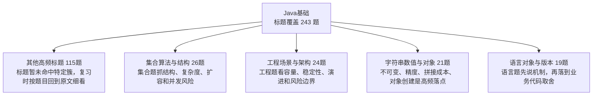

| 知识簇 | 覆盖题数 | 图中速记 | 代表标题 |
|---|---:|---|---|
| 其他高频标题 | 115 | 标题暂未命中特定簇，复习时按题目回到原文细看 | [Agent开发简历模板——应届生](01_Java基础/0007_Agent开发简历模板——应届生.md) / [海量数据查找最大的 k 个值 用什么数据结构](01_Java基础/0039_海量数据查找最大的_k_个值_用什么数据结构.md) / [Thread.sleep(0)的作用是什么](01_Java基础/0056_Thread.sleep(0)的作用是什么.md) / [uuid和自增id做主键哪个好 为什么](01_Java基础/0090_uuid和自增id做主键哪个好_为什么.md) / [5000w数据查询电话号码后4位 如何优化](01_Java基础/0104_5000w数据查询电话号码后4位_如何优化.md) / [Java中有哪些锁](01_Java基础/0150_Java中有哪些锁.md) |
| 集合算法与结构 | 26 | 集合题抓结构、复杂度、扩容和并发风险 | [你能说出几种集合的排序方式](01_Java基础/0188_你能说出几种集合的排序方式.md) / [ArrayList LinkedList与Vector的区别](01_Java基础/0231_ArrayList_LinkedList与Vector的区别.md) / [ArrayList的subList方法有什么需要注意的地方吗](01_Java基础/0232_ArrayList的subList方法有什么需要注意的地方吗.md) / [为什么HashMap的Cap是2^n 如何保证](01_Java基础/0235_为什么HashMap的Cap是2^n_如何保证.md) / [JDK1.8中HashMap有哪些改变](01_Java基础/0267_JDK1.8中HashMap有哪些改变.md) / [HashMap的数据结构是怎样的](01_Java基础/0268_HashMap的数据结构是怎样的.md) |
| 工程场景与架构 | 24 | 工程题看容量、稳定性、演进和风险边界 | [能不能介绍下你项目的整体架构情况](01_Java基础/0228_能不能介绍下你项目的整体架构情况.md) / [你在工作中是如何使用设计模式的](01_Java基础/0453_你在工作中是如何使用设计模式的.md) / [使用哪种设计模式可以提高代码的复用性](01_Java基础/0454_使用哪种设计模式可以提高代码的复用性.md) / [使用哪种设计模式可以提高代码可维护性](01_Java基础/0469_使用哪种设计模式可以提高代码可维护性.md) / [什么是设计模式有什么好处](01_Java基础/0479_什么是设计模式有什么好处.md) / [设计模式的7大基本原则有哪些](01_Java基础/0480_设计模式的7大基本原则有哪些.md) |
| 字符串数值与对象 | 21 | 不可变、精度、拼接成本、对象创建是高频落点 | [varchar(100)和varchar(10)有什么区别](01_Java基础/0210_varchar(100)和varchar(10)有什么区别.md) / [如何理解面向对象和面向过程](01_Java基础/0245_如何理解面向对象和面向过程.md) / [怎么修改一个类中的private修饰的String参数的值](01_Java基础/0355_怎么修改一个类中的private修饰的String参数的值.md) / [BigDecimal和Long表示金额哪个更合适 怎么选择](01_Java基础/0356_BigDecimal和Long表示金额哪个更合适_怎么选择.md) / [String的设计 用到了哪些设计模式](01_Java基础/0380_String的设计_用到了哪些设计模式.md) / [String中intern的原理是什么](01_Java基础/0415_String中intern的原理是什么.md) |
| 语言对象与版本 | 19 | 语言题先说机制，再落到业务代码取舍 | [接口和抽象类的区别 如何选择](01_Java基础/0051_接口和抽象类的区别_如何选择.md) / [为什么Java不支持多继承](01_Java基础/0052_为什么Java不支持多继承.md) / [Java和C++主要区别有哪些各有哪些优缺点](01_Java基础/0053_Java和C++主要区别有哪些各有哪些优缺点.md) / [现在JDK的最新版本是什么](01_Java基础/0107_现在JDK的最新版本是什么.md) / [JDK新版本中都有哪些新特性](01_Java基础/0137_JDK新版本中都有哪些新特性.md) / [如果一个接口响应时间不符合预期 怎么排查跟解决](01_Java基础/0201_如果一个接口响应时间不符合预期_怎么排查跟解决.md) |
| 数据库SQL与缓存 | 18 | 把Java基础里的数据库泛题归到数据链路理解 | [什么是数据库的主从延迟 如何解决](01_Java基础/0141_什么是数据库的主从延迟_如何解决.md) / [为什么不建议用数据库唯一性约束做幂等控制](01_Java基础/0283_为什么不建议用数据库唯一性约束做幂等控制.md) / [如果SQL中一定要有join 该如何优化](01_Java基础/0291_如果SQL中一定要有join_该如何优化.md) / [为了避免丢消息问题需要落表 如何设计这张消息表](01_Java基础/0298_为了避免丢消息问题需要落表_如何设计这张消息表.md) / [你是如何进行SQL调优的](01_Java基础/0313_你是如何进行SQL调优的.md) / [如果设计一个缓存 需要考虑哪些方面](01_Java基础/0335_如果设计一个缓存_需要考虑哪些方面.md) |
| 接口安全与幂等 | 10 | 接口题围绕鉴权、幂等、重试、限流和降级 | [如果token被窃取了 是不是就能伪造登陆了](01_Java基础/0054_如果token被窃取了_是不是就能伪造登陆了.md) / [你知道有哪些退避策略吗](01_Java基础/0078_你知道有哪些退避策略吗.md) / [如何解决接口幂等的问题](01_Java基础/0194_如何解决接口幂等的问题.md) / [第三方接口不稳定经常超时 如何处理三方接口异常不影响自己接口](01_Java基础/0770_第三方接口不稳定经常超时_如何处理三方接口异常不影响自己接口.md) / [如何统计一个Bean中的方法调用次数](01_Java基础/0776_如何统计一个Bean中的方法调用次数.md) / [调用第三方接口支付时 第三方接口显示支付成功 但是在调用方显示支付失败 问题可能出在哪里](01_Java基础/0797_调用第三方接口支付时_第三方接口显示支付成功_但是在调用方显示支付失败_问题可能出在哪里.md) |
| 反射泛型注解 | 10 | 回答机制、适用场景和边界 | [介绍下@Retryable的实现原理](01_Java基础/0081_介绍下@Retryable的实现原理.md) / [有什么情况会导致一个bean无法被初始化么](01_Java基础/0347_有什么情况会导致一个bean无法被初始化么.md) / [Java注解的作用是啥](01_Java基础/0446_Java注解的作用是啥.md) / [什么是反射机制为什么反射慢](01_Java基础/0472_什么是反射机制为什么反射慢.md) / [反射与封装是否矛盾如何解决反射破坏封装不安全的问题](01_Java基础/0695_反射与封装是否矛盾如何解决反射破坏封装不安全的问题.md) / [什么是SPI 和API有啥区别](01_Java基础/0871_什么是SPI_和API有啥区别.md) |

<details>
<summary>其他高频标题 全量题目 115 题</summary>

- [Agent开发简历模板——应届生](01_Java基础/0007_Agent开发简历模板——应届生.md)
- [海量数据查找最大的 k 个值 用什么数据结构](01_Java基础/0039_海量数据查找最大的_k_个值_用什么数据结构.md)
- [Thread.sleep(0)的作用是什么](01_Java基础/0056_Thread.sleep(0)的作用是什么.md)
- [uuid和自增id做主键哪个好 为什么](01_Java基础/0090_uuid和自增id做主键哪个好_为什么.md)
- [5000w数据查询电话号码后4位 如何优化](01_Java基础/0104_5000w数据查询电话号码后4位_如何优化.md)
- [Java中有哪些锁](01_Java基础/0150_Java中有哪些锁.md)
- [你知道fastjson的反序列化漏洞吗](01_Java基础/0174_你知道fastjson的反序列化漏洞吗.md)
- [Integer a=1000 Integer b=1000 ==是什么结果 如果是100呢](01_Java基础/0180_Integer_a=1000_Integer_b=1000_==是什么结果_如果是100呢.md)
- [什么是预热它有何作用](01_Java基础/0185_什么是预热它有何作用.md)
- [怎么做数据对账](01_Java基础/0191_怎么做数据对账.md)
- [数据对账时 如果日切时间点前后的数据不一致怎么办](01_Java基础/0192_数据对账时_如果日切时间点前后的数据不一致怎么办.md)
- [如何做技术选型](01_Java基础/0199_如何做技术选型.md)
- [exists和in有什么区别如何选择](01_Java基础/0213_exists和in有什么区别如何选择.md)
- [为什么不建议使用异常控制业务流程](01_Java基础/0224_为什么不建议使用异常控制业务流程.md)
- [hash冲突通常怎么解决](01_Java基础/0233_hash冲突通常怎么解决.md)
- [Autowired和Resource的关系](01_Java基础/0270_Autowired和Resource的关系.md)
- [什么是Canal 他的工作原理是什么](01_Java基础/0271_什么是Canal_他的工作原理是什么.md)
- [write和fsync的区别是什么](01_Java基础/0275_write和fsync的区别是什么.md)
- [什么是排他锁和共享锁](01_Java基础/0285_什么是排他锁和共享锁.md)
- [阿里出的Java开发手册看过吗 对哪条规约印象深刻](01_Java基础/0332_阿里出的Java开发手册看过吗_对哪条规约印象深刻.md)
- [五个线程abcde 想先执行a 在执行bcd bcd执行完后执行e如何做](01_Java基础/0350_五个线程abcde_想先执行a_在执行bcd_bcd执行完后执行e如何做.md)
- [假设还有很多内存 有什么情况还会频繁fullgc](01_Java基础/0354_假设还有很多内存_有什么情况还会频繁fullgc.md)
- [有了equals为啥需要hashCode方法](01_Java基础/0358_有了equals为啥需要hashCode方法.md)
- [Java中的static都能用来修饰什么](01_Java基础/0359_Java中的static都能用来修饰什么.md)
- [为什么Java中的main方法必须是public static void的](01_Java基础/0363_为什么Java中的main方法必须是public_static_void的.md)
- [什么是深拷贝和浅拷贝](01_Java基础/0365_什么是深拷贝和浅拷贝.md)
- [什么是AIO BIO和NIO](01_Java基础/0376_什么是AIO_BIO和NIO.md)
- [Java是值传递还是引用传递](01_Java基础/0377_Java是值传递还是引用传递.md)
- [什么是流程引擎 请问流程引擎有什么优缺点](01_Java基础/0379_什么是流程引擎_请问流程引擎有什么优缺点.md)
- [为什么建议自定义一个无参构造函数](01_Java基础/0382_为什么建议自定义一个无参构造函数.md)
- [final finally finalize有什么区别](01_Java基础/0383_final_finally_finalize有什么区别.md)
- [Java中的枚举有什么特点和好处](01_Java基础/0384_Java中的枚举有什么特点和好处.md)
- [什么是享元模式 有哪些具体应用](01_Java基础/0391_什么是享元模式_有哪些具体应用.md)
- [什么是不可变模式 有哪些应用](01_Java基础/0392_什么是不可变模式_有哪些应用.md)
- [try中return A catch中return B finally中return C 最终返回值是什么](01_Java基础/0395_try中return_A_catch中return_B_finally中return_C_最终返回值是什么.md)
- [finally中代码一定会执行吗](01_Java基础/0396_finally中代码一定会执行吗.md)
- [三种工厂模式的区别和特点](01_Java基础/0402_三种工厂模式的区别和特点.md)
- [以下关于异常处理的代码有哪些问题](01_Java基础/0405_以下关于异常处理的代码有哪些问题.md)
- [Java中异常分哪两类 有什么区别](01_Java基础/0406_Java中异常分哪两类_有什么区别.md)
- [Java中Timer实现定时调度的原理是什么](01_Java基础/0414_Java中Timer实现定时调度的原理是什么.md)
- [为什么说枚举是实现单例最好的方式](01_Java基础/0419_为什么说枚举是实现单例最好的方式.md)
- [serialVersionUID 有何用途 如果没定义会有什么问题](01_Java基础/0422_serialVersionUID_有何用途_如果没定义会有什么问题.md)
- [单例模式的多种写法](01_Java基础/0427_单例模式的多种写法.md)
- [如何破坏单例模式](01_Java基础/0428_如何破坏单例模式.md)
- [Java序列化的原理是啥](01_Java基础/0430_Java序列化的原理是啥.md)
- [什么是序列化与反序列化](01_Java基础/0431_什么是序列化与反序列化.md)
- [Java中的随机是真随机吗](01_Java基础/0439_Java中的随机是真随机吗.md)
- [有了synchronized为什么还需要volatile](01_Java基础/0442_有了synchronized为什么还需要volatile.md)
- [什么是隐私计算](01_Java基础/0451_什么是隐私计算.md)
- [什么是Web 3.0](01_Java基础/0452_什么是Web_3.0.md)
- [int a = 1 是原子性操作吗](01_Java基础/0455_int_a_=_1_是原子性操作吗.md)
- [Java的动态代理如何实现](01_Java基础/0457_Java的动态代理如何实现.md)
- [什么是状态机 能描述一下状态机的实现原理吗](01_Java基础/0467_什么是状态机_能描述一下状态机的实现原理吗.md)
- [字节本地生活](01_Java基础/0474_字节本地生活.md)
- [DO DTO VO都是干什么的](01_Java基础/0478_DO_DTO_VO都是干什么的.md)
- [为什么logger.warn()之前要使用logger.isWarnEnabled()](01_Java基础/0495_为什么logger.warn()之前要使用logger.isWarnEnabled().md)
- [什么是正向代理和反向代理](01_Java基础/0505_什么是正向代理和反向代理.md)
- [什么是CPU利用率怎么算的](01_Java基础/0517_什么是CPU利用率怎么算的.md)
- [什么是IPV6和IPV4有什么区别](01_Java基础/0520_什么是IPV6和IPV4有什么区别.md)
- [为什么不能直接使用Log4j Logback中的 API](01_Java基础/0523_为什么不能直接使用Log4j_Logback中的_API.md)
- [什么是数据倾斜 会带来哪些问题如何解决](01_Java基础/0525_什么是数据倾斜_会带来哪些问题如何解决.md)
- [什么是Load 负载](01_Java基础/0529_什么是Load_负载.md)
- [简单介绍一下DNS](01_Java基础/0545_简单介绍一下DNS.md)
- [什么是DNS污染DNS劫持](01_Java基础/0559_什么是DNS污染DNS劫持.md)
- [单测覆盖率是如何统计的原理是什么](01_Java基础/0562_单测覆盖率是如何统计的原理是什么.md)
- [实现一个定时任务 可以用什么数据结构及算法](01_Java基础/0564_实现一个定时任务_可以用什么数据结构及算法.md)
- [Java中Timer实现定时调度的原理是什么](01_Java基础/0577_Java中Timer实现定时调度的原理是什么.md)
- [负载 Load 和CPU利用率之间有什么区别](01_Java基础/0586_负载_Load_和CPU利用率之间有什么区别.md)
- [什么是Mock怎么做单测的Mock](01_Java基础/0590_什么是Mock怎么做单测的Mock.md)
- [Java中实现定时任务的几种方式](01_Java基础/0594_Java中实现定时任务的几种方式.md)
- [为什么定时任务可以定时执行](01_Java基础/0606_为什么定时任务可以定时执行.md)
- [介绍下TCP是如何实现拥塞控制的](01_Java基础/0613_介绍下TCP是如何实现拥塞控制的.md)
- [什么是代理模式 有哪些应用](01_Java基础/0617_什么是代理模式_有哪些应用.md)
- [什么是模板方法模式 有哪些应用](01_Java基础/0618_什么是模板方法模式_有哪些应用.md)
- [常见的进程调度算法有哪些](01_Java基础/0628_常见的进程调度算法有哪些.md)
- [什么是观察者模式 有哪些应用](01_Java基础/0632_什么是观察者模式_有哪些应用.md)
- [什么是领域事件](01_Java基础/0633_什么是领域事件.md)
- [软链接和硬链接的区别](01_Java基础/0641_软链接和硬链接的区别.md)
- [策略模式和if-else相比有什么好处](01_Java基础/0647_策略模式和if-else相比有什么好处.md)
- [什么是充血模型和贫血模型](01_Java基础/0648_什么是充血模型和贫血模型.md)
- [什么是守护线程 和普通线程有什么区别](01_Java基础/0652_什么是守护线程_和普通线程有什么区别.md)
- [什么是“孤儿进程” 什么是“僵尸进程”](01_Java基础/0657_什么是“孤儿进程”_什么是“僵尸进程”.md)
- [什么是状态模式 有哪些应用](01_Java基础/0661_什么是状态模式_有哪些应用.md)
- [什么是责任链模式 有哪些应用](01_Java基础/0662_什么是责任链模式_有哪些应用.md)
- [什么是聚合 什么是聚合根](01_Java基础/0663_什么是聚合_什么是聚合根.md)
- [什么是并发 什么是并行](01_Java基础/0666_什么是并发_什么是并行.md)
- [项目中需要应用发布和ddl变更 需要如何保证不出错](01_Java基础/0670_项目中需要应用发布和ddl变更_需要如何保证不出错.md)
- [给你一个文本文件 每一行包含一个 QQ号码 请用linux命令进行去重](01_Java基础/0674_给你一个文本文件_每一行包含一个_QQ号码_请用linux命令进行去重.md)
- [什么是 IO 密集 什么是 CPU 密集](01_Java基础/0675_什么是_IO_密集_什么是_CPU_密集.md)
- [介绍一下OSI七层模型](01_Java基础/0678_介绍一下OSI七层模型.md)
- [请详细描述DDD的实现流程](01_Java基础/0680_请详细描述DDD的实现流程.md)
- [为什么不能在try-catch中捕获子线程的异常](01_Java基础/0694_为什么不能在try-catch中捕获子线程的异常.md)
- [如何在 Java 中实现高效的异步编程如何避免回调地狱](01_Java基础/0705_如何在_Java_中实现高效的异步编程如何避免回调地狱.md)
- [什么是视图 视图的作用是什么](01_Java基础/0730_什么是视图_视图的作用是什么.md)
- [不用大于号小于号怎么判断两个正整数大小](01_Java基础/0741_不用大于号小于号怎么判断两个正整数大小.md)
- [服务发布分10批 第一批发完后负载很高后面恢复正常 如何处理](01_Java基础/0754_服务发布分10批_第一批发完后负载很高后面恢复正常_如何处理.md)
- [什么是STW有什么影响](01_Java基础/0777_什么是STW有什么影响.md)
- [死循环会导致CPU使用率升高吗为什么](01_Java基础/0785_死循环会导致CPU使用率升高吗为什么.md)
- [读取一千个文件 一个线程读取和开十个线程读取 哪种方式效率高](01_Java基础/0787_读取一千个文件_一个线程读取和开十个线程读取_哪种方式效率高.md)
- [为什么初始标记和重新标记需要STW 而并发标记不需要](01_Java基础/0803_为什么初始标记和重新标记需要STW_而并发标记不需要.md)
- [一个Java进程占用的内存都哪些部分](01_Java基础/0832_一个Java进程占用的内存都哪些部分.md)
- [容器和虚拟机的区别是什么](01_Java基础/0844_容器和虚拟机的区别是什么.md)
- [一个查询语句的执行顺序是怎么样的](01_Java基础/0866_一个查询语句的执行顺序是怎么样的.md)
- [4C8G 16台 和 8C16G 8台 不考虑成本的情况怎么选](01_Java基础/0913_4C8G_16台_和_8C16G_8台_不考虑成本的情况怎么选.md)
- [Java中的类什么时候会被加载](01_Java基础/0923_Java中的类什么时候会被加载.md)
- [有没有别的Offer有没有别的面试](01_Java基础/0925_有没有别的Offer有没有别的面试.md)
- [和其他公司做数据交互时 有什么需要注意的](01_Java基础/0928_和其他公司做数据交互时_有什么需要注意的.md)
- [类的生命周期是怎么样的](01_Java基础/0937_类的生命周期是怎么样的.md)
- [Java 8 和 Java 11 的GC有什么区别](01_Java基础/0949_Java_8_和_Java_11_的GC有什么区别.md)
- [离职的原因是什么](01_Java基础/0960_离职的原因是什么.md)
- [ROWNUM 和 ROW NUMBER() 的区别是什么](01_Java基础/1008_ROWNUM_和_ROW_NUMBER()_的区别是什么.md)
- [过滤器和拦截器的区别是什么](01_Java基础/1142_过滤器和拦截器的区别是什么.md)
- [rabbitMQ如何实现延迟消息](01_Java基础/1165_rabbitMQ如何实现延迟消息.md)
- [什么是负载均衡 有哪些常见算法](01_Java基础/1222_什么是负载均衡_有哪些常见算法.md)
- [什么是冷备 热备 暖备](01_Java基础/1277_什么是冷备_热备_暖备.md)

</details>

<details>
<summary>集合算法与结构 全量题目 26 题</summary>

- [你能说出几种集合的排序方式](01_Java基础/0188_你能说出几种集合的排序方式.md)
- [ArrayList LinkedList与Vector的区别](01_Java基础/0231_ArrayList_LinkedList与Vector的区别.md)
- [ArrayList的subList方法有什么需要注意的地方吗](01_Java基础/0232_ArrayList的subList方法有什么需要注意的地方吗.md)
- [为什么HashMap的Cap是2^n 如何保证](01_Java基础/0235_为什么HashMap的Cap是2^n_如何保证.md)
- [JDK1.8中HashMap有哪些改变](01_Java基础/0267_JDK1.8中HashMap有哪些改变.md)
- [HashMap的数据结构是怎样的](01_Java基础/0268_HashMap的数据结构是怎样的.md)
- [ArrayList的序列化是怎么实现的](01_Java基础/0269_ArrayList的序列化是怎么实现的.md)
- [Arrays.sort是使用什么排序算法实现的](01_Java基础/0444_Arrays.sort是使用什么排序算法实现的.md)
- [Java中的集合类有哪些如何分类的](01_Java基础/0702_Java中的集合类有哪些如何分类的.md)
- [Stream的并行流一定比串行流更快吗](01_Java基础/0722_Stream的并行流一定比串行流更快吗.md)
- [Java 8中的Stream用过吗都能干什么](01_Java基础/0778_Java_8中的Stream用过吗都能干什么.md)
- [HashMap用在并发场景中有什么问题](01_Java基础/0804_HashMap用在并发场景中有什么问题.md)
- [HashMap的remove方法是如何实现的](01_Java基础/0857_HashMap的remove方法是如何实现的.md)
- [Stream的并行流是如何实现的](01_Java基础/0858_Stream的并行流是如何实现的.md)
- [HashMap的hash方法是如何实现的](01_Java基础/0881_HashMap的hash方法是如何实现的.md)
- [什么是小顶堆 可以用在哪些场景](01_Java基础/0882_什么是小顶堆_可以用在哪些场景.md)
- [什么是BitMap有什么用](01_Java基础/0883_什么是BitMap有什么用.md)
- [为什么在JDK8中HashMap要转成红黑树](01_Java基础/0898_为什么在JDK8中HashMap要转成红黑树.md)
- [HashMap的容量设置多少合适](01_Java基础/0908_HashMap的容量设置多少合适.md)
- [HashMap是如何扩容的](01_Java基础/0909_HashMap是如何扩容的.md)
- [什么是红黑树](01_Java基础/0910_什么是红黑树.md)
- [为什么HashMap的默认负载因子设置成0.75](01_Java基础/0924_为什么HashMap的默认负载因子设置成0.75.md)
- [HashMap在get和put时经过哪些步骤](01_Java基础/0950_HashMap在get和put时经过哪些步骤.md)
- [遍历的同时修改一个List有几种方式](01_Java基础/1013_遍历的同时修改一个List有几种方式.md)
- [Set是如何保证元素不重复的](01_Java基础/1014_Set是如何保证元素不重复的.md)
- [实现一个LRU缓存淘汰策略 支持get和put操作](01_Java基础/1176_实现一个LRU缓存淘汰策略_支持get和put操作.md)

</details>

<details>
<summary>工程场景与架构 全量题目 24 题</summary>

- [能不能介绍下你项目的整体架构情况](01_Java基础/0228_能不能介绍下你项目的整体架构情况.md)
- [你在工作中是如何使用设计模式的](01_Java基础/0453_你在工作中是如何使用设计模式的.md)
- [使用哪种设计模式可以提高代码的复用性](01_Java基础/0454_使用哪种设计模式可以提高代码的复用性.md)
- [使用哪种设计模式可以提高代码可维护性](01_Java基础/0469_使用哪种设计模式可以提高代码可维护性.md)
- [什么是设计模式有什么好处](01_Java基础/0479_什么是设计模式有什么好处.md)
- [设计模式的7大基本原则有哪些](01_Java基础/0480_设计模式的7大基本原则有哪些.md)
- [记录日志影响性能怎么办](01_Java基础/0508_记录日志影响性能怎么办.md)
- [正在持续写入的日志如何清理](01_Java基础/0542_正在持续写入的日志如何清理.md)
- [针对天气预报变化时触发用户通知和推荐行程用什么设计模式](01_Java基础/0604_针对天气预报变化时触发用户通知和推荐行程用什么设计模式.md)
- [DDD的分层架构是怎么样的](01_Java基础/0620_DDD的分层架构是怎么样的.md)
- [下单支付过程 点击跳转支付 输入密码 支付完成后跳转到订单页 整个过程可能会有什么问题架构方面做哪些设计](01_Java基础/0668_下单支付过程_点击跳转支付_输入密码_支付完成后跳转到订单页_整个过程可能会有什么问题架构方面做哪些设计.md)
- [如何理解领域驱动设计](01_Java基础/0679_如何理解领域驱动设计.md)
- [项目中 如果日志打印成为瓶颈 该如何优化](01_Java基础/0826_项目中_如果日志打印成为瓶颈_该如何优化.md)
- [4C8G的机器 各项系统指标 什么范围算是正常](01_Java基础/0912_4C8G的机器_各项系统指标_什么范围算是正常.md)
- [如果你的业务量突然提升100倍QPS你会怎么做](01_Java基础/0963_如果你的业务量突然提升100倍QPS你会怎么做.md)
- [电商下单场景 如何设计一个数据一致性方案](01_Java基础/0977_电商下单场景_如何设计一个数据一致性方案.md)
- [你认为分布式架构一定比单体架构要好吗](01_Java基础/1089_你认为分布式架构一定比单体架构要好吗.md)
- [rabbitMQ的整体架构是怎么样的](01_Java基础/1178_rabbitMQ的整体架构是怎么样的.md)
- [Using filesort 能优化吗 怎么优化](01_Java基础/1183_Using_filesort_能优化吗_怎么优化.md)
- [如何做平滑的数据迁移](01_Java基础/1193_如何做平滑的数据迁移.md)
- [什么是全链路压测](01_Java基础/1273_什么是全链路压测.md)
- [什么是压测 怎么做压测](01_Java基础/1274_什么是压测_怎么做压测.md)
- [什么是QPS 什么是RT](01_Java基础/1284_什么是QPS_什么是RT.md)
- [如何设计一个高性能的分布式系统](01_Java基础/1285_如何设计一个高性能的分布式系统.md)

</details>

<details>
<summary>字符串数值与对象 全量题目 21 题</summary>

- [varchar(100)和varchar(10)有什么区别](01_Java基础/0210_varchar(100)和varchar(10)有什么区别.md)
- [如何理解面向对象和面向过程](01_Java基础/0245_如何理解面向对象和面向过程.md)
- [怎么修改一个类中的private修饰的String参数的值](01_Java基础/0355_怎么修改一个类中的private修饰的String参数的值.md)
- [BigDecimal和Long表示金额哪个更合适 怎么选择](01_Java基础/0356_BigDecimal和Long表示金额哪个更合适_怎么选择.md)
- [String的设计 用到了哪些设计模式](01_Java基础/0380_String的设计_用到了哪些设计模式.md)
- [String中intern的原理是什么](01_Java基础/0415_String中intern的原理是什么.md)
- [String是如何实现不可变的](01_Java基础/0429_String是如何实现不可变的.md)
- [为什么JDK 9中把String的char[]改成了byte[]](01_Java基础/0445_为什么JDK_9中把String的char[]改成了byte[].md)
- [Java中创建对象有哪些种方式](01_Java基础/0458_Java中创建对象有哪些种方式.md)
- [char能存储中文吗](01_Java基础/0483_char能存储中文吗.md)
- [什么是实体 什么是值对象](01_Java基础/0649_什么是实体_什么是值对象.md)
- [String有长度限制吗是多少](01_Java基础/0961_String有长度限制吗是多少.md)
- [String a = ab ; String b = a + b ; a == b 吗](01_Java基础/0974_String_a_=_ab_;_String_b_=_a_+_b_;_a_==_b_吗.md)
- [String str=new String( hollis )创建了几个对象](01_Java基础/0975_String_str=new_String(_hollis_)创建了几个对象.md)
- [String为什么设计成不可变的](01_Java基础/0987_String为什么设计成不可变的.md)
- [String StringBuilder和StringBuffer的区别](01_Java基础/1001_String_StringBuilder和StringBuffer的区别.md)
- [为什么对Java中的负数取绝对值结果不一定是正数](01_Java基础/1017_为什么对Java中的负数取绝对值结果不一定是正数.md)
- [BigDecimal(double)和BigDecimal(String)有什么区别](01_Java基础/1018_BigDecimal(double)和BigDecimal(String)有什么区别.md)
- [为什么不能用BigDecimal的equals方法做等值比较](01_Java基础/1031_为什么不能用BigDecimal的equals方法做等值比较.md)
- [为什么不能用浮点数表示金额](01_Java基础/1046_为什么不能用浮点数表示金额.md)
- [char和varchar的区别](01_Java基础/1122_char和varchar的区别.md)

</details>

<details>
<summary>语言对象与版本 全量题目 19 题</summary>

- [接口和抽象类的区别 如何选择](01_Java基础/0051_接口和抽象类的区别_如何选择.md)
- [为什么Java不支持多继承](01_Java基础/0052_为什么Java不支持多继承.md)
- [Java和C++主要区别有哪些各有哪些优缺点](01_Java基础/0053_Java和C++主要区别有哪些各有哪些优缺点.md)
- [现在JDK的最新版本是什么](01_Java基础/0107_现在JDK的最新版本是什么.md)
- [JDK新版本中都有哪些新特性](01_Java基础/0137_JDK新版本中都有哪些新特性.md)
- [如果一个接口响应时间不符合预期 怎么排查跟解决](01_Java基础/0201_如果一个接口响应时间不符合预期_怎么排查跟解决.md)
- [Java是如何实现的平台无关](01_Java基础/0254_Java是如何实现的平台无关.md)
- [为什么建议多用组合少用继承](01_Java基础/0404_为什么建议多用组合少用继承.md)
- [请简述MVC模式的思想](01_Java基础/0441_请简述MVC模式的思想.md)
- [什么是编译和反编译](01_Java基础/0701_什么是编译和反编译.md)
- [JDK 9中对字符串的拼接做了什么优化](01_Java基础/0708_JDK_9中对字符串的拼接做了什么优化.md)
- [为什么JDK 15要废弃偏向锁](01_Java基础/0735_为什么JDK_15要废弃偏向锁.md)
- [Java一定就是平台无关的吗](01_Java基础/0791_Java一定就是平台无关的吗.md)
- [什么是MVC](01_Java基础/0801_什么是MVC.md)
- [说几个常见的语法糖](01_Java基础/0926_说几个常见的语法糖.md)
- [Lambda表达式是如何实现的](01_Java基础/0927_Lambda表达式是如何实现的.md)
- [什么是ORM 有哪些常用框架](01_Java基础/0993_什么是ORM_有哪些常用框架.md)
- [Java中有了基本类型为什么还需要包装类](01_Java基础/1058_Java中有了基本类型为什么还需要包装类.md)
- [如何理解Java中的多态](01_Java基础/1059_如何理解Java中的多态.md)

</details>

<details>
<summary>数据库SQL与缓存 全量题目 18 题</summary>

- [什么是数据库的主从延迟 如何解决](01_Java基础/0141_什么是数据库的主从延迟_如何解决.md)
- [为什么不建议用数据库唯一性约束做幂等控制](01_Java基础/0283_为什么不建议用数据库唯一性约束做幂等控制.md)
- [如果SQL中一定要有join 该如何优化](01_Java基础/0291_如果SQL中一定要有join_该如何优化.md)
- [为了避免丢消息问题需要落表 如何设计这张消息表](01_Java基础/0298_为了避免丢消息问题需要落表_如何设计这张消息表.md)
- [你是如何进行SQL调优的](01_Java基础/0313_你是如何进行SQL调优的.md)
- [如果设计一个缓存 需要考虑哪些方面](01_Java基础/0335_如果设计一个缓存_需要考虑哪些方面.md)
- [如何进行SQL调优](01_Java基础/0345_如何进行SQL调优.md)
- [有一张上百万条数据的单表 从前端页面 Java后台 数据库三个层面做查询优化](01_Java基础/0654_有一张上百万条数据的单表_从前端页面_Java后台_数据库三个层面做查询优化.md)
- [什么情况下会出现数据库和缓存不一致的问题](01_Java基础/0799_什么情况下会出现数据库和缓存不一致的问题.md)
- [在for循环中调用数据库 有什么缺点如何优化](01_Java基础/0813_在for循环中调用数据库_有什么缺点如何优化.md)
- [泛型中K T V E Object等分别代表什么含义](01_Java基础/0900_泛型中K_T_V_E_Object等分别代表什么含义.md)
- [如何实现缓存的预热](01_Java基础/0962_如何实现缓存的预热.md)
- [如何优化一个大规模的数据库系统](01_Java基础/1067_如何优化一个大规模的数据库系统.md)
- [什么是数据库事务机制](01_Java基础/1068_什么是数据库事务机制.md)
- [为什么大厂不建议使用多表join](01_Java基础/1095_为什么大厂不建议使用多表join.md)
- [有了关系型数据库 为什么还需要NOSQL](01_Java基础/1147_有了关系型数据库_为什么还需要NOSQL.md)
- [为什么很多公司数据库不允许物理删除(delete) 数据](01_Java基础/1153_为什么很多公司数据库不允许物理删除(delete)_数据.md)
- [慢SQL的问题如何排查](01_Java基础/1198_慢SQL的问题如何排查.md)

</details>

<details>
<summary>接口安全与幂等 全量题目 10 题</summary>

- [如果token被窃取了 是不是就能伪造登陆了](01_Java基础/0054_如果token被窃取了_是不是就能伪造登陆了.md)
- [你知道有哪些退避策略吗](01_Java基础/0078_你知道有哪些退避策略吗.md)
- [如何解决接口幂等的问题](01_Java基础/0194_如何解决接口幂等的问题.md)
- [第三方接口不稳定经常超时 如何处理三方接口异常不影响自己接口](01_Java基础/0770_第三方接口不稳定经常超时_如何处理三方接口异常不影响自己接口.md)
- [如何统计一个Bean中的方法调用次数](01_Java基础/0776_如何统计一个Bean中的方法调用次数.md)
- [调用第三方接口支付时 第三方接口显示支付成功 但是在调用方显示支付失败 问题可能出在哪里](01_Java基础/0797_调用第三方接口支付时_第三方接口显示支付成功_但是在调用方显示支付失败_问题可能出在哪里.md)
- [5 分钟内最多允许用户尝试登录 3 次 如果错误次数超过限制 需要对该用户进行锁定 如何实现](01_Java基础/0849_5_分钟内最多允许用户尝试登录_3_次_如果错误次数超过限制_需要对该用户进行锁定_如何实现.md)
- [给第三方提供接口调用 需要注意些什么](01_Java基础/0851_给第三方提供接口调用_需要注意些什么.md)
- [和外部机构交互如何防止被外部服务不可用而拖垮](01_Java基础/1032_和外部机构交互如何防止被外部服务不可用而拖垮.md)
- [为啥不要在事务中做外部调用](01_Java基础/1207_为啥不要在事务中做外部调用.md)

</details>

<details>
<summary>反射泛型注解 全量题目 10 题</summary>

- [介绍下@Retryable的实现原理](01_Java基础/0081_介绍下@Retryable的实现原理.md)
- [有什么情况会导致一个bean无法被初始化么](01_Java基础/0347_有什么情况会导致一个bean无法被初始化么.md)
- [Java注解的作用是啥](01_Java基础/0446_Java注解的作用是啥.md)
- [什么是反射机制为什么反射慢](01_Java基础/0472_什么是反射机制为什么反射慢.md)
- [反射与封装是否矛盾如何解决反射破坏封装不安全的问题](01_Java基础/0695_反射与封装是否矛盾如何解决反射破坏封装不安全的问题.md)
- [什么是SPI 和API有啥区别](01_Java基础/0871_什么是SPI_和API有啥区别.md)
- [泛型中上下界限定符extends 和 super有什么区别](01_Java基础/0885_泛型中上下界限定符extends_和_super有什么区别.md)
- [什么是类型擦除](01_Java基础/0901_什么是类型擦除.md)
- [什么是泛型有什么好处](01_Java基础/0911_什么是泛型有什么好处.md)
- [使用自定义注解+切面减少冗余代码 提升代码的鲁棒性](01_Java基础/1206_使用自定义注解+切面减少冗余代码_提升代码的鲁棒性.md)

</details>

## 02_JVM

入口：[02_JVM/README.md](02_JVM/README.md)

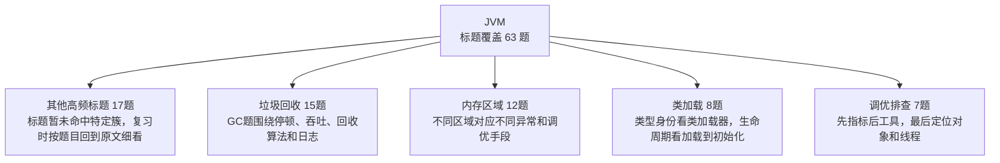

| 知识簇 | 覆盖题数 | 图中速记 | 代表标题 |
|---|---:|---|---|
| 其他高频标题 | 17 | 标题暂未命中特定簇，复习时按题目回到原文细看 | [什么是三色标记算法](02_JVM/0155_什么是三色标记算法.md) / [为什么这段代码在JDK不同版本中结果不同](02_JVM/0375_为什么这段代码在JDK不同版本中结果不同.md) / [jstat命令的作用是什么](02_JVM/0390_jstat命令的作用是什么.md) / [javap命令的作用是什么](02_JVM/0401_javap命令的作用是什么.md) / [jps命令的作用是什么](02_JVM/0418_jps命令的作用是什么.md) / [字符串常量是什么时候进入到字符串常量池的](02_JVM/0421_字符串常量是什么时候进入到字符串常量池的.md) |
| 垃圾回收 | 15 | GC题围绕停顿、吞吐、回收算法和日志 | [为什么G1从JDK 9之后成为默认的垃圾回收器](02_JVM/0109_为什么G1从JDK_9之后成为默认的垃圾回收器.md) / [G1如何精确控制 STW的时间的](02_JVM/0110_G1如何精确控制_STW的时间的.md) / [JDK 11中新出的ZGC有什么特点](02_JVM/0147_JDK_11中新出的ZGC有什么特点.md) / [ZGC和CMS和G1的区别对比](02_JVM/0148_ZGC和CMS和G1的区别对比.md) / [G1和CMS有什么区别](02_JVM/0149_G1和CMS有什么区别.md) / [JVM有哪些垃圾回收算法](02_JVM/0198_JVM有哪些垃圾回收算法.md) |
| 内存区域 | 12 | 不同区域对应不同异常和调优手段 | [G1 的分区机制中 每个Region的大小是固定的吗](02_JVM/0012_G1_的分区机制中_每个Region的大小是固定的吗.md) / [为什么JDK 1.8要废弃永久代 改用元空间](02_JVM/0057_为什么JDK_1.8要废弃永久代_改用元空间.md) / [JVM如何判断对象是否存活](02_JVM/0252_JVM如何判断对象是否存活.md) / [Java中的对象一定在堆上分配内存吗](02_JVM/0257_Java中的对象一定在堆上分配内存吗.md) / [JVM的运行时内存区域是怎样的](02_JVM/0259_JVM的运行时内存区域是怎样的.md) / [元空间满了 或溢出 可能是什么原因](02_JVM/0348_元空间满了_或溢出_可能是什么原因.md) |
| 类加载 | 8 | 类型身份看类加载器，生命周期看加载到初始化 | [Java中类加载的过程是怎么样的](02_JVM/0041_Java中类加载的过程是怎么样的.md) / [什么是双亲委派如何破坏](02_JVM/0302_什么是双亲委派如何破坏.md) / [ClassNotFoundException和NoClassDefFoundError的区别是什么](02_JVM/0456_ClassNotFoundException和NoClassDefFoundError的区别是什么.md) / [程序运行期发生ClassNotFoundException 可能是什么原因](02_JVM/0737_程序运行期发生ClassNotFoundException_可能是什么原因.md) / [JDK1.8和1.9中类加载器有哪些不同](02_JVM/0856_JDK1.8和1.9中类加载器有哪些不同.md) / [如何判断JVM中类和其他类是不是同一个类](02_JVM/0897_如何判断JVM中类和其他类是不是同一个类.md) |
| 调优排查 | 7 | 先指标后工具，最后定位对象和线程 | [jhat有什么用 如何用他分析堆dump](02_JVM/0087_jhat有什么用_如何用他分析堆dump.md) / [每天100w次登录请求 4C8G机器如何做JVM调优](02_JVM/0096_每天100w次登录请求_4C8G机器如何做JVM调优.md) / [常见的JVM调优工具有哪些](02_JVM/0145_常见的JVM调优工具有哪些.md) / [jmap命令的作用是什么](02_JVM/0411_jmap命令的作用是什么.md) / [jstack命令的作用是什么](02_JVM/0417_jstack命令的作用是什么.md) / [什么是Java Dump 如何获取](02_JVM/0426_什么是Java_Dump_如何获取.md) |
| 执行优化 | 4 | 解释 JVM 如何把字节码跑快 | [什么是AOT编译和JIT有啥区别](02_JVM/0088_什么是AOT编译和JIT有啥区别.md) / [简单介绍一下JIT优化技术](02_JVM/0691_简单介绍一下JIT优化技术.md) / [Java是编译型还是解释型](02_JVM/0717_Java是编译型还是解释型.md) / [什么是逃逸分析](02_JVM/0843_什么是逃逸分析.md) |

<details>
<summary>其他高频标题 全量题目 17 题</summary>

- [什么是三色标记算法](02_JVM/0155_什么是三色标记算法.md)
- [为什么这段代码在JDK不同版本中结果不同](02_JVM/0375_为什么这段代码在JDK不同版本中结果不同.md)
- [jstat命令的作用是什么](02_JVM/0390_jstat命令的作用是什么.md)
- [javap命令的作用是什么](02_JVM/0401_javap命令的作用是什么.md)
- [jps命令的作用是什么](02_JVM/0418_jps命令的作用是什么.md)
- [字符串常量是什么时候进入到字符串常量池的](02_JVM/0421_字符串常量是什么时候进入到字符串常量池的.md)
- [Arthas统计方法耗时的原理是什么](02_JVM/0497_Arthas统计方法耗时的原理是什么.md)
- [对JDK进程执行kill -9有什么影响](02_JVM/0690_对JDK进程执行kill_-9有什么影响.md)
- [什么情况会导致JVM退出](02_JVM/0764_什么情况会导致JVM退出.md)
- [什么是safe point 有啥用](02_JVM/0868_什么是safe_point_有啥用.md)
- [什么是强引用 软引用 弱引用和虚引用](02_JVM/0999_什么是强引用_软引用_弱引用和虚引用.md)
- [什么是Stop The World](02_JVM/1043_什么是Stop_The_World.md)
- [什么是跨代引用 有什么问题](02_JVM/1124_什么是跨代引用_有什么问题.md)
- [运行时常量池和字符串常量池的关系是什么](02_JVM/1148_运行时常量池和字符串常量池的关系是什么.md)
- [什么是方法区是如何实现的](02_JVM/1174_什么是方法区是如何实现的.md)
- [字符串常量池是如何实现的](02_JVM/1175_字符串常量池是如何实现的.md)
- [有哪些常用的JVM启动参数](02_JVM/1217_有哪些常用的JVM启动参数.md)

</details>

<details>
<summary>垃圾回收 全量题目 15 题</summary>

- [为什么G1从JDK 9之后成为默认的垃圾回收器](02_JVM/0109_为什么G1从JDK_9之后成为默认的垃圾回收器.md)
- [G1如何精确控制 STW的时间的](02_JVM/0110_G1如何精确控制_STW的时间的.md)
- [JDK 11中新出的ZGC有什么特点](02_JVM/0147_JDK_11中新出的ZGC有什么特点.md)
- [ZGC和CMS和G1的区别对比](02_JVM/0148_ZGC和CMS和G1的区别对比.md)
- [G1和CMS有什么区别](02_JVM/0149_G1和CMS有什么区别.md)
- [JVM有哪些垃圾回收算法](02_JVM/0198_JVM有哪些垃圾回收算法.md)
- [新生代如果只有一个Eden+一个Survivor可以吗](02_JVM/0261_新生代如果只有一个Eden+一个Survivor可以吗.md)
- [FullGC多久一次算正常](02_JVM/0314_FullGC多久一次算正常.md)
- [项目中如何选择垃圾回收器为啥选择这个](02_JVM/0763_项目中如何选择垃圾回收器为啥选择这个.md)
- [介绍下CMS的垃圾回收过程](02_JVM/0802_介绍下CMS的垃圾回收过程.md)
- [说一说JVM的并发回收和并行回收](02_JVM/0819_说一说JVM的并发回收和并行回收.md)
- [新生代和老年代的垃圾回收器有何区别](02_JVM/0984_新生代和老年代的垃圾回收器有何区别.md)
- [YoungGC和FullGC的触发条件是什么](02_JVM/1042_YoungGC和FullGC的触发条件是什么.md)
- [JVM 中一次完整的 GC 流程是怎样的](02_JVM/1163_JVM_中一次完整的_GC_流程是怎样的.md)
- [哪些语言有GC机制](02_JVM/1216_哪些语言有GC机制.md)

</details>

<details>
<summary>内存区域 全量题目 12 题</summary>

- [G1 的分区机制中 每个Region的大小是固定的吗](02_JVM/0012_G1_的分区机制中_每个Region的大小是固定的吗.md)
- [为什么JDK 1.8要废弃永久代 改用元空间](02_JVM/0057_为什么JDK_1.8要废弃永久代_改用元空间.md)
- [JVM如何判断对象是否存活](02_JVM/0252_JVM如何判断对象是否存活.md)
- [Java中的对象一定在堆上分配内存吗](02_JVM/0257_Java中的对象一定在堆上分配内存吗.md)
- [JVM的运行时内存区域是怎样的](02_JVM/0259_JVM的运行时内存区域是怎样的.md)
- [元空间满了 或溢出 可能是什么原因](02_JVM/0348_元空间满了_或溢出_可能是什么原因.md)
- [Java的堆是如何分代的为什么分代](02_JVM/1071_Java的堆是如何分代的为什么分代.md)
- [请分别写出一个Java堆 栈 元空间溢出的代码](02_JVM/1150_请分别写出一个Java堆_栈_元空间溢出的代码.md)
- [JVM为什么要把堆和栈区分出来呢](02_JVM/1162_JVM为什么要把堆和栈区分出来呢.md)
- [JVM是如何创建对象的](02_JVM/1188_JVM是如何创建对象的.md)
- [一个对象的结构是什么样的](02_JVM/1203_一个对象的结构是什么样的.md)
- [虚拟机中的堆一定是线程共享的吗](02_JVM/1243_虚拟机中的堆一定是线程共享的吗.md)

</details>

<details>
<summary>类加载 全量题目 8 题</summary>

- [Java中类加载的过程是怎么样的](02_JVM/0041_Java中类加载的过程是怎么样的.md)
- [什么是双亲委派如何破坏](02_JVM/0302_什么是双亲委派如何破坏.md)
- [ClassNotFoundException和NoClassDefFoundError的区别是什么](02_JVM/0456_ClassNotFoundException和NoClassDefFoundError的区别是什么.md)
- [程序运行期发生ClassNotFoundException 可能是什么原因](02_JVM/0737_程序运行期发生ClassNotFoundException_可能是什么原因.md)
- [JDK1.8和1.9中类加载器有哪些不同](02_JVM/0856_JDK1.8和1.9中类加载器有哪些不同.md)
- [如何判断JVM中类和其他类是不是同一个类](02_JVM/0897_如何判断JVM中类和其他类是不是同一个类.md)
- [什么是Class常量池 和运行时常量池关系是什么](02_JVM/1085_什么是Class常量池_和运行时常量池关系是什么.md)
- [破坏双亲委派之后 能重写String类吗](02_JVM/1097_破坏双亲委派之后_能重写String类吗.md)

</details>

<details>
<summary>调优排查 全量题目 7 题</summary>

- [jhat有什么用 如何用他分析堆dump](02_JVM/0087_jhat有什么用_如何用他分析堆dump.md)
- [每天100w次登录请求 4C8G机器如何做JVM调优](02_JVM/0096_每天100w次登录请求_4C8G机器如何做JVM调优.md)
- [常见的JVM调优工具有哪些](02_JVM/0145_常见的JVM调优工具有哪些.md)
- [jmap命令的作用是什么](02_JVM/0411_jmap命令的作用是什么.md)
- [jstack命令的作用是什么](02_JVM/0417_jstack命令的作用是什么.md)
- [什么是Java Dump 如何获取](02_JVM/0426_什么是Java_Dump_如何获取.md)
- [Java发生了OOM一定会导致JVM 退出吗](02_JVM/1070_Java发生了OOM一定会导致JVM_退出吗.md)

</details>

<details>
<summary>执行优化 全量题目 4 题</summary>

- [什么是AOT编译和JIT有啥区别](02_JVM/0088_什么是AOT编译和JIT有啥区别.md)
- [简单介绍一下JIT优化技术](02_JVM/0691_简单介绍一下JIT优化技术.md)
- [Java是编译型还是解释型](02_JVM/0717_Java是编译型还是解释型.md)
- [什么是逃逸分析](02_JVM/0843_什么是逃逸分析.md)

</details>

## 03_并发编程

入口：[03_并发编程/README.md](03_并发编程/README.md)

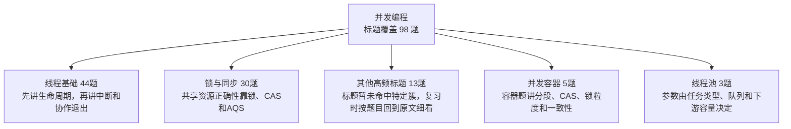

| 知识簇 | 覆盖题数 | 图中速记 | 代表标题 |
|---|---:|---|---|
| 线程基础 | 44 | 先讲生命周期，再讲中断和协作退出 | [怎么停止一个线程 为什么不推荐 stop](03_并发编程/0006_怎么停止一个线程_为什么不推荐_stop.md) / [什么是线程池 如何实现的](03_并发编程/0073_什么是线程池_如何实现的.md) / [线程数设定成多少更合适](03_并发编程/0074_线程数设定成多少更合适.md) / [线程池中使用ThreadLocal会有哪些潜在风险](03_并发编程/0135_线程池中使用ThreadLocal会有哪些潜在风险.md) / [JDK25的ScopedValue是什么为什么可以替代ThreadLocal](03_并发编程/0136_JDK25的ScopedValue是什么为什么可以替代ThreadLocal.md) / [ForkJoinPool和ThreadPoolExecutor区别是什么](03_并发编程/0183_ForkJoinPool和ThreadPoolExecutor区别是什么.md) |
| 锁与同步 | 30 | 共享资源正确性靠锁、CAS和AQS | [什么是AQS的独占模式和共享模式](03_并发编程/0044_什么是AQS的独占模式和共享模式.md) / [synchronized是如何保证原子性 可见性 有序性的](03_并发编程/0094_synchronized是如何保证原子性_可见性_有序性的.md) / [synchronized的锁升级过程是怎样的](03_并发编程/0181_synchronized的锁升级过程是怎样的.md) / [什么是活锁 和死锁有什么区别](03_并发编程/0215_什么是活锁_和死锁有什么区别.md) / [synchronized是怎么实现的](03_并发编程/0290_synchronized是怎么实现的.md) / [什么是CAS存在什么问题](03_并发编程/0299_什么是CAS存在什么问题.md) |
| 其他高频标题 | 13 | 标题暂未命中特定簇，复习时按题目回到原文细看 | [介绍下JUC 都有哪些工具类](03_并发编程/0216_介绍下JUC_都有哪些工具类.md) / [什么是fail-fast什么是fail-safe](03_并发编程/0226_什么是fail-fast什么是fail-safe.md) / [什么是伪共享 如何解决伪共享](03_并发编程/0238_什么是伪共享_如何解决伪共享.md) / [CountDownLatch CyclicBarrier Semaphore区别](03_并发编程/0369_CountDownLatch_CyclicBarrier_Semaphore区别.md) / [什么是Unsafe](03_并发编程/0403_什么是Unsafe.md) / [while(true)和for(;;)哪个性能好](03_并发编程/0471_while(true)和for(;;)哪个性能好.md) |
| 并发容器 | 5 | 容器题讲分段、CAS、锁粒度和一致性 | [ConcurrentHashMap在哪些地方做了并发控制](03_并发编程/0115_ConcurrentHashMap在哪些地方做了并发控制.md) / [ConcurrentHashMap是如何保证线程安全的](03_并发编程/0202_ConcurrentHashMap是如何保证线程安全的.md) / [HashMap Hashtable和ConcurrentHashMap的区别](03_并发编程/0234_HashMap_Hashtable和ConcurrentHashMap的区别.md) / [为什么ConcurrentHashMap不允许null值](03_并发编程/0779_为什么ConcurrentHashMap不允许null值.md) / [ConcurrentHashMap是如何保证fail-safe的](03_并发编程/0820_ConcurrentHashMap是如何保证fail-safe的.md) |
| 线程池 | 3 | 参数由任务类型、队列和下游容量决定 | [线程池有哪些核心参数](03_并发编程/0108_线程池有哪些核心参数.md) / [如何进行线程池调优](03_并发编程/0119_如何进行线程池调优.md) / [线程池的拒绝策略有哪些](03_并发编程/0753_线程池的拒绝策略有哪些.md) |
| 上下文与异步 | 3 | 上下文传递和异步编排都要防泄漏和阻塞 | [有了InheritableThreadLocal为啥还需要TransmittableThreadLocal](03_并发编程/0036_有了InheritableThreadLocal为啥还需要TransmittableThreadLocal.md) / [使用CompletableFuture完成并发编排 提升接口性能](03_并发编程/0684_使用CompletableFuture完成并发编排_提升接口性能.md) / [CompletableFuture的底层是如何实现的](03_并发编程/0836_CompletableFuture的底层是如何实现的.md) |

<details>
<summary>线程基础 全量题目 44 题</summary>

- [怎么停止一个线程 为什么不推荐 stop](03_并发编程/0006_怎么停止一个线程_为什么不推荐_stop.md)
- [什么是线程池 如何实现的](03_并发编程/0073_什么是线程池_如何实现的.md)
- [线程数设定成多少更合适](03_并发编程/0074_线程数设定成多少更合适.md)
- [线程池中使用ThreadLocal会有哪些潜在风险](03_并发编程/0135_线程池中使用ThreadLocal会有哪些潜在风险.md)
- [JDK25的ScopedValue是什么为什么可以替代ThreadLocal](03_并发编程/0136_JDK25的ScopedValue是什么为什么可以替代ThreadLocal.md)
- [ForkJoinPool和ThreadPoolExecutor区别是什么](03_并发编程/0183_ForkJoinPool和ThreadPoolExecutor区别是什么.md)
- [动态线程池的原理是什么](03_并发编程/0277_动态线程池的原理是什么.md)
- [能不能谈谈你对线程安全的理解](03_并发编程/0279_能不能谈谈你对线程安全的理解.md)
- [有三个线程T1,T2,T3如何保证顺序执行](03_并发编程/0362_有三个线程T1,T2,T3如何保证顺序执行.md)
- [SimpleDateFormat是线程安全的吗使用时应该注意什么](03_并发编程/0364_SimpleDateFormat是线程安全的吗使用时应该注意什么.md)
- [父子线程之间怎么共享 传递数据](03_并发编程/0368_父子线程之间怎么共享_传递数据.md)
- [不使用锁如何实现线程安全的单例](03_并发编程/0412_不使用锁如何实现线程安全的单例.md)
- [如何对多线程进行Debug](03_并发编程/0534_如何对多线程进行Debug.md)
- [线程同步的方式有哪些](03_并发编程/0578_线程同步的方式有哪些.md)
- [什么是ThreadLocal 如何实现的](03_并发编程/0579_什么是ThreadLocal_如何实现的.md)
- [run start wait sleep notify notifyAll区别](03_并发编程/0623_run_start_wait_sleep_notify_notifyAll区别.md)
- [创建线程有几种方式](03_并发编程/0624_创建线程有几种方式.md)
- [JDK21 中的虚拟线程是怎么回事](03_并发编程/0638_JDK21_中的虚拟线程是怎么回事.md)
- [线程有几种状态 状态之间的流转是怎样的](03_并发编程/0653_线程有几种状态_状态之间的流转是怎样的.md)
- [Java线程出现异常 进程为啥不会退出](03_并发编程/0681_Java线程出现异常_进程为啥不会退出.md)
- [什么是多线程中的上下文切换](03_并发编程/0682_什么是多线程中的上下文切换.md)
- [如何实现主线程捕获子线程异常](03_并发编程/0706_如何实现主线程捕获子线程异常.md)
- [线程的实现方式有哪些](03_并发编程/0718_线程的实现方式有哪些.md)
- [Java是如何判断一个线程是否存活的](03_并发编程/0721_Java是如何判断一个线程是否存活的.md)
- [线程是如何被调度的](03_并发编程/0736_线程是如何被调度的.md)
- [为什么虚拟线程尽量避免使用ThreadLocal](03_并发编程/0751_为什么虚拟线程尽量避免使用ThreadLocal.md)
- [为什么虚拟线程不要和线程池一起用](03_并发编程/0752_为什么虚拟线程不要和线程池一起用.md)
- [为什么虚拟线程不能用synchronized](03_并发编程/0766_为什么虚拟线程不能用synchronized.md)
- [为什么不建议通过Executors构建线程池](03_并发编程/0767_为什么不建议通过Executors构建线程池.md)
- [有哪些实现线程安全的方案](03_并发编程/0784_有哪些实现线程安全的方案.md)
- [什么是COW 如何保证的线程安全](03_并发编程/0792_什么是COW_如何保证的线程安全.md)
- [如何保证多线程下 i++ 结果正确](03_并发编程/0794_如何保证多线程下_i++_结果正确.md)
- [如何将集合变成线程安全的](03_并发编程/0805_如何将集合变成线程安全的.md)
- [AQS是如何实现线程的等待和唤醒的](03_并发编程/0809_AQS是如何实现线程的等待和唤醒的.md)
- [ThreadLocal的应用场景有哪些](03_并发编程/0846_ThreadLocal的应用场景有哪些.md)
- [如何让Java的线程池顺序执行任务](03_并发编程/0860_如何让Java的线程池顺序执行任务.md)
- [三个线程分别顺序打印0-100](03_并发编程/0861_三个线程分别顺序打印0-100.md)
- [如何对多线程进行编排](03_并发编程/0862_如何对多线程进行编排.md)
- [同步容器 如Vector 的所有操作一定是线程安全的吗](03_并发编程/0869_同步容器_如Vector_的所有操作一定是线程安全的吗.md)
- [线程池中怎么设置超时时间一个线程如果要运行10s 怎么在1s就抛出异常](03_并发编程/1099_线程池中怎么设置超时时间一个线程如果要运行10s_怎么在1s就抛出异常.md)
- [两个线程 一个打印123 一个打印ABC 交替输出1A2B3C](03_并发编程/1114_两个线程_一个打印123_一个打印ABC_交替输出1A2B3C.md)
- [两个线程 一个打印奇数 一个打印偶数 然后顺序打印出1-100](03_并发编程/1125_两个线程_一个打印奇数_一个打印偶数_然后顺序打印出1-100.md)
- [基于TTL 解决线程池中 ThreadLocal 线程无法共享的问题](03_并发编程/1139_基于TTL_解决线程池中_ThreadLocal_线程无法共享的问题.md)
- [JVM如何保证给对象分配内存过程的线程安全](03_并发编程/1248_JVM如何保证给对象分配内存过程的线程安全.md)

</details>

<details>
<summary>锁与同步 全量题目 30 题</summary>

- [什么是AQS的独占模式和共享模式](03_并发编程/0044_什么是AQS的独占模式和共享模式.md)
- [synchronized是如何保证原子性 可见性 有序性的](03_并发编程/0094_synchronized是如何保证原子性_可见性_有序性的.md)
- [synchronized的锁升级过程是怎样的](03_并发编程/0181_synchronized的锁升级过程是怎样的.md)
- [什么是活锁 和死锁有什么区别](03_并发编程/0215_什么是活锁_和死锁有什么区别.md)
- [synchronized是怎么实现的](03_并发编程/0290_synchronized是怎么实现的.md)
- [什么是CAS存在什么问题](03_并发编程/0299_什么是CAS存在什么问题.md)
- [什么是死锁 如何解决](03_并发编程/0300_什么是死锁_如何解决.md)
- [synchronized的锁优化是怎样的](03_并发编程/0319_synchronized的锁优化是怎样的.md)
- [LongAdder和AtomicLong的区别](03_并发编程/0374_LongAdder和AtomicLong的区别.md)
- [公平锁和非公平锁的区别](03_并发编程/0381_公平锁和非公平锁的区别.md)
- [synchronized和reentrantLock区别](03_并发编程/0393_synchronized和reentrantLock区别.md)
- [CAS一定有自旋吗](03_并发编程/0413_CAS一定有自旋吗.md)
- [如何理解AQS](03_并发编程/0420_如何理解AQS.md)
- [volatile是如何保证可见性和有序性的](03_并发编程/0443_volatile是如何保证可见性和有序性的.md)
- [volatile能保证原子性吗为什么](03_并发编程/0470_volatile能保证原子性吗为什么.md)
- [synchronized的重量级锁很慢 为什么还需要重量级锁](03_并发编程/0482_synchronized的重量级锁很慢_为什么还需要重量级锁.md)
- [synchronized锁的是什么](03_并发编程/0512_synchronized锁的是什么.md)
- [并发编程中的原子性和数据库ACID的原子性一样吗](03_并发编程/0537_并发编程中的原子性和数据库ACID的原子性一样吗.md)
- [什么是可重入锁 怎么实现可重入锁](03_并发编程/0707_什么是可重入锁_怎么实现可重入锁.md)
- [如何实现无锁化编程](03_并发编程/0719_如何实现无锁化编程.md)
- [sychronized是非公平锁吗 那么是如何体现的](03_并发编程/0734_sychronized是非公平锁吗_那么是如何体现的.md)
- [ConcurrentHashMap为什么在JDK1.8中使用synchronized而不是ReentrantLock](03_并发编程/0748_ConcurrentHashMap为什么在JDK1.8中使用synchronized而不是ReentrantLock.md)
- [死锁会导致CPU使用率升高吗为什么](03_并发编程/0768_死锁会导致CPU使用率升高吗为什么.md)
- [AQS为什么采用双向链表](03_并发编程/0782_AQS为什么采用双向链表.md)
- [AQS的同步队列和条件队列原理](03_并发编程/0808_AQS的同步队列和条件队列原理.md)
- [不使用synchronized和Lock如何设计一个线程安全的单例](03_并发编程/0815_不使用synchronized和Lock如何设计一个线程安全的单例.md)
- [有了CAS为啥还需要volatile](03_并发编程/0822_有了CAS为啥还需要volatile.md)
- [如何使用jstack分析死锁](03_并发编程/0837_如何使用jstack分析死锁.md)
- [乐观锁与悲观锁如何实现](03_并发编程/0921_乐观锁与悲观锁如何实现.md)
- [高并发场景中 乐观锁和悲观锁哪个更适合](03_并发编程/1264_高并发场景中_乐观锁和悲观锁哪个更适合.md)

</details>

<details>
<summary>其他高频标题 全量题目 13 题</summary>

- [介绍下JUC 都有哪些工具类](03_并发编程/0216_介绍下JUC_都有哪些工具类.md)
- [什么是fail-fast什么是fail-safe](03_并发编程/0226_什么是fail-fast什么是fail-safe.md)
- [什么是伪共享 如何解决伪共享](03_并发编程/0238_什么是伪共享_如何解决伪共享.md)
- [CountDownLatch CyclicBarrier Semaphore区别](03_并发编程/0369_CountDownLatch_CyclicBarrier_Semaphore区别.md)
- [什么是Unsafe](03_并发编程/0403_什么是Unsafe.md)
- [while(true)和for(;;)哪个性能好](03_并发编程/0471_while(true)和for(;;)哪个性能好.md)
- [什么是Java内存模型 JMM](03_并发编程/0553_什么是Java内存模型_JMM.md)
- [有了MESI为啥还需要JMM](03_并发编程/0783_有了MESI为啥还需要JMM.md)
- [到底啥是内存屏障到底怎么加的](03_并发编程/0835_到底啥是内存屏障到底怎么加的.md)
- [什么是总线嗅探和总线风暴 和JMM有什么关系](03_并发编程/0847_什么是总线嗅探和总线风暴_和JMM有什么关系.md)
- [happens-before和as-if-serial有啥区别和联系](03_并发编程/0870_happens-before和as-if-serial有啥区别和联系.md)
- [什么是happens-before原则](03_并发编程/0884_什么是happens-before原则.md)
- [并发调三个方法 实现只要有一个成功就立即成功 否则等都失败才失败](03_并发编程/1137_并发调三个方法_实现只要有一个成功就立即成功_否则等都失败才失败.md)

</details>

<details>
<summary>并发容器 全量题目 5 题</summary>

- [ConcurrentHashMap在哪些地方做了并发控制](03_并发编程/0115_ConcurrentHashMap在哪些地方做了并发控制.md)
- [ConcurrentHashMap是如何保证线程安全的](03_并发编程/0202_ConcurrentHashMap是如何保证线程安全的.md)
- [HashMap Hashtable和ConcurrentHashMap的区别](03_并发编程/0234_HashMap_Hashtable和ConcurrentHashMap的区别.md)
- [为什么ConcurrentHashMap不允许null值](03_并发编程/0779_为什么ConcurrentHashMap不允许null值.md)
- [ConcurrentHashMap是如何保证fail-safe的](03_并发编程/0820_ConcurrentHashMap是如何保证fail-safe的.md)

</details>

<details>
<summary>线程池 全量题目 3 题</summary>

- [线程池有哪些核心参数](03_并发编程/0108_线程池有哪些核心参数.md)
- [如何进行线程池调优](03_并发编程/0119_如何进行线程池调优.md)
- [线程池的拒绝策略有哪些](03_并发编程/0753_线程池的拒绝策略有哪些.md)

</details>

<details>
<summary>上下文与异步 全量题目 3 题</summary>

- [有了InheritableThreadLocal为啥还需要TransmittableThreadLocal](03_并发编程/0036_有了InheritableThreadLocal为啥还需要TransmittableThreadLocal.md)
- [使用CompletableFuture完成并发编排 提升接口性能](03_并发编程/0684_使用CompletableFuture完成并发编排_提升接口性能.md)
- [CompletableFuture的底层是如何实现的](03_并发编程/0836_CompletableFuture的底层是如何实现的.md)

</details>

## 04_Spring体系

入口：[04_Spring体系/README.md](04_Spring体系/README.md)

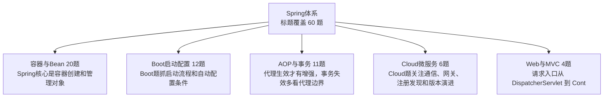

| 知识簇 | 覆盖题数 | 图中速记 | 代表标题 |
|---|---:|---|---|
| 容器与Bean | 20 | Spring核心是容器创建和管理对象 | [如何根据配置动态生成Spring的Bean](04_Spring体系/0121_如何根据配置动态生成Spring的Bean.md) / [Spring Boot 如何让你的 bean 在其他 bean 之前加载](04_Spring体系/0294_Spring_Boot_如何让你的_bean_在其他_bean_之前加载.md) / [Spring Bean的初始化过程是怎么样的](04_Spring体系/0700_Spring_Bean的初始化过程是怎么样的.md) / [Spring Bean的生命周期是怎么样的](04_Spring体系/0715_Spring_Bean的生命周期是怎么样的.md) / [为什么Spring不建议使用基于字段的依赖注入](04_Spring体系/0716_为什么Spring不建议使用基于字段的依赖注入.md) / [介绍一下Spring的IOC](04_Spring体系/0747_介绍一下Spring的IOC.md) |
| Boot启动配置 | 12 | Boot题抓启动流程和自动配置条件 | [application.yml 和 bootstrap.yml 这两个配置文件有什么区别](04_Spring体系/0075_application.yml_和_bootstrap.yml_这两个配置文件有什么区别.md) / [Spring 6.0和SpringBoot 3.0有什么新特性](04_Spring体系/0082_Spring_6.0和SpringBoot_3.0有什么新特性.md) / [SpringBoot的启动流程是怎么样的](04_Spring体系/0200_SpringBoot的启动流程是怎么样的.md) / [为什么SpringBoot 3中移除了spring.factories](04_Spring体系/0297_为什么SpringBoot_3中移除了spring.factories.md) / [SpringBoot和Spring的区别是什么](04_Spring体系/0699_SpringBoot和Spring的区别是什么.md) / [SpringBoot是如何实现main方法启动Web项目的](04_Spring体系/0746_SpringBoot是如何实现main方法启动Web项目的.md) |
| AOP与事务 | 11 | 代理生效才有增强，事务失效多看代理边界 | [Spring事务失效可能是哪些原因](04_Spring体系/0089_Spring事务失效可能是哪些原因.md) / [Spring中如何开启事务](04_Spring体系/0101_Spring中如何开启事务.md) / [Spring中@Transactional事务的实现原理](04_Spring体系/0102_Spring中@Transactional事务的实现原理.md) / [介绍一下Spring的AOP](04_Spring体系/0196_介绍一下Spring的AOP.md) / [为啥我不建议使用@Transactional事务](04_Spring体系/0490_为啥我不建议使用@Transactional事务.md) / [Spring中的事务事件如何使用](04_Spring体系/0688_Spring中的事务事件如何使用.md) |
| Cloud微服务 | 6 | Cloud题关注通信、网关、注册发现和版本演进 | [为什么需要SpringCloud Gateway 他起到了什么作用](04_Spring体系/1083_为什么需要SpringCloud_Gateway_他起到了什么作用.md) / [在 Spring Cloud 中 服务间的通信有哪些方式](04_Spring体系/1084_在_Spring_Cloud_中_服务间的通信有哪些方式.md) / [SpringCloud 在Spring6.0后有哪些变化](04_Spring体系/1160_SpringCloud_在Spring6.0后有哪些变化.md) / [SpringCloud和Dubbo有什么区别](04_Spring体系/1161_SpringCloud和Dubbo有什么区别.md) / [什么是SpringCloud 有哪些组件](04_Spring体系/1173_什么是SpringCloud_有哪些组件.md) / [Eureka 在 Spring Boot 3.x 之后被移除了 如何替代](04_Spring体系/1213_Eureka_在_Spring_Boot_3.x_之后被移除了_如何替代.md) |
| Web与MVC | 4 | 请求入口从 DispatcherServlet 到 Controller | [SpringMVC中如何实现流式输出](04_Spring体系/0326_SpringMVC中如何实现流式输出.md) / [Spring中shutdownhook作用是什么](04_Spring体系/0731_Spring中shutdownhook作用是什么.md) / [SpringMVC是如何将不同的Request路由到不同Controller中的](04_Spring体系/0790_SpringMVC是如何将不同的Request路由到不同Controller中的.md) / [MVC和三层架构有什么区别](04_Spring体系/1218_MVC和三层架构有什么区别.md) |
| 其他高频标题 | 4 | 标题暂未命中特定簇，复习时按题目回到原文细看 | [Spring 7 和Spring Boot 4 都有哪些新特性](04_Spring体系/0080_Spring_7_和Spring_Boot_4_都有哪些新特性.md) / [@PostConstruct init-method和afterPropertiesSet执行顺序](04_Spring体系/0689_@PostConstruct_init-method和afterPropertiesSet执行顺序.md) / [Spring中用到了哪些设计模式](04_Spring体系/0831_Spring中用到了哪些设计模式.md) / [Spring在业务中常见的使用方式](04_Spring体系/0855_Spring在业务中常见的使用方式.md) |
| 事件与扩展 | 3 | 扩展点用于事件驱动、启动钩子和动态装配 | [在Spring中如何使用Spring Event做事件驱动](04_Spring体系/0059_在Spring中如何使用Spring_Event做事件驱动.md) / [介绍下@Scheduled的实现原理以及用法](04_Spring体系/0907_介绍下@Scheduled的实现原理以及用法.md) / [Spring Event和MQ有什么区别各自适用场景是什么](04_Spring体系/1127_Spring_Event和MQ有什么区别各自适用场景是什么.md) |

<details>
<summary>容器与Bean 全量题目 20 题</summary>

- [如何根据配置动态生成Spring的Bean](04_Spring体系/0121_如何根据配置动态生成Spring的Bean.md)
- [Spring Boot 如何让你的 bean 在其他 bean 之前加载](04_Spring体系/0294_Spring_Boot_如何让你的_bean_在其他_bean_之前加载.md)
- [Spring Bean的初始化过程是怎么样的](04_Spring体系/0700_Spring_Bean的初始化过程是怎么样的.md)
- [Spring Bean的生命周期是怎么样的](04_Spring体系/0715_Spring_Bean的生命周期是怎么样的.md)
- [为什么Spring不建议使用基于字段的依赖注入](04_Spring体系/0716_为什么Spring不建议使用基于字段的依赖注入.md)
- [介绍一下Spring的IOC](04_Spring体系/0747_介绍一下Spring的IOC.md)
- [什么是Spring的循环依赖问题](04_Spring体系/0818_什么是Spring的循环依赖问题.md)
- [BeanFactory和FactroyBean的关系](04_Spring体系/0867_BeanFactory和FactroyBean的关系.md)
- [Spring 中注入 Bean 有几种方式](04_Spring体系/0879_Spring_中注入_Bean_有几种方式.md)
- [Spring中创建Bean有几种方式](04_Spring体系/0896_Spring中创建Bean有几种方式.md)
- [Spring的@Autowired能用在Map上吗](04_Spring体系/0922_Spring的@Autowired能用在Map上吗.md)
- [什么是微服务的循环依赖](04_Spring体系/0932_什么是微服务的循环依赖.md)
- [Spring 中的 Bean 作用域有哪些](04_Spring体系/0971_Spring_中的_Bean_作用域有哪些.md)
- [@Lazy注解能解决循环依赖吗](04_Spring体系/0982_@Lazy注解能解决循环依赖吗.md)
- [Spring 中的 Bean 是线程安全的吗](04_Spring体系/0983_Spring_中的_Bean_是线程安全的吗.md)
- [Spring中@Service @Component @Repository等注解区别是什么](04_Spring体系/1012_Spring中@Service_@Component_@Repository等注解区别是什么.md)
- [Spring解决循环依赖一定需要三级缓存吗](04_Spring体系/1029_Spring解决循环依赖一定需要三级缓存吗.md)
- [三级缓存是如何解决循环依赖的问题的](04_Spring体系/1041_三级缓存是如何解决循环依赖的问题的.md)
- [什么是Spring的三级缓存](04_Spring体系/1055_什么是Spring的三级缓存.md)
- [Spring默认支持循环依赖吗如果发生如何解决](04_Spring体系/1215_Spring默认支持循环依赖吗如果发生如何解决.md)

</details>

<details>
<summary>Boot启动配置 全量题目 12 题</summary>

- [application.yml 和 bootstrap.yml 这两个配置文件有什么区别](04_Spring体系/0075_application.yml_和_bootstrap.yml_这两个配置文件有什么区别.md)
- [Spring 6.0和SpringBoot 3.0有什么新特性](04_Spring体系/0082_Spring_6.0和SpringBoot_3.0有什么新特性.md)
- [SpringBoot的启动流程是怎么样的](04_Spring体系/0200_SpringBoot的启动流程是怎么样的.md)
- [为什么SpringBoot 3中移除了spring.factories](04_Spring体系/0297_为什么SpringBoot_3中移除了spring.factories.md)
- [SpringBoot和Spring的区别是什么](04_Spring体系/0699_SpringBoot和Spring的区别是什么.md)
- [SpringBoot是如何实现main方法启动Web项目的](04_Spring体系/0746_SpringBoot是如何实现main方法启动Web项目的.md)
- [Springboot是如何实现自动配置的](04_Spring体系/0762_Springboot是如何实现自动配置的.md)
- [如何自定义一个starter](04_Spring体系/0958_如何自定义一个starter.md)
- [Spring中如何实现多环境配置](04_Spring体系/0959_Spring中如何实现多环境配置.md)
- [如何在Spring启动过程中做缓存预热](04_Spring体系/0998_如何在Spring启动过程中做缓存预热.md)
- [SpringBoot如何做优雅停机](04_Spring体系/1011_SpringBoot如何做优雅停机.md)
- [SpringBoot和传统的双亲委派有什么不一样吗](04_Spring体系/1187_SpringBoot和传统的双亲委派有什么不一样吗.md)

</details>

<details>
<summary>AOP与事务 全量题目 11 题</summary>

- [Spring事务失效可能是哪些原因](04_Spring体系/0089_Spring事务失效可能是哪些原因.md)
- [Spring中如何开启事务](04_Spring体系/0101_Spring中如何开启事务.md)
- [Spring中@Transactional事务的实现原理](04_Spring体系/0102_Spring中@Transactional事务的实现原理.md)
- [介绍一下Spring的AOP](04_Spring体系/0196_介绍一下Spring的AOP.md)
- [为啥我不建议使用@Transactional事务](04_Spring体系/0490_为啥我不建议使用@Transactional事务.md)
- [Spring中的事务事件如何使用](04_Spring体系/0688_Spring中的事务事件如何使用.md)
- [Spring的AOP在什么场景下会失效](04_Spring体系/0714_Spring的AOP在什么场景下会失效.md)
- [Spring的事务传播机制有哪些](04_Spring体系/0880_Spring的事务传播机制有哪些.md)
- [Spring的事务在多线程下生效吗为什么](04_Spring体系/0936_Spring的事务在多线程下生效吗为什么.md)
- [为什么不建议直接使用Spring的@Async](04_Spring体系/1056_为什么不建议直接使用Spring的@Async.md)
- [同时使用 @Transactional 与 @Async 时 事务会不会生效](04_Spring体系/1202_同时使用_@Transactional_与_@Async_时_事务会不会生效.md)

</details>

<details>
<summary>Cloud微服务 全量题目 6 题</summary>

- [为什么需要SpringCloud Gateway 他起到了什么作用](04_Spring体系/1083_为什么需要SpringCloud_Gateway_他起到了什么作用.md)
- [在 Spring Cloud 中 服务间的通信有哪些方式](04_Spring体系/1084_在_Spring_Cloud_中_服务间的通信有哪些方式.md)
- [SpringCloud 在Spring6.0后有哪些变化](04_Spring体系/1160_SpringCloud_在Spring6.0后有哪些变化.md)
- [SpringCloud和Dubbo有什么区别](04_Spring体系/1161_SpringCloud和Dubbo有什么区别.md)
- [什么是SpringCloud 有哪些组件](04_Spring体系/1173_什么是SpringCloud_有哪些组件.md)
- [Eureka 在 Spring Boot 3.x 之后被移除了 如何替代](04_Spring体系/1213_Eureka_在_Spring_Boot_3.x_之后被移除了_如何替代.md)

</details>

<details>
<summary>Web与MVC 全量题目 4 题</summary>

- [SpringMVC中如何实现流式输出](04_Spring体系/0326_SpringMVC中如何实现流式输出.md)
- [Spring中shutdownhook作用是什么](04_Spring体系/0731_Spring中shutdownhook作用是什么.md)
- [SpringMVC是如何将不同的Request路由到不同Controller中的](04_Spring体系/0790_SpringMVC是如何将不同的Request路由到不同Controller中的.md)
- [MVC和三层架构有什么区别](04_Spring体系/1218_MVC和三层架构有什么区别.md)

</details>

<details>
<summary>其他高频标题 全量题目 4 题</summary>

- [Spring 7 和Spring Boot 4 都有哪些新特性](04_Spring体系/0080_Spring_7_和Spring_Boot_4_都有哪些新特性.md)
- [@PostConstruct init-method和afterPropertiesSet执行顺序](04_Spring体系/0689_@PostConstruct_init-method和afterPropertiesSet执行顺序.md)
- [Spring中用到了哪些设计模式](04_Spring体系/0831_Spring中用到了哪些设计模式.md)
- [Spring在业务中常见的使用方式](04_Spring体系/0855_Spring在业务中常见的使用方式.md)

</details>

<details>
<summary>事件与扩展 全量题目 3 题</summary>

- [在Spring中如何使用Spring Event做事件驱动](04_Spring体系/0059_在Spring中如何使用Spring_Event做事件驱动.md)
- [介绍下@Scheduled的实现原理以及用法](04_Spring体系/0907_介绍下@Scheduled的实现原理以及用法.md)
- [Spring Event和MQ有什么区别各自适用场景是什么](04_Spring体系/1127_Spring_Event和MQ有什么区别各自适用场景是什么.md)

</details>

## 05_MySQL

入口：[05_MySQL/README.md](05_MySQL/README.md)

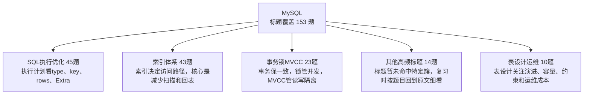

| 知识簇 | 覆盖题数 | 图中速记 | 代表标题 |
|---|---:|---|---|
| SQL执行优化 | 45 | 执行计划看type、key、rows、Extra | [select from table where a=1 and b 2 order by c,d,f 怎么加索引](05_MySQL/0111_select_from_table_where_a=1_and_b_2_order_by_c,d,f_怎么加索引.md) / [MySQL中like的模糊查询如何优化](05_MySQL/0117_MySQL中like的模糊查询如何优化.md) / [SQL语句如何实现insertOrUpdate的功能](05_MySQL/0127_SQL语句如何实现insertOrUpdate的功能.md) / [执行计划中的filtered的值有啥用](05_MySQL/0173_执行计划中的filtered的值有啥用.md) / [SQL执行计划分析的时候 要关注哪些信息](05_MySQL/0182_SQL执行计划分析的时候_要关注哪些信息.md) / [MySQL热点数据更新会带来哪些问题](05_MySQL/0207_MySQL热点数据更新会带来哪些问题.md) |
| 索引体系 | 43 | 索引决定访问路径，核心是减少扫描和回表 | [从 innodb 的索引结构分析 为什么索引的 key 长度不能太长](05_MySQL/0037_从_innodb_的索引结构分析_为什么索引的_key_长度不能太长.md) / [MySQL用了函数一定会索引失效吗](05_MySQL/0038_MySQL用了函数一定会索引失效吗.md) / [InnoDB中的索引类型](05_MySQL/0046_InnoDB中的索引类型.md) / [什么是索引合并 原理是什么](05_MySQL/0060_什么是索引合并_原理是什么.md) / [什么是ILM 索引生命周期管理](05_MySQL/0083_什么是ILM_索引生命周期管理.md) / [select x from table where a = 1 这条sql导致索引失效的原因有哪些](05_MySQL/0106_select_x_from_table_where_a_=_1_这条sql导致索引失效的原因有哪些.md) |
| 事务锁MVCC | 23 | 事务保一致，锁管并发，MVCC管读写隔离 | [代码中使用长事务 会带来哪些问题](05_MySQL/0049_代码中使用长事务_会带来哪些问题.md) / [MySQL执行大事务会存在什么问题](05_MySQL/0125_MySQL执行大事务会存在什么问题.md) / [如何理解MVCC](05_MySQL/0128_如何理解MVCC.md) / [MySQL中的事务隔离级别](05_MySQL/0129_MySQL中的事务隔离级别.md) / [InnoDB的一次更新事务过程是怎么样的](05_MySQL/0263_InnoDB的一次更新事务过程是怎么样的.md) / [介绍下InnoDB的锁机制](05_MySQL/0284_介绍下InnoDB的锁机制.md) |
| 其他高频标题 | 14 | 标题暂未命中特定簇，复习时按题目回到原文细看 | [新生代和老年代的GC算法](05_MySQL/0197_新生代和老年代的GC算法.md) / [为什么默认RR 大厂要改成RC](05_MySQL/0997_为什么默认RR_大厂要改成RC.md) / [Oracle中如何实现行转列和列转行](05_MySQL/1025_Oracle中如何实现行转列和列转行.md) / [阿里巴巴的去 IOE架构中为什么废弃 Oracle](05_MySQL/1063_阿里巴巴的去_IOE架构中为什么废弃_Oracle.md) / [是否支持emoji表情存储 如果不支持 如何操作](05_MySQL/1080_是否支持emoji表情存储_如果不支持_如何操作.md) / [InnoDB支持哪几种行格式](05_MySQL/1081_InnoDB支持哪几种行格式.md) |
| 表设计运维 | 10 | 表设计关注演进、容量、约束和运维成本 | [MySQL千万级大表中如何增加字段](05_MySQL/0222_MySQL千万级大表中如何增加字段.md) / [什么是OnlineDDL](05_MySQL/0223_什么是OnlineDDL.md) / [什么是MySQL的内存碎片如何清理](05_MySQL/0296_什么是MySQL的内存碎片如何清理.md) / [MySQL千万级大表如何做数据清理](05_MySQL/0712_MySQL千万级大表如何做数据清理.md) / [什么是数据归档 一般是怎么做的](05_MySQL/0786_什么是数据归档_一般是怎么做的.md) / [为什么不推荐使用外键](05_MySQL/0919_为什么不推荐使用外键.md) |
| MyBatis与ORM | 10 | ORM题抓映射、分页、插件和缓存 | [Mybatis 是否支持延迟加载实现原理是什么](05_MySQL/0917_Mybatis_是否支持延迟加载实现原理是什么.md) / [Mybatis用的什么连接池](05_MySQL/0918_Mybatis用的什么连接池.md) / [Mybatis的缓存机制](05_MySQL/0933_Mybatis的缓存机制.md) / [Mybatis的工作原理](05_MySQL/0944_Mybatis的工作原理.md) / [Mybatis插件的运行原理](05_MySQL/0945_Mybatis插件的运行原理.md) / [Mybatis是如何实现字段映射的](05_MySQL/0967_Mybatis是如何实现字段映射的.md) |
| 日志与复制 | 8 | redo保恢复，undo保回滚，binlog保复制 | [MySQL如果突然断电 会发生数据丢失吗](05_MySQL/0738_MySQL如果突然断电_会发生数据丢失吗.md) / [undolog会一直存在吗什么时候删除](05_MySQL/0876_undolog会一直存在吗什么时候删除.md) / [介绍下MySQL 5.7中的组提交](05_MySQL/1009_介绍下MySQL_5.7中的组提交.md) / [MySQL的并行复制原理](05_MySQL/1066_MySQL的并行复制原理.md) / [MySQL的binlog有几种格式](05_MySQL/1079_MySQL的binlog有几种格式.md) / [binlog redolog和undolog区别](05_MySQL/1108_binlog_redolog和undolog区别.md) |

<details>
<summary>SQL执行优化 全量题目 45 题</summary>

- [select from table where a=1 and b 2 order by c,d,f 怎么加索引](05_MySQL/0111_select_from_table_where_a=1_and_b_2_order_by_c,d,f_怎么加索引.md)
- [MySQL中like的模糊查询如何优化](05_MySQL/0117_MySQL中like的模糊查询如何优化.md)
- [SQL语句如何实现insertOrUpdate的功能](05_MySQL/0127_SQL语句如何实现insertOrUpdate的功能.md)
- [执行计划中的filtered的值有啥用](05_MySQL/0173_执行计划中的filtered的值有啥用.md)
- [SQL执行计划分析的时候 要关注哪些信息](05_MySQL/0182_SQL执行计划分析的时候_要关注哪些信息.md)
- [MySQL热点数据更新会带来哪些问题](05_MySQL/0207_MySQL热点数据更新会带来哪些问题.md)
- [order by 是怎么实现的](05_MySQL/0211_order_by_是怎么实现的.md)
- [一次insert操作 MySQL的几种log的写入顺序](05_MySQL/0242_一次insert操作_MySQL的几种log的写入顺序.md)
- [MySQL能保证数据100%不丢吗](05_MySQL/0274_MySQL能保证数据100%不丢吗.md)
- [表中只有a,b,c 三个字段 比较select 与 select a,b,c有什么区别](05_MySQL/0282_表中只有a,b,c_三个字段_比较select_与_select_a,b,c有什么区别.md)
- [MySQL怎么做热点数据高效更新](05_MySQL/0338_MySQL怎么做热点数据高效更新.md)
- [为什么预编译可以避免SQL注入](05_MySQL/0494_为什么预编译可以避免SQL注入.md)
- [为什么要尽量避免使用select](05_MySQL/0745_为什么要尽量避免使用select.md)
- [MySQL的update语句什么时候锁行什么时候锁表](05_MySQL/0775_MySQL的update语句什么时候锁行什么时候锁表.md)
- [a b都有索引 select from table where a = xx order by b 走哪个索引](05_MySQL/0788_a_b都有索引_select_from_table_where_a_=_xx_order_by_b_走哪个索引.md)
- [MySQL千万级数据量 查询如何做优化](05_MySQL/0796_MySQL千万级数据量_查询如何做优化.md)
- [limit的原理是什么](05_MySQL/0800_limit的原理是什么.md)
- [MySQL单表一千万条数据怎么做分页查询](05_MySQL/0812_MySQL单表一千万条数据怎么做分页查询.md)
- [MySQL如何实现行转列和列转行](05_MySQL/0829_MySQL如何实现行转列和列转行.md)
- [MySQL的BLOB和TEXT有什么区别](05_MySQL/0854_MySQL的BLOB和TEXT有什么区别.md)
- [如何做SQL调优：用了主键索引反而查询很慢](05_MySQL/0886_如何做SQL调优：用了主键索引反而查询很慢.md)
- [MySQL是AP的还是CP的系统](05_MySQL/0905_MySQL是AP的还是CP的系统.md)
- [数据库加密后怎么做模糊查询](05_MySQL/0947_数据库加密后怎么做模糊查询.md)
- [PL SQL 是什么 为什么使用 PL SQL 而不是 SQL](05_MySQL/0994_PL_SQL_是什么_为什么使用_PL_SQL_而不是_SQL.md)
- [为什么MySQL 8.0要取消查询缓存](05_MySQL/0996_为什么MySQL_8.0要取消查询缓存.md)
- [MySQL 的 select 会用到事务吗](05_MySQL/1028_MySQL_的_select_会用到事务吗.md)
- [MySQL的limit+order by为什么会数据重复](05_MySQL/1039_MySQL的limit+order_by为什么会数据重复.md)
- [MySQL的深度分页如何优化](05_MySQL/1051_MySQL的深度分页如何优化.md)
- [Oracle 和 MySQL 的区别是什么如何选择](05_MySQL/1076_Oracle_和_MySQL_的区别是什么如何选择.md)
- [说一说MySQL一条SQL语句的执行过程](05_MySQL/1082_说一说MySQL一条SQL语句的执行过程.md)
- [MySQL 为什么是小表驱动大表 为什么能提高查询性能](05_MySQL/1093_MySQL_为什么是小表驱动大表_为什么能提高查询性能.md)
- [执行计划中 key有值 还是很慢怎么办](05_MySQL/1094_执行计划中_key有值_还是很慢怎么办.md)
- [MySQL 获取主键 id 的瓶颈在哪里如何优化](05_MySQL/1104_MySQL_获取主键_id_的瓶颈在哪里如何优化.md)
- [MySQL 5.x和8.0有什么区别](05_MySQL/1110_MySQL_5.x和8.0有什么区别.md)
- [MySQL 中如何查看一个 SQL 的执行耗时](05_MySQL/1130_MySQL_中如何查看一个_SQL_的执行耗时.md)
- [SQL中PK UK CK FK DF是什么意思](05_MySQL/1132_SQL中PK_UK_CK_FK_DF是什么意思.md)
- [limit 0,100和limit 10000000,100一样吗](05_MySQL/1133_limit_0,100和limit_10000000,100一样吗.md)
- [MySQL的数据存储一定是基于硬盘的吗](05_MySQL/1135_MySQL的数据存储一定是基于硬盘的吗.md)
- [MySQL为什么会有存储 内存 碎片有什么危害](05_MySQL/1144_MySQL为什么会有存储_内存_碎片有什么危害.md)
- [count(1) count( ) 与 count(列名) 的区别](05_MySQL/1146_count(1)_count(_)_与_count(列名)_的区别.md)
- [MySQL的Hash Join是什么](05_MySQL/1157_MySQL的Hash_Join是什么.md)
- [MySQL的驱动表是什么MySQL怎么选的](05_MySQL/1171_MySQL的驱动表是什么MySQL怎么选的.md)
- [RowBounds分页的原理是什么](05_MySQL/1223_RowBounds分页的原理是什么.md)
- [ES支持哪些数据类型 和MySQL之间的映射关系是怎么样的](05_MySQL/1251_ES支持哪些数据类型_和MySQL之间的映射关系是怎么样的.md)
- [为什么要使用ElasticSearch和传统关系数据库 如 MySQL 有什么不同](05_MySQL/1256_为什么要使用ElasticSearch和传统关系数据库_如_MySQL_有什么不同.md)

</details>

<details>
<summary>索引体系 全量题目 43 题</summary>

- [从 innodb 的索引结构分析 为什么索引的 key 长度不能太长](05_MySQL/0037_从_innodb_的索引结构分析_为什么索引的_key_长度不能太长.md)
- [MySQL用了函数一定会索引失效吗](05_MySQL/0038_MySQL用了函数一定会索引失效吗.md)
- [InnoDB中的索引类型](05_MySQL/0046_InnoDB中的索引类型.md)
- [什么是索引合并 原理是什么](05_MySQL/0060_什么是索引合并_原理是什么.md)
- [什么是ILM 索引生命周期管理](05_MySQL/0083_什么是ILM_索引生命周期管理.md)
- [select x from table where a = 1 这条sql导致索引失效的原因有哪些](05_MySQL/0106_select_x_from_table_where_a_=_1_这条sql导致索引失效的原因有哪些.md)
- [什么是回表 怎么减少回表的次数](05_MySQL/0142_什么是回表_怎么减少回表的次数.md)
- [什么是索引覆盖 索引下推](05_MySQL/0143_什么是索引覆盖_索引下推.md)
- [MySQL是如何保证唯一性索引的唯一性的](05_MySQL/0151_MySQL是如何保证唯一性索引的唯一性的.md)
- [怎么比较两个索引的好坏](05_MySQL/0172_怎么比较两个索引的好坏.md)
- [介绍一下InnoDB的数据页 和B+树的关系是什么](05_MySQL/0212_介绍一下InnoDB的数据页_和B+树的关系是什么.md)
- [Oracle 支持哪些索引类型](05_MySQL/0304_Oracle_支持哪些索引类型.md)
- [Oracle为什么用B-树索引](05_MySQL/0305_Oracle为什么用B-树索引.md)
- [MySQL建了abc的联合索引 底层会建a,ab, abc这3个索引么](05_MySQL/0349_MySQL建了abc的联合索引_底层会建a,ab,_abc这3个索引么.md)
- [什么是B+树 和B树有什么区别](05_MySQL/0557_什么是B+树_和B树有什么区别.md)
- [为什么MySQL用B+树 MongoDB用B树](05_MySQL/0696_为什么MySQL用B+树_MongoDB用B树.md)
- [一个表有用户和时间两个列 现有3个需求：根据用户查；根据日期查；根据日期和用户查；问怎么建立索引](05_MySQL/0726_一个表有用户和时间两个列_现有3个需求：根据用户查；根据日期查；根据日期和用户查；问怎么建立索引.md)
- [a,b 的联合索引 select b where a = xx 无法走索引覆盖什么原因](05_MySQL/0772_a,b_的联合索引_select_b_where_a_=_xx_无法走索引覆盖什么原因.md)
- [为啥 like %xx不走索引like xx%xxx走索引吗为啥](05_MySQL/0789_为啥_like_%xx不走索引like_xx%xxx走索引吗为啥.md)
- [什么是前缀索引 使用的时候要注意什么](05_MySQL/0817_什么是前缀索引_使用的时候要注意什么.md)
- [MySQL做索引更新的时候 会锁表吗](05_MySQL/0830_MySQL做索引更新的时候_会锁表吗.md)
- [二级索引在索引覆盖时如何使用MVCC](05_MySQL/0865_二级索引在索引覆盖时如何使用MVCC.md)
- [MySQL的优化器的索引成本是怎么算出来的](05_MySQL/0892_MySQL的优化器的索引成本是怎么算出来的.md)
- [联合索引是越多越好吗](05_MySQL/0893_联合索引是越多越好吗.md)
- [唯一索引和主键索引的区别](05_MySQL/0894_唯一索引和主键索引的区别.md)
- [InnoDB为什么使用B+树实现索引](05_MySQL/0895_InnoDB为什么使用B+树实现索引.md)
- [为什么MySQL会选错索引 如何解决](05_MySQL/0906_为什么MySQL会选错索引_如何解决.md)
- [Innodb加索引 这个时候会锁表吗](05_MySQL/0920_Innodb加索引_这个时候会锁表吗.md)
- [where条件的顺序影响使用索引吗](05_MySQL/0946_where条件的顺序影响使用索引吗.md)
- [MyISAM 的索引结构是怎么样的 它存在的问题是什么](05_MySQL/0995_MyISAM_的索引结构是怎么样的_它存在的问题是什么.md)
- [介绍下函数索引 位图索引 空间索引](05_MySQL/1038_介绍下函数索引_位图索引_空间索引.md)
- [什么是反向键索引 有什么用处](05_MySQL/1050_什么是反向键索引_有什么用处.md)
- [什么是索引跳跃扫描](05_MySQL/1064_什么是索引跳跃扫描.md)
- [A,B,C的联合索引 按照 AB,AC,BC查询 能走索引吗](05_MySQL/1065_A,B,C的联合索引_按照_AB,AC,BC查询_能走索引吗.md)
- [用了索引还是很慢 可能是什么原因](05_MySQL/1107_用了索引还是很慢_可能是什么原因.md)
- [a,b两个单独索引 where a=xx and b=xx 走哪个索引为什么](05_MySQL/1145_a,b两个单独索引_where_a=xx_and_b=xx_走哪个索引为什么.md)
- [MySQL索引一定遵循最左前缀匹配吗](05_MySQL/1185_MySQL索引一定遵循最左前缀匹配吗.md)
- [什么是最左前缀匹配为什么要遵守](05_MySQL/1199_什么是最左前缀匹配为什么要遵守.md)
- [什么时候索引失效反而提升效率](05_MySQL/1210_什么时候索引失效反而提升效率.md)
- [区分度不高的字段建索引一定没用吗](05_MySQL/1211_区分度不高的字段建索引一定没用吗.md)
- [设计索引的时候有哪些原则 考虑哪些因素](05_MySQL/1212_设计索引的时候有哪些原则_考虑哪些因素.md)
- [什么是聚簇索引和非聚簇索引](05_MySQL/1226_什么是聚簇索引和非聚簇索引.md)
- [倒排索引是什么](05_MySQL/1254_倒排索引是什么.md)

</details>

<details>
<summary>事务锁MVCC 全量题目 23 题</summary>

- [代码中使用长事务 会带来哪些问题](05_MySQL/0049_代码中使用长事务_会带来哪些问题.md)
- [MySQL执行大事务会存在什么问题](05_MySQL/0125_MySQL执行大事务会存在什么问题.md)
- [如何理解MVCC](05_MySQL/0128_如何理解MVCC.md)
- [MySQL中的事务隔离级别](05_MySQL/0129_MySQL中的事务隔离级别.md)
- [InnoDB的一次更新事务过程是怎么样的](05_MySQL/0263_InnoDB的一次更新事务过程是怎么样的.md)
- [介绍下InnoDB的锁机制](05_MySQL/0284_介绍下InnoDB的锁机制.md)
- [MySQL如何实现不同隔离级别](05_MySQL/0333_MySQL如何实现不同隔离级别.md)
- [MySQL事务ACID是如何实现的](05_MySQL/0761_MySQL事务ACID是如何实现的.md)
- [什么是ReadView 什么样的ReadView可见](05_MySQL/0877_什么是ReadView_什么样的ReadView可见.md)
- [什么是MySQL的字典锁](05_MySQL/0934_什么是MySQL的字典锁.md)
- [什么是意向锁](05_MySQL/0935_什么是意向锁.md)
- [MySQL的行级锁锁的到底是什么](05_MySQL/0948_MySQL的行级锁锁的到底是什么.md)
- [当前读和快照读有什么区别](05_MySQL/0970_当前读和快照读有什么区别.md)
- [Innodb的RR到底有没有解决幻读](05_MySQL/0981_Innodb的RR到底有没有解决幻读.md)
- [为什么MySQL默认使用RR隔离级别](05_MySQL/1010_为什么MySQL默认使用RR隔离级别.md)
- [Oracle 的事务隔离级别](05_MySQL/1026_Oracle_的事务隔离级别.md)
- [InnoDB如何解决脏读 不可重复读和幻读的](05_MySQL/1027_InnoDB如何解决脏读_不可重复读和幻读的.md)
- [MySQL只操作同一条记录 也会发生死锁吗](05_MySQL/1052_MySQL只操作同一条记录_也会发生死锁吗.md)
- [什么是脏读 幻读 不可重复读](05_MySQL/1053_什么是脏读_幻读_不可重复读.md)
- [数据库乐观锁的过程中 完全没有加任何锁吗](05_MySQL/1078_数据库乐观锁的过程中_完全没有加任何锁吗.md)
- [什么是数据库的锁升级 Innodb 支持吗](05_MySQL/1092_什么是数据库的锁升级_Innodb_支持吗.md)
- [InnoDB中的表级锁 页级锁 行级锁](05_MySQL/1239_InnoDB中的表级锁_页级锁_行级锁.md)
- [数据库死锁如何解决](05_MySQL/1241_数据库死锁如何解决.md)

</details>

<details>
<summary>其他高频标题 全量题目 14 题</summary>

- [新生代和老年代的GC算法](05_MySQL/0197_新生代和老年代的GC算法.md)
- [为什么默认RR 大厂要改成RC](05_MySQL/0997_为什么默认RR_大厂要改成RC.md)
- [Oracle中如何实现行转列和列转行](05_MySQL/1025_Oracle中如何实现行转列和列转行.md)
- [阿里巴巴的去 IOE架构中为什么废弃 Oracle](05_MySQL/1063_阿里巴巴的去_IOE架构中为什么废弃_Oracle.md)
- [是否支持emoji表情存储 如果不支持 如何操作](05_MySQL/1080_是否支持emoji表情存储_如果不支持_如何操作.md)
- [InnoDB支持哪几种行格式](05_MySQL/1081_InnoDB支持哪几种行格式.md)
- [什么是InnoDB的页分裂和页合并](05_MySQL/1106_什么是InnoDB的页分裂和页合并.md)
- [buffer pool的读写过程是怎么样的](05_MySQL/1121_buffer_pool的读写过程是怎么样的.md)
- [什么是buffer pool](05_MySQL/1131_什么是buffer_pool.md)
- [InnoDB和MyISAM有什么区别](05_MySQL/1134_InnoDB和MyISAM有什么区别.md)
- [truncate delete drop的区别](05_MySQL/1224_truncate_delete_drop的区别.md)
- [on和where有什么区别](05_MySQL/1240_on和where有什么区别.md)
- [如何保证ES和数据库的数据一致性](05_MySQL/1253_如何保证ES和数据库的数据一致性.md)
- [什么是读写分离如何实现](05_MySQL/1279_什么是读写分离如何实现.md)

</details>

<details>
<summary>表设计运维 全量题目 10 题</summary>

- [MySQL千万级大表中如何增加字段](05_MySQL/0222_MySQL千万级大表中如何增加字段.md)
- [什么是OnlineDDL](05_MySQL/0223_什么是OnlineDDL.md)
- [什么是MySQL的内存碎片如何清理](05_MySQL/0296_什么是MySQL的内存碎片如何清理.md)
- [MySQL千万级大表如何做数据清理](05_MySQL/0712_MySQL千万级大表如何做数据清理.md)
- [什么是数据归档 一般是怎么做的](05_MySQL/0786_什么是数据归档_一般是怎么做的.md)
- [为什么不推荐使用外键](05_MySQL/0919_为什么不推荐使用外键.md)
- [数据库怎么做加密和解密](05_MySQL/0957_数据库怎么做加密和解密.md)
- [为什么不建议使用存储过程](05_MySQL/0969_为什么不建议使用存储过程.md)
- [数据库逻辑删除后 怎么做唯一性约束](05_MySQL/0988_数据库逻辑删除后_怎么做唯一性约束.md)
- [什么是数据库范式 为什么要反范式](05_MySQL/1109_什么是数据库范式_为什么要反范式.md)

</details>

<details>
<summary>MyBatis与ORM 全量题目 10 题</summary>

- [Mybatis 是否支持延迟加载实现原理是什么](05_MySQL/0917_Mybatis_是否支持延迟加载实现原理是什么.md)
- [Mybatis用的什么连接池](05_MySQL/0918_Mybatis用的什么连接池.md)
- [Mybatis的缓存机制](05_MySQL/0933_Mybatis的缓存机制.md)
- [Mybatis的工作原理](05_MySQL/0944_Mybatis的工作原理.md)
- [Mybatis插件的运行原理](05_MySQL/0945_Mybatis插件的运行原理.md)
- [Mybatis是如何实现字段映射的](05_MySQL/0967_Mybatis是如何实现字段映射的.md)
- [Mybatis的优点有哪些](05_MySQL/0968_Mybatis的优点有哪些.md)
- [MyBatis-Plus的分页原理是什么](05_MySQL/1195_MyBatis-Plus的分页原理是什么.md)
- [使用MyBatis如何实现分页](05_MySQL/1237_使用MyBatis如何实现分页.md)
- [Mybatis可以实现动态SQL么](05_MySQL/1238_Mybatis可以实现动态SQL么.md)

</details>

<details>
<summary>日志与复制 全量题目 8 题</summary>

- [MySQL如果突然断电 会发生数据丢失吗](05_MySQL/0738_MySQL如果突然断电_会发生数据丢失吗.md)
- [undolog会一直存在吗什么时候删除](05_MySQL/0876_undolog会一直存在吗什么时候删除.md)
- [介绍下MySQL 5.7中的组提交](05_MySQL/1009_介绍下MySQL_5.7中的组提交.md)
- [MySQL的并行复制原理](05_MySQL/1066_MySQL的并行复制原理.md)
- [MySQL的binlog有几种格式](05_MySQL/1079_MySQL的binlog有几种格式.md)
- [binlog redolog和undolog区别](05_MySQL/1108_binlog_redolog和undolog区别.md)
- [MySQL主从复制的过程](05_MySQL/1184_MySQL主从复制的过程.md)
- [读写分离遇到主从延迟怎么办](05_MySQL/1281_读写分离遇到主从延迟怎么办.md)

</details>

## 06_Redis

入口：[06_Redis/README.md](06_Redis/README.md)

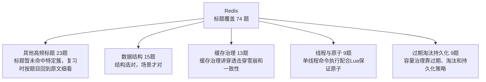

| 知识簇 | 覆盖题数 | 图中速记 | 代表标题 |
|---|---:|---|---|
| 其他高频标题 | 23 | 标题暂未命中特定簇，复习时按题目回到原文细看 | [MySQL pgsql Elasticsearch mongodb HBase Redis 各适合什么场景](06_Redis/0077_MySQL_pgsql_Elasticsearch_mongodb_HBase_Redis_各适合什么场景.md) / [Redis能完全保证数据不丢失吗](06_Redis/0229_Redis能完全保证数据不丢失吗.md) / [Redis 8.0有哪些新特性](06_Redis/0334_Redis_8.0有哪些新特性.md) / [为什么Redis 6.0引入了多线程](06_Redis/0526_为什么Redis_6.0引入了多线程.md) / [什么是GEO 有什么用](06_Redis/0556_什么是GEO_有什么用.md) / [Redis为什么要自己定义SDS](06_Redis/0582_Redis为什么要自己定义SDS.md) |
| 数据结构 | 15 | 结构选对，场景才对 | [布隆过滤器有什么缺点 如何解决](06_Redis/0176_布隆过滤器有什么缺点_如何解决.md) / [布隆过滤器无法删除的问题如何解决](06_Redis/0177_布隆过滤器无法删除的问题如何解决.md) / [什么是布谷鸟过滤器 实现原理是什么](06_Redis/0178_什么是布谷鸟过滤器_实现原理是什么.md) / [Redis中的hash和Java中的HashMap有啥区别](06_Redis/0237_Redis中的hash和Java中的HashMap有啥区别.md) / [Redis的ZipList SkipList和ListPack之间有什么区别](06_Redis/0255_Redis的ZipList_SkipList和ListPack之间有什么区别.md) / [介绍下Redis中的ZipList和他的级联更新问题](06_Redis/0278_介绍下Redis中的ZipList和他的级联更新问题.md) |
| 缓存治理 | 13 | 缓存治理讲穿透击穿雪崩和一致性 | [如何实现多级缓存的一致性](06_Redis/0144_如何实现多级缓存的一致性.md) / [为什么需要延迟双删 两次删除的原因是什么](06_Redis/0218_为什么需要延迟双删_两次删除的原因是什么.md) / [如何解决Redis和数据库的一致性问题](06_Redis/0219_如何解决Redis和数据库的一致性问题.md) / [什么是操作系统的多级缓存](06_Redis/0493_什么是操作系统的多级缓存.md) / [如何保证本地缓存的一致性](06_Redis/0622_如何保证本地缓存的一致性.md) / [如何实现多级缓存](06_Redis/0636_如何实现多级缓存.md) |
| 线程与原子 | 9 | 单线程命令执行配合Lua保证原子 | [Redis的事务和Lua之间有哪些区别](06_Redis/0030_Redis的事务和Lua之间有哪些区别.md) / [Redis为什么被设计成是单线程的](06_Redis/0055_Redis为什么被设计成是单线程的.md) / [为什么Lua脚本可以保证原子性](06_Redis/0063_为什么Lua脚本可以保证原子性.md) / [为什么Redis设计成单线程也能这么快](06_Redis/0527_为什么Redis设计成单线程也能这么快.md) / [Redis 的事务机制是怎样的](06_Redis/0853_Redis_的事务机制是怎样的.md) / [Redis的事务和MySQL的事务区别](06_Redis/1324_Redis的事务和MySQL的事务区别.md) |
| 过期淘汰持久化 | 9 | 容量治理靠过期、淘汰和持久化策略 | [Redis 的过期策略是怎么样的](06_Redis/0126_Redis_的过期策略是怎么样的.md) / [Redis的持久化机制是怎样的](06_Redis/0230_Redis的持久化机制是怎样的.md) / [Redis中key过期了一定会立即删除吗](06_Redis/0241_Redis中key过期了一定会立即删除吗.md) / [了解Redis的内存碎片吗](06_Redis/0272_了解Redis的内存碎片吗.md) / [Redis的内存淘汰策略是怎么样的](06_Redis/0842_Redis的内存淘汰策略是怎么样的.md) / [Redis的虚拟内存机制是什么](06_Redis/0874_Redis的虚拟内存机制是什么.md) |
| 业务应用 | 3 | Redis常用来做锁、限流、排行榜和缓存 | [Redis实现分布锁的时候 哪些问题需要考虑](06_Redis/0139_Redis实现分布锁的时候_哪些问题需要考虑.md) / [Redis如何实现延迟消息](06_Redis/0760_Redis如何实现延迟消息.md) / [如何基于Redis实现滑动窗口限流](06_Redis/1350_如何基于Redis实现滑动窗口限流.md) |
| 高可用集群 | 2 | 可靠性看复制、故障转移和分片 | [介绍一下Redis的集群模式](06_Redis/0203_介绍一下Redis的集群模式.md) / [介绍下Redis集群的脑裂问题](06_Redis/1352_介绍下Redis集群的脑裂问题.md) |

<details>
<summary>其他高频标题 全量题目 23 题</summary>

- [MySQL pgsql Elasticsearch mongodb HBase Redis 各适合什么场景](06_Redis/0077_MySQL_pgsql_Elasticsearch_mongodb_HBase_Redis_各适合什么场景.md)
- [Redis能完全保证数据不丢失吗](06_Redis/0229_Redis能完全保证数据不丢失吗.md)
- [Redis 8.0有哪些新特性](06_Redis/0334_Redis_8.0有哪些新特性.md)
- [为什么Redis 6.0引入了多线程](06_Redis/0526_为什么Redis_6.0引入了多线程.md)
- [什么是GEO 有什么用](06_Redis/0556_什么是GEO_有什么用.md)
- [Redis为什么要自己定义SDS](06_Redis/0582_Redis为什么要自己定义SDS.md)
- [Redis 支持哪几种数据类型](06_Redis/0583_Redis_支持哪几种数据类型.md)
- [Redis 与 Memcached 有什么区别](06_Redis/0598_Redis_与_Memcached_有什么区别.md)
- [Redis为什么这么快](06_Redis/0599_Redis为什么这么快.md)
- [Redis 使用什么协议进行通信](06_Redis/0610_Redis_使用什么协议进行通信.md)
- [Redis是AP的还是CP的](06_Redis/0640_Redis是AP的还是CP的.md)
- [Redis保存库存的时候 如何避免被Redis清理掉](06_Redis/0710_Redis保存库存的时候_如何避免被Redis清理掉.md)
- [对于 Redis 的操作 有哪些推荐的 Best Practices](06_Redis/0729_对于_Redis_的操作_有哪些推荐的_Best_Practices.md)
- [InnoDB为什么不用跳表 Redis为什么不用B+树](06_Redis/0743_InnoDB为什么不用跳表_Redis为什么不用B+树.md)
- [Redis如何实现发布 订阅](06_Redis/0759_Redis如何实现发布_订阅.md)
- [Redis MySQL和MongoDB的区别是什么 各自适用场景呢](06_Redis/0769_Redis_MySQL和MongoDB的区别是什么_各自适用场景呢.md)
- [什么是热Key问题 如何解决热key问题](06_Redis/0827_什么是热Key问题_如何解决热key问题.md)
- [什么是大Key问题 如何解决](06_Redis/0828_什么是大Key问题_如何解决.md)
- [Redis 如果挂了 你怎么办](06_Redis/1073_Redis_如果挂了_你怎么办.md)
- [Redis如何高效安全的遍历所有key](06_Redis/1340_Redis如何高效安全的遍历所有key.md)
- [如何用Redis实现乐观锁](06_Redis/1344_如何用Redis实现乐观锁.md)
- [为什么Redis不支持回滚](06_Redis/1345_为什么Redis不支持回滚.md)
- [Redis的Key和Value的设计原则有哪些](06_Redis/1349_Redis的Key和Value的设计原则有哪些.md)

</details>

<details>
<summary>数据结构 全量题目 15 题</summary>

- [布隆过滤器有什么缺点 如何解决](06_Redis/0176_布隆过滤器有什么缺点_如何解决.md)
- [布隆过滤器无法删除的问题如何解决](06_Redis/0177_布隆过滤器无法删除的问题如何解决.md)
- [什么是布谷鸟过滤器 实现原理是什么](06_Redis/0178_什么是布谷鸟过滤器_实现原理是什么.md)
- [Redis中的hash和Java中的HashMap有啥区别](06_Redis/0237_Redis中的hash和Java中的HashMap有啥区别.md)
- [Redis的ZipList SkipList和ListPack之间有什么区别](06_Redis/0255_Redis的ZipList_SkipList和ListPack之间有什么区别.md)
- [介绍下Redis中的ZipList和他的级联更新问题](06_Redis/0278_介绍下Redis中的ZipList和他的级联更新问题.md)
- [Redis中的Zset是怎么实现的](06_Redis/0286_Redis中的Zset是怎么实现的.md)
- [Redis中的ListPack是如何解决级联更新问题的](06_Redis/0287_Redis中的ListPack是如何解决级联更新问题的.md)
- [ZSet为什么在数据量少的时候用ZipList 而在数据量大的时候转成SkipList](06_Redis/0288_ZSet为什么在数据量少的时候用ZipList_而在数据量大的时候转成SkipList.md)
- [5亿条数据放到布隆过滤器中 大概需要多大内存如何估算](06_Redis/0352_5亿条数据放到布隆过滤器中_大概需要多大内存如何估算.md)
- [Redis 5.0中的 Stream是什么](06_Redis/0888_Redis_5.0中的_Stream是什么.md)
- [什么是布隆过滤器 实现原理是什么](06_Redis/1282_什么是布隆过滤器_实现原理是什么.md)
- [Redis中hash结构比string的好处有哪些](06_Redis/1323_Redis中hash结构比string的好处有哪些.md)
- [什么是Redis的渐进式rehash](06_Redis/1354_什么是Redis的渐进式rehash.md)
- [为什么ZSet 既能支持高效的范围查询 还能以 O(1) 复杂度获取元素权重值](06_Redis/1355_为什么ZSet_既能支持高效的范围查询_还能以_O(1)_复杂度获取元素权重值.md)

</details>

<details>
<summary>缓存治理 全量题目 13 题</summary>

- [如何实现多级缓存的一致性](06_Redis/0144_如何实现多级缓存的一致性.md)
- [为什么需要延迟双删 两次删除的原因是什么](06_Redis/0218_为什么需要延迟双删_两次删除的原因是什么.md)
- [如何解决Redis和数据库的一致性问题](06_Redis/0219_如何解决Redis和数据库的一致性问题.md)
- [什么是操作系统的多级缓存](06_Redis/0493_什么是操作系统的多级缓存.md)
- [如何保证本地缓存的一致性](06_Redis/0622_如何保证本地缓存的一致性.md)
- [如何实现多级缓存](06_Redis/0636_如何实现多级缓存.md)
- [如何实现本地缓存](06_Redis/0651_如何实现本地缓存.md)
- [什么是MESI缓存一致性协议](06_Redis/0732_什么是MESI缓存一致性协议.md)
- [除了做缓存 Redis还能用来干什么](06_Redis/0744_除了做缓存_Redis还能用来干什么.md)
- [说一说多级缓存是如何应用的](06_Redis/0773_说一说多级缓存是如何应用的.md)
- [什么是缓存击穿 缓存穿透 缓存雪崩](06_Redis/0816_什么是缓存击穿_缓存穿透_缓存雪崩.md)
- [MySQL 里有 2000W 数据 Redis 中只存 20W 的数据 如何保证 Redis 中的数据都是热点数据](06_Redis/1033_MySQL_里有_2000W_数据_Redis_中只存_20W_的数据_如何保证_Redis_中的数据都是热点数据.md)
- [本地缓存和分布式缓存有什么区别](06_Redis/1263_本地缓存和分布式缓存有什么区别.md)

</details>

<details>
<summary>线程与原子 全量题目 9 题</summary>

- [Redis的事务和Lua之间有哪些区别](06_Redis/0030_Redis的事务和Lua之间有哪些区别.md)
- [Redis为什么被设计成是单线程的](06_Redis/0055_Redis为什么被设计成是单线程的.md)
- [为什么Lua脚本可以保证原子性](06_Redis/0063_为什么Lua脚本可以保证原子性.md)
- [为什么Redis设计成单线程也能这么快](06_Redis/0527_为什么Redis设计成单线程也能这么快.md)
- [Redis 的事务机制是怎样的](06_Redis/0853_Redis_的事务机制是怎样的.md)
- [Redis的事务和MySQL的事务区别](06_Redis/1324_Redis的事务和MySQL的事务区别.md)
- [如何在 Redis Cluster 中执行 lua 脚本](06_Redis/1338_如何在_Redis_Cluster_中执行_lua_脚本.md)
- [Redis Cluster 中使用事务和 lua 有什么限制](06_Redis/1341_Redis_Cluster_中使用事务和_lua_有什么限制.md)
- [什么是Redis的Pipeline 和事务有什么区别](06_Redis/1348_什么是Redis的Pipeline_和事务有什么区别.md)

</details>

<details>
<summary>过期淘汰持久化 全量题目 9 题</summary>

- [Redis 的过期策略是怎么样的](06_Redis/0126_Redis_的过期策略是怎么样的.md)
- [Redis的持久化机制是怎样的](06_Redis/0230_Redis的持久化机制是怎样的.md)
- [Redis中key过期了一定会立即删除吗](06_Redis/0241_Redis中key过期了一定会立即删除吗.md)
- [了解Redis的内存碎片吗](06_Redis/0272_了解Redis的内存碎片吗.md)
- [Redis的内存淘汰策略是怎么样的](06_Redis/0842_Redis的内存淘汰策略是怎么样的.md)
- [Redis的虚拟内存机制是什么](06_Redis/0874_Redis的虚拟内存机制是什么.md)
- [Redis 的内存如果用满了 会挂吗](06_Redis/1060_Redis_的内存如果用满了_会挂吗.md)
- [RDB和AOF的写回策略分别是什么](06_Redis/1325_RDB和AOF的写回策略分别是什么.md)
- [Redis中有一批key瞬间过期 为什么其它key的读写效率会降低](06_Redis/1351_Redis中有一批key瞬间过期_为什么其它key的读写效率会降低.md)

</details>

<details>
<summary>业务应用 全量题目 3 题</summary>

- [Redis实现分布锁的时候 哪些问题需要考虑](06_Redis/0139_Redis实现分布锁的时候_哪些问题需要考虑.md)
- [Redis如何实现延迟消息](06_Redis/0760_Redis如何实现延迟消息.md)
- [如何基于Redis实现滑动窗口限流](06_Redis/1350_如何基于Redis实现滑动窗口限流.md)

</details>

<details>
<summary>高可用集群 全量题目 2 题</summary>

- [介绍一下Redis的集群模式](06_Redis/0203_介绍一下Redis的集群模式.md)
- [介绍下Redis集群的脑裂问题](06_Redis/1352_介绍下Redis集群的脑裂问题.md)

</details>

## 07_消息队列

入口：[07_消息队列/README.md](07_消息队列/README.md)

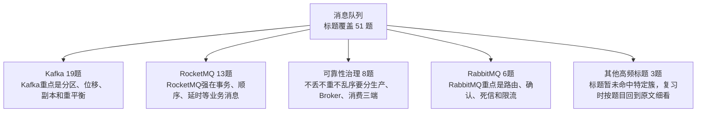

| 知识簇 | 覆盖题数 | 图中速记 | 代表标题 |
|---|---:|---|---|
| Kafka | 19 | Kafka重点是分区、位移、副本和重平衡 | [Kafka如果丢消息了 可能的原因是什么](07_消息队列/0092_Kafka如果丢消息了_可能的原因是什么.md) / [介绍下Kafka的数据存储结构](07_消息队列/0195_介绍下Kafka的数据存储结构.md) / [Kafka 中的Offset是什么](07_消息队列/0236_Kafka_中的Offset是什么.md) / [Kafka的消费者数量和分区数量可以不同吗会发生什么](07_消息队列/0246_Kafka的消费者数量和分区数量可以不同吗会发生什么.md) / [Kafka为什么依赖Zookeeper 有什么用](07_消息队列/0247_Kafka为什么依赖Zookeeper_有什么用.md) / [Kafka的架构是怎么样的](07_消息队列/0258_Kafka的架构是怎么样的.md) |
| RocketMQ | 13 | RocketMQ强在事务、顺序、延时等业务消息 | [RocketMQ消息堆积了怎么解决](07_消息队列/0045_RocketMQ消息堆积了怎么解决.md) / [RocketMQ如果丢消息了 可能的原因是什么](07_消息队列/0093_RocketMQ如果丢消息了_可能的原因是什么.md) / [普通消息 顺序消息的区别 在什么场景会用到](07_消息队列/0140_普通消息_顺序消息的区别_在什么场景会用到.md) / [RocketMQ如果重复消费了 可能是什么原因导致的](07_消息队列/0303_RocketMQ如果重复消费了_可能是什么原因导致的.md) / [介绍下 RocketMQ 5.0中的 pop 模式](07_消息队列/1220_介绍下_RocketMQ_5.0中的_pop_模式.md) / [用了RocketMQ一定能实现削峰的效果吗](07_消息队列/1231_用了RocketMQ一定能实现削峰的效果吗.md) |
| 可靠性治理 | 8 | 不丢不重不乱序要分生产、Broker、消费三端 | [RocketMQ如何保证消息不丢失](07_消息队列/0315_RocketMQ如何保证消息不丢失.md) / [如何解决消息重复消费 重复下单等问题](07_消息队列/0318_如何解决消息重复消费_重复下单等问题.md) / [Kafka的批量消费如何确保消息不丢](07_消息队列/0322_Kafka的批量消费如何确保消息不丢.md) / [MQ出现消息乱序了如何解决](07_消息队列/0824_MQ出现消息乱序了如何解决.md) / [RabbitMQ如何保证消息不丢](07_消息队列/1115_RabbitMQ如何保证消息不丢.md) / [为什么Kafka没办法100%保证消息不丢失](07_消息队列/1307_为什么Kafka没办法100%保证消息不丢失.md) |
| RabbitMQ | 6 | RabbitMQ重点是路由、确认、死信和限流 | [RabbitMQ如何实现消费端限流](07_消息队列/0295_RabbitMQ如何实现消费端限流.md) / [介绍下RabbitMQ的事务机制](07_消息队列/1100_介绍下RabbitMQ的事务机制.md) / [RabbitMQ如何防止重复消费](07_消息队列/1126_RabbitMQ如何防止重复消费.md) / [RabbitMQ 是如何保证高可用的](07_消息队列/1138_RabbitMQ_是如何保证高可用的.md) / [什么是RabbitMQ的死信队列](07_消息队列/1151_什么是RabbitMQ的死信队列.md) / [RabbitMQ是怎么做消息分发的](07_消息队列/1177_RabbitMQ是怎么做消息分发的.md) |
| 其他高频标题 | 3 | 标题暂未命中特定簇，复习时按题目回到原文细看 | [消息队列在使用的时候可能会遇到哪些坑](07_消息队列/0064_消息队列在使用的时候可能会遇到哪些坑.md) / [为什么不直接用原生的BlockinQueue做消息队列](07_消息队列/1128_为什么不直接用原生的BlockinQueue做消息队列.md) / [为什么要使用消息队列](07_消息队列/1321_为什么要使用消息队列.md) |
| 堆积吞吐 | 2 | 堆积看生产速率、消费能力和扩容策略 | [Kafka如何实现批量消费](07_消息队列/0321_Kafka如何实现批量消费.md) / [消息队列使用拉模式好还是推模式好为什么](07_消息队列/0873_消息队列使用拉模式好还是推模式好为什么.md) |

<details>
<summary>Kafka 全量题目 19 题</summary>

- [Kafka如果丢消息了 可能的原因是什么](07_消息队列/0092_Kafka如果丢消息了_可能的原因是什么.md)
- [介绍下Kafka的数据存储结构](07_消息队列/0195_介绍下Kafka的数据存储结构.md)
- [Kafka 中的Offset是什么](07_消息队列/0236_Kafka_中的Offset是什么.md)
- [Kafka的消费者数量和分区数量可以不同吗会发生什么](07_消息队列/0246_Kafka的消费者数量和分区数量可以不同吗会发生什么.md)
- [Kafka为什么依赖Zookeeper 有什么用](07_消息队列/0247_Kafka为什么依赖Zookeeper_有什么用.md)
- [Kafka的架构是怎么样的](07_消息队列/0258_Kafka的架构是怎么样的.md)
- [RocketMQ和Kafka一样有重平衡的问题吗](07_消息队列/0281_RocketMQ和Kafka一样有重平衡的问题吗.md)
- [Kafka 单分区单消费者实例 如何提高吞吐量](07_消息队列/0852_Kafka_单分区单消费者实例_如何提高吞吐量.md)
- [什么是Kafka的渐进式重平衡](07_消息队列/1300_什么是Kafka的渐进式重平衡.md)
- [MQ的重平衡会带来哪些问题](07_消息队列/1301_MQ的重平衡会带来哪些问题.md)
- [介绍一下Kafka的ISR机制](07_消息队列/1303_介绍一下Kafka的ISR机制.md)
- [Kafka 为什么有 Topic 还要用 Partition](07_消息队列/1304_Kafka_为什么有_Topic_还要用_Partition.md)
- [Kafka 高水位了解过吗为什么 Kafka 需要 Leader Epoch](07_消息队列/1305_Kafka_高水位了解过吗为什么_Kafka_需要_Leader_Epoch.md)
- [Kafka 消息的发送过程简单介绍一下](07_消息队列/1306_Kafka_消息的发送过程简单介绍一下.md)
- [Kafka 几种选举过程简单介绍一下](07_消息队列/1308_Kafka_几种选举过程简单介绍一下.md)
- [Kafka如何实现顺序消费](07_消息队列/1309_Kafka如何实现顺序消费.md)
- [什么是Kafka的重平衡机制](07_消息队列/1310_什么是Kafka的重平衡机制.md)
- [Kafka 为什么这么快](07_消息队列/1313_Kafka_为什么这么快.md)
- [Kafka ActiveMQ RabbitMQ和RocketMQ都有哪些区别](07_消息队列/1316_Kafka_ActiveMQ_RabbitMQ和RocketMQ都有哪些区别.md)

</details>

<details>
<summary>RocketMQ 全量题目 13 题</summary>

- [RocketMQ消息堆积了怎么解决](07_消息队列/0045_RocketMQ消息堆积了怎么解决.md)
- [RocketMQ如果丢消息了 可能的原因是什么](07_消息队列/0093_RocketMQ如果丢消息了_可能的原因是什么.md)
- [普通消息 顺序消息的区别 在什么场景会用到](07_消息队列/0140_普通消息_顺序消息的区别_在什么场景会用到.md)
- [RocketMQ如果重复消费了 可能是什么原因导致的](07_消息队列/0303_RocketMQ如果重复消费了_可能是什么原因导致的.md)
- [介绍下 RocketMQ 5.0中的 pop 模式](07_消息队列/1220_介绍下_RocketMQ_5.0中的_pop_模式.md)
- [用了RocketMQ一定能实现削峰的效果吗](07_消息队列/1231_用了RocketMQ一定能实现削峰的效果吗.md)
- [RocketMQ的消息是推还是拉](07_消息队列/1246_RocketMQ的消息是推还是拉.md)
- [RocketMQ怎么实现消息分发的](07_消息队列/1247_RocketMQ怎么实现消息分发的.md)
- [介绍一下RocketMQ的工作流程](07_消息队列/1294_介绍一下RocketMQ的工作流程.md)
- [RocketMQ有几种集群方式](07_消息队列/1295_RocketMQ有几种集群方式.md)
- [RocketMQ如何保证消息的顺序性](07_消息队列/1296_RocketMQ如何保证消息的顺序性.md)
- [RocketMQ如何实现延时消息](07_消息队列/1297_RocketMQ如何实现延时消息.md)
- [RocketMQ的架构是怎么样的](07_消息队列/1299_RocketMQ的架构是怎么样的.md)

</details>

<details>
<summary>可靠性治理 全量题目 8 题</summary>

- [RocketMQ如何保证消息不丢失](07_消息队列/0315_RocketMQ如何保证消息不丢失.md)
- [如何解决消息重复消费 重复下单等问题](07_消息队列/0318_如何解决消息重复消费_重复下单等问题.md)
- [Kafka的批量消费如何确保消息不丢](07_消息队列/0322_Kafka的批量消费如何确保消息不丢.md)
- [MQ出现消息乱序了如何解决](07_消息队列/0824_MQ出现消息乱序了如何解决.md)
- [RabbitMQ如何保证消息不丢](07_消息队列/1115_RabbitMQ如何保证消息不丢.md)
- [为什么Kafka没办法100%保证消息不丢失](07_消息队列/1307_为什么Kafka没办法100%保证消息不丢失.md)
- [Kafka怎么保证消费只消费一次的](07_消息队列/1311_Kafka怎么保证消费只消费一次的.md)
- [Kafka如何保证消息不丢失](07_消息队列/1312_Kafka如何保证消息不丢失.md)

</details>

<details>
<summary>RabbitMQ 全量题目 6 题</summary>

- [RabbitMQ如何实现消费端限流](07_消息队列/0295_RabbitMQ如何实现消费端限流.md)
- [介绍下RabbitMQ的事务机制](07_消息队列/1100_介绍下RabbitMQ的事务机制.md)
- [RabbitMQ如何防止重复消费](07_消息队列/1126_RabbitMQ如何防止重复消费.md)
- [RabbitMQ 是如何保证高可用的](07_消息队列/1138_RabbitMQ_是如何保证高可用的.md)
- [什么是RabbitMQ的死信队列](07_消息队列/1151_什么是RabbitMQ的死信队列.md)
- [RabbitMQ是怎么做消息分发的](07_消息队列/1177_RabbitMQ是怎么做消息分发的.md)

</details>

<details>
<summary>其他高频标题 全量题目 3 题</summary>

- [消息队列在使用的时候可能会遇到哪些坑](07_消息队列/0064_消息队列在使用的时候可能会遇到哪些坑.md)
- [为什么不直接用原生的BlockinQueue做消息队列](07_消息队列/1128_为什么不直接用原生的BlockinQueue做消息队列.md)
- [为什么要使用消息队列](07_消息队列/1321_为什么要使用消息队列.md)

</details>

<details>
<summary>堆积吞吐 全量题目 2 题</summary>

- [Kafka如何实现批量消费](07_消息队列/0321_Kafka如何实现批量消费.md)
- [消息队列使用拉模式好还是推模式好为什么](07_消息队列/0873_消息队列使用拉模式好还是推模式好为什么.md)

</details>

## 08_微服务与分布式

入口：[08_微服务与分布式/README.md](08_微服务与分布式/README.md)

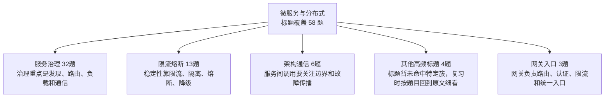

| 知识簇 | 覆盖题数 | 图中速记 | 代表标题 |
|---|---:|---|---|
| 服务治理 | 32 | 治理重点是发现、路由、负载和通信 | [微服务架构中 如何防止服务雪崩](08_微服务与分布式/0004_微服务架构中_如何防止服务雪崩.md) / [Dubbo服务发现与路由的概念有什么不同](08_微服务与分布式/0061_Dubbo服务发现与路由的概念有什么不同.md) / [OpenFeign 不支持了怎么办](08_微服务与分布式/0097_OpenFeign_不支持了怎么办.md) / [Feign 第一次调用为什么很慢可能的原因是什么](08_微服务与分布式/0114_Feign_第一次调用为什么很慢可能的原因是什么.md) / [Feign和OpenFeign 有什么区别](08_微服务与分布式/0260_Feign和OpenFeign_有什么区别.md) / [Ribbon和Nginx的区别是什么](08_微服务与分布式/0306_Ribbon和Nginx的区别是什么.md) |
| 限流熔断 | 13 | 稳定性靠限流、隔离、熔断、降级 | [单机限流和集群限流的区别是什么](08_微服务与分布式/0171_单机限流和集群限流的区别是什么.md) / [漏桶和令牌桶有啥区别](08_微服务与分布式/0266_漏桶和令牌桶有啥区别.md) / [synchronized 的锁能降级吗](08_微服务与分布式/0720_synchronized_的锁能降级吗.md) / [限流 降级 熔断有什么区别](08_微服务与分布式/0916_限流_降级_熔断有什么区别.md) / [为什么一定要做限流不应该服务好客户吗不应该是加机器吗](08_微服务与分布式/1101_为什么一定要做限流不应该服务好客户吗不应该是加机器吗.md) / [Feign调用超时 会自动重试吗如何设置](08_微服务与分布式/1158_Feign调用超时_会自动重试吗如何设置.md) |
| 架构通信 | 6 | 服务间调用要关注边界和故障传播 | [各个微服务之间 有哪些调用 通信 方式](08_微服务与分布式/0068_各个微服务之间_有哪些调用_通信_方式.md) / [RPC接口返回中 使用基本类型还是包装类](08_微服务与分布式/0952_RPC接口返回中_使用基本类型还是包装类.md) / [为什么RPC要比HTTP更快一些](08_微服务与分布式/1327_为什么RPC要比HTTP更快一些.md) / [什么是泛化调用](08_微服务与分布式/1328_什么是泛化调用.md) / [什么场景只能用HTTP 不能用RPC](08_微服务与分布式/1329_什么场景只能用HTTP_不能用RPC.md) / [什么是RPC 和HTTP有什么区别](08_微服务与分布式/1335_什么是RPC_和HTTP有什么区别.md) |
| 其他高频标题 | 4 | 标题暂未命中特定簇，复习时按题目回到原文细看 | [听说过ServiceMesh吗是什么](08_微服务与分布式/0943_听说过ServiceMesh吗是什么.md) / [Hystrix和Sentinel的区别是什么](08_微服务与分布式/1111_Hystrix和Sentinel的区别是什么.md) / [如何实现应用中的链路追踪](08_微服务与分布式/1169_如何实现应用中的链路追踪.md) / [介绍一下 Hystrix 的隔离策略 你用哪个](08_微服务与分布式/1214_介绍一下_Hystrix_的隔离策略_你用哪个.md) |
| 网关入口 | 3 | 网关负责路由、认证、限流和统一入口 | [Zuul Gateway和Nginx有什么区别](08_微服务与分布式/0307_Zuul_Gateway和Nginx有什么区别.md) / [什么是Zuul网关 有什么用](08_微服务与分布式/0308_什么是Zuul网关_有什么用.md) / [LoadBalancer支持哪些负载均衡策略如何修改](08_微服务与分布式/1200_LoadBalancer支持哪些负载均衡策略如何修改.md) |

<details>
<summary>服务治理 全量题目 32 题</summary>

- [微服务架构中 如何防止服务雪崩](08_微服务与分布式/0004_微服务架构中_如何防止服务雪崩.md)
- [Dubbo服务发现与路由的概念有什么不同](08_微服务与分布式/0061_Dubbo服务发现与路由的概念有什么不同.md)
- [OpenFeign 不支持了怎么办](08_微服务与分布式/0097_OpenFeign_不支持了怎么办.md)
- [Feign 第一次调用为什么很慢可能的原因是什么](08_微服务与分布式/0114_Feign_第一次调用为什么很慢可能的原因是什么.md)
- [Feign和OpenFeign 有什么区别](08_微服务与分布式/0260_Feign和OpenFeign_有什么区别.md)
- [Ribbon和Nginx的区别是什么](08_微服务与分布式/0306_Ribbon和Nginx的区别是什么.md)
- [微服务中的CI CD了解吗](08_微服务与分布式/0955_微服务中的CI_CD了解吗.md)
- [微服务架构的服务治理有哪些实现方案](08_微服务与分布式/0966_微服务架构的服务治理有哪些实现方案.md)
- [如何进行微服务的拆分](08_微服务与分布式/0979_如何进行微服务的拆分.md)
- [SOA和微服务之间的主要区别是什么](08_微服务与分布式/0991_SOA和微服务之间的主要区别是什么.md)
- [什么是微服务架构优势特点](08_微服务与分布式/1007_什么是微服务架构优势特点.md)
- [分布式和微服务的区别是什么](08_微服务与分布式/1023_分布式和微服务的区别是什么.md)
- [Dubbo和Feign有什么区别](08_微服务与分布式/1069_Dubbo和Feign有什么区别.md)
- [注册中心如何选型](08_微服务与分布式/1088_注册中心如何选型.md)
- [LoadBalancer和Ribbon的区别是什么为什么用他替代Ribbon](08_微服务与分布式/1096_LoadBalancer和Ribbon的区别是什么为什么用他替代Ribbon.md)
- [Ribbon是怎么做负载均衡的](08_微服务与分布式/1123_Ribbon是怎么做负载均衡的.md)
- [OpenFeign如何处理超时如何处理异常如何记录客户端日志](08_微服务与分布式/1159_OpenFeign如何处理超时如何处理异常如何记录客户端日志.md)
- [OpenFeign 是如何实现负载均衡的](08_微服务与分布式/1172_OpenFeign_是如何实现负载均衡的.md)
- [Feign 和 RestTemplate 有什么不同](08_微服务与分布式/1186_Feign_和_RestTemplate_有什么不同.md)
- [微服务的拆分有哪些原则](08_微服务与分布式/1244_微服务的拆分有哪些原则.md)
- [Dubbo 支持哪些服务治理](08_微服务与分布式/1314_Dubbo_支持哪些服务治理.md)
- [Dubbo的SPI和JDK的SPI有什么区别](08_微服务与分布式/1315_Dubbo的SPI和JDK的SPI有什么区别.md)
- [Dubbo支持哪些负载均衡策略](08_微服务与分布式/1317_Dubbo支持哪些负载均衡策略.md)
- [有用过Dubbo的异步调用吗](08_微服务与分布式/1318_有用过Dubbo的异步调用吗.md)
- [为什么Dubbo不用JDK的SPI](08_微服务与分布式/1319_为什么Dubbo不用JDK的SPI.md)
- [Dubbo的服务调用的过程是什么样的](08_微服务与分布式/1320_Dubbo的服务调用的过程是什么样的.md)
- [Dubbo支持哪些序列化方式](08_微服务与分布式/1322_Dubbo支持哪些序列化方式.md)
- [什么是Dubbo的优雅停机 怎么实现的](08_微服务与分布式/1330_什么是Dubbo的优雅停机_怎么实现的.md)
- [Dubbo如何实现像本地方法一样调用远程方法的](08_微服务与分布式/1331_Dubbo如何实现像本地方法一样调用远程方法的.md)
- [Dubbo的缓存机制了解吗](08_微服务与分布式/1332_Dubbo的缓存机制了解吗.md)
- [Dubbo的整体架构是怎么样的](08_微服务与分布式/1333_Dubbo的整体架构是怎么样的.md)
- [Dubbo支持哪些调用协议](08_微服务与分布式/1334_Dubbo支持哪些调用协议.md)

</details>

<details>
<summary>限流熔断 全量题目 13 题</summary>

- [单机限流和集群限流的区别是什么](08_微服务与分布式/0171_单机限流和集群限流的区别是什么.md)
- [漏桶和令牌桶有啥区别](08_微服务与分布式/0266_漏桶和令牌桶有啥区别.md)
- [synchronized 的锁能降级吗](08_微服务与分布式/0720_synchronized_的锁能降级吗.md)
- [限流 降级 熔断有什么区别](08_微服务与分布式/0916_限流_降级_熔断有什么区别.md)
- [为什么一定要做限流不应该服务好客户吗不应该是加机器吗](08_微服务与分布式/1101_为什么一定要做限流不应该服务好客户吗不应该是加机器吗.md)
- [Feign调用超时 会自动重试吗如何设置](08_微服务与分布式/1158_Feign调用超时_会自动重试吗如何设置.md)
- [Hystrix熔断器的工作原理是什么](08_微服务与分布式/1227_Hystrix熔断器的工作原理是什么.md)
- [一次RPC请求 客户端显示超时 但是服务端不超时 可能是什么原因](08_微服务与分布式/1235_一次RPC请求_客户端显示超时_但是服务端不超时_可能是什么原因.md)
- [什么是滑动窗口限流](08_微服务与分布式/1265_什么是滑动窗口限流.md)
- [什么是自适应限流](08_微服务与分布式/1266_什么是自适应限流.md)
- [什么是限流常见的限流算法有哪些](08_微服务与分布式/1267_什么是限流常见的限流算法有哪些.md)
- [什么是熔断](08_微服务与分布式/1268_什么是熔断.md)
- [什么是服务降级](08_微服务与分布式/1269_什么是服务降级.md)

</details>

<details>
<summary>架构通信 全量题目 6 题</summary>

- [各个微服务之间 有哪些调用 通信 方式](08_微服务与分布式/0068_各个微服务之间_有哪些调用_通信_方式.md)
- [RPC接口返回中 使用基本类型还是包装类](08_微服务与分布式/0952_RPC接口返回中_使用基本类型还是包装类.md)
- [为什么RPC要比HTTP更快一些](08_微服务与分布式/1327_为什么RPC要比HTTP更快一些.md)
- [什么是泛化调用](08_微服务与分布式/1328_什么是泛化调用.md)
- [什么场景只能用HTTP 不能用RPC](08_微服务与分布式/1329_什么场景只能用HTTP_不能用RPC.md)
- [什么是RPC 和HTTP有什么区别](08_微服务与分布式/1335_什么是RPC_和HTTP有什么区别.md)

</details>

<details>
<summary>其他高频标题 全量题目 4 题</summary>

- [听说过ServiceMesh吗是什么](08_微服务与分布式/0943_听说过ServiceMesh吗是什么.md)
- [Hystrix和Sentinel的区别是什么](08_微服务与分布式/1111_Hystrix和Sentinel的区别是什么.md)
- [如何实现应用中的链路追踪](08_微服务与分布式/1169_如何实现应用中的链路追踪.md)
- [介绍一下 Hystrix 的隔离策略 你用哪个](08_微服务与分布式/1214_介绍一下_Hystrix_的隔离策略_你用哪个.md)

</details>

<details>
<summary>网关入口 全量题目 3 题</summary>

- [Zuul Gateway和Nginx有什么区别](08_微服务与分布式/0307_Zuul_Gateway和Nginx有什么区别.md)
- [什么是Zuul网关 有什么用](08_微服务与分布式/0308_什么是Zuul网关_有什么用.md)
- [LoadBalancer支持哪些负载均衡策略如何修改](08_微服务与分布式/1200_LoadBalancer支持哪些负载均衡策略如何修改.md)

</details>

## 09_分布式事务

入口：[09_分布式事务/README.md](09_分布式事务/README.md)

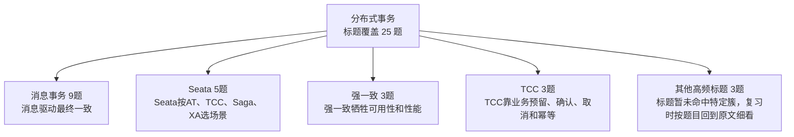

| 知识簇 | 覆盖题数 | 图中速记 | 代表标题 |
|---|---:|---|---|
| 消息事务 | 9 | 消息驱动最终一致 | [如何基于本地消息表实现分布式事务](09_分布式事务/0239_如何基于本地消息表实现分布式事务.md) / [用了本地消息表的方案 如果下游执行失败了上游如何回滚](09_分布式事务/0240_用了本地消息表的方案_如果下游执行失败了上游如何回滚.md) / [基于本地消息表实现分布式事务保证最终一致性](09_分布式事务/0256_基于本地消息表实现分布式事务保证最终一致性.md) / [什么是事务消息 为什么需要事务消息](09_分布式事务/0673_什么是事务消息_为什么需要事务消息.md) / [最大努力通知&事务消息&本地消息表三者区别是什么](09_分布式事务/0891_最大努力通知&事务消息&本地消息表三者区别是什么.md) / [如何基于MQ实现分布式事务](09_分布式事务/0930_如何基于MQ实现分布式事务.md) |
| Seata | 5 | Seata按AT、TCC、Saga、XA选场景 | [Seata的AT模式的实现原理](09_分布式事务/0067_Seata的AT模式的实现原理.md) / [Seata的4种事务模式 各自适合的场景是什么](09_分布式事务/0133_Seata的4种事务模式_各自适合的场景是什么.md) / [Seata的AT模式会不会出现脏读为什么](09_分布式事务/0656_Seata的AT模式会不会出现脏读为什么.md) / [Seata的AT模式和XA有什么区别](09_分布式事务/1061_Seata的AT模式和XA有什么区别.md) / [Seata的实现原理是什么](09_分布式事务/1194_Seata的实现原理是什么.md) |
| 强一致 | 3 | 强一致牺牲可用性和性能 | [什么是TCC 和2PC有什么区别](09_分布式事务/0130_什么是TCC_和2PC有什么区别.md) / [什么是分布式事务中的三阶段提交 3PC](09_分布式事务/0153_什么是分布式事务中的三阶段提交_3PC.md) / [什么是分布式事务中的两阶段提交 2PC](09_分布式事务/0154_什么是分布式事务中的两阶段提交_2PC.md) |
| TCC | 3 | TCC靠业务预留、确认、取消和幂等 | [TCC是强一致性还是最终一致性](09_分布式事务/0132_TCC是强一致性还是最终一致性.md) / [TCC的空回滚和悬挂是什么如何解决](09_分布式事务/0225_TCC的空回滚和悬挂是什么如何解决.md) / [TCC中 Confirm或者Cancel失败了怎么办](09_分布式事务/1118_TCC中_Confirm或者Cancel失败了怎么办.md) |
| 其他高频标题 | 3 | 标题暂未命中特定簇，复习时按题目回到原文细看 | [常见的分布式事务有哪些](09_分布式事务/0131_常见的分布式事务有哪些.md) / [什么是事务的2阶段提交](09_分布式事务/0273_什么是事务的2阶段提交.md) / [什么是分布式事务](09_分布式事务/0964_什么是分布式事务.md) |
| 补偿一致性 | 2 | 最终一致要有重试、补偿、对账 | [什么是最大努力通知](09_分布式事务/0904_什么是最大努力通知.md) / [什么是柔性事务](09_分布式事务/0931_什么是柔性事务.md) |

<details>
<summary>消息事务 全量题目 9 题</summary>

- [如何基于本地消息表实现分布式事务](09_分布式事务/0239_如何基于本地消息表实现分布式事务.md)
- [用了本地消息表的方案 如果下游执行失败了上游如何回滚](09_分布式事务/0240_用了本地消息表的方案_如果下游执行失败了上游如何回滚.md)
- [基于本地消息表实现分布式事务保证最终一致性](09_分布式事务/0256_基于本地消息表实现分布式事务保证最终一致性.md)
- [什么是事务消息 为什么需要事务消息](09_分布式事务/0673_什么是事务消息_为什么需要事务消息.md)
- [最大努力通知&事务消息&本地消息表三者区别是什么](09_分布式事务/0891_最大努力通知&事务消息&本地消息表三者区别是什么.md)
- [如何基于MQ实现分布式事务](09_分布式事务/0930_如何基于MQ实现分布式事务.md)
- [RocketMQ的事务消息和Kafka的事务消息有什么区别](09_分布式事务/1205_RocketMQ的事务消息和Kafka的事务消息有什么区别.md)
- [RocketMQ的事务消息是如何实现的](09_分布式事务/1298_RocketMQ的事务消息是如何实现的.md)
- [Kafka支持事务消息吗如何实现的](09_分布式事务/1302_Kafka支持事务消息吗如何实现的.md)

</details>

<details>
<summary>Seata 全量题目 5 题</summary>

- [Seata的AT模式的实现原理](09_分布式事务/0067_Seata的AT模式的实现原理.md)
- [Seata的4种事务模式 各自适合的场景是什么](09_分布式事务/0133_Seata的4种事务模式_各自适合的场景是什么.md)
- [Seata的AT模式会不会出现脏读为什么](09_分布式事务/0656_Seata的AT模式会不会出现脏读为什么.md)
- [Seata的AT模式和XA有什么区别](09_分布式事务/1061_Seata的AT模式和XA有什么区别.md)
- [Seata的实现原理是什么](09_分布式事务/1194_Seata的实现原理是什么.md)

</details>

<details>
<summary>强一致 全量题目 3 题</summary>

- [什么是TCC 和2PC有什么区别](09_分布式事务/0130_什么是TCC_和2PC有什么区别.md)
- [什么是分布式事务中的三阶段提交 3PC](09_分布式事务/0153_什么是分布式事务中的三阶段提交_3PC.md)
- [什么是分布式事务中的两阶段提交 2PC](09_分布式事务/0154_什么是分布式事务中的两阶段提交_2PC.md)

</details>

<details>
<summary>TCC 全量题目 3 题</summary>

- [TCC是强一致性还是最终一致性](09_分布式事务/0132_TCC是强一致性还是最终一致性.md)
- [TCC的空回滚和悬挂是什么如何解决](09_分布式事务/0225_TCC的空回滚和悬挂是什么如何解决.md)
- [TCC中 Confirm或者Cancel失败了怎么办](09_分布式事务/1118_TCC中_Confirm或者Cancel失败了怎么办.md)

</details>

<details>
<summary>其他高频标题 全量题目 3 题</summary>

- [常见的分布式事务有哪些](09_分布式事务/0131_常见的分布式事务有哪些.md)
- [什么是事务的2阶段提交](09_分布式事务/0273_什么是事务的2阶段提交.md)
- [什么是分布式事务](09_分布式事务/0964_什么是分布式事务.md)

</details>

<details>
<summary>补偿一致性 全量题目 2 题</summary>

- [什么是最大努力通知](09_分布式事务/0904_什么是最大努力通知.md)
- [什么是柔性事务](09_分布式事务/0931_什么是柔性事务.md)

</details>

## 10_分布式锁与ID

入口：[10_分布式锁与ID/README.md](10_分布式锁与ID/README.md)

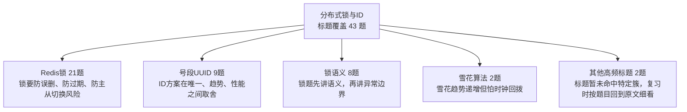

| 知识簇 | 覆盖题数 | 图中速记 | 代表标题 |
|---|---:|---|---|
| Redis锁 | 21 | 锁要防误删、防过期、防主从切换风险 | [Redisson里面的锁是怎么来防止误删的](10_分布式锁与ID/0043_Redisson里面的锁是怎么来防止误删的.md) / [Redisson里面的锁是如何实现可重入的](10_分布式锁与ID/0138_Redisson里面的锁是如何实现可重入的.md) / [Redisson的watchdog机制是怎么样的](10_分布式锁与ID/0276_Redisson的watchdog机制是怎么样的.md) / [Redis中的setnx和setex有啥区别](10_分布式锁与ID/0317_Redis中的setnx和setex有啥区别.md) / [A线程获取Redis分布式锁 但那一刻做了主从的切换 B线程能获取到锁吗](10_分布式锁与ID/0336_A线程获取Redis分布式锁_但那一刻做了主从的切换_B线程能获取到锁吗.md) / [Redis 的分布式锁和 Zookeeper 的分布式锁有啥区别](10_分布式锁与ID/0697_Redis_的分布式锁和_Zookeeper_的分布式锁有啥区别.md) |
| 号段UUID | 9 | ID方案在唯一、趋势、性能之间取舍 | [MySQL的主键一定是自增的吗](10_分布式锁与ID/0047_MySQL的主键一定是自增的吗.md) / [什么是UUID 能保证唯一吗](10_分布式锁与ID/0091_什么是UUID_能保证唯一吗.md) / [什么情况会导致自增主键不连续](10_分布式锁与ID/0293_什么情况会导致自增主键不连续.md) / [为啥要全局分布式ID 每张表自增不行吗](10_分布式锁与ID/0634_为啥要全局分布式ID_每张表自增不行吗.md) / [详细介绍下号段模式生成分布式ID的原理和优缺点](10_分布式锁与ID/0672_详细介绍下号段模式生成分布式ID的原理和优缺点.md) / [分布式ID生成方案都有哪些](10_分布式锁与ID/0890_分布式ID生成方案都有哪些.md) |
| 锁语义 | 8 | 锁题先讲语义，再讲异常边界 | [引入分布式锁解决并发问题](10_分布式锁与ID/0683_引入分布式锁解决并发问题.md) / [分布式锁有几种实现方式](10_分布式锁与ID/0978_分布式锁有几种实现方式.md) / [用了一锁二查三更新 为啥还出现了重复数据](10_分布式锁与ID/1019_用了一锁二查三更新_为啥还出现了重复数据.md) / [锁和分布式锁的核心区别是什么](10_分布式锁与ID/1119_锁和分布式锁的核心区别是什么.md) / [实现一个分布式锁需要考虑哪些问题](10_分布式锁与ID/1155_实现一个分布式锁需要考虑哪些问题.md) / [加分布式锁之后影响并发了怎么办](10_分布式锁与ID/1168_加分布式锁之后影响并发了怎么办.md) |
| 雪花算法 | 2 | 雪花趋势递增但怕时钟回拨 | [什么是雪花算法的时钟回拨问题 如何解决](10_分布式锁与ID/0079_什么是雪花算法的时钟回拨问题_如何解决.md) / [什么是雪花算法 怎么保证不重复的](10_分布式锁与ID/0179_什么是雪花算法_怎么保证不重复的.md) |
| 其他高频标题 | 2 | 标题暂未命中特定簇，复习时按题目回到原文细看 | [分布式命名方案都有哪些](10_分布式锁与ID/1236_分布式命名方案都有哪些.md) / [什么是RedLock 他解决了什么问题](10_分布式锁与ID/1356_什么是RedLock_他解决了什么问题.md) |
| 数据库约束 | 1 | 数据库也能做互斥和唯一约束 | [数据库乐观锁和悲观锁以及redis分布式锁的区别和使用场景](10_分布式锁与ID/1154_数据库乐观锁和悲观锁以及redis分布式锁的区别和使用场景.md) |

<details>
<summary>Redis锁 全量题目 21 题</summary>

- [Redisson里面的锁是怎么来防止误删的](10_分布式锁与ID/0043_Redisson里面的锁是怎么来防止误删的.md)
- [Redisson里面的锁是如何实现可重入的](10_分布式锁与ID/0138_Redisson里面的锁是如何实现可重入的.md)
- [Redisson的watchdog机制是怎么样的](10_分布式锁与ID/0276_Redisson的watchdog机制是怎么样的.md)
- [Redis中的setnx和setex有啥区别](10_分布式锁与ID/0317_Redis中的setnx和setex有啥区别.md)
- [A线程获取Redis分布式锁 但那一刻做了主从的切换 B线程能获取到锁吗](10_分布式锁与ID/0336_A线程获取Redis分布式锁_但那一刻做了主从的切换_B线程能获取到锁吗.md)
- [Redis 的分布式锁和 Zookeeper 的分布式锁有啥区别](10_分布式锁与ID/0697_Redis_的分布式锁和_Zookeeper_的分布式锁有啥区别.md)
- [Redis 分布式锁和zk分布式锁哪个对死锁友好](10_分布式锁与ID/0698_Redis_分布式锁和zk分布式锁哪个对死锁友好.md)
- [如何用Redisson实现分布式锁](10_分布式锁与ID/0713_如何用Redisson实现分布式锁.md)
- [如何用SETNX实现分布式锁](10_分布式锁与ID/0728_如何用SETNX实现分布式锁.md)
- [Redis实现分布式锁 加锁的时候 redis不可用了咋整](10_分布式锁与ID/0756_Redis实现分布式锁_加锁的时候_redis不可用了咋整.md)
- [Redis中的setnx命令为什么是原子性的](10_分布式锁与ID/0889_Redis中的setnx命令为什么是原子性的.md)
- [基于Redis的分布式锁 解决短信验证码重复发放等问题](10_分布式锁与ID/1232_基于Redis的分布式锁_解决短信验证码重复发放等问题.md)
- [Redisson如何保证解锁的线程一定是加锁的线程](10_分布式锁与ID/1326_Redisson如何保证解锁的线程一定是加锁的线程.md)
- [Redisson 中为什么要废弃 RedLock 该用啥](10_分布式锁与ID/1336_Redisson_中为什么要废弃_RedLock_该用啥.md)
- [Redisson 的 watchdog 什么情况下可能会失效](10_分布式锁与ID/1337_Redisson_的_watchdog_什么情况下可能会失效.md)
- [Redisson解锁失败 watchdog会不会一直续期下去](10_分布式锁与ID/1339_Redisson解锁失败_watchdog会不会一直续期下去.md)
- [如何用setnx实现一个可重入锁](10_分布式锁与ID/1342_如何用setnx实现一个可重入锁.md)
- [watchdog一直续期 那客户端挂了怎么办](10_分布式锁与ID/1343_watchdog一直续期_那客户端挂了怎么办.md)
- [Redisson的lock和tryLock有什么区别](10_分布式锁与ID/1346_Redisson的lock和tryLock有什么区别.md)
- [Redisson和Jedis有啥区别如何选择](10_分布式锁与ID/1347_Redisson和Jedis有啥区别如何选择.md)
- [如何基于Redisson实现一个延迟队列](10_分布式锁与ID/1353_如何基于Redisson实现一个延迟队列.md)

</details>

<details>
<summary>号段UUID 全量题目 9 题</summary>

- [MySQL的主键一定是自增的吗](10_分布式锁与ID/0047_MySQL的主键一定是自增的吗.md)
- [什么是UUID 能保证唯一吗](10_分布式锁与ID/0091_什么是UUID_能保证唯一吗.md)
- [什么情况会导致自增主键不连续](10_分布式锁与ID/0293_什么情况会导致自增主键不连续.md)
- [为啥要全局分布式ID 每张表自增不行吗](10_分布式锁与ID/0634_为啥要全局分布式ID_每张表自增不行吗.md)
- [详细介绍下号段模式生成分布式ID的原理和优缺点](10_分布式锁与ID/0672_详细介绍下号段模式生成分布式ID的原理和优缺点.md)
- [分布式ID生成方案都有哪些](10_分布式锁与ID/0890_分布式ID生成方案都有哪些.md)
- [MySQL自增主键用完了会怎么样](10_分布式锁与ID/1105_MySQL自增主键用完了会怎么样.md)
- [高并发情况下自增主键会不会重复 为什么](10_分布式锁与ID/1197_高并发情况下自增主键会不会重复_为什么.md)
- [Leaf生成分布式ID的原理](10_分布式锁与ID/1208_Leaf生成分布式ID的原理.md)

</details>

<details>
<summary>锁语义 全量题目 8 题</summary>

- [引入分布式锁解决并发问题](10_分布式锁与ID/0683_引入分布式锁解决并发问题.md)
- [分布式锁有几种实现方式](10_分布式锁与ID/0978_分布式锁有几种实现方式.md)
- [用了一锁二查三更新 为啥还出现了重复数据](10_分布式锁与ID/1019_用了一锁二查三更新_为啥还出现了重复数据.md)
- [锁和分布式锁的核心区别是什么](10_分布式锁与ID/1119_锁和分布式锁的核心区别是什么.md)
- [实现一个分布式锁需要考虑哪些问题](10_分布式锁与ID/1155_实现一个分布式锁需要考虑哪些问题.md)
- [加分布式锁之后影响并发了怎么办](10_分布式锁与ID/1168_加分布式锁之后影响并发了怎么办.md)
- [使用分布式锁时 分布式锁加在事务外面还是里面 有什么区别](10_分布式锁与ID/1180_使用分布式锁时_分布式锁加在事务外面还是里面_有什么区别.md)
- [如何用Zookeeper实现分布式锁](10_分布式锁与ID/1292_如何用Zookeeper实现分布式锁.md)

</details>

<details>
<summary>雪花算法 全量题目 2 题</summary>

- [什么是雪花算法的时钟回拨问题 如何解决](10_分布式锁与ID/0079_什么是雪花算法的时钟回拨问题_如何解决.md)
- [什么是雪花算法 怎么保证不重复的](10_分布式锁与ID/0179_什么是雪花算法_怎么保证不重复的.md)

</details>

<details>
<summary>其他高频标题 全量题目 2 题</summary>

- [分布式命名方案都有哪些](10_分布式锁与ID/1236_分布式命名方案都有哪些.md)
- [什么是RedLock 他解决了什么问题](10_分布式锁与ID/1356_什么是RedLock_他解决了什么问题.md)

</details>

<details>
<summary>数据库约束 全量题目 1 题</summary>

- [数据库乐观锁和悲观锁以及redis分布式锁的区别和使用场景](10_分布式锁与ID/1154_数据库乐观锁和悲观锁以及redis分布式锁的区别和使用场景.md)

</details>

## 11_分库分表

入口：[11_分库分表/README.md](11_分库分表/README.md)

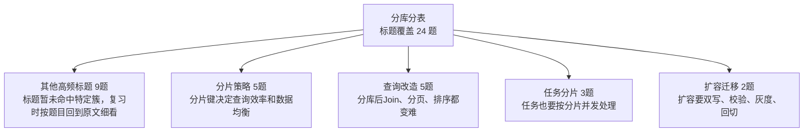

| 知识簇 | 覆盖题数 | 图中速记 | 代表标题 |
|---|---:|---|---|
| 其他高频标题 | 9 | 标题暂未命中特定簇，复习时按题目回到原文细看 | [分库分表后会带来哪些问题](11_分库分表/0552_分库分表后会带来哪些问题.md) / [分表算法都有哪些](11_分库分表/0565_分表算法都有哪些.md) / [分表后全局ID如何生成](11_分库分表/0566_分表后全局ID如何生成.md) / [分区和分表有什么区别](11_分库分表/0595_分区和分表有什么区别.md) / [什么是分库分表分库分表](11_分库分表/0607_什么是分库分表分库分表.md) / [分库分表中 如何预估需要分多少个库多少张表](11_分库分表/0650_分库分表中_如何预估需要分多少个库多少张表.md) |
| 分片策略 | 5 | 分片键决定查询效率和数据均衡 | [分表字段如何选择](11_分库分表/0095_分表字段如何选择.md) / [什么是Redis的数据分片](11_分库分表/0253_什么是Redis的数据分片.md) / [ShardingJDBC有哪些分片策略 你用的哪个](11_分库分表/0481_ShardingJDBC有哪些分片策略_你用的哪个.md) / [分库分表的数量为什么一般选择2的幂](11_分库分表/0496_分库分表的数量为什么一般选择2的幂.md) / [分库分表的取模算法策略如何避免数据倾斜](11_分库分表/0511_分库分表的取模算法策略如何避免数据倾斜.md) |
| 查询改造 | 5 | 分库后Join、分页、排序都变难 | [如果需要跨库join 该如何实现](11_分库分表/0058_如果需要跨库join_该如何实现.md) / [分库分表之后的怎么进行join操作](11_分库分表/0510_分库分表之后的怎么进行join操作.md) / [分库分表后如何进行分页查询](11_分库分表/0551_分库分表后如何进行分页查询.md) / [在分库分表时 如果遇到了对商品名称的模糊查询 要怎么处理](11_分库分表/0635_在分库分表时_如果遇到了对商品名称的模糊查询_要怎么处理.md) / [ShardingJDBC 在查询的时候如果没有分表键 他怎么样](11_分库分表/0665_ShardingJDBC_在查询的时候如果没有分表键_他怎么样.md) |
| 任务分片 | 3 | 任务也要按分片并发处理 | [知道MapReduce动态分片任务吗好处是什么原理是什么](11_分库分表/0329_知道MapReduce动态分片任务吗好处是什么原理是什么.md) / [基于XXL-JOB的分片实现分库分表后的扫表](11_分库分表/0342_基于XXL-JOB的分片实现分库分表后的扫表.md) / [xxl-job 支持分片任务吗实现原理是什么](11_分库分表/0549_xxl-job_支持分片任务吗实现原理是什么.md) |
| 扩容迁移 | 2 | 扩容要双写、校验、灰度、回切 | [分库分表后 表还不够怎么办](11_分库分表/0536_分库分表后_表还不够怎么办.md) / [分库分表后怎么设计可以降低数据迁移的难度](11_分库分表/0664_分库分表后怎么设计可以降低数据迁移的难度.md) |

<details>
<summary>其他高频标题 全量题目 9 题</summary>

- [分库分表后会带来哪些问题](11_分库分表/0552_分库分表后会带来哪些问题.md)
- [分表算法都有哪些](11_分库分表/0565_分表算法都有哪些.md)
- [分表后全局ID如何生成](11_分库分表/0566_分表后全局ID如何生成.md)
- [分区和分表有什么区别](11_分库分表/0595_分区和分表有什么区别.md)
- [什么是分库分表分库分表](11_分库分表/0607_什么是分库分表分库分表.md)
- [分库分表中 如何预估需要分多少个库多少张表](11_分库分表/0650_分库分表中_如何预估需要分多少个库多少张表.md)
- [从B+树的角度分析为什么单表2000万要考虑分表](11_分库分表/0758_从B+树的角度分析为什么单表2000万要考虑分表.md)
- [分库分表时 每个城市的人口不一样 有的密集 有的稀疏 如何实现均匀分布](11_分库分表/0825_分库分表时_每个城市的人口不一样_有的密集_有的稀疏_如何实现均匀分布.md)
- [如果单表数据量大 只能考虑分库分表吗](11_分库分表/0976_如果单表数据量大_只能考虑分库分表吗.md)

</details>

<details>
<summary>分片策略 全量题目 5 题</summary>

- [分表字段如何选择](11_分库分表/0095_分表字段如何选择.md)
- [什么是Redis的数据分片](11_分库分表/0253_什么是Redis的数据分片.md)
- [ShardingJDBC有哪些分片策略 你用的哪个](11_分库分表/0481_ShardingJDBC有哪些分片策略_你用的哪个.md)
- [分库分表的数量为什么一般选择2的幂](11_分库分表/0496_分库分表的数量为什么一般选择2的幂.md)
- [分库分表的取模算法策略如何避免数据倾斜](11_分库分表/0511_分库分表的取模算法策略如何避免数据倾斜.md)

</details>

<details>
<summary>查询改造 全量题目 5 题</summary>

- [如果需要跨库join 该如何实现](11_分库分表/0058_如果需要跨库join_该如何实现.md)
- [分库分表之后的怎么进行join操作](11_分库分表/0510_分库分表之后的怎么进行join操作.md)
- [分库分表后如何进行分页查询](11_分库分表/0551_分库分表后如何进行分页查询.md)
- [在分库分表时 如果遇到了对商品名称的模糊查询 要怎么处理](11_分库分表/0635_在分库分表时_如果遇到了对商品名称的模糊查询_要怎么处理.md)
- [ShardingJDBC 在查询的时候如果没有分表键 他怎么样](11_分库分表/0665_ShardingJDBC_在查询的时候如果没有分表键_他怎么样.md)

</details>

<details>
<summary>任务分片 全量题目 3 题</summary>

- [知道MapReduce动态分片任务吗好处是什么原理是什么](11_分库分表/0329_知道MapReduce动态分片任务吗好处是什么原理是什么.md)
- [基于XXL-JOB的分片实现分库分表后的扫表](11_分库分表/0342_基于XXL-JOB的分片实现分库分表后的扫表.md)
- [xxl-job 支持分片任务吗实现原理是什么](11_分库分表/0549_xxl-job_支持分片任务吗实现原理是什么.md)

</details>

<details>
<summary>扩容迁移 全量题目 2 题</summary>

- [分库分表后 表还不够怎么办](11_分库分表/0536_分库分表后_表还不够怎么办.md)
- [分库分表后怎么设计可以降低数据迁移的难度](11_分库分表/0664_分库分表后怎么设计可以降低数据迁移的难度.md)

</details>

## 12_其他中间件

入口：[12_其他中间件/README.md](12_其他中间件/README.md)

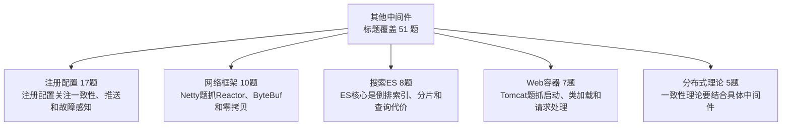

| 知识簇 | 覆盖题数 | 图中速记 | 代表标题 |
|---|---:|---|---|
| 注册配置 | 17 | 注册配置关注一致性、推送和故障感知 | [配置中心的作用是什么如何选型](12_其他中间件/0069_配置中心的作用是什么如何选型.md) / [Zookeeper如何保证数据的一致性](12_其他中间件/0324_Zookeeper如何保证数据的一致性.md) / [介绍一下Eureka的缓存机制](12_其他中间件/1040_介绍一下Eureka的缓存机制.md) / [Eureka和Zookeeper有什么区别](12_其他中间件/1054_Eureka和Zookeeper有什么区别.md) / [Zookeeper的数据结构是怎么样的](12_其他中间件/1219_Zookeeper的数据结构是怎么样的.md) / [Zookeeper的典型应用场景有哪些](12_其他中间件/1230_Zookeeper的典型应用场景有哪些.md) |
| 网络框架 | 10 | Netty题抓Reactor、ByteBuf和零拷贝 | [Netty 中用了哪些设计模式](12_其他中间件/1024_Netty_中用了哪些设计模式.md) / [Netty有哪些序列化协议](12_其他中间件/1037_Netty有哪些序列化协议.md) / [说说 Netty 的对象池技术](12_其他中间件/1048_说说_Netty_的对象池技术.md) / [Netty的Buffer为什么好用](12_其他中间件/1049_Netty的Buffer为什么好用.md) / [Netty如何解决TCP粘包 拆包的问题的](12_其他中间件/1062_Netty如何解决TCP粘包_拆包的问题的.md) / [能不能说一说Netty的无锁化设计](12_其他中间件/1074_能不能说一说Netty的无锁化设计.md) |
| 搜索ES | 8 | ES核心是倒排索引、分片和查询代价 | [Elasticsearch集群中的角色有哪些](12_其他中间件/0065_Elasticsearch集群中的角色有哪些.md) / [介绍下ES的Hot-Warm-Cold架构](12_其他中间件/0084_介绍下ES的Hot-Warm-Cold架构.md) / [什么是ElasticSearch的深度分页问题如何解决](12_其他中间件/0116_什么是ElasticSearch的深度分页问题如何解决.md) / [ES 支持乐观锁吗如何实现的](12_其他中间件/1245_ES_支持乐观锁吗如何实现的.md) / [Elasticsearch支持事务吗为什么](12_其他中间件/1249_Elasticsearch支持事务吗为什么.md) / [ES 不支持 decimal 如何避免丢失精度](12_其他中间件/1250_ES_不支持_decimal_如何避免丢失精度.md) |
| Web容器 | 7 | Tomcat题抓启动、类加载和请求处理 | [为什么Tomcat可以把线程数设置为200 而不是N+1](12_其他中间件/0103_为什么Tomcat可以把线程数设置为200_而不是N+1.md) / [Tomcat的类加载机制是怎么样的](12_其他中间件/1120_Tomcat的类加载机制是怎么样的.md) / [Tomcat与Web服务器 如Apache 之间的关系是什么](12_其他中间件/1129_Tomcat与Web服务器_如Apache_之间的关系是什么.md) / [介绍一下Tomcat的IO模型](12_其他中间件/1143_介绍一下Tomcat的IO模型.md) / [Tomcat处理请求的过程是怎么样的](12_其他中间件/1156_Tomcat处理请求的过程是怎么样的.md) / [Tomcat中有哪些类加载器](12_其他中间件/1170_Tomcat中有哪些类加载器.md) |
| 分布式理论 | 5 | 一致性理论要结合具体中间件 | [Zookeeper是CP的还是AP的](12_其他中间件/0301_Zookeeper是CP的还是AP的.md) / [什么是拜占庭将军问题](12_其他中间件/0990_什么是拜占庭将军问题.md) / [Nacos能同时实现AP和CP的原理是什么](12_其他中间件/1259_Nacos能同时实现AP和CP的原理是什么.md) / [Nacos是AP的还是CP的](12_其他中间件/1261_Nacos是AP的还是CP的.md) / [什么是脑裂如何解决](12_其他中间件/1290_什么是脑裂如何解决.md) |
| ORM框架 | 4 | MyBatis题抓映射、动态SQL、插件和缓存 | [#和$的区别是什么什么情况必须用$](12_其他中间件/0956_#和$的区别是什么什么情况必须用$.md) / [MyBatis与Hibernate有何不同](12_其他中间件/0980_MyBatis与Hibernate有何不同.md) / [MyBatis-Plus有什么用](12_其他中间件/1196_MyBatis-Plus有什么用.md) / [PageHelper分页的原理是什么](12_其他中间件/1209_PageHelper分页的原理是什么.md) |

<details>
<summary>注册配置 全量题目 17 题</summary>

- [配置中心的作用是什么如何选型](12_其他中间件/0069_配置中心的作用是什么如何选型.md)
- [Zookeeper如何保证数据的一致性](12_其他中间件/0324_Zookeeper如何保证数据的一致性.md)
- [介绍一下Eureka的缓存机制](12_其他中间件/1040_介绍一下Eureka的缓存机制.md)
- [Eureka和Zookeeper有什么区别](12_其他中间件/1054_Eureka和Zookeeper有什么区别.md)
- [Zookeeper的数据结构是怎么样的](12_其他中间件/1219_Zookeeper的数据结构是怎么样的.md)
- [Zookeeper的典型应用场景有哪些](12_其他中间件/1230_Zookeeper的典型应用场景有哪些.md)
- [什么是Eureka的自我保护模式](12_其他中间件/1242_什么是Eureka的自我保护模式.md)
- [Nacos的服务注册和服务发现的过程是怎么样的](12_其他中间件/1257_Nacos的服务注册和服务发现的过程是怎么样的.md)
- [Nacos 2.x为什么新增了RPC的通信方式](12_其他中间件/1258_Nacos_2.x为什么新增了RPC的通信方式.md)
- [Nacos如何实现的配置变化客户端可以感知到](12_其他中间件/1260_Nacos如何实现的配置变化客户端可以感知到.md)
- [什么是Nacos 主要用来作什么](12_其他中间件/1262_什么是Nacos_主要用来作什么.md)
- [Zookeeper是如何保证创建的节点是唯一的](12_其他中间件/1286_Zookeeper是如何保证创建的节点是唯一的.md)
- [Zookeeper的缺点有哪些](12_其他中间件/1287_Zookeeper的缺点有哪些.md)
- [怎样使用Zookeeper实现服务发现](12_其他中间件/1288_怎样使用Zookeeper实现服务发现.md)
- [Zookeeper的watch机制是如何工作的](12_其他中间件/1289_Zookeeper的watch机制是如何工作的.md)
- [Zookeeper是选举机制是怎样的](12_其他中间件/1291_Zookeeper是选举机制是怎样的.md)
- [Zookeeper集群中的角色有哪些有什么区别](12_其他中间件/1293_Zookeeper集群中的角色有哪些有什么区别.md)

</details>

<details>
<summary>网络框架 全量题目 10 题</summary>

- [Netty 中用了哪些设计模式](12_其他中间件/1024_Netty_中用了哪些设计模式.md)
- [Netty有哪些序列化协议](12_其他中间件/1037_Netty有哪些序列化协议.md)
- [说说 Netty 的对象池技术](12_其他中间件/1048_说说_Netty_的对象池技术.md)
- [Netty的Buffer为什么好用](12_其他中间件/1049_Netty的Buffer为什么好用.md)
- [Netty如何解决TCP粘包 拆包的问题的](12_其他中间件/1062_Netty如何解决TCP粘包_拆包的问题的.md)
- [能不能说一说Netty的无锁化设计](12_其他中间件/1074_能不能说一说Netty的无锁化设计.md)
- [Netty的线程模型是怎么样的](12_其他中间件/1075_Netty的线程模型是怎么样的.md)
- [Netty的零拷贝是怎么实现的](12_其他中间件/1091_Netty的零拷贝是怎么实现的.md)
- [Netty性能好的原因是什么](12_其他中间件/1102_Netty性能好的原因是什么.md)
- [为什么Netty适合做网络编程](12_其他中间件/1103_为什么Netty适合做网络编程.md)

</details>

<details>
<summary>搜索ES 全量题目 8 题</summary>

- [Elasticsearch集群中的角色有哪些](12_其他中间件/0065_Elasticsearch集群中的角色有哪些.md)
- [介绍下ES的Hot-Warm-Cold架构](12_其他中间件/0084_介绍下ES的Hot-Warm-Cold架构.md)
- [什么是ElasticSearch的深度分页问题如何解决](12_其他中间件/0116_什么是ElasticSearch的深度分页问题如何解决.md)
- [ES 支持乐观锁吗如何实现的](12_其他中间件/1245_ES_支持乐观锁吗如何实现的.md)
- [Elasticsearch支持事务吗为什么](12_其他中间件/1249_Elasticsearch支持事务吗为什么.md)
- [ES 不支持 decimal 如何避免丢失精度](12_其他中间件/1250_ES_不支持_decimal_如何避免丢失精度.md)
- [如何优化 ElasticSearch 搜索性能](12_其他中间件/1252_如何优化_ElasticSearch_搜索性能.md)
- [ElasticSearch为什么快](12_其他中间件/1255_ElasticSearch为什么快.md)

</details>

<details>
<summary>Web容器 全量题目 7 题</summary>

- [为什么Tomcat可以把线程数设置为200 而不是N+1](12_其他中间件/0103_为什么Tomcat可以把线程数设置为200_而不是N+1.md)
- [Tomcat的类加载机制是怎么样的](12_其他中间件/1120_Tomcat的类加载机制是怎么样的.md)
- [Tomcat与Web服务器 如Apache 之间的关系是什么](12_其他中间件/1129_Tomcat与Web服务器_如Apache_之间的关系是什么.md)
- [介绍一下Tomcat的IO模型](12_其他中间件/1143_介绍一下Tomcat的IO模型.md)
- [Tomcat处理请求的过程是怎么样的](12_其他中间件/1156_Tomcat处理请求的过程是怎么样的.md)
- [Tomcat中有哪些类加载器](12_其他中间件/1170_Tomcat中有哪些类加载器.md)
- [Tomcat的启动流程是怎样的](12_其他中间件/1182_Tomcat的启动流程是怎样的.md)

</details>

<details>
<summary>分布式理论 全量题目 5 题</summary>

- [Zookeeper是CP的还是AP的](12_其他中间件/0301_Zookeeper是CP的还是AP的.md)
- [什么是拜占庭将军问题](12_其他中间件/0990_什么是拜占庭将军问题.md)
- [Nacos能同时实现AP和CP的原理是什么](12_其他中间件/1259_Nacos能同时实现AP和CP的原理是什么.md)
- [Nacos是AP的还是CP的](12_其他中间件/1261_Nacos是AP的还是CP的.md)
- [什么是脑裂如何解决](12_其他中间件/1290_什么是脑裂如何解决.md)

</details>

<details>
<summary>ORM框架 全量题目 4 题</summary>

- [#和$的区别是什么什么情况必须用$](12_其他中间件/0956_#和$的区别是什么什么情况必须用$.md)
- [MyBatis与Hibernate有何不同](12_其他中间件/0980_MyBatis与Hibernate有何不同.md)
- [MyBatis-Plus有什么用](12_其他中间件/1196_MyBatis-Plus有什么用.md)
- [PageHelper分页的原理是什么](12_其他中间件/1209_PageHelper分页的原理是什么.md)

</details>

## 13_网络与操作系统

入口：[13_网络与操作系统/README.md](13_网络与操作系统/README.md)

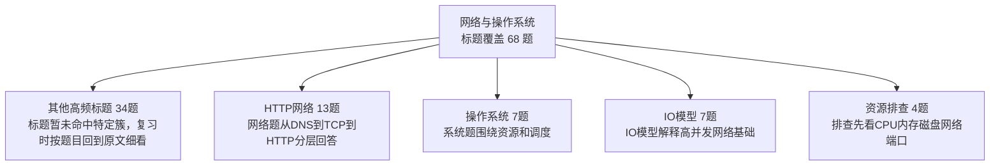

| 知识簇 | 覆盖题数 | 图中速记 | 代表标题 |
|---|---:|---|---|
| 其他高频标题 | 34 | 标题暂未命中特定簇，复习时按题目回到原文细看 | [CAS在操作系统层面是如何保证原子性的](13_网络与操作系统/0394_CAS在操作系统层面是如何保证原子性的.md) / [什么是撞库 拖库和洗库](13_网络与操作系统/0503_什么是撞库_拖库和洗库.md) / [什么是跨域访问问题 如何解决](13_网络与操作系统/0504_什么是跨域访问问题_如何解决.md) / [为什么云原生对应用的启动速度要求很高](13_网络与操作系统/0506_为什么云原生对应用的启动速度要求很高.md) / [什么是SQL注入攻击如何防止](13_网络与操作系统/0518_什么是SQL注入攻击如何防止.md) / [什么是中间人攻击](13_网络与操作系统/0519_什么是中间人攻击.md) |
| HTTP网络 | 13 | 网络题从DNS到TCP到HTTP分层回答 | [HTTPS建立连接的时候是几次握手](13_网络与操作系统/0072_HTTPS建立连接的时候是几次握手.md) / [HTTP不同版本之间的区别](13_网络与操作系统/0221_HTTP不同版本之间的区别.md) / [HTTP 301跳转和302跳转有什么区别](13_网络与操作系统/0289_HTTP_301跳转和302跳转有什么区别.md) / [HTTPS和HTTP的区别是什么](13_网络与操作系统/0572_HTTPS和HTTP的区别是什么.md) / [介绍下什么是长连接和短连接](13_网络与操作系统/0587_介绍下什么是长连接和短连接.md) / [HTTP 2存在什么问题 为什么需要HTTP 3](13_网络与操作系统/0589_HTTP_2存在什么问题_为什么需要HTTP_3.md) |
| 操作系统 | 7 | 系统题围绕资源和调度 | [Java有协程吗](13_网络与操作系统/0048_Java有协程吗.md) / [new Thread().start() 创建一个线程时 操作系统层面发生了什么](13_网络与操作系统/0071_new_Thread().start()_创建一个线程时_操作系统层面发生了什么.md) / [Linux下rm正在写入的文件会发生什么](13_网络与操作系统/0323_Linux下rm正在写入的文件会发生什么.md) / [什么是时间片](13_网络与操作系统/0502_什么是时间片.md) / [进程间通信方式有哪些](13_网络与操作系统/0558_进程间通信方式有哪些.md) / [进程 线程和协程的区别](13_网络与操作系统/0569_进程_线程和协程的区别.md) |
| IO模型 | 7 | IO模型解释高并发网络基础 | [什么是零拷贝](13_网络与操作系统/0152_什么是零拷贝.md) / [同步 异步 阻塞 非阻塞怎么理解](13_网络与操作系统/0353_同步_异步_阻塞_非阻塞怎么理解.md) / [Cookie Session Token的区别是什么](13_网络与操作系统/0588_Cookie_Session_Token的区别是什么.md) / [如何理解select poll epoll](13_网络与操作系统/0612_如何理解select_poll_epoll.md) / [操作系统的IO模型有哪些](13_网络与操作系统/0629_操作系统的IO模型有哪些.md) / [分布式系统 用户登录信息保存在服务器A上 服务器B如何获取到共享Session](13_网络与操作系统/0814_分布式系统_用户登录信息保存在服务器A上_服务器B如何获取到共享Session.md) |
| 资源排查 | 4 | 排查先看CPU内存磁盘网络端口 | [ping为什么不需要端口](13_网络与操作系统/0614_ping为什么不需要端口.md) / [什么是网络分区](13_网络与操作系统/0643_什么是网络分区.md) / [如何做网络抓包](13_网络与操作系统/0644_如何做网络抓包.md) / [进入电梯里断网后又恢复刚开始为什么网络慢](13_网络与操作系统/0727_进入电梯里断网后又恢复刚开始为什么网络慢.md) |
| 架构基础 | 3 | 基础概念要能落业务场景 | [SaaS系统中 多租户如何实现](13_网络与操作系统/0086_SaaS系统中_多租户如何实现.md) / [什么是闰秒](13_网络与操作系统/0440_什么是闰秒.md) / [什么是IaaS PaaS SaaS](13_网络与操作系统/0522_什么是IaaS_PaaS_SaaS.md) |

<details>
<summary>其他高频标题 全量题目 34 题</summary>

- [CAS在操作系统层面是如何保证原子性的](13_网络与操作系统/0394_CAS在操作系统层面是如何保证原子性的.md)
- [什么是撞库 拖库和洗库](13_网络与操作系统/0503_什么是撞库_拖库和洗库.md)
- [什么是跨域访问问题 如何解决](13_网络与操作系统/0504_什么是跨域访问问题_如何解决.md)
- [为什么云原生对应用的启动速度要求很高](13_网络与操作系统/0506_为什么云原生对应用的启动速度要求很高.md)
- [什么是SQL注入攻击如何防止](13_网络与操作系统/0518_什么是SQL注入攻击如何防止.md)
- [什么是中间人攻击](13_网络与操作系统/0519_什么是中间人攻击.md)
- [什么是Serverless](13_网络与操作系统/0521_什么是Serverless.md)
- [加密&解密 加签&验签做的事情一样吗](13_网络与操作系统/0530_加密&解密_加签&验签做的事情一样吗.md)
- [ping的原理是什么](13_网络与操作系统/0531_ping的原理是什么.md)
- [什么是公有云 私有云 混合云](13_网络与操作系统/0532_什么是公有云_私有云_混合云.md)
- [什么是用户态 内核态如何切换的](13_网络与操作系统/0541_什么是用户态_内核态如何切换的.md)
- [什么是水平越权如何防止](13_网络与操作系统/0543_什么是水平越权如何防止.md)
- [MD5是加密算法吗绝对安全吗](13_网络与操作系统/0544_MD5是加密算法吗绝对安全吗.md)
- [什么是云计算](13_网络与操作系统/0546_什么是云计算.md)
- [浏览器输入www.taobao.com回车之后发生了什么](13_网络与操作系统/0560_浏览器输入www.taobao.com回车之后发生了什么.md)
- [对称加密和非对称加密有什么区别](13_网络与操作系统/0561_对称加密和非对称加密有什么区别.md)
- [什么是全双工和半双工](13_网络与操作系统/0568_什么是全双工和半双工.md)
- [什么是CSRF攻击XSS攻击](13_网络与操作系统/0570_什么是CSRF攻击XSS攻击.md)
- [什么是DDoS攻击如何防止被攻击](13_网络与操作系统/0571_什么是DDoS攻击如何防止被攻击.md)
- [什么是分段和分页](13_网络与操作系统/0601_什么是分段和分页.md)
- [什么是“墙”“梯子”的原理是什么](13_网络与操作系统/0602_什么是“墙”“梯子”的原理是什么.md)
- [计算机打开电源操作系统做了什么](13_网络与操作系统/0642_计算机打开电源操作系统做了什么.md)
- [路由器与交换机的区别是什么](13_网络与操作系统/0645_路由器与交换机的区别是什么.md)
- [ARP 与 RARP 的区别是什么](13_网络与操作系统/0646_ARP_与_RARP_的区别是什么.md)
- [什么是国密算法SM2 SM4 SM3有什么区别](13_网络与操作系统/0658_什么是国密算法SM2_SM4_SM3有什么区别.md)
- [什么是垂直越权 如何防止](13_网络与操作系统/0676_什么是垂直越权_如何防止.md)
- [什么是CDN 为什么他可以做缓存](13_网络与操作系统/0677_什么是CDN_为什么他可以做缓存.md)
- [什么是OAuth2有什么用](13_网络与操作系统/0687_什么是OAuth2有什么用.md)
- [什么是Page Cache 他的读写过程是怎么样的有什么优缺点](13_网络与操作系统/0692_什么是Page_Cache_他的读写过程是怎么样的有什么优缺点.md)
- [啥是无状态 为啥说Serverless是无状态的](13_网络与操作系统/0693_啥是无状态_为啥说Serverless是无状态的.md)
- [ConcurrentHashMap为什么在JDK 1.8中废弃分段锁](13_网络与操作系统/0749_ConcurrentHashMap为什么在JDK_1.8中废弃分段锁.md)
- [Docker 的常用命令有哪些](13_网络与操作系统/0833_Docker_的常用命令有哪些.md)
- [Dockerfile 是什么它通常包含哪些指令](13_网络与操作系统/0834_Dockerfile_是什么它通常包含哪些指令.md)
- [常见的字符编码有哪些有什么区别](13_网络与操作系统/0939_常见的字符编码有哪些有什么区别.md)

</details>

<details>
<summary>HTTP网络 全量题目 13 题</summary>

- [HTTPS建立连接的时候是几次握手](13_网络与操作系统/0072_HTTPS建立连接的时候是几次握手.md)
- [HTTP不同版本之间的区别](13_网络与操作系统/0221_HTTP不同版本之间的区别.md)
- [HTTP 301跳转和302跳转有什么区别](13_网络与操作系统/0289_HTTP_301跳转和302跳转有什么区别.md)
- [HTTPS和HTTP的区别是什么](13_网络与操作系统/0572_HTTPS和HTTP的区别是什么.md)
- [介绍下什么是长连接和短连接](13_网络与操作系统/0587_介绍下什么是长连接和短连接.md)
- [HTTP 2存在什么问题 为什么需要HTTP 3](13_网络与操作系统/0589_HTTP_2存在什么问题_为什么需要HTTP_3.md)
- [为什么需要HTTP 2 他解决了什么问题](13_网络与操作系统/0603_为什么需要HTTP_2_他解决了什么问题.md)
- [什么是HTTP 3的QUIC协议](13_网络与操作系统/0615_什么是HTTP_3的QUIC协议.md)
- [TCP是如何保证可靠传输的](13_网络与操作系统/0616_TCP是如何保证可靠传输的.md)
- [什么是TCP重传率 有什么用如何查看](13_网络与操作系统/0630_什么是TCP重传率_有什么用如何查看.md)
- [什么是TCP三次握手 四次挥手](13_网络与操作系统/0631_什么是TCP三次握手_四次挥手.md)
- [TCP和UDP的区别是什么](13_网络与操作系统/0659_TCP和UDP的区别是什么.md)
- [什么是TCP的粘包 拆包问题](13_网络与操作系统/0660_什么是TCP的粘包_拆包问题.md)

</details>

<details>
<summary>操作系统 全量题目 7 题</summary>

- [Java有协程吗](13_网络与操作系统/0048_Java有协程吗.md)
- [new Thread().start() 创建一个线程时 操作系统层面发生了什么](13_网络与操作系统/0071_new_Thread().start()_创建一个线程时_操作系统层面发生了什么.md)
- [Linux下rm正在写入的文件会发生什么](13_网络与操作系统/0323_Linux下rm正在写入的文件会发生什么.md)
- [什么是时间片](13_网络与操作系统/0502_什么是时间片.md)
- [进程间通信方式有哪些](13_网络与操作系统/0558_进程间通信方式有哪些.md)
- [进程 线程和协程的区别](13_网络与操作系统/0569_进程_线程和协程的区别.md)
- [IO多路复用和多线程有什么区别](13_网络与操作系统/0704_IO多路复用和多线程有什么区别.md)

</details>

<details>
<summary>IO模型 全量题目 7 题</summary>

- [什么是零拷贝](13_网络与操作系统/0152_什么是零拷贝.md)
- [同步 异步 阻塞 非阻塞怎么理解](13_网络与操作系统/0353_同步_异步_阻塞_非阻塞怎么理解.md)
- [Cookie Session Token的区别是什么](13_网络与操作系统/0588_Cookie_Session_Token的区别是什么.md)
- [如何理解select poll epoll](13_网络与操作系统/0612_如何理解select_poll_epoll.md)
- [操作系统的IO模型有哪些](13_网络与操作系统/0629_操作系统的IO模型有哪些.md)
- [分布式系统 用户登录信息保存在服务器A上 服务器B如何获取到共享Session](13_网络与操作系统/0814_分布式系统_用户登录信息保存在服务器A上_服务器B如何获取到共享Session.md)
- [怎么实现分布式Session](13_网络与操作系统/0875_怎么实现分布式Session.md)

</details>

<details>
<summary>资源排查 全量题目 4 题</summary>

- [ping为什么不需要端口](13_网络与操作系统/0614_ping为什么不需要端口.md)
- [什么是网络分区](13_网络与操作系统/0643_什么是网络分区.md)
- [如何做网络抓包](13_网络与操作系统/0644_如何做网络抓包.md)
- [进入电梯里断网后又恢复刚开始为什么网络慢](13_网络与操作系统/0727_进入电梯里断网后又恢复刚开始为什么网络慢.md)

</details>

<details>
<summary>架构基础 全量题目 3 题</summary>

- [SaaS系统中 多租户如何实现](13_网络与操作系统/0086_SaaS系统中_多租户如何实现.md)
- [什么是闰秒](13_网络与操作系统/0440_什么是闰秒.md)
- [什么是IaaS PaaS SaaS](13_网络与操作系统/0522_什么是IaaS_PaaS_SaaS.md)

</details>

## 14_系统设计与高并发

入口：[14_系统设计与高并发/README.md](14_系统设计与高并发/README.md)

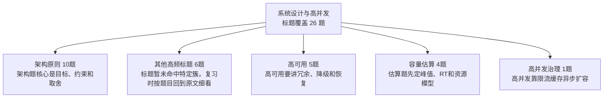

| 知识簇 | 覆盖题数 | 图中速记 | 代表标题 |
|---|---:|---|---|
| 架构原则 | 10 | 架构题核心是目标、约束和取舍 | [为什么说做架构其实就是做权衡](14_系统设计与高并发/0765_为什么说做架构其实就是做权衡.md) / [什么样的架构才算是好的架构](14_系统设计与高并发/0780_什么样的架构才算是好的架构.md) / [架构是设计出来的还是演进出来的](14_系统设计与高并发/0781_架构是设计出来的还是演进出来的.md) / [什么是技术债务你怎么理解它](14_系统设计与高并发/0793_什么是技术债务你怎么理解它.md) / [架构设计中最重要的三个要素是什么](14_系统设计与高并发/0806_架构设计中最重要的三个要素是什么.md) / [常见的架构设计原则有哪些](14_系统设计与高并发/0807_常见的架构设计原则有哪些.md) |
| 其他高频标题 | 6 | 标题暂未命中特定簇，复习时按题目回到原文细看 | [什么是CAP理论 为什么不能同时满足](14_系统设计与高并发/1021_什么是CAP理论_为什么不能同时满足.md) / [什么是一致性哈希](14_系统设计与高并发/1181_什么是一致性哈希.md) / [什么是银弹 什么叫做没有银弹](14_系统设计与高并发/1228_什么是银弹_什么叫做没有银弹.md) / [什么是异地多活](14_系统设计与高并发/1275_什么是异地多活.md) / [什么是SLA](14_系统设计与高并发/1278_什么是SLA.md) / [说下什么是p90 p95 P99](14_系统设计与高并发/1280_说下什么是p90_p95_P99.md) |
| 高可用 | 5 | 高可用要讲冗余、降级和恢复 | [什么是分布式数据库 有什么优势](14_系统设计与高并发/0248_什么是分布式数据库_有什么优势.md) / [什么是分布式日志系统](14_系统设计与高并发/0507_什么是分布式日志系统.md) / [什么是分布式BASE理论](14_系统设计与高并发/1006_什么是分布式BASE理论.md) / [什么是分布式系统的一致性](14_系统设计与高并发/1022_什么是分布式系统的一致性.md) / [什么是分布式系统和集群的区别](14_系统设计与高并发/1036_什么是分布式系统和集群的区别.md) |
| 容量估算 | 4 | 估算题先定峰值、RT和资源模型 | [如何预估一个系统的QPS](14_系统设计与高并发/0902_如何预估一个系统的QPS.md) / [一个接口3000QPS 接口RT为200MS 预估需要几台机器](14_系统设计与高并发/1002_一个接口3000QPS_接口RT为200MS_预估需要几台机器.md) / [单机压测到300QPS 10台就能抗住3000QPS吗](14_系统设计与高并发/1271_单机压测到300QPS_10台就能抗住3000QPS吗.md) / [服务端接口性能优化有哪些方案](14_系统设计与高并发/1283_服务端接口性能优化有哪些方案.md) |
| 高并发治理 | 1 | 高并发靠限流缓存异步扩容 | [压测如何避免影响线上用户](14_系统设计与高并发/1272_压测如何避免影响线上用户.md) |

<details>
<summary>架构原则 全量题目 10 题</summary>

- [为什么说做架构其实就是做权衡](14_系统设计与高并发/0765_为什么说做架构其实就是做权衡.md)
- [什么样的架构才算是好的架构](14_系统设计与高并发/0780_什么样的架构才算是好的架构.md)
- [架构是设计出来的还是演进出来的](14_系统设计与高并发/0781_架构是设计出来的还是演进出来的.md)
- [什么是技术债务你怎么理解它](14_系统设计与高并发/0793_什么是技术债务你怎么理解它.md)
- [架构设计中最重要的三个要素是什么](14_系统设计与高并发/0806_架构设计中最重要的三个要素是什么.md)
- [常见的架构设计原则有哪些](14_系统设计与高并发/0807_常见的架构设计原则有哪些.md)
- [什么是康威定律](14_系统设计与高并发/0992_什么是康威定律.md)
- [什么是单元化架构](14_系统设计与高并发/1229_什么是单元化架构.md)
- [如何设计一个能够支持高并发的系统](14_系统设计与高并发/1270_如何设计一个能够支持高并发的系统.md)
- [如何设计一个高可用架构](14_系统设计与高并发/1276_如何设计一个高可用架构.md)

</details>

<details>
<summary>其他高频标题 全量题目 6 题</summary>

- [什么是CAP理论 为什么不能同时满足](14_系统设计与高并发/1021_什么是CAP理论_为什么不能同时满足.md)
- [什么是一致性哈希](14_系统设计与高并发/1181_什么是一致性哈希.md)
- [什么是银弹 什么叫做没有银弹](14_系统设计与高并发/1228_什么是银弹_什么叫做没有银弹.md)
- [什么是异地多活](14_系统设计与高并发/1275_什么是异地多活.md)
- [什么是SLA](14_系统设计与高并发/1278_什么是SLA.md)
- [说下什么是p90 p95 P99](14_系统设计与高并发/1280_说下什么是p90_p95_P99.md)

</details>

<details>
<summary>高可用 全量题目 5 题</summary>

- [什么是分布式数据库 有什么优势](14_系统设计与高并发/0248_什么是分布式数据库_有什么优势.md)
- [什么是分布式日志系统](14_系统设计与高并发/0507_什么是分布式日志系统.md)
- [什么是分布式BASE理论](14_系统设计与高并发/1006_什么是分布式BASE理论.md)
- [什么是分布式系统的一致性](14_系统设计与高并发/1022_什么是分布式系统的一致性.md)
- [什么是分布式系统和集群的区别](14_系统设计与高并发/1036_什么是分布式系统和集群的区别.md)

</details>

<details>
<summary>容量估算 全量题目 4 题</summary>

- [如何预估一个系统的QPS](14_系统设计与高并发/0902_如何预估一个系统的QPS.md)
- [一个接口3000QPS 接口RT为200MS 预估需要几台机器](14_系统设计与高并发/1002_一个接口3000QPS_接口RT为200MS_预估需要几台机器.md)
- [单机压测到300QPS 10台就能抗住3000QPS吗](14_系统设计与高并发/1271_单机压测到300QPS_10台就能抗住3000QPS吗.md)
- [服务端接口性能优化有哪些方案](14_系统设计与高并发/1283_服务端接口性能优化有哪些方案.md)

</details>

<details>
<summary>高并发治理 全量题目 1 题</summary>

- [压测如何避免影响线上用户](14_系统设计与高并发/1272_压测如何避免影响线上用户.md)

</details>

## 15_业务场景题

入口：[15_业务场景题/README.md](15_业务场景题/README.md)

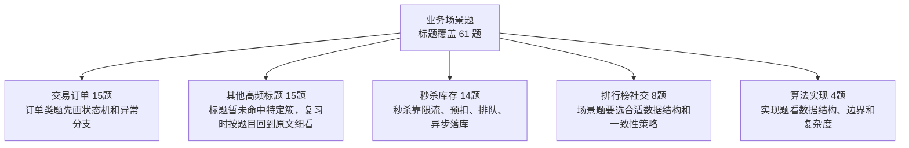

| 知识簇 | 覆盖题数 | 图中速记 | 代表标题 |
|---|---:|---|---|
| 交易订单 | 15 | 订单类题先画状态机和异常分支 | [订单号用了基因法之后 二次分表怎么办](15_业务场景题/0016_订单号用了基因法之后_二次分表怎么办.md) / [订单到期关闭如何实现](15_业务场景题/0066_订单到期关闭如何实现.md) / [基于状态机+乐观锁解决订单支付和关单的并发问题](15_业务场景题/0280_基于状态机+乐观锁解决订单支付和关单的并发问题.md) / [购物车中如何解决重复下单的问题](15_业务场景题/0316_购物车中如何解决重复下单的问题.md) / [基于Token校验避免订单重复提交](15_业务场景题/0343_基于Token校验避免订单重复提交.md) / [账户里面只有十块钱 同时发来两笔订单一共大于十块钱 怎么保证不超花](15_业务场景题/0671_账户里面只有十块钱_同时发来两笔订单一共大于十块钱_怎么保证不超花.md) |
| 其他高频标题 | 15 | 标题暂未命中特定簇，复习时按题目回到原文细看 | [如何实现百万级数据从Excel导入到数据库](15_业务场景题/0243_如何实现百万级数据从Excel导入到数据库.md) / [防止接口被恶意刷流量 除了限流还应在代码层面做哪些防护](15_业务场景题/0725_防止接口被恶意刷流量_除了限流还应在代码层面做哪些防护.md) / [如果让你实现短链服务 如何生成不重复的短链地址](15_业务场景题/0739_如果让你实现短链服务_如何生成不重复的短链地址.md) / [外卖系统 一天一千万条数据 用户需要查到近30天的数据 商家也要查询到30天的数据 怎么设计表](15_业务场景题/0740_外卖系统_一天一千万条数据_用户需要查到近30天的数据_商家也要查询到30天的数据_怎么设计表.md) / [大量的手机号码被标记成骚扰电话 如何存储这些号码](15_业务场景题/0771_大量的手机号码被标记成骚扰电话_如何存储这些号码.md) / [两个不相关的网站A和B 如何实现A登录B也能自动登录](15_业务场景题/0838_两个不相关的网站A和B_如何实现A登录B也能自动登录.md) |
| 秒杀库存 | 14 | 秒杀靠限流、预扣、排队、异步落库 | [小红书靠MySQL抗秒杀的方案](15_业务场景题/0034_小红书靠MySQL抗秒杀的方案.md) / [基于 bitset 实现高效的商品预约](15_业务场景题/0124_基于_bitset_实现高效的商品预约.md) / [全国的酒店价格 千万级 需要在某个瞬间比如7点发生变动 怎样高性能准点去进行变更](15_业务场景题/0206_全国的酒店价格_千万级_需要在某个瞬间比如7点发生变动_怎样高性能准点去进行变更.md) / [阿里的数据库能抗秒杀的原理](15_业务场景题/0217_阿里的数据库能抗秒杀的原理.md) / [高并发的库存系统 在数据库扣减库存 怎么实现](15_业务场景题/0244_高并发的库存系统_在数据库扣减库存_怎么实现.md) / [10年 深圳证券公司 系统架构组架构师 监控平台 电商平台 秒杀](15_业务场景题/0311_10年_深圳证券公司_系统架构组架构师_监控平台_电商平台_秒杀.md) |
| 排行榜社交 | 8 | 场景题要选合适数据结构和一致性策略 | [如何实现一个点赞系统](15_业务场景题/0118_如何实现一个点赞系统.md) / [如何实现敏感词过滤](15_业务场景题/0204_如何实现敏感词过滤.md) / [如何实现百万级排行榜功能](15_业务场景题/0205_如何实现百万级排行榜功能.md) / [Redis的zset实现排行榜 实现分数相同按照时间顺序排序 怎么做](15_业务场景题/0227_Redis的zset实现排行榜_实现分数相同按照时间顺序排序_怎么做.md) / [亿级商品如何存储](15_业务场景题/0750_亿级商品如何存储.md) / [把商品加入购物车时断网了 该怎么在重新联网时同步](15_业务场景题/0757_把商品加入购物车时断网了_该怎么在重新联网时同步.md) |
| 算法实现 | 4 | 实现题看数据结构、边界和复杂度 | [如果让你实现一个字符串的equals方法 你会如何实现](15_业务场景题/0209_如果让你实现一个字符串的equals方法_你会如何实现.md) / [让你实现一个短链服务 你会考虑哪些问题](15_业务场景题/0249_让你实现一个短链服务_你会考虑哪些问题.md) / [实现一个登录拉黑功能 实现拉黑用户和把已经登陆用户踢下线](15_业务场景题/0798_实现一个登录拉黑功能_实现拉黑用户和把已经登陆用户踢下线.md) / [如果让你实现一个RPC框架 会考虑用哪些技术解决哪些问题](15_业务场景题/0864_如果让你实现一个RPC框架_会考虑用哪些技术解决哪些问题.md) |
| 数据一致性 | 3 | 业务一致性靠幂等、重试、补偿、对账 | [百万级会员的用户平台 如何实现快到期的会员的消息提醒](15_业务场景题/0337_百万级会员的用户平台_如何实现快到期的会员的消息提醒.md) / [如果让你实现消息队列 会考虑哪些问题](15_业务场景题/0915_如果让你实现消息队列_会考虑哪些问题.md) / [如何保障消息一定能发送到RabbitMQ](15_业务场景题/1116_如何保障消息一定能发送到RabbitMQ.md) |
| 复杂系统 | 2 | 复杂题先拆领域，再讲链路和风险 | [8年 双非一本 车企区块链项目 溯源 NFT商城-订单](15_业务场景题/0100_8年_双非一本_车企区块链项目_溯源_NFT商城-订单.md) / [有一个银行系统 对实时性要求比较高 你会怎么选择垃圾回收器](15_业务场景题/0122_有一个银行系统_对实时性要求比较高_你会怎么选择垃圾回收器.md) |

<details>
<summary>交易订单 全量题目 15 题</summary>

- [订单号用了基因法之后 二次分表怎么办](15_业务场景题/0016_订单号用了基因法之后_二次分表怎么办.md)
- [订单到期关闭如何实现](15_业务场景题/0066_订单到期关闭如何实现.md)
- [基于状态机+乐观锁解决订单支付和关单的并发问题](15_业务场景题/0280_基于状态机+乐观锁解决订单支付和关单的并发问题.md)
- [购物车中如何解决重复下单的问题](15_业务场景题/0316_购物车中如何解决重复下单的问题.md)
- [基于Token校验避免订单重复提交](15_业务场景题/0343_基于Token校验避免订单重复提交.md)
- [账户里面只有十块钱 同时发来两笔订单一共大于十块钱 怎么保证不超花](15_业务场景题/0671_账户里面只有十块钱_同时发来两笔订单一共大于十块钱_怎么保证不超花.md)
- [库存扣减 创建订单 如何拆成TCC](15_业务场景题/0711_库存扣减_创建订单_如何拆成TCC.md)
- [一个支付单 多个渠道同时支付成功了怎么办](15_业务场景题/0840_一个支付单_多个渠道同时支付成功了怎么办.md)
- [一个订单 在11 00超时关闭 但在11 00也支付成功了 怎么办](15_业务场景题/0841_一个订单_在11_00超时关闭_但在11_00也支付成功了_怎么办.md)
- [让你设计一个订单号生成服务 该怎么做](15_业务场景题/0953_让你设计一个订单号生成服务_该怎么做.md)
- [大型电商的订单系统 如何设计分库分表方案](15_业务场景题/1090_大型电商的订单系统_如何设计分库分表方案.md)
- [利用雪花算法+Redis 自增 ID 实现唯一订单号生成](15_业务场景题/1117_利用雪花算法+Redis_自增_ID_实现唯一订单号生成.md)
- [使用quartz定时任务实现支付单自动关单功能 并引入多线程+分段解决扫表延迟的问题](15_业务场景题/1221_使用quartz定时任务实现支付单自动关单功能_并引入多线程+分段解决扫表延迟的问题.md)
- [通过采用“一锁二判三更新”方式设计接口幂等 解决支付单重复支付的问题](15_业务场景题/1233_通过采用“一锁二判三更新”方式设计接口幂等_解决支付单重复支付的问题.md)
- [为什么不建议使用MQ实现订单到期关闭](15_业务场景题/1234_为什么不建议使用MQ实现订单到期关闭.md)

</details>

<details>
<summary>其他高频标题 全量题目 15 题</summary>

- [如何实现百万级数据从Excel导入到数据库](15_业务场景题/0243_如何实现百万级数据从Excel导入到数据库.md)
- [防止接口被恶意刷流量 除了限流还应在代码层面做哪些防护](15_业务场景题/0725_防止接口被恶意刷流量_除了限流还应在代码层面做哪些防护.md)
- [如果让你实现短链服务 如何生成不重复的短链地址](15_业务场景题/0739_如果让你实现短链服务_如何生成不重复的短链地址.md)
- [外卖系统 一天一千万条数据 用户需要查到近30天的数据 商家也要查询到30天的数据 怎么设计表](15_业务场景题/0740_外卖系统_一天一千万条数据_用户需要查到近30天的数据_商家也要查询到30天的数据_怎么设计表.md)
- [大量的手机号码被标记成骚扰电话 如何存储这些号码](15_业务场景题/0771_大量的手机号码被标记成骚扰电话_如何存储这些号码.md)
- [两个不相关的网站A和B 如何实现A登录B也能自动登录](15_业务场景题/0838_两个不相关的网站A和B_如何实现A登录B也能自动登录.md)
- [如果要存IP地址 用什么数据类型比较好](15_业务场景题/0872_如果要存IP地址_用什么数据类型比较好.md)
- [如何实现 查找附近的人 功能](15_业务场景题/0887_如何实现_查找附近的人_功能.md)
- [如何设计一个购物车功能](15_业务场景题/0941_如何设计一个购物车功能.md)
- [不用redis分布式锁 如何防止用户重复点击](15_业务场景题/0954_不用redis分布式锁_如何防止用户重复点击.md)
- [在100M内存下存储一亿个整数 其范围在１到2亿 如何快速判断给定到一个整数值是否存在](15_业务场景题/1003_在100M内存下存储一亿个整数_其范围在１到2亿_如何快速判断给定到一个整数值是否存在.md)
- [10个线程模拟赛马 所有马就绪后才能开跑 所有马到达终点后裁判宣布赛马成绩](15_业务场景题/1113_10个线程模拟赛马_所有马就绪后才能开跑_所有马到达终点后裁判宣布赛马成绩.md)
- [基于EasyExcel+线程池+批量插入实现百万级数据导入](15_业务场景题/1167_基于EasyExcel+线程池+批量插入实现百万级数据导入.md)
- [通过热点数据预热 多级缓存 异步化编程等方式解决热门数据接口耗时长问题](15_业务场景题/1179_通过热点数据预热_多级缓存_异步化编程等方式解决热门数据接口耗时长问题.md)
- [为了防止接口被恶意调用 设计API秘钥方式提升接口安全性 并通过滑动窗口粗实现接口调用限流](15_业务场景题/1191_为了防止接口被恶意调用_设计API秘钥方式提升接口安全性_并通过滑动窗口粗实现接口调用限流.md)

</details>

<details>
<summary>秒杀库存 全量题目 14 题</summary>

- [小红书靠MySQL抗秒杀的方案](15_业务场景题/0034_小红书靠MySQL抗秒杀的方案.md)
- [基于 bitset 实现高效的商品预约](15_业务场景题/0124_基于_bitset_实现高效的商品预约.md)
- [全国的酒店价格 千万级 需要在某个瞬间比如7点发生变动 怎样高性能准点去进行变更](15_业务场景题/0206_全国的酒店价格_千万级_需要在某个瞬间比如7点发生变动_怎样高性能准点去进行变更.md)
- [阿里的数据库能抗秒杀的原理](15_业务场景题/0217_阿里的数据库能抗秒杀的原理.md)
- [高并发的库存系统 在数据库扣减库存 怎么实现](15_业务场景题/0244_高并发的库存系统_在数据库扣减库存_怎么实现.md)
- [10年 深圳证券公司 系统架构组架构师 监控平台 电商平台 秒杀](15_业务场景题/0311_10年_深圳证券公司_系统架构组架构师_监控平台_电商平台_秒杀.md)
- [有100个优惠券 有几千万流量 怎么保证服务器不跨掉 怎么保证最前面的人能抢到这个券](15_业务场景题/0346_有100个优惠券_有几千万流量_怎么保证服务器不跨掉_怎么保证最前面的人能抢到这个券.md)
- [阿里的库存秒杀是如何实现的](15_业务场景题/0408_阿里的库存秒杀是如何实现的.md)
- [秒杀场景下 怎么加库存](15_业务场景题/0850_秒杀场景下_怎么加库存.md)
- [阿里的数据库能抗秒杀的原理](15_业务场景题/0878_阿里的数据库能抗秒杀的原理.md)
- [库存扣减如何避免超卖和少卖](15_业务场景题/0914_库存扣减如何避免超卖和少卖.md)
- [让你设计一个秒杀系统 你会考虑哪些问题](15_业务场景题/0929_让你设计一个秒杀系统_你会考虑哪些问题.md)
- [为什么不用分布式锁来实现秒杀](15_业务场景题/1140_为什么不用分布式锁来实现秒杀.md)
- [如何实现一个抢红包功能](15_业务场景题/1192_如何实现一个抢红包功能.md)

</details>

<details>
<summary>排行榜社交 全量题目 8 题</summary>

- [如何实现一个点赞系统](15_业务场景题/0118_如何实现一个点赞系统.md)
- [如何实现敏感词过滤](15_业务场景题/0204_如何实现敏感词过滤.md)
- [如何实现百万级排行榜功能](15_业务场景题/0205_如何实现百万级排行榜功能.md)
- [Redis的zset实现排行榜 实现分数相同按照时间顺序排序 怎么做](15_业务场景题/0227_Redis的zset实现排行榜_实现分数相同按照时间顺序排序_怎么做.md)
- [亿级商品如何存储](15_业务场景题/0750_亿级商品如何存储.md)
- [把商品加入购物车时断网了 该怎么在重新联网时同步](15_业务场景题/0757_把商品加入购物车时断网了_该怎么在重新联网时同步.md)
- [如何用Redis实现朋友圈点赞功能](15_业务场景题/0903_如何用Redis实现朋友圈点赞功能.md)
- [基于Redis的zset实现秒级排行榜](15_业务场景题/1152_基于Redis的zset实现秒级排行榜.md)

</details>

<details>
<summary>算法实现 全量题目 4 题</summary>

- [如果让你实现一个字符串的equals方法 你会如何实现](15_业务场景题/0209_如果让你实现一个字符串的equals方法_你会如何实现.md)
- [让你实现一个短链服务 你会考虑哪些问题](15_业务场景题/0249_让你实现一个短链服务_你会考虑哪些问题.md)
- [实现一个登录拉黑功能 实现拉黑用户和把已经登陆用户踢下线](15_业务场景题/0798_实现一个登录拉黑功能_实现拉黑用户和把已经登陆用户踢下线.md)
- [如果让你实现一个RPC框架 会考虑用哪些技术解决哪些问题](15_业务场景题/0864_如果让你实现一个RPC框架_会考虑用哪些技术解决哪些问题.md)

</details>

<details>
<summary>数据一致性 全量题目 3 题</summary>

- [百万级会员的用户平台 如何实现快到期的会员的消息提醒](15_业务场景题/0337_百万级会员的用户平台_如何实现快到期的会员的消息提醒.md)
- [如果让你实现消息队列 会考虑哪些问题](15_业务场景题/0915_如果让你实现消息队列_会考虑哪些问题.md)
- [如何保障消息一定能发送到RabbitMQ](15_业务场景题/1116_如何保障消息一定能发送到RabbitMQ.md)

</details>

<details>
<summary>复杂系统 全量题目 2 题</summary>

- [8年 双非一本 车企区块链项目 溯源 NFT商城-订单](15_业务场景题/0100_8年_双非一本_车企区块链项目_溯源_NFT商城-订单.md)
- [有一个银行系统 对实时性要求比较高 你会怎么选择垃圾回收器](15_业务场景题/0122_有一个银行系统_对实时性要求比较高_你会怎么选择垃圾回收器.md)

</details>

## 16_性能调优与故障排查

入口：[16_性能调优与故障排查/README.md](16_性能调优与故障排查/README.md)

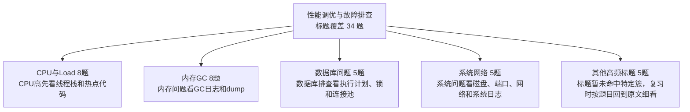

| 知识簇 | 覆盖题数 | 图中速记 | 代表标题 |
|---|---:|---|---|
| CPU与Load | 8 | CPU高先看线程栈和热点代码 | [CPU飙高问题排查过程 1](16_性能调优与故障排查/0184_CPU飙高问题排查过程_1.md) / [日志打印导致CPU飙高问题排查](16_性能调优与故障排查/0312_日志打印导致CPU飙高问题排查.md) / [数据库CPU被打满排查过程](16_性能调优与故障排查/0538_数据库CPU被打满排查过程.md) / [CPU飙高问题排查过程 2](16_性能调优与故障排查/0554_CPU飙高问题排查过程_2.md) / [RT飙高问题排查过程](16_性能调优与故障排查/0580_RT飙高问题排查过程.md) / [服务器有多个节点 线上出现用户进入缓慢 监控服务器cpu和缓存没有什么压力 可以从哪些方面排查](16_性能调优与故障排查/0686_服务器有多个节点_线上出现用户进入缓慢_监控服务器cpu和缓存没有什么压力_可以从哪些方面排查.md) |
| 内存GC | 8 | 内存问题看GC日志和dump | [ThreadLocal为什么会导致内存泄漏如何解决的](16_性能调优与故障排查/0134_ThreadLocal为什么会导致内存泄漏如何解决的.md) / [OOM问题排查过程](16_性能调优与故障排查/0187_OOM问题排查过程.md) / [频繁FullGC问题排查](16_性能调优与故障排查/0513_频繁FullGC问题排查.md) / [数据倾斜导致的频繁FullGC问题排查](16_性能调优与故障排查/0795_数据倾斜导致的频繁FullGC问题排查.md) / [频繁FullGC问题排查(2)](16_性能调优与故障排查/0810_频繁FullGC问题排查(2).md) / [POI导致内存溢出排查](16_性能调优与故障排查/0823_POI导致内存溢出排查.md) |
| 数据库问题 | 5 | 数据库排查看执行计划、锁和连接池 | [数据库连接池满排查过程](16_性能调优与故障排查/0262_数据库连接池满排查过程.md) / [索引失效的问题是如何排查的 有哪些种情况](16_性能调优与故障排查/0265_索引失效的问题是如何排查的_有哪些种情况.md) / [慢SQL问题排查](16_性能调优与故障排查/0484_慢SQL问题排查.md) / [数据库死锁问题排查过程](16_性能调优与故障排查/0567_数据库死锁问题排查过程.md) / [索引失效的问题如何排查](16_性能调优与故障排查/1225_索引失效的问题如何排查.md) |
| 系统网络 | 5 | 系统问题看磁盘、端口、网络和系统日志 | [端口冲突问题如何定位和解决](16_性能调优与故障排查/0214_端口冲突问题如何定位和解决.md) / [线上服务器如果磁盘满了 你会如何处理](16_性能调优与故障排查/0331_线上服务器如果磁盘满了_你会如何处理.md) / [服务器被注入挖矿木马问题排查](16_性能调优与故障排查/0709_服务器被注入挖矿木马问题排查.md) / [服务器突然 ssh 连不上了 可能是什么问题](16_性能调优与故障排查/0724_服务器突然_ssh_连不上了_可能是什么问题.md) / [如何排查网络问题](16_性能调优与故障排查/0811_如何排查网络问题.md) |
| 其他高频标题 | 5 | 标题暂未命中特定簇，复习时按题目回到原文细看 | [压测600没问题 上线后300就扛不住了 可能是什么原因](16_性能调优与故障排查/0626_压测600没问题_上线后300就扛不住了_可能是什么原因.md) / [回表导致慢 SQL 问题排查](16_性能调优与故障排查/0723_回表导致慢_SQL_问题排查.md) / [线上接口如果响应很慢如何去排查定位问题呢](16_性能调优与故障排查/0742_线上接口如果响应很慢如何去排查定位问题呢.md) / [Java进程突然挂了 可能是什么原因](16_性能调优与故障排查/0755_Java进程突然挂了_可能是什么原因.md) / [OutOfMemory和StackOverflow的区别是什么](16_性能调优与故障排查/1098_OutOfMemory和StackOverflow的区别是什么.md) |
| 中间件业务 | 3 | 中间件看堆积、热点、IO和下游依赖 | [RocketMQ消费堆积问题排查](16_性能调优与故障排查/0596_RocketMQ消费堆积问题排查.md) / [Redis和MySQL的一次普通查询 RT在什么范围内是合理的](16_性能调优与故障排查/0625_Redis和MySQL的一次普通查询_RT在什么范围内是合理的.md) / [Sort aborted问题排查过程](16_性能调优与故障排查/0848_Sort_aborted问题排查过程.md) |

<details>
<summary>CPU与Load 全量题目 8 题</summary>

- [CPU飙高问题排查过程 1](16_性能调优与故障排查/0184_CPU飙高问题排查过程_1.md)
- [日志打印导致CPU飙高问题排查](16_性能调优与故障排查/0312_日志打印导致CPU飙高问题排查.md)
- [数据库CPU被打满排查过程](16_性能调优与故障排查/0538_数据库CPU被打满排查过程.md)
- [CPU飙高问题排查过程 2](16_性能调优与故障排查/0554_CPU飙高问题排查过程_2.md)
- [RT飙高问题排查过程](16_性能调优与故障排查/0580_RT飙高问题排查过程.md)
- [服务器有多个节点 线上出现用户进入缓慢 监控服务器cpu和缓存没有什么压力 可以从哪些方面排查](16_性能调优与故障排查/0686_服务器有多个节点_线上出现用户进入缓慢_监控服务器cpu和缓存没有什么压力_可以从哪些方面排查.md)
- [应用启动后前几分钟 Load RT CPU等飙高 如何定位 可能的原因是什么](16_性能调优与故障排查/0839_应用启动后前几分钟_Load_RT_CPU等飙高_如何定位_可能的原因是什么.md)
- [Load飙高问题排查过程](16_性能调优与故障排查/0863_Load飙高问题排查过程.md)

</details>

<details>
<summary>内存GC 全量题目 8 题</summary>

- [ThreadLocal为什么会导致内存泄漏如何解决的](16_性能调优与故障排查/0134_ThreadLocal为什么会导致内存泄漏如何解决的.md)
- [OOM问题排查过程](16_性能调优与故障排查/0187_OOM问题排查过程.md)
- [频繁FullGC问题排查](16_性能调优与故障排查/0513_频繁FullGC问题排查.md)
- [数据倾斜导致的频繁FullGC问题排查](16_性能调优与故障排查/0795_数据倾斜导致的频繁FullGC问题排查.md)
- [频繁FullGC问题排查(2)](16_性能调优与故障排查/0810_频繁FullGC问题排查(2).md)
- [POI导致内存溢出排查](16_性能调优与故障排查/0823_POI导致内存溢出排查.md)
- [应用占用内存持续增长 但是堆内存 元空间都没变化 可能是什么原因](16_性能调优与故障排查/0940_应用占用内存持续增长_但是堆内存_元空间都没变化_可能是什么原因.md)
- [内存泄漏和内存溢出的区别是什么](16_性能调优与故障排查/1112_内存泄漏和内存溢出的区别是什么.md)

</details>

<details>
<summary>数据库问题 全量题目 5 题</summary>

- [数据库连接池满排查过程](16_性能调优与故障排查/0262_数据库连接池满排查过程.md)
- [索引失效的问题是如何排查的 有哪些种情况](16_性能调优与故障排查/0265_索引失效的问题是如何排查的_有哪些种情况.md)
- [慢SQL问题排查](16_性能调优与故障排查/0484_慢SQL问题排查.md)
- [数据库死锁问题排查过程](16_性能调优与故障排查/0567_数据库死锁问题排查过程.md)
- [索引失效的问题如何排查](16_性能调优与故障排查/1225_索引失效的问题如何排查.md)

</details>

<details>
<summary>系统网络 全量题目 5 题</summary>

- [端口冲突问题如何定位和解决](16_性能调优与故障排查/0214_端口冲突问题如何定位和解决.md)
- [线上服务器如果磁盘满了 你会如何处理](16_性能调优与故障排查/0331_线上服务器如果磁盘满了_你会如何处理.md)
- [服务器被注入挖矿木马问题排查](16_性能调优与故障排查/0709_服务器被注入挖矿木马问题排查.md)
- [服务器突然 ssh 连不上了 可能是什么问题](16_性能调优与故障排查/0724_服务器突然_ssh_连不上了_可能是什么问题.md)
- [如何排查网络问题](16_性能调优与故障排查/0811_如何排查网络问题.md)

</details>

<details>
<summary>其他高频标题 全量题目 5 题</summary>

- [压测600没问题 上线后300就扛不住了 可能是什么原因](16_性能调优与故障排查/0626_压测600没问题_上线后300就扛不住了_可能是什么原因.md)
- [回表导致慢 SQL 问题排查](16_性能调优与故障排查/0723_回表导致慢_SQL_问题排查.md)
- [线上接口如果响应很慢如何去排查定位问题呢](16_性能调优与故障排查/0742_线上接口如果响应很慢如何去排查定位问题呢.md)
- [Java进程突然挂了 可能是什么原因](16_性能调优与故障排查/0755_Java进程突然挂了_可能是什么原因.md)
- [OutOfMemory和StackOverflow的区别是什么](16_性能调优与故障排查/1098_OutOfMemory和StackOverflow的区别是什么.md)

</details>

<details>
<summary>中间件业务 全量题目 3 题</summary>

- [RocketMQ消费堆积问题排查](16_性能调优与故障排查/0596_RocketMQ消费堆积问题排查.md)
- [Redis和MySQL的一次普通查询 RT在什么范围内是合理的](16_性能调优与故障排查/0625_Redis和MySQL的一次普通查询_RT在什么范围内是合理的.md)
- [Sort aborted问题排查过程](16_性能调优与故障排查/0848_Sort_aborted问题排查过程.md)

</details>

## 17_数据结构与算法

入口：[17_数据结构与算法/README.md](17_数据结构与算法/README.md)

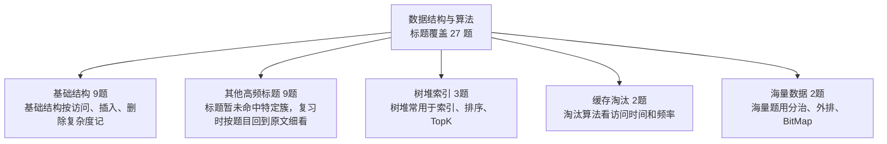

| 知识簇 | 覆盖题数 | 图中速记 | 代表标题 |
|---|---:|---|---|
| 基础结构 | 9 | 基础结构按访问、插入、删除复杂度记 | [什么是前缀树 有什么作用](17_数据结构与算法/0584_什么是前缀树_有什么作用.md) / [二叉树的遍历有几种方式](17_数据结构与算法/0585_二叉树的遍历有几种方式.md) / [什么是树了解哪些树结构](17_数据结构与算法/0600_什么是树了解哪些树结构.md) / [栈和队列的区别](17_数据结构与算法/0611_栈和队列的区别.md) / [数组和链表有何区别](17_数据结构与算法/0627_数组和链表有何区别.md) / [给定一个二叉搜索树 请找出其中第k小的元素](17_数据结构与算法/1149_给定一个二叉搜索树_请找出其中第k小的元素.md) |
| 其他高频标题 | 9 | 标题暂未命中特定簇，复习时按题目回到原文细看 | [40亿个QQ号 限制1G内存 如何去重](17_数据结构与算法/0774_40亿个QQ号_限制1G内存_如何去重.md) / [什么是图有向图和无向图的区别是什么](17_数据结构与算法/0899_什么是图有向图和无向图的区别是什么.md) / [一个天平 7g和2g砝码各一个 将140g盐分成90g和50g 需要称多少次](17_数据结构与算法/1030_一个天平_7g和2g砝码各一个_将140g盐分成90g和50g_需要称多少次.md) / [1000瓶药水 1瓶有毒药 最少需要几只小白鼠一定能够找出](17_数据结构与算法/1044_1000瓶药水_1瓶有毒药_最少需要几只小白鼠一定能够找出.md) / [有两个水桶 容量分别为5升和3升 请问如何使用这两个桶得到4升的水](17_数据结构与算法/1057_有两个水桶_容量分别为5升和3升_请问如何使用这两个桶得到4升的水.md) / [有8个球 其中7个重量相同 另一个球比其他球重 现在只有一个天平 请问最少需要称几次一定能找到那个比其他球重的球](17_数据结构与算法/1072_有8个球_其中7个重量相同_另一个球比其他球重_现在只有一个天平_请问最少需要称几次一定能找到那个比其他球重的球.md) |
| 树堆索引 | 3 | 树堆常用于索引、排序、TopK | [什么是堆什么情况下要用堆](17_数据结构与算法/0040_什么是堆什么情况下要用堆.md) / [有一堆桃子 猴子第一天吃了一半加一个 第二天又吃了一半加一个 ... 到第10天时剩下一个桃子 问这原来有多少个](17_数据结构与算法/1045_有一堆桃子_猴子第一天吃了一半加一个_第二天又吃了一半加一个_..._到第10天时剩下一个桃子_问这原来有多少个.md) / [什么是堆外内存如何使用堆外内存](17_数据结构与算法/1136_什么是堆外内存如何使用堆外内存.md) |
| 缓存淘汰 | 2 | 淘汰算法看访问时间和频率 | [LRU 和 LFU 有啥区别](17_数据结构与算法/0608_LRU_和_LFU_有啥区别.md) / [你知道哪些缓存失效算法](17_数据结构与算法/0637_你知道哪些缓存失效算法.md) |
| 海量数据 | 2 | 海量题用分治、外排、BitMap | [如果有1TB的数据需要排序 但只有32GB的内存如何排序处理](17_数据结构与算法/0120_如果有1TB的数据需要排序_但只有32GB的内存如何排序处理.md) / [如何从 1TB 的搜索日志中找出搜索量最高的 10 个关键词](17_数据结构与算法/0669_如何从_1TB_的搜索日志中找出搜索量最高的_10_个关键词.md) |
| 过滤去重 | 1 | 过滤去重关注空间和误判率 | [做一个过滤黑名单网址的系统 你觉得要怎么实现 会用到哪些数据结构](17_数据结构与算法/0186_做一个过滤黑名单网址的系统_你觉得要怎么实现_会用到哪些数据结构.md) |
| 位运算与数学 | 1 | 位运算题抓底层表示和效率 | [为什么按位与运算要比取模运算高效](17_数据结构与算法/0703_为什么按位与运算要比取模运算高效.md) |

<details>
<summary>基础结构 全量题目 9 题</summary>

- [什么是前缀树 有什么作用](17_数据结构与算法/0584_什么是前缀树_有什么作用.md)
- [二叉树的遍历有几种方式](17_数据结构与算法/0585_二叉树的遍历有几种方式.md)
- [什么是树了解哪些树结构](17_数据结构与算法/0600_什么是树了解哪些树结构.md)
- [栈和队列的区别](17_数据结构与算法/0611_栈和队列的区别.md)
- [数组和链表有何区别](17_数据结构与算法/0627_数组和链表有何区别.md)
- [给定一个二叉搜索树 请找出其中第k小的元素](17_数据结构与算法/1149_给定一个二叉搜索树_请找出其中第k小的元素.md)
- [有一个包含N个整数的数组 请编写一个算法 找到其中的两个元素 使它们之差最小 时间复杂度必须为O(n)](17_数据结构与算法/1189_有一个包含N个整数的数组_请编写一个算法_找到其中的两个元素_使它们之差最小_时间复杂度必须为O(n).md)
- [如何用栈实现一个队列](17_数据结构与算法/1190_如何用栈实现一个队列.md)
- [如何用队列实现一个栈](17_数据结构与算法/1204_如何用队列实现一个栈.md)

</details>

<details>
<summary>其他高频标题 全量题目 9 题</summary>

- [40亿个QQ号 限制1G内存 如何去重](17_数据结构与算法/0774_40亿个QQ号_限制1G内存_如何去重.md)
- [什么是图有向图和无向图的区别是什么](17_数据结构与算法/0899_什么是图有向图和无向图的区别是什么.md)
- [一个天平 7g和2g砝码各一个 将140g盐分成90g和50g 需要称多少次](17_数据结构与算法/1030_一个天平_7g和2g砝码各一个_将140g盐分成90g和50g_需要称多少次.md)
- [1000瓶药水 1瓶有毒药 最少需要几只小白鼠一定能够找出](17_数据结构与算法/1044_1000瓶药水_1瓶有毒药_最少需要几只小白鼠一定能够找出.md)
- [有两个水桶 容量分别为5升和3升 请问如何使用这两个桶得到4升的水](17_数据结构与算法/1057_有两个水桶_容量分别为5升和3升_请问如何使用这两个桶得到4升的水.md)
- [有8个球 其中7个重量相同 另一个球比其他球重 现在只有一个天平 请问最少需要称几次一定能找到那个比其他球重的球](17_数据结构与算法/1072_有8个球_其中7个重量相同_另一个球比其他球重_现在只有一个天平_请问最少需要称几次一定能找到那个比其他球重的球.md)
- [假设你有一个乒乓球盒子 里面有 3 个白球和 2 个黑球 从盒子中抽取一个球 放回后再抽取一个球 两次抽取得到的球颜色不同的概率是多少](17_数据结构与算法/1086_假设你有一个乒乓球盒子_里面有_3_个白球和_2_个黑球_从盒子中抽取一个球_放回后再抽取一个球_两次抽取得到的球颜色不同的概率是多少.md)
- [村庄有个约定 生男孩就结束 生女孩就继续生 直到生出男孩为止 若干年后 这个村子男女比例是多少](17_数据结构与算法/1087_村庄有个约定_生男孩就结束_生女孩就继续生_直到生出男孩为止_若干年后_这个村子男女比例是多少.md)
- [判断101-200之间有多少个质数 并输出所有质数](17_数据结构与算法/1164_判断101-200之间有多少个质数_并输出所有质数.md)

</details>

<details>
<summary>树堆索引 全量题目 3 题</summary>

- [什么是堆什么情况下要用堆](17_数据结构与算法/0040_什么是堆什么情况下要用堆.md)
- [有一堆桃子 猴子第一天吃了一半加一个 第二天又吃了一半加一个 ... 到第10天时剩下一个桃子 问这原来有多少个](17_数据结构与算法/1045_有一堆桃子_猴子第一天吃了一半加一个_第二天又吃了一半加一个_..._到第10天时剩下一个桃子_问这原来有多少个.md)
- [什么是堆外内存如何使用堆外内存](17_数据结构与算法/1136_什么是堆外内存如何使用堆外内存.md)

</details>

<details>
<summary>缓存淘汰 全量题目 2 题</summary>

- [LRU 和 LFU 有啥区别](17_数据结构与算法/0608_LRU_和_LFU_有啥区别.md)
- [你知道哪些缓存失效算法](17_数据结构与算法/0637_你知道哪些缓存失效算法.md)

</details>

<details>
<summary>海量数据 全量题目 2 题</summary>

- [如果有1TB的数据需要排序 但只有32GB的内存如何排序处理](17_数据结构与算法/0120_如果有1TB的数据需要排序_但只有32GB的内存如何排序处理.md)
- [如何从 1TB 的搜索日志中找出搜索量最高的 10 个关键词](17_数据结构与算法/0669_如何从_1TB_的搜索日志中找出搜索量最高的_10_个关键词.md)

</details>

<details>
<summary>过滤去重 全量题目 1 题</summary>

- [做一个过滤黑名单网址的系统 你觉得要怎么实现 会用到哪些数据结构](17_数据结构与算法/0186_做一个过滤黑名单网址的系统_你觉得要怎么实现_会用到哪些数据结构.md)

</details>

<details>
<summary>位运算与数学 全量题目 1 题</summary>

- [为什么按位与运算要比取模运算高效](17_数据结构与算法/0703_为什么按位与运算要比取模运算高效.md)

</details>

## 18_AI与大模型

入口：[18_AI与大模型/README.md](18_AI与大模型/README.md)

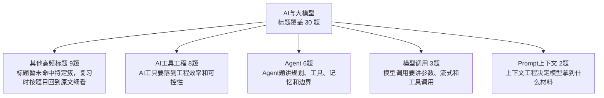

| 知识簇 | 覆盖题数 | 图中速记 | 代表标题 |
|---|---:|---|---|
| 其他高频标题 | 9 | 标题暂未命中特定簇，复习时按题目回到原文细看 | [在Java项目中集成大模型 用什么框架](18_AI与大模型/0028_在Java项目中集成大模型_用什么框架.md) / [了解Spring AI吗 他都能干什么](18_AI与大模型/0292_了解Spring_AI吗_他都能干什么.md) / [什么是大模型的微调 和预训练有什么区别](18_AI与大模型/0325_什么是大模型的微调_和预训练有什么区别.md) / [DeepSeek为什么训练成本低](18_AI与大模型/0370_DeepSeek为什么训练成本低.md) / [如何看待DeepSeek 他能爆火的主要原因是什么](18_AI与大模型/0385_如何看待DeepSeek_他能爆火的主要原因是什么.md) / [大模型产生幻觉的原因 如何解决](18_AI与大模型/0386_大模型产生幻觉的原因_如何解决.md) |
| AI工具工程 | 8 | AI工具要落到工程效率和可控性 | [Vibe Coding该怎么做](18_AI与大模型/0010_Vibe_Coding该怎么做.md) / [你平时用过哪些AI工具](18_AI与大模型/0011_你平时用过哪些AI工具.md) / [Claude Code国内不能用 你是怎么用的](18_AI与大模型/0015_Claude_Code国内不能用_你是怎么用的.md) / [什么是Vibe Coding 氛围编程](18_AI与大模型/0017_什么是Vibe_Coding_氛围编程.md) / [你认为Cursor编程体验好的主要原因是什么](18_AI与大模型/0018_你认为Cursor编程体验好的主要原因是什么.md) / [你平时用过哪些AI Coding的工具吗](18_AI与大模型/0019_你平时用过哪些AI_Coding的工具吗.md) |
| Agent | 6 | Agent题讲规划、工具、记忆和边界 | [在开发 AI Agent 时 应该采用单 Agent 还是多 Agent 架构拆分的判断标准是什么](18_AI与大模型/0005_在开发_AI_Agent_时_应该采用单_Agent_还是多_Agent_架构拆分的判断标准是什么.md) / [什么是Skill的自进化机制](18_AI与大模型/0013_什么是Skill的自进化机制.md) / [Skill和MCP有什么区别](18_AI与大模型/0026_Skill和MCP有什么区别.md) / [什么是Agent Skill](18_AI与大模型/0027_什么是Agent_Skill.md) / [什么是ReAct Agent](18_AI与大模型/0032_什么是ReAct_Agent.md) / [什么是AI Agent](18_AI与大模型/0112_什么是AI_Agent.md) |
| 模型调用 | 3 | 模型调用要讲参数、流式和工具调用 | [什么是Function Calling](18_AI与大模型/0014_什么是Function_Calling.md) / [SpringAI中ChatModel和ChatClient有啥区别](18_AI与大模型/0022_SpringAI中ChatModel和ChatClient有啥区别.md) / [对接大模型的API哪些参数了解么](18_AI与大模型/0023_对接大模型的API哪些参数了解么.md) |
| Prompt上下文 | 2 | 上下文工程决定模型拿到什么材料 | [什么是Harness工程 和Prompt工程 Context工程有啥区别](18_AI与大模型/0009_什么是Harness工程_和Prompt工程_Context工程有啥区别.md) / [Spring AI中的advisor机制了解吗](18_AI与大模型/0021_Spring_AI中的advisor机制了解吗.md) |
| RAG向量 | 2 | RAG靠切分、召回、重排和引用 | [什么是向量数据库](18_AI与大模型/0076_什么是向量数据库.md) / [对RAG了解吗谈谈什么是RAG](18_AI与大模型/0351_对RAG了解吗谈谈什么是RAG.md) |

<details>
<summary>其他高频标题 全量题目 9 题</summary>

- [在Java项目中集成大模型 用什么框架](18_AI与大模型/0028_在Java项目中集成大模型_用什么框架.md)
- [了解Spring AI吗 他都能干什么](18_AI与大模型/0292_了解Spring_AI吗_他都能干什么.md)
- [什么是大模型的微调 和预训练有什么区别](18_AI与大模型/0325_什么是大模型的微调_和预训练有什么区别.md)
- [DeepSeek为什么训练成本低](18_AI与大模型/0370_DeepSeek为什么训练成本低.md)
- [如何看待DeepSeek 他能爆火的主要原因是什么](18_AI与大模型/0385_如何看待DeepSeek_他能爆火的主要原因是什么.md)
- [大模型产生幻觉的原因 如何解决](18_AI与大模型/0386_大模型产生幻觉的原因_如何解决.md)
- [大模型擅长做什么 不擅长做什么](18_AI与大模型/0397_大模型擅长做什么_不擅长做什么.md)
- [怎么理解大模型](18_AI与大模型/0407_怎么理解大模型.md)
- [GPU和CPU区别为什么挖矿 大模型都用GPU](18_AI与大模型/0733_GPU和CPU区别为什么挖矿_大模型都用GPU.md)

</details>

<details>
<summary>AI工具工程 全量题目 8 题</summary>

- [Vibe Coding该怎么做](18_AI与大模型/0010_Vibe_Coding该怎么做.md)
- [你平时用过哪些AI工具](18_AI与大模型/0011_你平时用过哪些AI工具.md)
- [Claude Code国内不能用 你是怎么用的](18_AI与大模型/0015_Claude_Code国内不能用_你是怎么用的.md)
- [什么是Vibe Coding 氛围编程](18_AI与大模型/0017_什么是Vibe_Coding_氛围编程.md)
- [你认为Cursor编程体验好的主要原因是什么](18_AI与大模型/0018_你认为Cursor编程体验好的主要原因是什么.md)
- [你平时用过哪些AI Coding的工具吗](18_AI与大模型/0019_你平时用过哪些AI_Coding的工具吗.md)
- [什么是A2A 和MCP有什么区别](18_AI与大模型/0033_什么是A2A_和MCP有什么区别.md)
- [什么是MCP](18_AI与大模型/0328_什么是MCP.md)

</details>

<details>
<summary>Agent 全量题目 6 题</summary>

- [在开发 AI Agent 时 应该采用单 Agent 还是多 Agent 架构拆分的判断标准是什么](18_AI与大模型/0005_在开发_AI_Agent_时_应该采用单_Agent_还是多_Agent_架构拆分的判断标准是什么.md)
- [什么是Skill的自进化机制](18_AI与大模型/0013_什么是Skill的自进化机制.md)
- [Skill和MCP有什么区别](18_AI与大模型/0026_Skill和MCP有什么区别.md)
- [什么是Agent Skill](18_AI与大模型/0027_什么是Agent_Skill.md)
- [什么是ReAct Agent](18_AI与大模型/0032_什么是ReAct_Agent.md)
- [什么是AI Agent](18_AI与大模型/0112_什么是AI_Agent.md)

</details>

<details>
<summary>模型调用 全量题目 3 题</summary>

- [什么是Function Calling](18_AI与大模型/0014_什么是Function_Calling.md)
- [SpringAI中ChatModel和ChatClient有啥区别](18_AI与大模型/0022_SpringAI中ChatModel和ChatClient有啥区别.md)
- [对接大模型的API哪些参数了解么](18_AI与大模型/0023_对接大模型的API哪些参数了解么.md)

</details>

<details>
<summary>Prompt上下文 全量题目 2 题</summary>

- [什么是Harness工程 和Prompt工程 Context工程有啥区别](18_AI与大模型/0009_什么是Harness工程_和Prompt工程_Context工程有啥区别.md)
- [Spring AI中的advisor机制了解吗](18_AI与大模型/0021_Spring_AI中的advisor机制了解吗.md)

</details>

<details>
<summary>RAG向量 全量题目 2 题</summary>

- [什么是向量数据库](18_AI与大模型/0076_什么是向量数据库.md)
- [对RAG了解吗谈谈什么是RAG](18_AI与大模型/0351_对RAG了解吗谈谈什么是RAG.md)

</details>

## 19_工具与工程

入口：[19_工具与工程/README.md](19_工具与工程/README.md)

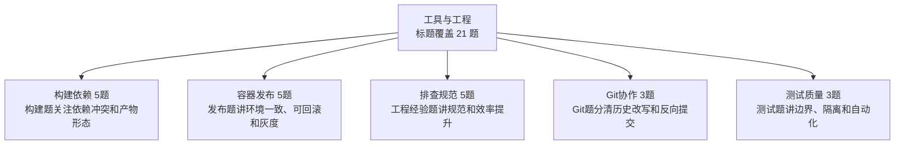

| 知识簇 | 覆盖题数 | 图中速记 | 代表标题 |
|---|---:|---|---|
| 构建依赖 | 5 | 构建题关注依赖冲突和产物形态 | [为啥我觉得应该谨慎使用Lombok](19_工具与工程/0466_为啥我觉得应该谨慎使用Lombok.md) / [jar包和war包有什么区别](19_工具与工程/0574_jar包和war包有什么区别.md) / [什么是fat jar](19_工具与工程/0575_什么是fat_jar.md) / [Maven如何解决jar包冲突的问题](19_工具与工程/0605_Maven如何解决jar包冲突的问题.md) / [Maven能解决什么问题为什么要用](19_工具与工程/0619_Maven能解决什么问题为什么要用.md) |
| 容器发布 | 5 | 发布题讲环境一致、可回滚和灰度 | [什么是 Docker Compose](19_工具与工程/0821_什么是_Docker_Compose.md) / [有了Docker为啥还需要k8s](19_工具与工程/0845_有了Docker为啥还需要k8s.md) / [为什么要使用Docker](19_工具与工程/0859_为什么要使用Docker.md) / [灰度发布 蓝绿部署 金丝雀部署都是什么](19_工具与工程/0942_灰度发布_蓝绿部署_金丝雀部署都是什么.md) / [什么是DevOps](19_工具与工程/0965_什么是DevOps.md) |
| 排查规范 | 5 | 工程经验题讲规范和效率提升 | [你作为项目组长 有制定过哪些规范吗](19_工具与工程/0113_你作为项目组长_有制定过哪些规范吗.md) / [你平常是怎么查看日志和做分析的](19_工具与工程/0491_你平常是怎么查看日志和做分析的.md) / [你掌握哪些Linux常用命令](19_工具与工程/0492_你掌握哪些Linux常用命令.md) / [你平常用哪些idea插件](19_工具与工程/0533_你平常用哪些idea插件.md) / [IDEA如何做远程Debug](19_工具与工程/0548_IDEA如何做远程Debug.md) |
| Git协作 | 3 | Git题分清历史改写和反向提交 | [Git的merge和rebase有什么区别](19_工具与工程/0563_Git的merge和rebase有什么区别.md) / [Git如何回滚代码reset和revert什么区别](19_工具与工程/0592_Git如何回滚代码reset和revert什么区别.md) / [Git和SVN有什么区别](19_工具与工程/0593_Git和SVN有什么区别.md) |
| 测试质量 | 3 | 测试题讲边界、隔离和自动化 | [你平时是怎么做单元测试的](19_工具与工程/0547_你平时是怎么做单元测试的.md) / [如何对JDBC这一层做单元测试](19_工具与工程/0573_如何对JDBC这一层做单元测试.md) / [什么是单元测试 和集成测试有什么区别](19_工具与工程/0591_什么是单元测试_和集成测试有什么区别.md) |

<details>
<summary>构建依赖 全量题目 5 题</summary>

- [为啥我觉得应该谨慎使用Lombok](19_工具与工程/0466_为啥我觉得应该谨慎使用Lombok.md)
- [jar包和war包有什么区别](19_工具与工程/0574_jar包和war包有什么区别.md)
- [什么是fat jar](19_工具与工程/0575_什么是fat_jar.md)
- [Maven如何解决jar包冲突的问题](19_工具与工程/0605_Maven如何解决jar包冲突的问题.md)
- [Maven能解决什么问题为什么要用](19_工具与工程/0619_Maven能解决什么问题为什么要用.md)

</details>

<details>
<summary>容器发布 全量题目 5 题</summary>

- [什么是 Docker Compose](19_工具与工程/0821_什么是_Docker_Compose.md)
- [有了Docker为啥还需要k8s](19_工具与工程/0845_有了Docker为啥还需要k8s.md)
- [为什么要使用Docker](19_工具与工程/0859_为什么要使用Docker.md)
- [灰度发布 蓝绿部署 金丝雀部署都是什么](19_工具与工程/0942_灰度发布_蓝绿部署_金丝雀部署都是什么.md)
- [什么是DevOps](19_工具与工程/0965_什么是DevOps.md)

</details>

<details>
<summary>排查规范 全量题目 5 题</summary>

- [你作为项目组长 有制定过哪些规范吗](19_工具与工程/0113_你作为项目组长_有制定过哪些规范吗.md)
- [你平常是怎么查看日志和做分析的](19_工具与工程/0491_你平常是怎么查看日志和做分析的.md)
- [你掌握哪些Linux常用命令](19_工具与工程/0492_你掌握哪些Linux常用命令.md)
- [你平常用哪些idea插件](19_工具与工程/0533_你平常用哪些idea插件.md)
- [IDEA如何做远程Debug](19_工具与工程/0548_IDEA如何做远程Debug.md)

</details>

<details>
<summary>Git协作 全量题目 3 题</summary>

- [Git的merge和rebase有什么区别](19_工具与工程/0563_Git的merge和rebase有什么区别.md)
- [Git如何回滚代码reset和revert什么区别](19_工具与工程/0592_Git如何回滚代码reset和revert什么区别.md)
- [Git和SVN有什么区别](19_工具与工程/0593_Git和SVN有什么区别.md)

</details>

<details>
<summary>测试质量 全量题目 3 题</summary>

- [你平时是怎么做单元测试的](19_工具与工程/0547_你平时是怎么做单元测试的.md)
- [如何对JDBC这一层做单元测试](19_工具与工程/0573_如何对JDBC这一层做单元测试.md)
- [什么是单元测试 和集成测试有什么区别](19_工具与工程/0591_什么是单元测试_和集成测试有什么区别.md)

</details>

## 20_任务调度

入口：[20_任务调度/README.md](20_任务调度/README.md)

```mermaid
flowchart TD
    A["任务调度<br/>标题覆盖 11 题"]
    A --> N0["调度框架 4题<br/>框架对比看分布式、分片、日志、重试"]
    A --> N1["扫表安全 4题<br/>扫表用游标和状态，避免offset跳页"]
    A --> N2["集群并发 1题<br/>集群任务要防重复执行"]
    A --> N3["异步改造 1题<br/>异步化减轻连接池和主流程压力"]
    A --> N4["时间模型 1题<br/>时间轮适合大量延迟任务"]
```

| 知识簇 | 覆盖题数 | 图中速记 | 代表标题 |
|---|---:|---|---|
| 调度框架 | 4 | 框架对比看分布式、分片、日志、重试 | [XXL-JOB相比Spring中的@Scheduled有啥优势](20_任务调度/0029_XXL-JOB相比Spring中的@Scheduled有啥优势.md) / [知道PowerJob吗 他和XXL-JOB有啥区别](20_任务调度/0330_知道PowerJob吗_他和XXL-JOB有啥区别.md) / [xxl-job如何保证一任务只会触发一次](20_任务调度/0621_xxl-job如何保证一任务只会触发一次.md) / [知道Spring Task吗 和XXL-JOB有啥区别](20_任务调度/1201_知道Spring_Task吗_和XXL-JOB有啥区别.md) |
| 扫表安全 | 4 | 扫表用游标和状态，避免offset跳页 | [扫表任务 如何写SQL可以避免出现跳页的情况](20_任务调度/0264_扫表任务_如何写SQL可以避免出现跳页的情况.md) / [定时任务扫表的方案有什么缺点](20_任务调度/0550_定时任务扫表的方案有什么缺点.md) / [数据库扫表任务如何避免出现死循环](20_任务调度/1077_数据库扫表任务如何避免出现死循环.md) / [定时任务扫表的缺点有什么](20_任务调度/1141_定时任务扫表的缺点有什么.md) |
| 集群并发 | 1 | 集群任务要防重复执行 | [用@Scheduled执行定时任务 如何避免集群的并发问题](20_任务调度/0685_用@Scheduled执行定时任务_如何避免集群的并发问题.md) |
| 异步改造 | 1 | 异步化减轻连接池和主流程压力 | [基于Spring Event 实现同步转异步 解决定时任务扫表导致数据库连接池不够的问题](20_任务调度/0667_基于Spring_Event_实现同步转异步_解决定时任务扫表导致数据库连接池不够的问题.md) |
| 时间模型 | 1 | 时间轮适合大量延迟任务 | [什么是时间轮](20_任务调度/0576_什么是时间轮.md) |

<details>
<summary>调度框架 全量题目 4 题</summary>

- [XXL-JOB相比Spring中的@Scheduled有啥优势](20_任务调度/0029_XXL-JOB相比Spring中的@Scheduled有啥优势.md)
- [知道PowerJob吗 他和XXL-JOB有啥区别](20_任务调度/0330_知道PowerJob吗_他和XXL-JOB有啥区别.md)
- [xxl-job如何保证一任务只会触发一次](20_任务调度/0621_xxl-job如何保证一任务只会触发一次.md)
- [知道Spring Task吗 和XXL-JOB有啥区别](20_任务调度/1201_知道Spring_Task吗_和XXL-JOB有啥区别.md)

</details>

<details>
<summary>扫表安全 全量题目 4 题</summary>

- [扫表任务 如何写SQL可以避免出现跳页的情况](20_任务调度/0264_扫表任务_如何写SQL可以避免出现跳页的情况.md)
- [定时任务扫表的方案有什么缺点](20_任务调度/0550_定时任务扫表的方案有什么缺点.md)
- [数据库扫表任务如何避免出现死循环](20_任务调度/1077_数据库扫表任务如何避免出现死循环.md)
- [定时任务扫表的缺点有什么](20_任务调度/1141_定时任务扫表的缺点有什么.md)

</details>

<details>
<summary>集群并发 全量题目 1 题</summary>

- [用@Scheduled执行定时任务 如何避免集群的并发问题](20_任务调度/0685_用@Scheduled执行定时任务_如何避免集群的并发问题.md)

</details>

<details>
<summary>异步改造 全量题目 1 题</summary>

- [基于Spring Event 实现同步转异步 解决定时任务扫表导致数据库连接池不够的问题](20_任务调度/0667_基于Spring_Event_实现同步转异步_解决定时任务扫表导致数据库连接池不够的问题.md)

</details>

<details>
<summary>时间模型 全量题目 1 题</summary>

- [什么是时间轮](20_任务调度/0576_什么是时间轮.md)

</details>

## 21_Excel与文件处理

入口：[21_Excel与文件处理/README.md](21_Excel与文件处理/README.md)

```mermaid
flowchart TD
    A["Excel与文件处理<br/>标题覆盖 6 题"]
    A --> N0["内存治理 4题<br/>POI容易OOM，SXSSF降低内存"]
    A --> N1["读取 1题<br/>读取要流式和分批"]
    A --> N2["写入导出 1题<br/>写入要流式、临时文件和分片"]
```

| 知识簇 | 覆盖题数 | 图中速记 | 代表标题 |
|---|---:|---|---|
| 内存治理 | 4 | POI容易OOM，SXSSF降低内存 | [EasyExcel为啥内存占用小](21_Excel与文件处理/0250_EasyExcel为啥内存占用小.md) / [为啥POI的SXSSFWorkbook占用内存更小](21_Excel与文件处理/0509_为啥POI的SXSSFWorkbook占用内存更小.md) / [什么是POI 为什么它会导致内存溢出](21_Excel与文件处理/0535_什么是POI_为什么它会导致内存溢出.md) / [基于EasyExcel+线程池解决POI文件导出时的内存溢出及超时问题](21_Excel与文件处理/1166_基于EasyExcel+线程池解决POI文件导出时的内存溢出及超时问题.md) |
| 读取 | 1 | 读取要流式和分批 | [如何针对大Excel做文件读取](21_Excel与文件处理/0251_如何针对大Excel做文件读取.md) |
| 写入导出 | 1 | 写入要流式、临时文件和分片 | [POI的如何做大文件的写入](21_Excel与文件处理/0524_POI的如何做大文件的写入.md) |

<details>
<summary>内存治理 全量题目 4 题</summary>

- [EasyExcel为啥内存占用小](21_Excel与文件处理/0250_EasyExcel为啥内存占用小.md)
- [为啥POI的SXSSFWorkbook占用内存更小](21_Excel与文件处理/0509_为啥POI的SXSSFWorkbook占用内存更小.md)
- [什么是POI 为什么它会导致内存溢出](21_Excel与文件处理/0535_什么是POI_为什么它会导致内存溢出.md)
- [基于EasyExcel+线程池解决POI文件导出时的内存溢出及超时问题](21_Excel与文件处理/1166_基于EasyExcel+线程池解决POI文件导出时的内存溢出及超时问题.md)

</details>

<details>
<summary>读取 全量题目 1 题</summary>

- [如何针对大Excel做文件读取](21_Excel与文件处理/0251_如何针对大Excel做文件读取.md)

</details>

<details>
<summary>写入导出 全量题目 1 题</summary>

- [POI的如何做大文件的写入](21_Excel与文件处理/0524_POI的如何做大文件的写入.md)

</details>

## 22_面经与项目分享

入口：[22_面经与项目分享/README.md](22_面经与项目分享/README.md)

```mermaid
flowchart TD
    A["面经与项目分享<br/>标题覆盖 61 题"]
    A --> N0["简历面试 22题<br/>面经用于反推表达和追问准备"]
    A --> N1["工作经验 18题<br/>社招重项目深度和业务结果"]
    A --> N2["应届校招 9题<br/>应届重基础、项目潜力和学习能力"]
    A --> N3["中间件专题 5题<br/>面经高频围绕数据一致性和高并发"]
    A --> N4["其他高频标题 4题<br/>标题暂未命中特定簇，复习时按题目回到原文细看"]
```

| 知识簇 | 覆盖题数 | 图中速记 | 代表标题 |
|---|---:|---|---|
| 简历面试 | 22 | 面经用于反推表达和追问准备 | [26届 百度一面&二面 美团一面](22_面经与项目分享/0189_26届_百度一面&二面_美团一面.md) / [大厂程序员能力模型](22_面经与项目分享/0367_大厂程序员能力模型.md) / [拼多多二面](22_面经与项目分享/0387_拼多多二面.md) / [拼多多一面](22_面经与项目分享/0388_拼多多一面.md) / [滴滴一面](22_面经与项目分享/0398_滴滴一面.md) / [滴滴二面](22_面经与项目分享/0399_滴滴二面.md) |
| 工作经验 | 18 | 社招重项目深度和业务结果 | [1年经验 数字藏品&电商项目](22_面经与项目分享/0062_1年经验_数字藏品&电商项目.md) / [6年经验 电商平台 分布式事务 分布式](22_面经与项目分享/0105_6年经验_电商平台_分布式事务_分布式.md) / [4年经验 上海某跨境电商 千万级大表经验](22_面经与项目分享/0310_4年经验_上海某跨境电商_千万级大表经验.md) / [2本 9年经验 6-7年服务端 停车管理系统](22_面经与项目分享/0339_2本_9年经验_6-7年服务端_停车管理系统.md) / [工作1年 大数据开发平台 seata贡献者](22_面经与项目分享/0340_工作1年_大数据开发平台_seata贡献者.md) / [工作3年 分布式项目 实时数据分析功能](22_面经与项目分享/0357_工作3年_分布式项目_实时数据分析功能.md) |
| 应届校招 | 9 | 应届重基础、项目潜力和学习能力 | [24届 LLM应用开发 SpringAI](22_面经与项目分享/0020_24届_LLM应用开发_SpringAI.md) / [27届 数藏项目 交易链路开发 秒杀](22_面经与项目分享/0098_27届_数藏项目_交易链路开发_秒杀.md) / [26届 阿里后端2面](22_面经与项目分享/0146_26届_阿里后端2面.md) / [26届 双一流硕士 2段大厂实习](22_面经与项目分享/0190_26届_双一流硕士_2段大厂实习.md) / [3年经验 985本科 电商财务相关业务](22_面经与项目分享/0193_3年经验_985本科_电商财务相关业务.md) / [24届 美团1-3面面经](22_面经与项目分享/0366_24届_美团1-3面面经.md) |
| 中间件专题 | 5 | 面经高频围绕数据一致性和高并发 | [3年经验 2本 物流调度系统 mq mysql](22_面经与项目分享/0208_3年经验_2本_物流调度系统_mq_mysql.md) / [2年985硕 直播业务 redis kafka](22_面经与项目分享/0341_2年985硕_直播业务_redis_kafka.md) / [工作8年 游戏中厂 Redis 分布式](22_面经与项目分享/0410_工作8年_游戏中厂_Redis_分布式.md) / [23年毕业 电商运营平台 mysql mq redis](22_面经与项目分享/0475_23年毕业_电商运营平台_mysql_mq_redis.md) / [3年经验 智慧园区 mysql Redis](22_面经与项目分享/0476_3年经验_智慧园区_mysql_Redis.md) |
| 其他高频标题 | 4 | 标题暂未命中特定簇，复习时按题目回到原文细看 | [大模型应用开发 RAG客服](22_面经与项目分享/0085_大模型应用开发_RAG客服.md) / [你的项目有哪些难点&亮点](22_面经与项目分享/0327_你的项目有哪些难点&亮点.md) / [菜鸟1-3面](22_面经与项目分享/0464_菜鸟1-3面.md) / [白龙马科技2面](22_面经与项目分享/0487_白龙马科技2面.md) |
| 业务项目 | 3 | 项目表达围绕业务链路和技术难点 | [27届 数藏项目 订单 交易 用户模块](22_面经与项目分享/0024_27届_数藏项目_订单_交易_用户模块.md) / [交易主链路提供风控决策要求RT 5ms的技术方案](22_面经与项目分享/0465_交易主链路提供风控决策要求RT_5ms的技术方案.md) / [字节支付1-2-3-hr面](22_面经与项目分享/0489_字节支付1-2-3-hr面.md) |

<details>
<summary>简历面试 全量题目 22 题</summary>

- [26届 百度一面&二面 美团一面](22_面经与项目分享/0189_26届_百度一面&二面_美团一面.md)
- [大厂程序员能力模型](22_面经与项目分享/0367_大厂程序员能力模型.md)
- [拼多多二面](22_面经与项目分享/0387_拼多多二面.md)
- [拼多多一面](22_面经与项目分享/0388_拼多多一面.md)
- [滴滴一面](22_面经与项目分享/0398_滴滴一面.md)
- [滴滴二面](22_面经与项目分享/0399_滴滴二面.md)
- [百度一面](22_面经与项目分享/0409_百度一面.md)
- [百度二面](22_面经与项目分享/0424_百度二面.md)
- [阿里一面](22_面经与项目分享/0425_阿里一面.md)
- [PDD海外用增二面](22_面经与项目分享/0436_PDD海外用增二面.md)
- [阿里二面](22_面经与项目分享/0437_阿里二面.md)
- [PDD海外用增一面](22_面经与项目分享/0448_PDD海外用增一面.md)
- [顺丰一面](22_面经与项目分享/0449_顺丰一面.md)
- [平安一面](22_面经与项目分享/0450_平安一面.md)
- [简历自查](22_面经与项目分享/0459_简历自查.md)
- [白龙马科技一面](22_面经与项目分享/0462_白龙马科技一面.md)
- [阿里本地生活一面](22_面经与项目分享/0463_阿里本地生活一面.md)
- [简历指导](22_面经与项目分享/0473_简历指导.md)
- [猿辅导一面](22_面经与项目分享/0488_猿辅导一面.md)
- [腾讯面试流程](22_面经与项目分享/0989_腾讯面试流程.md)
- [阿里巴巴面试流程](22_面经与项目分享/1004_阿里巴巴面试流程.md)
- [字节跳动面试流程](22_面经与项目分享/1005_字节跳动面试流程.md)

</details>

<details>
<summary>工作经验 全量题目 18 题</summary>

- [1年经验 数字藏品&电商项目](22_面经与项目分享/0062_1年经验_数字藏品&电商项目.md)
- [6年经验 电商平台 分布式事务 分布式](22_面经与项目分享/0105_6年经验_电商平台_分布式事务_分布式.md)
- [4年经验 上海某跨境电商 千万级大表经验](22_面经与项目分享/0310_4年经验_上海某跨境电商_千万级大表经验.md)
- [2本 9年经验 6-7年服务端 停车管理系统](22_面经与项目分享/0339_2本_9年经验_6-7年服务端_停车管理系统.md)
- [工作1年 大数据开发平台 seata贡献者](22_面经与项目分享/0340_工作1年_大数据开发平台_seata贡献者.md)
- [工作3年 分布式项目 实时数据分析功能](22_面经与项目分享/0357_工作3年_分布式项目_实时数据分析功能.md)
- [5年经验 流计算引擎 配置中心 流程编排 RPA](22_面经与项目分享/0360_5年经验_流计算引擎_配置中心_流程编排_RPA.md)
- [22年毕业 培训了2个月Java 多线程 Spring](22_面经与项目分享/0361_22年毕业_培训了2个月Java_多线程_Spring.md)
- [工作7年 2家大厂经验 下单&导购核心开发](22_面经与项目分享/0371_工作7年_2家大厂经验_下单&导购核心开发.md)
- [工作6年 211本 2手平台 卖家业务 结算](22_面经与项目分享/0389_工作6年_211本_2手平台_卖家业务_结算.md)
- [工作3年 城市停车项目 保险理赔 财&人身 &电服业务](22_面经与项目分享/0400_工作3年_城市停车项目_保险理赔_财&人身_&电服业务.md)
- [工作4年 供应链相关 分库分表 分布式锁](22_面经与项目分享/0435_工作4年_供应链相关_分库分表_分布式锁.md)
- [6年经验 资产后台 汽车金融 贷款 SaaS](22_面经与项目分享/0438_6年经验_资产后台_汽车金融_贷款_SaaS.md)
- [工作5年 主要做计费项目](22_面经与项目分享/0500_工作5年_主要做计费项目.md)
- [工作4年 自研流程引擎项目](22_面经与项目分享/0515_工作4年_自研流程引擎项目.md)
- [工作7年 SaaS公司 架构师 技术负责人](22_面经与项目分享/0516_工作7年_SaaS公司_架构师_技术负责人.md)
- [工作2年 电商网站开发 负责购物车 详情页](22_面经与项目分享/0528_工作2年_电商网站开发_负责购物车_详情页.md)
- [7年后端技术专家 清结算 资损防控 架构设计](22_面经与项目分享/0540_7年后端技术专家_清结算_资损防控_架构设计.md)

</details>

<details>
<summary>应届校招 全量题目 9 题</summary>

- [24届 LLM应用开发 SpringAI](22_面经与项目分享/0020_24届_LLM应用开发_SpringAI.md)
- [27届 数藏项目 交易链路开发 秒杀](22_面经与项目分享/0098_27届_数藏项目_交易链路开发_秒杀.md)
- [26届 阿里后端2面](22_面经与项目分享/0146_26届_阿里后端2面.md)
- [26届 双一流硕士 2段大厂实习](22_面经与项目分享/0190_26届_双一流硕士_2段大厂实习.md)
- [3年经验 985本科 电商财务相关业务](22_面经与项目分享/0193_3年经验_985本科_电商财务相关业务.md)
- [24届 美团1-3面面经](22_面经与项目分享/0366_24届_美团1-3面面经.md)
- [最强应届生 JVM 计算机网络](22_面经与项目分享/0378_最强应届生_JVM_计算机网络.md)
- [26届 985 12306项目 redis 多线程](22_面经与项目分享/0416_26届_985_12306项目_redis_多线程.md)
- [985应届生 并发编程底层原理](22_面经与项目分享/0539_985应届生_并发编程底层原理.md)

</details>

<details>
<summary>中间件专题 全量题目 5 题</summary>

- [3年经验 2本 物流调度系统 mq mysql](22_面经与项目分享/0208_3年经验_2本_物流调度系统_mq_mysql.md)
- [2年985硕 直播业务 redis kafka](22_面经与项目分享/0341_2年985硕_直播业务_redis_kafka.md)
- [工作8年 游戏中厂 Redis 分布式](22_面经与项目分享/0410_工作8年_游戏中厂_Redis_分布式.md)
- [23年毕业 电商运营平台 mysql mq redis](22_面经与项目分享/0475_23年毕业_电商运营平台_mysql_mq_redis.md)
- [3年经验 智慧园区 mysql Redis](22_面经与项目分享/0476_3年经验_智慧园区_mysql_Redis.md)

</details>

<details>
<summary>其他高频标题 全量题目 4 题</summary>

- [大模型应用开发 RAG客服](22_面经与项目分享/0085_大模型应用开发_RAG客服.md)
- [你的项目有哪些难点&亮点](22_面经与项目分享/0327_你的项目有哪些难点&亮点.md)
- [菜鸟1-3面](22_面经与项目分享/0464_菜鸟1-3面.md)
- [白龙马科技2面](22_面经与项目分享/0487_白龙马科技2面.md)

</details>

<details>
<summary>业务项目 全量题目 3 题</summary>

- [27届 数藏项目 订单 交易 用户模块](22_面经与项目分享/0024_27届_数藏项目_订单_交易_用户模块.md)
- [交易主链路提供风控决策要求RT 5ms的技术方案](22_面经与项目分享/0465_交易主链路提供风控决策要求RT_5ms的技术方案.md)
- [字节支付1-2-3-hr面](22_面经与项目分享/0489_字节支付1-2-3-hr面.md)

</details>

## 23_软技能与面试准备

入口：[23_软技能与面试准备/README.md](23_软技能与面试准备/README.md)

```mermaid
flowchart TD
    A["软技能与面试准备<br/>标题覆盖 13 题"]
    A --> N0["自我表达 4题<br/>回答真实具体，避免模板话"]
    A --> N1["面试准备 3题<br/>准备题要结构化输出，不临场拼"]
    A --> N2["团队协作 2题<br/>协作题讲事实、沟通和推进"]
    A --> N3["职业选择 2题<br/>边界清晰，表达稳定性和成长性"]
    A --> N4["输入沉淀 2题<br/>学习题讲输入、实践和沉淀"]
```

| 知识簇 | 覆盖题数 | 图中速记 | 代表标题 |
|---|---:|---|---|
| 自我表达 | 4 | 回答真实具体，避免模板话 | [能不能说一下你对自己的评价](23_软技能与面试准备/0938_能不能说一下你对自己的评价.md) / [最有成就感的项目或工作经历](23_软技能与面试准备/0972_最有成就感的项目或工作经历.md) / [对自己的未来发展有什么想法和计划](23_软技能与面试准备/0985_对自己的未来发展有什么想法和计划.md) / [你觉得你有什么缺点](23_软技能与面试准备/1016_你觉得你有什么缺点.md) |
| 面试准备 | 3 | 准备题要结构化输出，不临场拼 | [项目介绍如何准备](23_软技能与面试准备/0485_项目介绍如何准备.md) / [面试前必须要准备哪些内容](23_软技能与面试准备/0486_面试前必须要准备哪些内容.md) / [你还有什么想要反问我的吗](23_软技能与面试准备/1000_你还有什么想要反问我的吗.md) |
| 团队协作 | 2 | 协作题讲事实、沟通和推进 | [CodeReview都会关注哪些问题](23_软技能与面试准备/0468_CodeReview都会关注哪些问题.md) / [如何在团队合作中解决冲突和达成共识](23_软技能与面试准备/0973_如何在团队合作中解决冲突和达成共识.md) |
| 职业选择 | 2 | 边界清晰，表达稳定性和成长性 | [大厂对学历的要求是什么](23_软技能与面试准备/0501_大厂对学历的要求是什么.md) / [你对加班怎么看待](23_软技能与面试准备/0951_你对加班怎么看待.md) |
| 输入沉淀 | 2 | 学习题讲输入、实践和沉淀 | [你最近在学什么新技术吗](23_软技能与面试准备/0986_你最近在学什么新技术吗.md) / [你最近在看什么书](23_软技能与面试准备/1015_你最近在看什么书.md) |

<details>
<summary>自我表达 全量题目 4 题</summary>

- [能不能说一下你对自己的评价](23_软技能与面试准备/0938_能不能说一下你对自己的评价.md)
- [最有成就感的项目或工作经历](23_软技能与面试准备/0972_最有成就感的项目或工作经历.md)
- [对自己的未来发展有什么想法和计划](23_软技能与面试准备/0985_对自己的未来发展有什么想法和计划.md)
- [你觉得你有什么缺点](23_软技能与面试准备/1016_你觉得你有什么缺点.md)

</details>

<details>
<summary>面试准备 全量题目 3 题</summary>

- [项目介绍如何准备](23_软技能与面试准备/0485_项目介绍如何准备.md)
- [面试前必须要准备哪些内容](23_软技能与面试准备/0486_面试前必须要准备哪些内容.md)
- [你还有什么想要反问我的吗](23_软技能与面试准备/1000_你还有什么想要反问我的吗.md)

</details>

<details>
<summary>团队协作 全量题目 2 题</summary>

- [CodeReview都会关注哪些问题](23_软技能与面试准备/0468_CodeReview都会关注哪些问题.md)
- [如何在团队合作中解决冲突和达成共识](23_软技能与面试准备/0973_如何在团队合作中解决冲突和达成共识.md)

</details>

<details>
<summary>职业选择 全量题目 2 题</summary>

- [大厂对学历的要求是什么](23_软技能与面试准备/0501_大厂对学历的要求是什么.md)
- [你对加班怎么看待](23_软技能与面试准备/0951_你对加班怎么看待.md)

</details>

<details>
<summary>输入沉淀 全量题目 2 题</summary>

- [你最近在学什么新技术吗](23_软技能与面试准备/0986_你最近在学什么新技术吗.md)
- [你最近在看什么书](23_软技能与面试准备/1015_你最近在看什么书.md)

</details>
