# Java 八股手机速记知识图谱

> 面向手机阅读：每张图尽量纵向展开，节点少而密，直接在图里放核心速记点。  
> 使用方式：先看图，再看每节下方一句“回忆钩子”，最后回到对应目录刷题。

## 全局速记主线

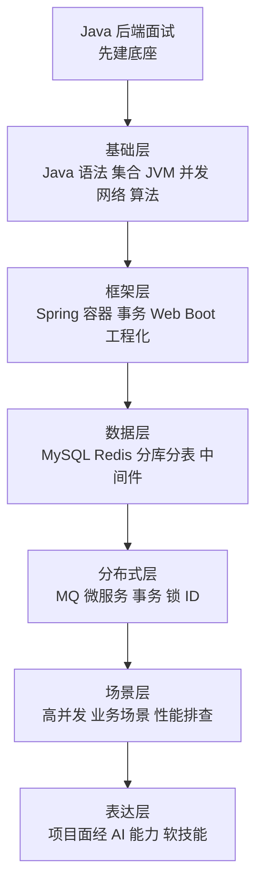

## 高频联想链路

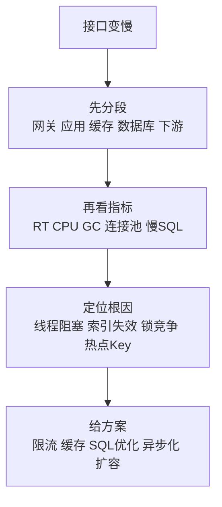

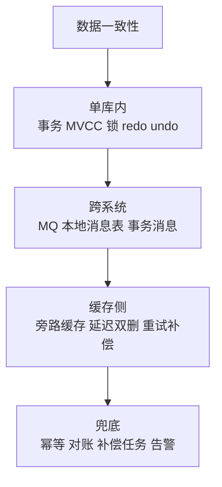

## 01 Java基础

入口：[01_Java基础/README.md](01_Java基础/README.md)

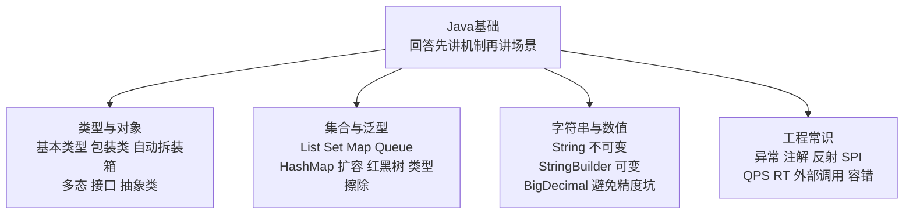

回忆钩子：Java 基础题要从“语言机制如何影响业务代码”回答，而不是只背 API。

## 02 JVM

入口：[02_JVM/README.md](02_JVM/README.md)

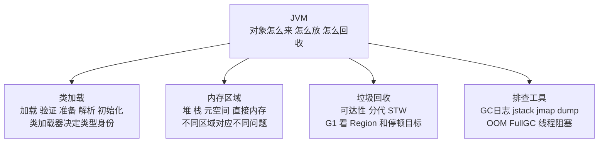

回忆钩子：JVM 题最终都能落到类加载、内存区域、GC、工具四件事。

## 03 并发编程

入口：[03_并发编程/README.md](03_并发编程/README.md)

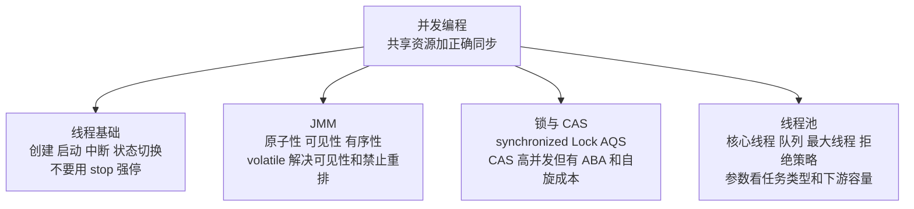

回忆钩子：并发题先问“谁共享、谁修改、如何保证正确、代价是什么”。

## 04 Spring体系

入口：[04_Spring体系/README.md](04_Spring体系/README.md)

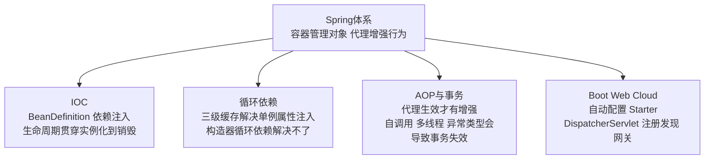

回忆钩子：Spring 的很多坑，本质都是 Bean 生命周期和代理边界。

## 05 MySQL

入口：[05_MySQL/README.md](05_MySQL/README.md)

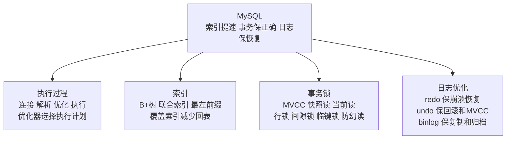

回忆钩子：MySQL 回答优先三件事：索引怎么查、事务怎么隔离、日志怎么恢复。

## 06 Redis

入口：[06_Redis/README.md](06_Redis/README.md)

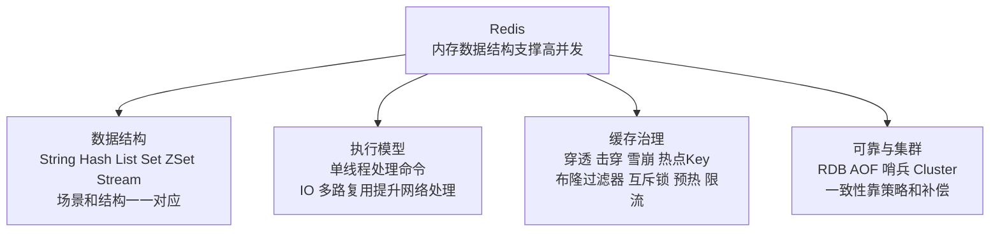

回忆钩子：Redis 题要把数据结构、线程模型、缓存问题、高可用串起来。

## 07 消息队列

入口：[07_消息队列/README.md](07_消息队列/README.md)

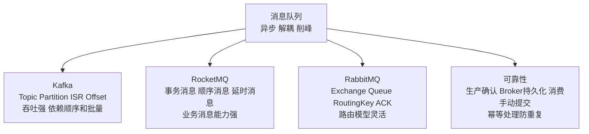

回忆钩子：MQ 题按生产者、Broker、消费者三端讲，不丢、不重、不乱序。

## 08 微服务与分布式

入口：[08_微服务与分布式/README.md](08_微服务与分布式/README.md)

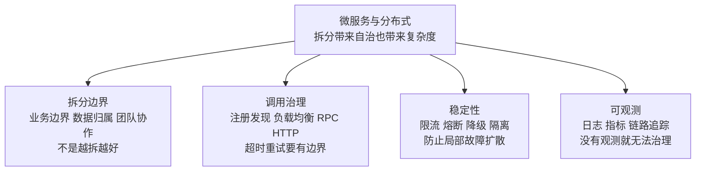

回忆钩子：微服务回答要承认代价，再讲治理手段，可信度更高。

## 09 分布式事务

入口：[09_分布式事务/README.md](09_分布式事务/README.md)

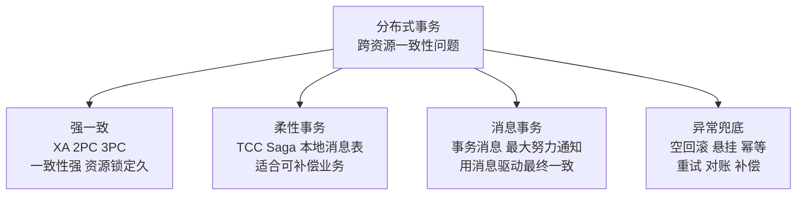

回忆钩子：先判断业务要强一致还是最终一致，再选方案。

## 10 分布式锁与ID

入口：[10_分布式锁与ID/README.md](10_分布式锁与ID/README.md)

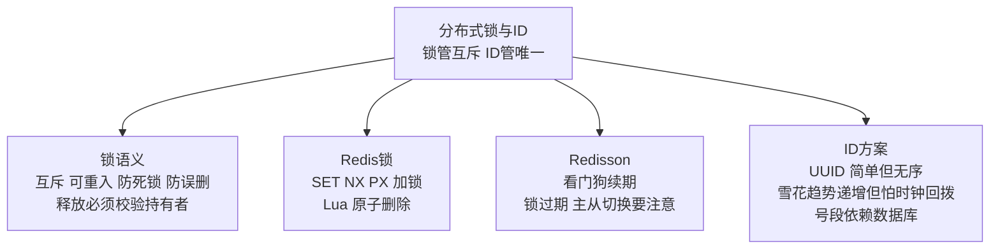

回忆钩子：锁题讲安全释放和过期风险，ID 题讲唯一性、趋势性、时钟和容量。

## 11 分库分表

入口：[11_分库分表/README.md](11_分库分表/README.md)

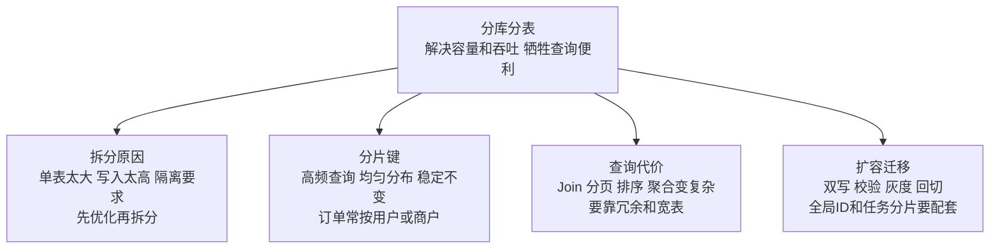

回忆钩子：分库分表题要主动说副作用，这比只说优点更像真实项目经验。

## 12 其他中间件

入口：[12_其他中间件/README.md](12_其他中间件/README.md)

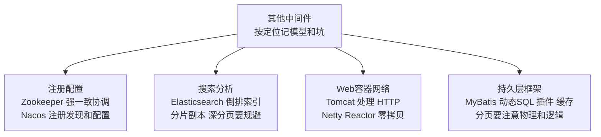

回忆钩子：中间件先说解决什么问题，再说核心模型，最后说常见坑。

## 13 网络与操作系统

入口：[13_网络与操作系统/README.md](13_网络与操作系统/README.md)

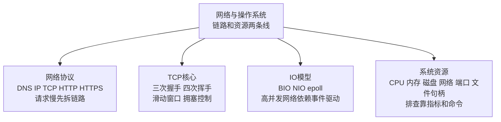

回忆钩子：网络问题看链路，系统问题看资源，别一上来猜代码。

## 14 系统设计与高并发

入口：[14_系统设计与高并发/README.md](14_系统设计与高并发/README.md)

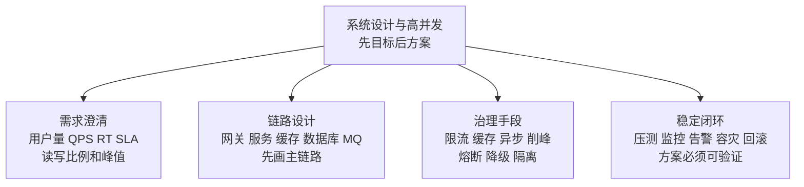

回忆钩子：系统设计题不是技术堆砌，是目标、链路、瓶颈、风险的完整闭环。

## 15 业务场景题

入口：[15_业务场景题/README.md](15_业务场景题/README.md)

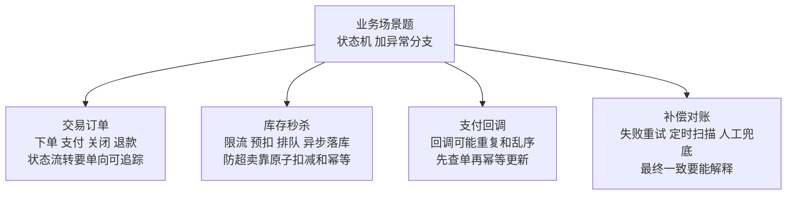

回忆钩子：业务题要说正常链路、异常链路、补偿链路。

## 16 性能调优与故障排查

入口：[16_性能调优与故障排查/README.md](16_性能调优与故障排查/README.md)

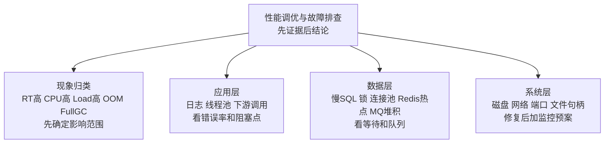

回忆钩子：排查类回答固定句式：现象、指标、定位、根因、修复、预防。

## 17 数据结构与算法

入口：[17_数据结构与算法/README.md](17_数据结构与算法/README.md)

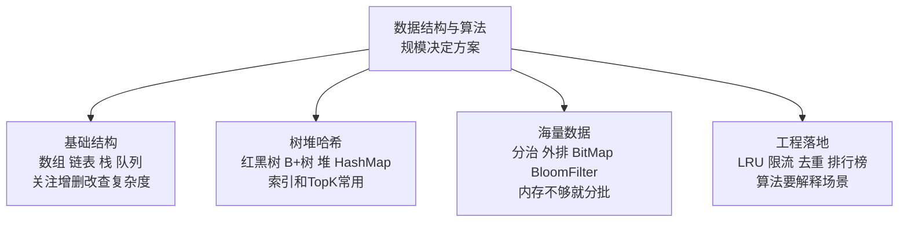

回忆钩子：算法回答先说数据量和内存，再说结构和复杂度。

## 18 AI与大模型

入口：[18_AI与大模型/README.md](18_AI与大模型/README.md)

```mermaid
flowchart TD
    A["AI与大模型<br/>模型只是链路一环"]
    A --> B["模型调用<br/>模型选择 参数 流式输出<br/>关注成本 延迟 稳定性"]
    A --> C["上下文工程<br/>Prompt Context Harness<br/>让模型拿到正确材料"]
    A --> D["RAG<br/>切分 向量 检索 重排<br/>解决知识实时性和私域知识"]
    A --> E["Agent工具<br/>Function Calling MCP Skill<br/>工具调用要可控可观测"]
```

回忆钩子：AI 工程题要说数据、上下文、工具、评测，不只说 Prompt。

## 19 工具与工程

入口：[19_工具与工程/README.md](19_工具与工程/README.md)

```mermaid
flowchart TD
    A["工具与工程<br/>提升交付确定性"]
    A --> B["构建依赖<br/>Maven 依赖冲突 jar war<br/>版本收敛很关键"]
    A --> C["版本协作<br/>Git merge rebase reset revert<br/>回滚策略要分清"]
    A --> D["测试质量<br/>单元测试 集成测试 Mock<br/>覆盖核心分支"]
    A --> E["发布运维<br/>Docker K8s 灰度 蓝绿 金丝雀<br/>可回滚可观测"]
```

回忆钩子：工程化题的关键词是规范、自动化、可回滚、可追踪。

## 20 任务调度

入口：[20_任务调度/README.md](20_任务调度/README.md)

```mermaid
flowchart TD
    A["任务调度<br/>定时只是入口 可靠才是重点"]
    A --> B["单机定时<br/>Spring Task Scheduled<br/>简单但集群会重复执行"]
    A --> C["分布式调度<br/>XXL-JOB PowerJob<br/>支持分片 路由 重试 日志"]
    A --> D["扫表任务<br/>游标分页 避免跳页<br/>控制批量和连接占用"]
    A --> E["可靠性<br/>幂等 超时 重试 告警<br/>失败要能恢复"]
```

回忆钩子：调度题重点是集群并发、分片、幂等和失败恢复。

## 21 Excel与文件处理

入口：[21_Excel与文件处理/README.md](21_Excel与文件处理/README.md)

```mermaid
flowchart TD
    A["Excel与文件处理<br/>大文件就是内存和IO问题"]
    A --> B["读取<br/>分批 事件模型<br/>不要一次性加载全量"]
    A --> C["写入<br/>流式写 临时文件<br/>SXSSFWorkbook 和 EasyExcel"]
    A --> D["并发导出<br/>线程池 分片 限流<br/>避免压垮数据库和磁盘"]
    A --> E["稳定性<br/>超时 OOM 失败续传<br/>临时文件及时清理"]
```

回忆钩子：文件处理题要主动说内存控制和资源清理。

## 22 面经与项目分享

入口：[22_面经与项目分享/README.md](22_面经与项目分享/README.md)

```mermaid
flowchart TD
    A["面经与项目分享<br/>把技术变成项目价值"]
    A --> B["项目叙事<br/>背景 目标 方案 结果<br/>先讲业务问题"]
    A --> C["技术深挖<br/>MySQL Redis MQ JVM 并发<br/>准备可追问细节"]
    A --> D["亮点包装<br/>难点 取舍 指标 收益<br/>最好能量化"]
    A --> E["复盘迁移<br/>失败经验 风险预案<br/>体现成长和判断力"]
```

回忆钩子：项目表达不要像背八股，要像讲一次真实问题解决过程。

## 23 软技能与面试准备

入口：[23_软技能与面试准备/README.md](23_软技能与面试准备/README.md)

```mermaid
flowchart TD
    A["软技能与面试准备<br/>真实具体有边界"]
    A --> B["自我介绍<br/>经历主线 技术标签<br/>和岗位要求对齐"]
    A --> C["行为问题<br/>优缺点 冲突 压力 加班<br/>用事实支撑观点"]
    A --> D["协作能力<br/>Code Review 推进共识<br/>能解决问题也能合作"]
    A --> E["反问规划<br/>问业务 团队 技术 成长<br/>表达长期投入"]
```

回忆钩子：软技能最怕空泛，最好用具体项目细节证明。

## 手机复习顺序

```mermaid
flowchart TD
    A["每天 20 分钟"]
    A --> B["先刷一张模块图<br/>建立关键词"]
    B --> C["再打开目录 README<br/>挑 3 到 5 道题"]
    C --> D["用图中节点复述<br/>定义 机制 场景 风险"]
    D --> E["最后补一个组合题<br/>把模块串起来"]
```

## 组合题速记卡

| 组合题 | 快速回忆 |
|---|---|
| 秒杀系统 | 限流入口，Redis 预扣，MQ 排队，MySQL 落库，幂等补偿 |
| 慢接口 | 分段定位，先证据后结论，看应用、JVM、数据库、缓存和下游 |
| 缓存一致性 | 旁路缓存，先库后删，延迟重试，消息补偿，最终对账 |
| MQ 可靠性 | 生产确认，Broker 持久化，消费者手动提交，业务幂等 |
| 事务失效 | 代理边界，自调用，多线程，异常类型，传播机制 |
| 分库分表 | 分片键，路由，查询代价，扩容迁移，全局 ID |
| FullGC | GC 日志，dump，线程栈，对象增长，代码路径 |
| 微服务雪崩 | 超时，重试边界，熔断，降级，隔离，削峰 |
