# Java 八股速记版知识点全景图

> 基于当前 23 个一级类目整理。本文只做模块级速记导航，不改动任何题目正文。

## 使用方式

- 先看“全局知识版图”，建立 Java 后端面试的主干结构。
- 再按“跨模块关联图”理解知识点之间的依赖关系。
- 最后按类目进入局部图，配合各目录 README 和具体题目复习。

## 全局知识版图

```mermaid
graph TD
    CORE["Java 后端知识体系"] --> LANG["语言基础与数据结构"]
    CORE --> RUNTIME["运行时与并发"]
    CORE --> FRAMEWORK["框架与工程化"]
    CORE --> STORAGE["数据与缓存"]
    CORE --> DISTRIBUTED["分布式与高并发"]
    CORE --> OPS["排查调优与交付"]
    CORE --> INTERVIEW["项目表达与面试"]

    LANG --> JAVA["01 Java基础"]
    LANG --> ALGO["17 数据结构与算法"]

    RUNTIME --> JVM["02 JVM"]
    RUNTIME --> CONCURRENT["03 并发编程"]
    RUNTIME --> OS["13 网络与操作系统"]

    FRAMEWORK --> SPRING["04 Spring体系"]
    FRAMEWORK --> TOOL["19 工具与工程"]
    FRAMEWORK --> SCHEDULE["20 任务调度"]

    STORAGE --> MYSQL["05 MySQL"]
    STORAGE --> REDIS["06 Redis"]
    STORAGE --> FILE["21 Excel与文件处理"]

    DISTRIBUTED --> MQ["07 消息队列"]
    DISTRIBUTED --> MICRO["08 微服务与分布式"]
    DISTRIBUTED --> TX["09 分布式事务"]
    DISTRIBUTED --> LOCKID["10 分布式锁与ID"]
    DISTRIBUTED --> SHARDING["11 分库分表"]
    DISTRIBUTED --> MIDDLEWARE["12 其他中间件"]
    DISTRIBUTED --> DESIGN["14 系统设计与高并发"]
    DISTRIBUTED --> SCENE["15 业务场景题"]

    OPS --> PERF["16 性能调优与故障排查"]
    OPS --> TOOL

    INTERVIEW --> AI["18 AI与大模型"]
    INTERVIEW --> CASE["22 面经与项目分享"]
    INTERVIEW --> SOFT["23 软技能与面试准备"]

    classDef root fill:#f5f5f5,stroke:#222,stroke-width:2px,color:#111
    classDef group fill:#e8f3ff,stroke:#3b82f6,color:#111
    classDef module fill:#fff7ed,stroke:#f97316,color:#111
    class CORE root
    class LANG,RUNTIME,FRAMEWORK,STORAGE,DISTRIBUTED,OPS,INTERVIEW group
    class JAVA,ALGO,JVM,CONCURRENT,OS,SPRING,TOOL,SCHEDULE,MYSQL,REDIS,FILE,MQ,MICRO,TX,LOCKID,SHARDING,MIDDLEWARE,DESIGN,SCENE,PERF,AI,CASE,SOFT module
```

## 跨模块关联图

### 请求链路

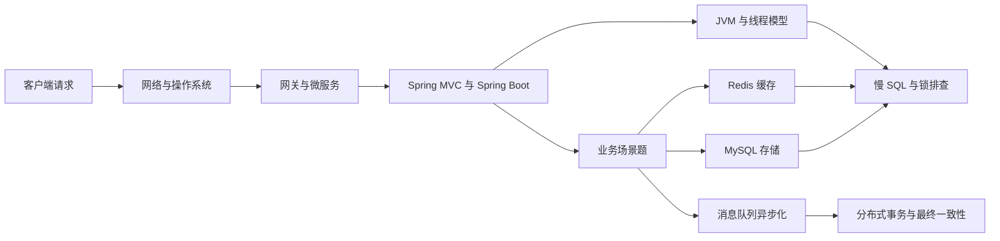

### 高并发治理链路

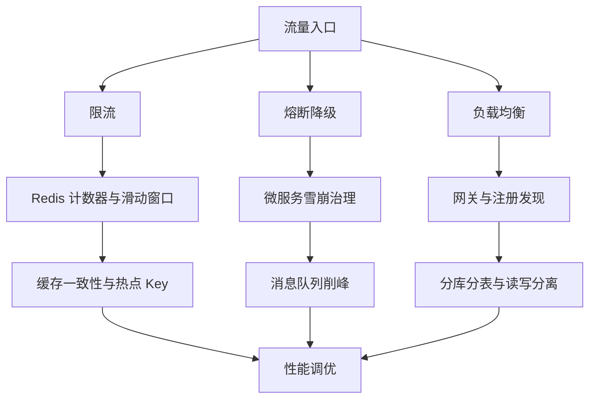

### 数据一致性链路

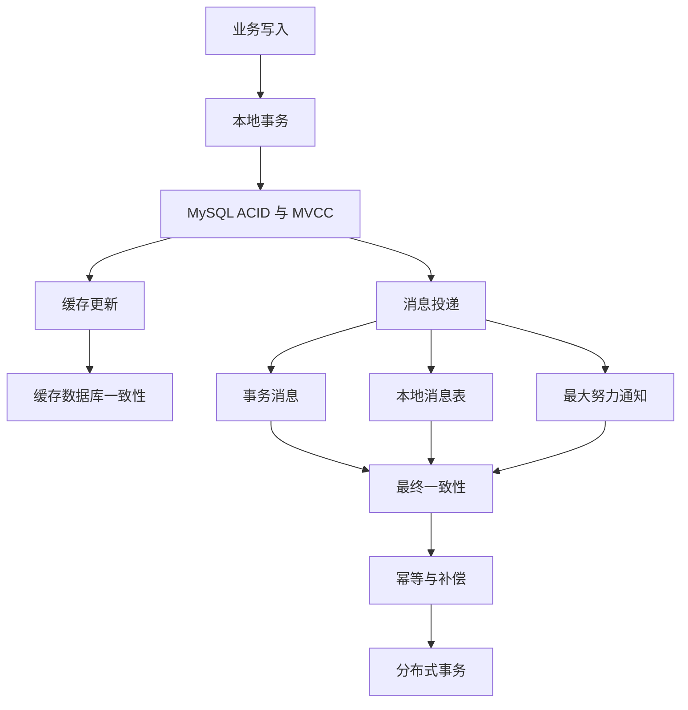

## 类目全景图

### 01 Java基础

入口：[01_Java基础/README.md](01_Java基础/README.md)

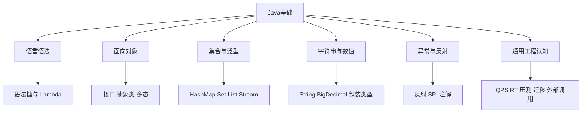

速记主线：先打牢语言机制，再把集合、字符串、泛型、异常、反射串成“写业务代码为什么会这样设计”的回答。

### 02 JVM

入口：[02_JVM/README.md](02_JVM/README.md)

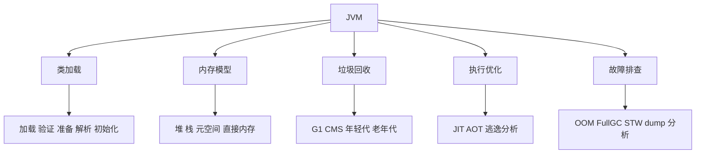

速记主线：类加载决定类型身份，内存区域决定对象位置，GC 决定停顿与吞吐，排查题最终都要落到指标和工具。

### 03 并发编程

入口：[03_并发编程/README.md](03_并发编程/README.md)

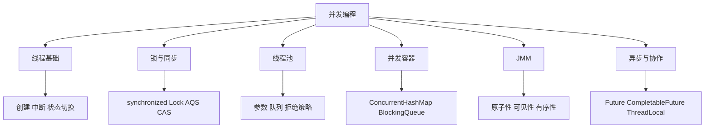

速记主线：先说明共享资源，再说明同步手段，最后落到线程池和并发容器的工程取舍。

### 04 Spring体系

入口：[04_Spring体系/README.md](04_Spring体系/README.md)

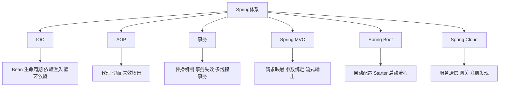

速记主线：Spring 面试最常考“容器如何管理对象”和“代理如何增强行为”，事务、MVC、Boot 都可以往这两个核心收束。

### 05 MySQL

入口：[05_MySQL/README.md](05_MySQL/README.md)

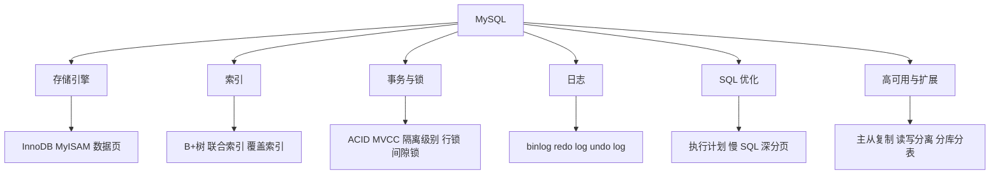

速记主线：索引决定查得快不快，事务和锁决定并发对不对，日志决定能不能恢复和复制。

### 06 Redis

入口：[06_Redis/README.md](06_Redis/README.md)

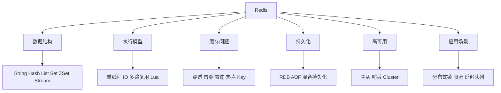

速记主线：Redis 题先说明数据结构与单线程模型，再展开缓存一致性、高可用和典型业务用法。

### 07 消息队列

入口：[07_消息队列/README.md](07_消息队列/README.md)

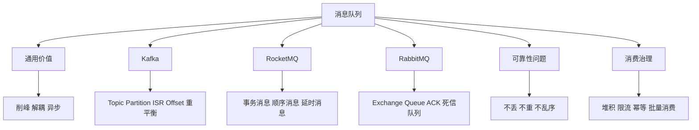

速记主线：MQ 题永远围绕“为什么用、如何可靠、如何消费、出问题怎么补偿”展开。

### 08 微服务与分布式

入口：[08_微服务与分布式/README.md](08_微服务与分布式/README.md)

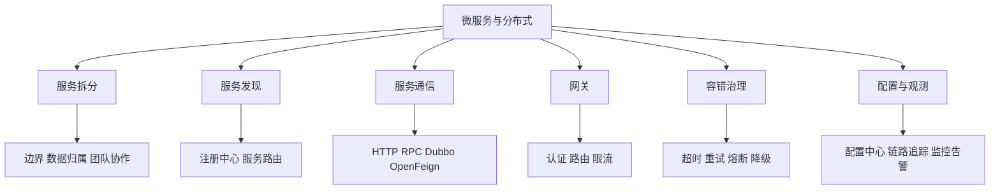

速记主线：微服务不是越拆越好，关键是拆分边界、调用治理、故障隔离和可观测。

### 09 分布式事务

入口：[09_分布式事务/README.md](09_分布式事务/README.md)

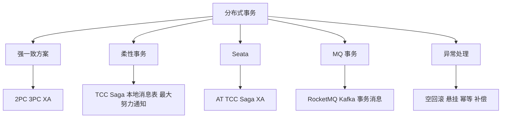

速记主线：先区分强一致和最终一致，再说明业务能否补偿，最后落到幂等、重试和对账。

### 10 分布式锁与ID

入口：[10_分布式锁与ID/README.md](10_分布式锁与ID/README.md)

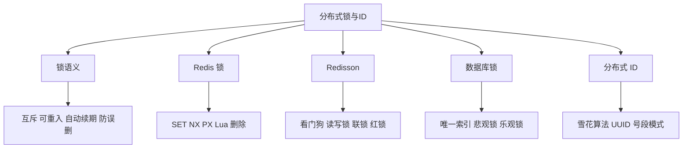

速记主线：锁看正确性，ID 看唯一性和趋势递增，两者都要考虑时钟、过期、并发和容灾。

### 11 分库分表

入口：[11_分库分表/README.md](11_分库分表/README.md)

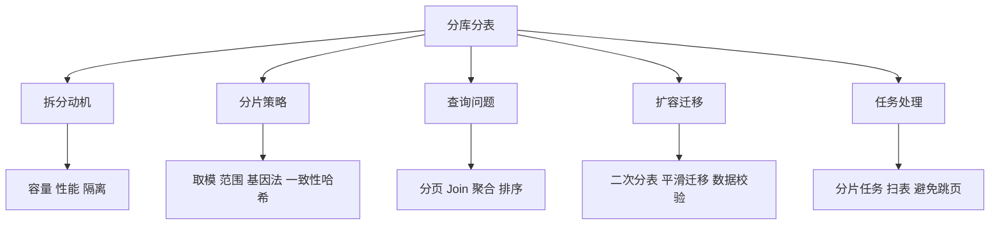

速记主线：分库分表解决容量和吞吐，但会把查询、事务、迁移和运维复杂度推高。

### 12 其他中间件

入口：[12_其他中间件/README.md](12_其他中间件/README.md)

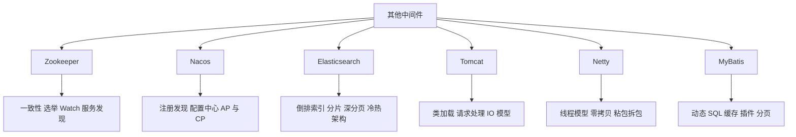

速记主线：这一类要按中间件定位复习，先说解决什么问题，再说核心模型和典型坑。

### 13 网络与操作系统

入口：[13_网络与操作系统/README.md](13_网络与操作系统/README.md)

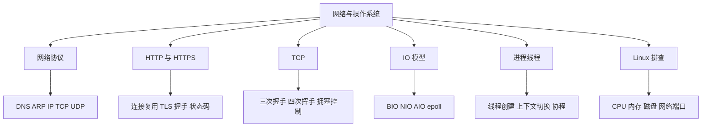

速记主线：网络题讲链路，操作系统题讲资源，排查题讲指标和命令。

### 14 系统设计与高并发

入口：[14_系统设计与高并发/README.md](14_系统设计与高并发/README.md)

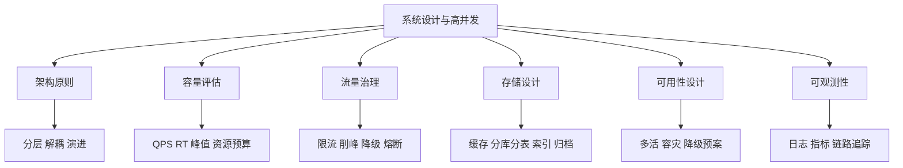

速记主线：系统设计题不要堆技术名词，要从目标、约束、容量、链路、风险和演进讲完整。

### 15 业务场景题

入口：[15_业务场景题/README.md](15_业务场景题/README.md)

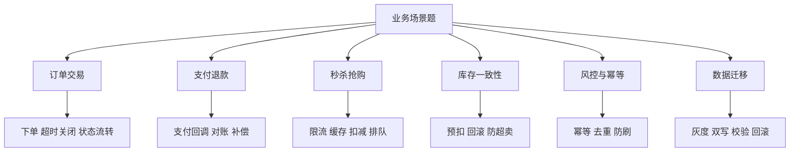

速记主线：业务场景题要从状态机、数据一致性、异常补偿和可观测性四个角度回答。

### 16 性能调优与故障排查

入口：[16_性能调优与故障排查/README.md](16_性能调优与故障排查/README.md)

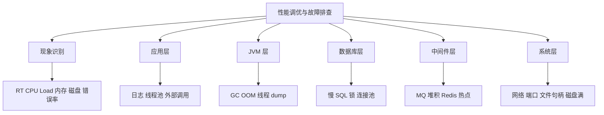

速记主线：排查类回答固定四步，先定范围，再看指标，再定位根因，最后给修复和预防。

### 17 数据结构与算法

入口：[17_数据结构与算法/README.md](17_数据结构与算法/README.md)

```mermaid
graph TD
    A["数据结构与算法"] --> B["线性结构"]
    A --> C["树与堆"]
    A --> D["哈希"]
    A --> E["排序与查找"]
    A --> F["海量数据"]
    A --> G["业务落地"]
    B --> B1["数组 链表 栈 队列"]
    C --> C1["二叉树 B+树 红黑树 小顶堆"]
    D --> D1["HashMap BitMap BloomFilter"]
    E --> E1["排序 TopK 二分"]
    F --> F1["分治 外排 MapReduce"]
    G --> G1["LRU 限流 去重 推荐"]
```

速记主线：算法题不是背代码，而是说明数据规模、内存约束、复杂度和工程落地。

### 18 AI与大模型

入口：[18_AI与大模型/README.md](18_AI与大模型/README.md)

```mermaid
graph TD
    A["AI与大模型"] --> B["模型调用"]
    A --> C["Prompt 与 Context"]
    A --> D["RAG"]
    A --> E["Agent"]
    A --> F["工具生态"]
    A --> G["工程治理"]
    B --> B1["API 参数 Function Calling"]
    C --> C1["Prompt Harness Context"]
    D --> D1["向量数据库 检索 重排"]
    E --> E1["ReAct 多 Agent Skill"]
    F --> F1["MCP A2A Spring AI Cursor"]
    G --> G1["评测 成本 延迟 安全"]
```

速记主线：AI 工程题要把模型能力、上下文组织、工具调用、效果评测和成本治理放到一条链路里。

### 19 工具与工程

入口：[19_工具与工程/README.md](19_工具与工程/README.md)

```mermaid
graph TD
    A["工具与工程"] --> B["构建管理"]
    A --> C["版本管理"]
    A --> D["测试"]
    A --> E["容器化"]
    A --> F["发布运维"]
    A --> G["团队规范"]
    B --> B1["Maven 依赖冲突 fat jar"]
    C --> C1["Git merge rebase reset revert"]
    D --> D1["单元测试 集成测试 Mock"]
    E --> E1["Docker Compose Kubernetes"]
    F --> F1["灰度 蓝绿 金丝雀 DevOps"]
    G --> G1["Code Review 日志规范 插件规范"]
```

速记主线：工程化题强调可重复、可回滚、可观测和团队协作效率。

### 20 任务调度

入口：[20_任务调度/README.md](20_任务调度/README.md)

```mermaid
graph TD
    A["任务调度"] --> B["单机调度"]
    A --> C["分布式调度"]
    A --> D["扫表任务"]
    A --> E["分片任务"]
    A --> F["可靠性"]
    B --> B1["Spring Scheduled Spring Task"]
    C --> C1["XXL-JOB PowerJob"]
    D --> D1["分页 跳页 死循环 连接池"]
    E --> E1["分片广播 动态分片"]
    F --> F1["幂等 重试 防并发 调度日志"]
```

速记主线：调度题重点不是怎么定时，而是集群并发、任务分片、失败重试和扫表安全。

### 21 Excel与文件处理

入口：[21_Excel与文件处理/README.md](21_Excel与文件处理/README.md)

```mermaid
graph TD
    A["Excel与文件处理"] --> B["读取"]
    A --> C["写入"]
    A --> D["内存控制"]
    A --> E["并发导出"]
    A --> F["工具选型"]
    B --> B1["大文件分批读取"]
    C --> C1["流式写入"]
    D --> D1["POI 内存溢出 SXSSFWorkbook"]
    E --> E1["线程池 分片 临时文件"]
    F --> F1["POI EasyExcel"]
```

速记主线：文件处理题本质是内存、IO、批处理和失败恢复。

### 22 面经与项目分享

入口：[22_面经与项目分享/README.md](22_面经与项目分享/README.md)

```mermaid
graph TD
    A["面经与项目分享"] --> B["面试流程"]
    A --> C["项目介绍"]
    A --> D["技术深挖"]
    A --> E["业务难点"]
    A --> F["简历表达"]
    A --> G["经验迁移"]
    B --> B1["一面 二面 HR 面"]
    C --> C1["背景 目标 方案 结果"]
    D --> D1["MySQL Redis MQ 并发 JVM"]
    E --> E1["交易 结算 风控 流程引擎"]
    F --> F1["亮点 难点 量化收益"]
    G --> G1["不同年限不同侧重"]
```

速记主线：面经不是题库堆叠，要反向提炼“候选人该如何表达项目价值和技术深度”。

### 23 软技能与面试准备

入口：[23_软技能与面试准备/README.md](23_软技能与面试准备/README.md)

```mermaid
graph TD
    A["软技能与面试准备"] --> B["自我介绍"]
    A --> C["项目表达"]
    A --> D["行为问题"]
    A --> E["团队协作"]
    A --> F["反问环节"]
    A --> G["职业规划"]
    B --> B1["履历主线 技术标签"]
    C --> C1["STAR 结构 量化收益"]
    D --> D1["优缺点 冲突 加班"]
    E --> E1["Code Review 规范 共识"]
    F --> F1["团队 业务 技术 成长"]
    G --> G1["短期胜任 长期成长"]
```

速记主线：软技能回答要真实、具体、有边界，避免模板感，用项目事实支撑结论。

## 复习路径建议

```mermaid
flowchart TD
    A["第一轮 建主干"] --> B["Java基础 JVM 并发 Spring MySQL Redis"]
    B --> C["第二轮 串链路"]
    C --> D["请求链路 数据一致性 高并发治理"]
    D --> E["第三轮 补场景"]
    E --> F["MQ 微服务 分布式事务 分库分表 业务场景"]
    F --> G["第四轮 强表达"]
    G --> H["性能排查 项目面经 软技能"]
```

## 高频关联速记

| 面试主题 | 关联模块 | 回答落点 |
|---|---|---|
| 慢接口排查 | Spring / MySQL / Redis / JVM / 操作系统 | 链路分段、指标定位、根因验证、修复预案 |
| 缓存一致性 | Redis / MySQL / MQ / 分布式事务 | 更新顺序、延迟双删、消息补偿、幂等对账 |
| 秒杀系统 | 系统设计 / Redis / MQ / MySQL / 分布式锁 | 限流、预扣库存、异步下单、防超卖、补偿 |
| 事务失效 | Spring / MySQL / 并发编程 | 代理边界、传播机制、线程切换、异常类型 |
| 消息可靠性 | MQ / 分布式事务 / 业务场景 | 生产确认、Broker 持久化、消费幂等、重试死信 |
| FullGC 排查 | JVM / 并发编程 / 性能调优 | 内存分布、对象增长、线程 dump、GC 日志 |
| 分库分表设计 | MySQL / 分库分表 / 任务调度 | 分片键、扩容迁移、分页查询、分片任务 |
| 微服务雪崩 | 微服务 / 系统设计 / Redis / MQ | 超时、重试、熔断、降级、隔离、削峰 |
