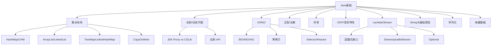
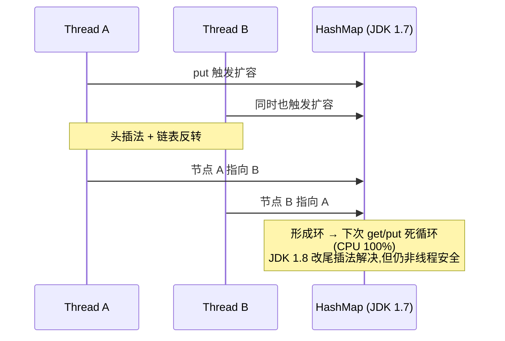

# 01 Java基础 · 速记知识图谱（P0-P3）

> 模块定位：高级岗"地基"，覆盖**集合 + 反射 + IO + 异常 + OOP + Lambda/Stream + 序列化**七大块。243 题，体量最大，但很多是同主题反复问。重点抓集合源码、动态代理、NIO、函数式。
> 题量：243 题。



### P0 必背核心

#### HashMap 源码与扩容
- **底层结构**：JDK 1.8 起 数组 + 链表 + 红黑树。初始容量 16，负载因子 0.75，扩容阈值 = capacity × loadFactor，容量永远是 2 的幂（便于 `(n-1) & hash` 取代取模）。
- **链表 → 红黑树**：链表长度 ≥ 8 且数组长度 ≥ 64 时转红黑树；红黑树节点数 ≤ 6 时退化为链表。两个阈值不一样是为了避免频繁来回转换。
- **扰动函数**：`hash = key.hashCode() ^ (key.hashCode() >>> 16)`，让高 16 位参与低位运算，减少冲突。
- **put 流程**：① 表为空先 resize；② `(n-1) & hash` 算下标；③ 桶为空直接插入；④ 桶非空：key 相等覆盖、是树节点走树插入、否则遍历链表（尾插）；⑤ 链表长度达 8 触发树化；⑥ size > threshold 触发扩容。
- **扩容**：容量翻倍，元素要么留原位、要么移到 `原位 + 旧容量`（由 `hash & 旧容量` 是 0 还是 1 决定），不需要重新计算 hash。
- **典型陷阱**：JDK 1.7 多线程扩容头插法导致循环链表（CPU 100%），1.8 改尾插仍然非线程安全（put 数据丢失、size 不准）。
- 关联题：#0099、#0250、#0274、#0301

```
HashMap 1.8 结构图：

    桶下标       桶内容
    ┌──────┐
    │ [0]  │ → null
    │ [1]  │ → [k1,v1] → [k2,v2] → [k3,v3]           ← 链表 (短)
    │ [2]  │ → null
    │ [3]  │ → ┌── 红黑树 ──┐
    │      │   │   ●(黑)    │                        ← 链表≥8且数组≥64 转树
    │      │   │  / \       │   退化阈值：树节点≤6 转回链表
    │      │   │ ●(红)●(红) │
    │      │   └────────────┘
    │ [..] │ → ...
    │ [15] │ → [k9,v9]
    └──────┘

扩容机制（resize）：
  原容量 16 → 新容量 32
  元素位置：要么留原位 j  要么去 j + 16
  判断依据：hash & oldCap  → 0 留原位、1 去 j + oldCap
  无需重新算 hash 全部 rehash，性能比 JDK 1.7 好很多
```



#### ConcurrentHashMap 1.7 vs 1.8
- **JDK 1.7**：Segment 分段锁数组（默认 16 段），每个 Segment 是一个小 HashMap，继承 ReentrantLock，并发度 = Segment 数。get 不加锁靠 volatile，put 锁 Segment。
- **JDK 1.8**：放弃 Segment，结构与 HashMap 一致（数组 + 链表 + 红黑树），用 **CAS + synchronized 锁桶头节点** 实现并发，锁粒度从段降到单个桶，并发度大幅提升。
- **size() 实现**：用 CounterCell 数组（类似 LongAdder）分散竞争，避免单计数器热点。
- **不允许 null**：key 和 value 都不允许 null（HashMap 允许），因为并发场景下无法区分"key 不存在"和"value 为 null"。
- **弱一致迭代器**：iterator 不会抛 ConcurrentModificationException，但看到的可能是创建迭代器时的快照。
- 关联题：#0303、#0464、#0476

#### ArrayList vs LinkedList
- **ArrayList**：动态数组，默认初始容量 10（延迟到第一次 add 时分配），扩容 1.5 倍（`oldCap + (oldCap >> 1)`）。随机访问 O(1)，中间插入/删除 O(n)。Fail-Fast：modCount 不一致抛 CME。
- **LinkedList**：双向链表，没有初始容量。头尾增删 O(1)，中间需先定位 O(n)，随机访问 O(n)。同时实现 Deque，可作队列/栈使用。
- **选型**：99% 场景用 ArrayList——即使是频繁中间插入，由于 CPU 缓存友好和数组连续内存，实测仍快于 LinkedList。
- **CopyOnWriteArrayList**：写时复制，写操作加 ReentrantLock 复制整个底层数组，读不加锁，适合读多写少（监听器、配置）。
- 关联题：#0237、#0382

#### JDK 动态代理 vs CGLib
- **JDK Proxy**：基于**接口**，`Proxy.newProxyInstance(classLoader, interfaces, InvocationHandler)`。生成的代理类继承 Proxy 实现目标接口。要求目标类必须实现接口。
- **CGLib**：基于**继承**，运行时通过 ASM 字节码框架生成目标类的子类，重写所有非 final 方法并织入 MethodInterceptor。不能代理 final 类/方法/private 方法。
- **性能**：CGLib 创建慢但调用快（FastClass 用索引代替反射），JDK Proxy 创建快但每次调用走反射。JDK 8 之后差距缩小。
- **Spring AOP 选择**：默认情况下，目标类实现接口用 JDK Proxy，没接口用 CGLib；可通过 `@EnableAspectJAutoProxy(proxyTargetClass=true)` 强制 CGLib。Spring Boot 2.x 起默认 CGLib。
- **AOP 自调用失效**：同类中方法 A 调方法 B（带 @Transactional），走的是 this 引用而非代理对象，注解失效。
- 关联题：#0140、#0394

```
JDK Proxy（基于接口）                  CGLib（基于继承）

  ┌──────────┐                          ┌──────────┐
  │ Interface│                          │ Target   │  (非 final 类)
  │ UserService                         │ UserService
  └────▲─────┘                          └────▲─────┘
       │ implements                          │ extends
  ┌────┴────────┐                       ┌────┴────────┐
  │ Target      │                       │ Target$$Cglib│  动态字节码生成
  │ UserService │                       │ ASM 框架    │
  │ Impl        │                       └─────────────┘
  └─────────────┘                              ▲
       ▲                                       │ MethodInterceptor
       │ Proxy.newProxyInstance                │ FastClass 索引
  ┌────┴────────┐                              │
  │$Proxy0      │                              │
  │ extends Proxy│                             │
  │ impl UserService│                          │
  └─────────────┘                              │
       ▲                                       │
       │ InvocationHandler                     │
       │ invoke 反射                            │
       │
  目标类必须实现接口                     final 类/方法/private 不能代理
  创建快，调用走反射(慢)                 创建慢，调用快(FastClass)
```

```mermaid
flowchart TD
  T[Spring AOP 选代理] --> Q{目标类实现接口?}
  Q -->|是| JDK[JDK 动态代理]
  Q -->|否| CGLIB[CGLib 字节码生成]
  
  F[强制 CGLib] -.->|@EnableAspectJAutoProxy<br/>proxyTargetClass=true| CGLIB
  SB[Spring Boot 2.x+] -.默认.-> CGLIB
```

#### NIO 三大组件（Channel/Buffer/Selector）
- **Channel**：双向数据通道（FileChannel/SocketChannel/ServerSocketChannel/DatagramChannel），可以读也可以写。
- **Buffer**：数据容器，本质是数组 + 三指针（capacity 容量、limit 上限、position 当前位置）。常用 ByteBuffer，有 HeapByteBuffer（堆内）和 DirectByteBuffer（堆外，零拷贝时用）。
- **Selector**：多路复用器，一个线程通过 select() 监听多个 Channel 事件（OP_ACCEPT/CONNECT/READ/WRITE），底层在 Linux 用 epoll。
- **Buffer 操作流程**：write → flip()（limit=position, position=0）→ read → clear()/compact()（重置为可写）。
- **关键 API**：`ByteBuffer.allocate(int)` 堆内、`allocateDirect(int)` 堆外、`flip/clear/rewind/mark/reset`。
- **Reactor 模式**：单 Reactor 单线程（Redis 6 之前）、单 Reactor 多线程、主从 Reactor 多线程（Netty 默认）。
- 关联题：#0078、#0094、#0177

```
主从 Reactor 模型（Netty 默认）：

  ┌──────────────────────────────────────────────────────────┐
  │ Boss Group (mainReactor)                                  │
  │  ┌────────┐                                               │
  │  │EventLoop│ ◄── 监听 OP_ACCEPT (新连接接入)               │
  │  └───┬─────┘                                              │
  │      │ accept 后注册到 worker                              │
  └──────┼───────────────────────────────────────────────────┘
         │
  ┌──────▼───────────────────────────────────────────────────┐
  │ Worker Group (subReactor) - 多个 EventLoop               │
  │  ┌────────┐  ┌────────┐  ┌────────┐  ┌────────┐         │
  │  │EventLoop│ │EventLoop│ │EventLoop│ │EventLoop│         │
  │  │ Channel1│ │ Channel3│ │ Channel5│ │ Channel7│ ◄ OP_READ│
  │  │ Channel2│ │ Channel4│ │ Channel6│ │ Channel8│         │
  │  └────────┘  └────────┘  └────────┘  └────────┘         │
  │      │           │           │           │               │
  │      └───── ChannelPipeline (Handler 链) ──────►          │
  │             解码 → 业务 Handler → 编码                     │
  └───────────────────────────────────────────────────────────┘

每个 EventLoop 绑定一个线程，处理多个 Channel
单线程内串行执行 Handler 链，避免锁竞争
```

| IO 模型 | 阻塞? | 数据准备 | 数据拷贝 | 并发量 | 典型 |
|---|---|---|---|---|---|
| BIO | 阻塞 | 阻塞 | 阻塞 | 一连接一线程 | 传统 Tomcat 7 |
| NIO | 非阻塞 | 非阻塞(轮询) | 阻塞 | 一线程多连接 | Netty、Redis |
| IO 多路复用 | 阻塞 select | 非阻塞 | 阻塞 | 数万连接 | Linux epoll |
| 信号驱动 | 非阻塞 | 异步通知 | 阻塞 | — | 少用 |
| AIO | 非阻塞 | 异步 | 异步 | 极高 | 不主流(Linux io_uring 在崛起) |

#### 零拷贝（Zero-Copy）
- **传统 IO**：read + write 经历 4 次拷贝（磁盘→内核缓冲→用户缓冲→Socket 缓冲→网卡）+ 4 次上下文切换。
- **mmap**：把文件内核缓冲区直接映射到用户空间，减少 1 次拷贝（用户↔内核），仍有 3 次拷贝、4 次上下文切换。Kafka 索引文件用 mmap。
- **sendfile**：内核态直接把数据从文件描述符拷贝到 Socket，0 次用户态拷贝，2 次上下文切换。Java 中 `FileChannel.transferTo()` 底层调用 sendfile。Kafka 消息消费用 sendfile。
- **splice**：Linux 2.6.17+，纯内核管道传输。
- 关联题：#0078、#0094

#### String 不可变与字符串池
- **不可变实现**：String 类 final（不可继承），内部 `private final byte[] value`（JDK 9+ 从 char[] 改 byte[] 节省内存）。所有"修改"方法都返回新对象。
- **为什么不可变**：① 安全（用作类加载器参数、网络连接 URL）；② 缓存 hashCode；③ 字符串池可复用；④ 线程安全。
- **字符串池（StringTable）**：JDK 1.7 起从方法区移到堆中。`String s = "abc"` 走常量池；`new String("abc")` 在堆中再建一个对象（最多创建 2 个：池中 + 堆中）。
- **intern()**：JDK 1.6 复制到池中，1.7+ 只在池中存放堆中字符串的引用。
- **拼接演化**：JDK 8 编译为 StringBuilder.append，JDK 9+ 编译为 invokedynamic + StringConcatFactory（更优，可由 JVM 自由选择策略）。
- 关联题：#0083、#0421、#0375

#### equals 与 hashCode 契约
- **三条契约**：① equals 相等的两个对象 hashCode 必须相等；② hashCode 相等的两个对象 equals 不一定相等（哈希冲突）；③ 重写 equals 必须重写 hashCode（否则 HashMap/HashSet 找不到）。
- **equals 五大性质**：自反性、对称性、传递性、一致性、非 null 性。
- **hashCode 默认**：Object.hashCode 是 native，**不是内存地址**（虚拟机实现相关，可能是随机数、Mark Word 中的 hash），但同一个对象多次调用值不变。
- 关联题：#1099、#0501

#### 异常体系（Error vs Exception，Checked vs Unchecked）
- **Throwable** 是顶层，分 **Error**（不应捕获，VirtualMachineError/OutOfMemoryError/StackOverflowError）和 **Exception**。
- **Checked Exception**：编译期强制处理（throws 或 try-catch），如 IOException、SQLException、ClassNotFoundException。
- **Unchecked Exception（RuntimeException 及子类）**：编译期不检查，如 NPE、IllegalArgumentException、ClassCastException。
- **try-with-resources**：JDK 7+，实现 AutoCloseable 的资源自动 close，编译后变成 try-finally 调用 close + addSuppressed 处理"抑制异常"。
- **finally 行为**：finally 中 return 会覆盖 try/catch 的返回值；finally 中改基本类型不影响已经被压栈的 return 值，但改对象字段会影响。
- 关联题：#0204、#0421

#### final / static / volatile / transient 关键字
- **final**：① 修饰类不可继承；② 修饰方法不可重写（private 方法默认 final）；③ 修饰变量基本类型值不变、引用类型引用不变（指向对象可变）；④ final 修饰的字段在构造结束后保证可见性（happens-before）。
- **static**：① 修饰字段属于类不属于实例，全局共享；② 修饰方法不能访问非静态成员；③ 静态代码块在类加载初始化阶段执行；④ 静态内部类不持有外部类引用（推荐用法）。
- **volatile**：可见性 + 禁止指令重排序，**不保证原子性**（如 i++ 仍需 Atomic）。
- **transient**：序列化时忽略该字段。
- 关联题：#0258、#0299

### P1 加分高频

#### LinkedHashMap 与 LRU
- **结构**：HashMap + 双向链表，链表维护**插入顺序**或**访问顺序**（accessOrder=true）。
- **LRU 实现**：构造 `new LinkedHashMap<>(cap, 0.75f, true)`，重写 `removeEldestEntry()` 返回 size > capacity——访问元素会被移到尾部，超容量时 head 被淘汰。
- **应用**：Spring 缓存、Mybatis 一级缓存、Tomcat 资源缓存等都基于它简单实现 LRU。
- 关联题：#0316

#### TreeMap 与红黑树
- **底层**：红黑树（自平衡 BST，5 条性质：根黑、叶 NIL 黑、红节点子必黑、任一节点到叶简单路径黑节点数相同、新插入红色）。
- **性能**：put/get/remove 都是 O(log n)，迭代按 key 自然顺序或 Comparator 顺序。
- **NavigableMap 接口**：firstKey/lastKey/floorKey/ceilingKey/headMap/tailMap/subMap，做范围查询很强。
- 关联题：#0265

#### Stream API 核心
- **三段式**：源（集合/数组/IO）→ 中间操作（filter/map/flatMap/distinct/sorted/peek/limit/skip）→ 终结操作（forEach/collect/reduce/count/min/max/anyMatch/findFirst）。
- **惰性求值**：中间操作不立即执行，遇到终结操作才触发。
- **短路**：findFirst/findAny/anyMatch/allMatch/noneMatch 遇到结果立即返回。
- **parallelStream 坑**：默认共用 ForkJoinPool.commonPool（CPU 核数 - 1 线程），一处阻塞影响全应用。可包在自己的 ForkJoinPool 中 `pool.submit(() -> list.parallelStream()...).get()`。
- **Collectors**：toList/toMap/toSet/groupingBy/partitioningBy/joining/counting。toMap key 冲突要传 merge 函数否则抛异常。
- 关联题：#0091、#0345

#### Optional 正确用法
- **创建**：`Optional.of(x)`（x 非空，否则 NPE）、`ofNullable(x)`、`empty()`。
- **orElse vs orElseGet**：orElse(x) 不管有没有值都会构造 x；orElseGet(supplier) 只在空时才调用，性能更好。
- **不要**：① 当字段；② 当方法参数；③ 直接 get() 不判断（等于 NPE）；④ 给集合包装（用空集合代替）。
- 关联题：#0117

#### IO 流分类
- **按方向**：InputStream / OutputStream（字节流）vs Reader / Writer（字符流）。
- **按功能**：节点流（直接对接数据源 FileInputStream）vs 处理流（套在节点流外 BufferedInputStream、DataInputStream、ObjectInputStream）。
- **装饰器模式**：BufferedInputStream(InputStream is) 包一层加缓冲；ObjectInputStream 包字节流读对象。
- **NIO 与 IO 区别**：阻塞 vs 非阻塞、流 vs 块、单向 Stream vs 双向 Channel、有无 Selector。
- 关联题：#0083、#0094

#### 序列化与 Serializable
- **机制**：实现 Serializable 标记接口（无方法），对象图被递归序列化为字节流。
- **serialVersionUID**：版本号，类结构变化但 UID 不变可保持兼容。不显式声明，编译器自动算（结构变化值变），容易踩坑——**必须显式声明 `private static final long serialVersionUID = 1L;`**。
- **transient**：标记字段不参与序列化。
- **Externalizable**：手动实现 writeExternal/readExternal，完全控制流程，性能更好。
- **常见替代**：Jackson/Fastjson2 序列化为 JSON、Protobuf 序列化为高效二进制（IDL 描述、向后兼容）。
- 关联题：#0260、#0292

#### Comparable vs Comparator
- **Comparable**：内部排序，类实现 `compareTo(T)`，定义自身的"自然顺序"（String、Integer 都实现了）。
- **Comparator**：外部排序，可对没实现 Comparable 的类或临时改变排序规则，常用 `Comparator.comparing(...).thenComparing(...).reversed()`。
- **TreeMap/PriorityQueue/sort** 都依赖比较器。
- 关联题：#0260

#### 自动装箱拆箱与 Integer 缓存
- **装箱**：`Integer.valueOf(int)`，对 -128~127 走 IntegerCache（静态数组），范围外 new 新对象。
- **拆箱**：`Integer.intValue()`。
- **典型坑**：`Integer a = 127; Integer b = 127; a == b // true` 但 `Integer a = 128; b = 128; a == b // false`（同一缓存 vs 新对象）。比较包装类**永远用 equals**。
- **缓存调整**：`-XX:AutoBoxCacheMax=N` 可扩大 Integer 缓存上限（仅 Integer 可调，Long 固定 -128~127）。
- 关联题：#0258、#0299

#### Lambda 与函数式接口
- **函数式接口**：只有一个抽象方法的接口（可以有 default 和 static 方法），@FunctionalInterface 强制检查。
- **JDK 8 内置 4 大类**：Function<T,R>（apply）、Predicate<T>（test）、Consumer<T>（accept）、Supplier<T>（get），衍生 BiFunction/BinaryOperator/UnaryOperator/ToIntFunction 等。
- **方法引用 4 种**：类::静态方法、实例::实例方法、类::实例方法、类::new。
- **Lambda 本质**：编译为 **invokedynamic** 指令 + 内部生成的 LambdaMetafactory，不是匿名内部类（不会生成额外 class 文件）。
- 关联题：#0091、#0345

### P2 深度延伸

#### 泛型与类型擦除
- **擦除机制**：编译期把 `List<String>` 擦为 `List`，运行时拿不到泛型类型。受限于此：不能 `new T()`、`new T[]`、不能 `instanceof T`、不能用泛型类做 catch 类型。
- **桥方法（Bridge Method）**：编译器为了保证多态正确生成的合成方法，比如重写带泛型参数的方法时。
- **PECS 原则**：Producer Extends Consumer Super——你**只读**用 `? extends T`（生产者），你**只写**用 `? super T`（消费者）。比如 `Collections.copy(dest, src)`：dest 是 `? super T`，src 是 `? extends T`。
- **类型 token**：通过匿名子类保留泛型信息 `new TypeReference<List<String>>(){}`，Jackson/Gson 等反序列化用。
- 关联题：#0218

#### 注解原理
- **元注解**：@Target（作用位置）、@Retention（保留策略 SOURCE/CLASS/RUNTIME）、@Documented（生成 javadoc）、@Inherited（子类继承）、@Repeatable（可重复）。
- **运行时读取**：必须 RUNTIME 保留策略；通过反射 `method.isAnnotationPresent(...)`、`getAnnotation(...)` 读取注解值。
- **编译期处理**：CLASS 或 SOURCE 保留，通过 APT（Annotation Processor Tool）/ JSR 269 处理，Lombok @Data、@Builder 就是这么实现的——在编译期生成 getter/setter 字节码。
- **Spring 的 @Component/@Autowired/@Transactional 等都是 RUNTIME** 注解，由 BeanPostProcessor 在 Bean 初始化时反射处理。
- 关联题：#0205、#0306

#### Object 通用方法深挖
- **wait/notify**：必须在 synchronized 块内调用，否则抛 IllegalMonitorStateException；wait 释放锁，notify 不释放（要等同步块结束）；wait 是 Object 的方法而非 Thread 的，因为锁是对象级别的。
- **finalize() 已废弃**：JDK 9 @Deprecated，性能差、不确定执行时机、可能复活对象。替代品：Cleaner（基于幻象引用）、try-with-resources。
- **clone() 浅拷贝**：默认按字段拷贝，引用类型只拷贝引用。深拷贝需手动 clone 内部引用对象 / 用序列化反序列化 / 用 Jackson 转 JSON 再回来。
- **toString()**：默认返回 `getClass().getName() + "@" + Integer.toHexString(hashCode())`，IDE 通常自动生成或用 Lombok @ToString。
- 关联题：#0083、#1099

#### CopyOnWriteArrayList 原理
- **写时复制**：写操作（add/set/remove）先用 ReentrantLock 锁，再复制原数组到新数组上操作，最后 volatile 引用切换。读操作不加锁，直接读 volatile 引用。
- **保证读读不互斥、读写不互斥、写写互斥**，但牺牲实时性（读到的可能是旧快照）。
- **适用场景**：读多写少（监听器列表、白名单），不适合大列表频繁写（每次都全量复制内存翻倍）。
- 关联题：#0382

#### 时间 API（JDK 8+）
- **java.time 包**：Instant（时间戳）、LocalDate/LocalTime/LocalDateTime（无时区）、ZonedDateTime/OffsetDateTime（带时区）、Duration（两个时间差）、Period（两个日期差）、ZoneId、DateTimeFormatter（**线程安全**，可替代 SimpleDateFormat）。
- **不可变 + 线程安全**：所有时间类都是 final 且不可变，运算返回新对象。
- **SimpleDateFormat 线程不安全**：内部用 Calendar 共享状态，多线程同时 parse/format 会数据错乱。早期项目要么 ThreadLocal 包装，要么换 DateTimeFormatter。
- 关联题：#0203

#### NIO 中的 mmap 与 DirectByteBuffer
- **DirectByteBuffer**：堆外内存，由 Unsafe.allocateMemory 直接向 OS 申请。优点：减少一次堆内堆外拷贝，GC 时不被移动；缺点：分配/回收慢、回收依赖 Cleaner（幻象引用 + ReferenceHandler 线程）。
- **释放**：DirectByteBuffer 被 GC 回收时触发 Cleaner，调用 Deallocator 真正 free 内存；不当使用（堆内引用一直在）会导致堆外内存泄漏。
- **MaxDirectMemorySize**：默认等于 -Xmx，可通过 `-XX:MaxDirectMemorySize=N` 限制，超出抛 OutOfMemoryError: Direct buffer memory。
- **Netty 用 PooledByteBufAllocator 池化堆外内存**避免频繁分配释放。
- 关联题：#0094、#0177

### P3 冷门刁钻

#### WeakHashMap
- **Key 是弱引用**：Entry 的 key 包装为 WeakReference，下次 GC 时 key 没有强引用就被回收，对应 Entry 在下次访问时被移除（通过 ReferenceQueue）。
- **典型应用**：Tomcat 类加载器引用、Spring beanFactory 缓存。
- 关联题：#0316

#### Cleaner（替代 finalize）
- **JDK 9 引入**：基于 PhantomReference（幻象引用），注册一个清理动作，当对象被 GC 时由 Cleaner 线程异步执行清理。
- **比 finalize 更安全**：清理动作不能复活对象、可单独线程执行不阻塞 GC、可显式调用 clean()。
- 关联题：#0999

#### 海量数据 Top K
- **小顶堆（PriorityQueue 默认）**：维护大小为 K 的小顶堆，遍历元素 > 堆顶就替换并下沉。时间 O(n log k)，空间 O(k)。
- **快速选择**：基于快排的 partition，平均 O(n)，最坏 O(n²)。
- **BitMap**：海量整数去重/查找存在性，1 bit 一个数。
- **布隆过滤器**：不存在一定不存在，存在可能误判。Guava BloomFilter 默认 3% 误判率。
- **外部排序**：内存装不下时分块排序后多路归并（Top K 也可分块用堆）。
- 关联题：#0039、#0040

#### 注解处理器 APT 与 Lombok
- Lombok 在 javac 编译期通过 **JSR 269 注解处理器** 修改 AST，加入 getter/setter/constructor 等字节码。
- IDE 需要装 Lombok 插件才能正确识别（不然 IDE 编译期看不到生成的方法）。
- 替代：MapStruct（编译期生成 mapper）、AutoValue（不可变对象）。

#### 字符串拼接的字节码
- `"a" + "b"`：编译期常量折叠 = `"ab"`。
- JDK 8：`a + b`（变量）= `new StringBuilder().append(a).append(b).toString()`。
- JDK 9+：`a + b` = `invokedynamic` 调用 `StringConcatFactory.makeConcatWithConstants`，JVM 运行时选最优策略。所以同一段代码 JDK 8 vs JDK 11 字节码不同、性能不同。
- 关联题：#0375

### 跨模块联想

- HashMap/CHM ↔ **03 并发**：1.7 头插死循环、1.8 CAS+synchronized 锁桶头节点。
- 动态代理 ↔ **04 Spring**：Spring AOP 默认 JDK Proxy + CGLib 兜底，事务/缓存/异步注解都靠它。
- NIO/零拷贝 ↔ **07 消息队列**：Kafka 顺序写 + sendfile 零拷贝是高吞吐核心。
- IO 模型 ↔ **13 网络与 OS**：BIO/NIO/AIO 与 select/poll/epoll 直接对应。
- Lambda/Stream ↔ **15 业务场景**：业务聚合、ETL 数据处理常用 Stream + Collectors。
- 弱引用 ↔ **02 JVM**：ThreadLocalMap Entry 弱引用 key、ReferenceQueue 配合 Cleaner。
- 序列化 ↔ **07 消息队列**：MQ 消息体序列化框架选型（JSON vs Protobuf vs Avro vs Hessian）。
- 海量数据 ↔ **17 算法**：Top K 小顶堆、海量去重布隆过滤器。
- intern/字符串池 ↔ **02 JVM**：堆中 StringTable、Class 常量池→运行时常量池的迁移。

---
