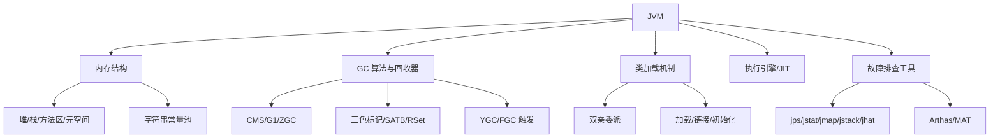
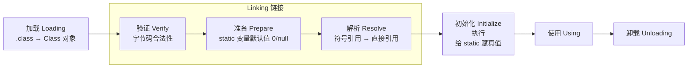
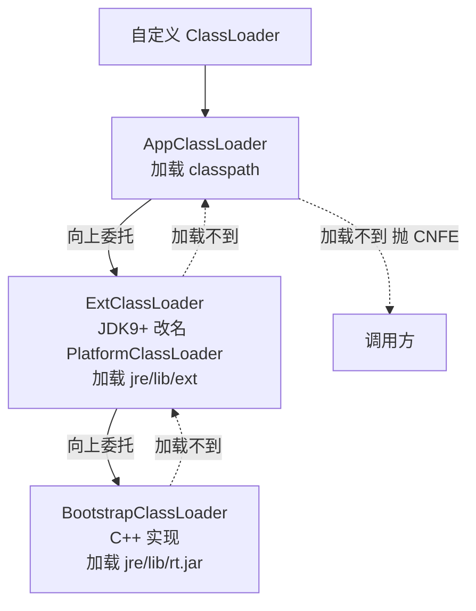
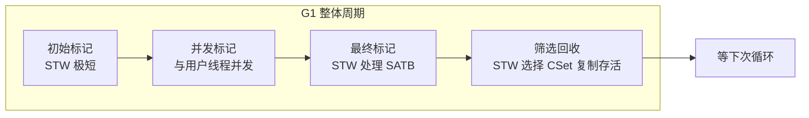
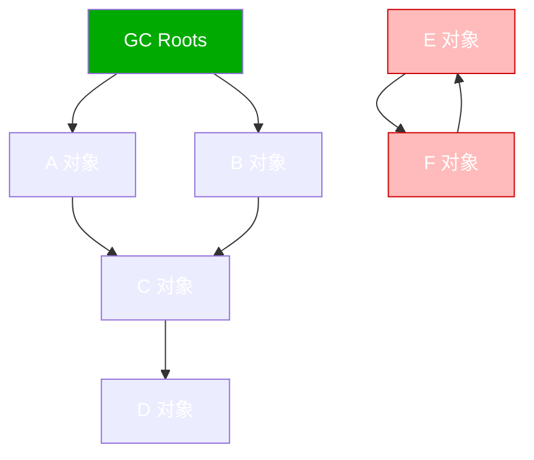

# 02 JVM · 速记知识图谱（P0-P3）

> 模块定位：高级岗"硬通货"，几乎每场必考。重点是**内存模型 + 垃圾回收 + 类加载 + 故障排查工具链**。
> 题量：63 题。



### P0 必背核心

#### JVM 运行时内存结构
- **5 大区域**：堆（Heap，对象实例）、虚拟机栈（线程私有，栈帧/局部变量表）、本地方法栈（Native）、方法区/元空间（类元信息）、程序计数器（PC，唯一不会 OOM 的区域）。
- **线程共享**：堆、方法区。**线程私有**：栈、本地方法栈、PC。
- 堆分代：新生代（Eden:S0:S1 = 8:1:1）+ 老年代。新生代用复制算法，老年代用标记-整理/清除。
- JDK 1.8 起方法区实现改为**元空间（Metaspace），位于本地内存**，不再受 `-Xmx` 限制，但可被 `-XX:MaxMetaspaceSize` 限制。
- 典型陷阱：String 常量池 JDK 1.7 起从方法区移到堆中；`intern()` 行为 1.6/1.7 不同。
- 关联题：#0259、#0261、#0057、#1071、#1148

```
┌─────────────────── JVM 运行时数据区 ────────────────────┐
│                                                          │
│ ═══ 线程共享 ═══                                          │
│ ┌──────────── 堆 Heap ────────────┐ ┌──────────────────┐│
│ │ ┌─── 新生代 ───┐  ┌─ 老年代 ──┐ │ │ 方法区 / 元空间   ││
│ │ │ Eden : S0:S1 │  │           │ │ │ 类元信息          ││
│ │ │   8 : 1 : 1  │  │           │ │ │ 运行时常量池      ││
│ │ │ (复制算法)    │  │(标记整理)  │ │ │ static 变量       ││
│ │ └──────────────┘  └───────────┘ │ │ StringTable(JDK7+在堆)│
│ └──────────────────────────────────┘ └──────────────────┘│
│                                                          │
│ ═══ 线程私有 ═══                                          │
│ ┌──── 虚拟机栈 ────┐ ┌── 本地方法栈 ──┐ ┌── PC 程序计数器 ─┐│
│ │ 栈帧链           │ │  Native 方法     │ │ 唯一不 OOM       ││
│ │ ・局部变量表     │ │                  │ │                  ││
│ │ ・操作数栈       │ │                  │ │                  ││
│ │ ・动态链接       │ │                  │ │                  ││
│ │ ・方法出口       │ │                  │ │                  ││
│ └──────────────────┘ └──────────────────┘ └──────────────────┘│
└────────────────────────────────────────────────────────────────┘

JDK 1.8 起方法区实现 = 元空间（本地内存，不受 -Xmx 限制）
StringTable：JDK 1.6 在方法区 → 1.7+ 移到堆
```

#### 类加载过程（加载-链接-初始化）
- **三阶段**：加载（Loading，把 .class 读入 JVM 生成 Class 对象）→ 链接（验证 Verify、准备 Prepare 给静态变量分配默认值、解析 Resolve 符号引用转直接引用）→ 初始化（Initialization，执行 `<clinit>`，给静态变量赋真实值并执行静态代码块）。
- **懒加载**：只有遇到 new、getstatic、putstatic、invokestatic、反射、main 类、子类初始化先初始化父类这几种情况才触发初始化。
- 准备阶段静态变量为**默认值**（int=0），初始化阶段才是程序员赋的值。`final static` 直接在准备阶段就是真值。
- 符号引用 vs 直接引用：前者用名字描述目标（如 "java/lang/String"），后者是真实内存地址/偏移。
- 关联题：#0041、#1085



**懒加载触发条件**（只有这些场景才会触发初始化）：
- `new` 对象、`getstatic`/`putstatic`、`invokestatic`
- 反射 `Class.forName(...)`
- 初始化子类 → 先初始化父类
- 启动类（含 main 方法的类）
- JDK 7+ 的 MethodHandle

#### 双亲委派机制
- **流程**：类加载请求向上委托（AppClassLoader → ExtClassLoader → BootstrapClassLoader），父加载器加载不到才由子加载器尝试。
- **目的**：① 避免类重复加载；② 安全（防止用户写 `java.lang.String` 覆盖核心类）。
- **类的唯一性**：JVM 中类的唯一性由 **"全限定名 + 类加载器"** 共同决定，不同 ClassLoader 加载的同名类不相等。
- **如何破坏**：① 自定义 ClassLoader 重写 `loadClass()` 不调 super；② 线程上下文 ClassLoader（JDBC SPI、Tomcat）；③ OSGi 模块化。
- 典型陷阱：破坏双亲委派**重写不了 String**——Bootstrap 已经加载过 `java.lang.String`，且包名 `java.*` 受保护，自定义类加载器加载 `java.lang.String` 会抛 `SecurityException`。
- 关联题：#0302、#1097、#0897



**破坏方式**：
- ① 自定义 ClassLoader 重写 `loadClass()` 不调 super
- ② 线程上下文 ClassLoader（JDBC SPI、Tomcat WebappClassLoader）
- ③ OSGi 模块化

**类的唯一性 = 全限定名 + ClassLoader**——不同 ClassLoader 加载的同名类不相等

#### G1 垃圾回收器（JDK 9+ 默认）
- **核心思想**：把堆划分为多个 **Region**（默认 2048 个，每个 1-32MB，必须 2 的幂），不再物理分代，每个 Region 可动态扮演 Eden/Survivor/Old/Humongous。
- **可预测停顿**：通过 `-XX:MaxGCPauseMillis`（默认 200ms）指定目标停顿时间，G1 选择"回收价值最高"的 Region 优先回收（Garbage First 名字由来）。
- **RSet（记忆集）+ Card Table**：解决跨代/跨 Region 引用问题，每个 Region 维护"谁引用了我"，避免全堆扫描。
- **三色标记 + SATB**：并发标记阶段用三色标记（黑/灰/白），SATB（Snapshot-At-The-Beginning）保证标记一致性，弥补漏标。
- **Humongous 对象**：超过 Region 一半大小的对象直接进入 Humongous Region，可能跨多个 Region。
- 关联题：#0012、#0109、#0110、#0149、#0155

```
G1 堆布局（每个 Region 1-32MB，默认共 2048 个）：

┌─────┬─────┬─────┬─────┬─────┬─────┬─────┬─────┐
│  E  │  O  │  S  │ Hu  │  E  │  O  │  E  │     │  E = Eden
├─────┼─────┼─────┼─────┼─────┼─────┼─────┼─────┤  S = Survivor
│  E  │  O  │     │  E  │  S  │  Hu │  O  │  E  │  O = Old
├─────┼─────┼─────┼─────┼─────┼─────┼─────┼─────┤  Hu = Humongous
│     │  E  │  S  │  O  │  O  │  E  │     │  S  │     (大对象，可跨多个)
├─────┼─────┼─────┼─────┼─────┼─────┼─────┼─────┤     = 空闲
│  E  │     │  O  │  E  │  S  │  E  │  Hu │  E  │
└─────┴─────┴─────┴─────┴─────┴─────┴─────┴─────┘

特点：① Region 角色动态变化；② -XX:MaxGCPauseMillis 控制停顿；
      ③ 优先回收"价值最高"的 Region（Garbage First）；④ 不需要连续内存
```



#### CMS vs G1 vs ZGC 核心对比
- **CMS**（Concurrent Mark Sweep）：标记-清除，并发收集，**JDK 9 标记废弃，JDK 14 移除**。缺点：碎片化、Concurrent Mode Failure 退化为 Serial Old（长 STW）、Foreground/Background 收集。
- **G1**：分 Region、可预测停顿、整堆收集。适合 6GB-100GB 堆。
- **ZGC**（JDK 11+，JDK 15 转正）：**亚毫秒级停顿（<10ms）**，支持 TB 级堆。基于**着色指针（Colored Pointer）+ 读屏障**实现并发整理。JDK 16 支持并发线程栈扫描，停顿降到 1ms 以下。
- 选型：4G 以下 Parallel Scavenge + Parallel Old；4-32G G1；超大堆/低延迟敏感 ZGC/Shenandoah。
- 关联题：#0147、#0148、#0149、#0763

#### GC Roots & 可达性分析
- **判活方式**：可达性分析（不是引用计数，因为解决不了循环引用）。
- **GC Roots 来源**：① 虚拟机栈中引用的对象；② 方法区中类静态属性引用的对象；③ 方法区中常量引用的对象；④ 本地方法栈中 JNI 引用的对象；⑤ 同步锁 `synchronized` 持有的对象；⑥ JMXBean、JVMTI 中注册的回调等。
- **四种引用**：强（默认，OOM 也不回收）> 软（SoftReference，内存不足时回收，做缓存）> 弱（WeakReference，下次 GC 就回收，ThreadLocal）> 虚（PhantomReference，唯一作用是 GC 时收到通知，配合 ReferenceQueue 做资源清理，Netty 直接内存释放）。
- 关联题：#0252、#0999



E 和 F 互相引用但都不可达 GC Roots → 都被回收（引用计数算法在此失败，可达性分析正确处理）

**GC Roots 来源**：① 虚拟机栈中本地变量引用；② 方法区类静态属性引用；③ 方法区常量引用；④ JNI 本地方法栈引用；⑤ synchronized 持有的对象；⑥ JMXBean/JVMTI 回调。

| 引用 | 回收时机 | 典型场景 |
|---|---|---|
| 强引用 | 永不回收（OOM 也不） | 默认 `Object o = new Object()` |
| 软引用 | 内存不足时 | 缓存（Mybatis SoftCache） |
| 弱引用 | 下次 GC | ThreadLocalMap Entry key |
| 虚引用 | GC 时收到通知 | Netty 堆外内存释放 |

#### YGC / FullGC 触发条件
- **YGC**：Eden 区满时触发 Minor GC，存活对象拷贝到 Survivor 或晋升老年代。
- **晋升老年代**：① 年龄 ≥ `-XX:MaxTenuringThreshold`（默认 15）；② Survivor 同年龄对象总和 > Survivor 一半（动态年龄判断）；③ 大对象直接进老年代（`-XX:PretenureSizeThreshold`）；④ YGC 后 Survivor 放不下。
- **FullGC 触发**：① 老年代空间不足；② 方法区/元空间满；③ 显式调用 `System.gc()`（可被 `-XX:+DisableExplicitGC` 屏蔽）；④ CMS Concurrent Mode Failure；⑤ G1 Mixed GC 失败退化；⑥ 担保失败（YGC 时老年代连续空间 < 历次晋升平均值且不允许担保）。
- 频率：FullGC 正常应该**几小时甚至几天一次**，分钟级就是大问题。
- 关联题：#1042、#0314

#### Stop The World (STW)
- 任何 GC 都有 STW，区别在长短。所有用户线程暂停，确保 GC 标记/移动时引用关系不变。
- STW 在**安全点（Safe Point）** 才能进入。Safe Point 通常在方法调用、循环回边、异常抛出等位置。
- **可数循环（counted loop，int 类型计数器）** 编译期 JIT 可能去掉安全点，导致单线程长循环阻塞其他线程到达 Safe Point——典型"JVM 假死"故障。
- 关联题：#1043、#0868

### P1 加分高频

#### 三色标记算法 & 漏标
- 标记过程对象分三色：**白**（未访问）、**灰**（自己被访问，子引用未扫完）、**黑**（自己和子引用都扫完）。
- **漏标条件（必须同时满足）**：① 黑色对象新增了到白色对象的引用；② 灰色对象删除了到白色对象的所有引用。
- **CMS 解决**：增量更新（Incremental Update）——记录黑→白新增引用，重新扫描黑色对象。
- **G1 解决**：SATB（开始时快照）——记录灰→白被删除的引用，把那些"消失的引用"对象当作存活。
- 关联题：#0155

```
三色标记过程演示：

初始:    ⚪⚪⚪⚪⚪⚪⚪⚪      全白（未访问）

标记中:  ⚪🔘🔘⚪⚪⚪⚪⚪      🔘 灰（自己被访问，子未扫完）
                              ⚫ 黑（自己和子都扫完）
                              ⚪ 白（未访问，最终会被回收）

漏标条件（必须同时满足）：
  ① 黑对象新增了到白对象的引用
  ② 灰对象删除了到该白对象的所有引用
  
              ⚫ B 新增→ ⚪ X         ✗ 危险:  X 看似无人引用
            ╳                          但实际被 B 引用应保留
              🔘 A 删除→ ⚪ X

解决方案：
  CMS - 增量更新 (Incremental Update)：黑→白新增引用时记录黑对象，重新扫描
  G1  - SATB (Snapshot-At-The-Beginning)：灰→白删除引用时记录被删的白对象，标活
```

#### CMS 完整流程（已废弃但仍考）
- 4 阶段：① **初始标记**（STW，只标 GC Roots 直接关联）；② **并发标记**（与用户线程并发，标记所有可达对象）；③ **重新标记**（STW，处理并发标记期间引用变化，CMS 用增量更新）；④ **并发清除**（与用户线程并发清除垃圾）。
- 缺点：① 标记清除产生碎片；② CPU 敏感（并发占用线程）；③ 浮动垃圾；④ Concurrent Mode Failure（老年代回收速度跟不上对象晋升速度）退化为 Serial Old，导致超长 STW。
- 关联题：#0802

```mermaid
gantt
    title CMS 4 阶段时序（与用户线程关系）
    dateFormat X
    axisFormat %L ms
    section 用户线程
    运行            :active, u1, 0, 100
    暂停 STW        :crit, u2, 100, 110
    运行            :active, u3, 110, 300
    暂停 STW        :crit, u4, 300, 320
    运行            :active, u5, 320, 500
    section GC 线程
    初始标记 STW    :crit, g1, 100, 110
    并发标记        :g2, 110, 300
    重新标记 STW    :crit, g3, 300, 320
    并发清除        :g4, 320, 500
```



#### JIT 即时编译
- **解释执行 + 编译执行混合**。HotSpot 中热点代码（方法/循环）会被 **C1（Client，快速编译）和 C2（Server，深度优化）** 编译成本地机器码。
- **热点探测**：方法调用计数器 + 回边计数器（OSR On-Stack Replacement，循环热点替换）。
- **典型优化**：内联（方法内联）、逃逸分析（对象只在方法内用就栈上分配）、锁消除、锁粗化、标量替换、循环展开。
- **AOT（Ahead-Of-Time）**：JDK 9 引入 jaotc，启动前编译；GraalVM Native Image 是更激进的 AOT，启动毫秒级但运行峰值性能不如 JIT。
- 关联题：#0691、#0088、#0843、#0717

#### Class 常量池 vs 运行时常量池 vs 字符串常量池
- **Class 常量池**：编译期产生，存在每个 .class 文件中，存字面量和符号引用。
- **运行时常量池**：类加载后，Class 常量池内容放入方法区/元空间的运行时常量池，符号引用会被解析为直接引用，且**可动态添加**（如 `String.intern()`）。
- **字符串常量池（StringTable）**：JDK 1.7 起从方法区移到堆中，是一个 HashTable。`intern()` 在 1.6 是复制到常量池，1.7+ 是只放引用（如果堆里已有）。
- 关联题：#1085、#1148、#0421

#### 常用排查工具命令
- `jps`：列出 JVM 进程 PID。
- `jstat -gcutil <pid> 1000`：每秒打印 GC 统计（Eden/Old/Metaspace 使用率、YGC/FGC 次数与耗时）。
- `jmap -dump:live,format=b,file=heap.hprof <pid>`：导出堆快照，用 MAT/JVisualVM/JProfiler 分析内存泄漏。
- `jstack <pid>`：导出线程栈，分析死锁、CPU 飙高（结合 `top -H` 找高 CPU 线程，转 16 进制对应栈）。
- `jinfo`：查看/修改 JVM 参数。
- `javap -v`：反编译看字节码，常用于看 lambda、内部类、`String + String` 编译后实现。
- `Arthas`：阿里开源，热门命令 `dashboard`、`thread`、`watch`、`trace`、`tt`、`jad` 反编译已加载类，统计耗时基于字节码增强。
- 关联题：#0145、#0390、#0411、#0417、#0418、#0401、#0497

#### OOM 类型与原因
- **Java heap space**：堆满。典型：大对象、集合泄漏、缓存无上限、ThreadLocal 不 remove。
- **GC overhead limit exceeded**：98% 时间在 GC 但只回收 < 2% 内存。
- **Metaspace**：类太多（动态代理、CGLib、JSP 编译）、ClassLoader 泄漏。
- **Direct buffer memory**：堆外内存（Netty、NIO ByteBuffer.allocateDirect）超 `-XX:MaxDirectMemorySize`。
- **unable to create new native thread**：线程数超 OS 限制（ulimit/线程占用栈空间太多）。
- **StackOverflowError**：单线程栈深太深（不是 OOM，是 Error）。
- 关联题：#0348、#1150、#1070

### P2 深度延伸

#### G1 STW 时间如何"精确控制"
- 不是真的精确，是**基于停顿预测模型**：每个 Region 维护回收成本（标记 + 复制时间），用历史数据预测。
- 在 Mixed GC 时按 `-XX:MaxGCPauseMillis` 选回收价值最高且总耗时不超目标的 Region 集合（CSet, Collection Set）。
- 目标停顿设置过小会导致每次 GC 回收的 Region 太少，老年代积累快，最终触发 Full GC，反而更慢。
- 关联题：#0110

#### 跨代引用与 RSet
- **跨代引用问题**：YGC 时需要找出"老年代引用的新生代对象"，否则会误回收存活对象。如果扫整个老年代代价巨大。
- **Card Table**：把老年代分成若干 512 字节 Card，每个 Card 一个字节标记 dirty。老年代对象引用了新生代时该 Card 标 dirty，YGC 时只扫 dirty card。
- **RSet（Remembered Set）**：G1 每个 Region 维护 RSet 记录"谁引用了我"，配合 Write Barrier 在引用变更时更新。RSet 占内存可达 20%。
- 关联题：#1124

#### 安全点 vs 安全区域
- **Safe Point**：线程暂停的位置（方法调用、循环回边等）。GC 启动前所有线程"主动式中断"——JVM 设置一个标志位，线程在 Safe Point 检查标志，主动挂起。
- **Safe Region**：线程长时间不执行（Sleep/Blocked）无法进入 Safe Point，引入 Safe Region——一段引用关系不变的代码区域。线程进入 Safe Region 时标记自己 Safe，离开前要检查 JVM 是否完成 GC。
- 关联题：#0868

#### 字符串拼接的字节码差异
- `"a" + "b"`：编译期常量折叠，直接是 `"ab"`。
- `String s = a + b`（变量）：JDK 8 编译为 `StringBuilder.append`，JDK 9+ 编译为 `invokedynamic` 调用 `StringConcatFactory.makeConcatWithConstants`（更高效，可由 JVM 决定最优策略）。
- 这就是为什么"同一段拼接代码在 JDK 不同版本性能不同"。
- 关联题：#0375

#### kill -9 对 JVM 的影响
- `kill -9`（SIGKILL）：强制杀进程，**不会执行 ShutdownHook、不会 flush 缓冲、不会关闭文件描述符**——可能丢日志、丢未刷盘数据。
- `kill -15`（SIGTERM，默认）：JVM 会执行 ShutdownHook，可以做优雅停机。
- Spring Boot `server.shutdown=graceful` 配合 `spring.lifecycle.timeout-per-shutdown-phase`。
- 关联题：#0690

### P3 冷门刁钻

#### 逃逸分析与栈上分配
- 编译期分析对象作用域是否"逃逸"出方法：未逃逸的小对象可能**栈上分配**或**标量替换**（拆成基本类型字段），避免堆分配压力。
- `-XX:+DoEscapeAnalysis`（默认开）、`-XX:+EliminateAllocations` 标量替换。
- 关联题：#0843、#0257

#### JDK 8 vs 9 类加载器
- JDK 8：Bootstrap（C++）、Ext（rt.jar 之外的 lib/ext）、App（classpath）。
- JDK 9+：模块化，ExtClassLoader 改名为 **PlatformClassLoader**，加载 java.* javax.* 之外的平台模块。
- 关联题：#0856

#### ClassNotFoundException vs NoClassDefFoundError
- **ClassNotFoundException**：检查异常，运行时通过 `Class.forName`、`ClassLoader.loadClass`、`ClassLoader.findSystemClass` 找不到类。
- **NoClassDefFoundError**：错误，**编译时存在，运行时找不到**——典型场景是依赖 jar 缺失，或类初始化 `<clinit>` 抛异常导致类标记为 Erroneous，后续访问报这个错。
- 关联题：#0456、#0737

### 跨模块联想

- 类加载 ↔ **03 并发**：双重检查锁单例为啥要 volatile（防止 `new` 指令重排序，对应 JMM 的 happens-before）。
- 元空间 ↔ **04 Spring**：CGLib 动态代理生成大量类，Metaspace 易满。
- ThreadLocal ↔ **03 并发**：弱引用 + Entry 内存泄漏（Key 弱、Value 强）。
- JVM 内存 ↔ **16 性能调优**：OOM 类型决定排查路径。
- GC 调优 ↔ **15 业务场景**：高并发服务 4C8G 调优（堆设 4-6G、G1、目标停顿 100ms）。

---
