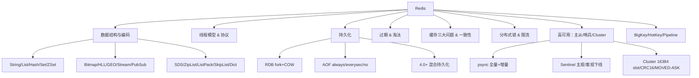
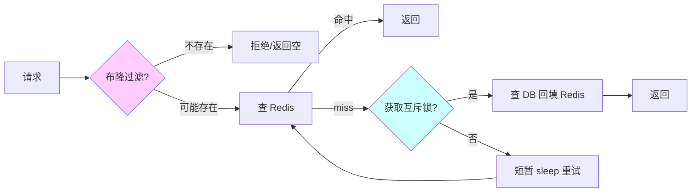
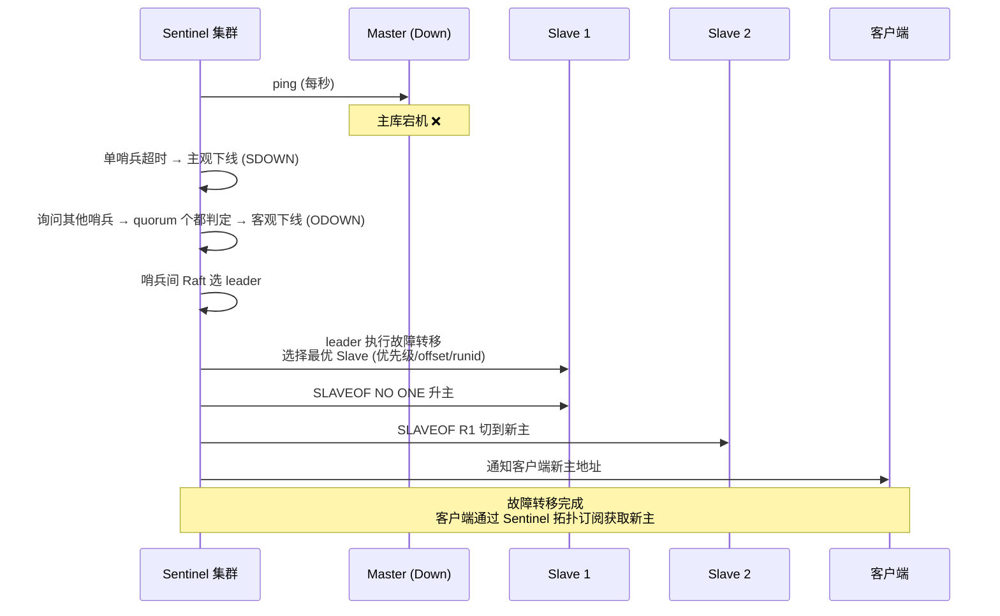

# 06 Redis · 速记知识图谱（P0-P3）

> 模块定位：高级岗"几乎必考"，考点密度仅次于 JVM 与并发。重点是**数据结构与编码 + 持久化 + 高可用（主从/哨兵/Cluster） + 缓存三大问题 + 分布式锁**。
> 题量：74 题。



### P0 必背核心

#### 5 大基础数据类型与底层编码
- **String**：底层是 SDS（Simple Dynamic String），编码有 **int**（能转 long 的纯数字）、**embstr**（≤44 字节，SDS 和 redisObject 连续分配一次 malloc）、**raw**（>44 字节，两次分配）。SDS 比 C 字符串多了 `len/alloc/flags`，O(1) 求长度、二进制安全、避免缓冲区溢出、预分配减少 realloc。
- **List**：3.2 起统一用 **quicklist**（双向链表 + 每个节点是 ZipList/ListPack），7.0 后节点用 ListPack，兼顾内存与遍历。
- **Hash**：元素少且小用 **listpack**（7.0 前是 ziplist，阈值 `hash-max-listpack-entries=128`、`hash-max-listpack-value=64`），超阈值转 **hashtable**（dict + 渐进式 rehash）。
- **Set**：纯整数且元素 ≤512 个用 **intset**（有序数组 + 二分），否则 7.0 用 listpack，再超用 **hashtable**。
- **ZSet**：元素 ≤128 且每个 ≤64 字节用 **listpack**（7.0 前 ziplist），超阈值转 **skiplist + dict** 双结构——skiplist 支持范围 O(logN)，dict 给 ZSCORE O(1)。
- 关联题：#0583、#0237、#0255、#0286、#0288、#0582、#0287、#0278、#1323、#1355

#### ZSet 为何选跳表而不是红黑树
- **范围查询**：跳表本身是有序链表，`ZRANGEBYSCORE` 只需找到起点后向后遍历，红黑树范围查找要中序遍历更复杂。
- **实现简单**：跳表代码量远小于红黑树，作者 antirez 明确说"红黑树平衡操作复杂、跳表更易调试"。
- **内存灵活**：通过调整 `p`（默认 1/4）平衡空间与时间，红黑树固定开销大。
- **并发友好**：跳表插入只改局部指针，理论上对并发友好（虽然 Redis 单线程不需要）。
- 与 ZipList/ListPack 的切换：小数据量用紧凑结构省内存（128/64 阈值），大数据量转跳表保性能。
- 关联题：#0288、#0286、#0743、#1355

#### 高级数据类型（位图/HLL/GEO/Stream/Pub-Sub）
- **Bitmap**：基于 String 的位操作，`SETBIT/GETBIT/BITCOUNT/BITOP`。典型场景：签到（一个用户一个 key、365 bit = 46 字节）、活跃用户、布隆过滤器底层。
- **HyperLogLog**：基数统计，**固定 12KB** 内存可统计 2^64 个元素，标准误差 0.81%。`PFADD/PFCOUNT/PFMERGE`。适合 UV 统计。
- **GEO**：底层是 ZSet，把经纬度通过 **GeoHash** 编码成 52 位整数当 score。`GEOADD/GEORADIUS/GEOSEARCH`。
- **Stream**（5.0+）：消息队列结构，支持消费者组、ACK、PEL（pending entries list），可解决 List+BLPOP 无消费组、Pub/Sub 无持久化的痛点。
- **Pub/Sub**：发布订阅，**消息不持久化**、订阅者不在线就丢，不能做可靠消息。
- 关联题：#0556、#0888、#0759、#0744

#### 单线程模型 & IO 多路复用
- **"单线程"指命令执行**：网络 I/O 和命令解析在一个主线程上，串行处理命令，因此命令本身天然原子。
- **为什么快**：① 纯内存；② 单线程避免锁竞争和上下文切换；③ I/O 多路复用 epoll（Linux）/kqueue（BSD）一个线程管多个 socket；④ 高效数据结构；⑤ 自实现事件循环 AE。
- **Redis 6.0 多线程**：**只多线程化网络读写和协议解析**，命令执行仍然单线程。配置 `io-threads 4`、`io-threads-do-reads yes`，4C 机器一般 2-3 个 IO 线程最优。
- **为什么不用多线程命令**：① CPU 不是瓶颈（瓶颈是网络和内存）；② 多线程引入锁会复杂化数据结构；③ 单线程语义简单。
- 关联题：#0055、#0527、#0526、#0599、#0610

```
Redis 6.0+ 单线程模型 + 多线程 IO：

  ┌──────────── 主线程 ────────────┐
  │                                  │
  │  事件循环 AE (单线程)             │
  │  ┌──────────────┐                │
  │  │ epoll_wait    │  ◄─── 监听数千 socket
  │  └──────┬───────┘                │
  │         │                        │
  │  ┌──────▼───────┐                │
  │  │ 命令解析+执行  │ ← 单线程串行(命令天然原子)
  │  │  GET/SET/HSET │                │
  │  │  ZADD/...    │                │
  │  └──────────────┘                │
  └──────────────────────────────────┘
            ▲
            │
  ┌─────────┴─────────┐
  │ IO 线程 (6.0+)     │ ← 只做网络读写 + 协议解析
  │ 默认 4 个 (可调)    │   命令执行仍单线程
  └───────────────────┘

为什么快：
  ① 纯内存                 ② 单线程无锁
  ③ epoll IO 多路复用       ④ 高效数据结构(压缩列表/跳表/SDS)
  ⑤ Pipeline 批量减少 RTT  ⑥ 6.0+ IO 多线程化网络层
```

#### 持久化：RDB + AOF + 混合
- **RDB**：二进制快照，`SAVE`（阻塞）或 `BGSAVE`（fork 子进程）。fork 后利用 **COW（Copy-On-Write）** 让子进程边写盘父进程边服务请求；fork 本身要复制页表，**大实例 fork 可能阻塞几百 ms**，是隐形雷区。
- **AOF**：追加每条写命令到日志文件，3 种刷盘策略：① `always`（每命令 fsync，最安全但最慢）；② `everysec`（默认，每秒 fsync，最多丢 1 秒）；③ `no`（交给 OS，性能最好但丢得多）。
- **AOF 重写**：`BGREWRITEAOF` fork 子进程根据当前内存状态生成最小命令集，父进程把重写期间新写入暂存到 `aof_rewrite_buf`，重写完合并。
- **4.0+ 混合持久化**：`aof-use-rdb-preamble yes`，AOF 文件头是 RDB 二进制（快速加载），尾巴是增量 AOF 命令（少丢数据）——重启加载速度从 AOF 的"几分钟"降到"几秒"。
- **结论**：Redis 不能 100% 不丢数据，最严格 `always` 也只是"系统调用返回前 fsync"，掉电仍可能丢；要强持久化用 MySQL。
- 关联题：#0230、#0229、#1325

#### 过期策略 + 内存淘汰策略
- **过期策略只有两种**：① **惰性删除**——读到 key 才判过期；② **定期删除**——`hz=10` 即每秒 10 次，每次从 `expires` 字典随机抽 20 个判，过期 >25% 继续抽，单次 ≤25ms。**没有定时删除**（每个 key 起定时器开销太大）。
- **被一批 key 同时过期会卡顿**：定期删除的循环会一直清理直到 <25%，命令处理延迟飙高——所以 TTL 要打散加随机扰动。
- **8 种内存淘汰策略**（`maxmemory-policy`）：
  - `noeviction`（默认，写报错）
  - `allkeys-lru / allkeys-lfu / allkeys-random`（全 key 范围内 LRU/LFU/随机）
  - `volatile-lru / volatile-lfu / volatile-random / volatile-ttl`（只在设了 TTL 的 key 中选，volatile-ttl 优先淘汰最快过期的）
- **近似 LRU**：Redis 不维护全局 LRU 链表，而是每个对象记 24bit 时钟，淘汰时**随机采样 5 个**（`maxmemory-samples=5`）选最久未用。
- **LFU**（4.0+）：用 8bit 计数器配合衰减，比 LRU 更适合长尾热点场景。
- 关联题：#0126、#0241、#0842、#1060、#1351、#0710

#### 缓存三大问题：穿透 / 击穿 / 雪崩
- **穿透**：查询**不存在**的数据，每次都打 DB。解决：① **布隆过滤器**前置（接受少量误判但不漏判）；② **空值缓存**（短 TTL 5 分钟）；③ 接口层参数校验、IP 限流。
- **击穿**：**热点单 key 过期瞬间**大量并发打 DB。解决：① **互斥锁**（`SETNX` + 双重检查，只让一个线程查 DB 回填）；② **逻辑过期**（永不过期，value 内嵌过期时间，发现过期就异步刷新）；③ 热点 key 永不过期 + 定时刷新。
- **雪崩**：**大批 key 同时过期** 或 **Redis 整体宕机**导致流量全打 DB。解决：① TTL 加随机扰动（如基础 60min + rand(0,10min)）；② 多级缓存（本地 Caffeine + Redis）；③ 熔断降级（Sentinel/Hystrix）；④ Redis 高可用（哨兵/Cluster）。
- 关联题：#0816、#0176、#0177、#0178、#1282、#0352、#1033

| 问题 | 表现 | 原因 | 解决方案 |
|---|---|---|---|
| **穿透** | 查不存在的 key | 恶意攻击/参数异常 | 布隆过滤器 + 空值缓存 + 参数校验 + 限流 |
| **击穿** | 单热点 key 过期 | 单点失效 + 高并发 | 互斥锁 + 双重检查 / 逻辑过期 / 永不过期 |
| **雪崩** | 大量 key 同时过期或 Redis 挂 | TTL 集中 / Redis 故障 | TTL 加随机 + 多级缓存 + 熔断 + 高可用 |



#### 缓存与数据库一致性
- **Cache Aside（旁路缓存，最常用）**：读，先查缓存没有再查 DB 回填；写，**先更新 DB 再删缓存**（不是更新缓存）。
- **为什么删而不更新**：① 更新需算最新值，浪费（很多冷数据）；② 并发下"A 更新 1→B 更新 2→B 写缓存 2→A 写缓存 1"出现脏数据。
- **为什么先 DB 后删缓存**：先删后写时若 DB 写慢，并发读会把旧值塞回缓存；先 DB 后删只在"读把旧值刚塞回 + 删未到达"窄窗口出问题。
- **延迟双删**：写时"删缓存 → 写 DB → 睡 500ms → 再删一次缓存"，覆盖读旧值的窗口；缺点是同步等待。
- **Canal 订阅 binlog**：DB 改 → binlog → Canal → MQ → 异步删缓存，**解耦且最终一致**，是大厂主流方案。
- **强一致**：得用分布式事务（2PC / Seata），但是会牺牲性能，Redis 场景一般接受最终一致。
- 关联题：#0218、#0219、#0144、#0622、#0636、#0773、#1263

#### 分布式锁实现要点
- **基础命令**：`SET key uuid NX PX 30000`——NX 互斥、PX 给超时防死锁、value 用 UUID 区分锁主。
- **释放锁必须用 Lua**：`if redis.call('get',KEYS[1])==ARGV[1] then return redis.call('del',KEYS[1]) end`——保证"判主 + 删除"原子，否则可能误删别人的锁（业务超过 TTL，别人拿到了锁，原持有者再 DEL）。
- **续约（WatchDog）**：Redisson 拿锁默认 30s TTL，每 10s（TTL/3）后台续到 30s，业务执行多久都不会过期，**业务结束 unlock 才停**；如果显式 `lock(10, SECONDS)` 传了超时则不续约。
- **可重入**：Redisson 用 **Hash** 而非 String，field = clientId+threadId、value = 重入计数，加锁 +1、解锁 -1，归零才删。
- **RedLock**：作者 antirez 设计的多主独立部署算法（向 N/2+1 个 Redis 同时申请），但 Martin Kleppmann 在博客抨击它依赖时钟同步且复杂——业内一般"普通 Redisson 锁就够，对正确性极致要求改用 ZK/etcd"。
- 关联题：#0139

#### 主从复制 + 哨兵 + Cluster
- **主从同步**：从库 `SLAVEOF`/`REPLICAOF` 主，主库 `BGSAVE` 生成 RDB + 期间命令缓冲（`repl_backlog`）发给从库，从库加载完 + 重放积压 = 数据一致；之后主库每条写命令通过**异步**复制流推给从。
- **psync**（2.8+）：增量同步基础。从库带 `runId + offset` 来，主库的 `repl_backlog`（环形缓冲）还在就增量同步，丢了就走全量。
- **PSYNC2**（4.0+）：主从切换或重启后仍能部分重同步——记录两个 replid，让新主继承旧主的复制流。
- **Sentinel 哨兵**：4 大功能——监控、通知、自动故障转移、配置中心。**主观下线**（单个哨兵 ping 不通超 `down-after-milliseconds`，默认 30s） vs **客观下线**（quorum 个哨兵都判主观下线）。哨兵之间也走 Raft 选 leader 来执行故障转移。
- **Cluster**：去中心化，**16384 个 slot**，key 通过 `CRC16(key) mod 16384` 定位。客户端连任一节点，命中本节点直接执行，否则返回 **MOVED**（永久迁移）或 **ASK**（迁移中临时跳）让客户端重定向。节点间用 **Gossip** 协议传播状态。
- **为什么是 16384 不是 65536**：① 心跳包带 slot bitmap，16384 bit = 2KB，65536 是 8KB 太大；② Redis 集群推荐节点 ≤1000，16384 足够分；③ 压缩率：节点少时 bitmap 压缩后更小。
- 关联题：#0203、#0640、#1352、#1073



```
Cluster 16384 slot 分配：

  Slot:    0────────────5460────────────10922────────────16383
           │              │                  │                 │
           ▼              ▼                  ▼                 ▼
        Node A         Node B            Node C            (Node D)
      (5461 slots)   (5462 slots)      (5461 slots)
      
  key 路由：slot = CRC16(key) mod 16384
  
  客户端请求落错节点：
    ┌──────────┐                ┌──────────┐
    │ Client   │ -- GET k1 --►  │ Node A   │
    └──────────┘                │ 检查 slot │
         ▲                       │ 不在本节点│
         │ MOVED 7000 NodeB:6380│
         └────────────────────── └──────────┘
              重定向到 Node B 重试
              
  迁移中临时跳：ASK 重定向 (一次性)
```

### P1 加分高频

#### Redis 6.0 为什么引入多线程
- 网络 IO 在大 value、高并发下成为瓶颈：Read/Write `recvfrom/sendto` 系统调用本身耗时（用户态-内核态拷贝），单线程吃满。
- 6.0 把 read、parse、write 卸载到 IO 线程组（默认关闭，需 `io-threads-do-reads yes` 才并行 read），**命令执行仍单线程**——这样无需改数据结构、不引入锁，又能提升吞吐。
- 适用场景：大 value（KB 级以上）、高并发短连接——8C 机器实测 QPS 提升 1-2 倍。小 value、低并发不开反而上下文切换更亏。
- 关联题：#0526、#0599

#### ZipList 级联更新 & ListPack 解决方案
- **ZipList**：连续内存的紧凑数组，每个 entry 头部有 `prevlen`（前一个 entry 的长度）。`prevlen` 字段长度根据前节点大小**变长**——前 <254 字节占 1 字节，否则 5 字节。
- **级联更新**：插入/删除让某个 entry 长度从 <254 变到 ≥254，下一个 entry 的 `prevlen` 从 1 字节扩 5 字节，**该 entry 自己长度也变了**，再级联触发下下个 entry 扩——最坏 O(N)。
- **ListPack**（5.0+，替代 ZipList）：每个 entry 头部不再记"前节点长度"，而是记"**本节点长度**"放在尾部，从任一端遍历都行，**彻底消除级联更新**。7.0 在 Hash/ZSet/List quicklist 中全面替换 ZipList。
- 关联题：#0278、#0287、#0255

#### 渐进式 rehash
- Redis dict 内部维护两张表 `ht[0]、ht[1]`，扩容时给 `ht[1]` 分配 2 倍空间，**不一次性迁移**。
- 每次增删改查都顺手迁移一个桶（`rehashidx` 递增），同时 `serverCron` 定期辅助 rehash。
- **rehash 期间**：写直接进 `ht[1]`、查先查 `ht[0]` 再查 `ht[1]`，删两边都查。
- 目的：避免大 hash（百万级 key）一次性 rehash 阻塞主线程几秒。
- 关联题：#1354

#### 事务 MULTI/EXEC vs Lua
- **MULTI/EXEC**：把多个命令打包，EXEC 时**顺序执行**，期间不被其他命令打断；命令入队语法错（编译错）整个事务不执行，**运行时错（如对 String 用 LPUSH）只让那条命令失败，其他命令继续——不支持回滚**。
- **为啥不支持回滚**：作者 antirez 认为运行时错都是程序员 bug、不该靠 DB 兜底；回滚需要 undo log，简化设计。
- **WATCH 乐观锁**：`WATCH key` 后被改了，EXEC 返回 nil，需业务重试（CAS）。
- **Lua 原子**：脚本作为一个命令在主线程串行执行，期间不会被打断，比事务更强；可用 `KEYS[]/ARGV[]` 传参、可有逻辑分支。
- **Cluster 中限制**：Lua/事务里所有 key 必须在同一 slot，否则报 CROSSSLOT，用 **hash tag** `{tag}key1 {tag}key2` 强制落同一 slot。
- 关联题：#0030、#0063、#0853、#1324、#1345、#1338、#1341

#### Pipeline 与批量命令对比
- **Pipeline**：客户端攒一批命令一次性发、再一次性收响应，**减少 RTT**（N 次 RTT → 1 次 RTT）；服务端**不保证原子**（中间可能插入别人的命令）。
- **MGET/MSET**：原生批量，原子（单命令）但只对 String 类型。
- **Lua**：原子 + 任意逻辑，但要写脚本、Cluster 限制 slot。
- 选型：纯批量读写用 MGET/MSET；不同类型命令组合用 Pipeline；要原子用 Lua。
- 关联题：#1348

#### 集群脑裂与 min-slaves 配置
- **脑裂**：网络分区让 Master 与哨兵+Slave 分隔，哨兵选出新 Master，老 Master 还在接客户端写——网络恢复后老 Master 变 Slave，期间写入被全量同步覆盖丢失。
- **缓解**：① `min-slaves-to-write 1`（至少 1 个从库连着才允许写）；② `min-slaves-max-lag 10`（从库延迟 ≤10s）——两个都不满足主库拒写，限制脑裂期间损失。
- **不能彻底解决**：网络抖动时仍有"窗口"，最终一致的代价。强一致请用 ZK/etcd。
- 关联题：#1352

#### BigKey / HotKey
- **BigKey 影响**：① 阻塞主线程（DEL 大 List 几秒）；② 网络打满（一次 GET 几 MB）；③ 持久化和迁移卡顿；④ 集群 slot 倾斜。
- **定位**：`redis-cli --bigkeys` 抽样扫描（不阻塞）、`MEMORY USAGE key`、RDB 离线分析（rdr/rdb-tools）。
- **删大 key**：4.0+ 用 `UNLINK`（异步释放，主线程只删 dict 引用，后台线程真正 free）。
- **HotKey 影响**：单节点 CPU 打满、集群不均衡。
- **定位**：`redis-cli --hotkeys`（要求 LFU 策略）、`MONITOR` 抽样、proxy 层统计。
- **解决**：① 本地缓存兜一层；② key 分片（`hotkey_1...hotkey_N` 客户端随机读）；③ 读写分离从库分担读。
- 关联题：#0827、#0828

#### 限流：令牌桶 + 滑动窗口
- **固定窗口**：`INCR counter`+`EXPIRE`——简单但临界点双倍流量问题。
- **滑动窗口**：用 ZSet，score 为时间戳，每次 `ZADD now now` + `ZREMRANGEBYSCORE 0 (now-window)` + `ZCARD` 判限制——Lua 包一下保原子。
- **令牌桶**：Lua 维护 `tokens + lastRefillTime`，每次请求按时间差补 token、扣 1。
- **漏桶**：Redis-Cell 模块（GCRA 算法）开箱即用。
- 关联题：#1350、#1344

#### Redis 是 AP 还是 CP
- **Cluster 是 AP**：异步复制 + 分区可用，可能丢已 ack 的写（主挂前未同步到从）。
- 想要 CP 得用 ZK/etcd。Redis 设计取舍：业务大多容忍少量丢失换性能。
- 关联题：#0640

### P2 深度延伸

#### 通信协议 RESP
- Redis 自己设计的二进制安全文本协议：`*3\r\n$3\r\nSET\r\n$3\r\nfoo\r\n$3\r\nbar\r\n`。
- **5 类**：简单字符串（`+OK`）、错误（`-ERR`）、整数（`:1`）、批量字符串（`$3\r\nfoo`）、数组（`*2\r\n...`）。
- RESP3（6.0+）：增加 Map、Set、Boolean、Double、Big number 等类型，支持推送（用于客户端缓存）。
- 关联题：#0610

#### 客户端缓存（Client-side caching, 6.0+）
- `CLIENT TRACKING ON`：Redis 维护"哪个 key 被哪个客户端读过"，key 变了主动推送失效通知，客户端可以放心本地缓存。
- 模式：**默认模式**（服务端记每个 key 跟踪表）、**广播模式**（按前缀订阅）。
- 关联题：#1263、#0651

#### Memcached 对比
- **数据类型**：Memcached 只有 String，Redis 5 大类 + Stream/HLL。
- **持久化**：Memcached 无（重启全丢），Redis 有 RDB/AOF。
- **线程**：Memcached 多线程，Redis 单线程命令（6.0 多线程 IO）。
- **集群**：Memcached 客户端一致性 hash，Redis 服务端 slot 路由。
- **内存管理**：Memcached slab 分配避免碎片，Redis jemalloc。
- 关联题：#0598

#### 内存碎片
- 申请 16 字节实际给 32 字节槽位 → 碎片。Redis `info memory` 的 `mem_fragmentation_ratio = used_memory_rss / used_memory`，>1.5 严重。
- 4.0+ 主动碎片整理 `activedefrag yes` + `active-defrag-threshold-lower 10`，jemalloc 配合做整理（暂停部分操作 move 对象）。
- 关联题：#0272

#### 集群代理对比
- **Twemproxy**（Twitter，已停更）：代理层 hash 路由，不支持在线扩容、不支持 MULTI 跨 slot。
- **Codis**（豌豆荚）：proxy + zk + dashboard，1024 slot，**支持在线迁移和扩容**——Cluster 出来前的事实标准。
- **Redis Cluster**：官方原生、去中心化、16384 slot——现在主流。
- 关联题：#0203

#### 跨 slot Lua 与 hash tag
- Cluster 中 Lua 脚本所有 key 必须同 slot。用 hash tag：`user:{1001}:profile` 和 `user:{1001}:orders` 因 `{1001}` 相同必落同 slot。
- 关联题：#1338、#1341

#### SCAN 安全遍历
- `KEYS *` 阻塞主线程（百万 key 卡几秒），生产禁用。
- `SCAN cursor MATCH pattern COUNT 100`：游标式遍历，**不保证不重复但保证不漏**（rehash 中也安全，用了高位反转游标）；COUNT 是 hint 不是精确返回数。
- 类似 `HSCAN/SSCAN/ZSCAN`。
- 关联题：#1340

#### 跳表实现细节
- 每个节点随机层数（geometric distribution，`p=1/4`），最高 32 层；查找从顶层向右、不行向下。
- ZSet 跳表节点同时含 `score` 和 `obj`，按 score 升序，score 相同按 obj 字典序。
- 反向指针：Redis 跳表第 1 层是双向链表，支持 `ZREVRANGE` 反向遍历。
- 关联题：#1355、#0286

#### Bloom Filter / Cuckoo Filter
- **Bloom**：bitmap + k 个 hash 函数，有假阳性无假阴性，**不能删除**（删一个会影响共用 bit 的其他元素）。
- **5 亿数据估算**：误判 1%，每元素约 9.6 bit ≈ 5 亿 × 9.6 / 8 ≈ 600MB；要 0.1% 约 900MB。
- **Counting Bloom**：bit 改成 4bit counter，能删但占 4 倍空间。
- **Cuckoo Filter**：两个候选桶 + 指纹存储，**支持删除**、查询比 Bloom 快、空间相近。
- 关联题：#0176、#0177、#0178、#0352、#1282

#### 多级缓存
- 浏览器缓存 → CDN → Nginx 本地（Lua + shared dict）→ 应用本地（Caffeine） → Redis → DB。
- 一致性：Redis 删除时通过 MQ 广播让所有应用节点失效本地缓存；或本地缓存 TTL 短（1 分钟内最终一致）。
- 关联题：#0144、#0622、#0636、#0773、#0493、#0732

### P3 冷门刁钻

#### 为什么 InnoDB 用 B+ 不用跳表 / Redis 反过来
- InnoDB 数据在磁盘，**B+ 树扇形高、层数低（3-4 层覆盖亿级数据），减少磁盘 IO**；跳表层数 logN，亿级要 27 层，每层一次 IO 太亏。
- Redis 数据在内存，没有磁盘 IO 顾虑，**跳表实现简单**就够了。
- 关联题：#0743

#### 延迟队列实现
- ① **ZSet**：score = 触发时间戳，`ZRANGEBYSCORE 0 now LIMIT 0 1` 轮询；
- ② **Stream + Consumer Group + XCLAIM**：自然消息队列 + 延迟可控；
- ③ **Keyspace Notification**：开启 `notify-keyspace-events Ex` 监听过期事件——但过期事件丢失率高且性能差，生产不推荐。
- 关联题：#0760

#### Redis 8.0 新特性（2025）
- 协议改回 **AGPLv3**，回归开源；
- 新增 8 个数据类型：Vector Set（向量检索，AI 场景）、原生 JSON、TimeSeries、Bloom/Cuckoo/Count-Min Sketch/TopK/t-digest（概率数据结构原生集成，不再要 RedisBloom 模块）；
- IO 多线程优化吞吐 +112%、90 个常用命令延迟降 5-87%；
- Redis Flex（DRAM + SSD 混合存储，省 80% 成本）。
- 关联题：#0334

#### 虚拟内存（VM，已废弃）
- 2.4 前有过 VM 把冷数据 swap 到磁盘，但实测严重影响性能，**2.6 之后废弃**，作者建议用 maxmemory + LRU 替代。
- 关联题：#0874

#### MESI 缓存一致性
- 不是 Redis 概念，是 CPU 多核 cache 一致性协议：Modified/Exclusive/Shared/Invalid 四态，通过总线嗅探维护各核 L1/L2 一致。Java volatile、CAS 底层依赖。
- 关联题：#0732

#### Best Practice 速记
- key 命名 `业务:实体:id`、长度控制，value 避免大对象；
- 区分热冷数据，热数据走 Redis、冷数据回 DB；
- 写命令避免 `KEYS *`、避免大 List `LRANGE 0 -1`；
- TTL 必须设、随机扰动避免雪崩；
- 监控 `info` + `slowlog get 10`，慢日志阈值 `slowlog-log-slower-than 10000` 微秒；
- 关联题：#0729、#1349

### 跨模块联想

- **Redis 单线程模型** ↔ **03 并发**：epoll + Reactor 与 Java NIO 的 Selector 同源，Netty 即此模式。
- **AOF fsync** ↔ **05 MySQL**：等价于 InnoDB redo log 的 `innodb_flush_log_at_trx_commit` 三档（0/1/2），思想完全一致。
- **跳表 vs B+ 树** ↔ **05 MySQL**：InnoDB 索引选 B+ 的根本原因是"磁盘 IO 成本"，Redis 选跳表因"全内存"。
- **分布式锁** ↔ **09 分布式**：Redisson WatchDog 续约思路与 ZK 临时节点 session 续约本质都是"租约"；强一致场景应用 ZK/etcd 而非 Redis。
- **缓存一致性 Canal** ↔ **08 消息队列**：binlog → MQ → 异步删缓存，是大厂典型异步解耦方案。
- **HotKey/BigKey** ↔ **16 性能调优**：从压测、监控、Arthas trace 切入定位。
- **布隆过滤器** ↔ **08 消息队列**：消息去重、爬虫 URL 去重也是它的典型用途。
- **Redis 持久化** ↔ **02 JVM**：fork + COW 期间页表复制和 dirty page 重写，与 G1 RSet/Write Barrier 概念类似——都是用"屏障 + 副本"换并发。

---
