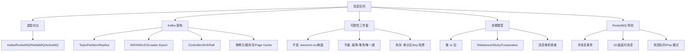
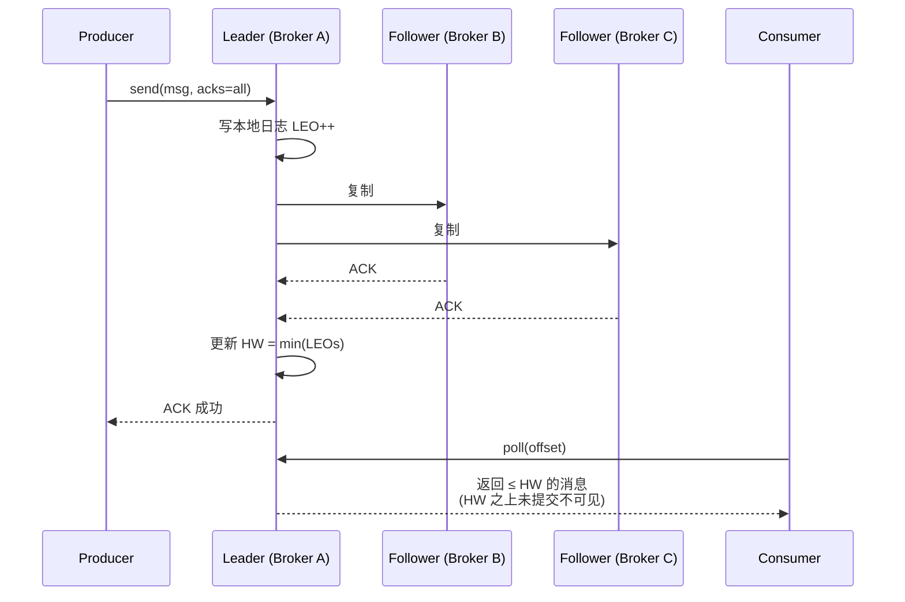
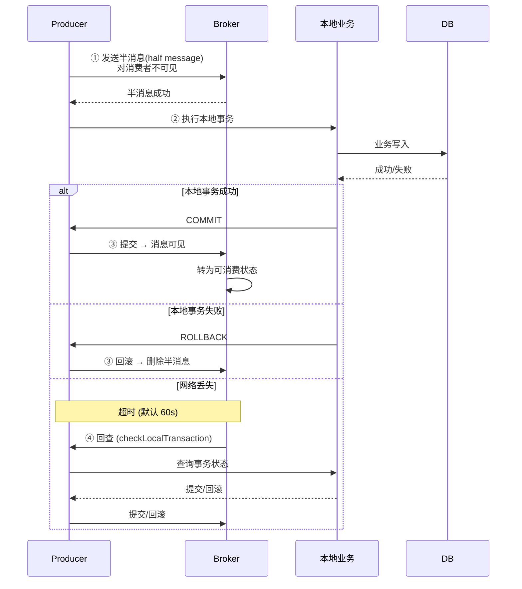

# 07 消息队列 · 速记知识图谱（P0-P3）

> 模块定位：高并发系统的"血管"，几乎所有中大型项目的标配。重点是 **Kafka 架构与高吞吐原理 + 三大可靠性（不丢/不重/有序）+ RocketMQ 事务消息与延时消息 + 消费组 Rebalance**。
> 题量：51 题。



### P0 必背核心

#### 三大 MQ 选型对比（Kafka / RocketMQ / RabbitMQ）
- **Kafka**：吞吐冠军（百万 TPS/单机），延迟数十毫秒，**partition 内顺序**，无原生延时消息（只有定时消息要 KIP-746/外置时间轮），社区最活跃。适合**日志、埋点、流计算、大数据管道**。
- **RocketMQ**：吞吐 10 万级，延迟毫秒级，**支持事务消息（半消息 + 回查）+ 18 级延时消息 + 顺序消息 + 消息过滤**，阿里电商场景孵化。适合**金融、订单、交易**。
- **RabbitMQ**：吞吐万级，延迟微秒级（最低），**Erlang 实现**，路由灵活（4 种 Exchange：direct/topic/fanout/headers），插件丰富（延时 plugin、shovel、federation）。适合**复杂路由、中小型业务、企业内部系统**。
- **ActiveMQ**：JMS 老牌，社区凉了，新项目不选。
- 协议层面：Kafka 用自研二进制协议，RocketMQ 用自研 Remoting，RabbitMQ 用 AMQP 0-9-1，ActiveMQ 兼容 JMS/AMQP/STOMP/MQTT。
- 一句话选型：**埋点流量选 Kafka，订单交易选 RocketMQ，企业总线选 RabbitMQ**。
- 关联题：#1316、#1321、#0064

#### Kafka 整体架构（Broker / Topic / Partition / Replica / ISR）
- **逻辑层**：Topic 是逻辑概念，划分为 N 个 **Partition**（分区）实现水平扩展和并行消费。每个 Partition 是一个**有序、不可变、追加写**的日志（segment 文件）。
- **物理层**：每个 Partition 有 1 个 Leader + N 个 Follower（**Replica 副本**），生产/消费只走 Leader，Follower 异步/同步拉取数据。
- **ISR（In-Sync Replica）**：和 Leader 保持同步的副本集合。Follower 落后 Leader 超过 `replica.lag.time.max.ms`（默认 30s）会被踢出 ISR 进入 OSR。Leader 挂了从 ISR 选新 Leader。
- **HW（High Watermark）**：消费者最多能看到的 offset，等于 **ISR 中所有副本最小的 LEO**。LEO（Log End Offset）是分区下一条待写消息的 offset。
- **Controller**：Broker 中选一个作为 Controller，负责 Leader 选举、分区状态机、Topic 增删。Controller 选举原来靠 ZK 抢临时节点，**KRaft 模式**（Kafka 2.8 引入，3.3 GA，3.5 默认）用 Raft 协议替代 ZK，运维更简单、元数据更快、单集群 partition 数从 20 万扩到百万级。
- 关联题：#0258、#1303、#1304、#1305、#1308

```
Topic: orders (3 个 Partition)

  Partition 0:       Partition 1:        Partition 2:
  ┌─────┐            ┌─────┐             ┌─────┐
  │ msg0│            │ msg0│             │ msg0│
  │ msg1│            │ msg1│             │ msg1│        每个 partition 内有序
  │ msg2│            │ msg2│             │ msg2│        partition 间无序
  │ ... │            │ ... │             │ ... │
  └─────┘            └─────┘             └─────┘
   ↑ LEO              ↑ LEO              ↑ LEO         LEO = 下一条待写位置
   ↑ HW               ↑ HW               ↑ HW          HW = 消费者可见上限

  ISR = {Leader, Follower1, Follower2}  ← 都在 30s 内追上
  OSR = {Follower3}                      ← 落后被踢出

  Broker A          Broker B          Broker C
  P0-Leader         P0-Follower       P0-Follower    ← partition 0 副本
  P1-Follower       P1-Leader         P1-Follower    ← partition 1 副本
  P2-Follower       P2-Follower       P2-Leader      ← partition 2 副本
  
  Producer/Consumer 只跟 Leader 交互, Follower 拉取复制
```



#### Kafka 为什么这么快（5 大杀手锏）
- ① **顺序写磁盘**：Partition 文件追加写，机械盘顺序写可达 600MB/s，比随机写快 6000 倍。
- ② **零拷贝（sendfile）**：传统读文件→用户态→Socket 需 4 次拷贝 + 4 次上下文切换。`sendfile` 直接 DMA 把 PageCache 数据扔到网卡，**2 次拷贝、2 次切换**。Kafka 用 `FileChannel.transferTo`。注意：开启 SSL/消息转换会破坏零拷贝。
- ③ **Page Cache**：消息先写 Page Cache，由 OS 异步刷盘，读多写少时读直接命中 Page Cache 不走磁盘。JVM 堆只存元数据，GC 压力小。
- ④ **批量 + 压缩**：Producer 端用 `batch.size`（默认 16KB） + `linger.ms` 攒批；支持 gzip/snappy/lz4/zstd 压缩，**压缩在 Producer 端做，Broker 不解压直接存，Consumer 端解压**，端到端节省 CPU。
- ⑤ **分区并行**：N 个 partition 同时读写，消费组内 N 个 consumer 并行消费。
- 关联题：#1313、#1306、#0195

#### Kafka 消息可靠性（三个环节都要保证）
- **生产端**：
  - `acks=0`：发了就算成功，最快但可能丢；`acks=1`：Leader 写入就算成功，Leader 宕机切换可能丢；`acks=all`（或 -1）：等 ISR 全部确认。
  - `min.insync.replicas=2`：配合 `acks=all`，ISR 副本数 < 2 时写入抛 `NotEnoughReplicasException`。否则 ISR 只剩 Leader 一个时，`acks=all` 等同于 `acks=1`。
  - `retries=Integer.MAX_VALUE` + `enable.idempotence=true`：开启**幂等 Producer**，Broker 用 (PID, partition, seqNum) 去重，**单分区 Exactly-Once**。
  - 事务 Producer：`transactional.id` + `initTransactions/beginTransaction/commitTransaction`，跨分区原子写。
- **Broker**：`replication.factor=3`、`min.insync.replicas=2`、`unclean.leader.election.enable=false`（禁止非 ISR 副本当 Leader，避免数据丢失）、`log.flush.interval.messages/ms`（默认靠 OS 刷盘，可调）。
- **消费端**：关闭自动提交 `enable.auto.commit=false`，**业务处理成功后手动 `commitSync`**。坑点：自动提交是定时（默认 5s）提交，处理失败也会提交导致丢消息。
- **Kafka 没办法 100% 不丢**：极端场景下 `acks=all + min.isr=2 + 禁止 unclean election` 仍可能丢——比如 ISR 内所有副本同时宕机且 Page Cache 未刷盘。**真要 100% 得同步刷盘**，但性能腰斩。
- 关联题：#1312、#1307、#0092、#0322

#### RocketMQ 消息可靠性
- **生产端**：3 种发送模式——同步（默认，等 SendResult）、异步（回调）、单向（fire-and-forget，不推荐）。失败默认重试 2 次。
- **Broker 端**：`flushDiskType=SYNC_FLUSH` 同步刷盘 vs `ASYNC_FLUSH` 异步刷盘；主从同步用 `brokerRole=SYNC_MASTER`（同步复制）vs `ASYNC_MASTER`。金融级双同步=同步刷盘 + 同步复制。
- **消费端**：消费成功才返回 `CONSUME_SUCCESS`，失败返回 `RECONSUME_LATER`，RocketMQ 把消息发到 **%RETRY%ConsumerGroup** 队列按 18 级延时重试，**16 次失败后进死信队列 %DLQ%ConsumerGroup**。
- 关联题：#0315、#0093

#### 消息重复消费 & 幂等设计
- **MQ 都是 At least once，重复是常态**：网络抖动、消费 ack 丢失、Rebalance 都会重发。
- **幂等四件套**：
  - ① **唯一键去重**：业务表加唯一索引（订单号、流水号），重复插入抛唯一约束异常，业务层 catch 后返回成功。
  - ② **状态机**：订单只能 待支付→已支付→已发货，逆向流转直接拒绝。`UPDATE order SET status='paid' WHERE id=? AND status='unpaid'`，影响行数 0 说明已处理。
  - ③ **Token 机制**：业务前端先申请 token（Redis SETNX），消费时校验 token 存在并删除，类似防重复提交。
  - ④ **分布式锁**：消息 ID 当锁 key 加锁后处理，处理完释放，锁 TTL > 消息处理时长。
- **去重表**：消息消费前查 `msg_consume_log(msg_id)` 表，已存在跳过，处理完插入。和业务表放同库做本地事务防"处理完未记日志"。
- 关联题：#0318、#0303、#1126、#1311

#### 消息顺序性
- **全局顺序**：整个 Topic 只能 **1 个 Partition**，吞吐严重受限，慎用。
- **分区顺序（业务顺序）**：按业务键（如订单号、用户 ID）哈希到同一 partition，**生产者指定 key**，Kafka `DefaultPartitioner` 用 murmur2 哈希。RocketMQ 用 `MessageQueueSelector`，常用 `SelectMessageQueueByHash`。
- **消费端坑**：即使消息按顺序到 Broker，消费者多线程消费仍会乱序。解决：① 单线程消费；② 内存 hash 池——按 key 路由到固定线程（disruptor 思路），同 key 串行、不同 key 并行。
- **场景**：订单状态流转（创建→支付→发货→签收）、binlog 同步、IM 消息。
- 关联题：#1296、#1309、#0140、#0824

#### 消息堆积排查与治理
- **三步定位**：
  - ① **看分区/消费者比例**：Kafka consumer 数 > partition 数没用（多出的 consumer 空闲）；consumer 数 < partition 数则单 consumer 扛多分区。
  - ② **看消费 lag**：`kafka-consumer-groups.sh --describe`，RocketMQ 看控制台堆积量。
  - ③ **看消费耗时**：单条处理 > 100ms 就要怀疑下游慢 SQL/RPC 超时。
- **治理手段**：
  - **临时扩容消费者**（前提：partition 够）；
  - **partition 不够**：临时启个 consumer 把堆积消息转发到新 Topic（partition 翻倍），再起 N 个 consumer 消费新 Topic；
  - **降级**：非核心消息直接丢弃或落库异步处理；
  - **限流**：上游生产端令牌桶限流。
- **预防**：生产端流量预估留 3 倍 buffer，消费端核心业务异步化、批量处理（Kafka 用 `max.poll.records`，一次拉 500 条批量入库 100x 提升）。
- 关联题：#0045、#1231、#0321、#0852



#### RocketMQ 事务消息（半消息 + 本地事务 + 回查）
- **5 步流程**：
  - ① Producer 发**半消息（half message）**到 Broker，写入特殊 Topic `RMQ_SYS_TRANS_HALF_TOPIC`，**对 Consumer 不可见**。
  - ② Broker 返回半消息发送成功。
  - ③ Producer 执行**本地事务**（如扣库存、写订单表）。
  - ④ Producer 根据本地事务结果，向 Broker 发 **commit/rollback** 给半消息盖个章。commit 后消息转到原 Topic，Consumer 可见；rollback 则删除半消息。
  - ⑤ 如果 Producer 宕机、commit/rollback 丢失，Broker 定时（默认 60s）**回查（check）** Producer：实现 `checkLocalTransaction` 接口告诉 Broker 本地事务最终状态。最多回查 15 次。
- **本质**：把"发 MQ + 本地事务"原子化，避免"扣了库存但消息没发"。
- 对比 Kafka 事务消息：Kafka 事务是**跨分区原子写**（用于"消费-处理-生产"原子链路），不是 RocketMQ 这种业务半消息。
- 关联题：#1298、#0673、#1205、#1302

#### Kafka 消费组 Rebalance
- **触发条件**：① 消费者数量变化（加入/退出/崩溃）；② Topic 分区数变化；③ Consumer 心跳超时 `session.timeout.ms`（默认 45s）；④ `max.poll.interval.ms`（默认 5min）内没调 poll。
- **三阶段**：JoinGroup → SyncGroup → 心跳维持，由 **GroupCoordinator**（某个 Broker 角色，按 `__consumer_offsets` 的分区 leader 选出）协调。
- **分配策略**：
  - `RangeAssignor`（默认，按 Topic 范围分，可能不均）；
  - `RoundRobinAssignor`（轮询，相对均匀）；
  - `StickyAssignor`（**黏性分配**：尽可能保持原分配不变，减少抖动）；
  - `CooperativeStickyAssignor`（**渐进式/协作式 Rebalance**，Kafka 2.4+）：把 Stop-The-World 改成增量——只回收要变动的 partition，其他 consumer 不停消费，**避免长时间全组暂停**。
- **Rebalance 的痛**：① STW 期间所有 consumer 停止消费；② 重复消费（partition 易主，offset 未及时提交）；③ 频繁 rebalance 把消费组卡死。**生产强烈推荐 CooperativeStickyAssignor + 合理调大 session.timeout.ms**。
- 关联题：#1310、#1300、#1301、#0281

### P1 加分高频

#### Kafka 高水位 HW 与 Leader Epoch
- **HW = min(ISR.LEO)**：HW 之前的消息所有 ISR 副本都有，可被消费。LEO 是单副本下一条要写的 offset。
- **HW 截断的数据丢失/不一致 Bug**：旧版本 Follower 重启后会先把日志截断到 HW，再向 Leader 拉数据。如果 Leader 也宕机，新 Leader 是旧 Follower，HW 比旧 Leader 小，已提交数据可能丢；或者两副本"分裂"后选出的 Leader 数据更老，造成数据不一致。
- **Leader Epoch（Kafka 0.11+ 引入）**：每次 Leader 变更 epoch +1，Follower 重启时不再无脑按 HW 截断，而是带着自己最后的 epoch 向 Leader 询问 "这个 epoch 的最大 offset 是多少"，按真实数据边界截断。**彻底修复 HW 截断引起的数据丢失/不一致**。
- 关联题：#1305

#### Kafka 数据存储结构
- 每个 Partition 由多个 **Segment 文件**组成，文件名是该 segment 第一条消息的 offset（如 `00000000000000000000.log`）。默认每个 segment 1GB（`log.segment.bytes`）。
- 配套 3 个文件：`.log`（数据） + `.index`（offset 索引，稀疏） + `.timeindex`（时间戳索引）。索引稀疏（默认每 4KB 一条索引），用二分查找定位。
- **过期清理**：① 按时间（`log.retention.hours`，默认 168h）；② 按大小（`log.retention.bytes`）；③ **日志压缩**（`cleanup.policy=compact`）——同 key 只保留最新一条，用于 `__consumer_offsets`、CDC 状态表。
- 关联题：#0195、#0236

#### Kafka 几种选举
- ① **Controller 选举**：Broker 启动时抢 ZK 的 `/controller` 临时节点，谁抢到谁是 Controller（KRaft 模式用 Raft）。
- ② **Partition Leader 选举**：由 Controller 从 ISR 中选第一个（按 AR 顺序），如果 ISR 空：`unclean.leader.election.enable=true` 从 OSR 选（可能丢数据），`false` 则等 ISR 恢复。
- ③ **Consumer GroupCoordinator** 不是选举，而是按 `groupId.hashCode() % 50` 路由到 `__consumer_offsets` 某个 partition 的 leader broker。
- ④ **Consumer Leader**：GroupCoordinator 在 JoinGroup 时把第一个加入的 consumer 选为 leader，由它执行分配算法。
- 关联题：#1308

#### RocketMQ 架构
- **4 大组件**：NameServer（无状态注册中心，Broker 路由表）+ Broker（消息存储，主从）+ Producer + Consumer。NameServer 间**互不通信**，Broker 每 30s 向所有 NameServer 上报心跳。
- **存储模型**：所有 Topic 的消息混合写入 **CommitLog**（顺序写、单文件 1GB）。每个 Topic 的每个 Queue 维护 **ConsumeQueue 索引**（指向 CommitLog 中的 offset），实现"一份数据多份索引"。**IndexFile** 提供按 key 或时间范围查询。
- **集群模式**：① 单 Master（测试）；② 多 Master 无 Slave（可用性 OK 但故障期间消息不可读）；③ 多 Master 多 Slave 异步复制（性能好，有丢消息风险）；④ 多 Master 多 Slave 同步双写（强一致，性能略低）；⑤ DLedger（基于 Raft 自动主从切换，4.5+）。
- 关联题：#1294、#1299、#1295

#### RocketMQ 延时消息
- **18 个延时级别**（默认）：`1s 5s 10s 30s 1m 2m 3m 4m 5m 6m 7m 8m 9m 10m 20m 30m 1h 2h`。
- **实现**：发送时 `msg.setDelayTimeLevel(N)`，Broker 把消息存到 **SCHEDULE_TOPIC_XXXX** 内部 Topic，按延时级别分 18 个队列。后台 `ScheduleMessageService` 定时扫描，到点把消息转回原 Topic。
- **缺点**：只支持固定级别，不支持任意延时。
- **RocketMQ 5.0 任意时长延时**：基于时间轮（TimerWheel），最长 40 天，精度秒级。
- **Kafka 没原生延时消息**：方案——① 死信队列 + TTL；② 自建时间轮（如美团 push 服务）；③ 落库 + 定时扫描。
- 关联题：#1297

#### 死信队列 DLQ
- **定义**：消费失败到达上限后无法被正常消费的消息隔离队列，避免毒消息阻塞消费组。
- **RabbitMQ**：通过 `x-dead-letter-exchange` 和 `x-dead-letter-routing-key` 绑定死信交换机。死信触发条件：消息被 `nack`/`reject` 且 `requeue=false`、消息 TTL 到期、队列长度超限。**常用于实现延时队列**（消息 TTL + DLQ）。
- **RocketMQ**：%DLQ%ConsumerGroup 队列，重试 16 次后自动进入。需要人工干预（修复代码后重发或丢弃）。
- 关联题：#1151

#### 推 vs 拉模式
- **推（Push）**：Broker 主动推给 Consumer。优点：实时性好。缺点：Broker 不知道 Consumer 处理能力，**可能压垮 Consumer**。
- **拉（Pull）**：Consumer 主动拉。优点：Consumer 按自己节奏拉，可控；批量拉吞吐高。缺点：实时性差（轮询间隔）、Consumer 要自己维护 offset。
- **Kafka**：纯拉模式（Consumer poll），用**长轮询（Long Polling）** 弥补实时性——Broker 收到 fetch 请求时如果没消息，会 hold 住直到有数据或超时（`fetch.max.wait.ms` 默认 500ms）。
- **RocketMQ**：本质拉，但 PushConsumer **底层是 Broker 长轮询 + Consumer 内部拉取后回调**，对用户看起来像推。
- **RocketMQ 5.0 Pop 模式**：相对传统的 Push（基于 Queue 绑定 Consumer）模式，**Pop 模式让多个 Consumer 共享 Queue**——Consumer 调 Pop 接口"取消息"，Broker 用消息维度的不可见窗口（invisible time）。优势：① 单 Queue 多 Consumer 并行，**消费能力不再受限于 Queue 数**；② Consumer 宕机不引发 Rebalance。类似 SQS 的可见性超时。
- 关联题：#0873、#1246、#1220

#### RabbitMQ 路由模型
- **AMQP 模型**：Producer → Exchange → (binding) → Queue → Consumer。**Producer 不直接发到 Queue**。
- **4 种 Exchange**：
  - `direct`：精确匹配 routing key（点对点）；
  - `topic`：模糊匹配（`*` 单段、`#` 多段，如 `order.*.created`）；
  - `fanout`：广播到所有绑定 Queue（最快，不解析 key）；
  - `headers`：按消息头匹配（少用）。
- **高可用**：经典镜像队列（已弃用）→ **Quorum Queue**（基于 Raft，3.8+ 推荐）→ Stream（3.9+，类 Kafka）。集群只复制元数据不复制消息，所以镜像队列才有意义。
- 关联题：#1138、#1177、#1115

#### Kafka 为什么需要 Partition
- **Topic 只解决分类**，Partition 解决：① **水平扩展**（多 Broker 分担存储）；② **并行消费**（消费组内每个 partition 由一个 consumer 独占）；③ **顺序保证粒度**（partition 内顺序）。
- 单 Topic 单 Partition 就是 RabbitMQ Queue 的语义，没有并行能力。
- 关联题：#1304

### P2 深度延伸

#### 单分区单 Consumer 如何提吞吐
- ① **批量消费**：`max.poll.records=500` 一次 poll 多条，业务端批量入库/批量调下游。
- ② **异步化**：poll 到的消息扔线程池处理（小心顺序丢失，需要按 key hash 路由线程，且 offset 提交要等所有任务完成）。
- ③ **压缩**：snappy/lz4 减少 IO。
- ④ **批量提交 offset**：减少 commit 开销。
- ⑤ 最终瓶颈在单 partition 的话只能扩 partition。
- 关联题：#0852

#### Kafka 批量消费保不丢
- 默认 poll 到一批后**整批处理完才 commit offset**。坑：批中部分失败，整批回退会重复处理已成功的。
- **解决**：① 业务幂等；② 失败的消息发死信 Topic，成功的整批 commit；③ 用 `commitSync(Map<TopicPartition, OffsetAndMetadata>)` 精细化提交每个 partition 的 offset。
- 关联题：#0321、#0322

#### Kafka 依赖 ZK 做什么 & KRaft 去 ZK
- **ZK 原职责**：① 存元数据（topic、partition、broker、ISR、ACL）；② Controller 选举；③ Broker 注册发现；④ 消费 offset（早期 0.9 之前，后改为 `__consumer_offsets` 内部 Topic）。
- **ZK 痛点**：① 元数据规模大时同步慢，单集群 partition 上限约 20 万；② 部署运维两套系统；③ Controller 启动加载元数据慢（重启分钟级）。
- **KRaft**：Broker 自身组成 Raft 集群（Controller 节点），用 Kafka 的 log 存元数据，**Controller 故障切换 < 1s**，partition 上限百万级，运维一套系统。
- 关联题：#0247

#### MQ 选型陷阱
- ① RocketMQ 削峰**不是万能**：消费端处理能力跟不上，消息堆积一样会拖垮下游。削峰本质是把"瞬时高峰"变成"长尾平稳"，下游平均处理能力得 ≥ 平均流量。
- ② BlockingQueue 为什么不能当 MQ：进程内、不持久化、宕机数据全丢、不能跨服务、不支持订阅广播。
- ③ Kafka 不能 100% 不丢的极端场景：参考 P0 章节，本质是 PageCache 异步刷盘 + ISR 副本可能同时宕机。要 100% 得同步刷盘 + 跨可用区副本。
- 关联题：#1231、#1128、#1307

#### TCP 长连接与心跳
- Kafka/RocketMQ 都用 TCP 长连接 + 心跳保活。心跳超时（Kafka `session.timeout.ms` 默认 45s）触发 Rebalance；`max.poll.interval.ms` 是处理消息的最长间隔（默认 5min），如果业务太慢超过这个时间，consumer 会被踢出消费组（**真正的 Rebalance 大杀器**）。
- 处理慢的优化：① 业务异步化；② 调大 `max.poll.interval.ms`；③ 降低 `max.poll.records`（每批少点）。

### P3 冷门刁钻

#### Kafka 的 Exactly Once Semantics（EOS）
- **要凑齐三件套**：① Producer `enable.idempotence=true`（去重）；② Producer 用事务 `transactional.id`；③ Consumer `isolation.level=read_committed`（只读已提交事务消息）+ 手动提交 offset 在事务内。
- 经典链路：**消费-处理-生产** 闭环（如流计算 Kafka Streams），消费 offset 提交和下游写入在一个事务里。
- 关联题：#1311

#### RocketMQ 重平衡和 Kafka 的区别
- RocketMQ Rebalance **每个 Consumer 客户端独立计算分配**（拿到所有 Consumer 列表 + Queue 列表后本地算），不依赖中心 Coordinator。
- 隐患：网络不一致导致每个 Consumer 算出的分配不一样，可能短暂多消费或漏消费。
- Kafka 由 GroupCoordinator 统一分配，强一致。
- 关联题：#0281

#### RabbitMQ 消费端限流
- `channel.basicQos(prefetchCount=N)`：Consumer 未 ack 的消息数 ≤ N 才会推下一条，**反压**机制。
- prefetchCount 设太大失去限流意义，设太小 IO 频繁。生产经验 50-100。
- 关联题：#0295

#### RabbitMQ 防重复消费
- 业务幂等是根本（同 Kafka 章节）。RabbitMQ 自身不提供 message id 唯一性保证，需要业务自带唯一键。
- `manual ack` + 处理完再 ack；ack 之前宕机消息会被 redeliver。
- 关联题：#1126

#### RabbitMQ 事务 vs Confirm
- AMQP 原生事务（txSelect/txCommit）**性能极差**（同步阻塞，吞吐降 10 倍）。
- 推荐 **Publisher Confirm 模式**：异步 ack/nack 回调，吞吐高。
- 关联题：#1100

### 跨模块联想

- 消息可靠性 ↔ **09 分布式事务**：本地消息表 + 定时扫描发 MQ、RocketMQ 事务消息是两套"最终一致性"主流方案。
- 幂等设计 ↔ **10 分布式锁**：消息幂等的"分布式锁兜底"方案、唯一 ID 生成。
- 顺序消费 ↔ **03 并发**：disruptor、按 key 哈希到固定线程的思路。
- Kafka Page Cache + 零拷贝 ↔ **13 网络与操作系统**：sendfile、mmap、用户态/内核态切换。
- ISR/HW ↔ **08 分布式**：Raft、PacificA 副本一致性协议。
- 消息堆积 ↔ **16 性能调优**：消费端 CPU/IO 分析、批量优化思路。
- RocketMQ 选型 ↔ **14 系统设计**：秒杀削峰、订单异步化、最终一致性。

---
