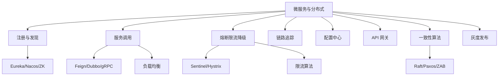
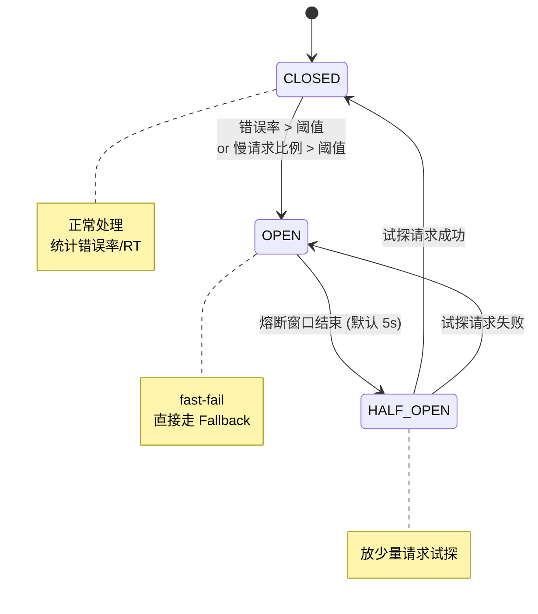

# 08 微服务与分布式 · 速记知识图谱（P0-P3）

> 模块定位：架构岗必考。核心是**注册发现 + RPC + 熔断限流降级 + 链路追踪 + 配置中心 + 服务治理**七件套。58 题。
> 题量：58 题。



### P0 必背核心

#### 服务注册与发现
- **角色**：服务提供方启动时向注册中心注册（IP+端口+元数据），消费方从注册中心订阅并缓存服务列表，提供方下线/心跳超时则注销。
- **Eureka（AP）**：客户端拉取注册表（默认 30s），服务端 self-preservation 模式（< 85% 心跳率触发，宁可保留过期实例也不大批量摘除），Netflix 已停止迭代。
- **Nacos**：AP/CP 可切换，临时实例（默认）走 Distro 协议 AP，永久实例走 Raft CP；配置 + 注册二合一。
- **Zookeeper（CP）**：临时节点 + Watch，ZAB 协议保证一致性；Leader 选举期间不可用，互联网场景多数选 AP。
- **Consul**：基于 Raft（CP），健康检查比 Eureka 更强（支持 HTTP/TCP/脚本）。
- 关联题：#0249

#### 服务调用（Feign / Dubbo / gRPC）
- **OpenFeign**：声明式 HTTP 客户端，原理 = 动态代理 + RestTemplate（已替换为 Spring Cloud LoadBalancer + WebClient）。注解 `@FeignClient(name="user-service")`，方法签名同 Controller。
- **Feign 调用流程**：① 启动扫 `@FeignClient` 注解生成代理 Bean；② 调用时根据 contract 解析方法签名构造 HTTP 请求；③ Ribbon/LoadBalancer 拿服务列表选实例；④ 编码 → 发起 HTTP；⑤ 解码返回。
- **Dubbo**：基于 TCP 二进制协议（Dubbo 协议）的高性能 RPC，性能优于 HTTP；Dubbo 3 支持 Triple 协议（基于 gRPC，HTTP/2）。
- **gRPC**：Google 出品，基于 HTTP/2 + Protobuf，跨语言、强类型 IDL、流式调用（单向/服务端流/客户端流/双向流）。
- **同步 vs 异步**：Feign 默认同步阻塞；CompletableFuture/Reactive 风格异步可减少线程占用。
- 关联题：#0249

#### 负载均衡算法
- **客户端 vs 服务端**：Ribbon/LoadBalancer 客户端；Nginx/HAProxy 服务端。
- **轮询 RR**：均匀分发，简单但忽略机器性能差异。
- **加权轮询 WRR**：按机器配置加权（Nginx 默认）。
- **最少连接 LeastConn**：连接数最少的实例（适合长请求差异大场景）。
- **一致性 Hash**：同 key 总落同实例（适合有状态服务、缓存路由）；虚拟节点解决倾斜。
- **随机 / 加权随机**：实现简单，足够大量请求趋近均匀。
- **响应时间加权（Dubbo LeastActive）**：活跃调用数最少的，自动避开慢节点。
- 关联题：#0249

#### 熔断（Sentinel / Hystrix / Resilience4j）
- **三态状态机**：CLOSED（正常）→ OPEN（熔断，请求直接 fast-fail）→ HALF_OPEN（试探放行，成功转 CLOSED 失败回 OPEN）。
- **触发条件**：错误率超阈值（如 50%）或慢请求比例超阈值（响应时间 > T 的占比）。
- **Sentinel（阿里）**：流控 + 熔断 + 系统自适应保护；支持热点参数限流（同方法不同参数限流），基于滑动窗口 LeapArray。
- **Hystrix（Netflix）**：已停更，线程池隔离 + 信号量隔离，熔断 + Fallback；Resilience4j 是其精神继任者。
- **降级**：熔断后走 Fallback 返回兜底（缓存数据、空集合、托底页）。
- 关联题：#0004、#0249



#### 限流算法
- **计数器**：单位时间窗口内的请求数；缺点：窗口切换时可能瞬时双倍。
- **滑动窗口**：把窗口切成多个小段，记录每段请求数；平滑了边界。Sentinel 默认。
- **令牌桶**：以恒定速率往桶里放令牌，请求要拿令牌；允许突发（桶里积压的令牌一次放出）。Guava RateLimiter。
- **漏桶**：请求恒定速率出桶，超出溢出丢弃；不允许突发，平滑流量。Nginx limit_req。
- **分布式限流**：Redis + Lua 实现令牌桶/计数器；Sentinel 集群模式。
- 关联题：#0249

```
令牌桶（允许突发）：           漏桶（平滑流量）：
                              
  恒定速率                        请求进入
   生成令牌                        ↓ ↓ ↓
     ↓                          ┌─────┐
   ┌─────┐                      │     │   桶满则溢出
   │ ▪▪▪▪│ ◄── 桶                │ ▪▪▪ │
   │ ▪▪▪▪│    满了暂停生成        │ ▪▪▪ │
   │ ▪▪▪ │                      └──┬──┘
   └──┬──┘                         │ 恒定速率漏出
      │ 请求来取令牌                ▼
      ▼ (取不到则限流)             下游
   下游
   
   特点: 平时积累令牌, 允许短时       特点: 严格匀速, 不允许突发
        突发 (Guava RateLimiter)         (Nginx limit_req)
```

| 算法 | 允许突发 | 实现复杂度 | 典型 |
|---|---|---|---|
| 计数器 | ✅（窗口切换有抖动） | 简单 | 简易接口限流 |
| 滑动窗口 | 受控 | 中 | Sentinel |
| 令牌桶 | ✅ | 中 | Guava RateLimiter |
| 漏桶 | ❌ 严格匀速 | 中 | Nginx limit_req |

#### 服务雪崩与隔离
- **雪崩原理**：服务 A 调 B，B 慢/挂导致 A 线程被打满，A 也不可用，连锁失败。
- **隔离方式**：① **线程池隔离**（Hystrix 每个依赖一个池，独立 + 队列）开销大但隔离彻底；② **信号量隔离**（计数器限并发数）轻量但同线程；③ **服务隔离**（核心非核心拆服务、拆机房）。
- **链路保护组合拳**：限流（入口拦） + 熔断（下游挂时 fast-fail） + 降级（兜底响应） + 隔离（资源隔离） + 超时（必加 timeout）。
- 关联题：#0004

#### 链路追踪（SkyWalking / Zipkin / OpenTelemetry）
- **三元组**：TraceId（一条完整链路 ID）、SpanId（一个调用单元）、ParentSpanId（父调用）。
- **跨进程透传**：通过 HTTP Header / Dubbo Attachment 把 TraceId 透传下去；线程间用 MDC + TransmittableThreadLocal。
- **SkyWalking**：apache 顶级项目，**字节码增强**自动埋点，无侵入；告警、拓扑图、性能分析强。
- **Zipkin**：Twitter 出品，简单轻量，需要手动埋点或 Spring Sleuth 集成。
- **OpenTelemetry**：CNCF 标准，统一指标 + 日志 + 追踪三件套，正在替代 OpenTracing。
- 关联题：#0249

#### 配置中心
- **Apollo（携程）**：推拉结合（长连接推 + 客户端定时拉），多环境、多集群、灰度、权限审计强；最重但功能最全。
- **Nacos**：配置 + 注册二合一，**长轮询**（hold 住 29.5s，有变化立即返回），轻量易用，国内主流。
- **SpringCloud Config**：基于 Git/SVN 拉取，配合 Bus + RabbitMQ/Kafka 广播刷新；功能弱，Spring 官方已转向 Config Tree。
- **Zookeeper / etcd**：Watch 机制天然适合配置变更推送，K8s 用 etcd。
- 关联题：#0249

#### API 网关
- **职责**：统一入口、路由转发、鉴权、限流、熔断、日志、灰度、协议转换。
- **Spring Cloud Gateway**：基于 Netty + Reactor 非阻塞，Predicate + Filter 模型；替代了 Zuul 1（阻塞 IO）。
- **Zuul 1 vs Zuul 2**：1 是 Servlet 阻塞，2 是 Netty 非阻塞但社区不活跃。
- **Apisix / Kong**：基于 Nginx + Lua + etcd，性能极强，插件丰富，云原生主流。
- **Nginx + OpenResty**：用 Lua 写逻辑，灵活但运维成本高。
- 关联题：#0249

### P1 加分高频

#### 一致性算法（Raft / Paxos / ZAB）
- **Paxos**：分布式共识算法的鼻祖，理论强、实现难。
- **Raft**：工程版 Paxos，强调可理解性；分 3 角色 Leader/Follower/Candidate；分 Leader 选举 + 日志复制 + 安全性。etcd、Consul、Nacos CP 模式都用 Raft。
- **ZAB（ZK Atomic Broadcast）**：ZooKeeper 用，与 Raft 类似但加了 Epoch 概念；分崩溃恢复 + 消息广播两阶段。
- **共同点**：Leader 单写 + 多数派提交（quorum） + 日志复制 + 故障切换。
- **不同**：Paxos 抽象、Raft 工程化、ZAB 是 ZK 专属变体。
- 关联题：#0249

#### CAP / BASE / PACELC
- **CAP**：分布式系统三选二（**一致性 C、可用性 A、分区容忍性 P**）。**P 是必须**（网络分区一定会发生），实际是 CP 或 AP 二选一。
- **CP**：宁可不可用也要一致（ZK、etcd、HBase）。
- **AP**：宁可不一致也要可用（Eureka、Cassandra、DynamoDB）。
- **BASE**：基本可用（Basically Available）、软状态（Soft state）、最终一致性（Eventually consistent）——AP 系统的理论基础。
- **PACELC**：CAP 扩展。在 P 分区时是 A 还是 C；E 没分区时是延迟 L 还是 C。
- 关联题：#0249

#### 幂等设计
- **场景**：网络抖动重试、消息重投、用户重复点击。
- **方案**：① **唯一索引**（最简单，DB 兜底）；② **Token 令牌**（请求前申请 Token，提交时校验删除）；③ **状态机**（订单 待支付→已支付，只能单向转）；④ **乐观锁 version**；⑤ **分布式锁**（耗资源，慎用）；⑥ **去重表**（用业务流水号建表，唯一索引兜底）。
- **本质**：找一个**业务唯一键**（订单号、流水号、用户 ID + 业务类型），第一次写入产生记录，第二次相同键查到记录直接返回结果。
- 关联题：#0249

#### 灰度发布 / 金丝雀
- **按比例**：流量按权重打到新版本（10% → 30% → 100%），新版本异常立即回滚。
- **按用户**：用户 ID 哈希 / 内部员工 / 白名单 / 地域 → 走新版本。
- **按 Header**：调试灰度，特定 Header 走新版本，APP 端开关。
- **蓝绿部署**：两套环境瞬时切换（DNS / LB），回滚快但要双倍资源。
- **滚动更新**：K8s Deployment 默认，逐 Pod 替换。
- 关联题：#0249

#### 微服务拆分原则
- **业务边界**：康威定律——系统结构反映组织结构。按业务子域（DDD 限界上下文）拆。
- **单一职责**：一个服务负责一个业务能力（订单、支付、用户、商品）。
- **数据自治**：每个服务管自己的数据库，不允许跨服务直连别人的库（必须 API 调）。
- **粒度**：不要过细（性能 + 运维复杂度爆炸），也不要过粗（成了"分布式单体"）。
- **拆分时机**：单体已经成为瓶颈（团队协作、部署频率、技术栈多样化）才拆，不要一开始就微服务。
- 关联题：#0249

#### 服务监控指标
- **业务指标**：QPS、TPS、错误率、成功率、各接口 RT。
- **资源指标**：CPU、内存、磁盘 IO、网络带宽。
- **JVM 指标**：堆 / 老年代占用、YGC FGC 频率耗时、线程数。
- **中间件**：DB 连接池占用、Redis 命中率、MQ 堆积。
- **黄金 4 指标（Google SRE）**：延迟、流量、错误率、饱和度。
- 关联题：#0249

#### Service Mesh / Istio
- **概念**：把服务通信能力（负载均衡、熔断、追踪、加密）下沉到 Sidecar 代理（如 Envoy），业务代码无感。
- **架构**：Sidecar 数据面（每 Pod 旁挂 Envoy） + 控制面（Istio 配置下发）。
- **优势**：跨语言（业务可任意语言）、运维统一、平滑升级。
- **劣势**：增加一跳网络开销、复杂度高、运维门槛。
- **国内现状**：大厂自研（蚂蚁 Mosn、字节 ByteMesh），中小厂多观望或仍用 Spring Cloud。
- 关联题：#0249

### P2 深度延伸

#### Sentinel 与 Hystrix 详细对比
- **隔离**：Hystrix 主推线程池隔离开销大；Sentinel 信号量 + 系统自适应保护更轻。
- **限流**：Hystrix 无内置限流；Sentinel 全套（QPS、并发数、热点参数、关联流控、链路流控）。
- **熔断**：都基于错误率 / RT；Sentinel 还支持基于异常数。
- **规则配置**：Hystrix 注解硬编码；Sentinel 控制台动态推送规则到客户端。
- **集成**：Sentinel 与 Dubbo/Feign/SpringWebFlux/SQL/gRPC 都有适配。

#### 熔断算法细节
- **错误率窗口**：滑动窗口（如 1 分钟），统计总请求数和错误数。
- **半开试探**：熔断 N 秒后，下一个请求放过去做试探，成功才转 CLOSED。
- **慢调用比例**：RT > T 的请求占比超阈值（如 50%）也触发熔断。
- **Sentinel 三种熔断策略**：慢调用比例、异常比例、异常数。

#### Raft 详细流程
- **Leader 选举**：① 启动 Follower 状态，等心跳超时（150-300ms 随机）；② 超时变 Candidate，自增 term 投自己并广播 RequestVote；③ 收到多数派同意成 Leader；④ Leader 定期发心跳 AppendEntries。
- **日志复制**：① Client 发请求到 Leader；② Leader 加日志到本地 + 并行 AppendEntries 到 Follower；③ 多数派回复成功后 commit 并 apply 到状态机；④ Leader 通知 Client。
- **脑裂防护**：term 单调递增，旧 Leader 收到更大 term 自动降级为 Follower。

#### 服务发现的最终一致性挑战
- 服务下线 → 注册中心摘除 → 消费者拉取 / 推送 → 本地缓存更新，这是一个有延迟的过程。
- **优雅下线**：① 通知注册中心 → ② 等待消费者感知（如 10-30 秒）→ ③ 拒绝新请求但继续处理在飞请求 → ④ 等所有请求完成 → ⑤ 真正关闭。Spring Boot Actuator `/actuator/shutdown`、K8s `preStop` Hook。
- **客户端容错**：调用失败时重试 / 切换实例，配合健康检查。

#### Sidecar 模式
- 把横切关注点（日志、配置、监控、加密）下沉到独立进程（与业务进程共享 Pod / 同主机）。
- Istio 的 Envoy 是典型 Sidecar；K8s Init Container 也是 Sidecar 思想。

### P3 冷门刁钻

#### BFF（Backend For Frontend）
- 为不同前端（Web / iOS / Android）定制一层后端聚合层，简化前端调用、聚合多个微服务、做协议转换。
- 缺点：维护成本高、容易演变成"业务后端的胶水层"。

#### 服务网格的下一代：Ambient Mesh
- Istio 2023 新方案，**去 Sidecar**，用 ztunnel + waypoint 代理，资源占用更低。

#### 微服务反模式
- **分布式单体**：服务拆了但部署/发布仍要一起上，没解耦。
- **共享数据库**：多个服务读同一个表，耦合死，拆分名存实亡。
- **过度拆分**：服务太细，调用链 10+，性能 + 复杂度爆炸。
- **网状调用**：A→B→C→A 循环调，靠链路追踪发现。

#### Saga vs TCC vs 本地消息表
- 见 09_分布式事务，本节略。

### 跨模块联想

- 注册发现 ↔ **12 其他中间件**：Nacos/ZK 既是注册中心又是配置中心。
- 熔断限流 ↔ **15 业务场景**：秒杀、大促必备组合拳。
- 链路追踪 ↔ **16 性能调优**：定位慢接口首选 SkyWalking 看链路。
- 一致性算法 ↔ **05 MySQL**：MGR 用 Paxos 变体；从库回放也类似复制状态机。
- 限流 ↔ **06 Redis**：Redis + Lua 实现分布式令牌桶。
- 服务调用 ↔ **03 并发**：Feign 异步用 CompletableFuture、虚拟线程做高并发网关。
- 灰度 ↔ **19 工具与工程**：K8s Deployment 滚动更新、Argo Rollouts 精细化灰度。
- 微服务拆分 ↔ **22 面经**：面试讲项目必聊为啥这么拆、踩过什么坑。

---
