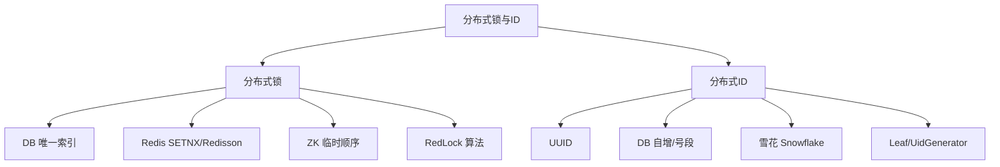
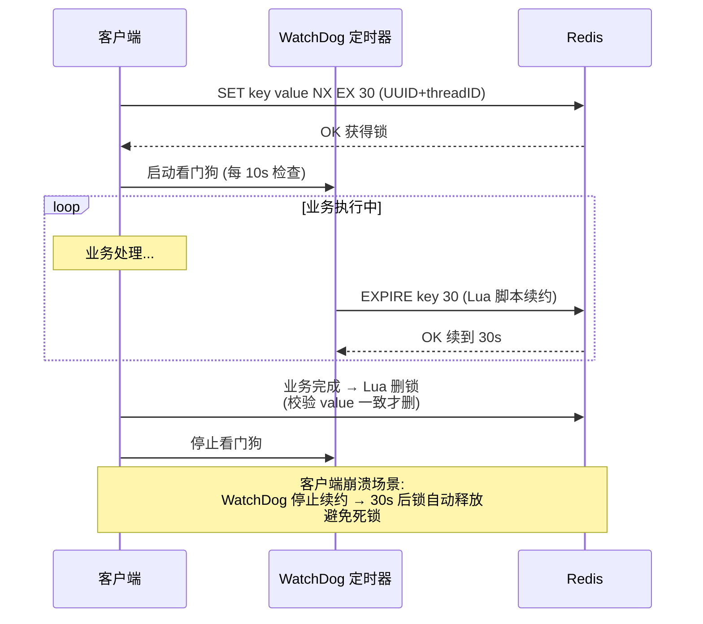

# 10 分布式锁与ID · 速记知识图谱（P0-P3）

> 模块定位：分布式必考。锁解决"多节点并发竞争"，ID 解决"全局唯一标识"。43 题。
> 题量：43 题。



### P0 必背核心

#### 分布式锁的本质需求
- **互斥性**：同一时刻只有一个客户端持有锁。
- **避免死锁**：客户端异常退出不能导致锁永久无法释放（必须有超时）。
- **容错性**：锁服务挂了不能让整个系统挂；多副本部署。
- **可重入**：同一线程多次获取同一把锁不会死锁（递归调用、嵌套事务）。
- **公平/非公平**：是否按申请顺序拿锁，业务通常不需要严格公平。
- **释放正确性**：只能释放自己加的锁（防误删）。
- 关联题：#0043

#### Redis 分布式锁基础实现
- **加锁**：`SET key value NX EX 30`——NX 不存在才设置（保证互斥），EX 30 过期时间（避免死锁）。value 必须是**唯一标识**（如 UUID 或 threadId）用来防误删。
- **释放**：必须用 **Lua 脚本**保证"判断 + 删除"原子性：`if redis.call('GET', KEYS[1]) == ARGV[1] then return redis.call('DEL', KEYS[1]) else return 0 end`。
- **典型陷阱**：① 直接 `DEL` 不判 value → 误删别人的锁（A 持锁后业务超时，锁过期被 B 拿走，A 完成后直接 DEL 删了 B 的锁）；② 加锁用 `SETNX` + `EXPIRE` 两条命令非原子，进程在两条之间挂掉就是死锁。
- 关联题：#0043

#### Redisson 看门狗（WatchDog）续约
- **问题**：固定过期时间 30 秒，业务执行 40 秒怎么办？
- **解决**：Redisson 默认开启 WatchDog。`tryLock()` 不传 leaseTime（或传 -1）就启动看门狗，**每 lockWatchdogTimeout/3（默认 30s/3=10s）检查并续期到 30s**。
- **关闭看门狗**：传具体 leaseTime 就不启动看门狗（适合明确知道业务最长耗时的场景）。
- **客户端挂掉**：看门狗在客户端进程，进程挂后续约停止，30 秒后锁自动释放。
- **可重入实现**：Redis Hash 结构，key = 锁名，field = clientId+threadId，value = 重入次数；解锁时计数减 1，到 0 才真正 DEL。
- 关联题：#0043



```
Redisson 可重入锁 (Hash 结构存储)：

KEY: lock:order_123
   └─ FIELD: "client-A:thread-1"    VALUE: 3   (重入 3 次)
   
加锁 (Lua 原子)：
  if redis.call('exists', KEYS[1]) == 0 then         -- 锁不存在
    redis.call('hincrby', KEYS[1], ARGV[2], 1)       -- 重入计数 +1
    redis.call('pexpire', KEYS[1], ARGV[1])
    return nil
  end
  if redis.call('hexists', KEYS[1], ARGV[2]) == 1 then -- 是自己的锁
    redis.call('hincrby', KEYS[1], ARGV[2], 1)
    redis.call('pexpire', KEYS[1], ARGV[1])
    return nil
  end
  return redis.call('pttl', KEYS[1])                  -- 别人的锁,返回剩余 TTL

解锁 (Lua 原子)：重入计数 -1，到 0 才真正 DEL
```

#### ZooKeeper 分布式锁
- **临时顺序节点**：客户端在 /lock 下创建临时顺序节点（如 /lock/seq-0001），返回节点序号。
- **判断是否拿到锁**：序号最小的节点拿到锁；否则**只 Watch 前一个节点**（不是 Watch 整个父节点，避免羊群效应——一个释放导致所有节点都被唤醒）。
- **优点**：① 强一致（CP）、② 客户端断连临时节点自动删除不会死锁、③ 公平锁（按顺序）。
- **缺点**：① 性能不如 Redis（写入全要走 Leader 多数派）、② 客户端 session 超时配置不当可能误释放（默认 30s）。
- **Curator 框架封装好的 `InterProcessMutex`** 是工业标准。
- 关联题：#0043

#### RedLock 算法（争议）
- **目的**：解决单点 Redis 锁的可靠性问题（主挂了 Slave 还没同步就被选为主，导致两个客户端拿到同一把锁）。
- **流程**：客户端依次向 **N（一般 5）个独立的 Redis 主节点**请求加锁，**多数派（N/2+1）成功且总耗时 < 锁有效期**才算加锁成功；解锁向所有节点发 DEL。
- **争议**：Martin Kleppmann（《DDIA》作者）质疑 RedLock 在时钟漂移、GC 暂停场景下不安全；Antirez（Redis 作者）反驳并修订。
- **结论**：业务上需要"强正确"用 ZK / etcd（基于 Raft，理论 OK）；业务上"99% 够用"用 Redis 单点 + Redisson WatchDog。
- 关联题：#0043

#### 雪花算法 Snowflake
- **64 位结构**：1 位符号位（0）+ **41 位时间戳**（毫秒，约 69 年） + **10 位机器位**（5 位数据中心 + 5 位机器，共 1024 台） + **12 位序列号**（同一毫秒内 4096 个）。
- **吞吐**：理论单机 4096 × 1000 = 409 万 / 秒；实际几十万够用。
- **优点**：① 趋势递增（B+ 树主键友好）；② 不依赖第三方；③ 全局唯一；④ 64 位 BIGINT 存储省空间。
- **缺点**：① **时钟回拨**导致 ID 重复（NTP 同步、闰秒）；② 机器位上限 1024。
- **时钟回拨解决**：① 检测到回拨直接抛异常；② 回拨时间小则等待；③ 美团 Leaf-snowflake 用 ZK 持久化 workerId + 上次时间戳，启动校验。
- 关联题：#0249

```
Snowflake 64 位结构：

  ┌─┬────────────────────────────────────────────┬──────────┬────────────┐
  │符│             41 位时间戳 (ms)              │ 10 位机器 │  12 位序列号 │
  │号│         (相对纪元的毫秒数, 可用 69 年)     │ ID       │  (同毫秒内)  │
  │位│                                            │ DC + Mach│             │
  └─┴────────────────────────────────────────────┴──────────┴────────────┘
   1                  41                            10           12

  例: 0 | 0000000000 0000000000 1010101010 0011001100 1 | 0001100001 | 000000000010
                                                          ↑ 5+5 位     ↑ 0~4095

  吞吐: 4096 × 1000 = 409 万/秒   单机
       支持 1024 台机器           集群

  时钟回拨问题:
    ┌── t=100 生成 ID ──┐
    │                   │  NTP 同步把时钟拨回 t=95
    └─── t=95 ─────────►── 生成 ID (可能与 t=95 早期生成的冲突!)
    
    解决: 检测回拨 → 等待/抛异常/借位
         美团 Leaf-snowflake: ZK 持久化 workerId + 上次时间戳
```

| 位数 | 说明 | 调整方向 |
|---|---|---|
| 1 符号位 | 固定 0 | 不动 |
| 41 时间戳 | 69 年 | 美团 Leaf 用相对纪元延长 |
| 10 机器位 | 1024 台 | 百度 UidGenerator 扩到 22 位 |
| 12 序列号 | 4096/ms | 调小给机器位/时间位让空间 |

#### UUID 优缺点
- **UUID 36 字符**（含 4 个 `-`）= 32 个十六进制字符 = 128 位。
- **优点**：① 全局唯一无需中心化；② 简单。
- **缺点**：① **无序**导致 B+ 树**页分裂**严重（随机插入）；② 16 字节占空间（vs BIGINT 8 字节）；③ 不可读不便于业务追踪；④ 索引性能差。
- **改进**：① **UUID v7**（基于时间戳前缀有序）；② NanoID（更短 21 字符）；③ ULID（26 字符，时间排序）。
- 关联题：#0047

#### DB 自增 ID 的局限
- **优点**：简单、单调递增、可作主键。
- **缺点**：① 高并发写性能瓶颈（自增锁 AUTO-INC）；② 暴露业务量（用户量、订单量可被竞品估算）；③ **分库分表后无法用**（多个库各自自增会冲突）；④ 迁移难。
- 关联题：#0047

### P1 加分高频

#### 美团 Leaf
- **Leaf-segment（号段模式）**：DB 维护一张表，每个业务一个号段（如订单业务每次取 1000 个 ID），用完再取下一段；通过 **双 buffer** 预加载下一号段，平滑过渡。
- **Leaf-snowflake**：基于 Snowflake，用 ZK 管理 workerId（自动分配 + 持久化），解决时钟回拨。
- **优点**：稳定、TP999 < 1ms、容灾设计完善。

#### 百度 UidGenerator
- **基于 Snowflake**：但把时间戳从"当前毫秒"改为"相对于初始时间的差值"，并把 workerId 改 22 位、序列号 13 位，扩大机器数。
- **环形 Buffer**：异步生产 ID 放入 RingBuffer，消费者直接取，应对突发流量。
- **CachedUidGenerator vs DefaultUidGenerator**：前者预生成，后者按需生成。

#### TiDB / 雪花 ID 的实践
- **TiDB AUTO_RANDOM**：替代 AUTO_INCREMENT，生成的 ID 高位是随机数，避免热点 Region。
- **分库分表中的 ID 选型**：必须用全局 ID（雪花、Leaf），不能用各库自增。

#### 分布式锁的选型决策
- **业务侵入要低 + 性能要高** → Redis + Redisson（90% 业务场景）。
- **强一致性、低并发** → ZooKeeper / etcd。
- **简单兜底场景** → DB 唯一索引 / `SELECT FOR UPDATE`。
- **超高并发热点 Key** → 分段锁（key 后缀加 hash）、本地锁 + 分布式锁组合。
- 关联题：#0043

#### DB 唯一索引做锁
- **原理**：业务需要互斥的操作前先 INSERT 唯一键，成功就拿到锁，失败说明有人在做。
- **优点**：依赖现有 DB、无额外组件、强一致。
- **缺点**：性能差、需要手动清理过期记录、没法做自动续期。
- **变种**：`SELECT FOR UPDATE` 行锁（事务结束自动释放，简单），但占用 DB 连接。
- 关联题：#0043

#### 主键不一定自增的场景
- 分库分表用雪花、订单号嵌入用户 ID 基因、业务字段拼接（如商品 SKU = 类目码+品牌码+流水号）。
- **核心约束**：① 必须唯一；② 趋势递增对 B+ 树友好；③ 不能太长（占索引空间）。
- 关联题：#0047

### P2 深度延伸

#### Redis 锁的"主从切换不安全"问题
- 客户端 A 在 Master 上加锁成功，Master 还没把这条命令同步给 Slave 就挂了。
- Sentinel 把 Slave 提升为 Master，客户端 B 在新 Master 上也能加锁成功——**同一把锁被 A、B 同时持有**。
- 解决：① RedLock（多副本独立投票）；② 业务能容忍则不解决（多数业务能容忍）；③ 改用 etcd / ZK。

#### Redisson 公平锁实现
- 使用 Redis List 维护**等待队列**（FIFO），同时用 ZSet 维护节点的失效时间。
- 客户端 tryLock 时检查 List 头节点是否是自己，是才能拿锁；否则进队列等待。
- 性能比非公平差，业务真需要时才用。

#### 时钟回拨的工程解决方案
- **检测**：每次生成 ID 前对比当前时间戳与上次时间戳，回拨就报警/抛异常。
- **等待**：回拨幅度小（如 < 5ms）就 sleep 等到追上。
- **借位**：序列号位让出一段做"备用时间池"，回拨时使用。
- **降级**：回拨大量时启用备用方案（如 Leaf-segment 兜底）。

#### 段树 / 跳表在分布式 ID 中的隐喻
- Leaf-segment 的双 buffer 切换很像缓存预读，应对 DB 抖动。
- 美团另一个号段优化版本 LeafKV 用 KV 存储替代 DB，QPS 更高。

### P3 冷门刁钻

#### 数据库 NEXTVAL（PostgreSQL / Oracle）
- 序列对象 `CREATE SEQUENCE`，`SELECT nextval('seq')` 取下一个值，可批量预取 cache 100。
- MySQL 没有，所以才需要号段方案。

#### 雪花算法的位数变体
- 不是固定 1/41/10/12；可按业务调整：
  - 美团 Leaf：1/41/12/10（机器 4096 台、序列 1024）。
  - 百度 UidGenerator：1/28/22/13（时间秒级、机器位多）。
- 设计时按"每秒峰值 QPS + 部署机器数 + ID 寿命要求" 选位数。

#### Tinyid（滴滴）
- 也是号段模式，号段从 DB 取出后客户端缓存，单机 TPS 高。
- 简单但功能弱，适合中小项目。

### 跨模块联想

- 分布式锁 ↔ **06 Redis**：SETNX EX、Lua 脚本、Redisson WatchDog。
- 分布式锁 ↔ **12 其他中间件**：ZK 临时顺序节点。
- 分布式 ID ↔ **05 MySQL**：主键趋势递增对 B+ 树友好；UUID 引发页分裂。
- 分布式 ID ↔ **11 分库分表**：分库分表必须全局唯一 ID，雪花/Leaf 是首选。
- 锁的可重入 ↔ **03 并发**：ReentrantLock 的本地可重入 vs Redisson 的分布式可重入。
- 时钟同步 ↔ **13 网络**：NTP、闰秒、跨机器时钟漂移。
- 锁性能 ↔ **15 业务场景**：秒杀、库存扣减、防重复下单。
- ID 基因法 ↔ **11 分库分表**：订单号嵌入用户 ID 末位保证同用户落同分片。

---
