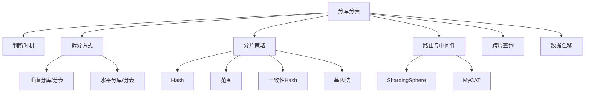

# 11 分库分表 · 速记知识图谱（P0-P3）

> 模块定位：数据规模大了后的"标准动作"。重点是**何时分、怎么分、分完怎么查、怎么迁**。24 题。
> 题量：24 题。



### P0 必背核心

#### 何时需要分库分表
- **单表 1000-2000 万**：经验值，B+ 树 3-4 层后查询性能下降明显。
- **单表数据 > 几十 GB**：DDL 慢、备份慢、内存命中率低。
- **单库 QPS > 4000-5000**：单机 MySQL 写入瓶颈。
- **单库连接数瓶颈**：MySQL 默认 max_connections 151，调大也有上限（连接数 × 内存）。
- **不要过早分**：业务规模未到时分库分表只增加复杂度。先优化索引、慢 SQL、读写分离、缓存。
- 关联题：#0016

#### 垂直拆分 vs 水平拆分
- **垂直分库**：按业务划分库（订单库、用户库、商品库）；解决业务耦合、单库压力分散。
- **垂直分表**：把宽表的字段按访问频率/重要性拆（user_base + user_detail），减少 IO；缺点是 join。
- **水平分库**：同一张表数据按规则分散到多个库；解决单库写入和存储瓶颈。
- **水平分表**：同一张表数据按规则分散到多个表；不分库只分表只解决单表过大问题（性能提升有限因为还是一个库的 IO）。
- **组合**：实际生产几乎都是"垂直分库 + 水平分库 + 水平分表"组合（如订单库 8 个，每库 8 张表）。
- 关联题：#0016

```
垂直分库 (按业务)：               垂直分表 (按字段冷热)：

  ┌─────────────────┐                user 表 (列太多)
  │   单一大库       │                │
  │  用户/订单/商品   │                ▼
  │  互相耦合        │              user_base (id, name, phone)
  └────────┬────────┘              user_detail (id, address, profile)
           │ 拆分
   ┌───────┼───────┐              查询常用字段不读宽列, IO 减少
   ▼       ▼       ▼
  用户库  订单库  商品库
   独立扩缩容
   独立部署
   故障隔离

水平分库 + 水平分表 (终极组合)：

  订单库 0      订单库 1      ...    订单库 N
  ┌────┐       ┌────┐               ┌────┐
  │T0  │       │T0  │               │T0  │
  │T1  │       │T1  │               │T1  │      8 库 × 8 表 = 64 张分片
  │... │       │... │               │... │
  │T7  │       │T7  │               │T7  │
  └────┘       └────┘               └────┘
  
  路由: shard_id = user_id % 8         (定库)
        table_id = (user_id / 8) % 8    (定表)
```

#### 分片策略
- **Hash 取模**：`shard_id = userId % N`，分布均匀但**扩容需要数据迁移**（迁移量 ≈ 全表 (N-1)/N）。
- **范围分片**：按时间/ID 范围分（如 user_id 0-1000万 → shard0、1000万-2000万 → shard1）；扩容容易（加 shard）但**热点问题严重**（最新数据集中在一个分片）。
- **一致性 Hash**：节点形成哈希环，数据按 key 哈希落到顺时针下一个节点；扩容只影响相邻节点（迁移量 1/N）；**虚拟节点**解决数据倾斜。
- **基因法（Genetics）**：把分片键的"基因"嵌入到其他字段。如订单号 = 时间戳 + 用户 ID 末 4 位（用户 ID 基因），保证用户查自己订单时能直接路由到对应分片。
- **按业务/地理位置**：B 端按公司 ID、C 端按地域路由到就近机房。
- 关联题：#0016

#### 分片键选择原则
- **均匀分布**：分布要均匀，否则某些分片成热点。
- **高频查询字段**：90% 查询能命中分片键，避免广播查询。
- **不可变**：一旦确定不能改（改了要迁移数据）。
- **单调递增的不要**：会导致最新数据集中一个分片。
- **典型 C 端**：用户 ID 做分片键（用户查自己的数据是最高频场景）。
- **B 端订单**：用 user_id 做分片键 + 订单号嵌入 user_id 基因，C 端用户查、商家查、客服查都能路由。
- 关联题：#0016

#### ShardingSphere 架构
- **Sharding-JDBC**：客户端模式，Jar 形式集成在应用，作为增强的 JDBC Driver；性能好（无额外网络跳），但和应用耦合，多语言不友好。
- **Sharding-Proxy**：代理模式，独立部署，对应用透明（兼容 MySQL 协议），多语言通用，但多一跳网络开销。
- **Sharding-Sidecar**：Service Mesh 形态（DBMesh），实验性。
- **核心能力**：分库分表、读写分离、分布式事务、影子库（压测）、数据加密、SPI 扩展。
- 关联题：#0016

### P1 加分高频

#### 跨片查询的痛
- **跨片 join**：失效。解决：① 全局表（数据量小、变化少，每个分片冗余一份，如字典表）；② 应用层做 join（先查 A 拿 ID 列表，再 in 查 B）；③ ER 表（关联表按相同 key 分片到同一节点，如订单和订单明细）；④ 异构存储（同步到 ES 做 join）。
- **跨片 ORDER BY + LIMIT**：必须先各分片各查 limit+offset，再归并。深翻页性能急剧下降。
- **跨片 COUNT / SUM**：各分片各算再聚合。
- **跨片分页**：用游标式（last id）代替 offset。
- 关联题：#0016

#### 数据迁移与扩容方案
- **停机迁移**：最简单，业务停服→数据全量同步→切流量→恢复。适合非核心业务，可接受停机时间。
- **不停机双写**：① 双写：业务代码同时写老库 + 新库；② 历史数据通过 Canal/DataX 同步；③ 校验双库一致；④ 流量切到新库；⑤ 下线老库。耗时长但平滑。
- **基于 Binlog（Canal）**：订阅老库 binlog 同步到新库，校验后切流。
- **Online DDL（如 gh-ost / pt-osc）**：用于单表结构变更，迁移用不上。
- **二倍法扩容**：分片数翻倍（N → 2N），原 shard_id 数据按 `id % 2N` 拆到 shard_id 和 shard_id+N 两份，其他分片不动。
- 关联题：#0016

```
基因法路由示意：

订单号设计 = 时间戳前缀 (16 位) + 雪花序列 (44 位) + 用户基因 (4 位)
            ────────────────────────────────────────────────────
            17031560123456  +  78912345  +  1010
                                              ↑
                                       这 4 位 = user_id 末 4 位

  用户 user_id = ...10101010
                       ↑↑↑↑
                  分片基因取最后 4 位 = 1010

  分片路由:
    create_order: shard = order_no & 0b1111         (取末 4 位 → 1010)
    query_order:  shard = order_no & 0b1111         (拿到订单号即可路由)
    user_orders:  shard = user_id  & 0b1111         (同样落到一个分片)

  ✅ 用户查自己订单 / 客服按订单号查 / 商家按订单号查 都能直接定位分片
  ❌ 不带 user_id 也不带 order_no 的查询 (如按状态查) → 仍需广播
```

#### 基因法实战
- **场景**：订单按用户 ID 分库，但订单后台/客服按订单号查询，没有用户 ID。
- **方案**：订单号生成时把用户 ID 末 N 位作为"基因"嵌入订单号末 N 位。`order_no = 雪花前缀 + (user_id & mask)`。
- **效果**：拿到订单号直接 `order_no & mask` 取末位 → 算出分片号，不需要回查 user_id。
- **二次分表难题**：分片数翻倍时，原有基因位不够（如 mask 是 4 位只能算出 16 个分片，扩到 32 个分片需要 5 位）。解决：① 提前预留基因位（设计时就用 8-10 位）；② 历史数据查询走全表广播，新数据用新基因位。
- 关联题：#0016

#### 分布式事务在分库分表中的应用
- 同一笔操作涉及多个分片 → 跨片事务。
- **本地事务**：每个分片各自事务 + 业务层补偿。
- **Seata AT 模式**：拦截 SQL 生成反向 SQL（undo log），全局协调；性能 OK 但侵入业务。
- **柔性事务（最终一致）**：消息驱动 + 对账 + 补偿任务。绝大多数业务能容忍。

### P2 深度延伸

#### 一致性 Hash 详解
- 把 0 ~ 2^32-1 视为一个环，节点和数据 key 都 hash 到环上，数据落到顺时针下一个节点。
- 加节点：只影响该节点逆时针到上一个节点之间的数据，迁移量 1/N。
- 删节点：该节点上的数据全部迁到顺时针下一个节点。
- **虚拟节点**：每个物理节点对应多个（如 150 个）虚拟节点分散到环上，缓解数据倾斜。Redis Cluster 的 slot 设计也类似（16384 个 slot）。
- 关联题：#0016

#### ShardingSphere 内核原理
- **SQL 解析**：ANTLR 把 SQL 解析成 AST。
- **SQL 路由**：根据分片规则定位到目标库表。
- **SQL 改写**：把 `t_order` 改写为 `t_order_0`/`t_order_1`，深翻页 LIMIT 改写。
- **SQL 执行**：并行执行到各分片。
- **结果归并**：流式归并（避免内存爆）/ 内存归并（小数据集排序聚合）。

#### 分库分表后的 ID 全局唯一
- 雪花 / Leaf / UidGenerator（参考 #10）。
- 自增 ID 在 ShardingSphere 中可用，但需要每个分片设置不同的 auto_increment_offset 和 auto_increment_increment（如 increment=10，offset=1/2/.../10），扩容不便。

#### 影子库 / 影子表（压测）
- 生产环境压测时，请求带特殊标识 → 走影子库/影子表（不污染生产数据）。
- ShardingSphere 通过 hint 路由实现；阿里 PTS 全链路压测的核心机制。

### P3 冷门刁钻

#### MyCAT vs ShardingSphere
- **MyCAT**：基于 Cobar，老牌国产 Proxy 中间件；社区活跃度下降，不推荐新项目。
- **ShardingSphere**：apache 顶级项目，**强烈推荐**，文档完整、社区活跃、能力全。

#### 单元化部署
- 蚂蚁/淘宝级别的"单元化"：每个机房自治、用户按规则路由到固定机房（异地多活的基础）。
- 每个单元包含完整业务能力，单元间通过 MQ 同步，单元故障可整体切流。

#### NewSQL（TiDB / OceanBase）
- 既能像 MySQL 一样写 SQL，又自动分布式分片、水平扩展、支持事务。
- **TiDB**：MySQL 兼容、计算存储分离、Raft 一致性。
- **OceanBase**：阿里出品，金融级强一致 + 高可用，蚂蚁全链路使用。
- 适用：业务规模到 PB 级、不想自己折腾分库分表。

### 跨模块联想

- 分片键选择 ↔ **15 业务场景**：订单基因法、用户查询路径设计。
- ID 生成 ↔ **10 分布式锁与ID**：雪花、Leaf 是分库分表的标配。
- 跨片事务 ↔ **09 分布式事务**：Seata AT/TCC、最终一致性方案。
- 一致性 Hash ↔ **06 Redis**：Redis Cluster 16384 slot、客户端分片。
- 跨片查询 ↔ **12 中间件**：ES 做异构存储扛 C 端复杂查询，MySQL 走分片做主存。
- 数据迁移 ↔ **05 MySQL**：Canal 订阅 binlog、双写、灰度切流。
- 扩容 ↔ **08 微服务**：与微服务拆分一样，越早设计越好。
- 单元化 ↔ **14 系统设计**：异地多活、容灾、单元路由。

---
