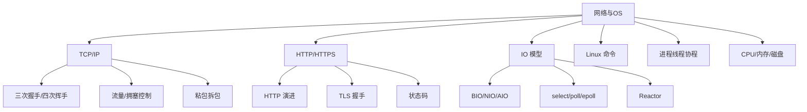
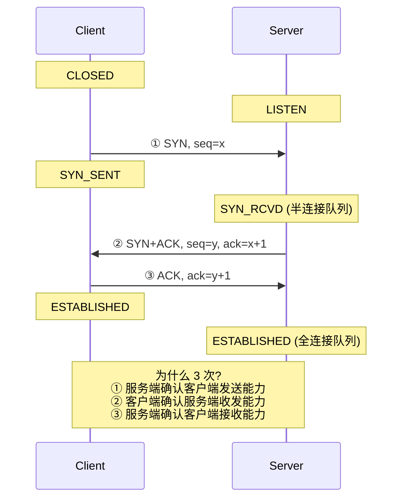
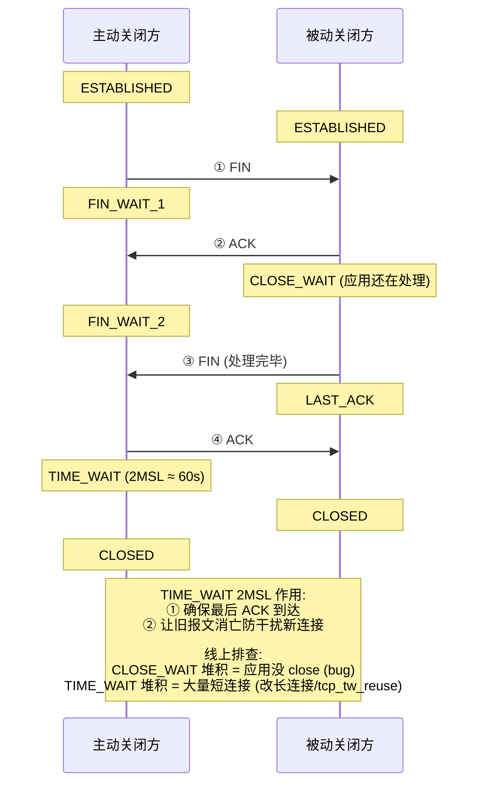
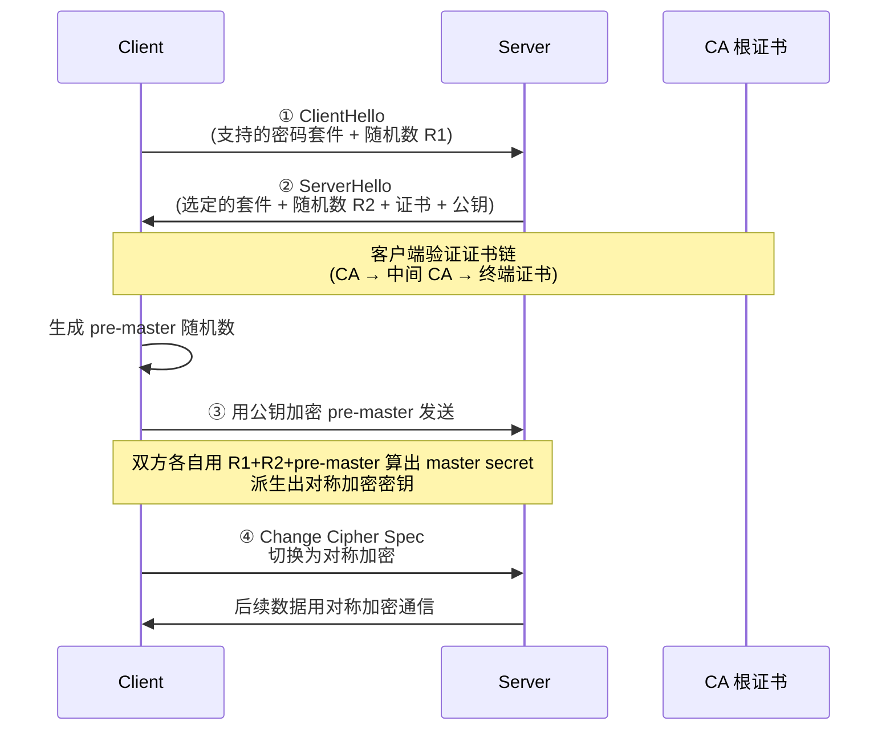
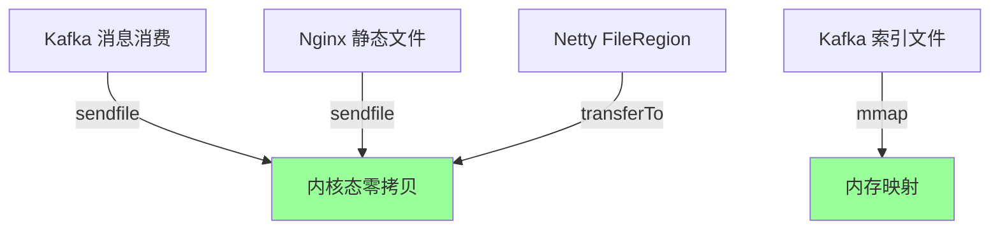

# 13 网络与操作系统 · 速记知识图谱（P0-P3）

> 模块定位：高级岗"硬基础"。**TCP/HTTP/HTTPS、IO 多路复用、Linux 命令、零拷贝**是常考主线。68 题。
> 题量：68 题。



### P0 必背核心

#### TCP 三次握手
- **流程**：① 客户端 SYN（seq=x），进入 SYN_SENT；② 服务端 SYN+ACK（seq=y, ack=x+1），进入 SYN_RCVD；③ 客户端 ACK（ack=y+1），双方进入 ESTABLISHED。
- **为什么三次而不是两次**：防止已失效的连接请求报文（网络延迟到达）再次建立连接。两次的话服务端无法确认客户端发送能力 + 客户端无法确认服务端接收能力。
- **为什么不是四次**：第二次中服务端的 ACK 和 SYN 可以合并发送，没必要分开。
- **SYN Flood 攻击**：大量伪造 SYN 不响应 ACK，占满服务端半连接队列。防御：syncookies、tcp_max_syn_backlog 调大、超时重传次数调小。
- 关联题：#0085、#0093



#### TCP 四次挥手与 TIME_WAIT
- **流程**：① 主动方 FIN，进入 FIN_WAIT_1；② 被动方 ACK，进入 CLOSE_WAIT，主动方进入 FIN_WAIT_2；③ 被动方处理完业务发 FIN，进入 LAST_ACK；④ 主动方 ACK，进入 **TIME_WAIT**（等 2MSL），最终关闭。
- **为什么四次**：FIN 和 ACK 不能合并（服务端可能还有数据要发），所以拆开两次。
- **TIME_WAIT 2MSL（一般 60s）**：① 保证最后一个 ACK 能到对方（否则对方重传 FIN，要能响应）；② 让本次连接的报文在网络中消亡，避免影响下个相同四元组连接。
- **TIME_WAIT 堆积**：主动关闭方常见，大量短连接场景（如 Nginx 上游回源）；解决：复用四元组（`tcp_tw_reuse`、`tcp_tw_recycle` 已被废弃）、用长连接、调大端口范围。
- **CLOSE_WAIT 堆积**：**应用代码 bug**，对方关了连接但本端没调 close()。检查 IO 处理逻辑、数据库连接池泄漏。
- 关联题：#0085、#0093



#### TCP 可靠传输机制
- **序号 + 确认**：每个字节有序号，接收方 ACK 下一个期望序号；缺失的中间段触发重传。
- **超时重传**：RTO 自适应（基于 RTT）。
- **快重传**：连续收到 3 个重复 ACK 立即重传，不等超时。
- **流量控制**：滑动窗口，接收方告知发送方剩余缓冲区大小，发送方不超过该窗口。
- **拥塞控制**：① 慢启动（cwnd 指数增长）；② 拥塞避免（达到 ssthresh 后线性增长）；③ 快重传 + 快恢复（cwnd 减半 + 立即重传）；④ Cubic（Linux 默认）、BBR（Google 提出，更适合长肥网络）。
- **Nagle 算法**：小包合并发送降低带宽，但增加延迟；交互式应用（IM、SSH）建议 `TCP_NODELAY` 关闭。
- **SACK**：选择性确认，告知发送方哪些段已收到，减少不必要的重传。
- 关联题：#0085

#### TCP vs UDP
- **TCP**：面向连接、可靠（重传、有序、不重复）、流控/拥塞控制、字节流、点对点；适合文件传输、HTTP、邮件、数据库。
- **UDP**：无连接、不可靠、首部小（8 字节 vs TCP 20+ 字节）、支持广播/组播、报文边界保留；适合 DNS、视频/音频实时传输、QUIC、游戏。
- **QUIC**：Google 提出基于 UDP 的可靠传输（HTTP/3 用）；解决 TCP 队头阻塞、连接迁移、0-RTT 握手。
- 关联题：#0093

#### HTTP 演进（1.0/1.1/2/3）
- **HTTP/1.0**：短连接，每次请求建立 TCP 连接。
- **HTTP/1.1**：**长连接**（Keep-Alive 默认）、Pipeline（请求可流水但响应必须顺序，**队头阻塞**）、Host 头支持虚拟主机、Range 部分请求、Cache-Control。
- **HTTP/2**：① **多路复用**（一个 TCP 连接并行多个请求，Stream 概念）；② **头压缩 HPACK**；③ **服务端推送**；④ 二进制分帧；⑤ 仍有 TCP 层队头阻塞。
- **HTTP/3（QUIC）**：基于 UDP，解决 HTTP/2 的 TCP 队头阻塞、0-RTT 握手（连接复用）、连接迁移（IP 切换不断）、强制加密。
- 关联题：#0049

#### HTTPS 与 TLS 握手
- **HTTPS = HTTP + TLS**：解决 HTTP 明文传输（窃听）、篡改、冒充三大问题。
- **TLS 1.2 握手 4 步**：① ClientHello（支持的密码套件、随机数）；② ServerHello + 证书 + 公钥 + 随机数；③ 客户端验证证书链 → 用公钥加密 pre-master 发给服务端，双方算出 master secret；④ 切换加密通信 Change Cipher Spec。
- **TLS 1.3**：① 1-RTT 握手（vs 1.2 的 2-RTT）；② 0-RTT 复用 session；③ 去掉不安全密码套件（如 RSA 密钥交换、SHA1）；④ 强制 ECDHE。
- **混合加密**：非对称（RSA/ECDHE）交换对称密钥 + 对称（AES）加密数据。
- **证书链**：终端证书 → 中间 CA → 根 CA（操作系统/浏览器内置）。
- **会话复用**：Session ID（服务端存）/ Session Ticket（客户端存）避免完整握手。
- 关联题：#0093



| TLS 版本 | 握手 RTT | 主要改进 |
|---|---|---|
| TLS 1.2 | 2 RTT | 经典实现 |
| TLS 1.3 | 1 RTT (首次) | 简化握手、强制 ECDHE |
| TLS 1.3 + 0-RTT | 0 RTT | 复用 session ticket，但有重放风险 |

#### HTTP 状态码
- **1xx 信息**：100 Continue（继续上传）。
- **2xx 成功**：200 OK、201 Created（POST 成功）、204 No Content（PUT/DELETE）、206 Partial Content（Range 请求）。
- **3xx 重定向**：**301 永久重定向**（SEO 友好）、**302 临时重定向**、303 See Other、**304 Not Modified**（缓存命中，配合 If-Modified-Since/ETag）、307/308（保留方法的重定向）。
- **4xx 客户端错误**：400 Bad Request、**401 未认证**、**403 已认证但没权限**、404 Not Found、405 Method Not Allowed、409 Conflict、429 Too Many Requests（限流）。
- **5xx 服务端错误**：500 Internal、**502 Bad Gateway**（网关收到上游错误响应）、503 Service Unavailable、**504 Gateway Timeout**（网关上游超时）。
- **502 vs 504 区别**：502 上游返回错误，504 上游超时未返回。
- 关联题：#0093

#### Linux IO 多路复用（select/poll/epoll）
- **select**：fd 集合传入内核拷贝（bitmap），每次返回都要轮询所有 fd 找就绪的；fd 数量限制 1024；O(n)；跨平台。
- **poll**：链表实现取消 1024 限制，仍是 O(n) 轮询；fd 数组每次都要传内核。
- **epoll（Linux 2.6+）**：① **红黑树**存所有注册 fd；② **就绪链表**存活跃 fd；③ epoll_wait O(1) 直接拿就绪链表，不用轮询；④ 内存 mmap 共享，无拷贝。
- **epoll 工作模式**：LT 水平触发（默认，只要 fd 有数据就一直通知，Nginx 默认）；ET 边缘触发（fd 状态变化时只通知一次，需配合非阻塞 IO + while 循环读完，Redis、Netty 用）。
- **典型支持量级**：select/poll 千级，epoll 十万级以上。
- 关联题：#0048、#0094

```
select / poll：每次调用都要全量遍历所有 fd

  用户传入 fd[]={fd1, fd2, ..., fd1000}
       │
       ▼ 全量拷贝到内核
  ┌─────────────────┐
  │ 内核遍历所有 fd  │  O(n)
  │ 检查就绪状态     │
  └────────┬────────┘
           │ 返回就绪 fd 数量
           ▼
  用户再遍历 fd[] 找出哪些就绪    O(n)

epoll：基于事件回调

  epoll_create()  → 创建 epoll 实例（含红黑树 + 就绪链表）
        │
        ▼
  epoll_ctl()  → 注册 fd 到红黑树（一次性，O(log n)）
        │
        ▼
  ┌─────────────────────────────────┐
  │  红黑树 (存所有注册 fd)            │
  │  ┌───┐  ┌───┐  ┌───┐  ┌───┐    │
  │  │fd1│  │fd2│  │fd3│  │fd4│    │
  │  └───┘  └───┘  └───┘  └───┘    │
  │                                  │
  │  就绪链表 (有事件的 fd)            │
  │  ┌───┐  ┌───┐                   │
  │  │fd3│→│fd7│  ← 内核回调时挂到这   │
  │  └───┘  └───┘                   │
  └─────────────────────────────────┘
        │ epoll_wait() 直接拿就绪链表 O(1)
        ▼
  用户直接处理就绪 fd
```

| 维度 | select | poll | epoll |
|---|---|---|---|
| fd 上限 | 1024 (FD_SETSIZE) | 无限 | 无限 |
| 数据结构 | bitmap | 链表 | 红黑树 + 就绪链表 |
| 内核 → 用户 | 全量拷贝 | 全量拷贝 | mmap 共享 |
| 时间复杂度 | O(n) 遍历 | O(n) 遍历 | O(1) 取就绪 |
| 跨平台 | ✅ | ✅ | ❌ Linux only |
| 触发模式 | LT | LT | LT / ET 可选 |

#### Linux IO 模型（BIO/NIO/AIO/信号驱动）
- **BIO**：用户线程阻塞等数据准备 + 拷贝，一连接一线程。Java 中传统 ServerSocket.accept()。
- **NIO（多路复用）**：内核数据准备阶段不阻塞，用户线程通过 select/epoll 监听多 fd，**数据拷贝阶段仍阻塞**。Java NIO 是这种。
- **信号驱动**：注册信号 SIGIO，数据准备好回调通知用户线程；用户线程发起 recvfrom 仍阻塞拷贝阶段。
- **AIO（真异步）**：数据准备 + 拷贝都由内核完成，完成后通知用户线程（信号或回调）。Linux 用 io_uring（5.1+），Windows IOCP。Java AIO 性能不突出，工业界主流仍是 NIO。
- **Reactor 模式**：基于 NIO 的高性能 IO 架构，单 Reactor 单线程 → 单 Reactor 多线程 → 主从 Reactor 多线程（Netty 默认）。
- 关联题：#0094、#0048

### P1 加分高频

#### 进程 / 线程 / 协程
- **进程**：资源分配最小单位，独立地址空间、文件描述符。切换开销最大（TLB 失效、地址空间切换）。
- **线程**：CPU 调度最小单位，共享进程的堆/方法区/文件描述符，独立栈/寄存器/PC。Linux 中通过 clone 系统调用创建（轻量级进程 LWP）。
- **协程**：用户态线程，由用户调度（无内核态切换），共享线程上下文。Go 的 goroutine、Java 21 的 Virtual Thread、Python asyncio。
- **Java 协程**：JDK 21 LTS 的 **虚拟线程（Project Loom）**，可以创建百万级；运行在少量 Carrier Thread（平台线程）上；阻塞 IO 时让出 Carrier Thread。
- **上下文切换开销**：进程 µs 级、线程几百 ns、协程几十 ns。
- 关联题：#0048

#### Linux 常用命令
- **进程**：`ps -ef`、`top`（CPU/内存 TOP）、`top -H -p <pid>`（线程级）、`pidstat`、`htop`。
- **CPU**：`top` 看 us/sy/wa/id；`mpstat -P ALL`；`vmstat 1`。
- **内存**：`free -h`、`vmstat`、`pmap`。
- **磁盘**：`df -h` 看分区、`du -sh *` 看目录大小、`iostat -x 1`、`iotop`。
- **网络**：`netstat -anp`（旧）/ `ss -lntp`（推荐，更快）、`tcpdump`、`iftop`、`nmap`、`telnet host port`、`curl -v`。
- **文件 / 日志**：`tail -f`、`grep -rn`、`sed`、`awk`、`find / -name ...`、`lsof -p <pid>`（看打开的 fd）。
- **打包**：`tar -zcvf` 压缩、`tar -zxvf` 解压。
- 关联题：#0048

#### TCP 粘包 / 拆包
- **原因**：TCP 是字节流不是报文边界，发送方多次 write 可能合并为一次 read（粘包），一次大 write 也可能被拆为多次 read（拆包）。
- **解决（应用层协议设计）**：① **定长**（如固定 100 字节）；② **分隔符**（如 `\r\n\r\n`，HTTP 头用的）；③ **长度前缀**（Header 中带 length，Netty `LengthFieldBasedFrameDecoder`，最常用）；④ **TLV**（Type-Length-Value）。
- 关联题：#0083

#### 零拷贝
- **传统**：read+write 经 4 次拷贝（磁盘→内核→用户→内核 socket→网卡）+ 4 次上下文切换。
- **mmap**：文件映射到用户空间共享，3 次拷贝 + 4 次切换。Kafka 索引文件用。
- **sendfile（Linux 2.1+）**：在内核态直接拷 socket，2 次拷贝（DMA 磁盘→内核→网卡 DMA）+ 2 次切换。Kafka 消费、Nginx 静态文件。
- **sendfile + SG-DMA**（2.4+）：1 次 CPU 拷贝，DMA 直接发到网卡。
- **Java**：FileChannel.transferTo()/transferFrom() 底层 sendfile；MappedByteBuffer 是 mmap。
- 关联题：#0078

```
传统 IO（read + write）：4 次拷贝 + 4 次上下文切换

  磁盘 ──DMA──► 内核读缓冲 ──CPU──► 用户缓冲 ──CPU──► 内核Socket缓冲 ──DMA──► 网卡
              [1]            [2]           [3]               [4]
  
mmap (减少 1 次 CPU 拷贝)：3 次拷贝 + 4 次上下文切换

  磁盘 ──DMA──► 内核读缓冲 ═══共享映射═══► 用户缓冲(虚拟) ──CPU──► 内核Socket缓冲 ──DMA──► 网卡
              [1]                                       [2]                  [3]

sendfile (零用户态拷贝)：2 次拷贝 + 2 次上下文切换

  磁盘 ──DMA──► 内核读缓冲 ──CPU──► 内核Socket缓冲 ──DMA──► 网卡
              [1]            [2]                          [3]

sendfile + SG-DMA (彻底零拷贝)：2 次拷贝 + 2 次上下文切换 (CPU 完全不参与)

  磁盘 ──DMA──► 内核读缓冲 ═══fd传递═══► 网卡 DMA──► 网卡
              [1]                                  [2]
```



#### DNS 解析过程
- ① 浏览器缓存 → 系统 hosts → 系统 DNS 缓存 → 本地 DNS 服务器（运营商）。
- ② 本地 DNS 没缓存 → **递归**问根域名服务器（13 组 a-m.root-servers.net）。
- ③ 根返回顶级域（如 .com）NS → 本地 DNS 问 .com NS 拿到二级域 NS → 一直到权威 DNS。
- ④ 拿到 A 记录后逐级缓存返回，TTL 过期前都用缓存。
- **DNS 劫持**：HTTPS 防中间人但不防 DNS 劫持（DNS 是 UDP 明文）；DoH（DNS over HTTPS）、DoT（DNS over TLS）防这个。
- **CNAME / A / AAAA / MX / TXT**：A → IPv4、AAAA → IPv6、CNAME 别名、MX 邮件、TXT 验证。

#### Cookie / Session / Token / JWT
- **Cookie**：浏览器存储的小数据，每次请求自动带上。可 HttpOnly（防 JS 读）、Secure（仅 HTTPS）、SameSite（防 CSRF）。
- **Session**：服务端存的会话状态，通过 Cookie 带的 sessionId 关联；缺点：扩展性差（多机要共享）、跨域难。
- **Token（如 OAuth Access Token）**：服务端签发，客户端存（Cookie/localStorage）；要存 Token 到 Redis 才能撤销。
- **JWT（JSON Web Token）**：自包含 Header + Payload + Signature，**无状态**不查 DB；签名防篡改但 Payload 是 Base64 编码可读；缺点是无法主动失效（除非加黑名单 Redis，那就违背初衷了）。
- 关联题：#0083

#### CORS / 跨域
- **同源策略**：协议 + 域名 + 端口任一不同就跨域。
- **简单请求**：直接发，服务端响应 `Access-Control-Allow-Origin`。
- **预检请求**：复杂请求（非简单方法、自定义 header）先 OPTIONS 询问，服务端响应 Allow-Methods/Headers/MaxAge 通过才发真实请求。
- **解决**：① 后端配 CORS 响应头；② Nginx 代理同源；③ JSONP（只支持 GET，已少用）；④ postMessage（跨窗口）。

### P2 深度延伸

#### epoll 红黑树 vs 就绪链表
- **红黑树**：epoll_ctl 注册的 fd 都放红黑树，CRUD 都是 O(log n)。
- **就绪链表**：通过回调机制（fd 上有事件触发就把 fd 放就绪链表），epoll_wait 直接 O(1) 取出就绪 fd。
- **ET 触发原理**：fd 状态从无→有变化时往就绪链表加一次，之后即便有数据也不再加；要求用户必须一次读完（while 循环 + 非阻塞 IO）。
- 关联题：#0094

#### CPU 缓存行 / 伪共享 / MESI
- **缓存行 Cache Line**：CPU 缓存按行加载（通常 64 字节）。
- **伪共享（False Sharing）**：多线程读写同一缓存行的不同变量时，缓存一致性协议（MESI）频繁失效，性能反而下降。Disruptor、LongAdder 都用 `@Contended` 填充避免。
- **MESI**：CPU 缓存一致性协议，4 状态（Modified/Exclusive/Shared/Invalid）；写操作要发 Invalidate 消息给其他核。
- **内存屏障**：LoadLoad/LoadStore/StoreLoad/StoreStore，volatile 的可见性靠插入 StoreLoad 屏障实现。
- 关联题：#0094

#### top / iostat 关键指标
- **top us/sy/wa/id**：us 用户态高 → 业务计算或 GC；sy 内核态高 → 系统调用频繁、锁竞争；**wa 高 → 磁盘 IO 瓶颈**；id 是空闲。
- **iostat -x 1 关键列**：%util 磁盘使用率（> 80% 警惕）；await IO 总耗时 ms（机械盘 > 20ms、SSD > 1ms 警惕）；svctm 服务时间（已废弃）；r/s w/s 读写 IOPS。
- **vmstat r/b/swpd/si/so**：r 运行队列 > CPU 核数 → CPU 紧张；b 阻塞队列高 → 资源等待；swpd > 0 → 用 swap 性能差；si/so 频繁 → 内存不够。

#### 进程间通信（IPC）
- **管道 Pipe / FIFO**：单向、字节流、父子进程或同主机进程。
- **消息队列**：内核维护链表，按 type 取消息。
- **共享内存 + 信号量**：最快但要自己同步。
- **Socket**：跨主机也行，最通用。
- **信号 Signal**：异步通知（SIGTERM/SIGKILL/SIGINT）。

#### 用户态 vs 内核态
- 用户程序运行在用户态（ring 3），系统调用陷入内核态（ring 0）；切换有开销（保存寄存器、切换栈）。
- 减少切换：批处理系统调用、用户态实现网络协议栈（DPDK、io_uring）、JNI/Native 慎用。

#### 长连接 / 短连接 / 心跳
- **HTTP Keep-Alive**：HTTP 层长连接，复用 TCP（不复用响应顺序）。
- **TCP Keep-Alive**：协议栈层心跳（默认 7200s 探测 1 次太长），生产用应用层心跳。
- **应用层心跳**：约定间隔（一般 30-60 秒）发心跳包，N 次失败判断断线。Netty 用 IdleStateHandler。
- **WebSocket**：HTTP Upgrade 升级为长连接，全双工。

### P3 冷门刁钻

#### Linux 句柄数 / ulimit
- 单进程默认 1024，高并发服务必调；`ulimit -n 65535`、`/etc/security/limits.conf`；查实时占用 `lsof -p <pid> | wc -l`。
- 太多 TIME_WAIT 也会耗光端口（默认 32768-60999）。

#### tcpdump 抓包基础
- `tcpdump -i eth0 port 80 -nn -w out.pcap`：抓 eth0 上 80 端口流量；-nn 不解析 IP/端口；-w 写文件用 Wireshark 看。
- `tcpdump -i any host 10.0.0.1 and port 3306`：抓某 IP 某端口。

#### 网络字节序
- **大端（Big Endian）**：高位字节在低地址，TCP/IP 协议规定的网络字节序。
- **小端（Little Endian）**：x86/ARM CPU 默认。
- Java 默认大端，与网络字节序一致；C/C++ 跨平台要注意 htons/ntohs。

#### URI / URL / URN
- **URI = URL ∪ URN**：URI 是统一资源标识符的泛称；URL 是定位（`https://...`）；URN 是命名（`urn:isbn:...`）。

### 跨模块联想

- TCP/IO 多路复用 ↔ **01 Java 基础**：NIO Selector、Reactor 模式实现；Netty 主从 Reactor。
- epoll / 协程 ↔ **03 并发**：虚拟线程 Loom 解决"每连接一线程"OOM。
- 零拷贝 ↔ **07 消息队列**：Kafka 顺序写 + sendfile 是高吞吐核心。
- TLS / 状态码 ↔ **08 微服务**：网关层证书管理、跨服务调用 SSL 终结。
- TCP 拥塞控制 ↔ **15 业务场景**：高并发场景 BBR vs Cubic 调优。
- Linux 命令 ↔ **16 性能调优**：top -H + jstack 定位 CPU、iostat 看磁盘。
- HTTP 缓存 ↔ **06 Redis**：浏览器/CDN 缓存 vs Redis 缓存的层次。
- DNS ↔ **08 微服务**：服务发现 vs DNS，Kubernetes 的 CoreDNS。

---
