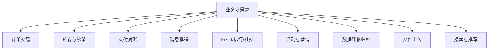
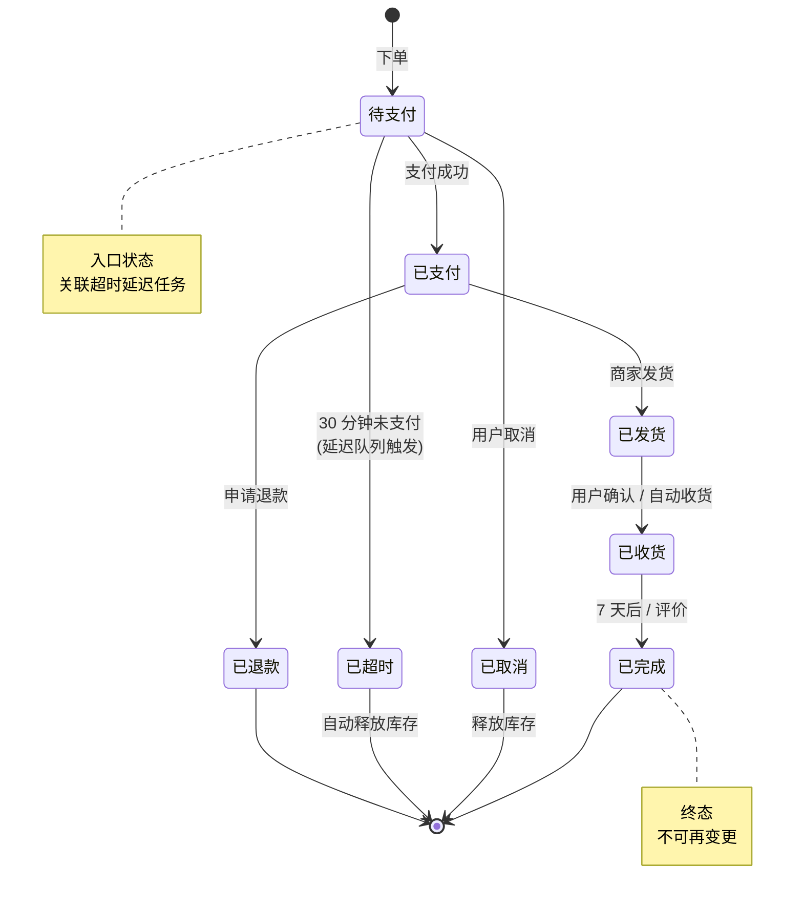
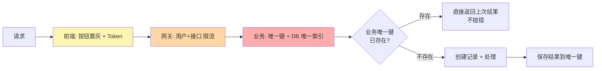

# 15 业务场景题 · 速记知识图谱（P0-P3）

> 模块定位：开放题集中营。每个场景背后都有一组"标准解法"，高级岗考察的是**你能不能识别问题→匹配方案→说出权衡**。61 题。
> 题量：61 题。

### P0 必背核心

#### 订单状态机与超时关闭
- **典型状态**：待支付 → 已支付 → 已发货 → 已收货 → 已完成；分支：已取消 / 已退款。
- **状态机原则**：① 状态变更只能单向（防回退）；② 每次变更带版本号防并发；③ DB 唯一索引 + 乐观锁兜底；④ 重要状态发 MQ 通知下游。
- **超时未支付**：方案一 **延迟队列**（RocketMQ 18 个延迟级别 / Redis ZSet 分钟级扫描 / 时间轮）；方案二 **定时任务扫描**（每分钟扫"创建时间 > 30 分钟且状态 = 待支付"），简单但有延迟。
- **大厂主流**：延迟队列做实时关闭 + 定时任务兜底（防消息丢失）。
- 关联题：#0024

#### 防重复下单 / 幂等
- **场景**：用户点击两次、网络抖动重试、消息重投。
- **三层防护**：
  - **前端**：按钮置灰、Token（提交前申请 Token，提交时校验删除）。
  - **接入层**：网关限流（每用户接口 QPS）、Redis SETNX 短时间防重复。
  - **业务层**：**业务唯一键 + DB 唯一索引**（如 user_id + 商品 ID + 时间窗口，或前端传 requestId）兜底。
- **设计原则**：找到业务唯一键，第一次创建产生记录，第二次查到记录直接返回（不抛错）。
- 关联题：#0024

| 防护层 | 手段 | 强度 |
|---|---|---|
| 前端 | 按钮置灰 / Token | 弱（开发者工具可绕过） |
| 接入层 | 网关 SETNX / 短时间防重 | 中 |
| 业务层 | DB 唯一索引 + 业务唯一键 | 强 ⭐ 兜底 |

#### 库存超卖三种方案
- **方案 A：DB 行锁**：`UPDATE stock SET count = count - 1 WHERE id = X AND count >= 1`，受影响行数判断成功。性能 < 1000 TPS，简单可靠，适合中低并发。
- **方案 B：Redis 预扣 + MQ 落库**：Lua 原子扣 Redis 库存 → 成功后发 MQ → 消费者落 DB。百万 TPS，最终一致，需对账兜底。
- **方案 C：分桶库存**：100 库存分 10 桶 × 10，用户路由到某桶；某桶卖完可向其他桶借。突破单热点瓶颈。
- **超卖防护**：扣减时检查 `count >= 需扣量`，并用乐观锁/原子操作；定期对账 DB 与 Redis。
- 关联题：#0024、#0034

#### 小红书 MySQL 抗秒杀方案（典型案例）
- 不一定上 Redis。MySQL 单库写极限约 5000 TPS，配合 InnoDB 优化可达万级 TPS：
  - **库存合并**：把同一商品的多条扣减请求在应用层合并（队列收 100 ms 内的请求，一次 UPDATE 减总数），降低 DB 写次数。
  - **乐观锁 / Token 队列**：内存中按商品做 FIFO 队列，串行执行扣减。
  - **预热 + 内存校验**：库存预热到内存，前置判断不足直接拒绝。
  - **核心思想**：把热点串行化（消除竞争）+ 批量合并（减少 IO）。
- 适用：库存总量小、瞬时并发不极端、对一致性要求高（金融场景）。
- 关联题：#0034

#### 支付对账 / 财务对账
- **三方对账**：自己平台 + 第三方支付（微信/支付宝） + 银行流水，三方数据互相核对。
- **流程**：① 每日 T+1 拉取第三方对账文件；② 与本地交易表比对（金额、状态、订单号）；③ 标记 差异（我有他没/他有我没/金额不同）；④ 人工或自动处理。
- **关键技术**：① 大文件流式处理（一行行处理避免 OOM）；② 双方排序后归并比对；③ 任务幂等可重跑；④ 告警异常差异。

#### 文件上传：断点续传 / 秒传 / 分片
- **分片上传**：大文件切成多个 chunk（如 5MB / 个），并行上传；服务端按 chunk 顺序合并。
- **断点续传**：上传前查询服务端已上传的 chunk 列表，跳过已上传的；网络断开重连后继续。
- **秒传**：先算整个文件的 MD5/SHA1 → 询问服务端是否已存在 → 存在则直接返回（其他用户已传过相同文件，省流量省存储）。
- **存储**：阿里云 OSS / 腾讯云 COS 都原生支持分片上传 API。
- **前端**：可用 `webuploader` / `simple-uploader` 等成熟库。

### P1 加分高频

#### 朋友圈 / Feed 流（写扩散）
- **数据模型**：用户表、关注表、动态表（动态 ID + 作者 ID + 内容 + 时间）。
- **写扩散**：用户 A 发动态 → 写到所有粉丝（朋友 5000 上限）的"收件箱"（Redis ZSet）。
- **读取**：用户 B 刷动态 → 直接读自己收件箱（ZSet ZREVRANGE 按时间倒序）。
- **冷热分离**：热数据 Redis（最近 30 天），冷数据 MySQL 分库分表 + 对象存储归档。
- **图片 / 视频**：上传到 OSS，动态表只存 URL。
- **点赞 / 评论**：独立服务，按动态 ID 聚合。

#### 微博 / 大 V Feed 流（推拉结合）
- **大 V（粉丝 > 1 万）拉模式**：发动态只写自己时间线。
- **普通用户推模式**：发动态推送给粉丝。
- **客户端合并**：自己关注的大 V 列表 + 自己收件箱，合并排序展示。

#### 排行榜
- **实时排行**：Redis ZSet，ZADD 加分，ZREVRANGE 取 top N。性能强，百万级用户 OK。
- **分时段**：日榜 / 周榜 / 月榜各用独立 ZSet，设 TTL。
- **大数据量**：先 Redis 实时 + 离线计算（Hive / Flink）定时刷新。
- **分桶**：千万级用户分 100 桶，每桶各自排，最后合并取 top N（蓄水池抽样思想）。
- **防作弊**：限频（每用户每天最多加分 X 次）、风控（IP/设备/行为模式）。

#### 评论 / 点赞高频写
- **点赞**：Redis HINCRBY post:like { user_id : 1 } 同时记录用户列表 SADD post:liker:123 user_id；定时（如每分钟）批量同步到 DB。
- **评论**：先写 Redis 队列 / MQ 异步落 DB（避免 DB 写压力），客户端立即显示。
- **树状评论**：每条评论存 parent_id，"楼中楼"分页（外层评论按时间，子评论分页加载）。

#### 站内信 / 消息推送
- **场景**：系统通知、活动消息、订阅消息。
- **数据模型**：消息表（消息 ID + 内容） + 用户消息关联表（user_id + 消息 ID + 是否已读）。
- **全员消息**：用户量大时不能给每个用户写一条记录（写爆表）；改用"全员消息池 + 读取时合并 + 已读记录"。
- **推送**：长连接（IM 服务）+ 离线消息（Redis / MQ）；端外推送（APNs / FCM / 厂商通道）。

#### 短链系统
- **生成**：发号器（雪花） + Base62 转换 = 6-8 位短码。
- **存储**：Redis 主存（短→长）、MySQL 持久化、可选布隆过滤器拦截无效短码。
- **重定向**：301 永久 vs 302 临时；大厂用 302（每次到服务端可统计点击）。
- **统计**：每次 302 时异步记录访问日志（用户、IP、UA、来源），后台分析。

#### 限时活动 / 优惠券系统
- **领取**：限制每用户领取数（Redis SETNX user:coupon:123）；活动库存预扣（Redis LIST RPOP）。
- **核销**：用 Lua 原子扣减 + 状态机变更（未领 → 已领 → 已用 → 已过期）。
- **过期处理**：① Redis TTL；② 定时任务扫；③ 延迟队列。
- **风控**：同 IP/设备/手机号限制、异常行为识别。

#### 接单调度 / 派单（外卖、网约车）
- **派单算法**：综合距离、骑手负载、订单价值、预计完成时间打分排序。
- **实时定位**：骑手定位实时上报到 Redis GEO / 时序数据库；订单按地理位置匹配最近骑手。
- **抢单 vs 派单**：抢单（多骑手看到，谁快谁拿）简单但骑手体验差；派单（系统指定）复杂但用户体验好。

#### 数据迁移与归档
- **历史数据归档**：DB 表太大 → 把 1 年前的数据迁到归档库（冷库）/ 对象存储 / 数据仓库；线上业务只查近 1 年。
- **迁移方式**：① 业务低峰期分批 INSERT...SELECT；② Canal 订阅 binlog 同步；③ DataX 全量 + 增量。
- **删除**：归档完后清理源表（DELETE LIMIT 1000 分批 + sleep，避免大事务和主从延迟）。
- **校验**：迁移前后行数校验、关键字段抽样比对。
- 关联题：#0024

### P2 深度延伸

#### 二次分表（基因法已用过）
- **难题**：订单号已用基因法嵌入用户 ID 4 位（16 个分片），现在要扩到 32 个分片需要 5 位基因。
- **方案 A**：保留原 4 位基因 + 新增 1 位"扩展基因"，新数据按 5 位路由，老数据按 4 位 → 路由到新旧分片中的两个之一（要做对应表）。
- **方案 B**：双写过渡——新旧分片同时写，逐步把流量切到新分片，老分片只读直到所有老数据查询走完。
- **方案 C**：直接停机迁移（业务可接受时最简单）。
- 关联题：#0016

#### 流水号 / 业务编号设计
- **要求**：① 唯一；② 趋势递增（B+ 树友好）；③ 可读（方便客服查询）；④ 可路由（嵌入分片基因）；⑤ 不可枚举（防爬）。
- **典型设计**：业务前缀（2 位，如 OR=订单、PA=支付） + 日期（6 位 yyMMdd） + 雪花序列（10 位） + 用户基因（4 位）。

#### 大促预案
- **容量评估**：基于历史峰值 × 增长系数 + 安全冗余（一般 2-3 倍）。
- **压测**：① 单接口压测；② 全链路压测（影子库/影子表）；③ 故障演练（混沌工程，主动 kill 节点 / 网络抖动）。
- **限流降级预案**：每个核心接口都要有"开关"——一键限流到 50%、一键降级到兜底页。
- **监控告警**：核心指标实时大屏；预案责任人值守。
- **灰度发布**：大促前一周禁止重大变更；变更必走灰度。

#### 防刷与风控
- **设备指纹**：综合设备型号、UA、屏幕、硬件信息 hash 出唯一 ID。
- **行为分析**：操作间隔过短（机器人）、操作路径异常、IP 高频访问。
- **滑块 / 答题 / 图形验证码**：人机校验，秒杀活动开始前必加。
- **黑名单**：识别出的恶意用户/IP/设备拉黑。
- **限流**：用户级 / IP 级 / 接口级多维度限流。

#### 站内搜索
- **架构**：MySQL 做主存（订单事务）→ Canal 订阅 binlog → MQ → ES 索引；C 端复杂查询走 ES。
- **同步延迟**：通常秒级；强一致场景（如刚下单要立即查到）需特殊处理（双读、消息回查）。
- **ES Mapping 设计**：双字段（text + keyword）、合适的分词器（IK 中文）、控制 field 数量。

#### 推荐系统简介
- **三大要素**：用户画像（标签）、物品画像（标签 + 内容）、行为日志（点击/收藏/购买）。
- **召回**：协同过滤（User-Based / Item-Based）、向量召回（Embedding + Faiss / Milvus）、规则召回（热门/新品）。
- **排序**：CTR 预估模型（LR / GBDT / DeepFM）。
- **重排**：业务规则（多样性、商业化、新颖度）。

### P3 冷门刁钻

#### IM 已读回执
- **客户端收到 → 发 ACK 给服务端 → 服务端更新消息表的已读状态 → 推送已读状态给发送方**。
- 群聊已读：发送方点击查看时拉取"已读用户列表"。

#### 抽奖系统设计
- **概率配置**：DB 表存奖项 + 概率 + 库存。
- **抽奖算法**：① 区间法（[0, 0.1] 奖 A、[0.1, 0.2] 奖 B...）；② 别名法（O(1) 抽奖）。
- **库存控制**：Redis 预扣 + 兜底奖品。
- **防作弊**：每用户每天次数限制、风控接入。

#### 商品详情页聚合
- **多服务调用**：商品基本信息（商品服务）、价格（价格服务）、库存（库存服务）、评论数（评论服务）、店铺（店铺服务）；需聚合 5+ 个接口。
- **优化**：① CompletableFuture 并行调用；② 服务端聚合接口（BFF）；③ 缓存整页（页面级缓存）+ 局部失效。

### 跨模块联想

- 订单状态机 ↔ **08 微服务**：服务拆分、状态变更通过 MQ 触达下游。
- 库存扣减 ↔ **06 Redis** + **05 MySQL**：Redis Lua 预扣 + DB 行锁兜底。
- 秒杀架构 ↔ **14 系统设计**：缓存 + 异步 + 分流的最佳实践。
- Feed 流 ↔ **14 系统设计**：推/拉/推拉结合，写扩散的标准答案。
- 分布式 ID ↔ **10 锁与ID**：雪花、Leaf；订单号嵌入基因。
- 二次分表 ↔ **11 分库分表**：基因法的扩容难题。
- 站内搜索 ↔ **12 中间件**：MySQL + Canal + ES 组合。
- 文件上传 ↔ **21 Excel与文件**：分片 + 断点续传 + 秒传。
- 推荐系统 ↔ **18 AI**：向量召回 + Embedding 与 LLM 时代的演进。
- 风控 ↔ **08 微服务**：限流、熔断、灰度与风控一体化。

---
