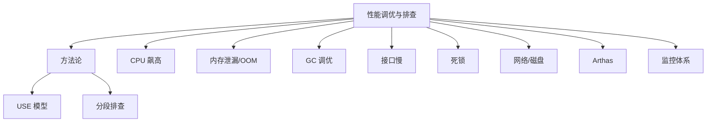
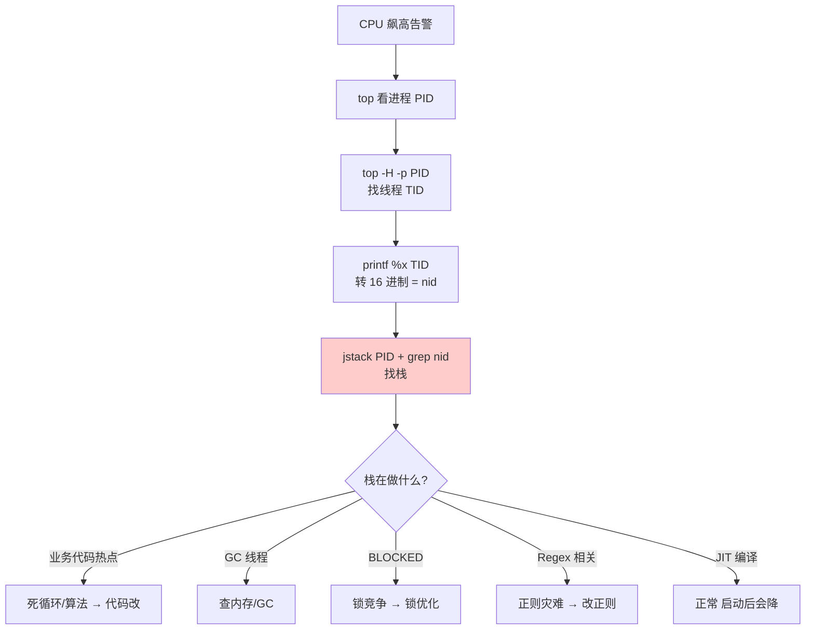
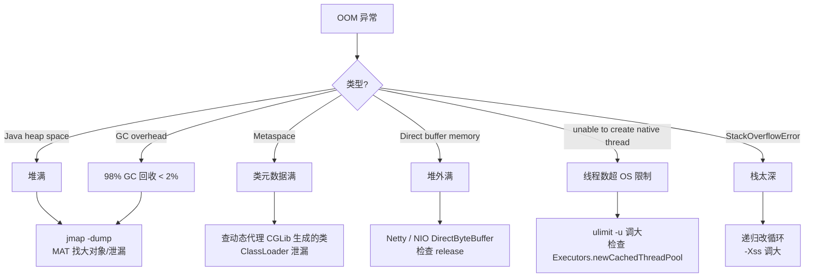

# 16 性能调优与故障排查 · 速记知识图谱（P0-P3）

> 模块定位：SRE / 高级开发分水岭。考察**方法论 + 工具链 + 实战经验**。34 题。
> 题量：34 题。

### P0 必背核心

#### 排查方法论（USE / 分段）
- **USE 模型**：每种资源看三项——**Utilization 利用率、Saturation 饱和度（队列堆积）、Errors 错误**。资源包括 CPU、内存、磁盘、网络、文件描述符。
- **分段排查**：用户请求 → 浏览器/客户端 → DNS → CDN → 网关 → 应用 → 缓存 → DB → 下游服务。**逐段定位**问题在哪一层。
- **三段六问法**：是哪个接口慢？发生频率？是全量慢还是部分慢？最近上线了什么？外部依赖是否正常？资源是否充足？
- **黄金 4 指标**：延迟、流量、错误率、饱和度——Google SRE 标准。
- 关联题：#0096

#### 接口慢排查全流程
- ① **看监控**：在哪一层慢（链路追踪 SkyWalking/Zipkin）。
- ② **看指标**：CPU/内存/GC/连接池/慢 SQL。
- ③ **定段**：找到具体慢的下游（DB？缓存？外部 API？）。
- ④ **定根因**：
  - DB 慢 → 看慢查询日志、EXPLAIN 看索引是否失效。
  - 缓存慢 → BigKey / HotKey、网络抖动。
  - 应用慢 → jstack 看线程阻塞、jstat 看 GC、Arthas trace 看方法耗时。
  - 下游慢 → 该下游服务自己排查。
- ⑤ **方案**：加索引 / 加缓存 / 优化代码 / 扩容 / 异步化 / 限流。
- 关联题：#0096

#### CPU 飙高排查
- ① **`top` 看进程 CPU**：找到高 CPU 的 Java 进程 PID。
- ② **`top -H -p <pid>` 看线程级 CPU**：找到具体高 CPU 的线程 TID。
- ③ **`printf "%x\n" <TID>` 转 16 进制**：得到 nid。
- ④ **`jstack <pid> | grep -A 30 <nid>`**：找到对应栈，看在做什么。
- **常见原因**：
  - **死循环 / 算法热点**：栈里反复出现同一方法 → 代码 bug。
  - **频繁 GC**：jstat -gcutil 看 FGC 频率，GC 线程占 CPU 高 → 内存问题。
  - **锁竞争**：栈里大量 BLOCKED → 锁优化。
  - **正则灾难**：复杂正则匹配某些输入指数级爆炸。
- 关联题：#0096

#### 内存泄漏排查
- ① **`jstat -gc <pid> 1000`**：看老年代是否持续增长且 FGC 后不下降。
- ② **`jmap -dump:live,format=b,file=heap.hprof <pid>`**：导出堆快照（live 触发 FGC 只看存活对象，减小文件）。
- ③ **MAT 分析**：
  - **Histogram**：按类统计实例数和占用。
  - **Dominator Tree**：哪些对象持有大量引用。
  - **Leak Suspects 报告**：自动找出可疑泄漏点。
- ④ **常见原因**：
  - 静态集合无限增长（如 static Map 不清理）。
  - **ThreadLocal 不 remove**（Thread 是池里复用的，Entry key 弱引用被 GC 但 value 强引用未清理）。
  - **ClassLoader 泄漏**：Tomcat 热部署、动态生成类（CGLib）。
  - 监听器/回调注册了但没注销。
  - 连接池/线程池资源未关闭。
  - 缓存无上限（Map 当缓存而非用 LinkedHashMap LRU 或 Caffeine）。
- 关联题：#0096

#### OOM 分类与对策
- **Java heap space**：堆满。检查大对象、集合泄漏、缓存无上限、ThreadLocal、`-Xmx` 是否过小。
- **GC overhead limit exceeded**：98% 时间 GC 但回收 < 2% 内存——本质是堆要满了。
- **Metaspace**：类元数据满。检查动态生成类（CGLib、JSP）、ClassLoader 泄漏；`-XX:MetaspaceSize` / `-XX:MaxMetaspaceSize`。
- **Direct buffer memory**：堆外满。Netty / NIO ByteBuffer.allocateDirect 失控；`-XX:MaxDirectMemorySize`（默认等于 -Xmx）。
- **unable to create new native thread**：线程太多超 OS 限制。`ulimit -u` 调大；检查是否有线程池配置不当（Executors.newCachedThreadPool 无上限）。
- **StackOverflowError**：单线程栈深太深（不是 OOM，是 Error）。递归太深 / 栈太小（`-Xss`，默认 1MB）。
- 关联题：#0096

| OOM 类型 | 根因 | 排查工具 | 调参 |
|---|---|---|---|
| Java heap space | 大对象/集合泄漏 | jmap + MAT | -Xmx |
| GC overhead | 堆满边缘 | jstat + jmap | -Xmx + GC |
| Metaspace | 动态类太多 | jmap -clstats | -XX:MaxMetaspaceSize |
| Direct buffer | 堆外失控 | NMT / Netty leak detect | -XX:MaxDirectMemorySize |
| native thread | 线程数爆 | ps -L + jstack | ulimit -u + 池化 |
| StackOverflowError | 递归太深 | jstack | -Xss |

#### JVM 调优入门
- **4C8G 机器示例**（每天 100 万次登录请求）：
  - `-Xms4g -Xmx4g`（避免动态调整，堆大小固定）。
  - `-XX:+UseG1GC`（JDK 9+ 默认）。
  - `-XX:MaxGCPauseMillis=200`（目标停顿，按业务可调）。
  - `-Xss512k`（栈大小，节省并发线程数）。
  - `-XX:MetaspaceSize=256m -XX:MaxMetaspaceSize=512m`。
  - GC 日志：`-Xlog:gc*:file=/var/log/gc.log:time,uptime:filecount=10,filesize=100M`（JDK 9+）。
  - OOM Dump：`-XX:+HeapDumpOnOutOfMemoryError -XX:HeapDumpPath=/var/log/heap`。
- **调优原则**：① 先压测看现状；② 按瓶颈调参；③ 调完再压测验证；不要凭感觉调。
- 关联题：#0096

#### Arthas 实战命令
- **`dashboard`**：实时大盘（线程、内存、GC、Runtime）。
- **`thread`**：`thread -n 5` 看最忙 5 个线程；`thread -b` 看死锁；`thread <id>` 看具体栈。
- **`watch`**：观察方法的入参、返回值、异常。`watch com.x.y.UserService getUser '{params, returnObj, throwExp}' -x 3`。
- **`trace`**：方法耗时分布，跨调用链路。`trace com.x.y.OrderService createOrder`。
- **`tt`**（TimeTunnel）：记录方法每次调用的详情，可重放。
- **`jad`**：反编译已加载的类，看运行时实际字节码。
- **`redefine`** / **`mc`**：热更新 class 文件，**线上修 bug 神器**（注意：仅方法体可改，不能加/删方法/字段）。
- **`monitor`**：方法调用统计（次数、平均 RT、错误数）。
- 关联题：#0096

### P1 加分高频

#### GC 频繁排查
- **YGC 频繁**（每秒多次）：
  - 新生代过小（`-Xmn` 或 G1 自适应）。
  - 对象创建率高（业务 bug，循环 new、字符串拼接）。
  - 大量短命对象（Stream / Lambda 临时对象）。
- **FGC 频繁**（分钟级 / 秒级）：
  - 老年代满 → 看是大对象直接进老年代 / 还是晋升过快 / 还是泄漏。
  - 显式 `System.gc()`（用 `-XX:+DisableExplicitGC` 禁用）。
  - Metaspace 满（连带 FGC）。
- **正常频率**：FGC **几小时甚至几天一次**，几分钟一次就要排查。
- 关联题：#0096

#### 死锁排查
- **`jstack <pid>`**：输出末尾有 "Found one Java-level deadlock"，直接列出循环等待的线程和锁。
- **DB 死锁**：`SHOW ENGINE INNODB STATUS\G` 看 LATEST DETECTED DEADLOCK 段。
- **死锁四大条件**：互斥、占有且等待、不可剥夺、循环等待。
- **避免**：① 固定加锁顺序；② tryLock + 超时；③ 减少锁粒度；④ 用无锁数据结构（CAS / ConcurrentHashMap）。
- 关联题：#0096

#### 数据库慢排查
- ① **慢查询日志**：`slow_query_log=1, long_query_time=1` 记录 > 1s 的 SQL。
- ② **`pt-query-digest slow.log`**：聚合分析慢 SQL TOP N。
- ③ **`EXPLAIN`** 看执行计划，关注 type（至少 range，理想 ref）、key（实际索引）、Extra（Using filesort / Using temporary 警惕）。
- ④ **`SHOW PROCESSLIST`** 看当前活跃连接和 SQL；`State` 看在做什么。
- ⑤ **`SHOW ENGINE INNODB STATUS`** 看锁等待。
- ⑥ **优化方向**：建索引、改 SQL（去 `SELECT *`、避免函数、用 join 替代子查询）、拆表、读写分离、缓存。
- 关联题：#0096

#### Redis 性能问题
- **BigKey**：单个 key value 太大（如 List/Hash 百万元素）。影响：阻塞主线程、网络拥塞、迁移慢。
  - 定位：`redis-cli --bigkeys` 扫描；线上风险高用 `MEMORY USAGE` 抽样。
  - 拆分：把大 Hash 拆成多个小 Hash（按 hash slot 路由）。
- **HotKey**：单个 key 访问频次极高（明星动态、热门商品）。影响：单分片打挂。
  - 定位：`redis-cli --hotkeys`（需开 LFU 策略）；监控埋点。
  - 解决：① 本地缓存（Caffeine）顶住；② key 拆多副本（key_1、key_2... 客户端随机选）。
- **慢命令**：KEYS（O(N) 阻塞）、HGETALL 大 Hash、SORT、SUNION 大集合。
- 监控：`SLOWLOG GET 10` 查最近慢命令。

#### 网络问题排查
- **`ss -lntp`**：看监听端口。
- **`ss -ant | awk '{print $1}' | sort | uniq -c`**：统计各连接状态数量（ESTABLISHED / TIME_WAIT / CLOSE_WAIT / SYN_RECV）。
- **`netstat -s`**：统计协议层异常（重传、丢包、SYN cookies 触发）。
- **`tcpdump -i eth0 host X port Y -w out.pcap`**：抓包，用 Wireshark 分析。
- **常见问题**：
  - CLOSE_WAIT 堆积 → 应用没 close 连接，代码 bug。
  - TIME_WAIT 堆积 → 大量短连接，改长连接或调 `tcp_tw_reuse`。
  - 端口耗尽 → 调 `net.ipv4.ip_local_port_range`。

#### 磁盘 IO 排查
- **`iostat -x 1`**：
  - `%util > 80%` → 磁盘繁忙。
  - `await > 20ms`（机械盘）/ `> 5ms`（SSD）→ IO 延迟高。
  - `r/s w/s` → IOPS。
  - `rkB/s wkB/s` → 吞吐。
- **`iotop`**：找哪个进程 IO 高。
- **`pidstat -d 1`**：进程级 IO 统计。
- **常见原因**：① 大日志频繁写；② 大查询扫盘；③ 备份/对账；④ 频繁刷脏页。

#### 应用监控指标
- **业务**：QPS / TPS / 响应时间 P95/P99/P999 / 错误率 / 成功率。
- **资源**：CPU / 内存 / 磁盘 / 网络。
- **JVM**：堆占用 / 老年代占用 / YGC FGC 频率耗时 / 线程数 / Metaspace。
- **中间件**：DB 连接池占用 / Redis 命中率 / MQ 堆积。
- **慢调用 TOP N**：识别系统瓶颈。

### P2 深度延伸

#### CMS Concurrent Mode Failure
- CMS 并发回收老年代时，对象晋升老年代速度超过 CMS 回收速度，老年代被占满。
- CMS 退化为 **Serial Old**（单线程标记-整理），STW 超长（秒级甚至分钟级）。
- 触发条件：老年代占用超过 `-XX:CMSInitiatingOccupancyFraction`（默认 92%）后才启动 CMS 收集太晚。
- 解决：降低触发阈值、增大老年代、检查是否有大对象直接晋升。

#### G1 Mixed GC 失败 → Full GC
- G1 Mixed GC（年轻代 + 部分老年代回收）失败 → 退化为 Serial GC Full GC。
- 触发：Region 选不出来 / 转移失败（to-space exhausted）。
- 解决：提前 GC（-XX:InitiatingHeapOccupancyPercent，默认 45%）、增大堆、调整 Region 大小。

#### Full GC 全流程分析
- **是大对象直接进老年代吗**：看 `-XX:PretenureSizeThreshold`。
- **是晋升过快吗**：看 jstat 中 OU 增长速率，结合 MaxTenuringThreshold（默认 15）。
- **是 Survivor 不够吗**：YGC 时 Survivor 放不下直接晋升。
- **是显式 System.gc() 吗**：开 `-XX:+DisableExplicitGC` 或 RMI 间隔 `-Dsun.rmi.dgc.client/server.gcInterval`。
- **是 Metaspace 满吗**：连带触发 Full GC。

#### 火焰图分析
- **async-profiler**：低开销，采样 CPU / 内存分配 / Lock / Wall-clock；生成 SVG 火焰图。
- **使用**：`./profiler.sh -d 60 -f flame.svg <pid>`，60 秒采样输出火焰图。
- **解读**：横轴宽度 = 占用 CPU 比例；纵轴 = 调用栈深度。最宽的栈帧就是 CPU 热点。

#### 监控体系
- **采集**：Prometheus 拉模式 / Exporter（JMX Exporter、Node Exporter、MySQL Exporter）。
- **存储**：Prometheus TSDB（短期）+ Thanos / VictoriaMetrics（长期）。
- **可视化**：Grafana 仪表盘。
- **告警**：AlertManager 路由 → 钉钉 / 企业微信 / 电话。
- **日志**：ELK（Elasticsearch + Logstash + Kibana）或 EFK（Fluentd）；日志收集 → 集中存储 → 检索分析。
- **链路追踪**：SkyWalking / Zipkin / Jaeger。
- **APM 一体化**：SkyWalking 8.x 起整合指标 + 日志 + 追踪 + 拓扑。

#### 压测方法
- **单接口压测**：JMeter / wrk / ab，找单接口瓶颈。
- **全链路压测**：阿里 PTS、字节火山 / 京东东方雪、自研。生产环境构造真实流量，影子库 / 影子表隔离。
- **混沌工程**：ChaosBlade（阿里）/ Chaos Mesh（PingCAP），主动注入故障（杀进程、网络抖动、CPU 满载）。
- **目标**：① 找拐点；② 验证容量预案；③ 暴露隐藏问题。

### P3 冷门刁钻

#### 安全点（Safe Point）卡顿
- **可数循环 counted loop**（int i = 0; i < N; i++）JIT 优化时可能去掉循环回边的 Safe Point Poll，导致单线程长循环阻塞其他线程进入 GC。
- 表现：jstack 显示大部分线程在 Waiting for safepoint。
- 解决：JDK 10+ `-XX:+UseCountedLoopSafepoints` 默认开启；早期 JDK 改 long 替代 int 或人为打断循环。

#### CPU 假高（GC 线程占用）
- jstack 看 nid 对应的栈不是业务代码，是 `GC Thread #N` / `G1 Conc#0` 这种，说明 CPU 是 GC 占的——本质是内存问题不是 CPU 问题，去查 GC。

#### 内核参数调优
- `net.ipv4.tcp_tw_reuse=1`：复用 TIME_WAIT。
- `net.core.somaxconn`：监听队列长度（默认 128，高并发要调到 65535）。
- `net.ipv4.tcp_max_syn_backlog`：半连接队列。
- `vm.swappiness=10`：尽量不用 swap。
- `fs.file-max` / `ulimit -n`：fd 上限。

#### Java 21 虚拟线程对调优的影响
- 大量阻塞 IO 场景下 Carrier Thread 数 = CPU 核数即可，不用调大线程池。
- 监控指标新增"挂起的虚拟线程数"——传统线程池监控失效。
- pinned（被钉住）：synchronized 块内做 IO 会钉住 Carrier Thread，改用 ReentrantLock。

### 跨模块联想

- JVM 排查 ↔ **02 JVM**：jstat/jmap/jstack/Arthas 是 JVM 知识的工具化。
- 接口慢 ↔ **05 MySQL**：慢 SQL + EXPLAIN 是必修。
- 接口慢 ↔ **06 Redis**：BigKey/HotKey、慢命令排查。
- 死锁排查 ↔ **03 并发**：jstack 自动检测 Java 死锁；DB 死锁靠 SHOW ENGINE INNODB STATUS。
- 网络问题 ↔ **13 网络**：TIME_WAIT/CLOSE_WAIT 背后的 TCP 协议。
- 链路追踪 ↔ **08 微服务**：SkyWalking traceId 透传定位慢段。
- 监控体系 ↔ **08 微服务**：Prometheus + Grafana + 告警是服务治理标配。
- 火焰图 ↔ **02 JVM**：async-profiler 看 CPU 热点比 jstack 更精准。
- 内核调优 ↔ **13 网络**：高并发服务必调内核参数。

---
