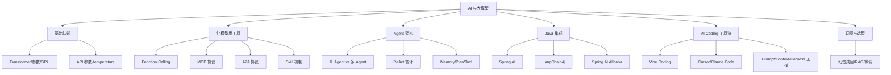
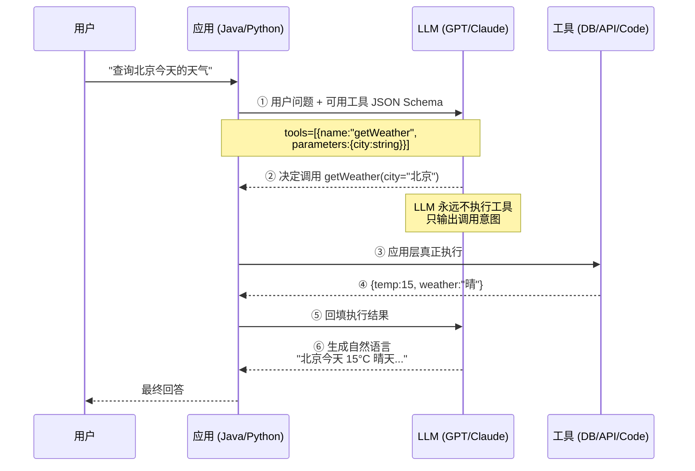
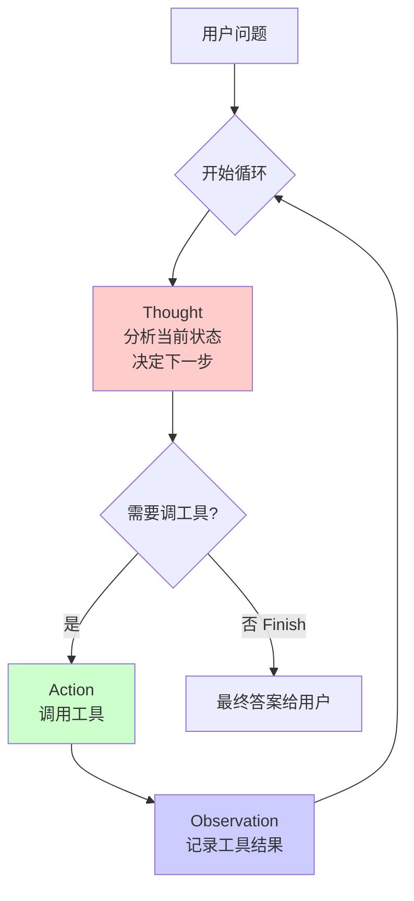
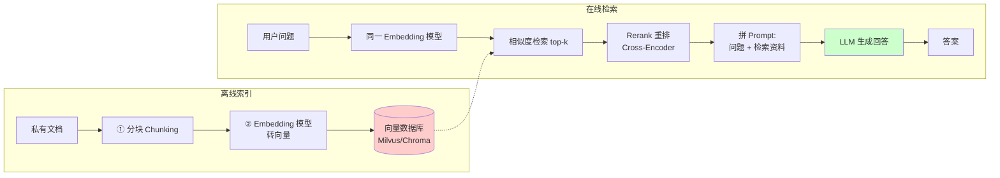

# 18 AI 与大模型 · 速记知识图谱（P0-P3）

> 模块定位：2024-2025 面试新增"必问区"，高级 Java 岗已经成为标配考点。重点是**大模型基础认知 + Function Calling/MCP/A2A 协议族 + RAG/Agent 架构 + Spring AI/LangChain4j 集成**。
> 题量：30 题（数量不算多，但内容全是 2024-2025 业界最新认知，考察"是否真的在用 AI"）。



### P0 必背核心

#### 怎么理解大模型 / Transformer
- "大"主要体现在**参数规模**：7B 即 70 亿参数、70B 即 700 亿。参数越多通常能力越强，但推理成本也越高。
- 底层架构是 **Transformer**，核心是**自注意力机制（Self-Attention）+ 多头注意力**，相比 RNN/CNN 具有更强的**并行计算能力**和**更长的上下文理解能力**——这也是为什么训练必须用 GPU。
- 工作原理本质是**"概率填空"**：根据上文预测下一个 token 的概率分布，再按策略采样。它不"思考"，只是在算下一个词。
- **应用范围**远不止 NLP：CV（Stable Diffusion/DALL·E）、语音（Whisper/VALL-E）、自动驾驶（Tesla FSD）、科学计算（AlphaFold）、视频生成（Sora）等。
- 当前关键问题：数据隐私、**幻觉（Hallucination）**、能耗高（一次训练 ~ 数千吨 CO₂ 当量）、可控性与安全性。
- 关联题：#0407、#0397、#0733

#### 大模型擅长 vs 不擅长
- **擅长**：文本生成/总结/翻译/信息抽取、代码生成与解释、广泛知识问答、多模态生成（文本→图/视频/语音）、从非结构化文本提取 JSON/表格。
- **不擅长**：① 精确数值计算（经典翻车题"3.9 和 3.11 哪个大"）；② 长推理链的严密逻辑；③ 实时信息（训练截止后不知道）；④ 长尾/冷门专业知识；⑤ 主动学习新知识；⑥ 给出医学、法律等不可错的专业建议。
- 工程含义：**精确计算交给工具（Function Calling/Code Interpreter）**，实时信息交给 **RAG/联网**，专业领域交给**微调 + RAG**。
- 关联题：#0397

#### GPU vs CPU & 为什么大模型必须用 GPU
- **CPU**：核心数少但单核强，适合通用复杂任务、串行逻辑、操作系统调度。
- **GPU**：核心数多（数千 SP/CUDA Core）但单核弱，专为**并行重复计算**设计。
- 大模型训练/推理本质是**大量矩阵运算**（自注意力的 Q·Kᵀ、前馈层），可被拆解成大量同构小任务并行执行——天然契合 GPU 架构。
- 推论：挖矿（重复哈希计算）、深度学习训练、视频渲染都用 GPU 是同一个底层原因。
- 关联题：#0733

#### 大模型 API 核心参数
- **api_key**：身份验证，在 HTTP Header `Authorization: Bearer <key>` 中。
- **base_url**：服务地址。各家不同：OpenAI `https://api.openai.com/v1`、DeepSeek `https://api.deepseek.com/v1`、通义 `https://dashscope.aliyuncs.com/compatible-mode/v1`、Ollama 本地 `http://localhost:11434/v1`。注意 Spring AI 默认拼 `/v1/chat/completions`，LangChain 默认拼 `/chat/completions`，配置时要看框架习惯。
- **model**：指定模型，如 `gpt-4o`、`qwen-plus`、`deepseek-chat`。
- **messages**：消息数组，`role` 取 `system`/`user`/`assistant`，多轮对话靠它累计历史。
- **temperature**：温度系数，0.0-2.0（部分 0-1）。**低值更稳定/确定**（事实问答、代码、法律用 0.1），**高值更发散/有创意**（写作头脑风暴用 0.9），默认 0.7。
- **top_p**：核采样（Nucleus Sampling），从概率累计 top_p 的候选词中采样。**和 temperature 二选一**调，同时调容易不可控。
- **max_tokens**：单次输出最大 token 数，防止失控长输出 / 控成本。
- **stream**：是否流式返回。`true` 时逐 token 推送（SSE），用户体验好，长回答必开。
- **stop**：停止符（字符串或数组），生成到匹配立即结束，常用于结构化输出截断。
- **seed**：相同 seed + 相同输入尽量复现同样输出，**不保证 100%**。
- 关联题：#0023

#### Function Calling（函数调用 / 工具使用）
- **本质**：让大模型"会用工具"的方案——大模型无法直接执行代码或联网，但可以**告诉应用层"调哪个函数 + 传什么参数"**。
- **核心流程（5 步）**：① 应用把可用工具的 JSON Schema 描述 + 用户问题一起发给 LLM；② LLM 决定调哪个工具、给出参数；③ **应用层（你的 Java/Python 代码）真正执行工具**；④ 把执行结果回填给 LLM；⑤ LLM 根据结果生成最终自然语言回答。
- **工具描述格式**：JSON Schema，包含 `name`、`description`、`parameters`（含 `type`、`required`、`enum` 等）。`description` 写得好不好直接决定 LLM 选不选你的工具。
- **关键认知**：LLM 永远不执行工具，只生成调用意图。所有"安全/权限/数据库写入"控制点都在应用侧。
- **并行调用（Parallel Tool Use）**：现代模型（GPT-4o、Claude 3.5+）可在一轮里返回多个工具调用，应用并发执行后一起回填，可显著降低延迟。
- 关联题：#0014



#### MCP（Model Context Protocol）
- **定位**：Anthropic 2024 年提出的**开源标准协议**，统一大模型与外部工具/数据源的接入方式。**类比"AI 界的 USB-C"**——只要遵守协议，工具和模型即插即用。
- **三大核心组件**：① **MCP Host**（Claude Desktop、Cursor、IDE 等 AI 入口）；② **MCP Server**（轻量服务，封装 GitHub API / 数据库 / 本地文件系统等具体工具，通常**别人写好的现成 Server 可以直接用**）；③ **MCP Client**（协议客户端，维护与 Server 的连接）。
- **和 Function Calling 的区别**：Function Calling 是 OpenAI 提出的模型内部能力，每接一个工具都要重新写代码；MCP 是**生态级协议**，工具一次封装到处复用。可以理解为 Function Calling 是 USB 设备的"插槽"，MCP 是统一了"插头形状"的标准。
- **典型流转**：用户提问 → Host 把问题 + 已挂载 Server 列表给 LLM → LLM 选工具 → MCP Client 调对应 Server 执行 → 结果回给 LLM → 生成最终回答。
- 关联题：#0328、#0026

#### A2A（Agent-to-Agent Protocol）
- **定位**：Google 推出的协议，解决**多个独立部署的 Agent 之间互相调用与协作**的问题，类似 RPC 之于微服务。
- **和 MCP 的本质区别**：**MCP 是 Agent ↔ 工具**之间的协议，**A2A 是 Agent ↔ Agent**之间的协议。
- **核心概念**：① **Agent Card**——每个 Agent 对外声明自己能做什么的"名片"（类似 Swagger）；② **Task**——客户端 Agent 基于 Card 构造任务；③ **Message**——任务封装在 request/response Message 中传输；④ **Artifact**——任务产出物（文件、图片、报告等）。
- **使用场景**：跨团队、跨公司、跨语言（Java Agent 调 Python Agent）的 Agent 协作。自己一个项目内的多 Agent **不需要 A2A**，直接代码编排即可。
- 关联题：#0033

#### Skill 机制 & 和 MCP 的关系
- **Skill** 是 **Anthropic** 提出的新范式，解决的是**上下文太长**的问题——是上下文工程（Context Engineering）的典型实现。
- **类比**：Agent 是厨师，MCP/Function Calling 是锅碗瓢盆和食材，**Skill 就是菜谱**——告诉厨师"这道菜该怎么做"。
- **结构**：本质是一个**标准化目录**，最少包含 `SKILL.md`（必选，技能说明 + 指令约束），可选 `scripts/`（确定性脚本）、`references/`（参考资料）、`assets/`（图片等）。
- **渐进式披露机制**（核心设计）：分阶段加载，避免一次性吃光上下文。① **发现阶段**：只读取 SKILL.md 的 frontmatter 元数据；② **决策阶段**：决定用这个 Skill 时才加载完整 Instruction；③ **细节阶段**：Reference 只在明确需要时才进上下文；④ **确定性执行阶段**：流程中不适合 LLM 自由生成的部分调 Script 走确定性逻辑。
- **总结口诀**："**Agent = 干活的人，MCP = 能用的工具，Skill = 这活该怎么干**"。
- **Skill 自进化**（Hermes Agent 引入）：任务完成后自动复盘、抽象成新 Skill 文件，下次同类任务直接调用——Skill 从"静态调用"变成"动态生成"。
- 关联题：#0026、#0027、#0013

#### AI Agent（智能体）
- **核心公式**：**Agent = LLM + Memory + Tools（使用 + 规划）**。这张图来源是 Lilian Weng 的 LLM-powered Autonomous Agents。
- **三大能力**：① **感知（Perception）**——接收用户输入 + 历史记忆；② **决策（Planning + Decision）**——基于感知信息选工具、定计划；③ **行动（Action）**——执行工具调用。
- **Memory**：短期记忆（当前对话窗口/上下文）+ 长期记忆（跨会话的事实、偏好，通常用向量库存）。
- **Planning**：规划能力，决定何时用哪些工具。简单的就是 ReAct 一步步走；复杂的有 Plan-and-Execute（先出完整计划再执行）、Reflection（执行后反思）。
- 关联题：#0112

#### ReAct Agent（最经典的 Agent 模式）
- **核心思想**：让 LLM 像人一样**思考 + 行动 + 观察**循环：**Thought → Action → Observation → Thought → ...**
- **三步循环**：① **Thought**——分析当前状态、决定下一步；② **Action**——调用工具或返回 Finish；③ **Observation**——记录工具执行结果，反馈给 LLM 继续下一轮。
- **实现两要点**：① **Prompt 必须约束模型按 Thought/Action/Observation 格式输出**（很多 ReAct 失败都是 Prompt 没写好）；② **应用层代码负责循环编排**——LLM 不会自己执行工具，开发者要写 while 循环，直到 LLM 输出 Finish 才退出。
- **伪代码**：
  ```
  while (true) {
    思考 = LLM(prompt + history);
    if (思考.是Finish) break;
    工具结果 = 执行工具(思考.action);
    history += 工具结果;
  }
  ```
- 关联题：#0032



#### 单 Agent vs 多 Agent 架构（高频拷问）
- **结论**：**优先单 Agent**！"奥卡姆剃刀"——不要为简单问题增加复杂度。面试时如果回答"上来就用多 Agent"，基本可以判定缺乏工程经验。
- **单 Agent 适用**：① 线性流式任务（PDF → 提取 → 翻译 → 发邮件）；② 单一领域（NL2SQL、私有文档 RAG）；③ 低延迟/低成本场景。
- **多 Agent 拆分判断标准**（满足至少 2 个才考虑拆）：① **角色分离**（代码生成 vs 代码审查，避免"自己审自己"）；② **工具集差异大**（一组要联网，一组要操作沙箱，混在一起选错工具概率飙升）；③ **并行收益明显**（多个子任务可同时跑）；④ **超长流程/复杂状态**（自动修 Bug，单 Agent 几十步后容易在上下文里"钻牛角尖"）；⑤ **异步超长期并发**（百 NPC AI 沙盒，每个独立记忆）。
- 关联题：#0005

#### RAG（Retrieval-Augmented Generation 检索增强生成）
- **为什么需要**：① LLM 训练有截止日期，**不知道新事件**；② **私域知识**没学过；③ **降低幻觉**——让模型"基于检索到的资料"回答而不是凭空生成。
- **构建三步**：① **前置准备**——把私有知识用 Embedding 模型转向量，存进向量库；② **检索查询**——用户问题用**同一个** Embedding 模型转向量，去向量库做相似度检索，取 top-k；③ **生成回答**——把"用户问题 + 检索到的资料"拼成 Prompt 喂给 LLM。
- **关键工程点**：① **分块（Chunking）策略**——按段落/语义/固定 token 切分，太大噪声多、太小语义碎；② **Embedding 模型选型**（中文常用 BGE、M3E、通义 text-embedding）；③ **混合检索**——向量检索 + 关键词（BM25）一起做，重排后再喂模型，召回率更高；④ **重排（Rerank）**——用专门的 Cross-Encoder 模型对 top-k 重新打分，比纯向量更精准。



| 维度 | 微调 (Fine-tune) | RAG | Prompt 工程 |
|---|---|---|---|
| 知识更新 | 重新训练 | 改向量库即可 | 改 Prompt |
| 私有数据 | 需脱敏后训练 | 安全可控 | 受限 |
| 成本 | 高（GPU 时） | 中（向量库 + Embedding） | 低 |
| 准确度 | 高 | 高（依赖检索质量） | 中 |
| 适用 | 改变模型风格/能力 | 注入私有/实时知识 | 简单任务 |
- **典型适用**：知识库问答、客服、文档助手、企业内问答。
- 关联题：#0351

#### 向量数据库
- **定义**：专门存储/索引/查询**高维向量**的数据库，核心是支持**相似度搜索（ANN, Approximate Nearest Neighbor）**。
- **为什么传统库不行**：MySQL/MongoDB 没有针对向量的索引结构，高维空间精确搜索是 O(N·D) 级别，亿级数据下根本扛不住。
- **三种相似度度量**：① **余弦相似度（Cosine）**——最常用，看夹角，方向相同则相似；② **欧氏距离（L2）**——绝对距离；③ **内积（Dot Product）**——配合归一化向量等价于余弦。
- **常见向量库**：
  - **pgvector**：PostgreSQL 扩展，**已有 PG 直接装最香**，SQL + 向量混合查询，运维省心；中小规模（百万级）。
  - **Milvus**：云原生分布式，亿级以上首选，多索引类型（HNSW/IVF），但部署复杂。
  - **Qdrant**：Rust 写的高性能向量库，HNSW + 复杂元数据过滤，中等规模性能优。
  - **Chroma**：轻量级，内存可跑，原型/小项目首选。
  - **Elasticsearch**：已经在用 ES 的可以直接复用，全文 + 向量混合检索方便。
- 关联题：#0076

#### 大模型幻觉（Hallucination）成因与解决
- **本质**：大模型是**概率填空预测器**，根据训练数据的统计规律选下一个 token，**不会主动验证事实**——所以会"一本正经地胡说八道"。
- **四大成因**：① 训练数据本身有错误/偏见/过时；② Transformer 本质机制就是概率预测；③ 缺乏事实验证能力（没有人类的"我不确定"机制）；④ 长上下文中容易遗忘前文（上下文窗口有限）。
- **8 大解决方案**：① **RAG**（最主流，先检索再回答）；② **Fine-tuning 微调**（让模型学专业领域知识）；③ **Prompt 约束**（"不知道就直接说不知道"、"必须给出引用"）；④ **RLHF 反馈调优**；⑤ **多次生成投票**（self-consistency）；⑥ **自我检查**（让模型回答后再审一遍自己的答案）；⑦ **联网检索**（实时获取最新数据）；⑧ **CoT 思维链**（先写推理过程再下结论）。
- 关联题：#0386

### P1 加分高频

#### Prompt 工程 vs Context 工程 vs Harness 工程
- 三者是**层层嵌套的包含关系**，不是替代。**Prompt ⊂ Context ⊂ Harness**。
- **Prompt 工程**——给新员工"布置任务"。核心是怎么写一句话让模型更听话，关注角色设定、Few-shot 示例、结构化指令。
- **Context 工程**——除了布置任务还**给他准备资料**。核心是在有限上下文窗口内塞最有用的信息，包括 RAG、长上下文裁剪/排序、Memory 注入、Tool 结果回填、多源信息融合。
- **Harness 工程**——为新员工**搭建一整套工作体系**。重点不在"说什么"，而在"怎么跑"——包含执行闭环（Plan-Execute-Observe-Reflect）、分层记忆（工作/会话/长期）、安全护栏（输入输出校验、危险操作拦截）、环境隔离（沙箱）、自愈能力（错误反馈给模型纠正）、可观测性（每一步可追踪可回放）。
- **法律问答系统例子**：Prompt 工程只是写"你是律师，回答时引用法条"；Context 工程会做"检索条文 → 压缩 → 拼接"；Harness 工程则把整个 pipeline 串成"查询重写 → 检索 → LLM 回答 → 事实校验 → 低置信度 fallback → JSON Schema 输出 → 自动评测"。
- 关联题：#0009

#### Vibe Coding（氛围编程）
- **概念**：2025 年初 **Andrej Karpathy**（前 OpenAI 联创、特斯拉 AI 总监）提出，描述一种**完全由 LLM 驱动**的编程新范式——"程序员不写代码，只提需求，错了再丢给 AI 改"。
- **核心特征**：① 自然语言即代码（编程语言变中间件）；② "黑盒"开发（不必理解每一行）；③ 极快迭代（提想法 → AI 生成 → 跑 → 报错丢回 AI）。
- **和 Copilot 模式区别**：Copilot 是"手写主干，AI 补片段"；Vibe Coding 是"自然语言描述，AI 生成整体"。
- **典型工具**：Cursor、Claude Code、Qoder、TRAE。
- **风险**：① 不理解底层代码导致难维护；② 盲信 AI 引入安全漏洞（SQL 注入、权限问题）；③ 涉及并发/内存/复杂算法时 AI 一次解不掉；④ 幻觉依赖——AI 胡说八道时新手识别不出来。
- 关联题：#0017、#0010

#### Vibe Coding 面试题的考察点
- 2025 年校招/社招开始流行 Vibe Coding 环节：给一个 AI IDE + 一个题目，限时完成。
- **不是考你写代码**，是考**思考与指挥能力**。考察 5 个特质：① 问题分解与架构思维；② 与 AI 高效协作（Prompt 能力 + 上下文给到位）；③ 代码审查与批判性评估（识别 AI 代码里的 Bug/性能/安全问题）；④ 决策与权衡能力（说清楚为什么选这个方案）；⑤ 系统性调试能力（不是盲目甩给 AI，而是有假设有验证）。
- **正确流程**：① 先和面试官确认需求边界；② 让 AI 先帮你出设计文档/拆解任务；③ 分步给 AI 下指令，每段代码都 Review；④ 主动解释决策给面试官听；⑤ 调试时先讲思路再让 AI 验证；⑥ 完成后让 AI 当审查者再开窗口分析优化点。
- **致命错误**："我大部分代码都是 AI 写的，我只负责复制粘贴"——直接挂。
- 关联题：#0010、#0019

#### Cursor 为什么体验好
- **原生 IDE**：基于 VS Code 二开，**不是插件**——AI 能力深度融入编辑器底层（光标位置、文件树、调试器都对 AI 可见）。
- **上下文感知**：打开项目后异步把代码块（函数/类/变量）转为 Embedding 存本地向量库，提问时自动检索相关上下文，所以**项目级理解**远好于 Copilot。
- **内置工具丰富**：Shell、文件读写、浏览器、Python 执行等工具内嵌，Agent 模式可自主决策调哪个。
- **`.cursor/rules/` 项目宪法**：放规则文件，扮演项目首席架构师。可以约束代码风格、命名（camelCase/UPPER_SNAKE_CASE）、技术栈版本（"必须 Next.js 14 App Router，禁用 pages 目录"）、业务红线（"金额必须用 Decimal，禁用 float/double"）、领域术语（"Tmall 指天猫"），避免每次对话重复强调。
- 关联题：#0018

#### Claude Code 国内使用方案
- **背景**：Anthropic 官方 API 在中国大陆**直连不稳定/被阻断**。
- **常见方案**：① **Open Code**——Claude Code 的开源平替，效果接近；② **Claude Code 客户端 + 替换底层模型**——指向智谱 GLM-4.6、Kimi K2、通义 Qwen 等国产兼容模型；③ **境外子公司 + 跨境专线**（电信合规跨境）；④ **第三方中转站**——账号池，但要警惕"注水"（请求被悄悄换成其他模型）。
- 关联题：#0015

#### AI Coding 工具盘点（2025 年）
- **付费**：Claude Code、Cursor、GitHub Copilot、Qoder、TRAE。
- **开源/免费**：Open Code（开源版 Claude Code）、通义灵码（国内免费）、Continue。
- **推荐回答方式**：主用 Cursor 日常辅助 + 写单元测试 + 简单 CRUD；遇到复杂任务用 Claude Code（Agent 能力更强）；强调**审查 AI 代码**和**理解局限性**——展示工程素养。
- 关联题：#0011、#0019

#### Spring AI（Spring 官方 AI 框架）
- 2025 年 5 月发布 **1.0 GA**，Spring 官方出品，目标是**降低 Java 开发 AI 应用的门槛**。
- **核心能力**：① 集成主流 LLM（OpenAI、Azure、Ollama、HuggingFace、Gemini）；② **ChatModel/ChatClient** 双层抽象；③ **Prompt 模板**（变量化 Prompt）；④ **RAG 支持**（VectorStore 抽象 + Redis/PGVector/Milvus/Pinecone 接入）；⑤ **Function Calling**（Java 方法一键绑定为工具）；⑥ **Memory**（多轮对话记忆）；⑦ **Advisor** 拦截器机制；⑧ **Micrometer Tracing** 可观测。
- 关联题：#0292

#### ChatModel vs ChatClient（Spring AI 核心对比）
- **ChatModel = 引擎**——直接对接具体厂商 API（如 `OpenAiChatModel`、`AzureAiChatModel`），负责把 Spring AI 统一的 `ChatRequest` 翻译成各家厂商格式。类比 JDBC 的 `Connection`/`Statement`，是底层执行器。
- **ChatClient = 驾驶舱**——构建在 ChatModel 之上的**高级 Fluent API**，提供：① 内置 ChatMemory；② 一键 Function Calling（`.tools(weatherService::getWeather)`）；③ 结构化输出（`.entity(WeatherInfo.class)` 自动 JSON 转对象）；④ Advisor 扩展机制；⑤ Micrometer 可观测。
- **关系**：`ChatClient` 内部持有一个 `ChatModel`，通过 `ChatClient.builder(chatModel).defaultAdvisors(...).build()` 构造。
- **选用**：业务代码**强烈优先 ChatClient**，简单、流畅、可扩展；只有需要极度定制底层请求时才直接用 ChatModel。
- 关联题：#0022

#### Spring AI Advisor 机制
- **本质**：拦截器/插件机制，**像 AOP 一样**对 ChatClient 调用做切面增强——记忆、日志、安全、Function Calling 各种能力都通过 Advisor 注入。
- **核心接口**：`Advisor` 继承 `Ordered`；分 `CallAdvisor`（同步）、`StreamAdvisor`（流式）两条线，加 `BaseAdvisor`（带 before/after 模板）。
- **4 类典型 Advisor**：① **ChatModelCallAdvisor**——最后一环，真正调 ChatModel，`getOrder()` 设为 `LOWEST_PRECEDENCE`；② **SimpleLoggerAdvisor**——日志打印；③ **SafeGuardAdvisor**——敏感词拦截；④ **BaseAdvisor**——业务自定义，`before/after` 钩子，典型如 `MessageChatMemoryAdvisor` 在 before 注入历史，after 落库新对话。
- **执行模型**：所有注册到 ChatClient 的 Advisor 组成 `advisorChain`，按 Order 顺序调用，**和 Spring AOP 链式拦截一样**。
- 关联题：#0021

#### Java 项目集成大模型框架选型
- **5 个选择**：① 自己手撕直接调 API；② Spring AI；③ LangChain4j；④ Spring AI Alibaba；⑤ agentscope-java。
- **LangChain4j**：对标 Python LangChain，**RAG 能力最强**，不依赖 Spring，可独立用。
- **Spring AI**：Spring 官方，与 Spring Boot 深度集成，标准化抽象，适合**已有 Spring 项目快速接入 LLM**。
- **Spring AI Alibaba**：阿里基于 Spring AI 做的扩展，**Agent/Graph 编排能力强**（基于 Graph 实现 ReAct、多 Agent 协作），深度集成百炼/Nacos/OSS。
- **agentscope-java**：阿里 agentscope 的 Java 版，专注智能体搭建。
- **选型口诀**：纯 Java/低版本 Spring → LangChain4j；已用 Spring Boot 3.x + 简单调用 → Spring AI；企业级 RAG → LangChain4j；企业级多 Agent → Spring AI Alibaba。
- 关联题：#0028

### P2 深度延伸

#### 微调（Fine-tuning） vs 预训练 vs Prompt 工程
- **预训练**：用海量通用数据（TB 级）训练基础模型，让它掌握语法、常识、基础语义。**只有大厂玩得起**，成本 GPT-4 级别动辄千万美元。
- **微调**：在预训练模型基础上，用**特定领域数据**（MB-GB 级）继续训练**调整参数**，得到专用模型。算力低很多，中等公司可做。
- **Prompt 工程**：不动参数，只在调用时通过提示词引导模型行为，**最轻量但能力上限受基础模型限制**。
- **轻量级微调方法**（控制成本）：① **LoRA**（Low-Rank Adaptation，只训练低秩矩阵）；② **PEFT**（参数高效微调家族）；③ **Adapter / Prefix Tuning**（只插入小模块）；④ **Instruction Tuning**（指令微调）；⑤ **RLHF**（人类反馈强化学习）。
- **三选一决策**：通用任务 → Prompt 够用；专业领域知识缺 → RAG 优先（成本低、可更新）；模型行为风格要改、需要深度领域能力 → 微调；前沿基础能力 → 只能等预训练大厂。
- 关联题：#0325

#### 微调 vs RAG vs Prompt 选型
- **Prompt**：成本最低、最灵活，适合通用任务和**快速验证**。
- **RAG**：知识可频繁更新、**幻觉显著降低**、可解释（能给引用）。适合：知识库问答、客服、文档助手、企业内问答。
- **微调**：模型行为风格定制（如写公司特定话术）、领域知识深度内化、不需要每次给参考资料就能答对。适合：垂直行业小模型、固定任务批量处理。
- **可组合**：很多生产系统是**微调 + RAG + Prompt** 三者一起上——微调让模型懂行业话术，RAG 给最新事实，Prompt 控制结构化输出。
- 关联题：#0325、#0351、#0386

#### DeepSeek 低成本与爆火原因
- **爆火两个视角**：
  - **普通用户**：把"思考过程"展示出来（其他模型也有 CoT 但都藏起来），中文能力强，免费。
  - **行业视角**：① **成本低**（V3 训练 557.6 万美元，约 GPT-4 的 1/20）；② **开源**（DS-R1 完全开源）；③ **技术创新**（MoE 混合专家、MLA 多头潜在注意力）。
- **低成本 4 个技术点**：① **MoE + 动态路由**——推理时仅激活 10-37% 参数，370B 中只活跃 37B，显著降算力；② **GRPO 算法**（替代 PPO 强化学习）——省掉价值模型，降 50% 训练内存；③ **FP8 混合精度训练**——全球首个全面 FP8 训练的大模型，降 40% 内存，消费级显卡也能跑；④ **PTX 直接编程**——绕过 CUDA 抽象层，直接操作 GPU 底层指令，压榨 A100 性能去做 H100 任务。
- 关联题：#0370、#0385

#### Spring AI 的 RAG 实现思路
- **核心接口**：`EmbeddingClient`（文本转向量）+ `VectorStore`（向量库抽象，支持 Redis/Milvus/PGVector/Pinecone）+ `RagAdvisor`（在 ChatClient 调用前注入检索结果）。
- **典型代码**：
  ```java
  vectorStore.add(List.of(new Document("Spring 是什么", metadata)));
  ChatResponse resp = chatClient.prompt(question)
                                .advisors(new QuestionAnswerAdvisor(vectorStore))
                                .call().chatResponse();
  ```
- **优势**：和 Spring 生态无缝衔接，**抽象统一**——切换向量库只改配置不改代码。
- **不足**：RAG 高级特性（多路召回、Rerank、查询改写）不如 LangChain4j 完整，复杂场景用 Spring AI Alibaba 或 LangChain4j。
- 关联题：#0292、#0021

### P3 冷门刁钻

#### Spring AI 的可观测性
- 内置 **Micrometer Tracing**，每次 ChatClient 调用自动产生 trace，包含模型名、token 消耗（prompt/completion）、耗时、是否触发工具。
- 接入 SkyWalking/Jaeger/Zipkin 后，可在调用链中看到 LLM 调用环节，便于排查"哪个 prompt 慢、哪次工具调用错"。
- 生产环境强烈推荐打开——LLM 是黑盒，没观测性出问题难定位。
- 关联题：#0292

#### Agent Skill 的渐进式披露 vs 一次性 Prompt
- 传统 Agent 把所有工具/知识都灌进 system prompt，**上下文爆炸**（token 浪费、模型抓不住重点）。
- Skill 通过元数据 → Instruction → Reference → Script 分层加载，**只在需要的阶段加载需要的部分**。
- 工程价值：① 节省 token 成本；② 提升 Agent 决策准确性（信息少而精）；③ 让 Script 走确定性逻辑而不是 LLM 自由发挥（关键步骤稳定性提升）。
- 关联题：#0027

#### Skill 自进化（Hermes Agent / EvoMap）
- 任务完成后，Agent 自动**复盘**对话历史，抽象出可复用的经验，**生成新的 Skill 文件**。
- 两种触发：① **自动触发**——靠 LLM 自主决策（system prompt 中植入"何时该创建 Skill"的指引）；② **后台审查触发**——系统跟踪工具调用次数，达阈值触发后台审查，无需 LLM 主动判断。
- 价值：让 Agent 从"静态工具集"演化为"经验越来越丰富的助手"——每次任务都让自己变强一点。
- 关联题：#0013

### 跨模块联想

- Agent Memory ↔ **05 Redis**：长期记忆通常用向量库 + Redis 做缓存层。
- RAG 分块 ↔ **21 文件处理**：PDF/Word/Excel 内容提取要走 POI/PDFBox 等工具。
- 大模型推理超时 ↔ **15 高并发**：必须用流式输出 + 异步 + 线程池隔离，否则同步等响应直接打爆 Tomcat 线程。
- Function Calling ↔ **04 Spring**：Spring AI 的 `@Tool` 注解类似 `@RequestMapping`，方法 + 参数描述自动注册成工具。
- Advisor ↔ **04 Spring AOP**：Spring AI Advisor 链与 Spring AOP 拦截器链是同一套思想。
- Token 控制 ↔ **16 性能调优**：max_tokens、上下文截断都直接影响成本和延迟。
- 微调 vs RAG ↔ **15 业务场景**：金融/医疗私域知识落地的核心选型问题。
- MCP Server ↔ **17 微服务**：本质是一个无状态服务，可以用 Spring Boot 起，配合服务注册发现。

---
