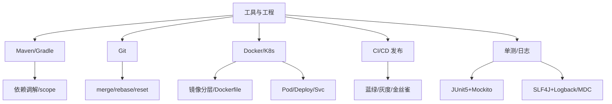

# 19 工具与工程 · 速记知识图谱（P0-P3）

> 模块定位：考"工程素养"——日常 trade-off、问题排查、协作规范。重点 **Maven / Git / Docker/K8s / 单测 / 日志**。
> 题量：21 题。



### P0 必背核心

#### Maven 依赖管理
- **依赖调解两原则**：① **最短路径优先**；② **路径相同时声明优先**（pom 先写的赢）。
- **冲突排查**：`mvn dependency:tree -Dverbose` + IDEA Maven Helper；**解决**：`<exclusions>` 排除、`<dependencyManagement>` 锁版本、显式覆盖。
- **scope 五种**：`compile`（默认，全程参与+传递）、`provided`（编译/测试，运行不参与，如 Servlet API、Lombok）、`runtime`（运行参与不编译，如 JDBC 驱动）、`test`（仅测试不传递）、`system`（本地 jar，不推荐）。
- **optional**：`<optional>true</optional>` 让依赖**不传递**——"我用，但用我的人不用"。
- 关联题：#0605、#0619

#### Maven 生命周期与插件
- **三生命周期**：`clean`、`default`（核心：validate→compile→test→package→verify→install→deploy）、`site`。**install** 装本地 `~/.m2`，**deploy** 推远程私服。
- **常用插件**：`maven-compiler-plugin`、`maven-surefire-plugin`（单测）、`maven-failsafe-plugin`（集成测试）、`spring-boot-maven-plugin`（`repackage` 打 fat jar）、`maven-shade-plugin`（uber jar + 重定位）。
- **profile**：`mvn -P prod package` 切换环境配置。
- 关联题：#0574、#0575

#### Git：merge vs rebase
- **merge**：保留分支拓扑，产生合并 commit（多父节点）；**rebase**：把当前 commits 重放到目标分支顶端，历史**线性**但**改写 commit hash**。
- **黄金法则**：rebase 只对本地未推送的 commit 用；已 push 的共享分支用 merge。
- 实战：feature 本地 rebase 整理，合主干用 merge 或 squash merge 压成一个 commit。
- 冲突：merge 一次性解决；rebase 逐 commit 重放，可能解决多次。
- 关联题：#0563

```
merge (保留分支拓扑):                  rebase (线性历史):

  main:  A───B───C─────────M           main:  A───B───C
              \           /                            \
  feat:        D───E───F                feat:           D'──E'──F'
              
  产生 M 合并 commit                    feat 的 commit 被重放到 C 之后
  保留并行开发的真实历史                历史变成线性, 但 hash 变了
  
  适用: 主干合并、保留上下文             适用: 本地清理、保持历史线性
```

#### Git：reset / revert / cherry-pick / stash
- **reset --hard**：HEAD 移 + 工作区/暂存区全清，**未提交修改丢失**。
- **reset --mixed**（默认）：HEAD 移 + 暂存区清空，工作区保留。
- **reset --soft**：只移 HEAD，暂存和工作区都留——重新调整 commit 粒度用。
- **revert**：**生成反向 commit**，不改历史，**已 push 远端唯一安全的回滚**。
- **cherry-pick**：摘指定 commit 到当前分支——hotfix 同时合 master 和 release 的标配。
- **stash**：临时保存修改 `push` / `pop` / `list`，切分支不想 commit 半成品时用。
- 关联题：#0592、#0593

#### Docker：镜像分层 + Dockerfile 优化
- **分层**：每条指令一层只读层，UnionFS 叠加；运行时多一层**可写层**（CoW）。
- **缓存**：构建按层缓存，**变化少的放前面**——Java 项目套路：先 COPY pom.xml 跑依赖下载，再 COPY src，避免改一行触发全量重下。
- **优化**：① **multi-stage build**（builder 编译，runtime 只拷 jar，瘦身）；② alpine / distroless 基础镜像；③ 合并 RUN 减层数；④ `.dockerignore` 排除无关；⑤ 删除包管理器缓存。
- **ENTRYPOINT vs CMD**：ENTRYPOINT 是主命令，CMD 是默认参数。`docker run image arg` 时 arg 替换 CMD 不替换 ENTRYPOINT。最佳实践：`ENTRYPOINT ["java","-jar"]` + `CMD ["app.jar"]`。
- **VOLUME**：数据卷挂载点，不进镜像层，容器删除不丢数据。
- **网络模式**：bridge（默认 NAT）、host（共享宿主机网络）、none、container（共享另一容器网络）、自定义网络（容器名互访，生产推荐）。
- 关联题：#0859、#0821

```
Docker 镜像分层 (UnionFS)：

┌────────────────────────────────┐  ← 容器可写层 (CoW)
│ Writable Layer  容器运行时数据   │
├────────────────────────────────┤  ← 镜像层 (只读)
│ COPY app.jar /  (Layer 4)      │
├────────────────────────────────┤
│ RUN pip install ... (Layer 3)  │
├────────────────────────────────┤
│ COPY requirements.txt (Layer 2)│
├────────────────────────────────┤
│ FROM python:3.9 (Layer 1 基础)  │
└────────────────────────────────┘

Dockerfile 优化 (Java multi-stage)：

  # Stage 1: builder
  FROM maven:3.8 AS builder
  COPY pom.xml /                   ← 变化少, 缓存命中率高
  RUN mvn dependency:go-offline    ← 下载依赖, 单独成层
  COPY src/ /src                   ← 变化多, 放后面
  RUN mvn package

  # Stage 2: runtime
  FROM eclipse-temurin:17-jre      ← 精简的运行时镜像
  COPY --from=builder /app/target/app.jar .
  ENTRYPOINT ["java","-jar"]
  CMD ["app.jar"]

  → 最终镜像不含 Maven / 源码, 体积减小 80%
```

#### K8s 核心对象
- **为什么需要 K8s**：Docker 单机解决打包问题，K8s 解决**集群调度 + 自动扩缩 + 滚动更新 + 故障自愈 + 服务发现 + 负载均衡**。
- **Pod**：最小调度单位，可含多个共享网络/存储的容器（sidecar）。
- **Deployment**：声明式管理 Pod 副本，滚动更新/回滚，`RollingUpdate` + `maxSurge` / `maxUnavailable`。
- **Service**：稳定虚拟 IP + 负载均衡，类型 ClusterIP / NodePort / LoadBalancer。**Ingress**：七层入口路由，类似 Nginx。
- **ConfigMap / Secret**：明文 / 敏感配置（base64）。**HPA**：根据 CPU / 内存 / 自定义指标自动扩缩容。
- 关联题：#0845

#### 蓝绿 / 灰度 / 金丝雀
- **蓝绿**：维护两套相同环境（蓝当前生产 + 绿新版本），验证 OK 一次性切流量；回滚秒级；**资源翻倍**。
- **金丝雀**：先部署 1-2 节点引 1% 流量验证，逐步放量到 100%；**问题影响面小**。
- **灰度**：广义概念，按用户/地域/版本维度逐步放量，金丝雀是它的一种实现。
- K8s 实现：多 Deployment + Service selector 切 label；复杂场景用 Istio 按权重切流。
- 关联题：#0942

### P1 加分高频

#### Lombok 原理与争议
- **原理**：JSR 269 **编译期注解处理器**，在 javac 阶段修改 **AST**（抽象语法树）生成 getter/setter 等，字节码和手写一致，**不是反射，无性能损失**。IDEA 需装插件才能在编辑器识别。
- **常用**：`@Data`（= `@Getter` + `@Setter` + `@ToString` + `@EqualsAndHashCode` + `@RequiredArgsConstructor`）、`@Builder`、`@Slf4j`、`@SneakyThrows`（吃 checked exception，慎用）。
- **不建议**：① 强绑 IDE 插件；② `@Data` 全字段 `equals/hashCode`，**JPA 双向关联会 StackOverflow**；③ 升级 JDK 偶尔有兼容问题。
- 关联题：#0466

#### 单元测试与集成测试
- **单测**：测单一方法/类，依赖全部 mock，快、可重复。**集成测试**：测多组件协作，可能起 SpringContext、连嵌入式 DB（H2/Testcontainers），更真实。
- **JUnit 5**：`@Test` / `@BeforeEach` / `@ParameterizedTest` / `@Nested` / `assertThrows()`，模块化 `jupiter-api` + `jupiter-engine`。
- **Mockito**：`@Mock` / `@InjectMocks` / `when().thenReturn()` / `verify()`。**默认不能 mock static/private**；Mockito 3.4+ 用 `mockito-inline` 支持 static mock。
- **PowerMock**：可 mock static / private / final / 构造器，但**侵入性强、版本冲突频繁、运行慢**——现代项目尽量避开，宁可重构成可注入设计。
- **JDBC 单测**：① H2 内存库 + `@DataJpaTest`；② **Testcontainers** 拉真实 MySQL 容器（慢但真实）；③ mock JdbcTemplate（快但漏 SQL 错）。
- 关联题：#0547、#0573、#0591

#### 日志体系
- **SLF4J 门面 + 实现分离**：业务依赖 SLF4J，实现可换 Logback（SpringBoot 默认）/ Log4j2。
- **Log4j2 高性能**：**异步 Logger 用 LMAX Disruptor 无锁队列**，吞吐量碾压 Logback 异步 AsyncAppender，高吞吐场景常选。
- **桥接器**：`jcl-over-slf4j`、`log4j-over-slf4j`、`jul-to-slf4j`，避免多种实现冲突。
- **MDC**（Mapped Diagnostic Context）：基于 ThreadLocal，存当前线程 traceId/requestId，pattern 中 `%X{traceId}` 输出，一次请求贯穿。
- **MDC 异步坑**：ThreadLocal 不跨线程，需 `MDC.getCopyOfContextMap()` 在子线程 `setContextMap()`。SpringCloud Sleuth / Micrometer Tracing 自动处理。
- 关联题：#0491

#### CI/CD 与项目规范
- **CI**：每次提交触发构建 + 单测 + 静态扫描，保证主干可发布。**CD**：自动部署测试→预生产→生产。
- **工具**：Jenkins（Groovy Pipeline / `Jenkinsfile`）、GitLab CI（`.gitlab-ci.yml`）、GitHub Actions。
- **DevOps**：开发 + 运维一体化的**文化和方法论**，CI/CD 是落地手段。
- **静态扫描**：**SonarQube**（综合 + 质量门禁）、**Checkstyle**（风格）、**PMD**（缺陷）、**SpotBugs**（字节码 bug）。
- **commit 规范**：Conventional Commits（`feat:` / `fix:` / `refactor:`），便于自动生成 CHANGELOG。
- 关联题：#0113、#0965

### P2 深度延伸

#### IDEA 高频技巧
- **快捷键**：`Ctrl+Shift+F` 全局搜文本、`Ctrl+Shift+N` 搜文件、`Ctrl+Alt+B` 看实现、`Ctrl+Alt+H` 调用链、`Alt+Enter` 万能修复。
- **远程 Debug**：JVM 加 `-agentlib:jdwp=transport=dt_socket,server=y,suspend=n,address=*:5005`，IDEA 配 Remote JVM Debug。**suspend=y** 让 JVM 等 Debug 连上才执行 main，排查启动期问题用。
- **插件**：Lombok、Maven Helper、GitToolBox、SonarLint、Alibaba Java Coding Guidelines、Key Promoter X、Translation。
- 关联题：#0533、#0548

#### jar / war / fat jar
- **jar** 普通 Java 包；**war** 传统部署 Servlet 容器。
- **fat jar / uber jar**：把依赖和**嵌入式 Tomcat** 打进一个可执行 jar，`java -jar app.jar` 直接跑，SpringBoot 默认。本质 `spring-boot-maven-plugin` 重打包成嵌套 jar（BOOT-INF/lib 里的 jar 不解压）。
- 关联题：#0574、#0575

### P3 冷门刁钻

#### Gradle vs Maven
- Gradle 用 Groovy/Kotlin DSL，灵活可编程；Maven 用 XML，约束强、规范统一。
- Gradle 增量构建 + 缓存 + 守护进程，**大型项目快 2-10 倍**；Maven 生态更成熟。Android 默认 Gradle，Java 服务端多数 Maven。

#### Linux 排查命令
- 进程 `ps -ef | grep` / `top -H -p <pid>`（线程级 CPU）；网络 `ss -tnlp` / `lsof -i:8080`；文件 `tail -f` / `grep -A 5 -B 5` / `du -sh *`；资源 `free -h` / `vmstat 1` / `iostat` / `sar`；性能 `pidstat` / `strace -p <pid>` / `perf top`。
- 关联题：#0492

### 跨模块联想

- Maven 依赖冲突 ↔ **02 JVM 类加载**：同名类不同版本被加载到不同 ClassLoader 引发 `NoSuchMethodError`，本质就是依赖冲突的运行时表现。
- Docker 镜像层 ↔ **18 Linux**：UnionFS、namespace、cgroup 是 Docker 底层支撑。
- 灰度 / 蓝绿 ↔ **17 微服务 / 高可用**：发布策略 + 注册中心权重 / Service Mesh 切流。
- 单测 Mock ↔ **04 Spring**：`@MockBean` / `@SpyBean` 替换容器 Bean。
- Lombok APT ↔ **04 Spring**：SpringBoot 3 的 `.imports` 也走 APT，技术同源。
- MDC ↔ **03 并发**：ThreadLocal 跨线程传递，InheritableThreadLocal / TransmittableThreadLocal。
- 日志异步 ↔ **03 并发**：Log4j2 Disruptor 无锁环形队列，与 Netty / Kafka 内部同源。
- 优雅停机 + K8s 滚动更新 ↔ **04 Spring** `server.shutdown=graceful`：K8s 发 SIGTERM，Pod 在 `terminationGracePeriodSeconds`（默认 30s）内退出，才能不丢请求。

---
