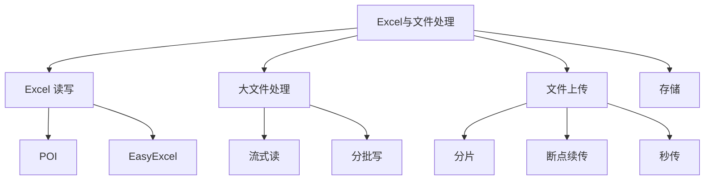
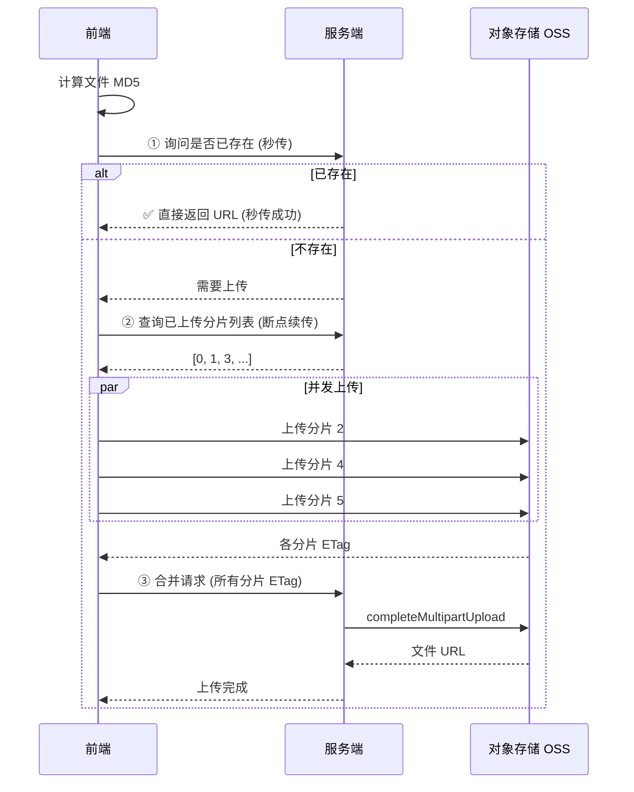

# 21 Excel与文件处理 · 速记知识图谱（P0-P3）

> 模块定位：业务系统常见的"非功能性需求"。重点是 **EasyExcel 用法 + 大文件处理思路**。6 题。
> 题量：6 题。



### P0 必背核心

#### POI vs EasyExcel 对比
- **Apache POI**：老牌 Excel 操作库；XSSF（DOM 全内存）/ HSSF（老 .xls）/ SXSSF（滑动窗口，仅写）。
- **XSSFWorkbook**：把整个工作簿加载到内存，10 万行数据可能 OOM；功能最全（公式、样式、图片）。
- **SXSSFWorkbook**：滑动窗口（默认 100 行），超过窗口的行落到临时文件；**仅支持写**不支持读；大文件导出推荐。
- **EasyExcel（阿里）**：基于 POI 二次封装，**SAX 模式流式读写**，几乎不占内存（一行一行处理）；API 简洁（注解 + 监听器）；**推荐**。
- 关联题：#0249

#### EasyExcel 写入
- **基本写法**：`EasyExcel.write(file, DataModel.class).sheet("Sheet1").doWrite(dataList)`。
- **字段映射**：实体类用 `@ExcelProperty(value="姓名", index=0)` 标注列。
- **大数据写入**：用 `excelWriter.write(part, writeSheet)` 分批写多个 list，避免一次性加载所有数据到内存。
- **多 Sheet / 复杂表头**：`@ExcelProperty(value={"基本信息", "姓名"})` 二级表头；多个 sheet 用 writeSheet 切换。
- **样式**：自定义 CellStyleStrategy（背景色、字体、宽高）。
- 关联题：#0249

#### EasyExcel 读取
- **核心思想**：SAX 流式解析，配合 **ReadListener 监听器**——每读一行回调一次，监听器收集到一定数量批量入库后清空。
- **写法**：`EasyExcel.read(file, DataModel.class, new MyListener()).sheet().doRead()`。
- **监听器**：实现 `AnalysisEventListener<T>`，重写 `invoke(T data, AnalysisContext ctx)` 处理每行 + `doAfterAllAnalysed` 收尾。
- **典型坑**：监听器**不能是 Spring Bean**（每次 new 一个新 Listener），要靠构造器把依赖（如 Service）传进去。
- **大文件**：100 万行也只占几百 KB 内存（按行处理）。

#### 大文件读写策略
- **大文件读**：① **流式 / SAX**（EasyExcel、StAX）；② 分块映射 mmap（MappedByteBuffer 大文件随机读）；③ 逐行 BufferedReader（普通文本）。
- **大文件写**：① 流式追加（FileOutputStream + flush）；② 分批 SXSSF；③ 异步导出（生成完发邮件 / 站内信通知下载）。
- **避免**：把整个文件加载到内存（`Files.readAllBytes` 大文件直接 OOM）。

#### 文件上传（断点续传 / 秒传 / 分片）
- **分片上传**：前端切片（如 5MB / 块）并发上传；服务端按编号合并。
- **断点续传**：前端先调"查询已上传分片"接口，跳过已上传的；网络断开重连后继续。
- **秒传**：上传前算文件 MD5 / SHA1，询问服务端是否已存在该 hash → 存在直接返回（不用真上传）。
- **存储**：OSS / COS 都原生支持分片上传 SDK（initiateMultipartUpload → uploadPart → completeMultipartUpload）。



```
分片设计:

  原文件 100MB
  └─ Chunk 0  (0     ~ 5MB)
  └─ Chunk 1  (5MB   ~ 10MB)
  └─ Chunk 2  (10MB  ~ 15MB)
  └─ ...
  └─ Chunk 19 (95MB  ~ 100MB)

  并发数: 3-5 (太多占带宽, 太少慢)
  分片大小: 5-10MB (太小请求多, 太大重传贵)
  合并校验: 整体 MD5 == 上传前 MD5
```

### P1 加分高频

#### 导出大量数据 Excel 实战
- **场景**：导出 100 万行订单数据。
- **方案 A：异步导出**：① 用户点击导出 → 立即返回任务 ID；② 后台异步生成 Excel 文件到 OSS；③ 完成后站内信 / 邮件通知下载链接。
- **方案 B：分页 + EasyExcel 多 sheet**：单 sheet 最多 104 万行（Excel 2007+ 限制），超过分多 sheet。
- **关键参数**：① DB 分页查（每页 1 万）+ EasyExcel 流式写；② 内存控制（每批写完释放）；③ 进度反馈。

#### 文件格式校验与防护
- **MIME / 扩展名校验**：双重校验，防止改后缀绕过。
- **大小限制**：网关 / 应用层都要限（Spring Boot `spring.servlet.multipart.max-file-size`）。
- **病毒扫描**：上传后扫毒（ClamAV）再入库。
- **图片防护**：限制类型 / 大小 / 维度；去 EXIF（含 GPS 信息泄露）；解析时防 ImageBomb（小文件解压成几 GB）。
- **文件名安全**：路径穿越攻击（`../../`），用 UUID 重命名；防中文 / 特殊字符。

#### 文件存储选型
- **本地磁盘**：简单但不易扩展、不易高可用、跨机器不共享；仅个人项目 / 测试。
- **NFS / 共享存储**：多机共享，但性能瓶颈。
- **对象存储（OSS / COS / S3）**：大规模通用方案，分布式、高可用、便宜、CDN 加速。
- **数据库 BLOB**：小文件偶尔可用，大量大文件不推荐。
- **CDN**：放静态资源 / 大文件下载加速。

### P2 深度延伸

#### POI / EasyExcel 性能对比数据
- 10 万行：POI XSSF 6s 1.5GB 内存、EasyExcel 4s 100MB；
- 100 万行：POI XSSF OOM、SXSSF 100s 200MB、EasyExcel 30s 100MB。

#### Excel 公式 / 图表 / 样式
- EasyExcel 简单功能足够；复杂公式 / 图表 / 透视表需要 POI XSSF 直接操作（牺牲内存）。
- 替代方案：阿里 LarkExcel / 业内开源 fastexcel（EasyExcel 社区分支）。

#### 文件 hash 选择
- **MD5**：128 bit，速度快但理论碰撞；秒传场景够用（业务无安全敏感）。
- **SHA-256**：256 bit，速度慢但安全；防篡改场景。
- **CRC32**：32 bit，弱校验，仅做完整性校验。
- 大文件算 hash 要流式 read + update，避免 OOM。

#### 分片上传的最佳实践
- 分片大小：5 MB - 10 MB 经验值（太小请求多，太大单片重传代价高）。
- 并发数：3-5 并发（太高占带宽 / 服务端连接）。
- 合并校验：合并后再校验整体 hash 与上传前一致。
- 清理：未完成的分片定时清理（OSS 自动支持 lifecycle 规则）。

### P3 冷门刁钻

#### Excel 文件结构
- .xlsx 实际是 zip 压缩包：解压后是一堆 XML（sheet1.xml、sharedStrings.xml、styles.xml 等）。
- SAX 解析就是按 XML 流式读这些文件，避免 DOM 全量加载。

#### CSV vs Excel
- CSV：纯文本，开放性强，无格式 / 公式 / 多 sheet；超大量数据用 CSV 更高效。
- Excel：可视化好，但格式复杂、解析慢、最大行数限制。
- 工业级数据导出，CSV 优先考虑。

#### TUS 协议（断点续传标准）
- HTTP 协议扩展，标准化分片上传 / 断点续传；OSS / 知名云厂商支持。
- 客户端库：tus-js-client、tus-android-client 等。

### 跨模块联想

- 大文件读 ↔ **01 Java 基础**：BufferedReader、NIO、mmap、零拷贝。
- 流式处理 ↔ **17 算法**：SAX 思想类似流式算法、外部排序。
- 异步导出 ↔ **07 消息队列**：任务投 MQ 异步处理 + 完成通知。
- 文件存储 ↔ **15 业务场景**：图片 / 视频 / 文档上传业务的基石。
- 分片上传 ↔ **13 网络**：HTTP 协议层；TUS 标准。
- 秒传 ↔ **17 算法**：MD5 / SHA hash 算法。
- 防病毒 / 防穿越 ↔ **23 软技能**：安全意识在面试中体现严谨。

---
