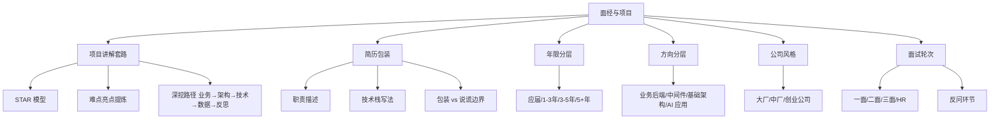
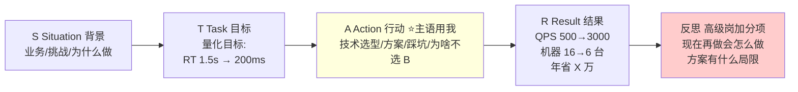

# 22 面经与项目分享 · 速记知识图谱（P0-P3）

> 模块定位：61 场真实面经的"提炼层"，不是题库，是**模式识别**。同样的 Java 八股谁都会背，**项目讲不清楚就是死局**。重点是：项目讲解套路、简历包装边界、不同年限/方向/公司的考察侧重、反问与谈薪节奏。
> 题量：61 题（覆盖应届到 9 年、大厂中厂创业、业务后端到 AI 应用、HR 面到三面追问）。

### 核心套路（必掌握）

#### 项目讲解 STAR 模型
- 这是开门题的标准答法。**S**ituation 背景 → **T**ask 目标 → **A**ction 行动 → **R**esult 结果。
- **S（背景）**：业务是什么、当时遇到什么问题、为什么需要做这个项目。**一句话讲清楚**——不要堆 PPT 上的 BU 名词，面试官不关心。
- **T（任务）**：你被分配的具体目标，最好量化。例如"把订单创建接口从 1.5s 降到 200ms"，而不是"做了性能优化"。
- **A（行动）**：你做了什么，**主语必须是"我"**，不是"我们组"。讲技术选型、关键设计、踩过什么坑、为什么选 A 不选 B。这一段是面试官重点听的，深度全在这里。
- **R（结果）**：量化数据 + 业务价值。"QPS 从 500 提到 3000、P99 从 800ms 降到 80ms、机器从 16 台减到 6 台、年省成本 X 万"。即使没有数据也要给个**对比**，"接口稳定性显著改善、上线后 3 个月零故障"。
- 高级岗特别看重 **R 之后还有"反思"**：现在再做一次你会怎么做、这个方案有什么局限。这一步把你和同年限的人拉开。
- 关联题：#0327、#0485、#0972、#0473

| 时间分配 | 部分 | 内容比例 |
|---|---|---|
| S | 背景 | 10% (一句话) |
| T | 目标 | 10% (量化) |
| **A** | 行动 | **60% ⭐ 最重要** |
| R | 结果 | 15% (量化数据) |
| 反思 | 高级岗 | 5% (拉开差距) |

#### 简历项目怎么写（4 段式）
- **业务背景**：一句话讲清"什么业务、什么规模、解决什么问题"。例："服务于 XX 业务的订单中心，日订单 50W+，支持下单/支付/退款全链路"。
- **你的角色**：核心开发 / 模块 Owner / 技术负责人 / 架构师。**title 可以适度拔高，但要能 hold 住对应深度**。7 年还写"Java 工程师"是减分项，title 要随时间靠后越来越重。
- **技术栈**：列得清楚但不堆砌。Java 8、Spring Boot、MyBatis、Redis、RocketMQ、ShardingSphere、Nacos——**不要写 Maven/Git/IDEA 这种基本功**，工作 5 年还写这个相当于自爆。
- **量化成果**：每条职责描述都要有"问题 + 方案 + 数据"三件套。反例："负责 Java 部分编码"——废话；正例："通过热点数据预热 + 多级缓存解决大促接口耗时长的问题，整体性能提升 30%"。
- 注意：**学历/工作经历/离职原因是背调三件套，不能编**。学历做假到背调环节直接挂；工作经历时间段、公司名要对齐社保和流水。
- 关联题：#0459、#0473

#### 高级岗项目深挖路径
- 大厂三面以上、5+ 年候选人，面试官一定会把项目往**架构层面**挖。标准路径：
- ① **业务理解**：你这个业务的核心痛点是什么、用户是谁、上下游是谁、SLA 要求多高。答不上来等于自爆"只会写代码不懂业务"。
- ② **架构设计**：整体架构图、微服务拆分、为什么这么拆、上下游交互方式（RPC/MQ/HTTP）、数据流向。
- ③ **关键技术**：分库分表怎么分的（分表键、表数量、为什么是 2 的幂、迁移方案）、缓存怎么用的（穿透/击穿/雪崩、一致性、热 key）、分布式事务（TCC/事务消息/Seata、空回滚/悬挂）、限流降级熔断。
- ④ **性能数据**：QPS、RT、TP99/TP999、容量、机器配置、压测结论。**没数据等于没做过**。
- ⑤ **踩坑反思**：上线后出过什么故障、怎么排查的、最终怎么解决的、复盘后做了什么改进。
- 这五步顺下来，基本就是阿里 P6/P7 面试官的标准追问路径。可参考 #0371（7 年导购优化）、#0540（7 年技术专家）、#0516（架构师）的完整对话。
- 关联题：#0371、#0540、#0516、#0438、#0500

#### 不同年限的面试侧重
- **应届/1 年（如 #0378、#0539、#0361）**：八股 + 算法 + 项目浅问。重点是基础扎实——JVM/集合/并发/MySQL/网络。项目能讲清楚结构、用了什么技术、解决什么问题就够了，不会深挖架构。算法题占比大（剑指 Offer 难度起步）。
- **1-3 年（如 #0024、#0341、#0357、#0436）**：八股 + 项目 + 简单架构题。开始问"你这块为什么这么设计"、"分库分表怎么做的"、"分布式锁/事务"。算法仍要刷，但项目占比上升到 50%+。
- **3-5 年（如 #0193、#0310、#0400、#0435）**：项目深挖 + 中间件原理 + 线上问题。八股占比下降但仍要会，要能讲**完整的链路**——一次请求从网关到 DB 经过哪些组件。开始问"线上排查过什么问题"、"压测怎么做"、"全链路梳理"。
- **5+ 年（如 #0371、#0410、#0500、#0515、#0540）**：架构设计 + 业务理解 + 技术广度。算法基本不问或问个简单的。重点是**你能不能独立 Owner 一个系统**——架构原则、技术选型、降本、稳定性建设、团队协作、跨部门推动。HR 还会重点考察你的"软技能"（影响力、目标导向）。
- **7+ 年技术专家/架构师**：项目讲 1 小时不停。考察"在没有现成方案时你怎么决策"——例如 #0540 的资损防控平台、#0515 的自研流程引擎，面试官会反问"为什么不用开源"、"边界在哪里"。
- 关联题：#0367、#0190、#0539、#0540

#### 不同方向的项目侧重
- **业务后端（电商/订单/支付/财务）**：必问分库分表、分布式事务、库存、幂等、对账。例如 #0024、#0098 数藏秒杀、#0193 银企直联、#0500 计费、#0540 清结算。重点是**业务建模 + 一致性 + 资损防控**。
- **中间件/基础架构（流程引擎/配置中心/RPC/网关）**：必问"为什么自研不用开源"、"和开源的区别"、"通用性怎么做的"。例如 #0360 流计算引擎、#0515 流程引擎、#0463 RPC 框架。重点是**抽象能力 + 性能 + 可扩展性**。
- **大数据/实时计算**：Flink/Kafka/Spark 必考、数据倾斜、Exactly Once。例如 #0357 IoT 实时分析、#0340 大数据开发平台。重点是**数据流动 + 吞吐 + 准确性**。
- **AI 应用/大模型（24 届以后新热门）**：RAG 流程、向量检索、prompt 工程、function call、Agent 编排、模型选型与切换。例如 #0020 AI 网关、#0085 RAG 客服。**这个方向八股弱化、应用层和工程化更重**。
- **游戏/直播/实时业务**：必问 Redis 各种用法、性能压测、协议设计、热更新。例如 #0410 游戏中厂、#0341 直播。
- 关联题：#0020、#0085、#0360、#0515

### 加分技巧（拉开档次）

#### 项目难点亮点怎么挖
- 大部分人卡在"我的项目就是 CRUD 没什么难点"。问题不是项目没难点，是**你不会提炼**。从这几个方向挖：
- **性能优化**：缓存策略、SQL 优化、异步化、并行化、批处理→流处理。例 #0357 把 10W 数据批处理改流处理。
- **数据一致性**：分布式事务（TCC/事务消息/Seata）、本地消息表、对账机制。例 #0540 事前事中事后三层防控。
- **高并发**：秒杀、热 key、热点商户、削峰填谷。例 #0098 数藏秒杀、#0410 热 key 拆分。
- **稳定性**：限流降级熔断、压测、降级预案、SLA、异地多活。例 #0371 全链路压测 + 大促预案。
- **资源/成本**：JVM 调优、机器减半、ES 替代 MySQL 扫表、归档冷热分离。
- **复杂业务建模**：状态机、流程编排、规则引擎、插件化。例 #0438 SaaS 流程编排、#0515 自研流程引擎。
- **技术选型挑战**：为什么用 RocketMQ 不用 Kafka、为什么自研不用开源——这一类问题答好就是亮点。
- 关联题：#0327

#### 用数据让项目"有重量"
- **每个关键动作都配数据**。没数据的项目描述等于没说。
- 性能类："接口 RT 从 1500ms → 70ms"、"QPS 从 500 → 3000"、"内存占用从 8G → 2G"。
- 业务类："日订单 50W"、"DAU 100W"、"GMV 月 5000W"、"用户转化率提升 15%"。
- 规模类："表 70 亿数据分 128 表 16 库"、"7×24 在线"、"99.99% 可用性"、"7 个微服务、20 人团队"。
- **数据不要瞎编，要能自圆其说**。"日订单 50W 但只用 1 台 4C8G"——会被反问"那 QPS 多少 P99 多少"，编不下去就翻车。
- 关联题：#0339、#0310、#0438

#### 反问环节是隐形评分项
- 90% 候选人这里走过场。其实反问质量是面试官给"加分还是减分"的重要参考。
- **该问什么**：① 团队负责的业务和我可能负责的模块；② 团队的技术栈、技术深度、有没有自研中间件；③ 团队规模、汇报关系、新人导师机制；④ 业务现状和未来规划；⑤ 面试官个人在这里的工作体验（高级岗专属，能拉近距离）。
- **不要问什么**：① 上来就问待遇福利加班（留到 HR 面再问）；② 问"我表现怎么样"（强迫面试官点评，尴尬）；③ "贵公司福利怎么样"（HR 题）；④ 问百度能查到的（公司业务、年报）。
- 一个高级感的反问例子："咱们这块业务目前最大的技术挑战是什么、过去半年最难解决的一个线上问题大概是什么样的场景"——既了解了真实情况，又显得你在意工程实践。
- 关联题：#1000

#### 一面 / 二面 / 三面 / HR 面侧重
- **一面（技术面，往往是潜在直属上级或同级）**：八股 + 项目浅问 + 算法。基础筛子，刷掉八股不扎实的。时长 60 分钟。
- **二面（技术面，往往是 leader 或资深）**：项目深挖 + 系统设计 + 难度更高的场景题。重点是**你能不能 Hold 住你简历上写的项目**。时长 60-90 分钟。
- **三面（交叉面或部门 leader）**：项目纵深 + 软素质 + 文化匹配。问"你过去最大的挑战"、"为什么离职"、"职业规划"、"管理过几个人"。技术问题相对少但更宽。
- **HR 面**：薪资 + 入职意愿 + 团队适配。看 #0489 字节的 HR 面问题列表，基本就是为什么离职、期望薪资、你最强/最弱的地方、能不能加班、有没有其他 offer。
- 不同公司流程：阿里 1 笔试 + 3 技术 + 1 HR（#1004），字节 1 笔试 + 3 技术 + 1 HR（#1005），腾讯类似（#0989）；中厂常常 2 技术 + 1 HR；创业公司可能 1 面 + 老板面就发 offer。
- 关联题：#0989、#1004、#1005、#0489、#0464

### 大厂中厂创业公司风格区分

#### 大厂（阿里/字节/腾讯/百度/美团/拼多多）
- 八股扎实是底线，**项目深度是分水岭**。每轮 60-90 分钟，面试官有耐心问到底。
- 阿里：业务 + 架构 + 算法。喜欢问"你怎么 Hold 住这个域"。
- 字节：算法 + 项目 + 系统设计。算法占比明显高，但难度可控（剑指 Offer 难度）。
- 拼多多：场景题 + 算法 + 应变。问题往往很发散，看你怎么拆问题。#0388、#0387、#0436、#0448 都体现了这种风格。
- 百度：基础 + 项目 + 工程素养。比较看重计算机基础。
- 美团：项目深挖 + 业务理解。一面到三面层层加压。
- 关联题：#0146、#0189、#0366、#0387、#0388、#0425、#0436、#0448

#### 中厂（顺丰/平安/猿辅导/滴滴/菜鸟/SaaS 公司）
- 八股要求略低于大厂，但**项目要能落地**。喜欢问"线上遇到过什么问题"、"如果你来负责会怎么做"。
- 算法题相对少或难度低（#0449 顺丰、#0450 平安、#0488 猿辅导）。
- 给薪上 80%-90% 大厂水准、加班更轻，是不少高级开发的"性价比选择"。

#### 创业公司 / 小厂
- 流程短、面试官个人风格强、可能 1-2 面直接发 offer。
- 重点考察"能不能马上上手干活"。技术栈比较窄，但要 hold 全栈。
- 风险点：title 通胀（"架构师"实际是单兵开发）、薪资结构（base 低期权占比大）、稳定性差。

### 避坑要点（少走弯路）

#### 简历包装的边界
- **可以美化**：title（开发→高级开发→技术专家有合理性）、职责描述（用 STAR 提炼）、技术亮点（强调你做的部分）、数据（在合理范围内取整数）、项目时长（合并同公司同类项目）。
- **绝对不能编**：学历、工作经历的公司和时间段、离职原因、是否担任过 leader、项目是否真的上线了、量级（10W 别写 100W，背调一问就穿）、专利和论文（背调会查）。
- 一个判断标准：**面试官追问到底你能不能自圆其说**。能自圆其说就是合理包装，圆不下去就是说谎。
- 关联题：#0459、#0473

#### 项目时间太短、太多、太碎
- 简历上 3-4 个月的小项目是减分项。**同公司类似项目要合并**，比如 #0459 提到的"8 年 4 家公司全是 Java 工程师"是大忌。
- 简历建议控制在 **2-3 页**，6 页以上的简历 HR 根本看不完，面试官也只看前两页。
- 当前正在做的项目不到 1 个月就**不要写**，写了反而是减分项（面试官会问，但你讲不出深度）。
- 关联题：#0459

#### 不要踩这些坑
- **写"精通"**：除非你写过这个组件源码并提过 PR，否则别写。会被针对性深挖到死。
- **写不熟的技术**：比如 #0459 提到的 "Paxos 算法"、"DDD"。简历上的每一个词都可能被深挖。**写在简历上的就是面试合同**。
- **答不上来硬编**：高级岗最忌讳。坦诚说"这块没深入研究、不过我理解是 XX 方向、可以从 XX 角度切入"——比硬编要好得多。面试官一眼能看出你在编。
- **贬低前公司或前同事**：HR 面问"为什么离职"时如果开喷，基本就挂了。
- **过度自夸但拿不出案例**：所有"擅长"都要有具体例子，没例子就别写。
- 关联题：#0459、#0473

### 临场应对（话术与节奏）

#### 项目讲解的节奏感
- 项目自我介绍 **3-5 分钟为佳**。太短显得没东西，太长面试官会打断。
- 讲项目要有"**埋点**"：故意提到一些可以被追问的关键词（分库分表、TCC、压测、热 key），引导面试官往你准备好的方向问。**好的项目讲解是把面试官的提问路径设计好的**。
- 不熟的地方不要主动展开。不要给自己挖坑。
- 关联题：#0485

#### 答不上来时的应对
- **三段式**：① 坦诚承认"这块我没深入研究过"；② 给出你能想到的思考方向"不过我理解大概是从 XX 角度"；③ 反问"是用在 XX 场景吗"，把球踢回去。
- 千万**不要硬编**。高级岗面试官一眼能看出。承认不会反而比硬编诚信。
- 算法卡住就**讲思路**：先暴力解、再说优化方向、再讲复杂度。**说出你的思考过程比写出代码更重要**。

#### 跳槽节奏与时机
- **节奏**：应届到 3 年是技术快速积累期，跳槽频次不超过 1 次/2 年。3-5 年要思考"技术 + 业务"双线，跳槽节奏可以适度加快但要避免"1 年跳一次"。5+ 年要稳，跳槽以"涨幅 + 平台升级"为目标，不要为了 20% 涨幅频繁动。
- **涨幅参考**：3 年以内 30%-50%、3-5 年 20%-30%、5+ 年 15%-25% 比较合理。低于 15% 不太值得动，超过 50% 警惕是不是有坑（创业公司、新业务、过桥岗位）。
- **行业周期**：现在（2024-2025）大厂普遍卡人头，国央企/SaaS/AI 应用是相对增长方向，传统电商和金融科技偏卷。
- **空窗期**：超过 3 个月就要准备好理由，6 个月以上会被反复追问。最稳妥是"在职找工作"。
- 关联题：#0489

### 跨模块联想

- 项目讲解 ↔ **23 软技能**：项目讲解话术、自我介绍模板的细化在 23 模块。
- 技术深挖 ↔ **02-21 各技术模块**：面经里追问到底的所有技术点（JVM/并发/Redis/MQ/分布式事务）都对应前面 20 个技术模块。面经看的是"问什么"，技术模块准备的是"怎么答"。
- 简历项目 ↔ **15 业务场景**：分库分表、TCC、秒杀、对账、限流降级这些"项目亮点"的具体实现在 15 模块。
- 高级岗架构题 ↔ **16 性能调优 / 17 架构设计**：5+ 年面试的系统设计题，依赖架构和调优模块。
- 反问环节 ↔ **23 软技能**：反问的具体话术在 23 模块。
- 大厂能力模型（#0367）↔ **整个体系**：软件开发、架构设计、项目管理、线上运维、业务理解、学习能力、影响力、目标导向——这八项是所有模块的底层评分维度。

---
