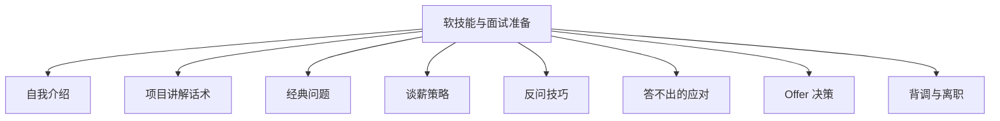
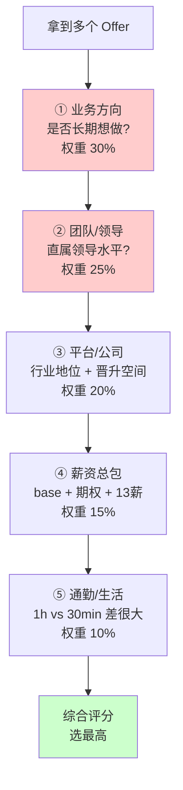

# 23 软技能与面试准备 · 速记知识图谱（P0-P3）

> 模块定位：技术过硬不够，**表达 / 谈薪 / 反问 / 心态**也得专业。高级岗的"无形门槛"。13 题。
> 题量：13 题。



### 必备核心

#### 自我介绍三档模板
- **30 秒电梯版**：姓名 + N 年 Java 经验 + 当前公司业务方向 + 最近做的核心项目一句话 + 自己的核心技术栈定位。
  - 例："您好，我是 X，5 年后端经验，目前在 A 公司做电商订单系统，最近主导了订单中心从单体到微服务的拆分，技术栈以 Java + Spring Cloud + MySQL + Redis 为主，对高并发和性能调优比较熟悉。"
- **2 分钟标准版**：30 秒版 + 2-3 个项目亮点（业务背景 + 你的角色 + 关键产出）+ 简短的职业规划。
- **5 分钟深度版**：完整职业经历 + 项目 + 技术成长曲线 + 跳槽动机 + 未来规划。一面才用。
- **关键**：自我介绍是面试官**给你引导话题的钩子**，主动放亮点（你想聊什么就在介绍里露什么）。
- 关联题：#0249

#### 项目讲解 STAR 模型
- **S（Situation 背景）**：业务背景 + 项目目标 + 团队规模。"我们做的是 X 电商平台，DAU 500 万，订单峰值 5 万 QPS。"
- **T（Task 任务）**：你的角色 + 具体职责。"我负责订单中心的重构，目标是把单库 QPS 瓶颈解决掉。"
- **A（Action 行动）**：技术方案 + 关键决策 + 踩过的坑。"我们做了分库分表（按 user_id 16 库 16 表 + 基因法），用 ShardingSphere，期间遇到二次扩容问题，最后用..."
- **R（Result 结果）**：量化产出 + 业务价值。"上线后单库 QPS 提升 10 倍，订单峰值能扛到 8 万 QPS，大促未发生超卖事故。"
- **顺口溜**：聊项目=讲场景 + 报角色 + 述方案 + 出数据。
- 关联题：#0249

#### 经典问题应对（"为什么离职"等）
- **"为什么离职"**：避免抱怨前公司 / 同事 / 领导（红线）。
  - 推荐方向：① 业务到瓶颈、想换更大平台；② 技术栈想升级（如想做高并发 / 大数据 / AI）；③ 个人发展需要更系统的成长；④ 公司业务调整（被动但中立）。
  - **千万别说**：薪资低、加班多、和领导不合、被裁员（除非确实如此且能诚实简述）。
- **"你的缺点"**：选一个"是缺点但能转化为优点"的——如"我有时候过于追求技术细节，会在某些不重要的地方花太多时间，但近一两年我刻意训练抓重点的能力，定期反思 ROI"。
  - 避免说"工作太拼" / "太追求完美"（被识破套路）。
  - 也别真说大缺点（如"我有点拖延""我不太擅长沟通"）。
- **"职业规划"**：3 年内成为 X 领域专家 + 5 年做技术负责人 / 架构师。要展现野心 + 务实。
- **"为啥选我们"**：业务方向感兴趣 + 技术栈匹配 + 公司发展前景 + 团队氛围（可在面试官身上多挖一些信息）。
- **"加班怎么看"**：理性看待——大促 / 紧急上线必要时可以，长期 996 不可持续；好的工程师应该能在合理时间内解决问题。
- 关联题：#0249

#### 谈薪策略
- **谈薪三大原则**：① 把数字往高了说但要有依据；② 别先报数；③ 谈期望薪资时要 base + 绩效 + 13/14 薪 + 期权打包谈。
- **先了解市场行情**：脉脉 / OfferShow / 看准 / 找熟人打听同公司同级别薪资。
- **报期望**：报"涨幅 30%+ 的目标包"，留谈判空间。如现在 30K × 16，期望 40K × 16 或 35K × 16 + 期权。
- **被反压**：HR 说"我们薪资范围只能 32K"——可以争取签字费 / 多发月数 / 期权 / 高 base 低绩效结构 / 调级补偿。
- **避免**：① 暴露当前真实薪资底牌（说"可议"或对接前主动算总包）；② 太早松口（一上来就接受）；③ 多家面试不互相披露。
- **背调风险**：会查税前流水 / 公积金缴纳基数，撒谎容易翻车——可以包装年终奖 / 期权但月薪要真实。

#### 技术问题答不上时的应对
- **千万别硬编**：面试官能听出来在瞎说。
- **诚实 + 有思考方向**：
  - "这块我不太熟悉，但我感觉应该和 X 类似，可能涉及 Y 机制——您能稍微提示一下吗？"
  - "这个我没实际用过，但我知道 X 框架有类似能力，原理是 Y..."
- **不会就说不会**：直接答"这个我确实不熟悉，但回头会去研究一下，请问您能简单说说吗？"——保持学习态度。
- **绕到擅长领域**："我们项目里没用过这个，但有个类似场景我用 X 方案解决了，您看是相通的吗？"——巧妙引导。

#### 反问环节标配问题
- **业务**：你们团队目前业务方向是什么？接下来 1 年的目标？哪些挑战？
- **技术**：技术栈用什么？有什么自研 / 开源贡献？技术评审 / Code Review 流程？
- **团队**：团队规模、构成、汇报关系？有几个高级 / 资深？
- **个人**：如果我入职，前 3 个月主要做什么？怎么衡量我的表现？
- **公司**：业务增长情况？最近有什么大动作？
- **避免**：薪资（HR 阶段问）、福利（显得太计较）、太具体细节（如几点下班、能不能 WFH，给人功利印象）。
- 关联题：#0249

#### Offer 决策（多 offer 怎么选）
- **优先级排序**：业务方向 > 团队 > 平台 > 薪资 > 通勤。
  - **业务方向**：是不是你想长期做的？业务规模和增长？
  - **团队**：直属领导 + 同事水平（一面二面感受 + 内推打听）。
  - **平台**：公司在行业的位置？是否有学习/晋升机会？
  - **薪资**：base + 期权 + 绩效 + 13/14 薪 + 通勤补 / 餐补，算成"年总包"对比。
  - **通勤**：1 小时 vs 30 分钟，长期影响生活质量。
- **避免**：仅看薪资 → 进了不适合的环境，1 年后又跳槽。
- **慎重考虑**：① 拿到口头 offer 没正式签字时，对方可能反悔；② 已交辞职信再被新东家放鸽子风险大。



```
薪资总包计算示例 (年):

  Offer A:  base 30K × 16薪 = 48万  + 期权 1万 = 49万  + 通勤 1h
  Offer B:  base 35K × 14薪 = 49万  + 期权 0    = 49万  + 通勤 30min
  Offer C:  base 28K × 18薪 = 50.4万 + 期权 3万 = 53.4万 + 通勤 1.5h
  
  纯看薪资 C > A ≈ B
  综合权重: B (通勤好+月薪高现金流稳定) > A > C  ← 因人而异
```

### 加分技巧

#### 简历包装的边界
- **可以包装**：① 技术深度（用了 redis → 改成"主导 Redis 集群方案"）；② 业务表述（CRUD → 改成"商品中台核心模块"）；③ 量化数据（"性能提升" → "QPS 提升 X 倍，RT 从 100ms 降到 30ms"）。
- **不能撒谎**：① 没做过的项目说做过（深挖必翻车）；② 不会的技术说精通（追问基础概念就露馅）；③ 离职时间断档不能撒谎（背调能查）；④ 学历 / 工作单位 / 职级不能造假。
- **原则**：把真实做过的事写得有价值、有思考；不要凭空捏造。

#### 不同年限 / 方向面试侧重
- **应届 / 1-3 年**：八股 + 算法 + 简单项目；表现学习能力 + 基础扎实。
- **3-5 年**：项目深度 + 系统设计 + 八股；要能讲清楚自己做过的项目背景 + 难点 + 方案。
- **5-8 年**：架构 + 业务理解 + 软技能（带过人？跨团队推动过事？）；八股变浅，重点考察"判断力"。
- **8 年+**：技术战略 + 团队 + 业务价值；几乎不问八股，聊"为什么这么决策" / "你怎么思考问题"。
- **方向差异**：
  - 业务后端：业务理解 + Spring + DB + 高并发。
  - 中间件 / 基础架构：源码（Spring / Netty / RocketMQ）+ 性能调优 + 分布式。
  - AI 应用：LLM 工程化 + Prompt + RAG + Agent。

#### 大厂 vs 中厂 vs 创业公司风格
- **大厂（BAT / 字节 / 美团）**：流程长（4-6 轮）、八股深、系统设计重要、HR 严谨；待遇规范、晋升体系完整、但螺丝钉感强。
- **中厂（独角兽 / 二线）**：3-4 轮、业务为主、技术深度中等；待遇可观、有成长空间。
- **创业公司**：1-2 轮、看重综合能力 + 创业意愿；待遇看融资轮次 + 期权预期；风险高但成长快。

### 避坑要点

#### 面试焦虑 / 心态调整
- **接受不完美**：一场面试答不出几个问题正常，关键是整体表现 + 关键题答对。
- **提前模拟**：找朋友 / 内推渠道 mock；录自己的回答听一遍。
- **多面**：同时面 5+ 家，分散预期 + 横向对比 + 谈薪有筹码。
- **放平心态**：双向选择，你不是求职位，是看公司值不值得你去。

#### HR 套话识别
- "你期望薪资是多少？" → 别先报数，反问"贵司这个 level 的薪资范围大概是？"。
- "你还在面其他公司吗？" → 实话说有但别透露细节；表明会综合考虑。
- "你最快什么时候能入职？" → 给一个合理范围（30 天 / 45 天），不要承诺太快（影响交接和谈判筹码）。
- "我们这边竞争挺激烈的" → 这是话术，别被吓到；如果他们真不要你不会浪费时间面你。
- "薪资 base 我们最多给 X" → 试探，可争取期权 / 签字费 / 绩效。

#### 背调要点
- **常查项**：① 工作单位 + 时间（社保 / 公积金 + 离职证明）；② 职级 / 头衔（前同事 / HR 确认）；③ 薪资（部分公司只看流水）；④ 离职原因；⑤ 工作表现（前同事 360 度）。
- **避免**：① 工作单位造假（社保一查就翻车）；② 在职时间撒谎（差 1 个月也不行）；③ 不留好前同事关系（背调时差评）。
- **背调时机**：通常 offer 签字前 / 入职前；高级岗背调更深入。

#### 离职手续与竞业
- **离职流程**：① 提前 30 天书面提交（试用期 3 天）；② 工作交接（写交接文档）；③ 拿离职证明（必须，新公司要）；④ 社保 / 公积金转移 / 封存。
- **竞业协议**：① 入职时签的；② 离职后 N 个月（一般 6-12 个月）不能去竞品；③ 公司付**月薪 30%-50%** 的竞业补偿；④ 违反竞业罚款（一般违约金 = 离职前年薪 × N 倍）。
- **判断**：① 看是否签了 + 范围（哪些公司算竞品）+ 期限；② 是否真的拿到补偿（不发补偿你也不用守约）；③ 大厂竞业范围越来越广，规避难度大；④ 实在要去竞品，咨询律师。

### 临场应对

#### 面试中的"信号"识别
- **正向信号**：面试官聊技术细节越来越深、聊到团队 / 待遇 / 入职时间、主动 sell 公司、问"还面了哪些公司"。
- **负向信号**：面试 15 分钟结束、聊得很表面、面试官心不在焉、说"我们再考虑下"无下文。
- **没消息**：超过 1 周没回复通常是挂了；可以主动问一次 HR，再没回应就转向下家。

#### 加分细节
- 准时（提前 5 分钟到 / 视频面提前 5 分钟进会议室）。
- 着装得体（互联网公司休闲商务即可，金融 / 政府正式装）。
- 视频面 / 电话面**戴耳机**（音质好 + 显得专业）。
- 带简历纸质版（线下）。
- 面完发感谢邮件（小细节，加分）。

### 跨模块联想

- 项目讲解 ↔ **22 面经**：STAR 模型套到具体面经。
- 自我介绍 ↔ **22 面经**：30 秒 / 2 分钟 / 5 分钟三版按场合选。
- 简历包装 ↔ **22 面经**：高频面经项目（订单 / 秒杀 / 中台 / Agent）的描述方式。
- 谈薪 ↔ **22 面经**：知道行业行情才能砍价。
- 反问 ↔ **08 微服务**：问技术栈、问 Code Review、问技术评审，体现思考维度。
- 答不上 ↔ **整个知识体系**：知识网络越完整，绕话题的能力越强。
- 心态 ↔ **23 软技能**：长期面试要节奏，别一两次失败就崩。

---
